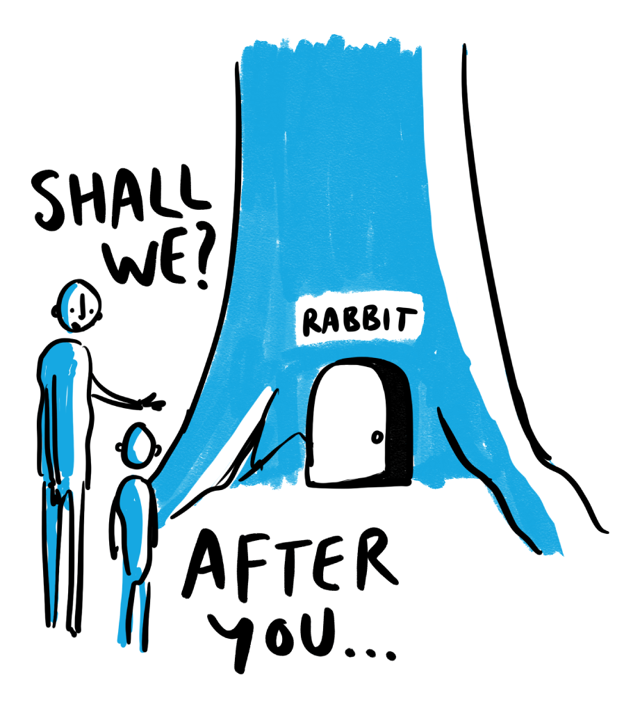
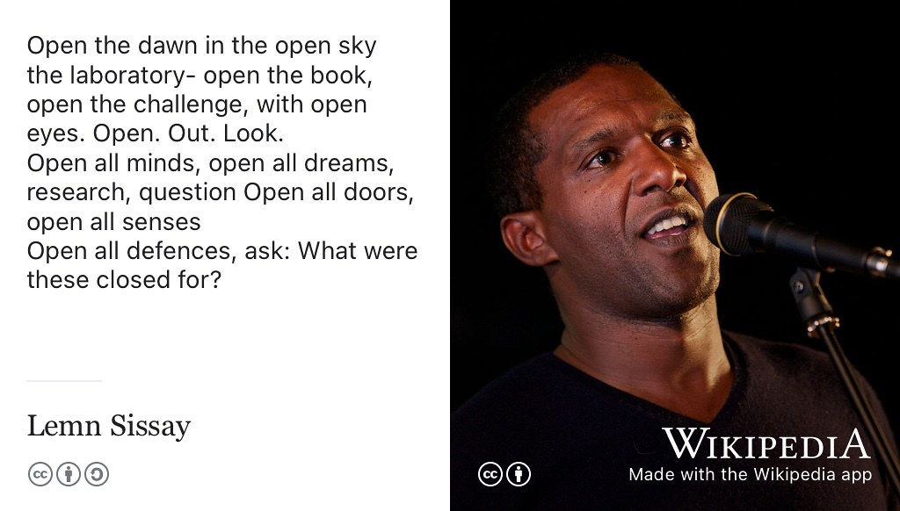
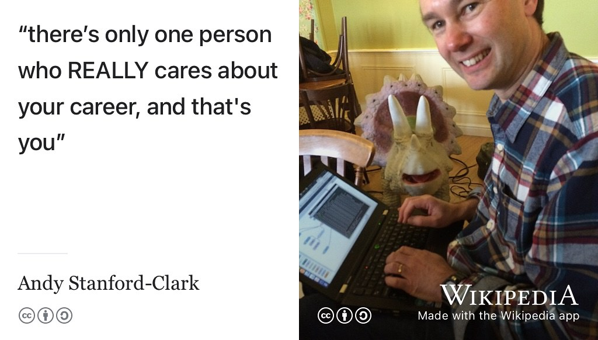
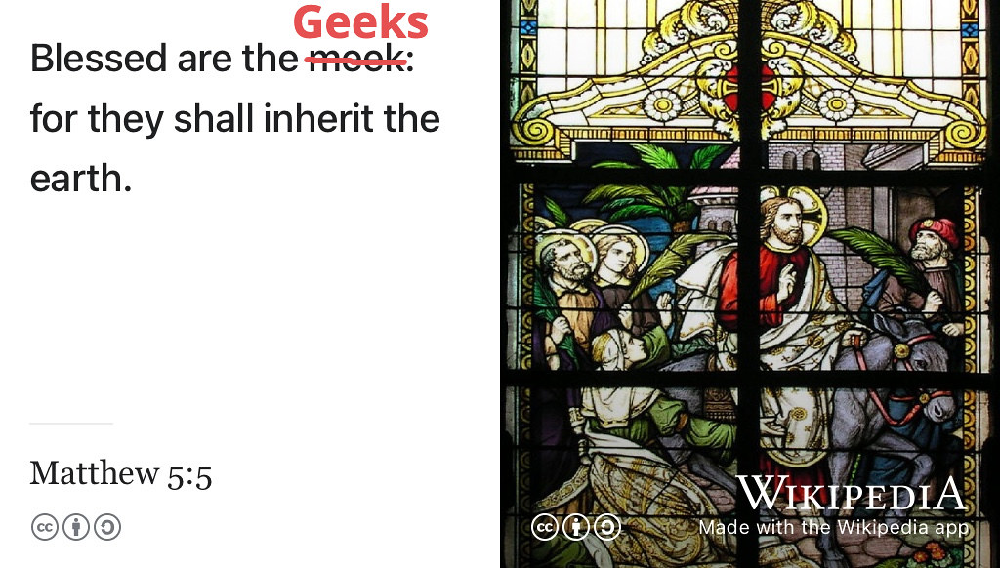
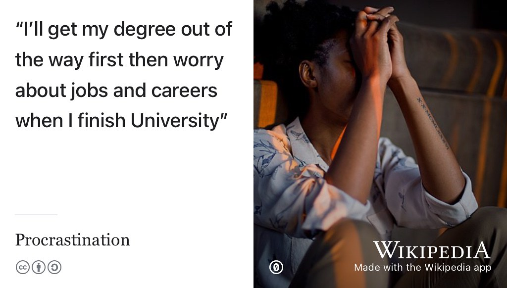
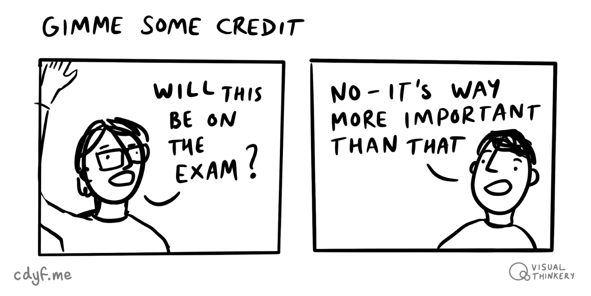
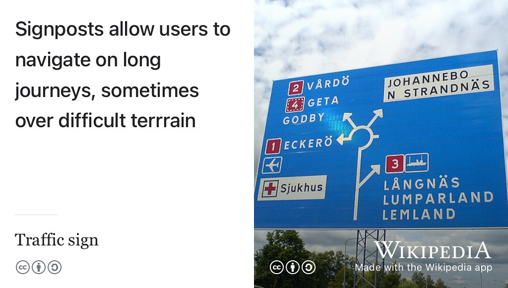
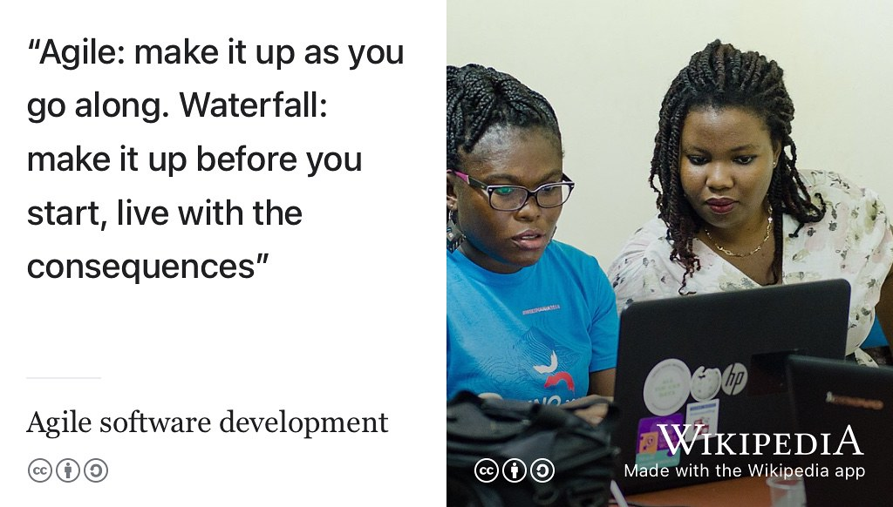
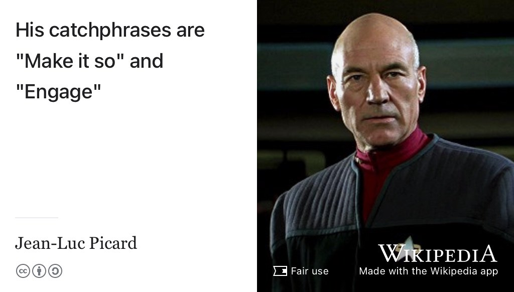

# (PART) DESIGNING {-}

# Rebooting your future {#rebooting}

The first part of this book is about *designing* your future. Before we get started, we need to reboot and tackle a fundamental design issue. Why the hell would you want to bother reading this guidebook when you have so many other things to do right now?

 * ✅  You are a busy person, YES!
 * ✅  Your time is a precious and finite resource, YES!
 * ✅  You could be spending that precious time right now in lots of other ways, YES!
 * ✅  There are mountains of self-help guides and courses already, YES!
 * ✅  Do you really need *yet another* guidebook? YES! YES! YES!

You should read this guidebook because it is different to all the other guidebooks! It will help you design, test, build, debug and `code` your future in computing.

Before you start coding, we need to reboot. Come with me down the rabbit hole in figure \@ref(fig:rabbit-fig) and let me explain... 🐇

```{r rabbit-fig, echo = FALSE, fig.align = "center", out.width = "70%", fig.cap = "(ref:captionrabbit)"}

```

(ref:captionrabbit) Shall we go down the rabbit hole? [Rabbit Hole learning](https://bryanmmathers.com/rabbit-hole-learning/) by [Visual Thinkery](https://visualthinkery.com) is licensed under [CC-BY-ND](https://creativecommons.org/licenses/by-nd/4.0/)

## What you will learn {#ilo1}
After reading this chapter you will be able to reboot your future by :

1. Setting your expectations for using this guidebook, and open some doors to your future
1. Travelling down the rabbit hole into the underworld of employment
1. Discussing some of the gaps that exist between formal education and employment and how you can bridge them

## Let's go down the rabbit hole {#wonderland}

In the novel *[Alice's Adventures in Wonderland](https://en.wikipedia.org/wiki/Alice%27s_Adventures_in_Wonderland)* [@wonderland], the protagonist Alice follows a [white rabbit](https://en.wikipedia.org/wiki/White_Rabbit) down a hole. What she discovers is a strange underground world populated by weird and wonderful characters. The world of work can sometimes be a mysterious underworld where you adventure in wonderland accompanied by colourful characters.

You will spend lots of time in this wonderland, potentially as much as 80,000 hours of your life. [@iip1; @iip2] So join me down the rabbit hole, it's fun (honest), and sooner or later you'll have to come down here anyway. So open up the door to the new possibilities in your future.

## Opening your future {#opening}
Studying at University opens new doors to your future, some of which will take you down rabbit holes. As the poet [Lemn Sissay](https://en.wikipedia.org/wiki/Lemn_Sissay) puts it (figure \@ref(fig:lemn-fig)):

```{r lemn-fig, echo = FALSE, fig.align = "center", out.width = "99%", fig.cap = "(ref:captionlemn)"}

```

(ref:captionlemn) Open all doors, open all senses, open all defences, ask: What were these closed for? From *Inspire and be Inspired* by [Lemn Sissay](https://en.wikipedia.org/wiki/Lemn_Sissay) whose poetry is even better when you hear it, rather than just read it [youtu.be/WzZs1w3NWzg](https://youtu.be/WzZs1w3NWzg). [@sissay] Portrait of Sissay speaking in 2010 by Philosophy Football via Wikimedia Commons [w.wiki/3VYT](https://w.wiki/3VYT) adapted using the [Wikipedia app](https://apps.apple.com/gb/app/wikipedia/id324715238)

So University is a fantastic opportunity for you to open lots of new doors in your life and see where they take you.

## Maximising your future {#roi}
As well as opening your future, studying at University is about *investing* in your future. You're spending lots of your time and money at University. Hopefully, you've picked a subject that stimulates and challenges you intellectually while allowing you to find and develop your unique talents. But there's another reason that you probably chose to study at University and that was to improve your job prospects. This guidebook will:

1. Help you maximise the [return on investment](https://en.wikipedia.org/wiki/Return_on_investment) (ROI) of the substantial amount of your time and money you have already put into your education, from high school through to University
1. Give you an overview of important professional issues that are sometimes neglected or sidelined in school and University curricula
1. Highlight and review essential resources beyond this guidebook that will help with the above

All of the resources that can help you are scattered around in lots of different places. There are books, there are videos, there are podcasts, there are websites and jobs boards. There are online courses, blogs, social media, newspaper columns, journal articles, marketing material and many other good resources. It is overwhelming.

## Your future is your responsibility {#responsibility}
When Andy Stanford-Clark started working at IBM as a graduate fresh out of University, his manager gave him the career advice shown in figure \@ref(fig:andysc-fig):

```{r andysc-fig, echo = FALSE, fig.align = "center", out.width = "99%", fig.cap = "(ref:captionandysc)"}

```
(ref:captionandysc) There's only one person who REALLY cares about your career, and that's you. Quote via [Andy Stanford-Clark](https://en.wikipedia.org/wiki/Andy_Stanford-Clark) [@andystanfordclark] to an unattributed IBM manager. Image of Andy by Gizmo~enwiki via Wikimedia Commons [w.wiki/3TSn](https://w.wiki/3TSn) adapted using the [Wikipedia app](https://apps.apple.com/us/app/wikipedia/id324715238) Thank you Andy for permission to use your photo.

Andy is now Chief Technology Officer (CTO) of IBM in the UK and an [IBM Master inventor](https://en.wikipedia.org/wiki/IBM_Master_Inventor), so it was probably good advice. There are plenty people who can help design and build your future, ultimately it is **YOU** who has to take responsibility for the implementation (if you like, the `code`). The sooner you get coding the better.

At University, there are lots of people can help design and build your future: peers, friends, academic staff, your careers service, employers and your wider social and professional networks but ultimately it is *your* responsibility to sort out whatever comes next. That might sound obvious but don't wait to get started later or for somebody else to do it for you, because it probably won't happen.

## Your degree is not enough {#entitled}
<!--Luke comments: One thing I would add in this section that you don't really think about until you go through it is the difference between going for a CS job and that job you really want. Most grads will get a job in CS, but few will get those really prized ones that they really enjoy.-->
You have worked hard to get the grades you needed to get into University. You've spent (or are spending) a significant amount of time and money studying your chosen discipline. You are really *geeking out* by going deep into your subject for a substantial period of time. Geekery, by which I mean [being interested in a subject for its own sake](https://en.wikipedia.org/wiki/Geek), is a *good* thing. Earning the title *geek* is a compliment, not an insult, and you should wear your geek badge with [geek pride](https://en.wikipedia.org/wiki/Geek_Pride_Day)!  Some people even say:

* The geeks will inherit the earth, see figure \@ref(fig:geekout-fig)
* The (geeky) weirdness flows between us, anyone can tell to see us [@freakscene]

**YOU** are a geek, so where is *your* inheritance?

```{r geekout-fig, echo = FALSE, fig.align = "center", out.width = "99%", fig.cap = "(ref:captiongeekout)"}

```
(ref:captiongeekout) [Blessed are the ~~meek~~ geeks, for they shall inherit the earth](https://en.wikipedia.org/wiki/Matthew_5:5). [@inherit; @blessed] You are a geek, so where is your inheritance? Image of stained glass window by Norbert Schnitzler via Wikimedia Commons [w.wiki/43LN](https://w.wiki/43LN) adapted using the [Wikipedia app](https://apps.apple.com/us/app/wikipedia/id324715238)

As a studious geek you might be tempted to believe that the world owes you something in return for all your geekiness. Unfortunately that's not the case.

At some point during or after your study, you might find yourself applying for a graduate job or graduate scheme. EVERYONE applying for these opportunities will have a degree or be rapidly on their way to getting one. So having a degree, even a really geeky one, isn't going to set you apart much from your competition. Even having a first class degree may not distinguish you that much your competitors [@gradeinflation; @firstclass]. Some employers would rather not know (or don't care) what University you went to, so your education might not make you stand out as much as you might like anyway. [@bigfour; @eyfirm]

<!--Reducing the Stress of Perfectionism
Perfectionism has a way of robbing us of that glow of achievement and ultimately making us miserable. Having high standards is good but not if they make everything in life so challenging that we are exhausted before we have even started!

If you find that you are never really satisfied with your achievements, spend a lot of time procrastinating rather than working and are increasingly self-critical, then this could be the workshop for you. You will learn:

* About the psychology of the perfectionist
* how perfectionism becomes self-defeating.
* ways of challenging the rigid perfectionist mindset

Reducing the Stress of Perfectionism
https://www.counsellingservice.manchester.ac.uk/workshopsfurtherinformation/reducingthestressofperfectionism/

The dangerous downsides of perfectionism
https://www.bbc.com/future/article/20180219-toxic-perfectionism-is-on-the-rise
-->

What **WILL** distinguish you from your competitors is:


* your `experience`: see chapter \@ref(experiencing)
* your `projects`: see section \@ref(mycvpj)
* your communication skills:
    - Writing: see chapter \@ref(writing)
    - Speaking: see chapter \@ref(speaking)
    - Listening: see chapter \@ref(hearing)
    - Reading: see chapter \@ref(reading)
* your actions: what have you **done** with all of the above? How have you applied these fundamental communication skills to perform higher level communication tasks such as understanding, negotiating, persuading and leading etc. See examples of actions in chapter \@ref(actioning)
* your `results` and `evidence`: see `C.A.R.E` in section \@ref(care): context, action, results and evidence. We're talking about all your results, not just exam results.
* any `leadership` you can demonstrate or `awards` that you have picked up along the way, see section \@ref(prizes)

If you think that your degree will be enough to get you the job you want, bear in mind that:

<!--Some employers are agnostic to where your degree came from, or how you did at high school, to your academic credentials
https://www.independent.co.uk/news/education/education-news/ey-firm-says-it-will-not-longer-consider-degrees-or-a-level-results-when-assessing-employees-10436355.html
-->

1. There are more and more graduates, the UK for example recently passed the milestone of 50% of young people going into higher education. This compares to just 15% of over 18s who stayed in higher education in 1980 [@lotsofgrads]
1. While a degree is a *necessary* condition for joining a graduate scheme or taking a graduate job it is [not a *sufficient* condition](https://en.wikipedia.org/wiki/Necessity_and_sufficiency). Having a degree will not set you apart much from your competition, every applicant will have a Bachelors degree. <!--used to be grad scheme growth slower than increase in grad but this is possibly a myth -->
1. There are lots of graduates in your discipline. In the UK, for example, around 9,000 students graduate every year in Computer Science. If you're studying in the UK, what makes you different from the other 8,999 computer scientists graduating in your year?


```{r lotsofgrads-fig, echo = FALSE, fig.align = "center", out.width = "100%", fig.cap = "(ref:captionlotsofgrads)"}
library(ggplot2)
lotsofgrads <- tribble(
  ~year,         ~percentage,
  "1980",       15,
  "1990",       25,
  "2018",       50
)

ggplot(data = lotsofgrads) +
  geom_bar(mapping = aes(x = year, y = percentage), stat = "identity")
```
(ref:captionlotsofgrads) Percentage of young people in the UK going into higher education between 1980 and 2018. Over the last forty years, the proportion of young people going into higher education has more than doubled from 15% in 1980 to over 50% in 2018. Data taken from BBC news article on [the symbolic target of 50% at university reached](https://www.bbc.co.uk/news/education-49841620) [@lotsofgrads]

As [Sally Fincher](https://en.wikipedia.org/wiki/Sally_Fincher) puts it:

> Computing is one of the largest subject areas in UK higher education, and is taught in almost every institution, graduating around 9,000 students every year
> `r tufte::quote_footer('--- Sally Fincher [@fincherreview]')`

Now, don't be disillusioned by the statistics because any degree can open doors to many careers in computing. Studying *computing* opens up plenty of doors, see figure \@ref(fig:nurses-fig). According to [Charlie Ball](https://twitter.com/lmicharlie), it is a myth that there aren't enough graduate jobs; one of four myths in the UK about the graduate labour market:

* **Myth 1:** *Everyone goes to university nowadays* : ~50% isn't everyone [@ballmyths]
* **Myth 2:** *There aren’t enough graduate jobs* [@ballmyths]
* **Myth 3:** *Some degrees have little value to employers*, see chapter \@ref(computing)
* **Myth 4:** *All the best graduate jobs are in London*, (or your local big city) see chapter \@ref(moving)

```{r eval=knitr::is_html_output(excludes = "epub"), gsoc-tweet-fig, echo=FALSE, fig.cap = "test caption"}
library(tweetrmd)
include_tweet("https://twitter.com/UniversitiesUK/status/1513439211059306497")
```

What the data in figure \@ref(fig:lotsofgrads-fig) show is that you'll need to look **beyond** your formal education to distinguish yourself from your competition. Your degree can certainly help you start a career, and computer geekery is a commercially valuable skill but a degree (however geeky) is typically not enough by itself.

There's plenty of graduate jobs for you to apply for, but that doesn't mean its going to be easy to walk into one when you graduate. Employers are looking for more from their employees than just *having* a degree, see chapter \@ref(experiencing).

## It's too late when you graduate {#thisstuffmatters}

You might be tempted to postpone making difficult career decisions:

* I'll do it tomorrow ...
* I'll do it next week ...
* I'll do it next year ...
* I'll finish this assignment ...
* I'll finish this exam ...
* I'll finish this semester ...
* I'll finish my degree first, see figure \@ref(fig:procrastination-fig) ...

Procrastination is a part of the [human condition](https://en.wikipedia.org/wiki/Human_condition). Software engineer [Paul Graham](https://en.wikipedia.org/wiki/Paul_Graham_(programmer)) calls this [good and bad procrastination](http://paulgraham.com/procrastination.html) [@procrastination].

```{r procrastination-fig, echo = FALSE, fig.align = "center", out.width = "99%", fig.cap = "(ref:captionprocrastination)"}

```

(ref:captionprocrastination) [Procrastination](https://en.wikipedia.org/wiki/Procrastination): the attitude of “I’ll get my degree out of the way first then worry about jobs and careers when I finish University” is bad procrastination. It's too late when you graduate to start thinking about what might come next [@procrastination] Stresssed procrastinator picture by MismibaTinasheMadando on Wikimedia Commons [w.wiki/3TXo](https://w.wiki/3TXo)

Postponing decisions about your future is usually bad procrastination, because you're relying on doing all the testing at the end, when you graduate. You are procrastinating the `testing` stage of your career development.


* “test-last (career) development”
* “test-driven (career) development” ([TDD](https://en.wikipedia.org/wiki/Test-driven_development))


It probably doesn't help that many of issues described and discussed in this book are typically not closely integrated into the curriculum in Higher Education. You'll often find them on the edges, or completely outside of, standard University curricula.

<!--Broadly speaking, the professional issues described in this book are usually covered by

* pastoral support systems
* counselling services
* careers services
* trade organisations
* professional bodies
* student unions and their societies.-->

Despite being sidelined, these issues matter and it is in your own self interests to start thinking about them right now. According to recent estimates by *Investors in People*, the average person spends **80,000 hours** working during their lifetime. [@iip2] So, *whatever* you end up doing after University, you'll be spending a lot of time doing it. Difficult decisions often get sidelined but it is never too early to start thinking about them and doing something.

If you want to work for a big name like those in section \@ref(bignames) or \@ref(studentjobs), many of the larger graduate employers expect you to have *some* experience (see chapter \@ref(experiencing)) *before* you graduate. A large chunk of vacancies on graduate schemes are filled people who have already been employed as interns or placement students within that (or another) organisation. So the sooner you start investigating employers by getting some experience the better decisions you'll be able to make about what comes next. It's (usually) too late when you graduate.

That doesn't mean you have to know EXACTLY what you want to do when you finish. Lots of students don't and I certainly didn't when I graduated. I'd done a gap year teaching in India, two summer internships (in Sweden and the United States) and a year-in-industry in the UK and I *still* graduated with **no clue** as to what I wanted to do next! The important thing is that you make a start by getting some experience, paid or otherwise, see chapter \@ref(experiencing).  Sometimes knowing what you **don't** want to do is just as valuable as knowing what you *DO* want to do. Either way, your future starts now, see figure \@ref(fig:future-now-fig).

```{r future-now-fig, echo = FALSE, fig.align = "center", out.width = "99%", fig.cap = "(ref:captionfuturenow)"}
knitr::include_graphics("images/the-future-is-now.jpg")
```

(ref:captionfuturenow) Your Future starts now, not at some point later in time like when you graduate. Whatever stage of your study you are at, there's plenty you can do to start *experiencing your future* today, see chapter \@ref(experiencing). Experience will make it easier to navigate your future. *THE FUTURE IS NOW* by Everydayphrase [linktr.ee/everydayphrase](https://linktr.ee/everydayphrase)


Computer scientists call this problem “search space reduction” [@searchspace]. You have a [feasible region](https://en.wikipedia.org/wiki/Feasible_region) of future possibilities and you need to narrow down the candidates. You could think of coding your future as an [optimisation problem](https://en.wikipedia.org/wiki/Optimization_problem). Start optimising now, by getting some experience because it's too late when you graduate. 🎓


## Yes, this WILL be on the exam {#exams}

Students love to ask their teachers “*will this be on the exam*”? The short answer is **YES** (and **NO**)! Yes, this will be on the exam, but NO the exam won't be set by your University. Unlike other courses you've done, the examinations for this course aren't set by your University but by employers.  Roughly speaking, there are three kinds of examinations that you'll need to get good at, shown in Table \@ref(tab:examtable)

:  (\#tab:examtable) Examining your future: The "exams" used by employers, what gets assessed and the grades you can get. For written "exams" see chapters \@ref(writing) and \@ref(debugging), for speaking "exams" see chapter \@ref(speaking) and for your employee "exams" see chapter \@ref(surviving).

+---------------------+--------------------------------------------+----------+
| Examination         | What examiners are assessing               | Grade    |
+=====================+============================================+==========+
| CV, application form| - Should we invite you to interview ?      | pass/fail|
| covering letter     | - Can you communicate well in writing?     |          |
|                     | - Do you have any experience?              |          |
|                     | - What interesting projects have you done? |          |
+---------------------+--------------------------------------------+----------+
| Interview           | - Should we offer you a job?               | pass/fail|
|                     | - Would we want you on our team?           |          |
|                     | - Can you communicate well verbally?       |          |
|                     | - Can you communicate well nonverbally?    |          |
+---------------------+--------------------------------------------+----------+
| Employee performance| - Should we promote you?                   | pass/fail|
|                     | - Should we give you a pay rise?           |          |
|                     | - Should we extend your contract?          |          |
+---------------------+--------------------------------------------+----------+


So, *yes*, this will be on the exam, but *no*, the exams are obviously not set, administered, invigilated and marked by academics at your University. The exams are set by employers and the results are **brutally binary**:

* **PASS**: you've got the interview, job or promotion or...
* **FAIL**: none of the above. Next!

One of the challenging things about employers exams are, they typically do not have the bandwidth to give applicants useful feedback, other than a simple pass or fail. When it comes to job applications software engineer [Gayle Laakmann McDowell](https://en.wikipedia.org/wiki/Gayle_Laakmann_McDowell) calls this the "black hole". The gravitational force of employers black holes is so strong that no CV or Résumé can escape, we'll say more about this in chapter \@ref(debugging) on debugging your future.

```{r exam-fig, echo = FALSE, fig.align = "center", out.width = "100%", fig.cap = "(ref:captiongimme)"}

```
(ref:captiongimme) So *no* this will not be on the exam set by University, but *yes* it will be on the exams set by employers. Some of the most important exams you sit at (and after) University are set by employers. This guidebook will help you prepare for those exams and increase your chances of passing them. Gimme some credit figure by [Visual Thinkery](https://visualthinkery.com/) is licensed under [CC-BY-ND](https://creativecommons.org/licenses/by-nd/4.0/)

It's a similar story with interviews, if you fluffed an interview question or came across badly, it can be really difficult to find out from the employer what you did wrong. That makes it harder to learn from your mistakes.

## Practicing your future {#activities}
There are practical exercises, for you to get your hands dirty with. Each chapter incorporates activities including individual exercises, group exercises, quizzes and points for wider discussion. You'll get a lot more out of this guidebook by doing the activities, rather than just reading it.

## Navigating your future {#relatedwork}

There are **lots** of resources out there that offer self-help, career advice and techniques for self-improvement. It can be hard to know where to start, or even how to find your way around the mountains of advice.

```{r shelfie-fig, echo = FALSE, fig.align = "center", out.width = "100%", fig.cap = "(ref:captionshelfie)"}
knitr::include_graphics("images/shelfie.jpg")
```
(ref:captionshelfie) There are tonnes of resources out there offering advice on a huge range of professional issues. You can't read them all, but this guide aims to help you navigate the resources that will be most use to you

Lots of professional advice is readily available, but how will you navigate it? This book signposts you to what I think are the most important resources, each chapter has a signposts section, and they are all gathered together in the signpost at the end alongside everything (yes, EVERYTHING!) that this guidebook cites in the references, chapter \@ref(reading).

## Crediting your future {#crediting}
<!-- section needs moving, doesn't fit here-->
Get credit for your contributions. As well as being openly accessible on the web, this book is open source too.  What this means is, you can contribute in several ways described in section \@ref(contributing). All the written content for this guidebook is licensed under CC-BY-NC-ND, see the license in section \@ref(license).

## Your future is different {#thinkdifferent}

I'm writing this guidebook because I need a resource for students to help them design, build, test and code their futures in computing. I need a book to help me teach to students to compete for jobs while at University, or shortly after graduating. I can't find anything suitable that meets all the requirements of the students I teach. Some problems with the resources that are already out there, and how this book addresses them, are shown in table \@ref(tab:difftable)

:  (\#tab:difftable) *Coding your Future* is a guidebook that is different to all the other guidebooks

+---------------------------------------------+--------------------------------------------+
| Other guidebooks                            | *Coding your Future* guidebook             |
+=============================================+============================================+
| - **Expensive** paper-based books           | - **Free** versions for browser, pdf and epub |
| - Inadequate linking, inbound & outbound    |  - Every link is clickable, every section is linkable|
| - Poor citations                            |  - Everything cited, see section \@ref(signposted)|
| - Often can't be searched                   |  - Search by any words you choose          |
+---------------------------------------------+--------------------------------------------+
| - **Born printed**: digital comes second    | - **Born digital**:  paper comes second    |  
| - Websites are crippled “companions” to book| - The website [`www.cdyf.me`](https://www.cdyf.me/) **is  ** the book |
| - Ebook a clumsy afterthought               | - Ebook published simultaneously, see section \@ref(downloading)  |  
| - Video and audio is separate to book       | - Video and audio is integrated & embedded  |       
+---------------------------------------------+--------------------------------------------+
| - **Divorced** from any curriculum          | - **Married**^[computationally wedded to the curriculum with kids and a mortgage] to the computing curriculum  |
| - (ref:notusedforteaching)                  | - Course textbook for COMP2CARS, embedded in the curriculum <!--link-->  |
| - (ref:doingitwrong)                        | - Tailored to computing careers, see chapter \@ref(computing), \@ref(broadening) and \@ref(hearing) |
+---------------------------------------------+--------------------------------------------+
| - **Institution centred**: (ref:institution)| - **Student centred**: (ref:agnostic)      |
| - (ref:studentmute)                         | - (ref:studentvoice)                       |
| - (ref:dehumanised)                         | - (ref:grassroots)                         |
+---------------------------------------------+--------------------------------------------+
| - **Closed** source                         | - **Open** source, see section \@ref(contributing)|
| - Small number of authors & editors         | - Anyone can contribute or comment         |
| - Released late, released seldomly          | - Released early, released often, see section \@ref(version) |
+---------------------------------------------+--------------------------------------------+

<!--horrible table hacks, not pretty but they work-->
(ref:institution) Institutionalised by Universities, employers or advertisers

(ref:agnostic) agnostic to institutions, employers and advertisers

(ref:dehumanised) Top down, corporation driven, formal, bland and sometimes impersonal

(ref:grassroots) Bottom up, grassroots driven, informal, colourful and personal

(ref:notusedforteaching) Not used for teaching, not embedded in curriculum

(ref:doingitwrong) One-size-fits-all, generic, career and discipline agnostic

(ref:studentvoice) Includes student voice, see section \@ref(contributing) and chapter \@ref(hearing)

(ref:studentmute) Often excludes the [student voice](https://en.wikipedia.org/wiki/Student_voice)


<!-- possibly more here personal / impersonal, add cross links -->

To following sections give a bit more detail on the differences outlined in table \@ref(tab:difftable).

<!--Good though these many resources are, they all have their own limitations. Some have dated quickly and are not refreshed, others are published under a restrictive copyright licenses that can prevent reuse, sharing and access. Some resources only tackle a single issue, while many can't easily be adapted for your own needs. -->

<!--Others neglect the student voice or fail to tell the story of students with first-hand experience of a rapidly changing and sometimes brutally competitive job market. Many are written from the point of view of employers, recruiters or careers advisors [@samfranklin]. These people all have valuable advice for students but they often lack first hand experience of working in a given sector and in some cases are trying sell you something! Another common shortcoming is excluding all parts of the story which combine four overlapping perspectives:

1. Students and recent graduates
1. Employers and recruiters
1. Careers advisors, authors and journalists
1. Scientists and engineers, in industry and academia-->

<!--This book aims to combine these perspectives and to be different from existing resources in the following ways:-->

### Your future is signposted {#signposted}
Some career resources claim (or imply) that they are the *all you will need* to solve a particular problem or worse: solve *all of your problems*! Just buy this book, do this course, watch this video, listen to this podcast and all your problems will go away!  Rather than continue this trend, this book **signposts** some of the most useful resources, see figure \@ref(fig:signposting-fig).

```{r signposting-fig, echo = FALSE, fig.align = "center", out.width = "100%", fig.cap = "(ref:captionsignposting)"}

```

(ref:captionsignposting) Wondering which way to go at the [traffic sign](https://en.wikipedia.org/wiki/Traffic_sign)? I've signposted the resources that will help you navigate the start of your professional journey. Which route will you take? Picture of a signpost in the [Åland Islands](https://en.wikipedia.org/wiki/%C3%85land_Islands), Finland by Sal via Wikimedia Commons [w.wiki/3Xop](https://w.wiki/3Xop) adapted using the [Wikipedia app](https://apps.apple.com/us/app/wikipedia/id324715238)

Scientists call signposting **citation**, so I've signposted and cited sources in this guidebook so that you can :

1. Follow them if the destinations are interesting or useful
1. Check and verify any facts and claims I make in this book for yourself

While this guidebook cites lots of resources, some of them are more important than others. Each chapter summarises these in a signposts section. You'll find everything else in the references, chapter \@ref(reading). University and public libraries may also have physical and electronic copies of some of the books listed here.

<!--If you're studying at the University of Manchester, these signposts are available as a library reading list at [library.manchester.ac.uk/search-resources/reading-lists](https://www.library.manchester.ac.uk/search-resources/reading-lists).-->

I'm not suggesting that you read *all* these books right now, but that if a particular chapter has piqued your interest, these signposts are good places to keep going, if you haven't already read them. I hope you'll find these signposts handy for navigating the mountains of advice. Not all who wander are lost. 🗺️🧭

### Your future is guided  {#study}
This guidebook to your future accompanies a course that has been co-designed by students for students, with input from academics and employers. It unites several disparate themes into one coherent story, from fundamental questions about identity and wellbeing through to more applied and practical advice on job hunting, career progression and life after University. Resources that do this are typically scattered around in many different places. There is usually no narrative to tie them all together to help students navigate the mountains of advice as they embark on the first stages of their careers. I'll guide you through the narrative, but it is a *descriptive* story rather than a *prescriptive* one, see figure \@ref(fig:descriptive-fig).

```{r descriptive-fig, echo = FALSE, fig.align = "center", out.width = "100%", fig.cap = "(ref:captiondescriptive)"}
knitr::include_graphics("images/prescriptive-vs-descriptive-pathways.png")
```

(ref:captiondescriptive) Many formal education courses follow a *prescriptive pathway* (right), they lead you through a story from start to finish. This is the way of the University: “`our courses`” - our prospectus. This course is different, it follows a *descriptive pathway* (left) which means you pick your own way through the story. I'll guide you through the story but you'll need to choose *your* way: “`my way`”. Do it [your way](https://en.wikipedia.org/wiki/My_Way). [@sinatra] [Prescriptive vs. descriptive pathways](https://bryanmmathers.com/prescriptive-vs-descriptive-pathways/) sketch by [Visual Thinkery](https://visualthinkery.com/) is licensed under [CC-BY-ND](https://creativecommons.org/licenses/by-nd/4.0/)

Although this is a course guidebook used in undergraduate teaching, you don't need to be enrolled on the course to benefit from reading it, watching the videos and doing the exercises and coding challenges.

### Your future is constantly updated {#version}
You are reading the alpha version, the [Minimum Viable Product](https://en.wikipedia.org/wiki/Minimum_viable_product) (MVP) of this guidebook, last updated on `r format(Sys.time(), '%d %B, %Y')`. That's software engineer talk for saying *it isn't finished yet*. Subsequent versions, will be continuously and iteratively released on a daily and weekly basis. They will include:

* More quizzes for better interactivity
* More videos on the [Coding your Future YouTube channel](https://www.youtube.com/channel/UCLBv_u8JmyUPqmRALIjVnLg)
* Audio interviews with Students in the *Coding your Future podcast* in chapter \@ref(hearing)
* More illustrations throughout the book
* Improved content, finish incomplete chapters
* Fix bugs and typos
* Your suggestions for improvements and corrections, via github etc see section \@ref(contributing)

I'm taking a [release early, release often](https://en.wikipedia.org/wiki/Release_early,_release_often) [@Raymond1999] approach to publishing this guidebook, you could call it agile book development or [continuous book delivery](https://en.wikipedia.org/wiki/Continuous_delivery), see figure \@ref(fig:agile-vs-waterfall-fig) [@realagile]

```{r agile-vs-waterfall-fig, echo = FALSE, fig.align = "center", out.width = "100%", fig.cap = "(ref:captionagile)"}

```

(ref:captionagile) [Agile software developers](https://en.wikipedia.org/wiki/Agile_software_development) make it up as they go along, whereas [waterfalling software developers](https://en.wikipedia.org/wiki/Waterfall_model) make it all up at the beginning and then live with the consequences. It's the same with natural language engineering (books). I'm making it up as I go along, using agile book development methods. Women who code image by Justice Okai Allotey via Wikimedia Commons [w.wiki/3Xnk](https://w.wiki/3Xnk) adapted using the [Wikipedia app](https://apps.apple.com/us/app/wikipedia/id324715238)

### Your future is personal {#firstperson}
A lot of scientific and technical writing is written in the third person or passive voice, which is fine for academic writing, but can alienate readers. I have opted to use first person narrative where possible as it is shorter, and hopefully more engaging for you to read. [@googler] Where relevant, I've told personal stories to illustrate key points.

### Your future has no paywall {#openaccess}
You don't need to pay anything to read this book online because its not hiding behind a [paywall](https://en.wikipedia.org/wiki/Paywall), see section \@ref(license). Publishing this guidebook online makes it findable and accessible, something that isn't true of knowledge locked up inside other books.

Because this guidebook is online, it is searchable, browsable and linkable. You can link to whatever level you like, top level, chapter level and to every section and subsection level. Everything important has a Uniform Resource Locator ([URL](https://en.wikipedia.org/wiki/URL)).

<!--###
The FAIR principles have been followed in writing this book.[@FAIR] not really interoperable or reusable?
There are algorithms {#algo}
We've suggested some algorithms to help you start.
They're not ready yet-->

### Your future has no login {#nologin}
You don't need to login to anything to use this guidebook either. Hurrah! One less password to remember.

### Your future is audible and watchable {#av}
This book is not just words and pictures, but includes audio and video as well, especially:

1. videos produced by third parties that are worth watching
1. audio produced by third parties that are worth listening to, either individual episodes or whole series
1. short videos produced by me, which augment the written content of this book, see the [Coding your Future YouTube channel](https://www.youtube.com/channel/UCLBv_u8JmyUPqmRALIjVnLg)
1. the *coding your future* podcast which interviews undergraduate students, see chapter \@ref(hearing)

## Engaging with your future {#engage}
I've tried to make the content of this book as engaging as possible by including pictures and conversations. *Your future* is deliberately playful and light-hearted. If you think this guidebook can be improved, let me know via the mechanisms described in section \@ref(contributing). I always welcome constructive feedback, especially when it comes via a pull request. Engage, see figure \@ref(fig:startrek-fig).

```{r startrek-fig, echo = FALSE, fig.align = "center", out.width = "100%", fig.cap = "(ref:captionstartrek)"}

```

(ref:captionstartrek) This is Captain [Jean-Luc Picard](https://en.wikipedia.org/wiki/Jean-Luc_Picard) of the Starship *Enterprise*. Engage! Fair use image of actor [Patrick Stewart](https://en.wikipedia.org/wiki/Patrick_Stewart) performing in *Star Trek* adapted using the [Wikipedia app](https://apps.apple.com/us/app/wikipedia/id324715238). Make it so.

## Signposting your future {#sign1}

Each chapter in this book has a signposts section, highlighting key reading, watching or listening you could do next. This chapter has addressed the question of **why should you bother coding your future**? The answer is that your future is your responsibility and no-one elses. There are lots of people can help shape your future, but none more than yourself. Software engineer [Robert C. Martin](https://en.wikipedia.org/wiki/Robert_C._Martin) argues this point in his book *The Clean Coder: A Code of Conduct for Professional Programmers*. [@cleancoder]

What's good about *The Clean Coder* is that it is short (only 200 pages), well written and to the point. The main part of the book covers professional issues in software engineering, some of which I discuss further in chapter \@ref(surviving), *surviving your future*.


## Summarising your future {#tldr1}

If all that was [too long, didn't read](https://en.wiktionary.org/wiki/too_long;_didn%27t_read) (TL;DR) for you, then you'll be relieved to hear that each chapter has a TL;DR (executive) summary.

```{r tldr-fig, echo = FALSE, fig.align = "center", out.width = "100%", fig.cap = "(ref:captiontldr)"}
knitr::include_graphics("images/tldr.jpeg")
```

(ref:captiontldr) There's always more stuff you should be [reading](https://en.wikipedia.org/wiki/Reading). If this guidebook is a bit **Too Long, Didn't Read** (TL;DR) then each chapter has a brief summary at the end. Public domain picture of ancient [greek muse](https://en.wikipedia.org/wiki/Muses) reading a scroll (that's probably too long) via Wikimedia Commons [w.wiki/3Xoh](https://w.wiki/3Xoh) adapted using the [Wikipedia app](https://apps.apple.com/us/app/wikipedia/id324715238) 🇬🇷

The TL;DR for this chapter is, you should read this guidebook because it is different to all the other guidebooks. It will help you take responsibility for maximising your future. No-one else is going to do this for you. Your degree will help open up future options, but it is not enough by itself so you'll need to maximise the return on your investment. Don't procrastinate because it's too late when you graduate and *YES* this will be on the exam (set by future employers). This guidebook has signposts to help you navigate, design, build, test, debug and code your future in computing.

It looks like the reboot has finished, so we're ready to go. In the next chapter, you will reflect on who you are. What's your story, coding glory?
<!--[Bon voyage](https://en.wikipedia.org/wiki/Bon_Voyage)! 🇫🇷-->
