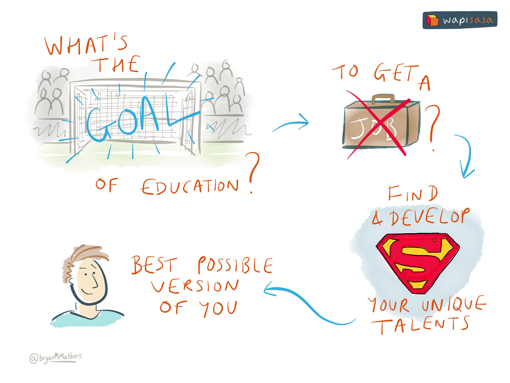
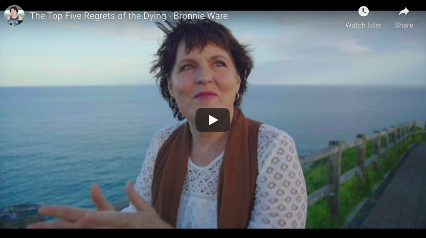
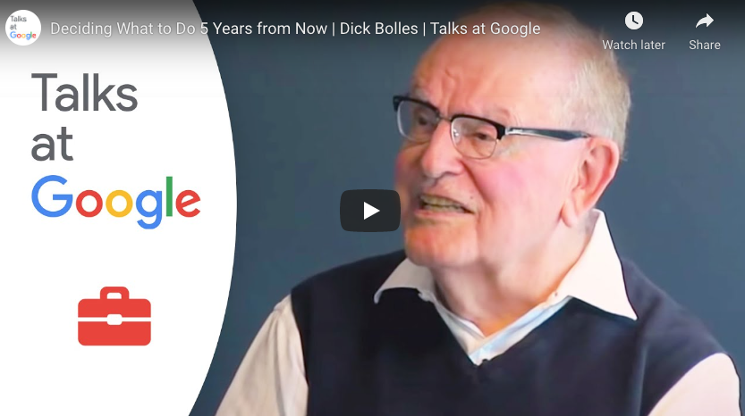

# Knowing your future {#knowing}

Hello, who are you? What's your story? What are you good at, what do you like doing and what do you value? What are your hopes and dreams for the future? Tell me about your education and who you are. What unique talents are you finding and developing during your education? How are you striving to become the best possible version of you? Knowing your future depends on knowing who you are now. 🏆

```{r goal-fig, echo = FALSE, fig.align = "center", out.width = "100%", fig.cap = "(ref:captionwhoareyou)"}

```
(ref:captionwhoareyou) Your education is a crucial part of your story and who you are. The purpose of your education is not just to get you a job but to find and develop your unique talents. What are your unique talents? How are you developing them? [Goal of Education](https://www.flickr.com/photos/122135325@N06/16627558943/) sketch by [Visual Thinkery](https://visualthinkery.com/) is licensed under [CC-BY-ND](https://creativecommons.org/licenses/by-nd/4.0/)

## What you will learn {#ilo2}

Reading this chapter and doing the activities will help you to

* Improve your self-awareness, knowing yourself better will help you to know your future more clearly
* Describe your story so far in terms of head, heart and hands:
    + What you know: what is in your **head**
    + Your values: what is in your **heart**
    + Things you have you done **hands**
* Identify your protected characteristics
* Check and be grateful for any privileges that you may have

## What's your story, coding glory? {#story}

> “If you are human, you love stories. Why? We're hardwired to love stories because they help us understand
>  our world and are essential to our evolution. We use stories to organise and communicate our surroundings
> and our past, present and future” ---Heather Box and Julian Mocine-McQueen [@freeyourstory]

Self-awareness, understanding who you are, is important for leading a healthy and happy life, and likely to be an important factor in your future success. One way to develop self-awareness is to think about what your story is. [@freeyourstory] How did you get here, where are you going, what has inspired you? Who is the authentic you? [@regrets] What are your hopes and dreams? By starting to answer these questions you will gain a better understanding of who you are. This includes strengths, weaknesses, motivation and values. [@parachute2020]

[comment]: <> (picneeded head, heart hands)

Universities offer many opportunities for self improvement, self discovery and developing your unique skills. One way to build your self-awareness is to reflect on your knowledge, values and skills. In Waldorf education this is characterised as “head, heart and hands”. [@headhearthands]

1. **Head**: What do you *know*?
1. **Heart**: What do you *value*, what motivates you?
1. **Hands**: What can you *do*? What have you *done* so far? What will you do in the future?

Answering these questions will help you understand your story.

<!--Feel like this section needs an example and more of a demonstration of how it's helpful.-->


## Ikigai: What is the meaning of life? {#no42}

Many of the learning outcomes described above are non-trivial. You may have good self-awareness and be able to describe aspects of who you are in a matter of minutes. Other personality traits make take longer to realise. You can develop better self-awareness by describing four attributes shown in Figure \@ref(fig:iki-fig), together these are known as your ikigai (生き甲斐) or “reason for being”.

* what do you love doing?
* what are you good at?
* what does the world need?
* what can you be paid for?

```{r iki-fig, echo = FALSE, fig.align = "center", out.width = "80%", fig.cap = "(ref:captioniki)"}
knitr::include_graphics("images/ikigai.png")
```
(ref:captioniki) Reasons for being, a concept in Japanese known as *ikigai*. Image by Emmy van Deurzen on Wikimedia Commons. According to ikigai, a meaningful life combines doing four things. 1. What you are good at 2. What you love 3. What the world needs and 4. What you can get paid for. Illustration by Nimbosa derived from works in the public domain by Dennis Bodor and Emmy van Deurzen, CC BY-SA 4.0 on Wikimedia Commons [w.wiki/qWT](https://w.wiki/qWT)

You'll be lucky if you can find activities at the intersection of all four sets shown Figure \@ref(fig:iki-fig). In practice, you may realistically only be able to achieve one, two or three. That said, it's still a valuable exercise to think about what is in each category for you.

## Self assess your ikigai

Take a sheet of paper, draw the four overlapping rings shown in Figure \@ref(fig:iki-fig), and spend five to ten minutes adding things in each ring.

* What are your values?
* What motivates you?
* Are there things you like doing that you aren’t particularly good at?
* Why does that make them enjoyable?

```{r know-fig, echo = FALSE, fig.align = "center", out.width = "50%", fig.cap = "(ref:captionknowthyself)"}
knitr::include_graphics("images/Know who you are.png")
```
(ref:captionknowthyself) How well do you know yourself. Know who you are sketch by [Visual Thinkery](https://visualthinkery.com) is licensed under [CC-BY-ND](https://creativecommons.org/licenses/by-nd/4.0/)

Thinking about your ikigai will clarify your knowledge of yourself. Some parts of your identity are so important that they are protected by legislation, in the UK and in other countries. The next section looks at those.

## Your protected characteristics {#protected}

Some of your characteristics are protected. The Equality Act of 2010^[\url{http://www.legislation.gov.uk/ukpga/2010/15/contents}] protects you from discrimination at work or in education, based on what are known as "protected characteristics". [@equality]. This means that:


* Your **age** should not determine how you are treated
* Your **disabilities** should not determine how you are treated
* Your **gender** should not determine how you are treated [@inferior; @damore; @damoreguardian; @everydaysexism]
* Your **gender re-assignment** should not determine how you are treated
* Your **marriage** or civil partnership should not determine how you are treated
* Your **pregnancy** and maternity should not determine how you are treated
* Your **race** (including colour, nationality, ethnic or national origin) should not determine how you are treated [@nottalking; @superior]
* Your **religion** or beliefs should not determine how you are treated
* Your **sex** should not determine how you are treated [@harassment]
* Your **sexual orientation** should not determine how you are treated [@nosex]

<!--
* What is discrimination?
* How might you be discriminated against during job applications and interviews?
* How might you be discriminated against during employment?
* How might you be discriminated against in education?-->

## Coding challenges {#goals}
<!--luke: I'm not sure of the link to coding challenges here.-->
This chapter has looked at some big issues around identity, by inviting you to think about some fundamental questions. Another way to think about these questions is as coding challenges. They are non-trivial questions to answer, it might take you weeks, months or even years to answer some of them. But they are worth spending time thinking about

* What are your values?
* What makes you happy?
* What do you want to get from your time at University?
* What do you want after University?
* Where do you see yourself in *x* years time?

The signposts in the next section may help tackle some of these coding challenges.

<!--* What makes you happy? [@danpink; @autonomy] What is a SMART goal? ^[https://en.wikipedia.org/wiki/SMART_criteria]-->

## Signposts from here on identity {#sign2}

This chapter challenges you to reflect on who you are and what you're good at. We've only scratched the surface, so if you want to dig deeper you'll find the following resources useful:

* *The Top Five Regrets of the Dying*
* *What Colour is Your Parachute?*
* *How Your Story Sets You Free*
* A range of books about privilege

### Your dying regrets? {#regret}  
One of *[The Top Five Regrets of the Dying](https://en.wikipedia.org/wiki/The_Top_Five_Regrets_of_the_Dying)* [@regrets] is that people wish they'd had the courage to live a life true to themselves, and not a life that others expected of them. Figuring out exactly who your authentic self is can be challenging. [Bronnie Ware's](https://en.wikipedia.org/wiki/Bronnie_Ware) book might help, it has some very moving, personal and insightful true stories of peoples regrets that will illuminate your own values and might just change your life. The top five regrets, outlined in the book are:

1. I wish I’d had the courage to live a life true to myself, not the life others expected of me
1. I wish I hadn’t worked so hard
1. I wish I’d had the courage to express my feelings
1. I wish I had stayed in touch with my friends
1. I wish that I had let myself be happier

You need to be courageous to live a regret-free life but the alternative is to die full of regret, see Bronnie's video in figure \@ref(fig:bronnie-fig).


```{r bronnie-fig, echo = FALSE, fig.align = "center", out.width = "99%", fig.cap = "Palliative care nurse Bronnie Ware explains the top five regrets of the dying. [@youtube-bronnie] Bronnie learned a lot from looking after people on their deathbeds, then wrote it all down in a fantastic book [@regrets]. The image in the figure is a screenshot, you can [watch the two minute video here](https://www.youtube.com/watch?v=nayz3xJxRTA) "}


```
### Colouring your parachute {#parachute}  
Since first being published in 1972, over ten million copies of *[What Colour is Your Parachute?](https://en.wikipedia.org/wiki/What_Color_is_Your_Parachute%3F)* have been sold. It has been translated into 20 languages and is used in 26 countries. What is good about *Parachute* is that it has some useful *self-inventory* exercises that go beyond the introductory ones in this guidebook, particularly in the context of your future career. While the style and examples can be U.S. centric, it's a classic self-help book that looks at a broad variety of issues around job hunting. The author, [Richard Nelson Bolles](https://en.wikipedia.org/wiki/Richard_Nelson_Bolles) was a Harvard educated chemical engineer and he explains how you can't possibly decide what to do in five years time in the video in figure \@ref(fig:bolles-fig). Where do you see yourself in five years time? is a question some interviewers like to ask.


```{r bolles-fig, echo = FALSE, fig.align = "center", out.width = "99%", fig.cap = "Where will you be five years from now? Best-selling author of *Colouring Your Parachute* Dick Bolles discusses the gaps between education and employment. [@youtube-bolles] The image in the figure is a screenshot, you can [watch the full 32 minute talk here](https://www.youtube.com/watch?v=oeP6Pm3Xf-8) "}


```

### What's your story?
A useful technique for developing self-awareness is to think about what your story is. Heather Box and Julian Mocine-McQueen's book *How Your Story Sets You Free* [@freeyourstory] takes a storytelling approach to help you gain a better picture of who you are and what you value. What's good about this book is its short, less than 100 pages and contains practical exercises which extend those in this chapter.

### Check your privileges
Reflecting on your identity should lead you to check any privileges you might have. Being grateful for any privileges you may have is also beneficial for your mental health which we talk about in the chapter on [your well-being](#wellbeing) So:

* **If you're white** a good place to start understanding your white privileges is *[Why I'm No Longer Talking to White People About Race](https://en.wikipedia.org/wiki/Why_I'm_No_Longer_Talking_to_White_People_About_Race)* by [Reni Eddo Lodge](https://en.wikipedia.org/wiki/Reni_Eddo-Lodge) [@nottalking] and *[Superior: The Return of Race Science](https://en.wikipedia.org/wiki/Superior:_The_Return_of_Race_Science)* by [Angela Saini](https://en.wikipedia.org/wiki/Angela_Saini)
* **If you're male** a good place to start understanding the privileges you have as a result of being a man is *[Inferior](https://en.wikipedia.org/wiki/Inferior_(book))* by [Angela Saini](https://en.wikipedia.org/wiki/Angela_Saini) [@inferior]
* **If you're socially privileged** a good place to start understanding the privileges you have as a result of your class is *The Class Ceiling: Why it Pays to be Privileged* by Sam Friedman and Daniel Laurison [@classceiling]. If you were privately educated in Britain (or elsewhere) you should read *[Engines of Privilege: Britain's Private School Problem ](https://en.wikipedia.org/wiki/Engines_of_Privilege)* [@nicebutdim]
* **If you're heterosexual** a good place to start understanding the privileges you have as a result of your sexual orientation is [Ben Britton](https://en.wikipedia.org/wiki/Ben_Britton)'s presentation on *No sexuality please, we're scientists*  [@nosex] which covers bisexuality and homosexuality, including lesbian and gay homosexuality
* **If you're gender binary** a good place to start understanding the privileges you have as a result of being [gender binary](https://en.wikipedia.org/wiki/Gender_binary) is Ben Britton's presentation [@nosex] which also covers transgender, genderqueer, non-binary and plus identities  

There is a lot more to your identity than your race, class, gender and sexual orientation, see [your protected characteristics](#protected).

<!-- neurodiversity: autism, aspergers, dyslexia, dyspraxia, ADHD, tourettes etc-->
<!--
## Helping and improving yourself {#ur}

* What are the benefits of stepping outside your comfort zone?
* What is inside (and outside) your stretch zone?
* What might you gain by trying something new
* When is it not beneficial to compare yourself to your peers?
* What is a growth mindset and how is it relevant ?-->


## Summarising self awareness {#tldr2}

[Too long, didn't read](https://en.wiktionary.org/wiki/too_long;_didn%27t_read) (TL;DR)? Here's a summary:  

This chapter has looked at who you are. Being self aware, understanding your strengths and weaknesses is key to getting what you want from your career. Questions about your identity are non-trivial, hopefully this chapter has started you thinking about who you are, what motivates you and what you want out of life. You need to keep thinking about your identity because some aspects of your identity may be constantly changing.

These are fundamental design questions you'll need to address when you starting building your future. We touched on understanding any privileges you may have as being important for understanding who you are but also in being beneficial for your mental health.

In the next chapter, we'll look at mental health in more detail.
