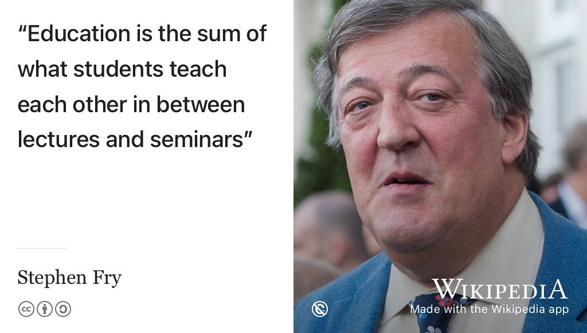
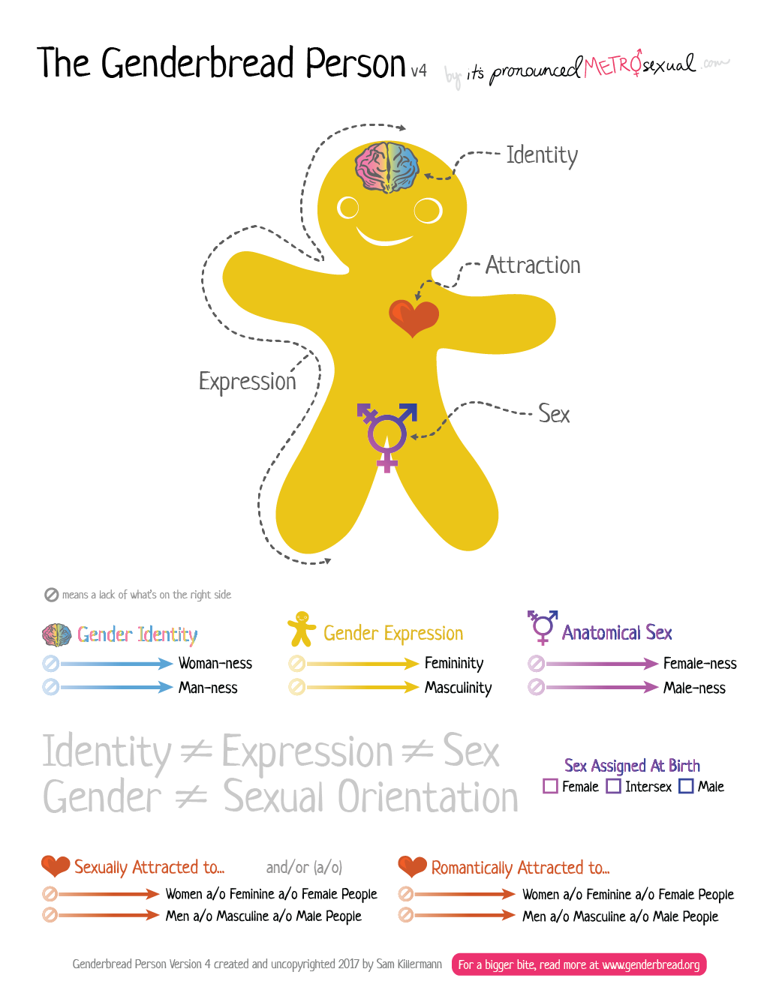
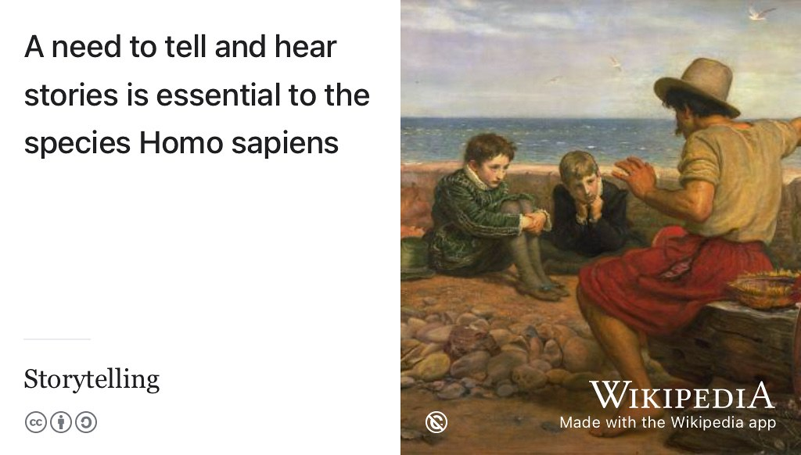
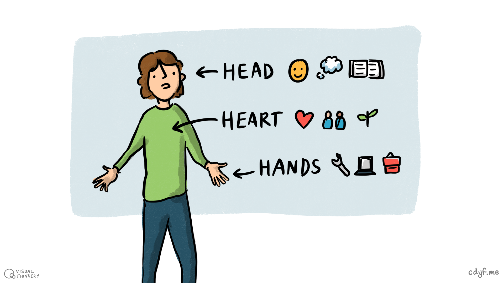
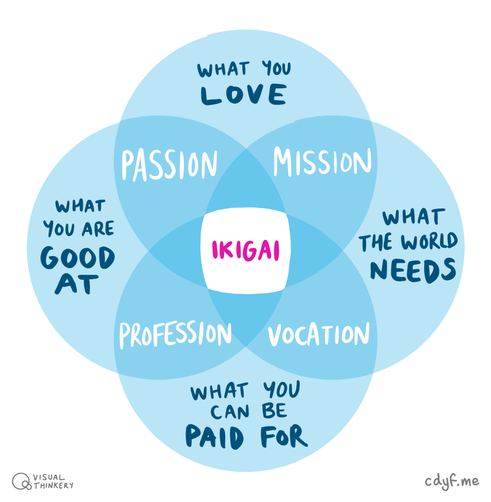
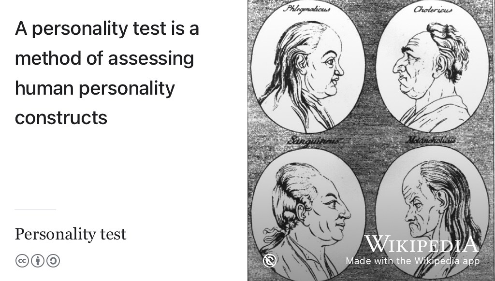
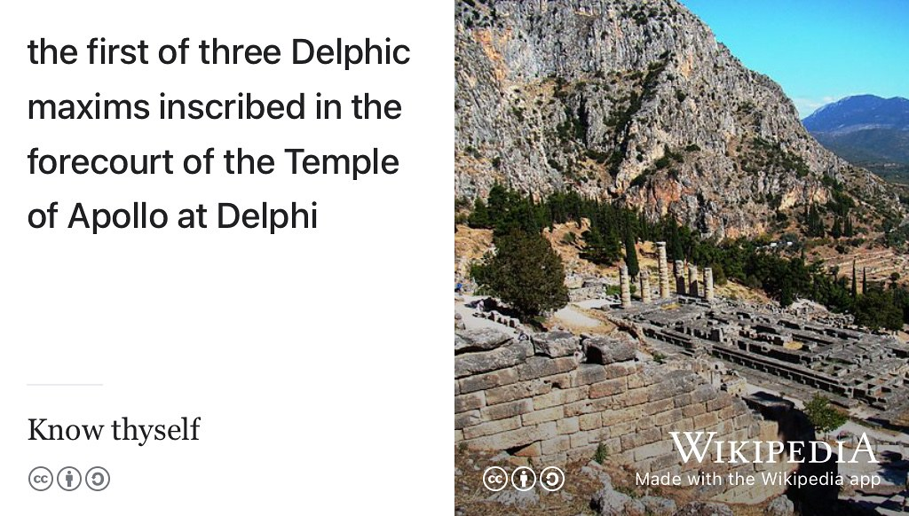
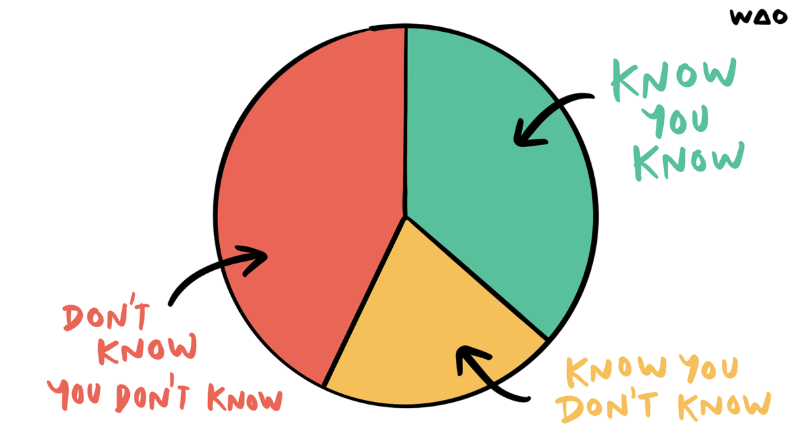

# Knowing your future {#knowing}

Hello, who are you? What's your story, coding glory? What are you good at, what do you like doing and what do you value? What are your hopes and dreams for the future? Tell me about your `education` and who you are. What unique talents are you finding and developing during your education? How are you striving to become a better version of you? Having good self knowledge will help you answer these big questions, which are important for your future. Knowing your future depends on knowing who you are now. 🏆

```{r goal-fig, echo = FALSE, fig.align = "center", out.width = "100%", fig.cap = "(ref:captionwhoareyou)"}
knitr::include_graphics("images/goal of education.jpg")
```
(ref:captionwhoareyou) Your education is a crucial part of your story and who you are. The purpose of your education is not *just* to get you a job but to also find and develop your unique talents. What are your unique talents? How are you developing them as part of your broader education to become ~~the best possible~~ a *better* version of yourself? [Goal of Education](https://www.flickr.com/photos/122135325@N06/16627558943/) sketch by [Visual Thinkery](https://visualthinkery.com/) is licensed under [CC-BY-ND](https://creativecommons.org/licenses/by-nd/4.0/)

## What you will learn {#ilo2}

Reading this chapter and doing the activities will help you to

1. Develop better self-awareness by experimenting with seven techniques for exploring different dimensions of your identity:
    + Protected characteristics
    + What's your story, coding glory?
    + Head, heart and hands
    + Ikigai: reason for being
    + Personality profiling
    + Privilege audit
    + Deathbed thought experiment
1. Know yourself better so that you can:
    + start coding your future
    + articulate who you are to potential employers

## Improving self-awareness {#skynet}
Knowing who you are now, will help you explore and understand who you might become in the future. That future you is ~~the best possible~~ a *better* version of you shown in \@ref(fig:goal-fig). Since you started it as a small child, your education has been:

* about bettering yourself
* a key part of your identity
* inherently communal and social

At University only a fraction of your education will happen during formal lectures, labs, tutorials and seminars see figure \@ref(fig:stephen-fry-lecture-fig)

```{r stephen-fry-lecture-fig, echo = FALSE, fig.align = "center", out.width = "100%", fig.cap = "(ref:captionfrylecture)"}

```
(ref:captionfrylecture) According to [Stephen Fry](https://en.wikipedia.org/wiki/Stephen_Fry), Education is the sum of what students teach each other in between lectures and seminars. [@frychronicles] So you can get more out of your short time at University by actively engaging with your peers with [peer learning](https://en.wikipedia.org/wiki/Peer_learning), [peer instruction](https://en.wikipedia.org/wiki/Peer_instruction), [peer support](http://www.peersupport.manchester.ac.uk/) and [informal learning](https://en.wikipedia.org/wiki/Informal_learning). You, and your fellow students, will both benefit by teaching and learning from each other. Public domain portrait of Fry at Winfield House in 2016 by the US Embassy in London [w.wiki/4wrn](https://w.wiki/4wrn)

<!-- this doesn't really fit or flow here, what's the connection between education, identity and self-knowlege -->

Your identity, who you are, is complex, dynamic and high-dimensional so you will need several different techniques to improve your self-awareness. Here are seven techniques to get you started:

<!-- Your education is a big part of your identity so being conscious of how your education has already changed you is an important step in developing self-awareness. Identifying what your formal education *can't* do for you, is just as crucial too. Before we look at some techniques for improving your self-awareness, let's look at the fundamental *protected* parts of your identity. Some parts of your identity are so important that they are protected by legislation, in the UK and in other countries. -->

1. 🔒 your protected characteristics, see section \@ref(protected)
1. 📕 your story so far, see section \@ref(story)
1. 🙂 your head, heart and hands, see section \@ref(hhh)
1. 🤔 your reason for being (ikigai), see section \@ref(no42)
1. 📊 your personality profile, see section \@ref(personality)
1. 💰 your privileges, or lack of them, see section \@ref(apriv)
1. ☠️ your deathbed *thought experiment*, see section \@ref(regrets)

<!--being aware of what your formal education can, and can't do for you is key to being more self-ware-->

### Your protected characteristics {#protected}
Some of your identity includes characteristics that are protected. In the UK, the Equality Act of 2010^[\url{http://www.legislation.gov.uk/ukpga/2010/15/contents}] protects you from discrimination at work or in education, based on what are known as “protected characteristics”. [@equality]. This means that:

* Your **age** should not determine how you are treated
* Your **disabilities** should not determine how you are treated
* Your **gender** should not determine how you are treated [@inferior; @damore; @damoreguardian; @everydaysexism]
* Your **gender re-assignment** should not determine how you are treated
* Your **marriage** or civil partnership should not determine how you are treated
* Your **pregnancy** and maternity should not determine how you are treated
* Your **race** (including colour, nationality, ethnic or national origin) should not determine how you are treated [@nottalking; @superior]
* Your **religion** or beliefs should not determine how you are treated
* Your **sex** should not determine how you are treated [@harassment]
* Your **sexual orientation** should not determine how you are treated [@nosex]

These are a special part of your identity because they are protected. This means they shouldn't be a factor in apply for a job or a subject for discussion in a job interview. Let's look at gender, sex and sexual orientation in more detail because they can be easily misunderstood. One way to understand gender better is to break it down into four characteristics:

1. **Identity**: your gender identity
1. **Expression**: your gender expression
1. **Sex**: your biological sex
1. **Attraction**: your sexual and romantic orientation

These protected characteristics are often conflated, because people tend to confuse gender, sex and sexual orientation. They are *not* the same thing as shown in equation \@ref(eq:gender)

::: {.rmdnote}

\begin{equation}
Identity ≠ Expression ≠ Sex ≠ Attraction
  (\#eq:gender)
\end{equation}

:::

Lets have a look at each of those in turn:

1. **Identity** 🧠 is who you know yourself to be in your own head. Gender identity is based on how much you align (or don’t align) with the options for gender based on your psychological sense of self. This includes, but is not limited to:
    + `Woman | Genderqueer | Man` see [en.wikipedia.org/wiki/Gender_binary](https://en.wikipedia.org/wiki/Gender_binary) and [en.wikipedia.org/wiki/Non-binary_gender](https://en.wikipedia.org/wiki/Non-binary_gender)
1. **Expression** 🎨 is how you demonstrate your gender based on gender roles through the ways that you act, dress, behave and interact. These are not exclusive categories, you might choose to express yourself in all three ways including:
    + `Feminine | Androgynous | Masculine` see [en.wikipedia.org/wiki/Gender_expression](https://en.wikipedia.org/wiki/Gender_expression)
1. **Sex** ⚧️ is often conflated with gender. Sometimes called anatomical sex or physical sex, your biological sex is objectively measurable using features such as your genitalia, [chromosomes](https://en.wikipedia.org/wiki/Chromosome) (your [sex-determination system](https://en.wikipedia.org/wiki/Sex-determination_system) `XX`, `XY` etc), hormones, body hair, ovaries and testes. Your biological sex includes, but is not limited to:
    + `Female | Intersex | Male` see [en.wikipedia.org/wiki/Sex](https://en.wikipedia.org/wiki/Sex)
1. **Attraction** ❤️ is who you are physically, spiritually and emotionally attracted to. Like biological sex, sexual orientation is often conflated with gender but isn’t always a component of gender. We categorise the attraction we experience in gendered ways. Your sexual orientation includes, but is not limited to:
    + `Asexual | Heterosexual | Bisexual | Homosexual` see [en.wikipedia.org/wiki/Sexual_orientation](https://en.wikipedia.org/wiki/Sexual_orientation) and [en.wikipedia.org/wiki/Romance_(love)](https://en.wikipedia.org/wiki/Romance_(love)) and [en.wikipedia.org/wiki/Asexuality](https://en.wikipedia.org/wiki/Asexuality)

These characteristics are summarised in the genderbread person shown in figure \@ref(fig:genderbread-fig)

```{r genderbread-fig, echo = FALSE, fig.align = "center", out.width = "100%", fig.cap = "(ref:captiongenderbread)"}

```
(ref:captiongenderbread) Decomposing gender into its components of identity (woman-ness & man-ness), attraction (romantically and sexually), expression (feminity and masculinity) and sex (female-ness & male-ness). Genderbread Person v4.0 (uncopyright) by [Sam Killerman](https://www.samkillermann.com/) at [genderbread.org](https://www.genderbread.org/) and [itspronouncedmetrosexual.com](https://www.itspronouncedmetrosexual.com/)

Gender is probably more complicated than you realised, but the framework above will help you understand it better or help you explain the subtleties to someone else  by breaking a complicated concept into bite-sized, digestible pieces.

### What's your story, coding glory? {#story}
The protected characteristics described above are the part of your story you'll be most aware of. But there's much more to your story than these characteristics. We're hardwired to love storytelling because it helps us understand the world around us, see figure \@ref(fig:storytelling-fig). We use stories to organise and communicate, so knowing your story is a crucial part of knowing who you are and articulating that to other people, including potential employers. Your story sets you free! [@freeyourstory]

So, *what's your story, coding glory*? [@whatsthestory]

```{r storytelling-fig, echo = FALSE, fig.align = "center", out.width = "100%", fig.cap = "(ref:captionstorytelling)"}

```
(ref:captionstorytelling) [Storytelling](https://en.wikipedia.org/wiki/Storytelling) is an ancient art and who doesn't love a good story? As a species *Homo sapiens*, we need to tell and hear stories to understand the world around us. What's your story, coding glory? Public domain image of a painting by [John Everett Millais](https://en.wikipedia.org/wiki/John_Everett_Millais), with a seafarer telling the story of what happened out at sea, via Wikimedia Commons [w.wiki/3VHM](https://w.wiki/3VHM)

Self-awareness, understanding who you are, is important for leading a healthy and happy life, and likely to be an important factor in your future success. One way to develop better self-awareness is to think about the finer details of your story. [@freeyourstory]

* How did you get here?
* What has inspired you?
* Where are you going next?
* Who is the authentic you? [@regrets]
* What are your hopes and dreams?

By starting to answer these (admittedly **BIG!**) questions you will gain a better understanding of who you are. This includes your strengths, weaknesses, motivation and values. [@parachute2020] Your story is complex but you need to know it so you can distil the details into *much* shorter stories on your job applications described in section \@ref(mycvst). Crucial parts of your story are:

* **Characters**: *Who* are the key people who have influenced your story so far?
* **Settings**: *Where* and *when* have your stories taken place?
* **Conflict and change**: Education means bettering yourself which inevitably involves change so:
    + *How* have your experiences changed you?
    + *What* did you learn from these experiences?
* **Emotions**: how did you *feel* at the time? Fearful, happy, excited, surprised, empowered? Looking back, how do you feel about these stories now? Have your feelings changed and if so, why?

<!-- give example and worksheet-->
Write these stories down. By reflecting on them and articulating them, you will improve your self awareness. Ultimately, some of these stories can eventually be distilled down into content on your CV (with emotions edited out!), see section \@ref(care).

<!--Universities offer many opportunities for self improvement, self discovery and developing your unique skills.-->

### Head, heart, hands {#hhh}

Another technique for building your self-awareness is to reflect on your knowledge, values and skills. In [Waldorf education](https://en.wikipedia.org/wiki/Waldorf_education) and [Montessori education](https://en.wikipedia.org/wiki/Montessori_education) this is characterised as “head, heart and hands” outlined below and in figure \@ref(fig:headhearthands-fig) [@headhearthands]

1. **Head**: What do you *know*?
1. **Heart**: What do you *value*, what motivates you?
1. **Hands**: What can you *do*? What have you *done* so far? What will you do with your skills in the future? Your actions define your impact, see chapter \@ref(actioning)

```{r headhearthands-fig, echo = FALSE, fig.align = "center", out.width = "100%", fig.cap = "(ref:captionhhh)"}

```

(ref:captionhhh) What knowledge do you have (**head**)? What are your values (**heart**)? What skills and experience do you have (**hands**)? Head, heart, hands sketch by [Visual Thinkery](https://visualthinkery.com/) is licensed under [CC-BY-ND](https://creativecommons.org/licenses/by-nd/4.0/)

Again, answering these questions will help you understand and articulate your story.

<!--Feel like this section needs an example and more of a demonstration of how it's helpful.-->


### Ikigai: Reason for Being {#no42}

Many of the learning outcomes described above are non-trivial. You may have good self-awareness and be able to describe aspects of who you are in a matter of minutes. Other personality traits make take longer to uncover. You can develop better self-awareness by describing four attributes shown in Figure \@ref(fig:iki-fig), together these are known as your [ikigai (生き甲斐)](https://en.wikipedia.org/wiki/Ikigai) or “reason for being”.

* what do you love doing?
* what are you good at?
* what does the world need?
* what can you be paid for?

```{r iki-fig, echo = FALSE, fig.align = "center", out.width = "100%", fig.cap = "(ref:captioniki)"}

```
(ref:captioniki) Reasons for being, a concept in Japanese known as *ikigai*. According to ikigai, the most meaningful life lies at the intersection of four sets: (1) What you are good at, (2) What you love, (3) What the world needs and (4) What you can get paid for. What do *you* have in each of these sets and what are on your personal intersections? Ikigai sketch by [Visual Thinkery](https://visualthinkery.com) is licensed under [CC-BY-ND](https://creativecommons.org/licenses/by-nd/4.0/)

You'll be lucky if you can find activities at the intersection of all four sets (`ikigai`) shown in Figure \@ref(fig:iki-fig). In practice, you may realistically only be able to achieve one, two (the `Passion`, `Mission`, `Profession` and `Vocation`) or three intersections. That said, it's still a valuable exercise to think about what is in each set for you.

Take a sheet of paper, draw the four overlapping rings shown in Figure \@ref(fig:iki-fig), and spend five to ten minutes adding things in each ring.

* What are your values?
* What motivates you?
* Are there things you like doing that you aren’t particularly good at?
* Why does that make them enjoyable?

```{r know-fig, echo = FALSE, fig.align = "center", out.width = "50%", fig.cap = "(ref:captionknowthyself)"}
knitr::include_graphics("images/Know who you are.png")
```
(ref:captionknowthyself) How well do you know yourself? Know who you are sketch by [Visual Thinkery](https://visualthinkery.com) is licensed under [CC-BY-ND](https://creativecommons.org/licenses/by-nd/4.0/)

Thinking about your ikigai will clarify your knowledge of yourself.

### Personality profiling {#personality}

Personality tests are designed to reveal your key characteristics, see figure \@ref(fig:personality-fig). Besides helping you develop better self-awarness, they are used by some employers during the interview. Personality tests are often part of a wider set of aptitude and psychometric tests to test measure your ability at numerical reasoning, verbal reasoning, logical reasoning and
situational judgement.

```{r personality-fig, echo = FALSE, fig.align = "center", out.width = "100%", fig.cap = "(ref:captionpersonality)"}

```
(ref:captionpersonality) Personality profiling has been around for a long time. Early theories proposed there were [four temperaments](https://en.wikipedia.org/wiki/Four_temperaments): 1. `phlegmatic` 2. `choleric` 3. `sanguine` and 4. `melancholic` shown in this 18th century illustration. Public domain image of a woodcut by Johann Kaspar Lavater via Wikimedia Commons [w.wiki/5xmG](https://w.wiki/5xmG) adapted using the [Wikipedia App](https://apps.apple.com/gb/app/wikipedia/id324715238)


If you haven't done a personality test before, the 16 short questions at [icould.com/buzz-quiz](https://icould.com/buzz-quiz) will give you a flavour of what to expect. Which animal are you? There are lots of tools for personality profiling which go into more depth by asking you a lot more than 16 questions. Some of these services are free such as:

* [16personalities.com](https://www.16personalities.com): similar to [Myers–Briggs Type Indicators](https://en.wikipedia.org/wiki/Myers%E2%80%93Briggs_Type_Indicator) (MBTI)
* [strengthsprofile.com](https://strengthsprofile.com/en-GB/Products/Free)
* [practiceaptitudetests.com/personality-test](https://www.practiceaptitudetests.com/personality-test/)
* [jobtestprep.co.uk/free-personality-test](https://www.jobtestprep.co.uk/free-personality-test)

Different personality tests try to measure various dimensions of your personality such as:

* your relationship to other people
* your emotional intelligence
* your organisational skills
* your openness to new experiences
* your resilience and mindset

Your University may also pay for subscription-based personality profiling services, check with your careers service for details.

### Privilege audit {#apriv}

If you have privileges, it is important to recognise and acknowledge any advantages these have given you in life. They are a key part of your identity, who you are and your ego. If you don't recognise your privileges then you don't know yourself. Ask yourself *honestly*, what privileges do you have? For example, is it *just* your skills and knowledge that have got you into higher education, or have you been fortunate?

* Don't have too high an opinion of yourself and your privileges, otherwise you'll overlook your flaws and won't improve
* Be wary of your ego, or as [Chris Anderson](https://en.wikipedia.org/wiki/Chris_Anderson_(entrepreneur)) puts it in his guide to public speaking: “park your ego” [@tedtalks]
* If you're struggling to think of any privileges, see section \@ref(privileged) for some suggestions.
* Your Education, a key part of your identity and who you are, is a likely to be a key privilege. Education is not a protected characteristic described in section \@ref(protected), see figure \@ref(fig:pender-fig), although some people argue that it should be [@amolceiling]


```{r pender-fig, echo = FALSE, fig.align = "center", out.width = "99%", fig.cap = "(ref:pendercaption)"}
knitr::include_url('https://www.youtube.com/embed/1YV5gYXrYoA')
```

(ref:pendercaption) So [what school did you go to?](https://open.spotify.com/show/3e8K1fcNbqck9k9pFIGlG8) [@whatschooldidyougoto] [Sophie Pender](https://en.wikipedia.org/wiki/Sophie_Pender), co-founder the of the [93percent.club](https://www.93percent.club/), explains why your education is a key part of your identity. You can also watch the one minute video embedded in this figure at [youtu.be/1YV5gYXrYoA](https://youtu.be/1YV5gYXrYoA) [@youtube-pender; @93bbc;]

Being mindful of any privileges that you have is not just a part of knowing yourself better. Being grateful for those privileges is beneficial for your mental health too, see the discussion of section \@ref(lays).

<!--possibly better as a breakpoint-->


### Deathbed thought experiment {#regrets}

Imagine for a moment you are on your deathbed. Not at some point in the future, but right now. Your heart (see figure \@ref(fig:heart-fig)), which has served you well until now, starts behaving strangely. You start having palpitations, hearing your own heartbeat [@elektrokardiogramm] and worry what's going on with the muscle responsible for keeping you alive. Worst case scenario is, your time is up. This happened to me and its a useful [thought experiment](https://en.wikipedia.org/wiki/Thought_experiment) to force you to think about what matters in your life. [@deathbed]

```{r heart-fig, echo = FALSE, fig.align = "center", out.width = "100%", fig.cap = "(ref:captionheart)"}
knitr::include_graphics("images/your-beating-heart.gif")
```
(ref:captionheart) One day your heart will stop beating, hopefully not for a long time yet, but it will happen. The [grim reaper](https://en.wikipedia.org/wiki/Death_(personification)) gets us all in the end. ☠️ If you live for an average length of time, your heart will beat more than 2.5 billion times. Now imagine your heart will stop beating in a weeks time. As you reflect on your life, would you have any regrets? If so, what would they be? This *deathbed thought experiment* will force you to think about who you are and what you value. Computer generated cross section 3D model of the human heart via Wikimedia Commons by DrJanaOfficial at [w.wiki/36zc](https://w.wiki/36zc)

One of the things you'll probably want to do is reflect on your life and wonder:

* What did you achieve?
* Do you have any regrets, if so what are they?
* What would you change if you could carry on living?

This can be a useful technique for forcing you to think about who you are and what you value. If you find this activity difficult, see section \@ref(regret) for some hints. The Roman's called this *[Memento mori](https://en.wikipedia.org/wiki/Memento_mori)* which roughly translates from latin as  “remember that you are mortal” or “remember that you have to die” .

Co-founder of [desana.io](https://desana.io/) Michael Cockburn argues that you should “make decisions as if you were on your deathbed”. [@cockburn] Remember that you have to die. *[Memento mori](https://en.wikipedia.org/wiki/Memento_mori)*. Do you realise that everyone you know someday will die? Instead of saying all of your goodbyes, let them know you realise that life goes fast. It's hard to make the good things last. [@doyourealise]


<!--
* What is discrimination?
* How might you be discriminated against during job applications and interviews?
* How might you be discriminated against during employment?
* How might you be discriminated against in education?-->

## Breakpoints {#bp2}
<!--luke: I'm not sure of the link to coding challenges here.-->
(ref:breakpoint)

```md
* PAUSE ⏸️
```

This chapter has looked at some big issues around identity, by inviting you to think about some fundamental questions. Another way to think about these questions is as coding challenges. They are non-trivial questions to answer, it might take you weeks, months or even years to answer some of them. But they are worth spending time thinking about

* What are your values?
* What makes you happy?
* What do you want to get from your time at University?
* What do you want after University?
* Where do you see yourself in $x$ years time?
* What are your privileges (if any), see section \@ref(privileged)


The signposts in the next section may help tackle some of these coding challenges.

```md
* RESUME ▶️
```

<!--* What makes you happy? [@danpink; @autonomy] What is a SMART goal? ^[https://en.wikipedia.org/wiki/SMART_criteria]-->

## Signposts from here on identity {#sign2}

This chapter challenges you to reflect on who you are and what you're good at. We've only scratched the surface, so if you want to dig deeper you'll find the following resources useful:

* *The Top Five Regrets of the Dying*
* *What Colour is Your Parachute?*
* *How Your Story Sets You Free*
* A range of books about privilege

### Your dying regrets? {#regret}  
One of *[The Top Five Regrets of the Dying](https://en.wikipedia.org/wiki/The_Top_Five_Regrets_of_the_Dying)* [@regrets] is that people wish they'd had the courage to live a life true to themselves, and not a life that others expected of them. Figuring out exactly who your authentic self is can be challenging. [Bronnie Ware's](https://en.wikipedia.org/wiki/Bronnie_Ware) book might help, it has some very moving, personal and insightful true stories of the regrets that people have that will illuminate your own values. The top five regrets, outlined in the book are:

1. I wish I’d had the courage to live a life true to myself, not the life others expected of me
1. I wish I hadn’t worked so hard
1. I wish I’d had the courage to express my feelings
1. I wish I had stayed in touch with my friends
1. I wish that I had let myself be happier

You need to be courageous to live a regret-free life but the alternative is to die full of regret, see Bronnie's video in figure \@ref(fig:bronnie-fig).


```{r bronnie-fig, echo = FALSE, fig.align = "center", out.width = "99%", fig.cap = "(ref:bronnie)"}
knitr::include_url('https://www.youtube.com/embed/nayz3xJxRTA')

```

(ref:bronnie) Palliative care nurse Bronnie Ware explains the top five regrets of the dying. Bronnie learned a lot from looking after people on their deathbeds, then wrote it all down in a fantastic book [@regrets]. You can also watch the two minute video embedded in this figure at [youtu.be/nayz3xJxRTA](https://youtu.be/nayz3xJxRTA) [@youtube-bronnie]


### Colouring your parachute {#parachute}  
Since first being published in 1972, over ten million copies of *[What Colour is Your Parachute?](https://en.wikipedia.org/wiki/What_Color_is_Your_Parachute%3F)* have been sold. It has been translated into 20 languages and is used in 26 countries. What is good about *Parachute* is that it has some useful *self-inventory* exercises that go beyond the introductory ones in this guidebook, particularly in the context of your future career. While the style and examples can be U.S. centric, it's a classic self-help book that looks at a broad variety of issues around job hunting. The author, [Richard Nelson Bolles](https://en.wikipedia.org/wiki/Richard_Nelson_Bolles) was a Harvard educated chemical engineer and explains how to work out what you'll be doing in five years time in the video in figure \@ref(fig:bolles-fig). He looks at techniques for working our your direction including random luck, intuition and improving self-awareness, using similar techniques to those described in this chapter.

```{r bolles-fig, echo = FALSE, fig.align = "center", out.width = "99%", fig.cap = "(ref:bolles)"}
knitr::include_url('https://www.youtube.com/embed/oeP6Pm3Xf-8')

```

(ref:bolles) Where will you be five years from now? Best-selling author of *[What Color is Your Parachute](https://en.wikipedia.org/wiki/What_Color_Is_Your_Parachute%3F)*, [Dick Bolles](https://en.wikipedia.org/wiki/Richard_Nelson_Bolles) discusses the gaps between education and employment. You can watch also watch the full 32 minute video embedded in this figure at [youtu.be/oeP6Pm3Xf-8](https://youtu.be/oeP6Pm3Xf-8) [@youtube-bolles]

### What's your story? {#freeyourstory}
A useful technique for developing self-awareness is to think about what your story is. Heather Box and Julian Mocine-McQueen's book *How Your Story Sets You Free* [@freeyourstory] takes a storytelling approach to help you gain a better picture of who you are and what you value. What's good about this book is its short, less than 100 pages and contains practical exercises which extend those in this chapter.


### Check your privileges {#privileged}
Reflecting on your identity should lead you to check any privileges you might have. Being grateful for any privileges you may have is also beneficial for your mental health which we talk about in chapter \@ref(nurturing) so:

* **If you are white** a good place to start understanding your white privileges is *[Why I'm No Longer Talking to White People About Race](https://en.wikipedia.org/wiki/Why_I'm_No_Longer_Talking_to_White_People_About_Race)* by [Reni Eddo Lodge](https://en.wikipedia.org/wiki/Reni_Eddo-Lodge) [@nottalking] and *[Superior: The Return of Race Science](https://en.wikipedia.org/wiki/Superior:_The_Return_of_Race_Science)* by [Angela Saini](https://en.wikipedia.org/wiki/Angela_Saini)
* **If you are male** a good place to start understanding the privileges you have as a result of being a man is *[Inferior](https://en.wikipedia.org/wiki/Inferior_(book))* by [Angela Saini](https://en.wikipedia.org/wiki/Angela_Saini) [@inferior]
* **If you are socially privileged** a good place to start understanding the privileges you have as a result of your class is *The Class Ceiling: Why it Pays to be Privileged* by Sam Friedman and Daniel Laurison [@classceiling].
     + If you were privately (or selectively) educated in Britain (or elsewhere) you should read *[Engines of Privilege: Britain's Private School Problem ](https://en.wikipedia.org/wiki/Engines_of_Privilege)* [@nicebutdim] or *Posh Boys* by  Robert Verkaik [@poshboys]
* **If you are heterosexual** a good place to start understanding the privileges you have as a result of your sexual orientation is [Ben Britton](https://en.wikipedia.org/wiki/Ben_Britton)'s presentation on *No sexuality please, we're scientists*  [@nosex] which covers bisexuality and homosexuality, including lesbian and gay homosexuality
* **If you are gender binary** a good place to start understanding the privileges you have as a result of being [gender binary](https://en.wikipedia.org/wiki/Gender_binary) is Ben Britton's presentation [@nosex] which also covers transgender, genderqueer, non-binary and plus identities.

If you think you got to where you are purely because of your talents, think again: there's good evidence to show that luck plays a much bigger role than many of us would like to imagine. [@luckynottalented] Luck is as much a part of your identity as your talents.

There is a lot more to your identity than your race, class, gender and sexual orientation, see your protected characteristics in section \@ref(protected).

<!-- neurodiversity: autism, aspergers, dyslexia, dyspraxia, ADHD, tourettes etc-->
<!--
## Helping and improving yourself {#ur}

* What are the benefits of stepping outside your comfort zone?
* What is inside (and outside) your stretch zone?
* What might you gain by trying something new
* When is it not beneficial to compare yourself to your peers?
* What is a growth mindset and how is it relevant ?-->


## Summarising self awareness {#tldr2}
(ref:tldr)

**Know thyself** was one of three maxims inscribed on the [Temple of Apollo in Delphi](https://en.wikipedia.org/wiki/Temple_of_Apollo_(Delphi)), in ancient Greece, see figure \@ref(fig:delphi-fig). It's still an important maxim thousands of years later. To know thy future, you must first know thyself.

```{r delphi-fig, echo = FALSE, fig.align = "center", out.width = "100%", fig.cap = "(ref:captiondelphi)"}

```

(ref:captiondelphi) *Know thyself* was an important maxim in ancient Greece, written on temples like this one in Delphi. How well do you actually know yourself? Picture of the ruins of the Temple of Apollo at Delphi by Edward Knapczyk on Wikimedia Commons [w.wiki/5MEp](https://w.wiki/5MEp) adapted using the [Wikipedia App](https://apps.apple.com/gb/app/wikipedia/id324715238)


This chapter has looked at knowing yourself and who you are. Being self aware, understanding your strengths and weaknesses is key to getting what you need from your future. Questions about your identity are non-trivial, hopefully this chapter has started you thinking about who you are, what motivates you and what you want out of life. You will need to keep revisiting these questions about your identity because some aspects of your identity may change over time.

```{r mathers-known-fig, echo = FALSE, fig.align = "center", out.width = "100%", fig.cap = "(ref:captionmathersknown)"}

```
(ref:captionmathersknown) You know what you know about your identity and who you are. What parts of your identity do you know you *don't* know? Are there things about you that you *don't know* that you *don't know*? What are the [unknown unknowns](https://en.wikipedia.org/wiki/There_are_known_knowns) about you? [What you don’t know you don’t know](https://bryanmmathers.com/what-you-dont-know-you-dont-know) sketch by [Visual Thinkery](https://visualthinkery.com/) is licensed under [CC-BY-ND](https://creativecommons.org/licenses/by-nd/4.0/)

What do you know and what don't you know about yourself, see figure \@ref(fig:mathers-known-fig)? These fundamental design questions you'll need to address when you starting building your future. This chapter has looked at some simple techniques for exploring your unknown unknowns.

Knowing your future is Coding your Future.

In the next chapter, we'll look at nurturing your future with a focus on mental health.

<!-- wiki-training activity from Bhav for inclusion later
## Exercise: Sail Boat
# SITUATION:

* You are on an island with four other people
* You can see the mainland in the distance
* It is too far to swim there
* There is a sailing boat on the island
* You don’t know how to sail
* You only have enough supplies to survive one day
* Next to the sailing boat are some resources

### Your options

Prioritise the following options by writing a number `1` next to your first choice and number `2` next to your second choice, and so on.

* Discuss only the realistic options available
* Tell everyone how motivated you are to find an answer
* Read the ‘Manual of Sailing Techniques’
* Test that the sailboat is ready and prepared to sail
* Work out the different ways that the sail boat could be used
* Make a full analysis of the situation, the island, and all the available resources
* Discuss the importance of getting off the island
* Ask individuals to show everyone whatever they know about sailing

Adapted from Nonformal Education Manual – Peace Corps Information Collection And Exchange Publication No. M0042 https://files.peacecorps.gov/multimedia/pdf/library/M0042.pdf -->
