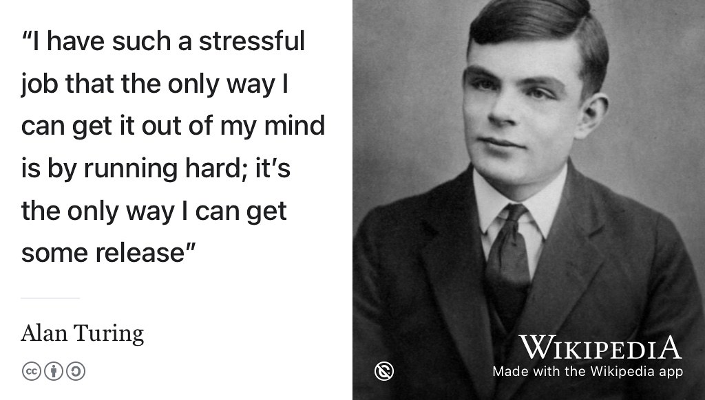
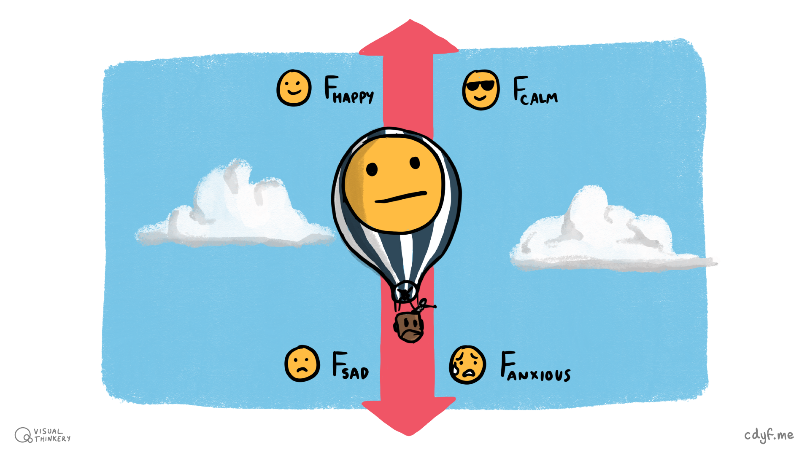
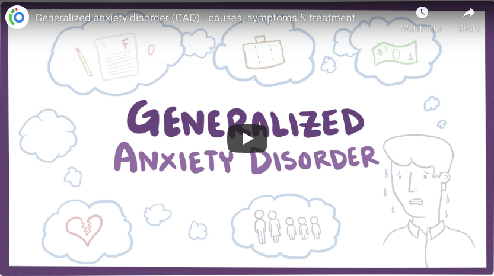
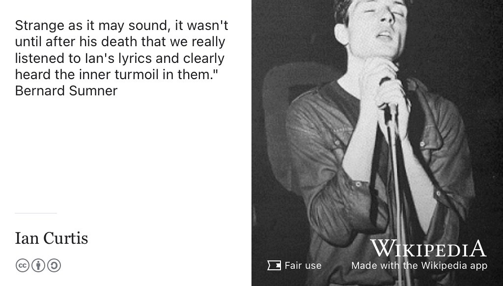
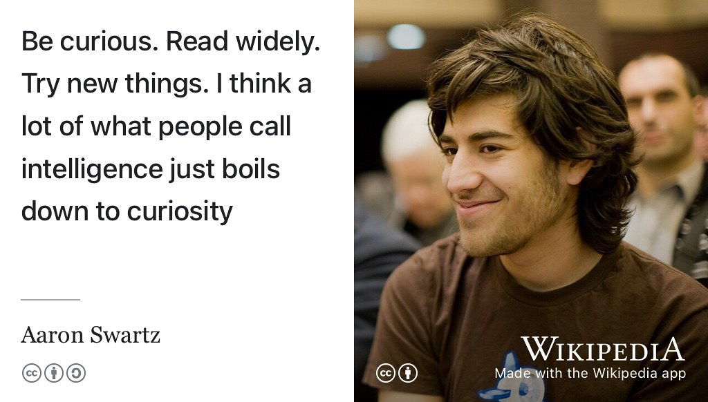
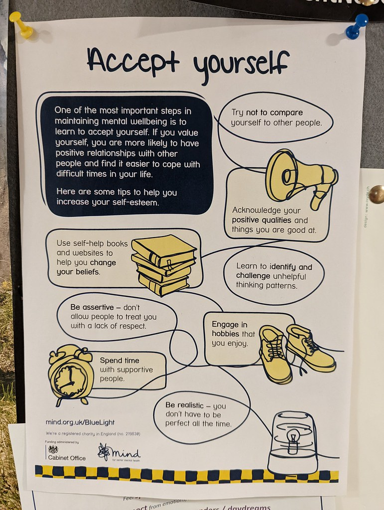
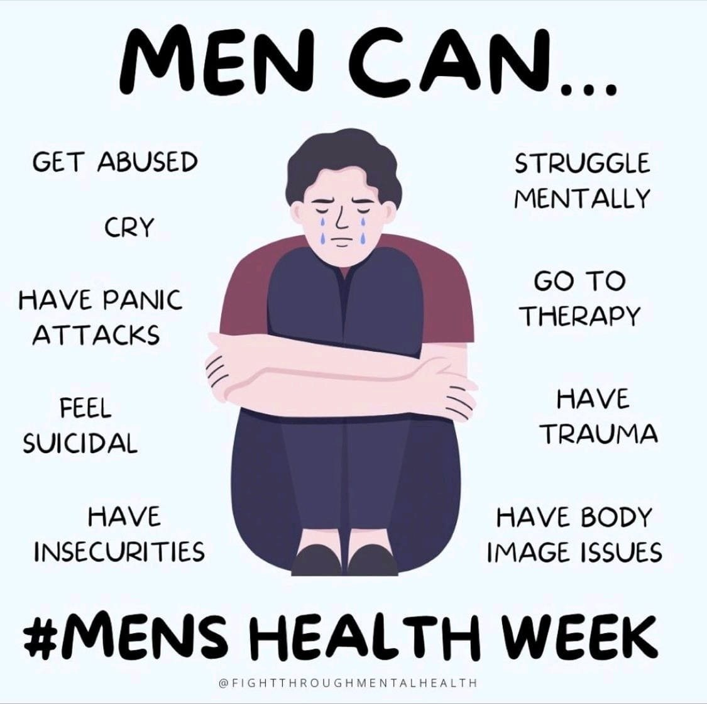

# Nurturing your future {#nurturing}

It doesn't matter if you are a student, an employee or even both at the same time. To be successful at studying or working, you need to take your well-being seriously. By well-being, I mean your health and happiness. Your health isn't just about your physical health but also your mental health and the two are very closely linked. It's all too easy when you are busy or stressed to neglect your well-being and then **bad-stuff™** happens. This chapter looks at your well-being, and how you can nurture it. Because looking after yourself now will also nurture your future. 😀

```{r turing-fig, echo = FALSE, fig.align = "center", out.width = "100%", fig.cap = "(ref:captionturunning)"}
knitr::include_graphics("images/alan-turing-runner.jpg")
```
(ref:captionturunning) Enduring Turing: You probably already knew that [Alan Turing](https://en.wikipedia.org/wiki/Alan_Turing) was an outstanding Computer Scientist, but did you know he was also a respectable athlete too? Turing ran, cycled and rowed to relieve stress, and came close to competing in the Olympics as a runner [@kottke]. This should come as no surprise, the connections between well-being and academic performance are widely documented. Image via Jonathan Swinton's biography *Alan Turing's Manchester*. [@manturing] The copyright holder for this image has been unidentifiable or unresponsive at their self-advertised contact details.

Your future is bright, your future needs nurturing, so let's start nurturing your future.

## What you will learn {#ilo3}

By the end of this chapter you will be able to:

1. Identify some of the symptoms of mental ill health in yourself and your peers, particularly anxiety and depression
1. Describe five self-help techniques for improving mental health
1. Describe services and other people you can approach if you (or someone you know) is being affected by mental ill health and self-help isn't enough
1. Schedule activities for improving mental and physical health into your daily or weekly routine


<!--* Formulate strategies for coping with rejection and failure-->

## Stressed, depressed and exam obsessed? {#genz}
One of the main target audiences for this textbook is [Generation Z](https://en.wikipedia.org/wiki/Generation_Z), that's people born sometime between the mid-nineties to early 2000's. There's some evidence to suggest that Gen-Z-ers like you have a higher probability than previous generations of being, as *[The Economist](https://en.wikipedia.org/wiki/The_Economist)* puts it:

* Stressed
* Depressed
* Exam obsessed

Are you stressed? Depressed? Exam obsessed? Have smartphones and social media had a negative effect on your mental health? [@twenge; @destroying] Are you more worried about getting good grades than drinking too much or having unplanned pregnancies? According to *The Economist* members of Generation Z are more likely to be affected by mental health issues. [@generationz] If that's you then you are not alone. Stress, depression and results obsession have been around a while. Many people struggle with them so let's look at them in a bit more detail.

::: {.rmdcaution}

(ref:codingcaution)

I am neither a medical doctor, psychiatrist or a psychologist!

This chapter is based on my personal experiences of clinical depression, [antidepressants](https://en.wikipedia.org/wiki/Antidepressant) and the experience of close friends and colleagues who have been affected by generalised anxiety disorder. So this chapter gives you a quick overview of mental health and points you to where you can find out more.

If you are affected by mental ill health, you should speak to a trained professional. 

:::


## Mental hygiene {#illhealth}

Stress can lead to many kinds of mental ill health or poor mental hygiene. Turing was put under lots of stress by his government bosses, people like [Alastair Denniston](https://en.wikipedia.org/wiki/Alastair_Denniston) and [Stewart Menzies](https://en.wikipedia.org/wiki/Stewart_Menzies). [@imitationgame] When asked why he punished himself so much in training (see figure \@ref(fig:turing-fig)), Alan Turing's reply is shown in figure \@ref(fig:turing-stress-fig).

```{r turing-stress-fig, echo = FALSE, fig.show = "hold", fig.align = "center", out.width = "99%", fig.cap = "(ref:captionturingstress)"}

```
(ref:captionturingstress) When asked why he trained so hard, [Alan Turing](https://en.wikipedia.org/wiki/Alan_Turing) replied: “I have such a stressful job that the only way I can get it out of my mind is by running hard; it’s the only way I can get some release”. Like many, Turing found running a relief from the mental pressures he was under in his job. [@kottke] Studying can be stressful too and put you under pressure. Your academic performance at University can be significantly improved by taking regular exercise and it will improve your mental health too. Public domain portrait of Alan Turing aged 16 via Wikimedia Commons [w.wiki/oZx](https://w.wiki/oZx) adapted using the [Wikipedia app](https://apps.apple.com/gb/app/wikipedia/id324715238)

University is a positive experience for many people, however like Alan, you may also experience periods of stress. This may also be accompanied by anxiety, loneliness and depression. Financial, social and academic pressures alongside concerns about employability, fallout from COVID-19, war, AI taking over the world and climate change (*etc*) can all have an impact on your wellbeing. Statistically, one in four of us will be affected by mental ill health during our lifetime. Two of the most common forms of mental ill health are:

* **Anxiety**: *persistent* feelings of unease, such as worry or fear
* **Depression**: a low mood that *lasts for a long time* and affects your everyday life. Being affected by depression is **not** the same as feeling sad
<!--* loneliness and isolation
* stress, how you feel under pressure-->
<!--Your brain is a complex organ that is not fully understood, so it is not surprising that brains sometimes need treatment when things go wrong.-->

The *persistent* and *lasting a long time* are important here because while its part of the human condition to worry and feel sad, that doesn't *necessarily* mean you are affected by poor mental health. How long is a long time? Definitions vary, but around two weeks is a good rule of thumb. There are many forces ($F$) at play, feelings of sadness or anxiousness are normally balanced out by counteracting feelings of calm or happiness shown in figure \@ref(fig:free-body-fig):

<!--$F_S_A_D$-->

* Forces that make you unhappy: **$F$~SAD~**
* Forces that make you happy: **$F$~HAPPY~**
* Forces that make you anxious: **$F$~ANXIOUS~**
* Force that make you calm: **$F$~CALM~**

```{r free-body-fig, echo = FALSE, fig.show = "hold", fig.align = "center", out.width = "99%", fig.cap = "(ref:captionfreebody)"}

```
(ref:captionfreebody) Your mental health is like a balloon, acted on by forces of anxiety, calmness, happiness and sadness. These opposing forces normally balance each other out over time. Crudely speaking: (😰 + 😎) + (🙂 + 🙁) = 😐. Good mental health means your balloon stays airborne, despite the inevitable up and downs. If you are affected by poor mental health, feelings of anxiety or sadness will outweigh their counterparts, leading to *persistent* anxiousness or depression. This will cause your balloon (mental health) to “crash”. This chapter introduces what these mental health issues are and what you can do if you, or someone you know, is affected by poor mental health. [Free body diagram](https://en.wikipedia.org/wiki/Free_body_diagram) by [Visual Thinkery](https://visualthinkery.com) is licensed under [CC-BY-ND](https://creativecommons.org/licenses/by-nd/4.0/) 🎈

It might help to conciously list what these forces are so that you are more mindful of them.

<!--https://youtu.be/RsfNkSZmUc8-->

### Anxiety {#anxiety}

Anxiety is one of most common mental health disorders and can lead to depression, increased risk of suicide. Generalised Anxiety Disorder (GAD), a common form of anxiety is explained in the video in Figure \@ref(fig:anxious-fig) and at [nhs.uk/conditions/generalised-anxiety-disorder](https://www.nhs.uk/conditions/generalised-anxiety-disorder/). People who are affected by anxiety may struggle to function normally, and find routine everyday task difficult or impossible.


```{r anxious-fig, echo = FALSE, fig.align = "center", out.width = "99%", fig.cap = "(ref:captiongad)"}

```

(ref:captiongad) Generalised anxiety disorder is a condition characterised by excessive, persistent and unreasonable amounts of anxiety and worry about everyday things. Note that the video takes an American perspective using American terminology such as [DSM–5](https://www.psychiatry.org/psychiatrists/practice/dsm). The image in this figure is a screenshot, you can watch the full video at [youtu.be/9mPwQTiMSj8](https://youtu.be/9mPwQTiMSj8) [@youtube-anxiety]

### Depression {#depression}

Millions of people around the world live with depression. If you are affected by depression it can be really hard to talk about it as there are many social stigmas around mental health. Thankfully depression is largely preventable and treatable. Recognising depression and seeking help is the first and most critical step towards recovery. To mark [World Mental Health Day](https://en.wikipedia.org/wiki/World_Mental_Health_Day) writer and illustrator Matthew Johnstone tells the story of how he overcame the “black dog of depression” in the video in Figure \@ref(fig:sad-vid) made in collaboration with the World Health Organization (WHO).

```{r sad-vid, echo = FALSE, fig.align = "center", out.width = "99%", fig.cap = "(ref:captionblackdog)"}
knitr::include_url('https://www.youtube.com/embed/XiCrniLQGYc')
```

(ref:captionblackdog) Matthew Johnstone explains how he overcame the affects of depression, using the metaphor of the black dog. You can also watch the watch the 4 minute video embedded in this figure at [youtu.be/XiCrniLQGYc](https://youtu.be/XiCrniLQGYc) [@youtube-blackdog]

A common issue with poor mental health is that the people affected often don't realise they need help, partly because of the social stigmas that prevent people talking about mental health in the first place. Computer Scientist [Dave Cliff](https://en.wikipedia.org/wiki/Dave_Cliff_(computer_scientist)) explains how he recognised he was being affected by poor mental health in figure \@ref(fig:cliff-vid)

```{r cliff-vid, echo = FALSE, fig.align = "center", out.width = "99%", fig.cap = "(ref:captiondavecliff)"}
knitr::include_url('https://www.youtube.com/embed/OtELvV8-OK0')
```

(ref:captiondavecliff) “When you haven't slept a wink for five days, the madness arrives in the post very quickly afterwards”. [Dave Cliff](https://en.wikipedia.org/wiki/Dave_Cliff_(computer_scientist)) at the University of Bristol explains how he dealt with poor mental health, severe anxiety, depression and suicidal thoughts. [@thecliff] You can also watch the watch the 7 minute video embedded in this figure at [youtu.be/OtELvV8-OK0](https://youtu.be/OtELvV8-OK0) [@youtube-davecliff]

Just *talking* about mental health issues is an important step in removing the social stigmas that surround them. Talk to somebody, anybody about your mental halth, or be that person for somebody else to talk to about theirs.

### Drugs {#drugs}
Prescription medication can help some people with their mental health. For example, when I was affected by depression, [Selective Serotonin Reuptake Inhibitors](https://www.nhs.uk/conditions/ssri-antidepressants/) (SSRIs) worked for me, shown in Figure \@ref(fig:citalopram-fig), but they don't for everybody. Sometimes the drugs don't work, they just make you worse. [@drugsdontwork]

```{r citalopram-fig, echo = FALSE, fig.align = "center", out.width = "99%", fig.cap = "(ref:captioncitalopram)"}

```

(ref:captioncitalopram) [Citalopram](https://www.nhs.uk/medicines/citalopram/) is a type of antidepressant known as a Selective Serotonin Reuptake Inhibitor (SSRI). SSRI's can help some people who have been affected by depression. They work for some people (including me) but they don't for everybody. Skeletal formulae of Citalopram by Vaccinationist via Wikimedia Commons [w.wiki/3Ddn](https://w.wiki/3Ddn) adapted using the [Wikipedia app](https://apps.apple.com/gb/app/wikipedia/id324715238).

Some doctors prescribe [benzodiazepines](https://www.mind.org.uk/information-support/drugs-and-treatments/sleeping-pills-and-minor-tranquillisers/about-benzodiazepines/) for anxiety, which may be effective where SSRI's are not, but these can be addictive and have big side effects.

It is worth considering [cognitive behavioural therapy](https://en.wikipedia.org/wiki/Cognitive_behavioral_therapy) (CBT) before taking any medication.  *The Science of Wellbeing* (TSOWB) at [coursera.org/learn/the-science-of-well-being](https://www.coursera.org/learn/the-science-of-well-being) is an easy way to access some CBT free online, see the signposts section (section \@ref(signposts3)) at the end of this chapter. [@lauriesantos]

### Suicide {#suicide}
If you’re feeling suicidal, you don’t have to struggle with difficult feelings alone. If you’re suffering from emotional distress or struggling to cope a Samaritan can face your problems with you. Whatever you’re going through, [samaritans.org](https://www.samaritans.org/) are available 24 hours a day, 365 days a year. They respond to around 10,000 calls for help in the UK every day. No judgement. No pressure. Call them free any time, from any phone (in the UK) on 116 123. It's important to talk to *somebody*, see figure \@ref(fig:joydivision-fig).

```{r joydivision-fig, echo = FALSE, fig.align = "center", out.width = "99%", fig.cap = "(ref:captionjoydivision)"}

```

<!-- inclusion of note = {https://youtu.be/6x-Nl3_L1pA} in bib file for @isolation causes weird tex compilation error that doesn't make sense-->

(ref:captionjoydivision) It might not be immediately obvious to you that people around you may be having suicidal thoughts. [Ian Curtis](https://en.wikipedia.org/wiki/Ian_Curtis) was in a band called [Joy Division](https://en.wikipedia.org/wiki/Joy_Division), even his fellow band members [Bernard Sumner](https://en.wikipedia.org/wiki/Bernard_Sumner), [Peter Hook](https://en.wikipedia.org/wiki/Peter_Hook) and [Stephen Morris](https://en.wikipedia.org/wiki/Stephen_Morris_(musician)) didn't realise how poor his mental health was until after his suicide. In retrospect it is obvious when you read his lyrics [@isolation]. However, people who are affected by poor mental health often don't talk about it until it is too late - so it can be tricky to diagnose and help them in time, see section \@ref(samaritans) and \@ref(papryus). Fair use picture of [Ian Curtis](https://en.wikipedia.org/wiki/Ian_Curtis) by [Kevin Cummins](https://en.wikipedia.org/wiki/Kevin_Cummins_(photographer)) on Wikimedia Commons [w.wiki/4iWJ](https://w.wiki/4iWJ) adapted using the [Wikipedia app](https://apps.apple.com/gb/app/wikipedia/id324715238).

Suicide is the biggest killer of under 35's in the UK. Like many young men, [Ian Curtis](https://en.wikipedia.org/wiki/Ian_Curtis) in figure \@ref(fig:joydivision-fig) tragically took his own life when he was just 23 years old. Sadly, Curtis is on a long list of young people (predominantly men) who decided to end their lives early, like [Aaron Swartz](https://en.wikipedia.org/wiki/Aaron_Swartz) in figure \@ref(fig:aaron-swartz-fig).

```{r aaron-swartz-fig, echo = FALSE, fig.align = "center", out.width = "99%", fig.cap = "(ref:captionaaronswartz)"}

```

<!-- inclusion of note = {https://youtu.be/6x-Nl3_L1pA} in bib file for @isolation causes weird tex compilation error that doesn't make sense-->

(ref:captionaaronswartz) [Aaron Swartz](https://en.wikipedia.org/wiki/Aaron_Swartz) (1986–2013) was a [hacktivist](https://en.wikipedia.org/wiki/Hacktivism) and is another tragic example of a life ended prematurely by suicide, aged just 26. Some combination of depression and the impending court case of the [United States v. Swartz](https://en.wikipedia.org/wiki/United_States_v._Swartz) were the likely causes. [@ripaaron] Despite dying young, Aaron had an distinguished career. When asked how he got his job he replied: *“Be curious. Read widely. Try new things. I think a lot of what people call intelligence just boils down to curiosity”* [@swartzcurious] [CC BY](https://creativecommons.org/licenses/by/2.0/deed.en) portrait of Aaron Swartz by [Fred Benenson](http://fredbenenson.com/) on Wikimedia Commons [w.wiki/6ZvM](https://w.wiki/6ZvM) adapted using the [Wikipedia app](https://apps.apple.com/us/app/wikipedia/id324715238)

Globally, over 700,000 people die due to suicide every year, see [who.int/health-topics/suicide](https://www.who.int/health-topics/suicide). Every life lost to suicide is a tragedy because suicide is preventable, using two simple and very human tools:

1. talking 
1. listening

If you're feeling suicidal or you know someone who is, don't suffer (or let others suffer) in silence. Help is available, talk to someone if you're suffering or listen, by lending an ear to someone who is showing signs they might be struggling. You might need to [ask them twice](https://www.mentalhealthtoday.co.uk/news/awareness/ask-twice-people-urged-as-new-research-shows-three-quarters-of-brits-would-say-they-are-fine-even-if-struggling-with-a-mental-health-problem): are they *really* OK? Check out the resources in section \@ref(samaritans) and \@ref(papryus).

## Look after yourself {#lays}
Looking after yourself can serve to both prevent and treat mental health issues that can affect you in life. You might be your own worst critic, or perhaps when you're under pressure you neglect things that are proven to be beneficial for your mental health, like sleep, exercise, mindfulness and friendship. Looking after yourself means at least three things:

* being mindful of your feelings and learning to manage your inner critic
* being kind to yourself in various ways
* deliberately scheduling protected time to do the non-work things that matter.

```{r lookafter-fig, echo = FALSE, fig.align = "center", out.width = "50%", fig.cap = "(ref:captionlookafter)"}
knitr::include_graphics("images/Look after yourself.png")
```

(ref:captionlookafter) It's important not to neglect your body, mind, soul and social life when you're working hard. Look after yourself by [Visual Thinkery](https://visualthinkery.com) is licensed under [CC-BY-ND](https://creativecommons.org/licenses/by-nd/4.0/)

Harvard Psychologist [Laurie Santos](https://en.wikipedia.org/wiki/Laurie_R._Santos) describes five evidence-based strategies for coping when times are really challenging and tough in the video in figure \@ref(fig:laurie-vid). Those strategies are:

1. **Exercise**: getting regular exercise improves both physical AND mental health.
1. **Gratitude**: research shows that being grateful can significantly improve your mental health. One way to do this is by keeping a gratitude journal, a log you fill in everyday of things you are grateful for. This can include both the small and big things in life.
1. **Sleep**: actively developing healthier sleep patterns. Poor sleep hygiene can be both cause and effect of poor mental health. See the discussion of *[Why We Sleep](https://en.wikipedia.org/wiki/Why_We_Sleep)* [@whywesleep] in section \@ref(signposts3)
1. **Socialising**: give a higher priority to spending time with friends and family. There is good evidence to show this will make you happier than turning inward or diving deeper into work which could just make you more stressed, depressed or anxious [@lauranxiety]
1. **Mindfulness**: be mindful of emotions using the R.A.I.N. technique:
    * **R**ecognise: negative emotions
    * **A**ccept: accept and allow emotions rather than fighting or ignoring them
    * **I**nvestigate: notice how the emotion feels inside your body
    * **N**urture: be kind to yourself, step away from your emotions by distancing yourself from them.<!--Ruby Wax calls this non-identification which is the same thing-->

It can help to think of negative emotions as coming from another person, an inner critic, rather than yourself. You are not your emotions and thoughts. Laurie explains the R.A.I.N. technique in figure \@ref(fig:laurie-vid).

<!-- also woop my life     -->
<!-- you don't need to be exceptional-->
<!--https://occamstypewriter.org/scurry/2021/05/23/on-not-being-exceptional/ Alain de Botton via Stephen Curry-->
<!-- the cruel absurdities of other peoples expectations-->

```{r laurie-vid, echo = FALSE, fig.align = "center", out.width = "99%", fig.cap = "(ref:captionlaurie)"}
knitr::include_url('https://www.youtube.com/embed/kCQim9VrnDY')
```
(ref:captionlaurie) Laurie Santos describes five coping techniques for improving wellbeing: Exercise, gratitude, sleep, getting social and meditation. You can also watch the six minute video embedded in this figure at [youtu.be/kCQim9VrnDY](https://youtu.be/kCQim9VrnDY) [@youtube-santos].

The techniques described by Santos are not merely trashy [pop psychology](https://en.wikipedia.org/wiki/Popular_psychology) but scientifically proven techniques. [@yaden] So there are some simple things you can do to help yourself, but you may also need to seek help from others.

## Burnout {#burnout}
Sometimes a desire to be productive by overworking has exactly the opposite effect, because the sacrifices you make for work can be counter-productive. If you burn too brightly you might burnout completely, see [mentalhealth-uk.org/burnout](https://mentalhealth-uk.org/burnout/). 🔥

<!--see https://github.com/dullhunk/cdyf/issues/454-->

Sacrificing sleep, socialising, exercise and time-out to recharge your batteries can make you *less* productive, especially in the longer term.

```{r paul-nurse-vid, echo = FALSE, fig.align = "center", out.width = "99%", fig.cap = "(ref:paulnursecaption)"}
knitr::include_url('https://www.youtube.com/embed/vI0DyPkz9JI')
```

<!-- see https://github.com/dullhunk/cdyf/issues/439 -->

(ref:paulnursecaption) “If you really want to be good you musn't work too hard. If you work too hard just hard all the time you will keep going in the same direction. One big advantage of taking some relaxation is it makes your brain come down and then you come and look at it freshly. When you take off the pressure, to go off and go and walk for a day then you can imagine new things.” Advice from Nobel laureate [Paul Nurse](https://en.wikipedia.org/wiki/Paul_Nurse). You can also watch the 1 minute video embedded in this figure at [youtu.be/vI0DyPkz9JI](https://youtu.be/vI0DyPkz9JI) [@paulnurse]

I'm **not** saying don't work hard. Like Paul Nurse in figure \@ref(fig:paul-nurse-vid), I am arguing that you shouldn't work *too* hard. So work hard but don't overwork. Overworking [will literally kill you](https://www.bbc.com/worklife/article/20210518-how-overwork-is-literally-killing-us). [@overworking]

If you're making too many sacrifices to get the grades you want, ask yourself: is it really worth it? See section \@ref(entitled), \@ref(regret) and read [Is a first class degree really that important](https://on.ft.com/3Cc4Ynh)? You may need to recalibrate your relationship and expectations of work to either recover from burnout, or stop burning out in the first place [@happyburnout]

<!-- todo: how hard should you work for first class-->

## Help is available if you need it {#notalone}
If you are affected by mental ill health, particularly anxiety or depression, it can be hard:

* to recognise that you need help in the first place
* to help yourself using self-help resources
* to ask others to help you

Even if you don't need help, it is important to recognise and understand the symptoms of mental ill health. It's quite likely that someone you know will suffer from mental health issues and as their friend or peer, it might be you that can help by encouraging them to get the help they wouldn't otherwise ask for.  

**You are not alone**, help is available if you (or your friends) need it from a wide variety of sources:

### Your University {#unihelp}
There are lots of people who can help you:  

* your personal tutor or other academic members of staff
* non-academic staff in the University, for example in Manchester contact the Student Support Office (SSO) [studentsupport.manchester.ac.uk](https://www.studentsupport.manchester.ac.uk/)
* counselling services, for example contact [counsellingservice.manchester.ac.uk](https://www.counsellingservice.manchester.ac.uk/). The counselling service offers help on dealing with anxiety, depression, exam stress, confidence and other issues.
* peers, flat-mates, family, friends etc. People close to you can help, although some people affected by mental health find it easier to discuss mental health with a trained professional or volunteer because of the social stigmas. There are lots of services outlined below that provide this kind of service.

<!--### Anxiety UK https://www.anxietyuk.org.uk/ -->

### The National Health Service {#nhs}
As a student studying in the UK you are entitled to access free healthcare provided by the [National Health Service](https://en.wikipedia.org/wiki/National_Health_Service) (NHS) of the United Kingdom. To do so you'll need to be registered with your general practitioner (GP), see [nhs.uk: Getting medical care as a student](https://www.nhs.uk/live-well/healthy-body/getting-medical-care-as-a-student/)

Your doctor can advise you on medical treatment if required, see for example [nhs.uk/conditions/antidepressants](https://www.nhs.uk/conditions/antidepressants/)

### Nightline {#nightline}
Nightline [nightline.ac.uk](https://www.nightline.ac.uk) is a confidential listening and information service run by students for students. Nightline is open 8pm till 8am every night during term time. It offers anonymous, non-judgmental and non-advisory support for students as described in figure \@ref(fig:nightline-vid).

```{r nightline-vid, echo = FALSE, fig.align = "center", out.width = "99%", fig.cap = "(ref:nightline)"}
knitr::include_url('https://www.youtube.com/embed/RsfNkSZmUc8')
```

(ref:nightline) Students explain in their own words how calling Nightline helped them whilst at university. You can also watch the 1 minute video embedded in this figure at [youtu.be/RsfNkSZmUc8](https://youtu.be/RsfNkSZmUc8) [@youtube-nightline]

Manchester students can contact nightline at [nightmail@nightline.manchester.ac.uk](mailto:nightmail@nightline.manchester.ac.uk) and expect a reply within 48 hours. See [manchester.nightline.ac.uk](https://manchester.nightline.ac.uk/) for details.

### The Samaritans {#samaritans}
The [Samaritans](https://en.wikipedia.org/wiki/Samaritans_(charity)) are a charity who provide emotional support to anyone in the the United Kingdom and Ireland that:

* is suffering from emotional distress
* is struggling to cope
* is at risk of suicide

The name of the charity comes from the [Parable of the Good Samaritan](https://en.wikipedia.org/wiki/Parable_of_the_Good_Samaritan) although the organisation itself is not religious. The Samaritans are available 24 hours a day, seven days a week, to talk confidentially about any problem, however big or small. See [samaritans.org](https://www.samaritans.org/) or telephone 116 123.

### Papryus {#papryus}
Papyrus believe that many young suicides can be prevented, they are a national charity that you can find out more about at [papyrus-uk.org](https://www.papyrus-uk.org/) or telephone the free number 0800 068 4141. See their application [stayalive.app](https://stayalive.app/)


### Students Against Depression {#sad}

Students Against Depression (SAD) acknowledge the devastating impact that depression can have on those experiencing it, as well as on their friends, family and supporters. For further help in understanding and coping with suicidal thoughts, and emergency contacts in a crisis, visit  [studentsagainstdepression.org](https://www.studentsagainstdepression.org/)

Actor [Ruby Wax](https://en.wikipedia.org/wiki/Ruby_Wax) has written about mental health and how the “internal critics” in our minds can send us mad in her book *Sane New World*. [@sanenewworld] She is interviewed by Students Against Depression in the video in figure \@ref(fig:rubywax-vid) about using mindfulness to “dodge the bullets” of depression.


```{r rubywax-vid, echo = FALSE, fig.align = "center", out.width = "99%", fig.cap = "(ref:rubywax)"}
knitr::include_url('https://www.youtube.com/embed/7TCCLY_lV6M')
```

(ref:rubywax) Ruby Wax describes being affected by depression in her childhood and how mindfulness and cognitive behavioural therapy (CBT) provided an alternative to medical treatment enabling her to dodge the bullets of mental health. You can also watch the 2 minute video embedded in this figure at [youtu.be/7TCCLY_lV6M](https://youtu.be/7TCCLY_lV6M) [@youtube-wax]


### Self-help services {#selfhelp}
Self-Help services are a mental health charity which helps people to help themselves, see [selfhelpservices.org.uk](https://www.selfhelpservices.org.uk/) or phone 0161 226 3871.

### MIND {#mindhelp}
MIND provide advice and support to empower anyone experiencing a mental health problem. They campaign to improve services, raise awareness and promote understanding of mental health issues. Find out more at [mind.org.uk](https://www.mind.org.uk) and in the video in figure \@ref(fig:stephenfry-vid)


```{r stephenfry-vid, echo = FALSE, fig.align = "center", out.width = "99%", fig.cap = "(ref:stephenfry)"}
knitr::include_url('https://www.youtube.com/embed/OPxHTZRwXX8')
```

(ref:stephenfry) [Stephen Fry](https://en.wikipedia.org/wiki/Stephen_Fry), President of Mind, describes how MIND tackles misconceptions around mental health and social stigmas. You can also watch the four minute minute video embedded in this figure at [youtu.be/OPxHTZRwXX8](https://youtu.be/OPxHTZRwXX8) [@youtube-we-are-mind]

### Student minds {#studentminds}

Student Minds empowers students to look after their own mental health, support others and create change, find out more at [studentminds.org.uk](https://www.studentminds.org.uk) and in the video in Figure \@ref(fig:studentminds-vid) which describes why it is important to talk about student mental health.


```{r studentminds-vid, echo = FALSE, fig.align = "center", out.width = "99%", fig.cap = "(ref:studentminds)"}
knitr::include_url('https://www.youtube.com/embed/PiqcSSDwvvY')
```

(ref:studentminds) Talking about mental health is a crucial part of helping those who are suffering from it. You can also watch the 1 minute video embedded in this figure is also available at [youtu.be/PiqcSSDwvvY](https://youtu.be/PiqcSSDwvvY) [@youtube-student-minds]

<!-- to do

A description of WOOP

-->

<!-- manchester only, so maybe not relevant here
### Kwan Wai
via https://www.cs.manchester.ac.uk/about/news/full-article/?articleid=4558
Kwan Wai (Chinese Mental Health Service): one to one counselling in Mandarin and a drop-in/support service. 0161 272 7482/ 0161 833 0377 waiyin.org.uk/projects/health-social-care/kwan-wai-mental-health-->


<!--

### Shopping list {#happy}
1. What is the relationship between physical and mental health? [@Chekroud2018]
1. What effect can social media have on your mental wellbeing? [@lanier; @socialmedia]
1. How does sleep affect mental health? [@whywesleep]
1. What is imposter syndrome?
1. What medical treatments are available?
1. How do employers or universities help with mental health?-->


### Togetherall {#togetherall}


Togetherall is an online community for people who are stressed, anxious or feeling low. The service has an active forum with round-the-clock support from trained professionals. You can talk anonymously to other members and take part in group or 1-to-1 therapy with therapists. Togetherall is for anyone aged 16 or over who wants to improve their mental health. The service is free for many universities. Find out more at [togetherall.com](https://togetherall.com/) and in the video in figure \@ref(fig:togetherall-vid) which describes why its important to talk about student mental health.


```{r togetherall-vid, echo = FALSE, fig.align = "center", out.width = "99%", fig.cap = "(ref:togetherall)"}
knitr::include_url('https://youtube.com/embed/mXEbpaU9YjU')
```

(ref:togetherall) A quick look inside togetherall, an online community for people who are stressed, anxious or feeling low. You can also watch the 1 minute video embedded in this figure at [youtu.be/mXEbpaU9YjU](https://youtu.be/mXEbpaU9YjU) [@youtube-togetherall]
<!--## Physical Turing Test {#turingtest}  

Turing took up long-distance running and was good enough to come close to being selected for the English national team and competing in the Olympics.  It is no coincidence that alongside Turing's extraordinary mental capabilities he had good physical health because these abilities complement each other. If you look after your physical health, you will be able to relieve the stresses and anxieties in your life to improve your mental health. You'll also ensure you can perform to the best of your mental abilities while at University and beyond. You can find out more about Alan Turing's time in Manchester in Jonathan Swinton's enlightening biography *Alan Turing's Manchester* [@manturing]-->

<!--Turing was a mental and physical athlete, he was a cyclist as well as a runner.-->

<!--
## scheduling
say something about SMART goals
-->


## Developing a growth mindset {#growthmindset}

Learning at University can be hard because you might have gone from being at (or near) the top of the class in high school to no longer being top of the class at University.

Likewise the job hunting described in chapter \@ref(finding) can take a heavy toll on your mental health because repeated rejection is an ordinary part of the process. It can be time consuming, stressful and demoralising. You may find your applications disappear into a black hole. They will be ghosted (ignored) by employers. Interviewers will blank you and refuse to give you meaningful feedback because they're too busy. This could happen multiple times. This is all *[par for the course](https://en.wiktionary.org/wiki/par_for_the_course)*, normal and expected, and is not necessarily a reflection on your abilities or potential. See the examples in the coding interview section \@ref(codinginterview). [@youtube-petia]

```{r fixedminset-fig, echo = FALSE, fig.align = "center", out.width = "90%", fig.cap = "(ref:captionfixedmindset)"}
knitr::include_graphics("images/the-fixed-mindset.png")
```
(ref:captionfixedmindset) A fixed mindset is monolithic like the [Easter island statues (moʻai)](https://en.wikipedia.org/wiki/Moai). If you're not already, you should be wary of a fixed mindset. [Fixed mindsets](https://bryanmmathers.com/fixed-mindsets/) by [Visual Thinkery](https://visualthinkery.com) is licensed under [CC-BY-ND](https://creativecommons.org/licenses/by-nd/4.0/)

Adopting a growth mindset can be a successful strategy for maintaining your wellbeing, see figure \@ref(fig:fixedminset-fig). If your grades aren't has good as you hoped or your search for employment is being met with repeated rejection, a growth mindset can help. Let's take rejection from potential employers as an example, there are two ways you can react to it:

1. ***Fixed mindset***: responding with a fixed mindset will mean you are likely to take rejection personally. You might even assume that this confirms what you've always suspected. You're not good enough or that you made some fatal mistake in your applications or interviews. Ouch.
2. ***Growth mindset***: by responding to rejection with a growth mindset, you focus on what happens next. Rejection is not failure but a "not yet" described in figure \@ref(fig:not-vid). Maybe you're not yet ready for that employer, but you'll definitely have a good idea of what you learned from the process and how can you do better next time.

According to Stanford psychologist [Carol Dweck](https://en.wikipedia.org/wiki/Carol_Dweck) we can all be placed on a spectrum describing where we think our abilities come from. At one end, the fixed mindset assumes all kinds of abilities are fixed traits while at the other end, a growth mindset assumes these abilities can be developed over time. [@dweck] There is good evidence that adopting a growth mindset will make you a better learner who can cope with the inevitable failures and rejections in life better. This approach can be used in a range of different disciplines such as learning programming languages [@Cutts2010], music [@Davis2016] and job hunting.


```{r not-vid, echo = FALSE, fig.align = "center", out.width = "99%", fig.cap = "(ref:captiondweck)"}
knitr::include_url('https://www.youtube.com/embed/J-swZaKN2Ic')
```

(ref:captiondweck) Psychologist Carol Dweck explains the power of *not yet* and the growth mindset. You can also watch the 11 minute video embedded in this figure at [youtu.be/J-swZaKN2Ic](https://youtu.be/J-swZaKN2Ic) [@youtube-dweck]

## Wellbeing signposts {#signposts3}

This chapter has looked at your wellbeing and especially the role that both your mental health and physical health play in your future. [Matt Haig](https://en.wikipedia.org/wiki/Matt_Haig)’s first-hand accounts of poor mental health will be comforting to anyone who is affected by mental ill health. Even if you're not affected, there is a 25% chance you will be at some point in your life. There’s also a high probability someone close to you will suffer from mental health issues. It might be a colleague, friend, family member, fellow student or partner, so it is worth educating yourself on the issues by reading his two short books:

1. *Notes on a Nervous Planet* is a personal account of anxiety [@nervousplanet]
1. *[Reasons to Stay Alive](https://en.wikipedia.org/wiki/Reasons_to_Stay_Alive)* is a personal account of depression [@stayalive]

What’s good about Matt Haig’s books is they are quick and easy to read, but give plenty of first-hand insight into what mental ill-health can do to people (including you). Matt describes his top five tips for good mental health in figure \@ref(fig:haig-vid)

```{r haig-vid, echo = FALSE, fig.align = "center", out.width = "99%", fig.cap = "(ref:captionhaig)"}
knitr::include_url('https://www.youtube.com/embed/JMm5kiiMjTM')
```

(ref:captionhaig) Two of Matt Haig's top five tips for good mental health include 1. Being more careful (and mindful) of social media and 2. Reading more books because books are good for your soul. Not just his book. Any book. Books are good for you. Trust me on this. You can also watch the 4 minute video embedded in this figure at [youtu.be/JMm5kiiMjTM](https://youtu.be/JMm5kiiMjTM) [@youtube-haig]

There’s plenty of evidence that social media can have a detrimental effect on health. [Jaron Lanier](https://en.wikipedia.org/wiki/Jaron_Lanier)’s skeptical polemic *Ten Arguments for Deleting Your Social Media Accounts Right Now* [@lanier] is a thought-provoking romp through some of the pitfalls of social media that may have you reaching for the delete or un-install button fairly quickly. You don't have to be on social media, see figure \@ref(fig:socialmedia-fig).

```{r socialmedia-fig, echo = FALSE, fig.show = "hold", out.width = "32%", fig.cap = "(ref:captionsocialmedia)"}
knitr::include_graphics(rep("images/you-dont-have-to-be-on-social-media.png", 3))
```

(ref:captionsocialmedia) Social media like LinkedIn clearly has its uses (see section \@ref(links)) but you you don't *have* to be on it at all. Poor mental health is just one reason to be wary of social media, for nine other reasons read [Jaron Lanier's polemic](http://www.jaronlanier.com/tenarguments.html). [@lanier] Notes to Strangers by [andy-leek.com](http://www.andy-leek.com/) photographed by [Duncan Cumming](https://www.flickr.com/photos/duncan/51014540593)

If all these books are making you sleepy, neuroscientist Matthew Walker’s *[Why We Sleep: The New Science of Sleep and Dreams](https://en.wikipedia.org/wiki/Why_We_Sleep)* may change your view on the importance of a good nights sleep. [@whywesleep]

Finally, it's well worth taking a look at [Laurie Santos](https://en.wikipedia.org/wiki/Laurie_R._Santos) course on *The Science of Wellbeing* (TSOWB) at [coursera.org/learn/the-science-of-well-being](https://www.coursera.org/learn/the-science-of-well-being). [@lauriesantos] TSOWB course provides an alternative to medication as it follows the principles of cognitive behavioural therapy (CBT).

TSOWB is the most popular course at Yale University and looks at some simple techniques you can use to improve your happiness. [@happinessny] The course will help you increase your happiness and build more productive habits. Using the latest research, Santos describes the misconceptions about happiness and “annoying features” of your mind that can impair your well-being. The course takes about 19 hours to complete but you can spread this over a whole semester (or longer) if you choose. The short clip in figure \@ref(fig:laurie-vid) gives you a brief taster of Laurie's style and work.


<!-- santos video at https://www.youtube.com/watch?v=HStWtmSCAS8 -->

## Breakpoints {#bp3}

(ref:breakpoint)

```md
* PAUSE ⏸️
```

* How would you describe your own state of mental health?
* Do you have friends or peers who are affected by mental ill health?
    + What are the signs they might be suffering?
    + How could you support or help them better?
* If you describe your own mental health as poor
    + Where can you go for self-help?
    + You are not alone but who can you talk to?

```md
* RESUME ▶️
```

## Summarising well-being {#tldr3}
(ref:tldr)

Your future is bright, your future needs nurturing. Nurturing your future will help you design your future. Designing your future will help you to start coding your future. 

```{r mindyourhealth-fig, echo = FALSE, fig.show = "hold", out.width = "100%", fig.cap = "(ref:captionmindyourhealth)"}

```

(ref:captionmindyourhealth) Accepting yourself for who you are will improve your mental health and self-esteem. This can, in turn, help you prevent or treat problems caused by anxiety and depression. Poster via [mind.org.uk](https://www.mind.org.uk/)

Anxiety and depression are serious conditions that are very likely to affect you or somebody close to you while you are at University. There's a one in four chance that you will be affected by mental health issues at some point in your life.

We've only talked about two particular mental health issues, anxiety and depression, but there are many other conditions such as phobias, obsessive-compulsive disorder (OCD), eating disorders, self-harm and more that are beyond the scope of this chapter. They do have one thing in common, and that is that talking about them is an important part of starting to develop better mental health. Mental health can affect everyone, all genders, classes and races.

```{r buchan-fig, echo = FALSE, fig.show = "hold", out.width = "100%", fig.cap = "(ref:captionbuchan)"}

```

(ref:captionbuchan) Both men and women can be affected by mental health. Poster via [an original tweet by Iain Buchan](https://twitter.com/profbuchan/status/1540228377608585216)

If you are affected by mental ill health, talking about it is the best place to start, but often the hardest. You can continue by:

1. Accepting yourself for who you are, see chapter \@ref(exploring)
1. Learning to identify and challenge unhelpful thinking patterns
1. Avoiding the trap of compare yourself to other people too much

... are three more steps you can take to help yourself, see figure \@ref(fig:mindyourhealth-fig). In this chapter, I've outlined some ways you can help yourself alongside some of the services and people you can talk to if you need to.

Despite how you might feel, you are not alone.


In the next part, we'll discuss the importance of written communication, both as a tool for improving self-awareness but also a technique for persuading people to invite you to a job interview, in chapter \@ref(writing): *Writing your Future*.
