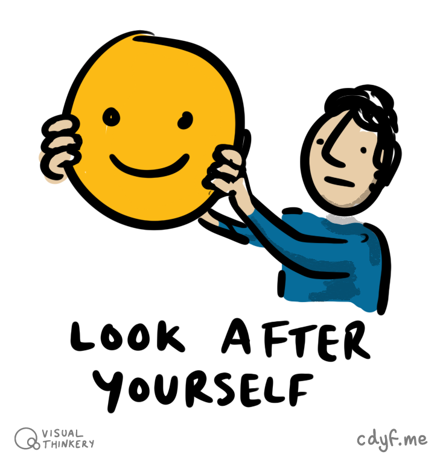

# Your well-being {#wellbeing}

It doesn't matter if you are a student, an employee or even both at the same time. To be successful at studying or working, you need to take your well-being seriously. By well-being, I mean your health and happiness. Your health isn't just about your physical health but also your mental health and the two are very closely linked. It's all too easy when you are busy or stressed to neglect your well-being and then **bad-stuff™** happens. This chapter looks at your well-being, and how you can nurture it. 😀

```{r turing-fig, echo = FALSE, fig.align = "center", out.width = "100%", fig.cap = "(ref:captionturunning)"}
knitr::include_graphics("images/alan-turing-runner.jpg")
```
(ref:captionturunning) [Alan Turing](https://en.wikipedia.org/wiki/Alan_Turing) was an outstanding Computer Scientist, but did you know he was also a respectable athlete too? He ran, cycled and rowed to relieve stress, [@kottke] and came close to competing in the Olympics as a runner. This should come as no surprise, the connections between well-being and academic performance are widely documented. Image via Jonathan Swinton's biography *Alan Turing's Manchester*. [@manturing] The copyright holder for this image has been unidentifiable or unresponsive at their self-advertised contact details.

## What you will learn {#ilo3}

By the end of this chapter you will be able to:

* Identify some of the symptoms of mental ill health in yourself and your peers, particularly anxiety and depression
* Describe five self-help techniques for improving mental health
* Describe services and other people you can approach if you (or someone you know) is being affected by mental ill health and self-help isn't enough
* Schedule activities for improving mental and physical health into your daily or weekly routine
<!--* Formulate strategies for coping with rejection and failure-->

## Mental ill health {#illhealth}

Stress can lead to many kinds of ill health. On describing his work for the government, Alan Turing said that:

> I have such a stressful job that the only way I can get it out of my mind is by running hard; it’s the only way I can get some release --Alan Turing’s response on why he punished himself so much in training, as recounted by J F Harding, who was secretary of the Walton Athletic Club at the time [@kottke]

University is a positive experience for many people, however like Alan, you may also experience periods of stress. This may also be accompanied by anxiety, loneliness and depression. Financial, social and academic pressures alongside concerns about employability and coronavirus can all have an impact on your wellbeing. Statistically, one in four of us will be affected by mental ill health during our lifetime. Two of the most common forms of mental ill health are:

* **Anxiety**: *persistent* feelings of unease, such as worry or fear
* **Depression**: a low mood that *lasts for a long time* and affects your everyday life
<!--* loneliness and isolation
* stress, how you feel under pressure-->
<!--Your brain is a complex organ that is not fully understood, so it is not surprising that brains sometimes need treatment when things go wrong.-->

The *persistent* and *lasting a long time* are important here because while its part of the human condition to worry and feel low, that doesn't *necessarily* mean you are affected by poor mental health.

<!--https://youtu.be/RsfNkSZmUc8-->

### Anxiety

Anxiety is one of most prevalent mental health disorders and can lead to depression, increased risk of suicide. Generalised Anxiety Disorder (GAD), a common form of anxiety is explained in the video in Figure \@ref(fig:anxious-fig) and at [nhs.uk/conditions/generalised-anxiety-disorder](https://www.nhs.uk/conditions/generalised-anxiety-disorder/). People who are affected by anxiety may struggle to function normally, and find routine everyday task difficult or impossible.

`r if (knitr::is_html_output()) '
<iframe width="560" height="315" src="https://www.youtube.com/embed/9mPwQTiMSj8" frameborder="0" allowfullscreen></iframe>
'`
```{r anxious-fig, echo = FALSE, fig.align = "center", out.width = "0.1%", fig.cap = "Generalised anxiety disorder is a condition characterised by excessive, persistent and unreasonable amounts of anxiety and worry about everyday things. You'll need to click through to youtube.com to watch the full video"}
knitr::include_graphics("images/emptyFFFFFF-0.png")
```

### Depression

Millions of people around the world live with depression. If you are affected by depression it can be really hard to talk about it as there are many social stigmas around mental health. Thankfully depression is largely preventable and treatable. Recognising depression and seeking help is the first and most critical step towards recovery. To mark [World Mental Health Day](https://en.wikipedia.org/wiki/World_Mental_Health_Day) writer and illustrator Matthew Johnstone tells the story of how he overcame the “black dog of depression” in the video in Figure \@ref(fig:sad-fig) made in collaboration with the World Health Organization (WHO).

`r if (knitr::is_html_output()) '
<iframe width="560" height="315" src="https://www.youtube.com/embed/XiCrniLQGYc" frameborder="0" allowfullscreen></iframe>
'`
```{r sad-fig, echo = FALSE, fig.align = "center", out.width = "0.1%", fig.cap = "Matthew Johnstone explains how he overcame the affects of depression, using the metaphor of the black dog"}
knitr::include_graphics("images/emptyFFFFFF-0.png")
```

## Look after yourself
Looking after yourself can serve to both prevent and treat mental health issues that can affect you in life. You might be your own worst critic, or perhaps when you're under pressure you neglect things that are proven to be beneficial for your mental health, like sleep, exercise, mindfulness and friendship. Looking after yourself means at least three things:

* being mindful of your feelings and learning to ignore your inner critic
* being kind to yourself in various ways
* deliberately scheduling protected time to do the non-work things that matter.

```{r lookafter-fig, echo = FALSE, fig.align = "center", out.width = "50%", fig.cap = "(ref:captionlookafter)"}

```

(ref:captionlookafter) It's important not to neglect your body, mind, soul and social life when you're working hard. Look after yourself by [Visual Thinkery](https://visualthinkery.com) is licensed under [CC-BY-ND](https://creativecommons.org/licenses/by-nd/4.0/)

Psychologist Laurie Santos describes five evidence-based strategies for coping when times are really challenging and tough in the video in figure \@ref(fig:laurie-fig). Those strategies are:

1. Exercise: getting regular exercise improves both physical AND mental health.
1. Gratitude: research shows that being grateful can significantly improve your mental health. One way to do this is by keeping a gratitude journal, a log you fill in everyday of things you are grateful for (either small or big)
1. Sleep: actively developing healthier sleep patterns. Poor sleep hygiene can be both cause and effect of poor mental health. See the discussion of *Why we sleep* [@whywesleep] in the [signposts section below](#signposts3)
1. Get social: prioritise time with friends and family, rather than turning inward or diving deeper into work
1. Mindfulness: be mindful of emotions using the R.A.I.N. technique:
    * **R**ecognise: negative emotions
    * **A**ccept: accept emotions rather than fighting them
    * **I**nvestigate: notice how the emotion feels inside your body
    * **N**urture: be kind to yourself

Laurie explains the R.A.I.N. technique in figure \@ref(fig:laurie-fig).

<!-- also woop my life     -->

`r if (knitr::is_html_output()) '
<iframe width="560" height="315" src="https://www.youtube.com/embed/kCQim9VrnDY" frameborder="0" allowfullscreen></iframe>
'`
```{r laurie-fig, echo = FALSE, fig.align = "center", out.width = "0.1%", fig.cap = "(ref:captionlaurie))"}
knitr::include_graphics("images/emptyFFFFFF-0.png")
```

(ref:captionlaurie) Laurie Santos describes five coping techniques for improving wellbeing: Exercise, gratitude, sleep, getting social and meditation.

So there are things you can do to help yourself, but you may also need to seek help from others. Sometimes a desire to be productive by working hard has the opposite effect, because the sacrifices you make can be counter-productive.

```{r lizandmollie-fig,echo=FALSE, fig.cap = "test caption"}
library(tweetrmd)
include_tweet("https://twitter.com/lizandmollie/status/1231605700960432128")
```


## Help is available if you need it {#notalone}
If you are affected by mental ill health, particularly anxiety or depression, it can be hard:

* to recognise that you need help in the first place
* to help yourself using self-help resources
* to ask others to help you

Even if you don't need help, its important to recognise and understand the symptoms of mental ill health. It's quite likely that someone you know will suffer from mental health issues and as their friend or peer, it might be you that can help by encouraging them to get the help they wouldn't otherwise ask for.  

**You are not alone**, help is available if you (or your friends) need it from a wide variety of sources:

### Your University
There are lots of people who can help you:  

* your personal tutor or other academic members of staff
* non-academic staff in the University, for example in Manchester contact the Student Support Office (SSO) [studentsupport.manchester.ac.uk](https://www.studentsupport.manchester.ac.uk/)
* counselling services, for example contact [counsellingservice.manchester.ac.uk](https://www.counsellingservice.manchester.ac.uk/). The counselling service offers help on dealing with anxiety, depression, exam stress, confidence and other issues.
* peers, flat-mates, family, friends etc. People close to you can help, although some people affected by mental health find it easier to discuss mental health with a trained professional or volunteer because of the social stigmas. There are lots of services outlined below that provide this kind of service.

<!--### Anxiety UK https://www.anxietyuk.org.uk/ -->

### The National Health Service
As a student studying in the UK you are entitled to access free healthcare provided by the [National Health Service](https://en.wikipedia.org/wiki/National_Health_Service) (NHS) of the United Kingdom. To do so you'll need to be registered with your general practitioner (GP), see [nhs.uk: Getting medical care as a student](https://www.nhs.uk/live-well/healthy-body/getting-medical-care-as-a-student/)

Your doctor can advise you on medical treatment if required, see for example [nhs.uk/conditions/antidepressants](https://www.nhs.uk/conditions/antidepressants/)

### Nightline
Nightline [nightline.ac.uk](https://www.nightline.ac.uk) is a confidential listening and information service run by students for students. Nightline is open 8pm till 8am every night during term time. It offers anonymous, non-judgmental and non-advisory support for students as described in figure \@ref(fig:nightline-fig).

`r if (knitr::is_html_output()) '
<iframe width="560" height="315" src="https://www.youtube.com/embed/RsfNkSZmUc8" frameborder="0" allowfullscreen></iframe>
'`
```{r nightline-fig, echo = FALSE, fig.align = "center", out.width = "0.1%", fig.cap = "Students explain in their own words how calling Nightline helped them whilst at university."}
knitr::include_graphics("images/emptyFFFFFF-0.png")

```

Manchester students can contact nightline at [nightmail@nightline.manchester.ac.uk](mailto:nightmail@nightline.manchester.ac.uk) and expect a reply within 48 hours. See [manchester.nightline.ac.uk](https://manchester.nightline.ac.uk/) for details.

### The Samaritans
The [Samaritans](https://en.wikipedia.org/wiki/Samaritans_(charity)) are a charity who provide emotional support to anyone in the the United Kingdom and Ireland that:

* is suffering from emotional distress
* is struggling to cope
* is at risk of suicide

The name of the charity comes from the [Parable of the Good Samaritan](https://en.wikipedia.org/wiki/Parable_of_the_Good_Samaritan) although the organisation itself is not religious. The Samaritans are available 24 hours a day, seven days a week, to talk confidentially about any problem, however big or small. See [samaritans.org](https://www.samaritans.org/) or telephone 116 123.

### Students Against Depression

Students Against Depression (SAD) acknowledge the devastating impact that depression can have on those experiencing it, as well as on their friends, family and supporters. For further help in understanding and coping with suicidal thoughts, and emergency contacts in a crisis, visit  [studentsagainstdepression.org](https://www.studentsagainstdepression.org/)

Actor [Ruby Wax](https://en.wikipedia.org/wiki/Ruby_Wax) has written about mental health and how the “internal critics” in our minds can send us mad in her book *Sane New World*. [@sanenewworld] She is interviewed by Students Against Depression in the video in figure \@ref(fig:rubywax-fig) about using mindfulness to “dodge the bullets” of depression.


`r if (knitr::is_html_output()) '
<iframe width="560" height="315" src="https://www.youtube.com/embed/7TCCLY_lV6M" frameborder="0" allowfullscreen></iframe>
'`
```{r rubywax-fig, echo = FALSE, fig.align = "center", out.width = "0.1%", fig.cap = "Ruby Wax describes being affected by depression in her childhood and how mindfulness and cognitive behavioural therapy (CBT) provided an alternative to medical treatment of her condition"}
knitr::include_graphics("images/emptyFFFFFF-0.png")

```

### Papryus
Suicide is the biggest killer of under 35's in the UK. Papyrus believe that many young suicides can be prevented, they are a national charity that you can find out more about at [papyrus-uk.org](https://www.papyrus-uk.org/) or telephone the free number 0800 068 4141.

### Self-help services
Self-Help services are a mental health charity which helps people to help themselves, see [selfhelpservices.org.uk](https://www.selfhelpservices.org.uk/) or phone 0161 226 3871.

### MIND
MIND provide advice and support to empower anyone experiencing a mental health problem. They campaign to improve services, raise awareness and promote understanding of mental health issues. Find out more at [mind.org.uk](https://www.mind.org.uk) and in the video in figure \@ref(fig:stephenfry-fig)


`r if (knitr::is_html_output()) '
<iframe width="560" height="315" src="https://www.youtube.com/embed/OPxHTZRwXX8" frameborder="0" allowfullscreen></iframe>
'`
```{r stephenfry-fig, echo = FALSE, fig.align = "center", out.width = "0.1%", fig.cap = "Stephen Fry, President of Mind, describes how MIND tackles misconceptions around mental health and social stigmas. "}
knitr::include_graphics("images/emptyFFFFFF-0.png")

```


### Student minds

Student Minds empowers students to look after their own mental health, support others and create change, find out more at [studentminds.org.uk](https://www.studentminds.org.uk) and in the video in Figure \@ref(fig:studentminds-fig) which describes why its important to talk about student mental health.

`r if (knitr::is_html_output()) '
<iframe width="560" height="315" src="https://www.youtube.com/embed/PiqcSSDwvvY" frameborder="0" allowfullscreen></iframe>
'`
```{r studentminds-fig, echo = FALSE, fig.align = "center", out.width = "0.1%", fig.cap = "Talking about mental health is a crucial part of helping those who are suffering from it"}
knitr::include_graphics("images/emptyFFFFFF-0.png")

```
<!-- to do

A description of WOOP

-->

<!-- manchester only, so maybe not relevant here
### Kwan Wai
via https://www.cs.manchester.ac.uk/about/news/full-article/?articleid=4558
Kwan Wai (Chinese Mental Health Service): one to one counselling in Mandarin and a drop-in/support service. 0161 272 7482/ 0161 833 0377 waiyin.org.uk/projects/health-social-care/kwan-wai-mental-health-->


<!--

### Shopping list {#happy}
1. What is the relationship between physical and mental health? [@Chekroud2018]
1. What effect can social media have on your mental wellbeing? [@lanier; @socialmedia]
1. How does sleep affect mental health? [@whywesleep]
1. What is imposter syndrome?
1. What medical treatments are available?
1. How do employers or universities help with mental health?-->


### Togetherall


Togetherall is an online community for people who are stressed, anxious or feeling low. The service has an active forum with round-the-clock support from trained professionals. You can talk anonymously to other members and take part in group or 1-to-1 therapy with therapists. Togetherall is for anyone aged 16 or over who wants to improve their mental health. The service is free for many universities. Find out more at [togetherall.com](https://togetherall.com/) and in the video in figure \@ref(fig:togetherall-fig) which describes why its important to talk about student mental health.

`r if (knitr::is_html_output()) '
<iframe width="560" height="315" src="https://www.youtube.com/embed/mXEbpaU9YjU" frameborder="0" allowfullscreen></iframe>
'`
```{r togetherall-fig, echo = FALSE, fig.align = "center", out.width = "0.1%", fig.cap = "A quick look inside togetherall, an online community for people who are stressed, anxious or feeling low."}
knitr::include_graphics("images/emptyFFFFFF-0.png")

```

<!--## Physical Turing Test {#turingtest}  

Turing took up long-distance running and was good enough to come close to being selected for the English national team and competing in the Olympics.  It is no coincidence that alongside Turing's extraordinary mental capabilities he had good physical health because these abilities complement each other. If you look after your physical health, you will be able to relieve the stresses and anxieties in your life to improve your mental health. You'll also ensure you can perform to the best of your mental abilities while at University and beyond. You can find out more about Alan Turing's time in Manchester in Jonathan Swinton's enlightening biography *Alan Turing's Manchester* [@manturing]-->

<!--Turing was a mental and physical athlete, he was a cyclist as well as a runner.-->

<!--
## scheduling
say something about SMART goals
-->

## Developing a growth mindset {#growthmindset}

Learning at University can be hard because you might have gone from being at (or near) the top of the class in high school to no longer being top of the class at University.

Likewise the [job hunting we describe in the chapter on searching](#searching) can take a heavy toll on your mental health because repeated rejection is an ordinary part of the process. It can be time consuming, stressful and demoralising. You may find your applications disappear into a black hole. They will be ghosted (ignored) by employers. Interviewers will blank you and refuse to give you meaningful feedback because they're too busy. This could happen multiple times. This is all *par for the course*, normal and expected, and is not necessarily a reflection on your abilities or potential.

Adopting a growth mindset can be a successful strategy for maintaining your wellbeing. If your grades aren't has good as you hoped or your search for employment is being met with repeated rejection, a growth mindset can help. Let's take rejection from potential employers as an example, there are two ways you can react to it:

1. ***Fixed mindset***: responding with a fixed mindset will mean you are likely to take rejection personally. You might even assume that this confirms what you've always suspected. You're not good enough or that you made some fatal mistake in your applications or interviews. Ouch.
2. ***Growth mindset***: by responding to rejection with a growth mindset, you focus on what happens next. Rejection is not failure but a "not yet" described in figure \@ref(fig:not-fig). Maybe you're not yet ready for that employer, but you'll definitely have a good idea of what you learned from the process and how can you do better next time.

```{r fixedminset-fig, echo = FALSE, fig.align = "center", out.width = "90%", fig.cap = "(ref:captionfixedmindset)"}
knitr::include_graphics("images/the-fixed-mindset.png")
```
(ref:captionfixedmindset) A fixed mindset is monolithic like the [Easter island statues](https://en.wikipedia.org/wiki/Moai). If you're not already, you should be wary of a fixed mindset. [Fixed mindsets](https://bryanmmathers.com/fixed-mindsets/) by [Visual Thinkery](https://visualthinkery.com) is licensed under [CC-BY-ND](https://creativecommons.org/licenses/by-nd/4.0/)

According to Stanford psychologist [Carol Dweck](https://en.wikipedia.org/wiki/Carol_Dweck) we can all be placed on a spectrum according to where we think our abilities come from. At one end, the fixed mindset assumes all kinds of abilities are fixed traits while at the other end, a growth mindset assumes these abilities can be developed over time. [@dweck] There is good evidence to suggest that adopting a growth mindset will make you a better learner who can cope with the inevitable failures and rejections in life better. This approach can be used in a range of different disciplines such as learning programming languages [@Cutts2010], music [@Davis2016] and job hunting.

`r if (knitr::is_html_output()) '
<iframe width="560" height="315" src="https://www.youtube.com/embed/J-swZaKN2Ic" frameborder="0" allowfullscreen></iframe>
'`
```{r not-fig, echo = FALSE, fig.align = "center", out.width = "0.1%", fig.cap = "(ref:captiondweck)"}
knitr::include_graphics("images/emptyFFFFFF-0.png")
```
(ref:captiondweck) Psychologist Carol Dweck explains the power of "not yet" and the growth mindset

## Wellbeing signposts {#signposts3}

This chapter has looked at your wellbeing and especially the role that both your mental health and physical health play in your future. [Matt Haig](https://en.wikipedia.org/wiki/Matt_Haig)’s first-hand accounts of poor mental health will be comforting to anyone who is affected by mental ill health. Even if you're not affected, there is a 25% chance you will do at some point in your life. There’s also a high probability someone close to you will suffer from mental health issues. It might be a colleague, friend, family member, fellow student or partner, so it is worth educating yourself on the issues by reading his two short books:

1. *Notes on a Nervous Planet* is a personal account of anxiety [@nervousplanet]
1. *[Reasons to Stay Alive](https://en.wikipedia.org/wiki/Reasons_to_Stay_Alive)* is a personal account of depression [@stayalive]

What’s good about Matt Haig’s books is they are quick and easy to read, but give plenty of first-hand insight into what mental ill-health can do to people (including you). Matt describes his top five tips for good mental health in figure \@ref(fig:haig-fig)

`r if (knitr::is_html_output()) '
<iframe width="560" height="315" src="https://www.youtube.com/embed/JMm5kiiMjTM" frameborder="0" allowfullscreen></iframe>
'`
```{r haig-fig, echo = FALSE, fig.align = "center", out.width = "0.1%", fig.cap = "(ref:captionhaig)"}
knitr::include_graphics("images/emptyFFFFFF-0.png")
```
(ref:captionhaig) Two of Matt Haig's top five tips for good mental health include 1. Being more careful (and mindful) of social media and 2. Reading more books because books are good for your soul. Not just his book. Any book. Books are good for you. Trust me on this. [@bookfriends]

There’s plenty of evidence to suggest that social media can have a detrimental effect on health. [Jaron Lanier](https://en.wikipedia.org/wiki/Jaron_Lanier)’s skeptical polemic *Ten Arguments for Deleting Your Social Media Accounts Right Now* [@lanier] is a thought-provoking romp through some of the pitfalls of social media that may have you reaching for the delete or un-install button fairly quickly.

If all these books are making you sleepy, neuroscientist Matthew Walker’s *[Why We Sleep: The New Science of Sleep and Dreams](https://en.wikipedia.org/wiki/Why_We_Sleep)* may change your view on the importance of a good nights sleep. [@whywesleep]

Finally, it's well worth taking a look at [Laurie Santos](https://en.wikipedia.org/wiki/Laurie_R._Santos) course on *The Science of Wellbeing* (TSOWB) at [coursera.org/learn/the-science-of-well-being](https://www.coursera.org/learn/the-science-of-well-being). [@lauriesantos] TSOWB is the most popular course at Yale University and looks at some simple techniques you can use to improve your happiness. [@happinessny] The course will help you  increase your happiness and build more productive habits. Using the latest research, Santos describes the misconceptions about happiness and “annoying features” of your mind that can impair your well-being. The course takes about 19 hours to complete but you can spread this over a whole semester (or longer) if you choose. The short clip in figure \@ref(fig:laurie-fig) gives you a brief taster of Laurie's style and work.


<!-- santos video at https://www.youtube.com/watch?v=HStWtmSCAS8 -->

## Summarising well-being {#tldr3}

[Too long, didn't read](https://en.wiktionary.org/wiki/too_long;_didn%27t_read) (TL;DR)? Here's a summary:

Anxiety and depression are serious conditions that are very likely to affect you or somebody close to you while you are at University. There's a one in four chance that you will be affected by mental health issues at some point in your life.

We've only talked about two particular mental health issues, anxiety and depression, but there are many other conditions such as phobias, obsessive-compulsive disorder (OCD), eating disorders, self-harm and more that are beyond the scope of this chapter. They do have one thing in common, and that is that talking about them is an important part of starting to develop better mental health.

If you are affected by mental ill health, talking about it is the first place to start, but often the hardest. In this chapter, I've outlined some ways you can help yourself alongside some of the services and people you can talk to if you need to. Despite how you might feel, you are not alone.
