# Writing your future {#writing}

We all have strengths and weaknesses, and for students of Computer Science, it is often their communication skills that let them down. Other chapters in this guidebook discuss the fundamental communication skills of [speaking](https://www.cdyf.me/speaking), [listening](https://www.cdyf.me/hearing) and [reading](https://www.cdyf.me/reading). This chapter looks at *written* communication because:

* every *engineer* is also a writer, and good engineers have good written communication skills
* every *scientist* is also a writer, and good scientists also have good written communication skills too

```{r no-writing-fig, echo = FALSE, fig.align = "center", out.width = "100%", fig.cap = "(ref:captionnowriting)"}
knitr::include_graphics("images/Avoiding writing.png")
```
(ref:captionnowriting) There are many motivations for studying computer science, unfortunately for some students, minimising the amount of reading and writing they have to do in natural languages (like English) can be one of them. You can *run* from written communication, but you can't *hide* from it. Writing a CV, covering letter or filling in an application form is just the tip of the *writing iceberg*, section \@ref(nle) outlines the some of the rest. This chapter looks at some simple techniques for improving your written communication skills. Avoidance sketch by [Visual Thinkery](https://visualthinkery.com) is licensed under [CC-BY-ND](https://creativecommons.org/licenses/by-nd/4.0/)


Your ability to write clearly isn't just important when putting together CV's like in figure \@ref(fig:no-writing-fig). Your ability to write clearly isn't just important when composing covering letters or filling in application forms either, it's a fundamental skill that will help you become a valued employee in the longer term. Learn to write more clearly now and you'll improve your chances of success later. Learn how to get better at writing your future. ✍️


<!-- where does written comm fit?

PASS2  
COMP101
COMP2CARS
Third year project

-->
## What you will learn

In this chapter you will learn to:

1. Recognise the importance of written communication, both as a reader and a writer
1. Identify examples of where written communication is crucial in teams of scientists and engineers
1. Improve your written communication skills using some simple writing and reading exercises
<!--* Identify the importance of teamwork-->

## Writing as a soft social skill {#softwrite}

Your soft social skills will take a **life time** to develop and are **really hard** use. Why? Because soft skills are about *communicating* with and *understanding* other people so that you can work *together* as a team toward a shared goal. Your soft skills are hard.

There are very few jobs where you work on your own in complete isolation. For example, most software and hardware is designed, built, tested and used by teams of people. Many of these teams are large and have very diverse membership. This means that sooner or later you're going to have to master the dark arts of *working with other people* by developing and deploying your softer skills. One of those softer skills you'll need to continuously develop is written communication.

Communicating with other people and working in teams is inherently difficult because we're all human. There is good news and bad news...

* **THE GOOD NEWS** is, people can be diligent, humble, competent, honest, caring and reliable. They can be co-operative, generous, supportive, kind, thoughtful, intelligent, sensitive, understanding, punctual and professional too!
* **THE BAD NEWS** is, unfortunately people can also be lazy, stupid, ignorant, vain, incompetent, dishonest, unreliable, greedy, egomaniacal, unpredictable and moody. They can be proud, selfish, competitive, lustful, angry, envious, mean, busy, insensitive and thoughtless too. Some will disagree with you, boss you around, betray, exploit, misunderstand and mislead you, deliberately or otherwise. [@sevendeadly]

This *shouldn't* be news to you but it means communicating with and understanding other people can be hard work, but don't worry, **everyone** finds this challenging, it's not just you! It doesn't matter if you're an extrovert or an introvert, communication is a challenge for everybody, and everyone can get better at it too. It’s easy to undervalue the importance of communication because we do it everyday. Scientists and engineers can be particularly bad at this, often overlooking the importance of written and spoken language. It probably doesn’t help that in the UK, and many other countries, many students in the latter stages of their education, choose either

* a predominantly [science, technology, engineering, and mathematics](https://en.wikipedia.org/wiki/Science,_technology,_engineering,_and_mathematics (STEM) path OR
* an “artier” humanities path 

This means that [the two cultures](https://en.wikipedia.org/wiki/The_Two_Cultures) of humanities and science are thriving, but still living in separate houses like an estranged and bickering couple. [@twocultures] In the worst case scenario, two cultures in society produces:

1. graduate scientists and engineers with weaker communication skills
1. articulate humanities graduates with weaker technical & numeracy skills

Are you in the first category? This chapter takes a look at the softer skill of written communication and techniques you can use to improve your writing. Whatever mood your readers are in, they'll find it a lot easier to work with you when you can express yourself clearly in writing.

## Computing is your superpower! {#superpower}

Studying computer science gives you an *awesome* superpower. We will look at some of the reasons why in chapter \@ref(computing) on *Computing your Future*. But for now, let us just acknowledge that hard technical skills in computing are highly sought after and valuable, both commercially and otherwise.

```{r achilles-fig, echo = FALSE, fig.align = "center", out.width = "100%", fig.cap = "(ref:captionachilles)"}
knitr::include_graphics("images/Achilles-Heel-to-Superpower.png")
```
(ref:captionachilles) Computing is a superpower that gods like [Hermes](https://en.wikipedia.org/wiki/Hermes) and mortal heroes like [Achilles](https://en.wikipedia.org/wiki/Achilles) would probably have envied. [@heroes; @mythos] As a technical or *hard skill*, computing is a crucial weapon in your armoury but what are your weaker skills? What is your [Achilles' heel](https://en.wikipedia.org/wiki/Achilles%27_heel)? For some scientists and engineers, their weakness is their soft skills, such as communication. Writing, reading, speaking and listening to communicate with team members can be a weaker skill for many technical people. This chapter looks at what you can do to improve these skills and convince employers that you are rounded individual with a healthy balance of soft and hard skills. [Achilles heel to superpower](https://bryanmmathers.com/achilles-heel-to-superpower/) by [Visual Thinkery](https://visualthinkery.com) is licensed under [CC-BY-ND](https://creativecommons.org/licenses/by-nd/4.0/)

Your computational superpower is less powerful if it isn't complemented by a broad range of softer skills. Typically, these skills are not closely examined in most computer science degrees, for example by repeated assessment. There's an awful lot of [technical computing curriculum](https://www.acm.org/education/curricula-recommendations) that tends to have a higher priority over soft skills. It's not that soft skills aren't important but that they can be hard to quantify.

For example, if I want to know how good you are at understanding the syntax and semantics of a programming language like Python, there are tried and tested techniques for measuring this. However, if I want to know how good you are at using your communication skills to work in a team of engineers to negotiate, lead, resolve conflicts, persuade others, show empathy etc that's **much** harder to measure accurately. What technical degrees tend to measure is technical skills because softer skills, shown in figure \@ref(fig:allskills-fig), are much harder to assess by examination and coursework. This is one of the many reasons that you are much more than your grades, see figure \@ref(fig:more-than-grades-fig).

```{r allskills-fig, echo = FALSE, fig.align = "center", out.width = "100%", fig.cap = "(ref:captionallskills)"}
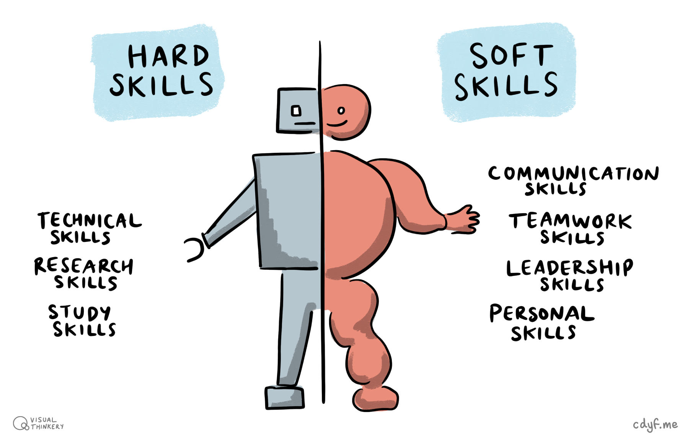
```

(ref:captionallskills) Hard skills and soft skills aren't much use without each other. You will need both to survive and thrive but most science and engineering education focuses on your hard skills, not your soft skills. Why? Because hard skills are often much easier to measure. Hard and soft skills sketch by [Visual Thinkery](https://visualthinkery.com/) is licensed under [CC-BY-ND](https://creativecommons.org/licenses/by-nd/4.0/)


Let's look at some of low-level communication skills (`I/O`) that they are built on.

## Communication I/0 {#cio}

In terms of input and output, your fundamental communication skills are listening, speaking, reading and writing words in natural languages shown in table \@ref(tab:iotable). These are the “[assembly languages](https://en.wikipedia.org/wiki/Assembly_language)” of human communication. This might sound blindingly obvious, but these skills are often under-estimated or undervalued by engineers and scientists, especially undergraduates. Alongside verbal and written communication, there's also nonverbal language, or body language such as eye contact, gestures and facial expressions.


```{r iotable, echo = FALSE}
io_table <- tibble::tribble(
    ~ ""                        , ~ "Input",      ~ "Output",
  "Written natural language"    , "Reading",        "Writing",
  "Spoken natural language"     , "Listening",      "Speaking",
  "Nonverbal language"    , "Observing other people",      "Being observed by others",
)
knitr::kable(io_table, caption = "The inputs and outputs of the fundamental assembly languages of human communication ", booktabs = TRUE)
```

Some people leave plenty of room for improvement when it comes to the communication skills outlined in table \@ref(tab:iotable). Think of:

* the stereotypical mad scientist, clad in a white coat, unable to explain the complexities of their research to people inside their lab, let alone outside of it, see figure \@ref(fig:madscientist-fig)
* the nerdy software engineer stereotype who prefers the company of computers to people

Yes, these are lazy tropes and unhelpful stereotypes, but they express public perception of scientists and engineers as poor communicators. Don't perpetuate the stereotype by being a bad communicator.

```{r madscientist-fig, echo = FALSE, fig.align = "center", out.width = "100%", fig.cap = "(ref:captionmadscientist)"}
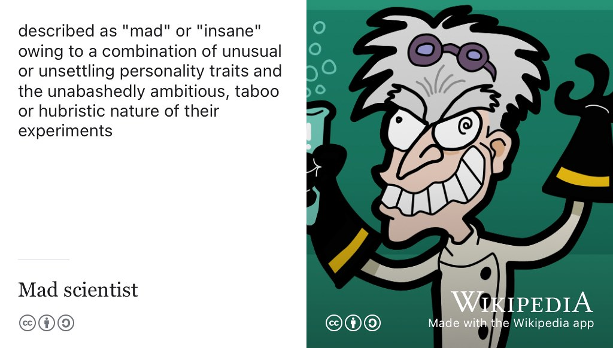
```

(ref:captionmadscientist) Are you [mad, bad and dangerous to know](https://en.wikipedia.org/wiki/Mad,_Bad_and_Dangerous_to_Know)? You'll be familiar with the [mad scientist stereotype](https://en.wikipedia.org/wiki/Mad_scientist): perceived as an evil genius owing to a combination of unsettling personality traits and the unabashedly ambitious, taboo or hubristic nature of their experiments. Besides their supposed insanity, another reason mad scientists (and engineers) are perceived badly, is their poor communication skills. Maybe if they could communicate better the public might understand and trust them more? Don't perpetuate the stereotype by being a poor communicator, there are too many of those already! CC BY-SA cartoon of a mad scientist by J.J. on Wikimedia Commons [w.wiki/5JeU](https://w.wiki/5JeU) adapted using the [Wikipedia App](https://apps.apple.com/gb/app/wikipedia/id324715238)

### The pen is mightier than the sword {#mightier}
The art of communication is a huge subject which extends far beyond the scope of this guidebook. So for the rest of this chapter, we'll focus on your superpower of written communication. The pen (and keyboard) are mightier than the sword, see figure \@ref(fig:mighty-pen-fig).

```{r mighty-pen-fig, echo = FALSE, fig.align = "center", out.width = "100%", fig.cap = "(ref:captionmightypen)"}
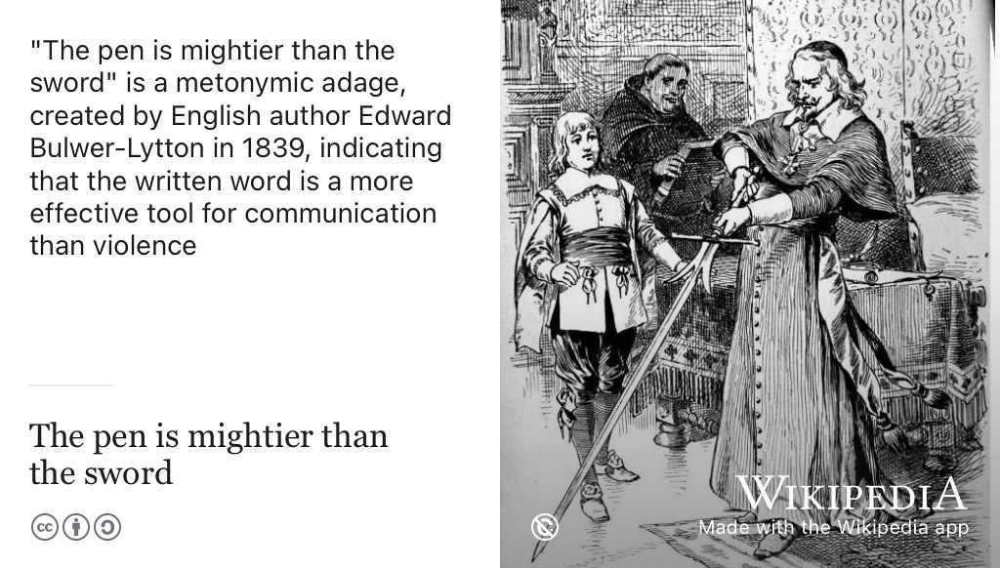
```

(ref:captionmightypen) Do you need more weaponry in your life? Besides computing, you should arm yourself with communication superpowers. It's in your own selfish interests to continuously develop your written communication skills because [the pen is mightier than the sword](https://en.wikipedia.org/wiki/The_pen_is_mightier_than_the_sword). Public domain image of a drawing of Cardinal Richelieu by [Henry Alexander Ogden](https://en.wikipedia.org/wiki/Henry_Alexander_Ogden) via Wikimedia Commons [w.wiki/3WHg](https://w.wiki/3WHg) adapted using the [Wikipedia app](https://apps.apple.com/us/app/wikipedia/id324715238)

Written communication skills are important because:

1. **Good writing and reading are crucial in applications** for employment and further study. From writing CV's, covering letters, completing application forms and reading job specifications, and employer (or course) information, your ability to read and write in natural languages is crucial to coding your future.
1. **Writing often gets neglected**: Written communication skills (both reading and writing) are sometimes sidelined in science and engineering degrees. This is particularly true in the “hard sciences”. For example, communicating and solving problems using code or mathematics are usually the dominant forms of assessment in computer science courses. That's understandable given the subject, but tends to push natural languages (like english) to the sidelines.
1. **Good engineers are also good writers** Many engineers (and scientists) could significantly improve their written communication skills. Software engineers are notoriously bad at writing, see for example [Why Computer Science Students Need Language](https://dl.acm.org/doi/10.1145/960492.960525), [@Beaubouef2003] *Scientists Must Write* [@scientistsmustwrite] and [The Real Reason Silicon Valley Coders Write Bad Software](https://www.theatlantic.com/national/archive/2012/10/the-real-reason-silicon-valley-coders-write-bad-software/263377/), [@writebadsoftware] just three examples amongst many others making exactly the same point. Employers like Google provide training (and a whole career path) for technical writers, see [developers.google.com/tech-writing](https://developers.google.com/tech-writing). I'm glad they exist, but these careers and courses wouldn't be needed if software engineers were better at documenting, explaining and communicating with other human beings in the first place!
1. **Writing good english is like writing good code**. Some of the skills you already have in coding can be transferred to written communication. Just like a good `function`, `class` or `method` in code should be well-defined with a clear purpose, your writing should also be clear and coherent. Well structured writing is a lot like well architected software too, with a clear [separation of concerns](https://en.wikipedia.org/wiki/Separation_of_concerns) (SoC)
1. **It is relatively easy to improve** your written communication skills, simply by reading and writing more. Reading and writing deliberately every day, will significantly improve these skills. See the rest of this chapter for some simple exercises to get started with and:
      + chapter \@ref(debugging) on *Debugging your future*
      + chapter \@ref(hacking) on *Hacking your future* for details. <!--editing your future-->

### Natural language engineering {#nle}
As a species, we've been writing stuff down for millenia in order to communicate with each other, see figure \@ref(fig:rosetta-fig). If you stop to think about it, engineers and scientists spend a *lot* time communicating in writing. As well as engineering `code`, they also spend a significant amount of time engineering *messages* in natural languages like english.

```{r rosetta-fig, echo = FALSE, fig.align = "center", out.width = "100%", fig.cap = "(ref:captionrosetta)"}
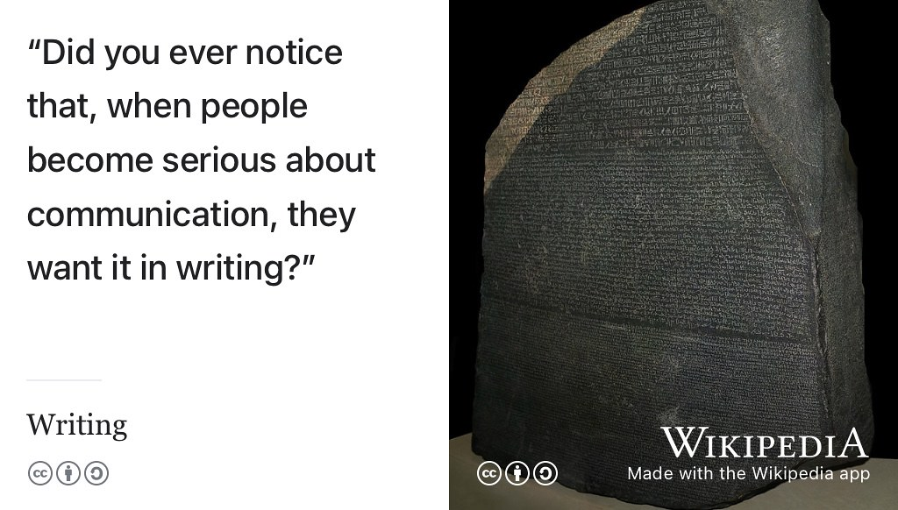
```

(ref:captionrosetta) Have you ever noticed how when people become serious about communication, they want it in [writing](https://en.wikipedia.org/wiki/Writing)? CC BY-SA image of language in Ancient Egyptian using hieroglyphic, demotic and Ancient Greek written on the [Rosetta Stone](https://en.wikipedia.org/wiki/Rosetta_Stone) by [Hans Hillewaert](https://commons.wikimedia.org/wiki/Category:Photographs_by_Hans_Hillewaert) on Wikimedia commons [w.wiki/3Ycn](https://w.wiki/3Ycn) adapted using the [Wikipedia app](https://apps.apple.com/us/app/wikipedia/id324715238)

Consider the following:

* email and instant messaging, Slack, Microsoft Teams, Discord, Zoom etc
* Posting on social media: LinkedIn, Facebook, WhatsApp, Twitter, blogs, Medium.com etc
* bug reports and messages in [issue trackers](https://en.wikipedia.org/wiki/Comparison_of_issue-tracking_systems) like Jira, BugZilla, Trello and version control systems like Github and Gitlab etc
* 'How to' and cookbook style articles and books
* API reference material
* in-code documentation `# comments in code`
* [Self-documenting code](https://en.wikipedia.org/wiki/Self-documenting_code) that describes itself
* Executable specifications in test suites like [cucumber.io](https://en.wikipedia.org/wiki/Cucumber_(software))
* Laboratory manuals and laboratory notebooks
* The one or two page summary for management
* [reddit.com](https://www.reddit.com/) and hacker news [news.ycombinator.com](https://news.ycombinator.com/) etc
* User documentation, release notes
* Case studies of software use
* Frequently Asked Questions ([FAQ](https://en.wikipedia.org/wiki/FAQ))
* Personal websites `YourPersonalDomain.com` if you have one
* Questions and answers on forums like [stackoverflow.com](https://stackoverflow.com/)
* Commit messages in version control systems like git and mercurial etc
* Architecture documentation and design specifications
* [Literate programming](https://en.wikipedia.org/wiki/Literate_programming) natural language descriptions of computational logic [@knuthlit]
* [Jupyter.org notebooks](https://jupyter.org/), code and natural language mixed together, as do many other systems like, [quarto.org](https://quarto.org/) and [bookdown.org](https://bookdown.org/)


What do they all have in common? They're all written in natural languages like the [English language](https://en.wikipedia.org/wiki/English_language), but without them, the software or hardware they describe and discuss would be useless. Using written (and spoken) natural language is a key social skill and a communication skill. You might be using your language to influence, persuade, convince or argue with members of your team. So it is important that you do it to the best of your abilities. Computer Scientist [Luis von Ahn](https://en.wikipedia.org/wiki/Luis_von_Ahn), shown in figure \@ref(fig:vonahn-fig), is the creator of [Duolingo.com](https://www.duolingo.com/). Luis regrets that he didn't spend any effort developing his social skills early in his career. Instead, like many computer scientists he focussed his effort on his mathematical and technical skills instead. [@vonahn]

<!-- I did not spend any effort developing my social skills. A lot of management skills are just social skills-->

```{r vonahn-fig, echo = FALSE, fig.align = "center", out.width = "100%", fig.cap = "(ref:captionvonahn)"}
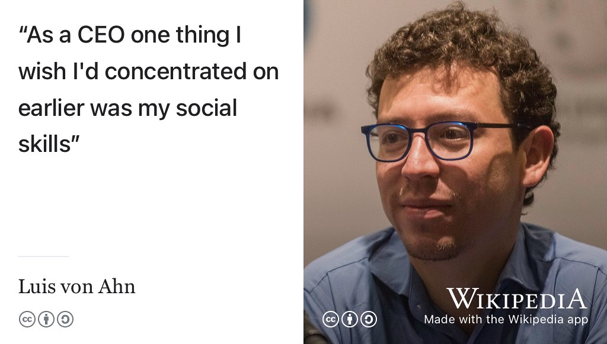
```

(ref:captionvonahn) Luis von Ahn is the Chief Executive Officer (CEO) of Duolingo. Since 2012, the duolingo app has been downloaded 500 million times. Luis wishes he'd concentrated on developing his social skills earlier his career. Are you developing your hard technical skills at the expense of your softer social skills? Portrait of Luis von Ahn by EneasMx on Wikimedia commons [w.wiki/4VPU](https://w.wiki/4VPU) adapted using the [Wikipedia app](https://apps.apple.com/us/app/wikipedia/id324715238)

Making software isn't all about what you can do as an individual but rather how you communicate with and contribute to your team. It's easy to get carried away with your ego. Remember that most jobs require *lots* of softer people skills and collaboration, written communication is a huge part of that, alongside spoken communication see for example [The Myth of the Genius Programmer](https://www.youtube.com/watch?v=0SARbwvhupQ). [@Fitzpatrick]

<!--
1. **Its not just engineers that can improve** If the huge volume of literature on the importance of writing is anything to go by,  it's not just engineers and scientists that could improve their written communication skills, see for example the complete plain words. [@gowers; @writingatuni]-->
### Writing as therapy {#therapy}
Besides being a tool for communication, writing can be therapeutic for the writer too. The simple act of writing can help you tackle mental health issues discussed in chapter \@ref(nurturing). Prime minister [Winston Churchill](https://en.wikipedia.org/wiki/Winston_Churchill) found that writing helped to keep the “black dog” of his depression under control, see section \@ref(depression) and figure \@ref(fig:winston-fig).

```{r winston-fig, echo = FALSE, fig.align = "center", out.width = "100%", fig.cap = "(ref:captionwinston)"}
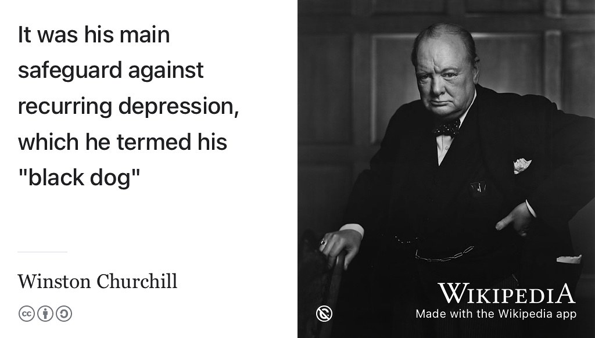
```

(ref:captionwinston) Winston Churchill managed to regulate his depression by writing. If you are affected by anxiety or depression, you may find that private forms of writing like those described in section \@ref(dailywrite) will help to improve your mental health. Public domain portrait of Winston Churchill by [Yousuf Karsh](https://en.wikipedia.org/wiki/Yousuf_Karsh) on Wikimedia Commons [w.wiki/4aJk](https://w.wiki/4aJk)

So writing can be therapeutic, a powerful tool for developing [mindfulness](https://www.nhs.uk/mental-health/self-help/tips-and-support/mindfulness/) as well as communicating with other people.

## Writing your future {#wyf}
Hopefully I've convinced you that written communication skills (both as a writer and reader) are important soft skills that engineers often neglect. So how can you improve?

### Dogfooding {#dogfooding}

<!-- similar to rubber duck debugging https://en.wikipedia.org/wiki/Rubber_duck_debugging-->
Many employers test their products and services by trialling them on their own employees, this is known as [eating your own dogfood](https://en.wikipedia.org/wiki/Eating_your_own_dog_food) shown in figure \@ref(fig:dogfooding-fig). Tasty, tasty dogfood. 🐶

```{r dogfooding-fig, echo = FALSE, fig.align = "center", out.width = "100%", fig.cap = "(ref:captiondogfooding)"}
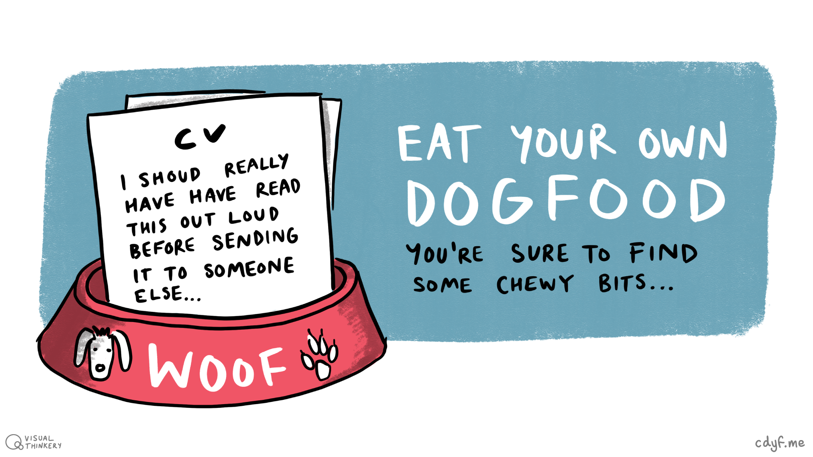
```

(ref:captiondogfooding) Reading your own writing (aloud) is like [eating your own dog food](https://en.wikipedia.org/wiki/Eating_your_own_dog_food). It's a simple and proven technique for improving your written communication in job applications such as covering letters, CVs, personal statements and the like. Dogfooding by [Visual Thinkery](https://visualthinkery.com/) is licensed under [CC-BY-ND](https://creativecommons.org/licenses/by-nd/4.0/))

Dogfooding is a simple technique for testing your own writing. Let's say you've just written a personal statement or covering letter (see section \@ref(we3qs)). It's natural to read it over in your head to check for errors, before you send it. However, **reading it aloud** will pick up errors you may not have spotted by reading silently. Your ears and tongue will pick up on awkward phrases and sentences that your eyes didn't spot. There's something about articulating words out loud that flushes out errors you don't pick up when you read them in your head. Dogfooding is a tried and tested technique. It also means you're ready to vocalise those answers in an interview.

You might want to choose carefully where you do this as it might look a bit strange, but it works well. If you talk into a mobile phone while looking at a piece of paper, people won't notice you're talking to yourself. But you'll probably need some privacy as the stuff you're talking about is likely to be personal. Alternatively, find a critical friend who you can read out loud to. You can also use a [screen reader](https://en.wikipedia.org/wiki/Screen_reader), for example :

* Microsoft Teams has an [immersive reader](https://www.microsoft.com/en-gb/education/products/learning-tools)
* Android devices have [TalkBack](https://support.google.com/accessibility/android/answer/6007100)
* Apple devices have [VoiceOver](https://support.apple.com/en-gb/guide/iphone/iph3e2e415f/ios)

A screen reader will often reveal mistakes you haven't spotted by reading your text silently.

### Try Google's Tech Writing course {#techwriting}
Google have developed some excellent written communication courses for software engineers, and those looking to become technical writers:

1. Technical Writing One: Technical Writing Fundamentals for Engineers [developers.google.com/tech-writing/one](https://developers.google.com/tech-writing/one)
1. Technical Writing Two: Intermediate Technical Writing for Engineers [developers.google.com/tech-writing/two](https://developers.google.com/tech-writing/two)

You might also be interested in the follow on courses:

1. Tech Writing for Accessibility [developers.google.com/tech-writing/accessibility](https://developers.google.com/tech-writing/accessibility)
1. Writing Helpful Error Messages [developers.google.com/tech-writing/error-messages](https://developers.google.com/tech-writing/error-messages)

The first two tech writing courses run as part of the second year course COMP2CARS at the University of Manchester, see chapter \@ref(scheduling) for details.

Google occasionally delivers these technical writing courses as free sessions open to the general public. For details, see [developers.google.com/tech-writing/announcements](https://developers.google.com/tech-writing/announcements) for details.

### Deliberate daily writing {#dailywrite}
Another technique for improving your written communication is to write something every day, that might be a personal diary that only you read, or it could be something more public like blog.  Schedule a time every day, say 15 to 30 minutes when you will do this without fail. That writing could take several forms:

* public web log or [blog](https://en.wikipedia.org/wiki/Blog)
* [gratitude journal](https://en.wikipedia.org/wiki/Gratitude_journal) see section \@ref(lays)
* private diary or personal laboratory notebook
* morning pages, a unedited stream of conciousness that can help you become more creative [@cameron;@burkeman]
* [bullet journal](https://en.wikipedia.org/wiki/Bullet_journal). Some people swear by it, see [bulletjournal.com](https://bulletjournal.com/)
<!--* contributing to Wikipedia-->

The technique of *30 minutes per day* can be a very effective way of getting things done, incrementally over time. In my experience it works for lots of things besides writing including getting exercise (discussed in chapter \@ref(nurturing)) to gardening. [@leendertz]

<!-- why write

* Writing speeds your brain up "worrying about remembering one idea gets in the way of having the next. Pen and paper wick ideas." [1]
* Writing slows your brain down, mindfulness etc
* Writing is therapy (for the writer)
* Writing helps the writer reflect on and clarify complicated thoughts
* The pen is mightier than the sword (etc)
http://www.paulgraham.com/island.html
-->

### Deliberate daily reading {#dailyread}
Reading other people's code will improve your software engineering skills. Likewise, reading other peoples writing will improve your natural language engineering skills. Read anything, it might be novels, magazines, newspapers, stuff online or any of the books cited in chapter \@ref(reading). Find a time and place to do this every day and stick to it, see figure \@ref(fig:reading-fig)

```{r reading-fig, echo = FALSE, fig.align = "center", out.width = "100%", fig.cap = "(ref:captionreading)"}
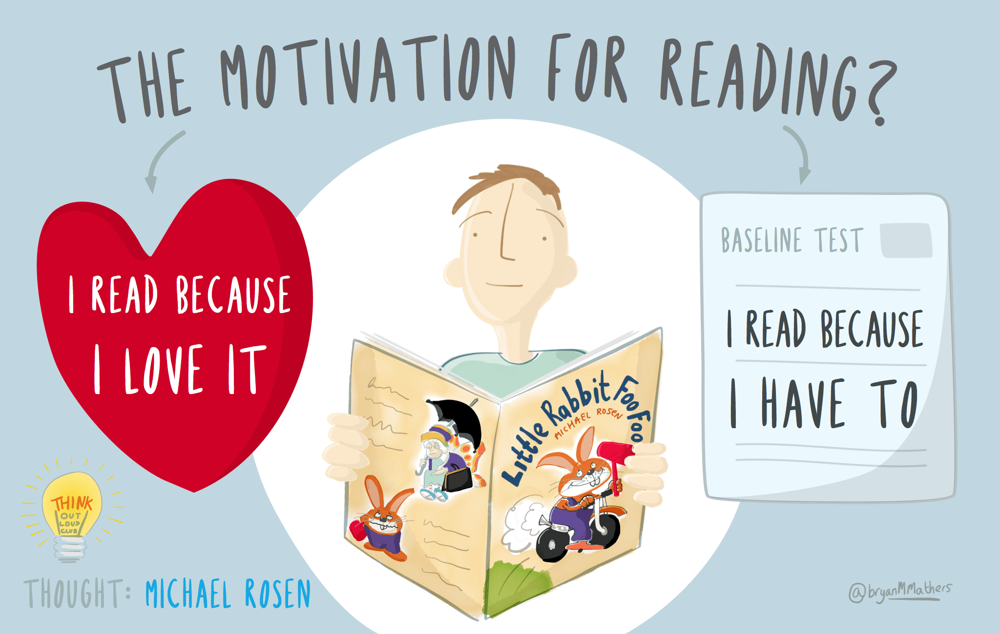
```

(ref:captionreading) Reading allows you to learn from other people's hard won experience whilst also improving your own written communication skills. Just like you improve your coding skills by reading *and* writing code, you will improve your written communication skills by reading *and* writing in natural languages. [The motivation for reading](https://bryanmmathers.com/the-motivation-for-reading/) by [Visual Thinkery](https://visualthinkery.com/) is licenced under [CC-BY-ND](https://creativecommons.org/licenses/by-nd/4.0/) with help from [Michael Rosen](https://en.wikipedia.org/wiki/Michael_Rosen)


### Reading the friendly manual {#rtfm}

You don't get good at communicating with computers (coding) by just *writing* lots of code. You also need to *read* other people's code too and be able to understand and modify it. Likewise, you don't get good at communicating with people by just *writing* stuff in natural languages like english. You need to *read* stuff too. Books, manuals, software documentation, articles, use cases, novels, poetry, plays, magazines, newspapers etc. Reading this stuff will help you learn and you'll improve your written communication skills too. So *Read The Friendly Manual*. [RTFM](https://en.wikipedia.org/wiki/RTFM). Read THIS Friendly Manual and the stuff it cites, see figure \@ref(fig:rtfm-fig)


```{r rtfm-fig, echo = FALSE, fig.align = "center", out.width = "100%", fig.cap = "(ref:captionrtfm)"}
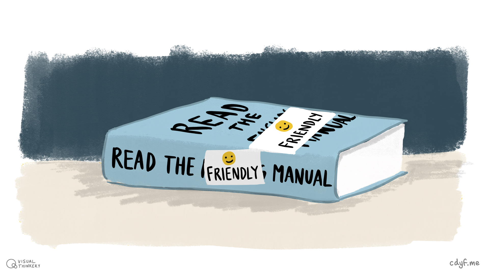
```

(ref:captionrtfm) [Read The Friendly Manual](https://en.wikipedia.org/wiki/RTFM) (`RTFM`), some of it you will love, some of it you won’t. Either way reading will help you develop valuable skills and knowledge. Read The *Friendly* Manual by [Visual Thinkery](https://visualthinkery.com/) is licenced under [CC-BY-ND](https://creativecommons.org/licenses/by-nd/4.0/)


<!--
```{r itcrowd-fig,echo=FALSE, fig.cap = "test caption"}
library("vembedr")
embed_url("https://www.youtube.com/watch?v=pGFGD5pj03M")
```
-->

<!--
In the best teams, members listen to one another and show sensitivity to feelings and needs. [@googleteams]-->

<!--Professionalism can be defined several ways but [Robert C. Martins](https://en.wikipedia.org/wiki/Robert_C._Martin)'s definition is a good starting point. In *The Clean Coder* [@cleancoder], he defines a professional as someone who is accountable and responsible, not just taking responsibility for what they build but being responsible for their own career. Being a professional relies on both soft and hard skills.-->

<!--Employers often talk about skills gaps, skills crises [@oilandgaskills; @mindthegap] and labour shortages of various kinds. [@digitalskillscrisis; @softskillscrisis; @shadboltreview] They frequently point out that various combinations of skills can be problematic to find and develop in their employees, [@brucetulgan] and even that they fight a “war for talent” [@warfortalent]. As a science and engineering student you get lots of opportunities to develop hard skills. However, while hard technical skills are important for your future, your soft skills are just as likely to get you hired, promoted or even fired. [@nicegirls; @rocketscience; @jonathanblack; @paulredmond; @helpihaveamanager] Soft skills are hard to learn but well worth spending your time and effort to develop.-->


<!-- employability skills via CBI and  jonathan black and
Self-management – readiness to accept responsibility, flexibility, resilience, self-starting, appropriate assertiveness, time management, readiness to improve own performance based on feedback/
reflective learning. -->

<!-- Teamworking – respecting others, co-operating, negotiating/persuading, contributing to discussions, and awareness of
interdependence with others. -->

<!--Business and customer awareness – basic understanding of the key drivers for business success – including the importance of
innovation and taking calculated risks – and the need to provide customer satisfaction and build customer loyalty.-->

<!--Problem solving – analysing facts and situations and applying creative thinking to develop appropriate solutions. Communication and literacy – application of literacy, ability to produce clear, structured written work and oral literacy – including listening and questioning.-->

<!--Application of numeracy – manipulation of numbers, general mathematical awareness and its application in practical contexts
(e.g. measuring, weighing, estimating and applying formulae).-->

<!--Application of information technology – basic IT skills, including familiarity with word processing, spreadsheets, file management and use of internet search engines.-->

<!-- Underpinning all these attributes, the key foundation, must be a positive attitude: a ‘can-do’ approach, a readiness to take part and contribute, openness to new ideas and a drive to make these happen.-->

<!--Frequently mentioned by both employers and universities is entrepreneurship/enterprise broadly, an ability to demonstrate
an innovative approach, creativity, collaboration and risk taking. An individual with these attributes can make a huge difference
to any business-->

<!--Soft skills entrepreneurial and enterprising skills are covered in chapter xxx. Specific soft skills that will help you keep you job and get promoted are covered in chapter yyy.  -->


<!--## Team work

See video https://www.youtube.com/watch?v=pGFGD5pj03M [@theitcrowd]


## Social skills

Social skills are those that help you work with other people in your team, small or large. You might also see them referred to as people skills, inter-personal skills, behavioural skills [@humantouch], non-cognitive skills [@winningpersonality; @jobsofthefuture; @futureofjobs], influence [@dalecarngie], emotional intelligence [@emotionaliq] or employability skills. [@employabilityskills]


* How can you improve your ability to work in a team? [@diverseteams]-->

## Breakpoints {#bp4}
(ref:breakpoint)

```md
* PAUSE ⏸️
```

* Which of the communication skills in table \@ref(tab:iotable) are your strongest?
* Which of the communication skills in table \@ref(tab:iotable) are your weakest?
* What activities could you do to improve your weaker communication skills?

```md
* RESUME ▶️
```


### Coding challenges {#cc4}

* Write an article or blog post about something you care about, find a suitable venue for publication
* Take a course from outside computer science, where the main form of assessment is written essays or dissertations. Humanities departments are a good place to start. This will improve your written communication skills
* Not been reading many books lately? Pick a book to read just because its interesting, rather than because you have to.


## Summarising your soft skills {#tldr4}

[Too long, didn't read](https://en.wiktionary.org/wiki/too_long;_didn%27t_read) (TL;DR)? Here's a summary:

You'll need both soft and hard skills to compete in the workplace. Don't underestimate the importance of softer skills, we've looked briefly at written communication skills in this chapter but that's only the tip of the soft skills iceberg.

Teamwork, negotiation, conflict resolution, public speaking, motivating others and leadership are also important soft skills too. How can you develop these skills while at University? How can you demonstrate to potential employers that you have these skills? Your technical skills are of limited use without people skills, to allow you to work with others see figure \@ref(fig:otherpeople-fig).

```{r otherpeople-fig, echo = FALSE, fig.align = "center", out.width = "100%", fig.cap = "(ref:captionotherpeople)"}
knitr::include_graphics("images/What - other people.png")
```
(ref:captionotherpeople) Unless you want to be a [lighthouse keeper](https://en.wikipedia.org/wiki/Lighthouse_keeper) on a remote island, there are very few jobs where you don't have to work as part of a team with other people. If you were hoping to carry on working independently from other people, sorry to break the bad news! In the longer term, you will benefit from constantly improving your softer skills and providing evidence of them to potential employers. Written communication is just one of those softer skills. Other people sketch by [Visual Thinkery](https://visualthinkery.com) is licensed under [CC-BY-ND](https://creativecommons.org/licenses/by-nd/4.0/)

So communicating with other people is a key skill, see figure \@ref(fig:allpeople-fig). This chapter has looked at written communication, in chapter \@ref(speaking) we will look at spoken communication. Writing your future is coding your future.

```{r allpeople-fig, echo = FALSE, fig.align = "center", out.width = "100%", fig.cap = "(ref:captionallaboutpeople)"}
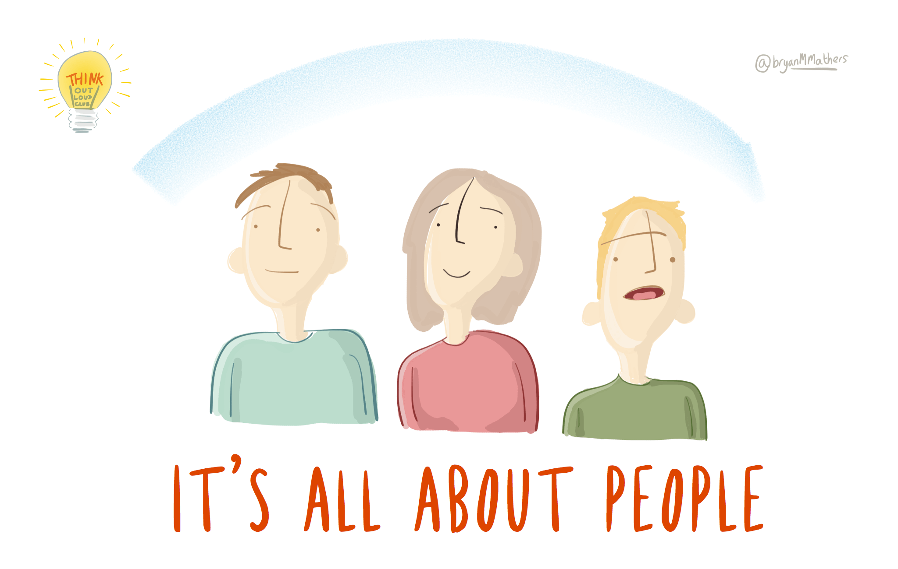
```

(ref:captionallaboutpeople) Your network can help you before, during and after your employment, so be sure to grow your network when you can. This includes both the stronger ties of trusted friends alongside the weaker ties too, described in section \@ref(weakties). Both are important. [It's all about people](https://bryanmmathers.com/its-all-about-people/) by [Visual Thinkery](https://visualthinkery.com/) is licensed under [CC-BY-ND](https://creativecommons.org/licenses/by-nd/4.0/)


This chapter is under construction because I'm using agile book development methods, see figure \@ref(fig:deathstar-fig).

```{r deathstar-fig, echo = FALSE, fig.align = "center", out.width = "99%", fig.cap = "(ref:captiondeathstar)"}
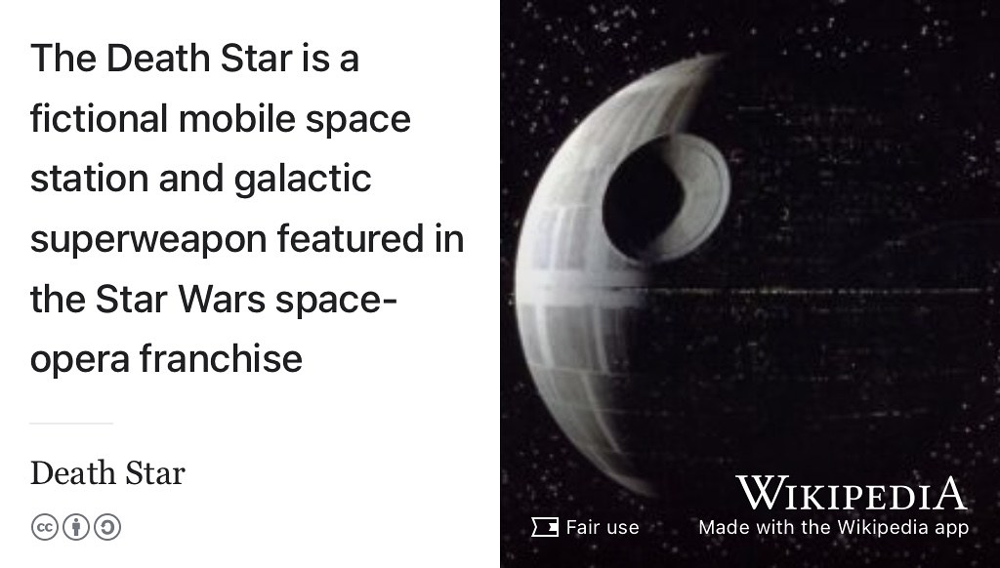
```

(ref:captiondeathstar)  Just like the [Death Star](https://en.wikipedia.org/wiki/Death_Star), this ~~galactic superweapon~~ book is under construction. As of `r format(Sys.time(), '%d %B, %Y')` this book is an estimated **37% complete**. Image of agile weapon engineering in *Star Wars* via Wikimedia Commons [w.wiki/5N6q](https://w.wiki/5N6q) adapted using the [Wikipedia app](https://apps.apple.com/gb/app/wikipedia/id324715238)
