# Writing your future {#writing}
We all have strengths and weaknesses, and for students of Computer Science, it is sometimes their communication skills that let them down. Other chapters in this guidebook discuss the fundamental communication skills of [speaking](https://www.cdyf.me/speaking), [listening](https://www.cdyf.me/hearing) and [reading](https://www.cdyf.me/reading). This chapter looks at *written* communication because:

* every *engineer* is also a writer, and good engineers have good written communication skills
* every *scientist* is also a writer, and good scientists also have good written communication skills too

```{r no-writing-fig, echo = FALSE, fig.align = "center", out.width = "100%", fig.cap = "(ref:captionnowriting)"}
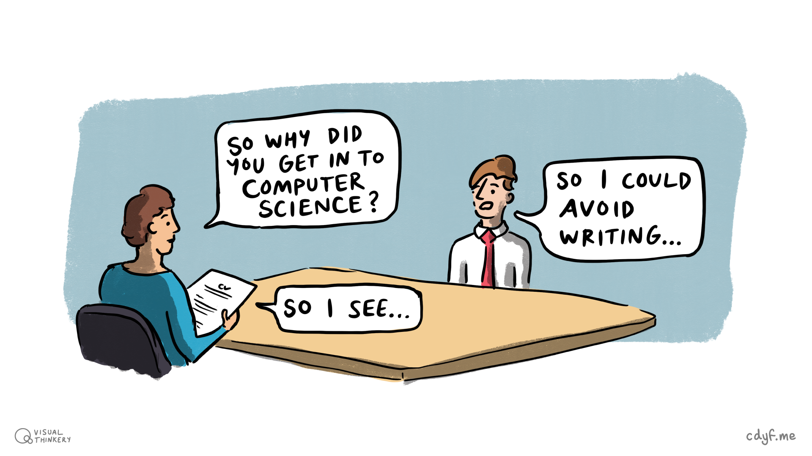
```

(ref:captionnowriting) I often ask students about their motivation for studying Computer Science at University, you can hear some of their answers in chapter \@ref(hearing). One of my tutees^[who shall remain anonymous] once told me they chose to study computing because (quote): *I didn't like all the arty-farty humanities subjects at school. Literature, history, languages, culture, all those essays we had to write and debates about politics. Bla bla bla. I hated that stuff!* (unquote) My tutee preferred the precision and accuracy of mathematics and science. Fair enough, but while you can *run* from written and spoken communication, but you can't *hide* from it. Writing a CV, covering letter or filling in an application form is just the tip of the *natural language iceberg*, section \@ref(nle) outlines the some of the rest. This chapter looks at some simple techniques for improving and investing in your written communication skills. Avoidance sketch by [Visual Thinkery](https://visualthinkery.com) is licensed under [CC-BY-ND](https://creativecommons.org/licenses/by-nd/4.0/)


Your ability to write clearly isn't just important when putting together CV's like in figure \@ref(fig:no-writing-fig). Your ability to write clearly isn't just important when composing covering letters or filling in application forms either, it's a fundamental skill that will help you become a valued employee in the longer term. Learn to write more clearly now and you'll improve your chances of success later. 

Your future is bright, your future needs writing so let's start writing your future.  ✍️


<!-- where does written comm fit?

PASS2  
COMP101
COMP2CARS
Third year project

-->
## What you will learn

In this chapter you will learn to:

1. Recognise the importance of written communication, both as a reader and a writer
1. Identify examples of where written communication is crucial in teams of scientists and engineers
1. Improve your written communication skills using some simple writing and reading exercises that will improve any job applications you make
<!--* Identify the importance of teamwork-->

## Writing as a soft social skill {#softwrite}

Your soft social skills will take a **life time** to develop and can be **really hard** use. Why? Because soft skills are about *communicating* with and *understanding* other people so that you can work *together* as a team toward a shared goal. Despite their misleading name, soft skills can be hard to use and are often underestimated or overlooked.

There are very few jobs where you work on your own in complete isolation. For example, most software and hardware is designed, built, tested and used by teams of people. Many of these teams are large and have very diverse membership. This means that sooner or later you're going to have to master the dark arts of *working with other people* by developing and deploying your softer skills. One of those softer skills you'll need to continuously develop is written communication.

Communicating with other people and working in teams is inherently difficult because we're all human. There is good news and bad news...

* **THE GOOD NEWS** is, people can be diligent, humble, competent, honest, caring and reliable. They can be co-operative, generous, supportive, kind, thoughtful, intelligent, sensitive, understanding, punctual and professional too!
* **THE BAD NEWS** is, unfortunately people can also be lazy, stupid, ignorant, vain, incompetent, dishonest, unreliable, greedy, egomaniacal, unpredictable and moody. They can be proud, selfish, competitive, lustful, angry, envious, mean, busy, insensitive and thoughtless too. Some will disagree with you, boss you around, betray, exploit, misunderstand and mislead you, deliberately or otherwise. [@sevendeadly]

This *shouldn't* be news to you but it means communicating with and understanding other people can be hard work, but don't worry, **everyone** finds this challenging, it's not just you! It doesn't matter if you're an extrovert or an introvert, communication is a challenge for everybody, and everyone can get better at it too. It’s easy to undervalue the importance of communication because we use it everyday. Just as humanities students are sometimes guilty of being ignorant of science, your average science and engineering student is often guilty of underestimating the importance of the humanities, language and culture, as shown in figure \@ref(fig:cpsnow-fig).


```{r cpsnow-fig, echo = FALSE, fig.align = "center", out.width = "100%", fig.cap = "(ref:captioncpsnow)"}
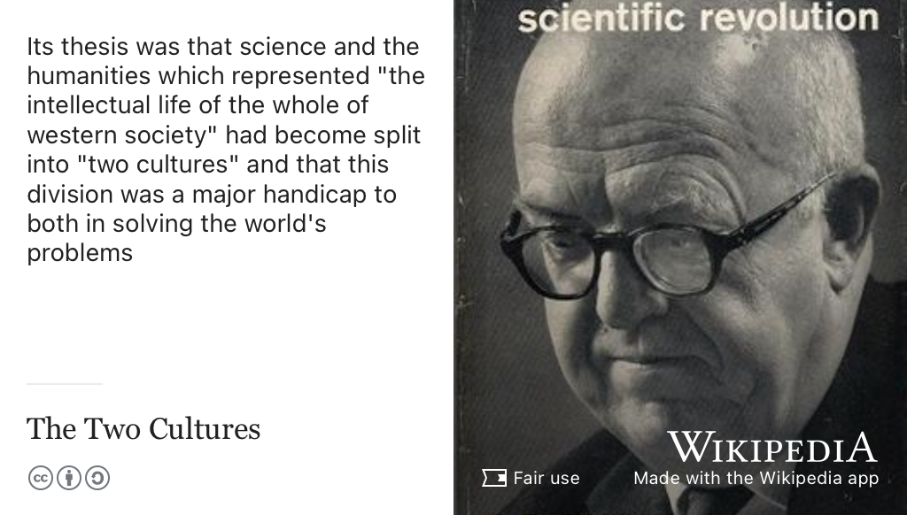
```

(ref:captioncpsnow) Many Computer Scientists are steeped in the culture of [Science, Technology, Engineering and Mathematics](https://en.wikipedia.org/wiki/Science,_technology,_engineering,_and_mathematics) (STEM), seperated by a gulf of mutual incomprehension from their counterparts in the humanities. C.P. Snow argued that this gulf between the two cultures was bad for *both* sides as it handicaps our abilities to solve major global problems. [@twocultures] Fair use image of [C. P. Snow](https://en.wikipedia.org/wiki/C._P._Snow) on the cover of *[The Two Cultures](https://en.wikipedia.org/wiki/The_Two_Cultures)* via Wikimedia Commons [w.wiki/6Rhv](https://w.wiki/6Rhv) adapted using the [Wikipedia App](https://apps.apple.com/gb/app/wikipedia/id324715238)

 It probably doesn’t help that in the UK, and several other countries, many students specialise early in their education by choosing between: 

* **EITHER** a predominantly [science, technology, engineering, and mathematics](https://en.wikipedia.org/wiki/Science,_technology,_engineering,_and_mathematics) (STEM) pathway 
* **OR** an “artier” and allegedly more “creative” humanities pathway [@notcreatives]

Are C.P. Snow's [two (seperate) cultures of humanities and science](https://en.wikipedia.org/wiki/The_Two_Cultures) still living in seperate houses like an estranged and bickering couple? Would he judge the gaps between the two cultures to have closed or been widened in the sixty years since he described them? [@twocultures] This is debateable but in the worst case scenario, two cultures in society produces:

1. science and engineering graduates who are technically strong but have weaker communication skills, both written and spoken, combined with cultural ignorance, political indifference, general illiteracy and other inhumanities
1. humanities graduates who are articulate, well read, vocal, persuasive and write clearly but sometimes lack technical skills. In extreme cases, they can be scientificially and mathematically illiterate

Are you in the first category? This chapter takes a look at the softer skill of written communication and techniques you can use to improve your writing. Whatever mood your readers are in, they'll find it a lot easier to work with you when you can express yourself clearly in writing.

## Computing is your superpower! {#superpower}

Studying computer science gives you an *awesome* superpower. We will look at some of the reasons why in chapter \@ref(computing) on *Computing your Future*. But for now, let us just acknowledge that hard technical skills in computing are highly sought after and valuable, both commercially and otherwise.

```{r achilles-fig, echo = FALSE, fig.align = "center", out.width = "100%", fig.cap = "(ref:captionachilles)"}
knitr::include_graphics("images/Achilles-Heel-to-Superpower.png")
```
(ref:captionachilles) Computing is a superpower that Gods like [Hermes](https://en.wikipedia.org/wiki/Hermes) and mortal heroes like [Achilles](https://en.wikipedia.org/wiki/Achilles) would probably have envied. [@heroes; @mythos] As a technical or *hard skill*, computing is a crucial weapon in your armoury but what are your weaker skills? What is your [Achilles' heel](https://en.wikipedia.org/wiki/Achilles%27_heel)? For some scientists and engineers, their weakness is their soft skills, such as communication. Writing, reading, speaking and listening to communicate with team members can be a weaker skill for many technical people. This chapter looks at what you can do to improve these skills and convince employers that you are rounded individual with a healthy balance of soft and hard skills. [Achilles heel to superpower](https://bryanmmathers.com/achilles-heel-to-superpower/) by [Visual Thinkery](https://visualthinkery.com) is licensed under [CC-BY-ND](https://creativecommons.org/licenses/by-nd/4.0/)

Your computational superpower is less powerful if it isn't complemented by a broad range of softer skills. Typically, these skills are not closely examined in most computer science degrees, for example by repeated assessment. There's an awful lot of [technical computing curriculum](https://www.acm.org/education/curricula-recommendations) that tends to have a higher priority over soft skills. It's not that soft skills aren't important but that they can be hard to quantify.

For example, if I want to know how good you are at understanding the syntax and semantics of a programming language like Python, there are tried and tested techniques for measuring this. However, if I want to know how good you are at using your communication skills to work in a team of engineers to negotiate, lead, resolve conflicts, persuade others, show empathy etc that's **much** harder to measure accurately. What technical degrees tend to measure is technical skills because softer skills, shown in figure \@ref(fig:allskills-fig), are much harder to assess by examination and coursework. 

This is one of the many reasons that you are much more than your grades, see figure \@ref(fig:more-than-grades-fig).

```{r allskills-fig, echo = FALSE, fig.align = "center", out.width = "100%", fig.cap = "(ref:captionallskills)"}
knitr::include_graphics("images/Hard and soft skills.png")
```

(ref:captionallskills) Hard skills and soft skills aren't much use without each other. You will need both to survive and thrive but most science and engineering education focuses on your hard skills, not your soft skills. Why? Because hard skills are often much easier to measure. Hard and soft skills sketch by [Visual Thinkery](https://visualthinkery.com/) is licensed under [CC-BY-ND](https://creativecommons.org/licenses/by-nd/4.0/)


Let's look at some of low-level communication skills (`I/O`) that they are built on.

## Communication I/0 {#cio}

In terms of input and output, your fundamental communication skills are listening, speaking, reading and writing words in natural languages shown in table \@ref(tab:iotable). These are the “[assembly languages](https://en.wikipedia.org/wiki/Assembly_language)” of human communication. This might sound blindingly obvious, but these skills are often under-estimated or undervalued by engineers and scientists, especially undergraduates. Alongside verbal and written communication, there's also nonverbal language, or body language such as eye contact, gestures and facial expressions.


```{r iotable, echo = FALSE}
io_table <- tibble::tribble(
    ~ ""                        , ~ "Input",      ~ "Output",
  "Written natural language"    , "Reading",        "Writing",
  "Spoken natural language"     , "Listening",      "Speaking",
  "Nonverbal language"    , "Observing other people",      "Being observed by others",
)
knitr::kable(io_table, caption = "The inputs and outputs of the fundamental assembly languages of human communication ", booktabs = TRUE)
```

Some people leave plenty of room for improvement when it comes to the communication skills outlined in table \@ref(tab:iotable). Think of:

* the stereotypical mad scientist, clad in a white coat, unable to explain the complexities of their research to people inside their lab, let alone outside of it, see figure \@ref(fig:madscientist-fig)
* the nerdy software engineer stereotype who prefers the company of computers to people

Yes, these are lazy tropes and unhelpful stereotypes, but they express public perception of scientists and engineers as poor communicators. Don't perpetuate the stereotype by being a bad communicator.

```{r madscientist-fig, echo = FALSE, fig.align = "center", out.width = "100%", fig.cap = "(ref:captionmadscientist)"}
knitr::include_graphics("images/mad-scientist.jpeg")
```

(ref:captionmadscientist) Are you [mad, bad and dangerous to know](https://en.wikipedia.org/wiki/Mad,_Bad_and_Dangerous_to_Know)? You'll be familiar with the [mad scientist stereotype](https://en.wikipedia.org/wiki/Mad_scientist): perceived as an evil genius owing to a combination of unsettling personality traits and the unabashedly ambitious, taboo or hubristic nature of their experiments. Besides their supposed insanity, another reason mad scientists (and engineers) are perceived badly, is their poor communication skills. Maybe if they could communicate better the public might understand and trust them more? Don't perpetuate the stereotype by being a poor communicator, there are too many of those already! CC BY-SA cartoon of a mad scientist by J.J. on Wikimedia Commons [w.wiki/5JeU](https://w.wiki/5JeU) adapted using the [Wikipedia App](https://apps.apple.com/gb/app/wikipedia/id324715238)

### The pen is mightier than the sword {#mightier}
The art of communication is a huge subject which extends far beyond the scope of this guidebook. So for the rest of this chapter, we'll focus on your superpower of written communication. The pen (and keyboard) are mightier than the sword, see figure \@ref(fig:mighty-pen-fig).

```{r mighty-pen-fig, echo = FALSE, fig.align = "center", out.width = "100%", fig.cap = "(ref:captionmightypen)"}
knitr::include_graphics("images/the-pen-is-mightier-than-the-sword.jpeg")
```

(ref:captionmightypen) Do you need more weaponry in your life? Besides computing, you should arm yourself with communication superpowers. It's in your own selfish interests to continuously develop your written communication skills because [the pen is mightier than the sword](https://en.wikipedia.org/wiki/The_pen_is_mightier_than_the_sword). Public domain image of a drawing of Cardinal Richelieu by [Henry Alexander Ogden](https://en.wikipedia.org/wiki/Henry_Alexander_Ogden) via Wikimedia Commons [w.wiki/3WHg](https://w.wiki/3WHg) adapted using the [Wikipedia app](https://apps.apple.com/us/app/wikipedia/id324715238)

Written communication skills are important because:

1. **Good writing and reading are crucial in applications** for employment and further study. From writing CV's, covering letters, completing application forms and reading job specifications, and employer (or course) information, your ability to read and write in natural languages is crucial to coding your future.
1. **Writing often gets neglected**: Written communication skills (both reading and writing) are sometimes sidelined in science and engineering degrees. This is particularly true in the “hard sciences”. For example, communicating and solving problems using code or mathematics are usually the dominant forms of assessment in computer science courses. That's understandable given the subject, but tends to push natural languages (like english) to the sidelines.
1. **Good engineers are also good writers** Many engineers (and scientists) could significantly improve their written communication skills. Software engineers are notoriously bad at writing, see for example [Why Computer Science Students Need Language](https://dl.acm.org/doi/10.1145/960492.960525), [@Beaubouef2003] *Scientists Must Write* [@scientistsmustwrite] and [The Real Reason Silicon Valley Coders Write Bad Software](https://www.theatlantic.com/national/archive/2012/10/the-real-reason-silicon-valley-coders-write-bad-software/263377/), [@writebadsoftware] just three examples amongst many others making exactly the same point. Employers like Google provide training (and a whole career path) for technical writers, see [developers.google.com/tech-writing](https://developers.google.com/tech-writing). I'm glad they exist, but these careers and courses wouldn't be needed if software engineers were better at documenting, explaining and communicating with other human beings in the first place!
1. **Writing good english is like writing good code**. Some of the skills you already have in coding can be transferred to written communication. Just like a good `function`, `class` or `method` in code should be well-defined with a clear purpose, your writing should also be clear and coherent. Well structured writing is a lot like well architected software too, with a clear [separation of concerns](https://en.wikipedia.org/wiki/Separation_of_concerns) (SoC)
1. **It is relatively easy to improve** your written communication skills, simply by reading and writing more. Reading and writing deliberately every day, will significantly improve these skills. See the rest of this chapter for some simple exercises to get started with and:
      + chapter \@ref(debugging) on *Debugging your future*
      + chapter \@ref(hacking) on *Hacking your future* for details. <!--editing your future-->

### Natural language engineering {#nle}
We have been writing stuff down for millenia in order to communicate with each other. If you stop to think about it, engineers and scientists spend a *lot* time communicating in writing, see figure \@ref(fig:iceberg-fig). As well as engineering `code`, they also spend a significant amount of time engineering *messages* in [natural languages](https://en.wikipedia.org/wiki/Natural_language) like english.

```{r iceberg-fig, echo = FALSE, fig.align = "center", out.width = "100%", fig.cap = "(ref:captioniceberg)"}
knitr::include_graphics("images/iceberg.jpeg")
```

(ref:captioniceberg) As a student you might be focussed on the tip of the *natural language iceberg* most visible at University: CV's, covering letters and longer project reports for your coursework assignments. These are just the tip of the iceberg, underneath is a tonne of other communication you'll need to write (and read) to be a successful engineer or scientist: emails, bug reports, FAQs, case studies, white-papers, design specifications, in-code documentation, marketing, mainstream news and social media. The list goes on and on. So, there is a lot more to the natural language iceberg than meets the eye. Natural language iceberg by [Visual Thinkery](https://visualthinkery.com/) is licensed under [CC-BY-ND](https://creativecommons.org/licenses/by-nd/4.0/)

Consider the following:

* email and instant messaging, Slack, Microsoft Teams, Discord, Zoom etc
* Posting on social media: LinkedIn, Facebook, WhatsApp, Twitter, blogs, [medium.com](http://medium.com/), [substack.com](https://substack.com/) and whatever platform is fashionable this week.
* bug reports and messages in [issue trackers](https://en.wikipedia.org/wiki/Comparison_of_issue-tracking_systems) like Jira, BugZilla, Trello and version control systems like Github and Gitlab etc
* 'How to' and cookbook style articles and books
* API reference material
* in-code documentation `# comments in code`
* [Self-documenting code](https://en.wikipedia.org/wiki/Self-documenting_code) that describes itself
* Executable specifications in test suites like [cucumber.io](https://en.wikipedia.org/wiki/Cucumber_(software))
* Laboratory manuals and laboratory notebooks
* The $x$ page summary for management, where $x$ might be equal to $1$, or $2$ or even $6$ if you work at Amazon [@bezos; @mad]
* [reddit.com](https://www.reddit.com/) and hacker news [news.ycombinator.com](https://news.ycombinator.com/) etc
* User documentation, release notes and the like
* Case studies of software use
* Frequently Asked Questions ([FAQ](https://en.wikipedia.org/wiki/FAQ))
* Personal websites `YourPersonalDomain.com` if you have one
* Questions and answers on forums like [stackoverflow.com](https://stackoverflow.com/)
* Commit messages in version control systems like git and mercurial etc
* Architecture documentation and design specifications
* [Literate programming](https://en.wikipedia.org/wiki/Literate_programming) natural language descriptions of computational logic [@knuthlit]
* [Jupyter.org notebooks](https://jupyter.org/), code and natural language mixed together, as do many other systems like, [quarto.org](https://quarto.org/) and [bookdown.org](https://bookdown.org/)


What do they all have in common? They're all written in natural languages like the [English language](https://en.wikipedia.org/wiki/English_language), but without them, the software or hardware they describe and discuss would be useless. Using written (and spoken) natural language is a key social skill and a communication skill. You might be using your language to influence, persuade, convince or argue with members of your team. So it is important that you do it to the best of your abilities. Computer Scientist [Luis von Ahn](https://en.wikipedia.org/wiki/Luis_von_Ahn), shown in figure \@ref(fig:vonahn-fig), is the creator of [duolingo.com](https://www.duolingo.com/). Luis regrets that he didn't spend any effort developing his social skills early in his career. Instead, like many computer scientists he focussed his effort on his mathematical and technical skills instead. [@vonahn]

<!-- I did not spend any effort developing my social skills. A lot of management skills are just social skills-->

```{r vonahn-fig, echo = FALSE, fig.align = "center", out.width = "100%", fig.cap = "(ref:captionvonahn)"}
knitr::include_graphics("images/luis-von-ahn.jpeg")
```

(ref:captionvonahn) [Luis von Ahn](https://en.wikipedia.org/wiki/Luis_von_Ahn) is the Chief Executive Officer (CEO) of [duolingo.com](https://www.duolingo.com/). Since 2012, the duolingo app has been downloaded 500 million times. Luis wishes he'd concentrated on developing his social skills earlier his career. Are you developing your hard technical skills at the expense of your softer social skills? Portrait of Luis von Ahn by EneasMx on Wikimedia commons [w.wiki/4VPU](https://w.wiki/4VPU) adapted using the [Wikipedia app](https://apps.apple.com/us/app/wikipedia/id324715238)

Making software isn't all about what you can do as an individual but rather how you communicate with and contribute to your team. It's easy to get carried away with your ego. Remember that most jobs require *lots* of softer people skills and collaboration, written communication is a huge part of that, alongside spoken communication see for example [The Myth of the Genius Programmer](https://www.youtube.com/watch?v=0SARbwvhupQ). [@Fitzpatrick]

<!--
1. **Its not just engineers that can improve** If the huge volume of literature on the importance of writing is anything to go by,  it's not just engineers and scientists that could improve their written communication skills, see for example the complete plain words. [@gowers; @writingatuni]-->


## Rewriting your future {#BFF}

Writing has multiple uses, or to use a programming analogy, it is an [overloaded function](https://en.wikipedia.org/wiki/Function_overloading). We need to examine some of these different functions, because they are easily overlooked and taken for granted, especially by engineers and scientists. We read, write and rewrite everyday without stopping to give it much thought. If you don't like writing, you need to learn to love it because it's actually your friend. Not just any friend, but your [Best Friend Forever](https://en.wikipedia.org/wiki/Best_friends_forever) (BFF), see figure \@ref(fig:bff-fig).

```{r bff-fig, echo = FALSE, fig.align = "center", out.width = "100%", fig.cap = "(ref:captionbff)"}
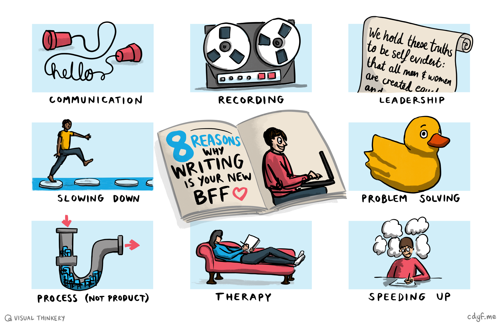
```

(ref:captionbff) Eight reasons why writing is your new Best Friend Forever (BFF): Communication, see section \@ref(communicating). Recording, see section \@ref(recording). Leadership, see section \@ref(leadership). Slowing down, see section \@ref(slowing). Problem solving, see section \@ref(solving). Process not product, see section \@ref(product). Therapy, see section \@ref(therapy). Speeding up, see section \@ref(accelerating). B.F.F. by [Visual Thinkery](https://visualthinkery.com/) is licensed under [CC-BY-ND](https://creativecommons.org/licenses/by-nd/4.0/)

So let's expand on each of the reasons in figure \@ref(fig:bff-fig) why writing is your new BFF:

### Writing as communication {#communicating}
Writing is communication, see figure \@ref(fig:comms-fig). Well Duh! I'm stating the obvious, because you will sometimes hear software engineers talking disparagingly about writing the (*sigh*)`documentation`. 

```{r comms-fig, echo = FALSE, fig.align = "center", out.width = "100%", fig.cap = "(ref:captioncomms)"}
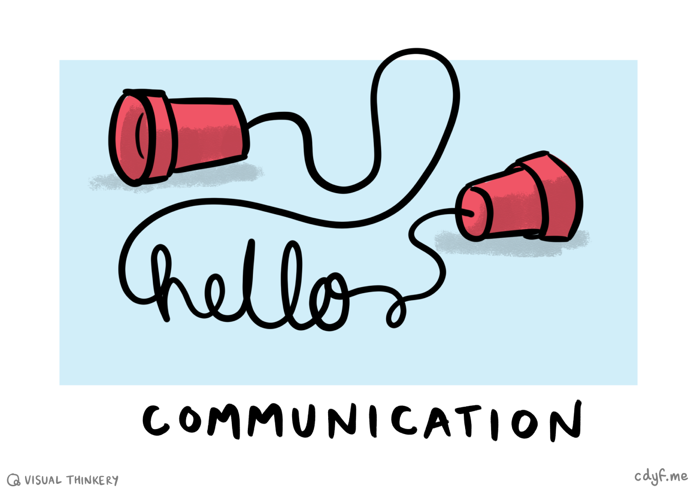
```

(ref:captioncomms) Your writing will often communicate better if you invest more time in rewriting to make it clearer. [Tin can telephone](https://en.wikipedia.org/wiki/Tin_can_telephone) sketch by [Visual Thinkery](https://visualthinkery.com/) is licensed under [CC-BY-ND](https://creativecommons.org/licenses/by-nd/4.0/)

Engineers may sometimes tell you that writing about their software or hardware can be a chore. If they bother to write about their software at all, they often do it at the end, *if* there is time and there's no more features to be added or bugs to be removed. This might go some way to explaining why software and hardware documentation can be so bad because:

* It is probably written as an afterthought or in a hurry
* It might not be authored by the person who actually designed or built the software
* The documentation may be describing complex processes or very abstract concepts
* It may have been mangled with the original meaning lost in translation to a different (natural) language
* The author may lack empathy with their readers^[Unfortunatley this is very common in Computing!] 

A good example of this is the documentation for the distributed version control system [git](https://en.wikipedia.org/wiki/Git). While `git` is a powerful tool that is worth spending time learning about, like most powerful tools, it is also quite complicated. Some of the documentation on git is very good [@progit] but other parts of it tend towards impenetrable jargon-ridden nonsense. Take this example selected by [Santiago Perez De Rosso](https://github.com/spderosso) from the documentation describing a command known as `git-wave-stash` [@youtube-git]


> wave all staged stashes next to various cherry-picked non-applied applied trees
> `r tufte::quote_footer('--- Anon [@sigman07]')`


Can you work out what that actually means? Me neither. No doubt, you can think of many other examples where you've been reading documentation and thought `WTF`? This is just one example from many that shows why good writing is crucial for communication. 

Badly written text like the example above, fails to communicate with the reader. We've all been on the receiving end of badly written prose, especially when it comes to software and hardware documentation. When it is done well, writing quickly communicates what readers actually need to understand.


### Writing as recording {#recording}

What were you doing on the March 6th 2013? You probably don't know and I'll bet you would probably struggle to find out. I don't know what I was doing on March 6th 2013 either because I have no written records for that day. If I was an [obsessive–compulsive diarist](https://en.wikipedia.org/wiki/Obsessive%E2%80%93compulsive_disorder) (OCD), I'd have a written record of what happened to me on that day. But I'm not, so I don't. The point here is that, writing doesn't just communicate it also *records* what has happened, see figure \@ref(fig:start-record-fig).

```{r start-record-fig, echo = FALSE, fig.align = "center", out.width = "100%", fig.cap = "(ref:captionrecording)"}
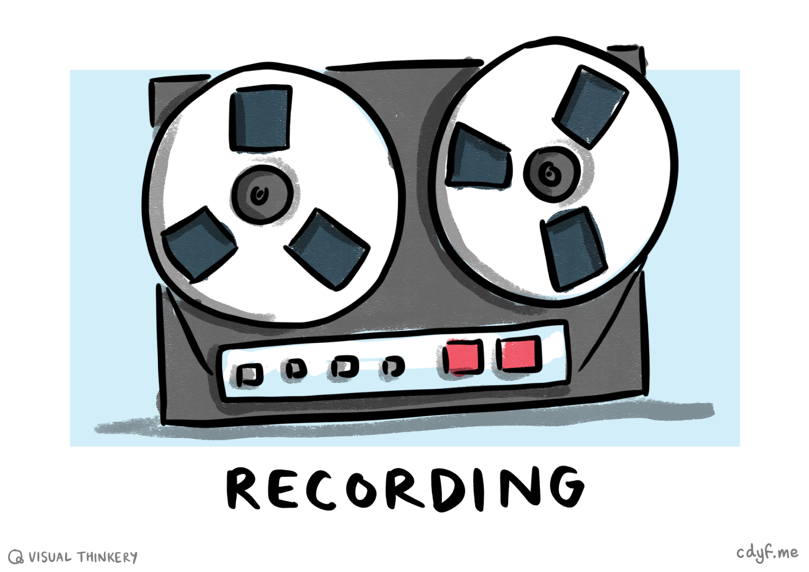
```

(ref:captionrecording) If you don't write it down there will be no record that it actually happened, whatever *it* was. While it is difficult to know in advance exactly what you might need to record, the safest option is to write as much of it as you can anyway, just in case. Old school reel to reel [tape recorder](https://en.wikipedia.org/wiki/Tape_recorder) sketch by [Visual Thinkery](https://visualthinkery.com/) is licensed under [CC-BY-ND](https://creativecommons.org/licenses/by-nd/4.0/)


If it *might* be important, it is *probably* worth writing down. Even things you think are trivial are still worth writing down as they might turn out to be important later:

* Minutes from a meeting  
* Lecture notes you've written
* A bug you've been working on including how you fixed it 

<!--https://twitter.com/b0rk/status/1554456645530435588-->

So besides communicating, writing records what happened. If you don't write it down, it might just disappear forever without trace. The audience you'll be communicating with isn't just other people, it might be your future self. That future self might *really* need to know how you fixed that bug, and it could save you *hours* of re-figuring out how to solve a problem you've already solved.

### Writing as leadership {#leadership}

Have you ever felt moved or influenced by a piece of writing? Have you ever read something that motivated or influenced you to do something? Of course you have. If, as Harry Truman supposed, *leaders are readers* then *writers are too*. [@truman]

```{r constitution-fig, echo = FALSE, fig.align = "center", out.width = "100%", fig.cap = "(ref:captionconstitution)"}
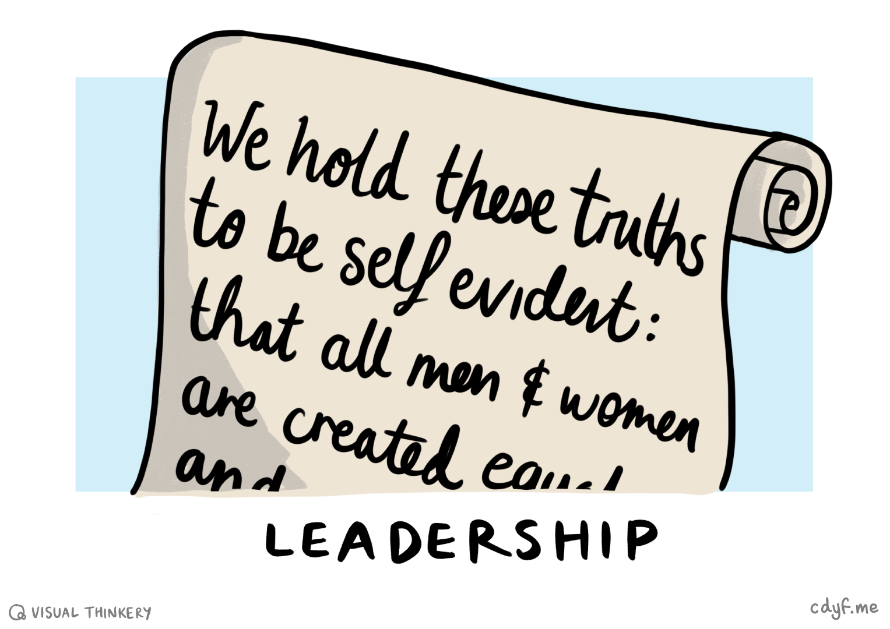
```

(ref:captionconstitution) *We hold these truths to be self-evident, that all men* (and women) *[are created equal](https://en.wikipedia.org/wiki/All_men_are_created_equal)...* Just words written down on a piece of paper, but words that made people follow. [@declarationofi] Declaration sketch by [Visual Thinkery](https://visualthinkery.com/) is licensed under [CC-BY-ND](https://creativecommons.org/licenses/by-nd/4.0/)

Let's take the [United States Declaration of Independence](https://en.wikipedia.org/wiki/United_States_Declaration_of_Independence) shown in figure \@ref(fig:constitution-fig). We're still talking (and singing) about it more than 200 years after it was written. [@declarationofi; @alexanderhamilton] That's not just because it was influential, it's because it was written down. The seemingly mundane and lo-tech but hi-fi act of humble writing. The declaration is “just” words, written down on a piece of paper, but words that changed the course of history. 

You say you want a revolution? Well, you know, we all want to change the world. [@revolution] Whatever kind of revolution you want to start or join, you'll stand a much better chance of making it happen, if you write down your ideas in a way that people can clearly understand. This might include mini-revolutions such as: 

* Getting a job interview, by crafting a persuasive covering letter and compellng CV 
* Encouraging people to join `projects` you've started, see section \@ref(projects) 
* Negotiating terms and conditions of a contract of employment, you might start by email
* Getting someone to invest in your startup or offer you some freelance or contract work
* ... and so on

So writing well won't just help you communicate and record, it will help you to become a more successful leader too by specifying exactly what you mean so you can convince other people to follow your lead.

### Writing as slowing down {#slowing}

Your brain tends to work *much* more quickly than your fingers can type or your hands can write. Your brain will often work much faster than you can speak as well. Writing can slow that process down to something more manageable and concrete, by focussing your thoughts on a given topic or problem, see figure \@ref(fig:slowing-fig).

```{r slowing-fig, echo = FALSE, fig.align = "center", out.width = "100%", fig.cap = "(ref:captionslowing)"}
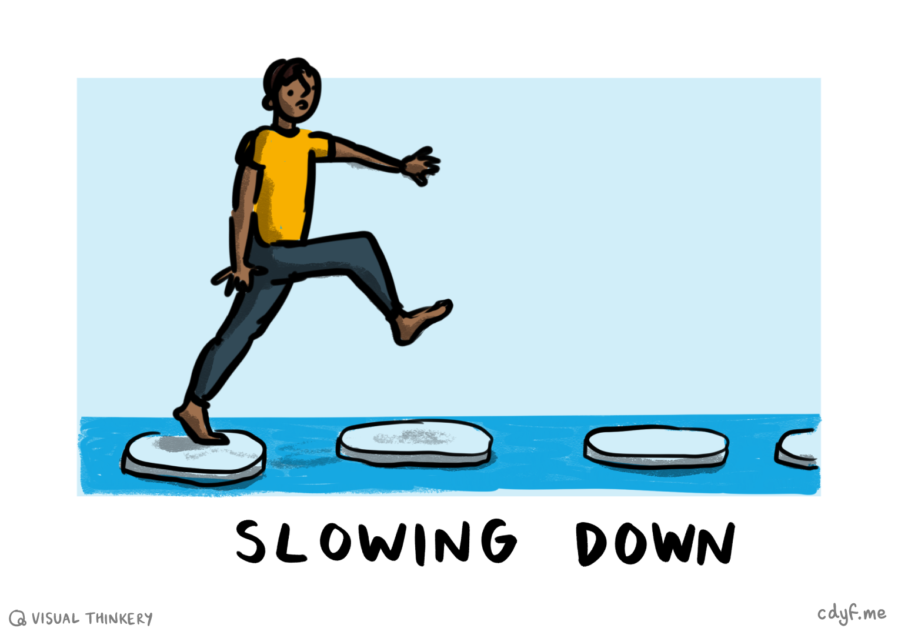
```

(ref:captionslowing) Is your brain working too quickly for its own good? Writing can help to slow it down and take it one step at a time. Slowing down sketch by [Visual Thinkery](https://visualthinkery.com/) is licensed under [CC-BY-ND](https://creativecommons.org/licenses/by-nd/4.0/)

Writing forces you to say more *exactly* what you are thinking. Slowly. Whereas thoughts can be fast, vague and slippery, writing needs to be much more precise and accurate. The author and playwright [Hanif Kureishi](https://en.wikipedia.org/wiki/Hanif_Kureishi) writes to find out what he thinks, see figure \@ref(fig:hanif-fig). Working out what you think takes time, one of reasons writing can be challenging or lead to the dreaded [writer's block](https://en.wikipedia.org/wiki/Writer%27s_block). [@whyiwrite]

```{r hanif-fig, echo = FALSE, fig.align = "center", out.width = "100%", fig.cap = "(ref:captionhanif)"}
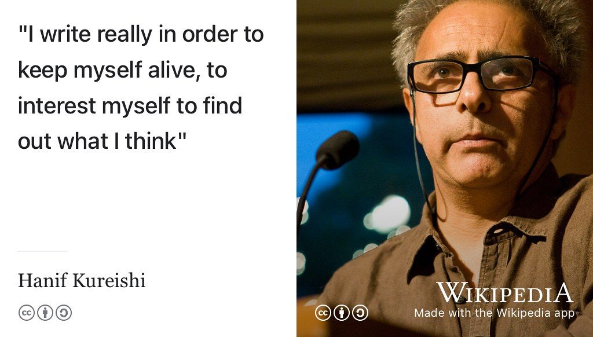
```

(ref:captionhanif) Like many authors, the playwright [Hanif Kureishi](https://en.wikipedia.org/wiki/Hanif_Kureishi) writes to find out what he thinks. [@kureishi] Whatever you are writing, you'll have a much better understanding of what you are *actually* thinking after you've tried to write it down. Writing isn't just an important product, it's a crucial process too. CC [BY-SA](https://creativecommons.org/licenses/by-sa/2.5/deed.en) portrait of Hanif Kureishi speaking at Emory University in 2008 by [Brett Weinstein](https://www.brettweinstein.com/) on Wikimedia Commons [w.wiki/6SKv](https://w.wiki/6SKv) adapted using the [Wikipedia App](https://apps.apple.com/us/app/wikipedia/id324715238)


### Writing as problem solving {#solving}

Ever got stuck on a difficult problem? Ever tried writing that problem down or articulating the details to a rubber duck? There's something about writing a problem down or articulating the issue to another person. Even a rubber duck will do, see figure \@ref(fig:rubber-duck-fig). So writing can be a useful technique for solving problems, even if nobody else ever reads what you've written or heard what you've spoken. 

```{r rubber-duck-fig, echo = FALSE, fig.align = "center", out.width = "100%", fig.cap = "(ref:captionduck)"}
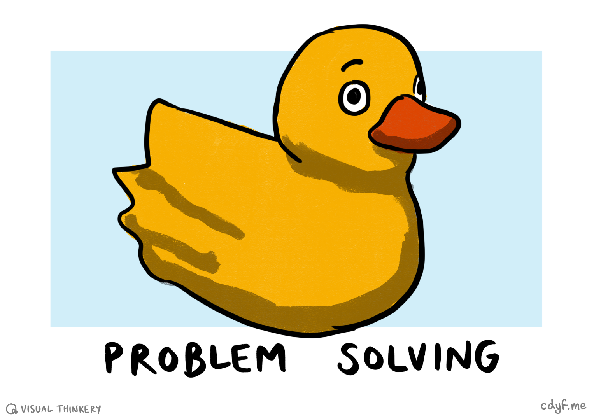
```

(ref:captionduck) Ever tried explaining that troublesome bug to a rubber duck? Welcome to [rubber duck debugging](https://en.wikipedia.org/wiki/Rubber_duck_debugging), a tried and tested technique for problem solving, either through written or spoken communication with an inanimate object. Rubber duck sketch by [Visual Thinkery](https://visualthinkery.com/) is licensed under [CC-BY-ND](https://creativecommons.org/licenses/by-nd/4.0/)

By the time you've written that [stackoverflow.com](https://stackoverflow.com/) question about a techincal problem you are struggling to solve, your brain may have figured it out. This is much more likely to happen if you articulate the problem in words, either written down or spoken, to a rubber duck. 


### Writing as a process, not just a product {#product}

When you are writing a CV, résumé or a covering letter, the *product* of your writing is the most important output. But sometimes, it is the *process* of writing that matters more than the product, see figure \@ref(fig:process-fig).


```{r process-fig, echo = FALSE, fig.align = "center", out.width = "100%", fig.cap = "(ref:captionprocess)"}
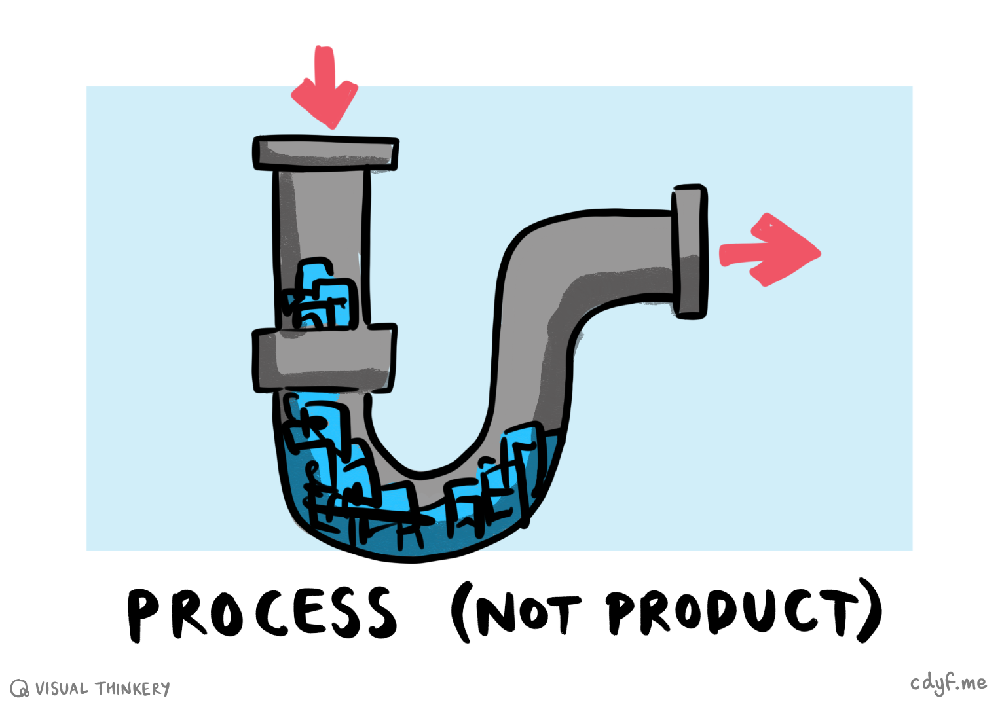
```

(ref:captionprocess) Sometimes the *process* of writing (the blue bit) is more important than the *product* of writing (the red output). Process sketch by [Visual Thinkery](https://visualthinkery.com/) is licensed under [CC-BY-ND](https://creativecommons.org/licenses/by-nd/4.0/)

Here are some examples where the process of writing can be more important than its product:

* Taking notes helps you concentrate on what a speaker is saying 
* Writing a reflection which forces you to analyse on what has happened and what you'll do next, see section \@ref(reflecting). Cognitive psychologists call this [metacognition](https://en.wikipedia.org/wiki/Metacognition), thinking about thinking 
* Writing down a problem helps you to solve it, as described in section \@ref(solving)

So writing is important as a *process* as well as a *product*. That process might include slowing down (section \@ref(slowing)), speeding up (section \@ref(accelerating)) or both. Either way, writing forces you to be clear and focus, it is a *process* for working, not just the *product* (output) of working. When you write a dissertation or thesis for your bachelors or masters degree the process of writing is as important as the product. The computer scientist [Simon Peyton Jones](https://en.wikipedia.org/wiki/Simon_Peyton_Jones) outlines how recognising this can help you to write a better dissertation or thesis in figure \@ref(fig:peyton-jones-vid). 

```{r peyton-jones-vid, echo = FALSE, fig.align = "center", out.width = "99%", fig.cap = "(ref:captionpeyton)"}
knitr::include_url('https://www.youtube.com/embed/VK51E3gHENc')
```

(ref:captionpeyton) Computer scientist [Simon Peyton Jones](https://en.wikipedia.org/wiki/Simon_Peyton_Jones) explains how to write a better dissertation or thesis by writing early and often, rather than waiting to write it all at the end. He's talking about writing papers here, but what he says applies to writing a thesis too: Writing helps you be clear by crystallizing what you understand. It's important as a *process* as well as a product. You can also watch the full 57 minute video embedded in this figure at [youtu.be/VK51E3gHENc](https://youtu.be/VK51E3gHENc) [@youtube-peyton]

If you're using a machine like ChatGPT to help you write (see section \@ref(machines)), you'll be bypassing some of the valuable *process* of writing that Simon talks about. [@youtube-peyton] Yes, writing can sometimes be painful and slow, but its one of the best ways to learn. If you're looking to improve your academic writing (essays, theses, dissertations etc), you will find [www.phrasebank.manchester.ac.uk](https://www.phrasebank.manchester.ac.uk/) useful. [@phrasebank]

<!-- 
related work last, state contributions, give an example not a generic introduction (yawn) explicitly mention weaknesses at end of related work, giving credit doesn't diminish your contributions

1. Don't wait, write 2. Identify your key idea 3. Tell a story 4. Nail your contributions to the mast 5. related work later 6. put your readers first (by using examples) 7. Listen to your readers.
-->


### Writing as therapy {#therapy}
Besides being a tool for communication, writing can be therapeutic for the writer too. The simple act of writing can help you tackle mental health issues discussed in chapter \@ref(nurturing). You might think it tragic somebody writing a diary that nobody reads, but actually, that's not the only point of the diary. The metacognition we described in section \@ref(product) is a valuable exercise in its own right. You could think of writing like a therapists couch shown in figure \@ref(fig:therapy-fig). [@writingtherapy]

```{r therapy-fig, echo = FALSE, fig.align = "center", out.width = "100%", fig.cap = "(ref:captiontherapy)"}
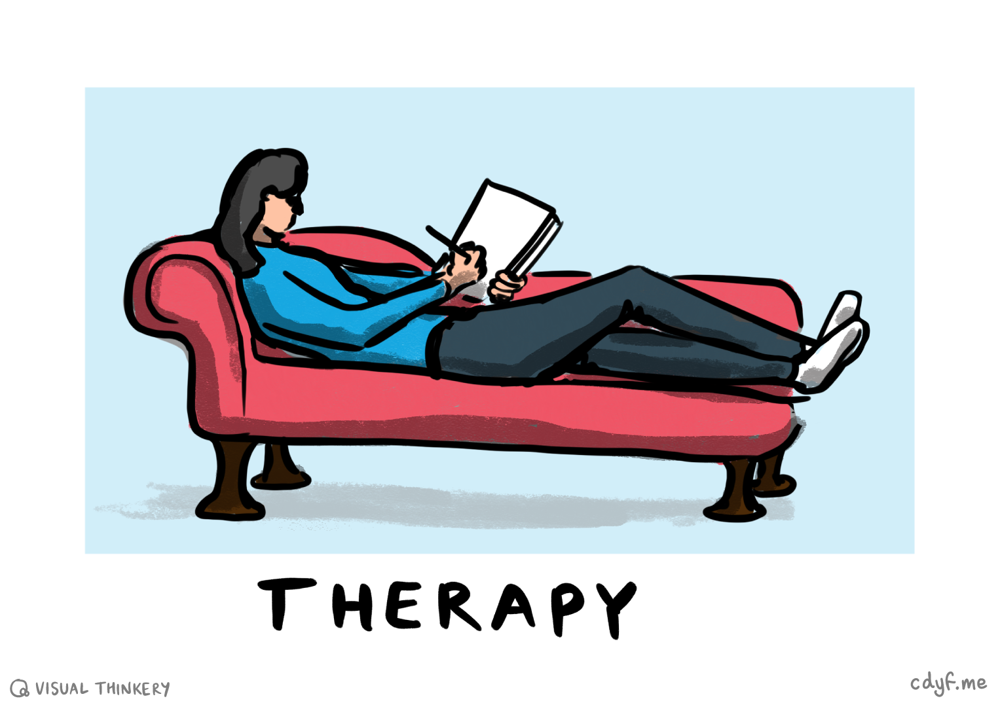
```

(ref:captiontherapy) *Dear Diary ...*: The therapeutic effects of writing are well documented, even if that writing isnt actually read by anyone. Therapy sketch by [Visual Thinkery](https://visualthinkery.com/) is licensed under [CC-BY-ND](https://creativecommons.org/licenses/by-nd/4.0/) 

The UK Prime Minister [Winston Churchill](https://en.wikipedia.org/wiki/Winston_Churchill) found that writing helped to keep the “black dog” of his depression under control, see section \@ref(depression) and figure \@ref(fig:winston-fig).

```{r winston-fig, echo = FALSE, fig.align = "center", out.width = "100%", fig.cap = "(ref:captionwinston)"}
knitr::include_graphics("images/churchill.jpeg")
```

(ref:captionwinston) Winston Churchill managed to regulate his depression by writing. If you are affected by anxiety or depression, you may find that private forms of writing like those described in section \@ref(dailywrite) will help to improve your mental health. Public domain portrait of Winston Churchill by [Yousuf Karsh](https://en.wikipedia.org/wiki/Yousuf_Karsh) on Wikimedia Commons [w.wiki/4aJk](https://w.wiki/4aJk)

So writing can be therapeutic, a powerful tool for developing [mindfulness](https://www.nhs.uk/mental-health/self-help/tips-and-support/mindfulness/) as well as communicating with other people. [@mindfulnhs]


### Writing as speeding up {#accelerating}

As well as slowing your brain down discussed in section \@ref(slowing), writing can also speed it up by *wicking* ideas like a [candle wick](https://en.wikipedia.org/wiki/Candle_wick) does for candle wax. Without the wick, the candle wax can't undergo the chemical reaction that transforms it into carbon dioxide and water. As the software engineer [Paul Graham](https://en.wikipedia.org/wiki/Paul_Graham_(programmer)) puts it:  

> “If I can't write things down, worrying about remembering one idea gets in the way of having the next. Pen and paper wick ideas”
> `r tufte::quote_footer('--- Paul Graham [@theislandtest]')`

and also 

> “I think it's far more important to write well than most people realise. Writing doesn't just communicate ideas; it generates them. If you're bad at writing and don't like to do it, you'll miss out on most of the ideas writing would have generated”
> `r tufte::quote_footer('--- Paul Graham [@writingbriefly]')`

So writing down whatever is in your head will often help you refine your ideas and generate even more new ones as shown in figure \@ref(fig:wicking-fig).

```{r wicking-fig, echo = FALSE, fig.align = "center", out.width = "100%", fig.cap = "(ref:captionwicking)"}
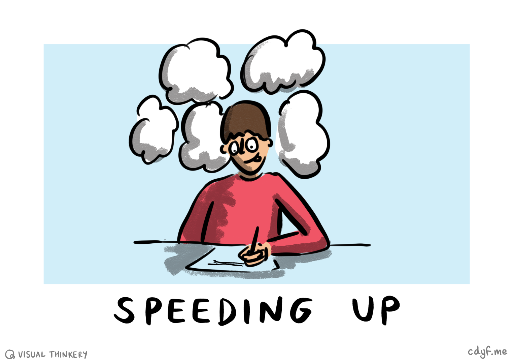
```

(ref:captionwicking) Want to have more ideas? Want to have better ideas? Just writing them down can help you refine your ideas as well as generating novel ones too. Thinking sketch by [Visual Thinkery](https://visualthinkery.com/) is licensed under [CC-BY-ND](https://creativecommons.org/licenses/by-nd/4.0/) 

## Improving your writing {#wyf}
Hopefully I've convinced you that written communication skills (both as a writer and reader) are important soft skills that scientists and engineers often neglect. Writing performs multiple functions, so how can you improve?

### Dogfooding {#dogfooding}

<!-- similar to rubber duck debugging https://en.wikipedia.org/wiki/Rubber_duck_debugging-->
Many employers test their products and services by trialling them on their own employees, this is known as [eating your own dogfood](https://en.wikipedia.org/wiki/Eating_your_own_dog_food) shown in figure \@ref(fig:dogfooding-fig). Tasty, tasty dogfood. 🐶

```{r dogfooding-fig, echo = FALSE, fig.align = "center", out.width = "100%", fig.cap = "(ref:captiondogfooding)"}
knitr::include_graphics("images/Dogfooding.png")
```

(ref:captiondogfooding) Reading your own writing (aloud) is like [eating your own dog food](https://en.wikipedia.org/wiki/Eating_your_own_dog_food). It's a simple and proven technique for improving your written communication in job applications such as covering letters, CVs, personal statements and the like. Dogfooding by [Visual Thinkery](https://visualthinkery.com/) is licensed under [CC-BY-ND](https://creativecommons.org/licenses/by-nd/4.0/))

Dogfooding is a simple technique for testing your own writing. Let's say you've just written a personal statement or covering letter (see section \@ref(covering-letters)). It's natural to read it over in your head to check for errors, before you send it. However, **reading it aloud** will pick up errors you may not have spotted by reading silently. Your ears and tongue will pick up on awkward phrases and sentences that your eyes didn't spot. There's something about articulating words out loud that flushes out errors you don't pick up when you read them in your head. Dogfooding is a tried and tested technique. It also means you're ready to vocalise those answers in an interview.

You might want to choose carefully where you do this as it might look a bit strange, but it works well. If you talk into a mobile phone while looking at a piece of paper, people won't notice you're talking to yourself. But you'll probably need some privacy as the stuff you're talking about is likely to be personal. Alternatively, find a critical friend who you can read out loud to. You can also use a [screen reader](https://en.wikipedia.org/wiki/Screen_reader), for example :

* Microsoft Teams has an [immersive reader](https://www.microsoft.com/en-gb/education/products/learning-tools)
* Android devices have [TalkBack](https://support.google.com/accessibility/android/answer/6007100)
* Apple devices have [VoiceOver](https://support.apple.com/en-gb/guide/iphone/iph3e2e415f/ios)

A screen reader will often reveal mistakes you haven't spotted by reading your text silently.

### Try Google's Tech Writing courses {#techwriting}
Google have developed some excellent written communication courses for software engineers, and those looking to become technical writers:

1. Technical Writing One: Technical Writing Fundamentals for Engineers [developers.google.com/tech-writing/one](https://developers.google.com/tech-writing/one)
1. Technical Writing Two: Intermediate Technical Writing for Engineers [developers.google.com/tech-writing/two](https://developers.google.com/tech-writing/two)


```{r googleplex-fig, echo = FALSE, fig.align = "center", out.width = "99%", fig.cap = "(ref:captionplex)"}
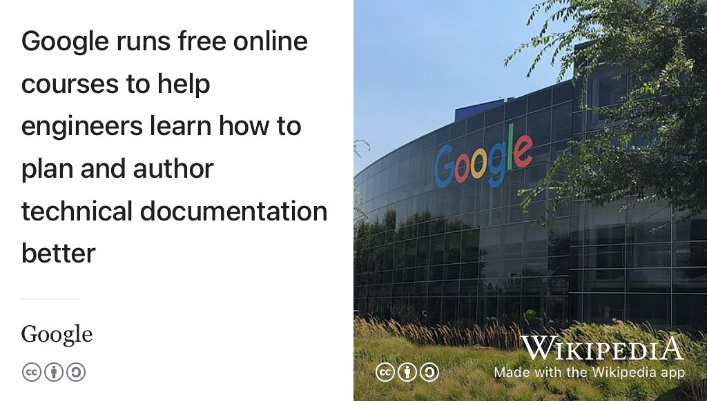
```

(ref:captionplex) While engineers can write code, they often struggle to communicate effectively in written natural languages like English. Technical writing courses like the free ones held by Google can help you become a better communicator. CC BY-SA picture of the [Googleplex](https://en.wikipedia.org/wiki/Googleplex) in California by The Pancake of Heaven via Wikimedia Commons [w.wiki/3X4t](https://w.wiki/3X4t) adapted using the [Wikipedia app](https://apps.apple.com/us/app/wikipedia/id324715238)

You might also be interested in the follow on courses:

1. Tech Writing for Accessibility [developers.google.com/tech-writing/accessibility](https://developers.google.com/tech-writing/accessibility)
1. Writing Helpful Error Messages [developers.google.com/tech-writing/error-messages](https://developers.google.com/tech-writing/error-messages)

The first two tech writing courses run as part of the second year course COMP2CARS at the University of Manchester, see chapter \@ref(organising) for details.

Google occasionally delivers these technical writing courses as free sessions open to the general public, see figure \@ref(fig:googleplex-fig). For details, see [developers.google.com/tech-writing/announcements](https://developers.google.com/tech-writing/announcements) for details.

### Writing machines {#machines}

There is no shortage of software to help you write better, beyond the basic spelling and grammar checkers described in section \@ref(spelling). The more sophisticated tools are often powered by Artificial Intelligence (AI), see figure \@ref(fig:chatgpt-fig). [@hogarth] 

```{r chatgpt-fig, echo = FALSE, fig.align = "center", out.width = "100%", fig.cap = "(ref:captionchatgpt)"}
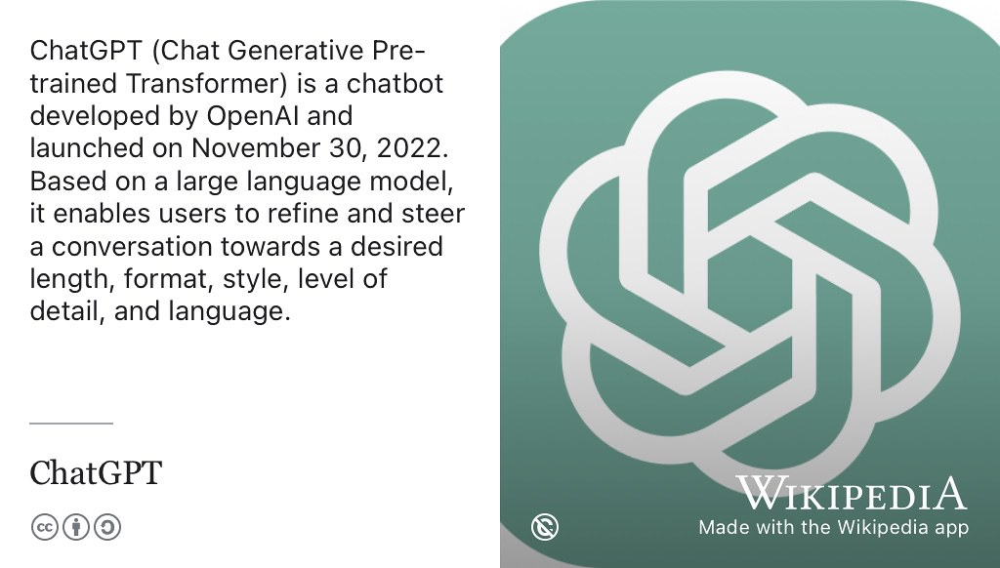
```

(ref:captionchatgpt) Chat Generative Pre-trained Transformer ([ChatGPT](https://en.wikipedia.org/wiki/ChatGPT)) is a chatbot developed by [OpenAI.com](https://openai.com/). [@gpt4] Based on a large [language model](https://en.wikipedia.org/wiki/Language_model) (LLM) it enables users to generate text of to their desired length, format, style and language. ChatGPT is one of many *writing machines* or *robo-writers* that you can potentially use as an assistant to help you communicate more quickly and clearly. Note that despite the name, the language model that ChatGPT is built on is NOT openly available. [@notopenai] OpenAI logo from Wikimedia Commons [w.wiki/6Lat](https://w.wiki/6Lat) adapted using the [Wikipedia App](https://apps.apple.com/us/app/wikipedia/id324715238) 🤖


Some of AI powered writing tools are tailored to improving academic writing while others can be used to improve your written job applications. An incomplete selection of tools you could experiment with, if you haven't already, is shown below:

* [angryreviewer.com](https://www.angryreviewer.com/) by [Roman Anufriev](https://anufrievroman.com/) is a bit blunt but will give you honest feedback on your writing
* [ChatGPT](https://en.wikipedia.org/wiki/ChatGPT) (see figure \@ref(fig:chatgpt-fig)), [Bing](https://blogs.microsoft.com/blog/2023/02/07/reinventing-search-with-a-new-ai-powered-microsoft-bing-and-edge-your-copilot-for-the-web/) and [Bard](https://blog.google/technology/ai/bard-google-ai-search-updates/) [@bingai; @bardai]
<!--coauthor.stanford.edu-->
* [DrivelDefence](https://www.plainenglish.co.uk/drivel-defence.html) part of the [Plain English Campaign](https://en.wikipedia.org/wiki/Plain_English_Campaign), see also *[The Complete Plain Words](https://en.wikipedia.org/wiki/The_Complete_Plain_Words)* [@gowers]
* [ecree.com](https://www.ecree.com) a writing tutor 
* [grammarly.com](https://www.grammarly.com/) reviews the spelling, grammar, punctuation and clarity of your writing 
* [jasper.ai](https://www.jasper.ai/) AI powered content generator
* [paperpal.com](https://paperpal.com) for academic writing 
* [quillbot.com](https://quillbot.com) tool for paraphrasing 
* [tldrthis.com](https://tldrthis.com/) Too Long; Didn't Read? TLDRthis will summarise it for you
* [scholarcy.com](https://www.scholarcy.com/) AI-powered article summariser
* [tldrthis.com](https://www.tldrthis.com/) Tool Long Didn't Read (TLDR) this? Summarises text for you
* [toowrite](https://www.tswrevolution.com/) helps you to write a paper 
* [wordtune.com](https://www.wordtune.com) summarises long documents 
* [writefull.com](https://www.writefull.com) helps you to write, paraphrase and edit 


All of these tools will be biased by whatever data they've been trained on and encode some of the prejudices of the engineers that wrote their algorithms. You need to be careful about plagirism (if it is academic work) and writing generic job applications that are de-personalised and de-humanised. Employers will be able to spot these a mile off. [@aiverbs;@aiverbsagain]

Another problem with using writing machines to help you communicate is that while the more sophisticated software might help overcome some of the dreaded *writer's block*, they bypass the important *process* of writing discussed in section \@ref(product). Writing about something is one of the best ways to learn about it, and sometimes the best time to write is when you're trying to figure out the subject for yourself. If you wait until you're an expert, it will be too late to start. If you get a machine like ChatGPT to write for you, you won't identify gaps in your knowledge and develop the expertise to fill them.

So viewing writing as just another kind of `output`, overlooks a lot of the value of writing in the first place. 

Despite their limitations, and the fact that we're still trying to figure out what their long term impacts will be, writing machines may help you to communicate more clearly and quickly. [@mairead; @noordenai; @hutsonai] 

### Writers are fighters! {#dailywrite}
Another technique for improving your written communication is to deliberately write something every day, that might be a personal diary that only you read, or it could be something more public like blog. Schedule a time every day, say 15 to 30 minutes when you will do this without fail. Sometimes this will be easy, other times it will be hard. What's important is that you write something, see figure \@ref(fig:jodi-picoult-fig). That writing could take several forms:

* public web log or [blog](https://en.wikipedia.org/wiki/Blog)
* [gratitude journal](https://en.wikipedia.org/wiki/Gratitude_journal) see section \@ref(lays)
* private diary or personal laboratory notebook
* morning pages, a unedited stream of conciousness that can help you become more creative \@ref(fig:jodi-picoult-fig) [@cameron;@burkeman]
* [bullet journal](https://en.wikipedia.org/wiki/Bullet_journal). Some people swear by it, see [bulletjournal.com](https://bulletjournal.com/)
<!--* contributing to Wikipedia-->

The technique of *30 minutes per day* can be a very effective way of getting things done, incrementally over time. In my experience it works for lots of things besides writing including getting exercise (discussed in chapter \@ref(nurturing)) to gardening. [@leendertz]

### Leaders are readers {#dailyread}
Reading other people's code will improve your software engineering skills. Likewise, reading other peoples writing will improve your natural language engineering skills. Leaders are readers! Read anything, it might be novels, magazines, newspapers, stuff online or any of the books cited in chapter \@ref(reading). Find a time and place to do this every day and stick to it, see figure \@ref(fig:reading-fig)

```{r reading-fig, echo = FALSE, fig.align = "center", out.width = "100%", fig.cap = "(ref:captionreading)"}
knitr::include_graphics("images/the-motivation-for-reading.png")
```

(ref:captionreading) Reading allows you to learn from other people's hard won experience whilst also improving your own written communication skills. Just like you improve your coding skills by reading *and* writing code, you will improve your written communication skills by reading *and* writing in natural languages. [The motivation for reading](https://bryanmmathers.com/the-motivation-for-reading/) by [Visual Thinkery](https://visualthinkery.com/) is licenced under [CC-BY-ND](https://creativecommons.org/licenses/by-nd/4.0/) with help from [Michael Rosen](https://en.wikipedia.org/wiki/Michael_Rosen)


### Reading the friendly manual {#rtfm}

You don't get good at communicating with computers (coding) by just *writing* lots of code. You also need to *read* other people's code too and be able to understand and modify it. Likewise, you don't get good at communicating with people by just *writing* stuff in natural languages like the [English language](https://en.wikipedia.org/wiki/English_language). You need to *read* stuff too. Books, manuals, software documentation, articles, use cases, novels, poetry, plays, magazines, newspapers etc. Reading this stuff will help you learn and you'll improve your written communication skills too. So *Read The Friendly Manual*. [RTFM](https://en.wikipedia.org/wiki/RTFM). Read THIS Friendly Manual and the stuff it cites, see figure \@ref(fig:rtfm-fig)


```{r rtfm-fig, echo = FALSE, fig.align = "center", out.width = "100%", fig.cap = "(ref:captionrtfm)"}
knitr::include_graphics("images/Read the friendly manual.png")
```

(ref:captionrtfm) [Read The Friendly Manual](https://en.wikipedia.org/wiki/RTFM) (`RTFM`), some of it you will love, some of it you won’t. Either way reading will help you develop valuable skills and knowledge. Read The *Friendly* Manual by [Visual Thinkery](https://visualthinkery.com/) is licenced under [CC-BY-ND](https://creativecommons.org/licenses/by-nd/4.0/)


<!--
```{r itcrowd-fig,echo=FALSE, fig.cap = "test caption"}
library("vembedr")
embed_url("https://www.youtube.com/watch?v=pGFGD5pj03M")
```
-->

<!--
In the best teams, members listen to one another and show sensitivity to feelings and needs. [@googleteams]-->

<!--Professionalism can be defined several ways but [Robert C. Martins](https://en.wikipedia.org/wiki/Robert_C._Martin)'s definition is a good starting point. In *The Clean Coder* [@cleancoder], he defines a professional as someone who is accountable and responsible, not just taking responsibility for what they build but being responsible for their own career. Being a professional relies on both soft and hard skills.-->

<!--Employers often talk about skills gaps, skills crises [@oilandgaskills; @mindthegap] and labour shortages of various kinds. [@digitalskillscrisis; @softskillscrisis; @shadboltreview] They frequently point out that various combinations of skills can be problematic to find and develop in their employees, [@brucetulgan] and even that they fight a “war for talent” [@warfortalent]. As a science and engineering student you get lots of opportunities to develop hard skills. However, while hard technical skills are important for your future, your soft skills are just as likely to get you hired, promoted or even fired. [@nicegirls; @rocketscience; @jonathanblack; @paulredmond; @helpihaveamanager] Soft skills are hard to learn but well worth spending your time and effort to develop.-->


<!-- employability skills via CBI and  jonathan black and
Self-management – readiness to accept responsibility, flexibility, resilience, self-starting, appropriate assertiveness, time management, readiness to improve own performance based on feedback/
reflective learning. -->

<!-- Teamworking – respecting others, co-operating, negotiating/persuading, contributing to discussions, and awareness of
interdependence with others. -->

<!--Business and customer awareness – basic understanding of the key drivers for business success – including the importance of
innovation and taking calculated risks – and the need to provide customer satisfaction and build customer loyalty.-->

<!--Problem solving – analysing facts and situations and applying creative thinking to develop appropriate solutions. Communication and literacy – application of literacy, ability to produce clear, structured written work and oral literacy – including listening and questioning.-->

<!--Application of numeracy – manipulation of numbers, general mathematical awareness and its application in practical contexts
(e.g. measuring, weighing, estimating and applying formulae).-->

<!--Application of information technology – basic IT skills, including familiarity with word processing, spreadsheets, file management and use of internet search engines.-->

<!-- Underpinning all these attributes, the key foundation, must be a positive attitude: a ‘can-do’ approach, a readiness to take part and contribute, openness to new ideas and a drive to make these happen.-->

<!--Frequently mentioned by both employers and universities is entrepreneurship/enterprise broadly, an ability to demonstrate
an innovative approach, creativity, collaboration and risk taking. An individual with these attributes can make a huge difference
to any business-->

<!--Soft skills entrepreneurial and enterprising skills are covered in chapter xxx. Specific soft skills that will help you keep you job and get promoted are covered in chapter yyy.  -->


<!--## Team work

See video https://www.youtube.com/watch?v=pGFGD5pj03M [@theitcrowd]


## Social skills

Social skills are those that help you work with other people in your team, small or large. You might also see them referred to as people skills, inter-personal skills, behavioural skills [@humantouch], non-cognitive skills [@winningpersonality; @jobsofthefuture; @futureofjobs], influence [@dalecarngie], emotional intelligence [@emotionaliq] or employability skills. [@employabilityskills]


* How can you improve your ability to work in a team? [@diverseteams]-->

## Breakpoints {#bp4}
(ref:breakpoint)

```md
* PAUSE ⏸️
```

* Which of the communication skills in table \@ref(tab:iotable) are your strongest?
* Which of the communication skills in table \@ref(tab:iotable) are your weakest?
* What activities could you do to improve your weaker communication skills?
* How can you use writing machines to improve your written communication?

```md
* RESUME ▶️
```


### Coding challenges {#cc4}

* Write an article or blog post about something you care about, find a suitable venue for publication
* Take a course from outside computer science, where the main form of assessment is written essays or dissertations. Humanities departments are a good place to start. This will improve your written communication skills
* Not been reading many books lately? Pick a book to read just because its interesting, rather than because you have to.


## Summarising your soft written skills {#tldr4}

[Too long, didn't read](https://en.wiktionary.org/wiki/too_long;_didn%27t_read) (TL;DR)? Here's a summary:

Your future is bright, your future needs writing. Writing your future will help you design your future. Designing your future  will help you to start coding your future. 

You'll need both soft and hard skills to compete in the workplace. Are you underestimating the importance of softer skills? We've looked briefly at the softer written communication skills in this chapter and some simple techniques for improving them. You can go a step further by enrolling on some humanities courses where you'll develop your these skills even more. 

Written communication skills are only the tip of the soft skills iceberg. Teamwork, negotiation, conflict resolution, public speaking, motivating others and leadership are also important soft skills too. How can you develop these skills while at University? How can you demonstrate to potential employers that you have these skills? Your technical skills are of limited use without people skills, to allow you to work with others see figure \@ref(fig:otherpeople-fig).

```{r otherpeople-fig, echo = FALSE, fig.align = "center", out.width = "100%", fig.cap = "(ref:captionotherpeople)"}
knitr::include_graphics("images/What - other people.png")
```
(ref:captionotherpeople) Unless you want to be a [lighthouse keeper](https://en.wikipedia.org/wiki/Lighthouse_keeper) on a remote island, there are very few jobs where you don't have to work as part of a team with other people. If you were hoping to carry on working independently from other people, sorry to break the bad news! In the longer term, you will benefit from constantly improving your softer skills and providing evidence of them to potential employers. Written communication is just one of those softer skills. Other people sketch by [Visual Thinkery](https://visualthinkery.com) is licensed under [CC-BY-ND](https://creativecommons.org/licenses/by-nd/4.0/)

So communicating with other people is a key skill. Writing more will help improve your written communication skills, we looked at some simple techniques for doing this in section \@ref(wyf). Just write, see figure \@ref(fig:bronte-fig).

```{r bronte-fig, echo = FALSE, fig.align = "center", out.width = "100%", fig.cap = "(ref:captionbronte)"}
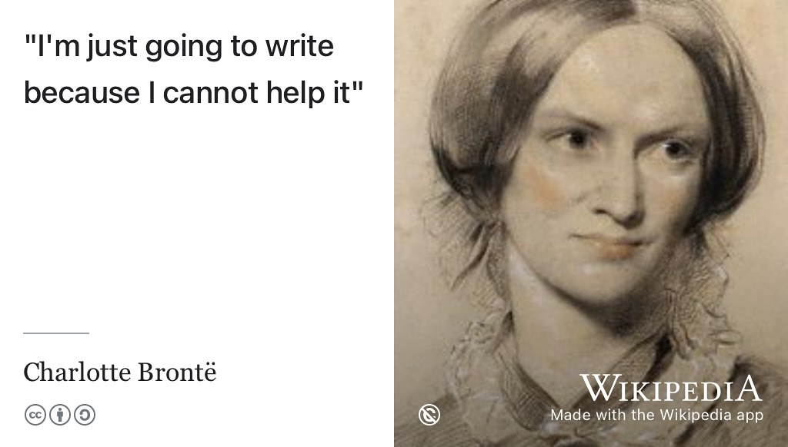
```
(ref:captionbronte) The author [Charlotte Brontë](https://en.wikipedia.org/wiki/Charlotte_Bront%C3%AB) wrote the classic gothic novel [Jane Eyre](https://en.wikipedia.org/wiki/Jane_Eyre). [@janeeyre] She just couldn't help it: “*I’m just going to write because I cannot help it*”. Just write! Most computer scientists don't write or read enough material in natural languages like English, especially when compared to their counterparts in the humanities. Writing more would make them better communicators. Quotation via [bronte.org.uk](https://www.bronte.org.uk/), public domain image of a chalked portrait of Charlotte Brontë by George Richmond via Wikimedia Commons [w.wiki/9idq](https://w.wiki/9idq) adapted using the [Wikipedia App](https://apps.apple.com/gb/app/wikipedia/id324715238) ✍️


This chapter has investigated the art of written communication, and discussed its importance in persuading people to invite you to job interviews, amongst other things. In chapter \@ref(speaking) we will look at the closely related communication skill of speaking.

In the next part, chapter \@ref(experiencing) you will reflect on what experience you have, where you can get more and how you can articulate that to potential employers, with both written and spoken communication.


