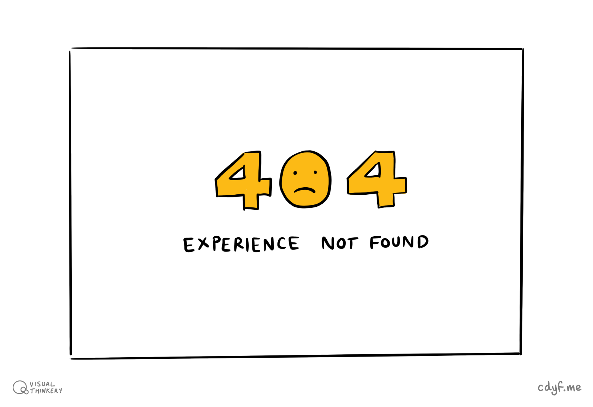
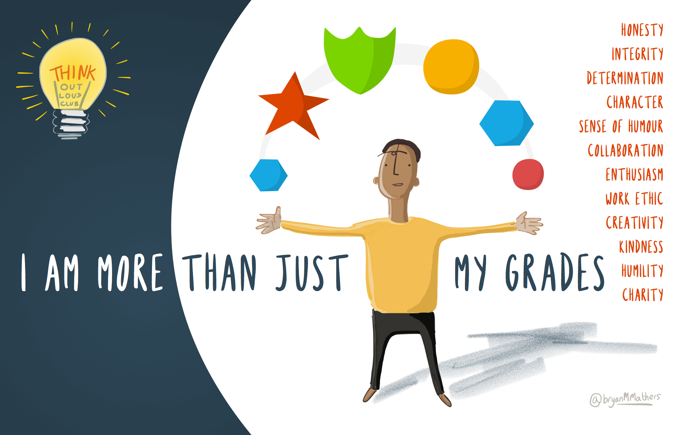
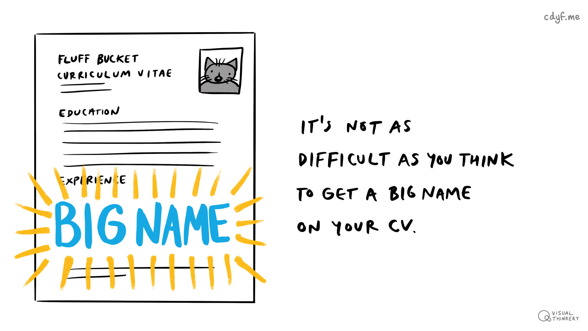
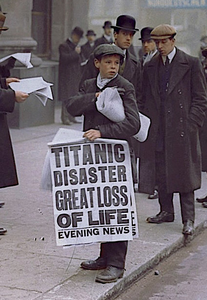

# Experiencing your future {#experiencing}

So, tell me, are you experienced? Why is experience valuable and what kind of experience are employers looking for anyway? How can you get some more experience? 🤔

```{r 404-fig, echo = FALSE, fig.align = "center", out.width = "100%", fig.cap = "(ref:caption404)"}

```

(ref:caption404) Do you respond with a sheepish *experience not found* error message when people ask about your experience? Is your experience like the [classic HTTP 404](https://en.wikipedia.org/wiki/HTTP_404) page not found? The client sent you a valid request for your experience, but your server couldn't find it. Awkward. Embarrassing silence? 😳 Don't worry, there are some simple and easy ways to build your experience so that instead of negative 404's, you can respond with a cheerfully positive 200 (OK), as described in this [list of HTTP status codes](https://en.wikipedia.org/wiki/List_of_HTTP_status_codes). We'll look at some of them in this chapter. Experience not found sketch by [Visual Thinkery](https://visualthinkery.com/) is licensed under [CC-BY-ND](https://creativecommons.org/licenses/by-nd/4.0/)

## What you will learn {#ilo5}

By the end of this chapter you will be able to

* Describe why having experience can improve your chances of getting interviews
* Identify what counts as experience and why it's valuable
* Recognise opportunities to get more experience before you graduate

<!-- for quizzes see the learnr package
https://rstudio.github.io/learnr/
quiz
 -->

<!--
## internships and placements: Pros  

1. Extended interview
1. Eliminate

## Debug your experience

## internships and placements: Cons  

1. Difficult to get back into study
1. Takes longer to get your degree-->


```{r relevance-fig, echo = FALSE, fig.align = "center", out.width = "100%", fig.cap = "(ref:captionrelevantexp)"}
knitr::include_graphics("images/What's relevant.png")
```

(ref:captionrelevantexp) You might be surprised by which of your experiences are relevant, and what kinds of experience are relevant on your CV. What's relevant sketch by [Visual Thinkery](https://visualthinkery.com/) is licensed under [CC-BY-ND](https://creativecommons.org/licenses/by-nd/4.0/)

## Why is experience so valuable?

It's common for students to be focused on their grades, whether those grades are low, middling or or high. At the extremes, if you have got lower grades than you'd like, you might be anxious or unhappy about them. If you've got higher grades, you're probably focussed on keeping them high. Either way, you are *much more* than your grades, because your education is only a part of who you are, shown in in figure \@ref(fig:not-just-grades-fig). You are the sum total of your experiences, this is one of the reasons that experience is so valuable.

```{r not-just-grades-fig, echo = FALSE, fig.align = "center", out.width = "100%", fig.cap = "(ref:captiongrades)"}

```

(ref:captiongrades) You are not your grades. Your experience tells people much more about your character, not just paid work, but any voluntary work and projects you've been involved in too. [I am more than just my grades](https://bryanmmathers.com/i-am-more-than-just-my-grades/) sketch by [Visual Thinkery](https://visualthinkery.com/) is licensed under [CC-BY-ND](https://creativecommons.org/licenses/by-nd/4.0/)


## Are you experienced? {#areuexperienced}

So what counts as experience?

* Freelance work: being self-employed
* Insight programmes and spring weeks: work shadowing
* Part-time jobs: casual or part-time work

<!--* Competitions: participating in competitions and hackathons will make your CV stand out-->

### Big name experience {#bignames}

It's easier than you might think to get a big name on your CV. For example, many large employers run [insight days, vacation schemes and spring weeks ](https://www.ratemyplacement.co.uk/insights). These are often aimed at first years, and are sometimes less competitive to get into than a longer term commitment such as a summer internship, year-long placement or even graduate job. A big name on your CV early in your degree can help it stand out later, as fluff bucket the grinning [cheshire cat](https://en.wikipedia.org/wiki/Cheshire_Cat) demonstrates on their CV shown in \@ref(fig:bigname-fig). 😻

```{r bigname-fig, echo = FALSE, fig.align = "center", out.width = "100%", fig.cap = "(ref:captionbigname)"}

```
(ref:captionbigname) It's easier than you  might think to get a big name on your CV, sometimes these can help your application stand out from the competition. Big name sketch by [Visual Thinkery](https://visualthinkery.com) is licensed under [CC-BY-ND](https://creativecommons.org/licenses/by-nd/4.0/)

Other ways to get a big name on your CV include joining a big name competition or event, for example:

* Google has Code Jam, HashCode and Kick Start [codingcompetitions.withgoogle.com](https://codingcompetitions.withgoogle.com/) and Summer of Code [summerofcode.withgoogle.com](https://summerofcode.withgoogle.com/)
* Facebook has hackathons [facebook.com/hackathon](https://en-gb.facebook.com/hackathon)
* Microsoft hosts the Imagine Cup [imaginecup.microsoft.com](https://imaginecup.microsoft.com/)
* There are many others like it listed at [devpost.com](https://devpost.com) and Major League Hacking [mlh.io](https://mlh.io/)

Big names look good on your CV, but they are not the only way to stand out.

### Voluntary experience {#volunteering}

Experience in the CV sense usually means paid work. However, experience in the context of *are you experienced?* [@hendrix] means anything where you can show you've been part of a bigger team, taken responsibility for something or tried to make the world a better place somehow. These include:

* Volunteering: Doing voluntary work is a good way to pick up new skills
* Being involved in societies: e.g. taking responsibility for things in a society
* Getting involved in a community, either physical or online
* Fixing bugs in open source software


### Casual experience {#casual}
You may already have experience of paid employment as a casual or part-time worker. This could include jobs such as waiting tables, serving in a bar or working in other areas of hospitality or retail, for example as a Saturday job.

```{r paperboy-fig, echo = FALSE, fig.align = "center", out.width = "50%", fig.cap = "(ref:captionpaperboy)"}

```
(ref:captionpaperboy) Don't discount the value of casual or part-time work on your CV. From the age of 11, I used to be a paperboy, delivering newspapers door to door to paying customers. This demonstrates reliability and work ethic, because I did this in all weathers (sun, wind, rain, snow, hangovers^[the hangovers didn't start until my later teens, and usually on Saturdays not weekdays!] etc) for seven years, man and boy! If you have casual experienced, don't forget to include it in your CV. Public domain image of the “Titanic paperboy”, Ned Parfett selling newspapers in London via Wikimedia Commons at [w.wiki/35HA](https://w.wiki/35HA)

It is important to recognise that these jobs have value. Many students make the mistake of overlooking their casual work experience because they disregard it as non-technical or consider it “low-skilled”. In the section on [structuring your CV](#mycvst), [@topnotchcv] one of the stories you want to tell in your job applications is that you:

1. take responsibility
1. achieve things
1. are nice to have around

Doing casual work can demonstrate all of these things. For example, from the ages of 11 to 18 I was a [paperboy](https://en.wikipedia.org/wiki/Paperboy), except unlike the one selling newspapers in the street in figure \@ref(fig:paperboy-fig), I delivered newspapers directly to the doors of paying customers every morning. This was not a particularly highly skilled job, but it *does* demonstrate:

1. [work ethic](https://en.wikipedia.org/wiki/Work_ethic): getting up early *every* morning (including Saturdays). Sometimes work is about just turning up everyday!
1. taking responsibility and being reliable
1. understanding the value of money by earning a wage

If you have experience of working in retail, such as serving customers in a supermarket, this also demonstrates your ability to provide good customer service and work as part of a team. This is the “nice to have around” bit that Jonathan Black refers to [@topnotchcv] and is something your formal education will not typically provide any evidence of. So don't fall into the trap of discounting the value of casual or part-time labour.


<!-- BUDGENS -->
<!--


## Excuses, excuses   {#excuses}

When I tell students this, I'm often given an excuses some of which are given below.


### I missed the deadline  {#deadlines}

Stuff

### I'm busy waiting  {#busywaiting}


```{r justme-fig, echo = FALSE, fig.align = "center", out.width = "100%", fig.cap = "(ref:justme)"}
knitr::include_graphics("images/is-it-just-me.png")
```
(ref:justme) The biggest waste of time is the time spent being busy waiting, and not making a start. Starting a career by getting some experience can be a daunting project, but don't allow yourself to be held captive by irrational worries about the job market. Once you start a daunting project, you will begin to see it for what it is. The ideas will come and and you won't need to fear it anymore, you may even start to enjoy the process of figuring out what your career options you are most interested in. [New Project? Every time...](https://bryanmmathers.com/new-project-every-time/) sketch by [Visual Thinkery](https://visualthinkery.com) is licensed under [CC-BY-ND](https://creativecommons.org/licenses/by-nd/4.0/)


### I don't know what I want to do  {#noclue}  

I don't know what I want to do

### I don't have any experience  

Stuff


### I do not have the grades  

Whatever you are studying, its easy to fall into a trap of thinking that your grades aren't good enough. While there are some employers who really care about your grades, there are plenty who don't. These employers are more interested in what you're like as a person, so any projects, experience or other activities you've done that demonstrate will help you stand out against rival candidates with better grades.


### I am too busy  

Stuff


### I keep getting rejected  

Stuff


### I am overwhelmed by the choices  

Stuff


### It is too competitive  

Stuff


### All my friends have found jobs already  

```{r grades-fig, echo = FALSE, fig.align = "center", out.width = "80%", fig.cap = "(ref:captionnotverygood)"}
knitr::include_graphics("images/not-very-good-at-this.png")
```

(ref:captionnotverygood) Do you have the grades? Not all employers care about your academic grades because they're only a small part of what you have to offer as an employee. [Academic failures – got any previous?](https://bryanmmathers.com/academic-failures/) by [Visual Thinkery](https://visualthinkery.com) is licenced under [CC-BY-ND](https://creativecommons.org/licenses/by-nd/4.0/)

What have you done


### I didn't get my dream job  

didn't get graduate scheme (look at graduate jobs), missed my dream job at CERN, Google, Facebook etc.


-->
<!--

are you experienced panellists


What was good about your placement?
What could be better about your placement ?
What advice would you give to second years looking for placements?
What was your job search strategy?
How do you cope with rejection?
How did you balance job hunting with second year coursework and exams?
What the the pros/cons of big vs small employers for placements


--?

-->


## Summarising your experience {#tldr5}


[Too long, didn't read](https://en.wiktionary.org/wiki/too_long;_didn%27t_read) (TL;DR)? Here's a summary:

This chapter is under construction because I'm using agile space station development methods, see figure \@ref(fig:deathstar2-fig).

```{r deathstar2-fig, echo = FALSE, fig.align = "center", out.width = "32%", fig.cap = "(ref:captiondeathstar)"}
knitr::include_graphics("images/DeathStar2.jpg")
```
