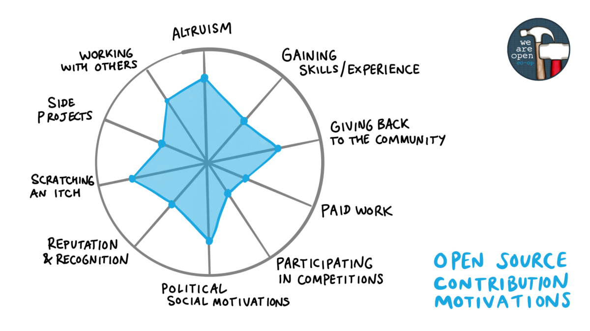
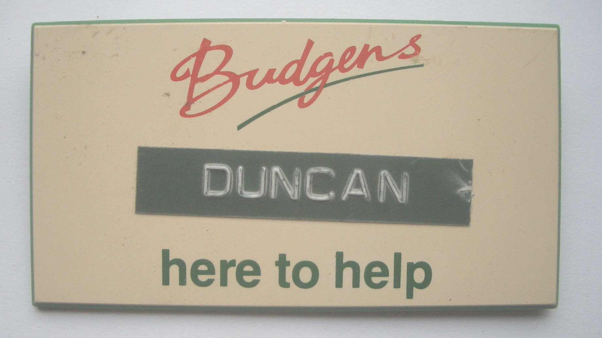

# Experiencing your future {#experiencing}

So, tell me, are you experienced? Why is experience valuable and what kind of experience are employers looking for anyway? How can you get some more experience? 🤔

```{r 404-fig, echo = FALSE, fig.align = "center", out.width = "100%", fig.cap = "(ref:caption404)"}
knitr::include_graphics("images/404.png")
```

(ref:caption404) Do you respond with a sheepish `experience not found` error message when people ask about your experience? Is your experience like the [classic page not found](https://en.wikipedia.org/wiki/HTTP_404) `HTTP 404`? The client sent you a valid request for your experience, but your server couldn't find it. Awkward. Embarrassing silence? 😳 Don't worry, there are some simple and easy ways to build your experience so that instead of negative 404's, you can respond with a cheerfully positive `200 (OK)`, as described in this [list of HTTP status codes](https://en.wikipedia.org/wiki/List_of_HTTP_status_codes). We'll look at some of them in this chapter. Experience not found sketch by [Visual Thinkery](https://visualthinkery.com/) is licensed under [CC-BY-ND](https://creativecommons.org/licenses/by-nd/4.0/)

## What you will learn {#ilo5}

By the end of this chapter you will be able to

* Describe why having experience can improve your chances of getting interviews
* Identify what counts as experience and why it's valuable
* Recognise opportunities to get more experience before you graduate

<!-- for quizzes see the learnr package
https://rstudio.github.io/learnr/
quiz
 -->

<!--
## internships and placements: Pros  

1. Extended interview
1. Eliminate

## Debug your experience

## internships and placements: Cons  

1. Difficult to get back into study
1. Takes longer to get your degree-->


```{r relevance-fig, echo = FALSE, fig.align = "center", out.width = "100%", fig.cap = "(ref:captionrelevantexp)"}
knitr::include_graphics("images/What's relevant.png")
```

(ref:captionrelevantexp) You might be surprised by which of your experiences are relevant, and what kinds of experience are relevant on your CV. What's relevant sketch by [Visual Thinkery](https://visualthinkery.com/) is licensed under [CC-BY-ND](https://creativecommons.org/licenses/by-nd/4.0/)

## Why is experience so valuable?

It's common for students to be focused on their grades, whether those grades are low, middling or or high. At the extremes, if you have got lower grades than you'd like, you might be anxious or unhappy about them. If you've got higher grades, you're probably focussed on keeping them high. Either way, you are *much more* than your grades, because your education is only a part of who you are, shown in in figure \@ref(fig:not-just-grades-fig). You are the sum total of your experiences, this is one of the reasons that experience is so valuable.

```{r not-just-grades-fig, echo = FALSE, fig.align = "center", out.width = "100%", fig.cap = "(ref:captiongrades)"}
knitr::include_graphics("images/i-am-more-than-just-my-grades.png")
```

(ref:captiongrades) Whatever kind of grades you're currently getting, there is a lot more about your character that employers care about. Your experience tells a story about who you are, not just paid work, but any voluntary work and projects you've been involved in too. [I am more than just my grades](https://bryanmmathers.com/i-am-more-than-just-my-grades/) sketch by [Visual Thinkery](https://visualthinkery.com/) is licensed under [CC-BY-ND](https://creativecommons.org/licenses/by-nd/4.0/)


## Are you experienced? {#areuexperienced}

So what counts as experience? In its broadest sense (paid and voluntary) experience includes:

* Insight programmes and spring weeks: work shadowing
* Part-time jobs: casual or part-time work
* Getting involved in open source software, section \@ref(opensource)
* Summer internships or year-long placements
* Being self-employed, working as a freelancer or starting a small business
* Voluntary work, both technical and non-technical

<!--* Competitions: participating in competitions and hackathons will make your CV stand out-->

### Big name experience {#bignames}

It's probably easier than you might think to get a [big tech](https://en.wikipedia.org/wiki/Big_Tech) or big employer name on your CV. For example, many large employers run [insight days, vacation schemes and spring weeks ](https://www.ratemyplacement.co.uk/insights). These are often aimed at first year undergraduates, and are sometimes less competitive to get into than a longer term commitment such as a summer internship, year-long placement or even graduate job. A big name on your CV early in your degree can help it stand out later, as fluff bucket the grinning [cheshire cat](https://en.wikipedia.org/wiki/Cheshire_Cat) demonstrates on their CV shown in figure \@ref(fig:bigname-fig). 😻

```{r bigname-fig, echo = FALSE, fig.align = "center", out.width = "100%", fig.cap = "(ref:captionbigname)"}
knitr::include_graphics("images/Big Name.png")
```
(ref:captionbigname) It's easier than you  might think to get a big name on your CV, sometimes these can help your application stand out from the competition. Big name sketch by [Visual Thinkery](https://visualthinkery.com) is licensed under [CC-BY-ND](https://creativecommons.org/licenses/by-nd/4.0/)

Other ways to get a big name on your CV include joining a big name competition or event, for example:

* Amazon hosts the Alexa challenge, see [developer.amazon.com/alexaprize](https://developer.amazon.com/alexaprize/challenges/current-challenge/rules) and the AWS Educate Challenge [aws.amazon.com/education/awseducate/university-challenge](https://aws.amazon.com/education/awseducate/university-challenge/)
* Apple hosts the Swift Student Challenge [developer.apple.com/wwdc21/swift-student-challenge](https://developer.apple.com/wwdc21/swift-student-challenge/)
* Facebook has hackathons, see [facebook.com/hackathon](https://en-gb.facebook.com/hackathon) and [developers.facebook.com](https://developers.facebook.com/)
* Google hosts several events including:
    + Code Jam, HashCode and Kick Start [codingcompetitions.withgoogle.com](https://codingcompetitions.withgoogle.com/)
    + Summer of Code [summerofcode.withgoogle.com](https://summerofcode.withgoogle.com/) [@gsoc]
    + Developer Student Club Leads [developers.google.com/community/dsc/leads](https://developers.google.com/community/dsc/leads)
    + Inside Look [buildyourfuture.withgoogle.com/programs/inside-look](https://buildyourfuture.withgoogle.com/programs/inside-look/)
* IBM hosts the annual Call for Code [developer.ibm.com/callforcode](https://developer.ibm.com/callforcode) unlike other competitions, these have a [corporate social responsibility](https://en.wikipedia.org/wiki/Corporate_social_responsibility) (CSR) themes for the benefit of society at large
* Microsoft hosts the Imagine Cup [imaginecup.microsoft.com](https://imaginecup.microsoft.com/)
* There are many other big employers that sponsor competitions, you can find them listed at [devpost.com](https://devpost.com), Major League Hacking [mlh.io](https://mlh.io/) and Hacker Earth [hackerearth.com](https://www.hackerearth.com/) etc

Big names can look good on your CV, but they are not the only way to make your CV stand out.

### Small name experience {#smallnames}

Any experience will help your CV stand out. Smaller employers have the advantage that they tend to be less picky than big names so it is often easier to get a foot in the door. It might not be what you see yourself doing for long, but the experience gained in a small company can be invaluable.

### Open source experience {#opensource}
Open source software projects are a great way to get some solid experience of software engineering. There's two ways to get started:

1. Raise a new issue via the project's issue tracker, such as [github issues](https://guides.github.com/features/issues/) [@githubissues]
1. [Fix a bug](https://dev.to/rose/fixing-a-bug-on-my-open-source-project-from-start-to-finish-1749) by picking existing issues. [@fixabug] It might sound trivial, but fixing a bug demonstrates that you can collaborate with others, understand the architecture and toolchain being used (which might be complex) and solve problems. See [firstcontributions.github.io](https://firstcontributions.github.io/) and the `<good first issue>` tag which helps new contributors identify starting points, see [goodfirstissue.dev](https://goodfirstissue.dev/) for some aggregated examples.

There are lots of different motivations for getting involved in open source, shown in figure \@ref(fig:opensource-fig). Whatever your motivation, contributing to open source software is fun, you'll learn heaps and it will look *great* on your CV. Open source software is widely used by, so contributing is a great way to get some real world experience of software development. Many open source projects are funded by employers both large and small, and you can get paid to develop open source software through projects like Google's Summer of Code. [@gsoc]

```{r opensource-fig, echo = FALSE, fig.align = "center", out.width = "100%", fig.cap = "(ref:captionopensource)"}

```
(ref:captionopensource) There are lots of good reasons for getting involved in open source software, gaining skills and experience of real software engineering in the wild is just one of them. [Open Source Motivations](https://bryanmmathers.com/open-source-motivations) by [Visual Thinkery](https://visualthinkery.com) is licensed under [CC-BY-ND](https://creativecommons.org/licenses/by-nd/4.0/)

### Voluntary experience {#volunteering}

Experience as a section of your CV usually means *paid* work. However, experience in the context of this chapter means anything where you can show you've been part of a bigger team, taken responsibility for something or tried to make the world a better place somehow. These include:

* Volunteering: Doing voluntary work is a good way to pick up new skills
* Being involved in societies: e.g. taking responsibility for things in a society
* Getting involved in a community, either physical or online


### Casual experience {#casual}
You may already have experience of paid employment as a casual or part-time worker. This could include jobs such as waiting tables, serving in a bar or working in other areas of hospitality or retail, for example as a Saturday job.

```{r paperboy-fig, echo = FALSE, fig.align = "center", out.width = "99%", fig.cap = "(ref:captionpaperboy)"}
knitr::include_graphics("images/Titanic-paperboy-crop.jpeg")
```
(ref:captionpaperboy) Casual and part-time work tell an important story about you on your CV. For example, from the age of 11, I was a paperboy, delivering newspapers door to door to paying customers. This demonstrates reliability and work ethic, because I did this in all weathers (sun, wind, rain, snow, hangovers etc) for seven years, man and boy! If you have casual experience, don't forget to include it in your CV. Public domain image of the Titanic paperboy, Ned Parfett selling newspapers in London via Wikimedia Commons at [w.wiki/35HA](https://w.wiki/35HA)

It is important to recognise that these jobs have value. Many students make the mistake of overlooking their casual work experience because they disregard it as non-technical or consider it “low-skilled”. In the section \@ref(mycvst) we saw that one of the stories you want to tell in your job applications is that you:

1. take responsibility
1. achieve things
1. are nice to have around

Doing casual work can demonstrate all of these things. For example, from the ages of 12 to 18 I was a [paperboy](https://en.wikipedia.org/wiki/Paperboy), except unlike the one selling newspapers in the street in figure \@ref(fig:paperboy-fig), I delivered newspapers directly to the doors of paying customers every morning. This was not a particularly highly skilled job, but it *does* demonstrate:

1. [work ethic](https://en.wikipedia.org/wiki/Work_ethic): getting up early *every* morning (including Saturdays). Sometimes work is about just turning up everyday!
1. taking responsibility and being reliable
1. understanding the value of money by earning a wage

I've often spoken to students who neglect to tell me about their paid work in retail or hospitality. “But it's not technical” they say, “it's low skilled and irrelevant”. However, serving customers demonstrates your ability to provide good customer service and work as part of a team, often under pressure, see figure \@ref(fig:budgens-fig). This is good evidence of the “nice to have around” bit that Jonathan Black refers to [@topnotchcv] and is something your formal education will not typically provide any evidence of. So don't fall into the trap of discounting the value of casual or part-time labour.

```{r budgens-fig, echo = FALSE, fig.align = "center", out.width = "100%", fig.cap = "(ref:captionbudgens)"}

```
(ref:captionbudgens) Early in your career, casual work in hospitality or retail, such as a supermarket like [Budgens](https://en.wikipedia.org/wiki/Budgens) where I used to work as a teenager, is worth mentioning on your CV. If you have any experience of this kind, make sure you mention it and describe the skills you developed. Think carefully about the verbs can you use to describe casual experience, see chapter \@ref(actioning).

<!-- BUDGENS -->
<!--


## Excuses, excuses   {#excuses}

When I tell students this, I'm often given an excuses some of which are given below.


### I missed the deadline  {#deadlines}

Stuff

### I'm busy waiting  {#busywaiting}


```{r justme-fig, echo = FALSE, fig.align = "center", out.width = "100%", fig.cap = "(ref:justme)"}
knitr::include_graphics("images/is-it-just-me.png")
```
(ref:justme) The biggest waste of time is the time spent being busy waiting, and not making a start. Starting a career by getting some experience can be a daunting project, but don't allow yourself to be held captive by irrational worries about the job market. Once you start a daunting project, you will begin to see it for what it is. The ideas will come and and you won't need to fear it anymore, you may even start to enjoy the process of figuring out what your career options you are most interested in. [New Project? Every time...](https://bryanmmathers.com/new-project-every-time/) sketch by [Visual Thinkery](https://visualthinkery.com) is licensed under [CC-BY-ND](https://creativecommons.org/licenses/by-nd/4.0/)


### I don't know what I want to do  {#noclue}  

I don't know what I want to do

### I don't have any experience  

Stuff


### I do not have the grades  

Whatever you are studying, its easy to fall into a trap of thinking that your grades aren't good enough. While there are some employers who really care about your grades, there are plenty who don't. These employers are more interested in what you're like as a person, so any projects, experience or other activities you've done that demonstrate will help you stand out against rival candidates with better grades.


### I am too busy  

Stuff


### I keep getting rejected  

Stuff


### I am overwhelmed by the choices  

Stuff


### It is too competitive  

Stuff


### All my friends have found jobs already  

```{r grades-fig, echo = FALSE, fig.align = "center", out.width = "80%", fig.cap = "(ref:captionnotverygood)"}
knitr::include_graphics("images/not-very-good-at-this.png")
```

(ref:captionnotverygood) Do you have the grades? Not all employers care about your academic grades because they're only a small part of what you have to offer as an employee. [Academic failures – got any previous?](https://bryanmmathers.com/academic-failures/) by [Visual Thinkery](https://visualthinkery.com) is licenced under [CC-BY-ND](https://creativecommons.org/licenses/by-nd/4.0/)

What have you done


### I didn't get my dream job  

didn't get graduate scheme (look at graduate jobs), missed my dream job at CERN, Google, Facebook etc.


-->

<!--

are you experienced panellists


What was good about your placement?
What could be better about your placement ?
What advice would you give to second years looking for placements?
What was your job search strategy?
How do you cope with rejection?
How did you balance job hunting with second year coursework and exams?
What the the pros/cons of big vs small employers for placements

-->


## Summarising your experience {#tldr5}


[Too long, didn't read](https://en.wiktionary.org/wiki/too_long;_didn%27t_read) (TL;DR)? Here's a summary:

This chapter is under construction because I'm using agile book development methods, see figure \@ref(fig:deathstar2-fig).

```{r deathstar2-fig, echo = FALSE, fig.align = "center", out.width = "99%", fig.cap = "(ref:captiondeathstar)"}
knitr::include_graphics("images/DeathStar2.jpg")
```
