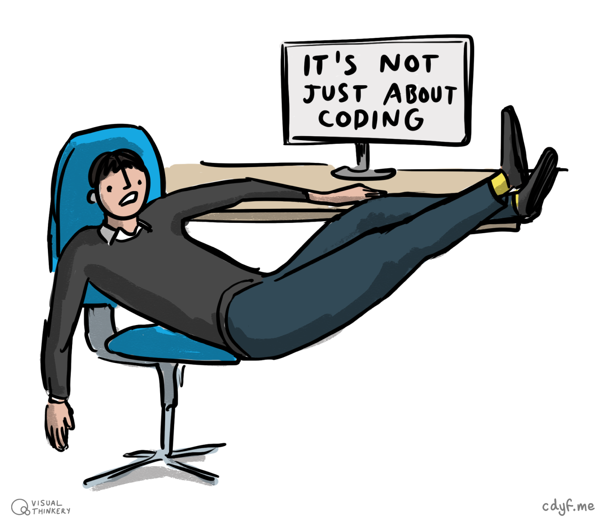
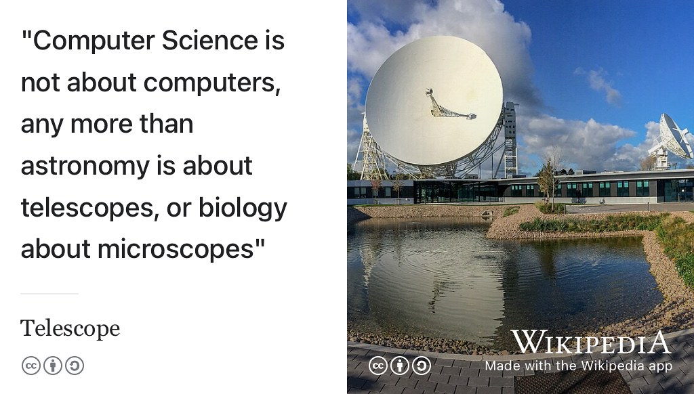
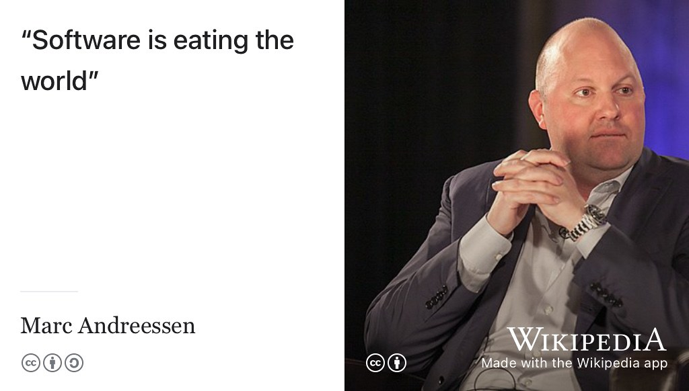
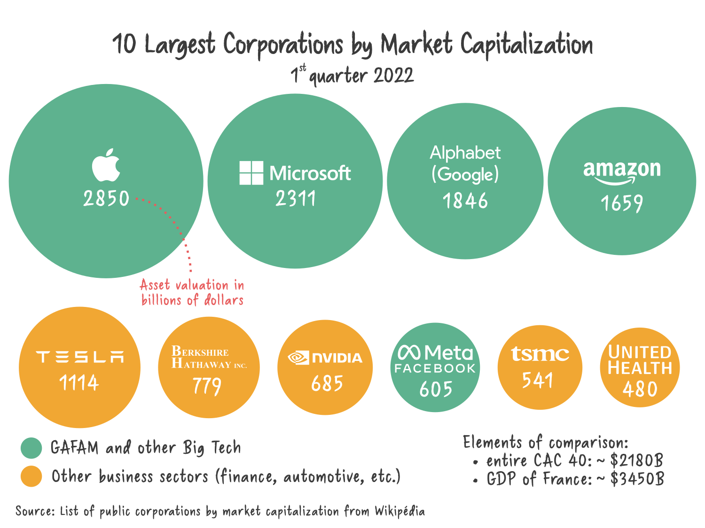
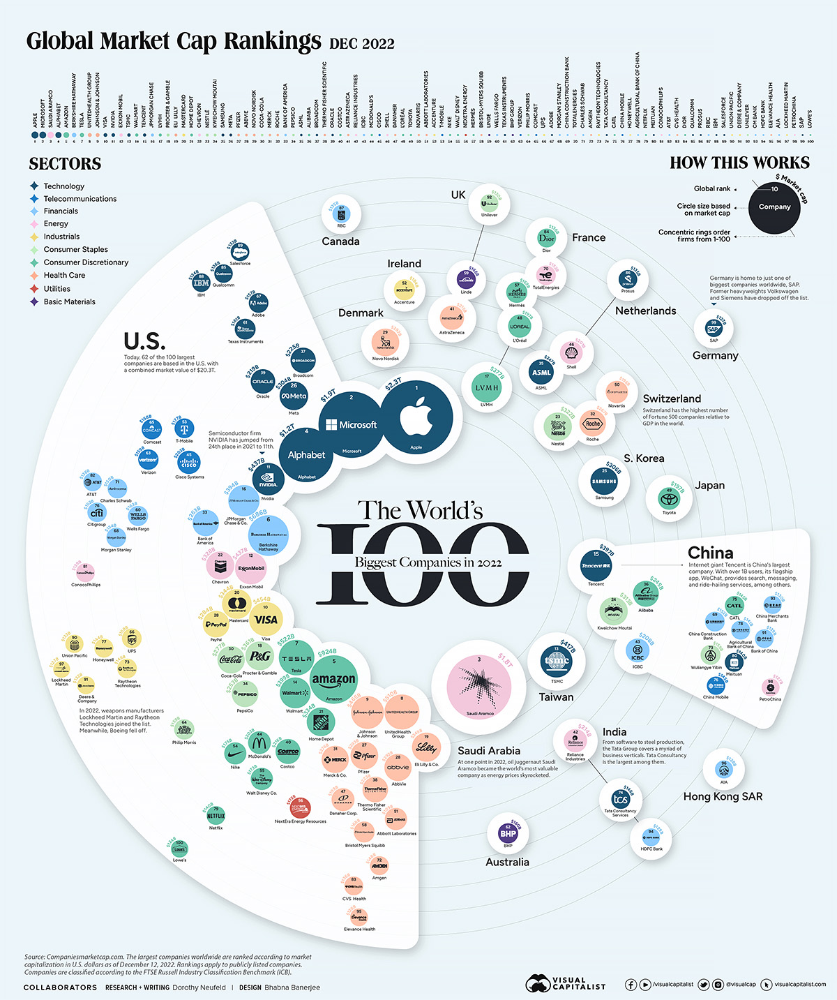
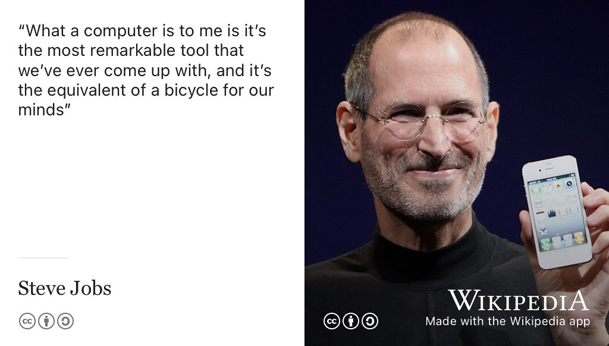

# Computing Your Future {#computing}

It's difficult to think of any aspect of our lives that hasn't been changed by the invention of the digital programmable computer, just 74 short years ago. [@lavington] Consequently, computing is a crucial skill in a wide range of careers across every sector of business and society. You don't have to have studied Computer Science at University to take advantage of all the exciting opportunities provided by computing. This chapter looks at why computing is a subject for everyone. If you're studying computing, this chapter isn't aimed at you, unless you are struggling to stay motivated with your subject! 👨🏿‍💻👨‍💻👩🏽‍💻👩‍💻👨🏿‍💻

```{r not-coding-fig, echo = FALSE, fig.align = "center", out.width = "100%", fig.cap = "(ref:captionnotcoding)"}

```
(ref:captionnotcoding) Computing is much more than coding, this chapter looks at what computing can do for your future. CV work sketch by [Visual Thinkery](https://visualthinkery.com) is licensed under [CC-BY-ND](https://creativecommons.org/licenses/by-nd/4.0/)

Your future is bright, your future needs computing, so let's start computing your future.

## What you will learn {#ilo6}
Reading this chapter and doing the activities will help you to:

1. Identify where you can get started with computing, if you're not studying computer science as a major part of your degree
1. Discuss the role of computing in society for everyone, not just those studying it at University
1. Describe why NOT studying computer science doesn't necessarily “lock you out” of computing as a career

<!--* Describe why computing is a stimulating and challenging subject to study in its own right
* Identify creative opportunities in computing, whatever your background-->


But why should everyone be studying computing? There are social and economic arguments:

## Computing is for everybody {#creative}

At school, everyone learns to read, write and do maths. These are sometimes known as [the three Rs](https://en.wikipedia.org/wiki/The_three_Rs) but:

* Why did you learn to read and write? Was it so that you could become a professional writer?
* Why did you study mathematics? Was it so that you could become a professional mathematician?

Of course not, that would be ludicrous! You learned to read and write because they are fundamental tools for expressing yourself and communicating with other people. You studied maths so that you could develop numeracy, reason about the world around you, analyse data and solve problems.

So why should everyone learn about computing? Is it so that everyone can become software engineers? Again, this is patently ludicrous.

Everyone should study computing for the same reasons everyone studies maths and english at school. Like writing, computing is one of the most creative tools for expression and communication that we have today. Just like mathematics, studying computing will also help you to solve important problems too. Sam Aaron, creator of [Sonic Pi](https://en.wikipedia.org/wiki/Sonic_Pi), puts exactly this case for creative computing in his TEDx talk [@youtube-sonicpi] shown in figure \@ref(fig:sonicpi-vid).

```{r sonicpi-vid, echo = FALSE, fig.align = "center", out.width = "100%", fig.cap = "(ref:captionsonicpi)"}
knitr::include_url('https://www.youtube.com/embed/0lTZ8Tuyu5I')
```

(ref:captionsonicpi) Sam Aaron puts the creative case for computing by discussing programming as performance in his TEDx talk. You can watch the watch the 18 minute video embedded in this figure at [youtu.be/0lTZ8Tuyu5I](https://youtu.be/0lTZ8Tuyu5I). [@youtube-sonicpi]

Computing is also an intellectually stimulating and challenging subject to study in its own right. If you don't believe me, I'm not going to make the case here. If you are a humanities student, have a look at Silvio Peroni's free computational thinking and programming textbook at [comp-think.github.io](https://comp-think.github.io/). [@peroni] If you like doing [Massive Open Online Courses](https://en.wikipedia.org/wiki/Massive_open_online_course) (MOOCs), you might also enjoy and benefit from:

* [CS50](https://en.wikipedia.org/wiki/CS50) with [David Malan](https://en.wikipedia.org/wiki/David_J._Malan) shown in figure \@ref(fig:malan-vid) 
* online training courses provided by Microsoft, Amazon and Google described in section \@ref(otherbadges)

```{r malan-vid, echo = FALSE, fig.align = "center", out.width = "100%", fig.cap = "(ref:captionmalan)"}
knitr::include_url('https://www.youtube.com/embed/3oFAJtFE8YU')
```

(ref:captionmalan) [David Malan](https://en.wikipedia.org/wiki/David_J._Malan) on CS50, Harvard University's introduction to the intellectual enterprises of computer science and the art of programming. You can also watch the watch the full 2 minute introduction video embedded in this figure at [youtu.be/3oFAJtFE8YU](https://youtu.be/3oFAJtFE8YU). [@youtube-malan; @cs50]

So computing is for everyone, not just those with scientific, technological or engineering interests. What's it actually all about. 

## Computer Science isn't about computers {#about}

The name *Computer Science* is a bit of a misnomer because Computer Science isn't...

* ...a science. Anything that calls itself a science probably isn't. [@notascience]
* ...about computers, see figure \@ref(fig:dijkstra-fig).

Computer Science isn't a [natural science](https://en.wikipedia.org/wiki/Natural_science) like the ones you'll be familiar with. According to [Peter Denning](https://en.wikipedia.org/wiki/Peter_J._Denning), Computer science meets every criterion for being a science, but it has a self-inflicted credibility problem. [@denning] In practice, Computer Science turns out to be blend of science, engineering and art^[perhaps *craft* might be a better word?], see figure \@ref(fig:ometer-fig).

```{r dijkstra-fig, echo = FALSE, fig.align = "center", out.width = "100%", fig.cap = "(ref:captiondijkstra)"}

```

(ref:captiondijkstra) *“Computer science is no more about computers than astronomy is about telescopes. Biology is not about microscopes, and computer science is not about computers. Computer science is a terrible name. Astronomy is not called `telescope science`, and biology is not called `microscope science`”* —Anon. This quote is often attributed to [Edsger Dijkstra](https://en.wikipedia.org/wiki/Edsger_W._Dijkstra) though it is debateable who first coined this phrase. [@dijkstra] CC [BY-SA](https://creativecommons.org/licenses/by-sa/4.0/deed.en) image of a radio telescope at [Jodrell Bank Observatory](https://en.wikipedia.org/wiki/Jodrell_Bank_Observatory), headquarters of the [Square Kilometre Array](https://en.wikipedia.org/wiki/Square_Kilometre_Array) by [Mike Peel](https://www.mikepeel.net/) on Wikimedia Commons [w.wiki/3Lyf](https://w.wiki/3Lyf) adapted using the [Wikipedia App](https://apps.apple.com/us/app/wikipedia/id324715238) 🔭


So throw away whatever misconceptions you may have had about computing. There might be more in it for you than you previously thought. Whatever you think about computer scientists, there's no doubt that software, and whatever computers it runs on, is likely to have an ever increasing importance in your life.

## Software is eating your future {#seating}

Whatever future world you enter into after you graduate, there's a good chance it has already been eaten by software. In 2011, the software engineer and billionaire investor [Marc Andreesen](https://en.wikipedia.org/wiki/Marc_Andreessen) outlined why (in his opinion, figure \@ref(fig:eating-fig)) software is eating the world, in *The Wall Street Journal* [@eatingtheworld].

```{r eating-fig, echo = FALSE, fig.align = "center", out.width = "100%", fig.cap = "(ref:captioneating)"}

```
(ref:captioneating) Whatever world you enter after you graduate, software has either eaten it, currently eating it or working out how to do so. Andreessen explains [why software is eating the world](https://a16z.com/2011/08/20/why-software-is-eating-the-world/) and your future with it. Portrait of [Marc Andreesen](https://en.wikipedia.org/wiki/Marc_Andreessen) by JD Lasica on Wikimedia Commons [w.wiki/3V48](https://w.wiki/3V48) adapted using the [Wikipedia app](https://apps.apple.com/gb/app/wikipedia/id324715238) 😋

Unfortunately, many people lack the digital skills required to take advantage of all the opportunities provided by software and computing. [Robert Sedgwick](https://en.wikipedia.org/wiki/Robert_Sedgewick_(computer_scientist)) at Princeton University has, like many others, argued that Computer Science should be a **required** topic of study for *all* undergraduate students in University. [@robertsedgwick] We're not there yet because computing is a subject that has historically been siloed in Computer Science Departments, but this is changing as we'll see in this chapter. It's not that everyone should jump ship to Computer Science, but that:

* Computing is too important to be left to Computer Scientists
* [Computing is too important to be left to men](https://www.bcs.org/articles-opinion-and-research/computings-too-important-to-be-left-to-men/) [@sparckjones]

Whatever subject you are currently studying, adding some computing to your education will empower you with the computational thinking skills you need to be an active producer, not just a passive consumer in modern society. Computing can open up new opportunities for you and improve your social mobility.

<!--
The gist of his argument is that Computer Science is too important to be left to Computer Scientists, because it influences every field of human endeavour.


see alsoTen Reasons to Study Computer Science  https://www.nccedu.com/ten-reasons-study-computer-science/

and what is computer science https://www.cs.york.ac.uk/undergraduate/what-is-cs/

## Too important for Computer Scientists
-->

## Computing is eating the world {#eating}
Besides the social arguments, there are also strong economic reasons for studying computing. It's not just software that's eating the world, but its combination with hardware that dominates the list of the world's largest corporations by [market capitalisation](https://en.wikipedia.org/wiki/Market_capitalization), shown in figure \@ref(fig:market-fig). What use is software without hardware?

```{r market-fig, echo = FALSE, fig.align = "center", out.width = "100%", fig.cap = "(ref:captionmarket)"}

```
(ref:captionmarket) If stock markets are anything to go by, computing is eating the world. It would be impossible for [Big Tech](https://en.wikipedia.org/wiki/Big_Tech) companies like Apple, Microsoft, Amazon, Alphabet (Google) and Meta (Facebook) to exist without computing. The ten largest corporations by market capitalisation (as of 2022) graphic by YBSLE/[laboussole.coop](https://laboussole.coop/) on Wikimedia Commons [w.wiki/3KEU](https://w.wiki/3KEU)

Even if you don't want to work for any of these global oligopolies, their success is good news for *all* students of computing because it shows how important computation is to society, both commercially and otherwise. Another visualisation of data in figure \@ref(fig:market-fig) is shown in figure \@ref(fig:market-again-fig).

```{r market-again-fig, echo = FALSE, fig.align = "center", out.width = "100%", fig.cap = "(ref:captionmarketagain)"}

```
(ref:captionmarketagain) The 100 Biggest Public Companies in the World based on their market capitalisation in 2022. Note the dominance of software and hardware: Apple, Microsoft, Alphabet (that's Google), Facebook and Amazon. Visualisation by Bhabna Banerjee and Dorothy Neufeld at the [visualcapitalist.com](https://www.visualcapitalist.com/), including a [higher resolution image](https://www.visualcapitalist.com/wp-content/uploads/2022/12/worlds-biggest-public-companies-2022-BIG.html) [@neufeld] You can also see the same data in tabular form at [financecharts.com/screener/biggest](https://www.financecharts.com/screener/biggest)

During 2022 and 2023, there were significant redundancies at [Big Tech](https://en.wikipedia.org/wiki/Big_Tech) employers, see [layoffs.fyi](https://layoffs.fyi/) for examples. [@downturn] Despite this, there's still plenty of room for optimisim because what figure \@ref(fig:market-fig) and figure \@ref(fig:market-again-fig) show is that computing is still eating the stock market, with and without AI. [@thornhill] This means while there will always be economic boom (and bust) commercial demand for software developers is often high, comparable to teaching and nursing in terms of raw numbers. In the UK, the most common jobs for graduates from 2019 are shown in figure \@ref(fig:nurses-fig), based on data taken from an [update on the graduate labour market in 2023](https://luminate.prospects.ac.uk/graduate-labour-market-update-teaching-migration-and-neurodiversity) [@labourmarket2023]

<!-- from wonkyball data used to be
  ~profession,        ~graduates,
  "A nurses",           9800,
  "B marketing",        4575,
  "C nursery & primary teachers",       4295,
  "D software developers", 4160
  meaning software engineers overtook primary teachers in numbers in 2022
-->

```{r nurses-fig, echo = FALSE, fig.align = "center", out.width = "100%", fig.cap = "(ref:captionball)"}
library(ggplot2)
nursesdata <- tribble(
  ~profession,        ~graduates,
  "1. Nurses",	7195,
  "2. Software developers",	3980,
  "3. Marketing associates",	3720,
  "4. Primary school teachers",	3325,
  "5. General medical practitioners",	3115,
  "6. Secondary school teachers",	2960,
  "7. Accountants",	2430	,
  "8. Financiers and investors",	1695,
  "9. Graphic and multimedia designers",	1530,
  "10. Human resources",	1460


)

ggplot(data = nursesdata) +
  geom_bar(mapping = aes(x = reorder(profession, +graduates), y = graduates), stat="identity") +  coord_flip()
```


<!--todo: better labels
https://github.com/dullhunk/cdyf/issues/121
and
https://stackoverflow.com/questions/45820250/highlight-a-single-bar-in-ggplot
-->

<!--reorder by value
Sorting the x-axis in bargraphs using ggplot2
https://sebastiansauer.github.io/ordering-bars/

Reorder bars in geom_bar ggplot2 by value
https://stackoverflow.com/questions/25664007/reorder-bars-in-geom-bar-ggplot2-by-value
-->

(ref:captionball) The top ten professions in the UK based on numbers of graduates starting work in 2020, shown on the x axis. In 2020, 3980 graduates started jobs in the UK as programmers and software development professionals, with many vacancies unfilled. So, demand for software developers is high, comparable to teachers, nurses and medical professionals, according to data published by prospects.ac.uk [@labourmarket2023]

So if you can develop software, there's lots of choice and opportunities on offer. Although the data in figure \@ref(fig:nurses-fig) is from the UK, the story is the same in many other countries around the world.

Demand for developers is high, with many job vacancies going unfilled.

## Passive consumer or active producer? {#passive}
All this choice is a great thing but what sort of role do you want computing to play in your career? You can either be a passive consumer of computing or you can be an active producer, shaping the world of computing to get want you want from it, rather than what it wants from you. Going back to Andreesen's eating analogy in section \@ref(seating), sometimes the choice is to

* Be an *eater* or be *eaten*
* If you're not at the table, you're on the menu. [@tablemenu; @proverbs]

To use a gaming analogy, you either a *player* or you risk being *played*.

## Play your joker: Computational joker {#joker}
Because of its social and economic importance, computing also gives you flexible career options. If academic disciplines are [playing card suits](https://en.wikipedia.org/wiki/Playing_card_suit), then Computer Science is the [joker in the pack](https://en.wikipedia.org/wiki/Joker_(playing_card)) shown in figure \@ref(fig:joker-fig). A versatile card, the computational joker can be played with (and without) *any* of the traditional four suits: diamonds, clubs, hearts and spades. That's because computing is a science *and* an art. It allows us to study human society and culture, so it's part of the [humanities](https://en.wikipedia.org/wiki/Humanities) too (see [digital humanities](https://en.wikipedia.org/wiki/Digital_humanities) and [computational social science](https://en.wikipedia.org/wiki/Computational_social_science) for example). Last but not least, computing is also an engineering discipline and a branch of mathematics too. What all this means is that the computational joker is a [wild card](https://en.wikipedia.org/wiki/Wild_card_(cards)) that can be played *whenever and wherever* you like, making it an incredibly powerful but dangerous card, depending on the game you are playing (see chapter \@ref(choosing)). ♣♥♠♦

```{r joker-fig, echo = FALSE, fig.align = "center", out.width = "100%", fig.cap = "(ref:captionjoker)"}

```
(ref:captionjoker) If academic disciplines are playing card suits then Computer Science is the joker in the pack. Just like computing, the joker can be an extremely beneficial card, or an extremely harmful one. Public domain image of the Jolly Joker, a vintage Masenghini Italian playing card via Wikimedia Commons [w.wiki/35EW](https://w.wiki/35EW) adapted from the [joker playing card](https://en.wikipedia.org/wiki/Joker_(playing_card)) using the [Wikipedia app](https://apps.apple.com/gb/app/wikipedia/id324715238). 🃏

The flexibility of computing as a career means you have a broad range of options on where you can apply your computational skills. You don't *have* to be studying Computer Science to take advantage of these opportunities, but it helps.

<!-- needs breakpoints-->

<!--
“You can basically almost work anywhere. You
can work for these corporate business, Microsoft,
Google. You can work for the government, CIA,
FBI. You can work as a computer analysis; you
can work for the police department . . . You can
build programs for them. You could work in their
database and organize their files. You can analyze various things

[@Hewner2013]

-->

<!-- reading list
computer science starters: Code: The Hidden Language of Computer Hardware and Software https://www.amazon.co.uk/dp/0735611319-->


<!-- see CS50

CS50 2020 - Lecture 0 - Computational Thinking, Scratch
https://www.youtube.com/watch?v=Tpl7k8IOT6E

see
https://cs50.harvard.edu/x/2020/

CS50 2019 - Lecture 0 - Computational Thinking, Scratch
https://www.youtube.com/watch?v=jjqgP9dpD1k

-->

<!--
* Not about computers than astronomy about telescopes dijstra
* Computing is a humanity
* Computational social science  @Connolly2020
* Computing is an art
* Computing contributions to science, Some convincing and unconvincing examples at @Perkel2021
* Computing is a biomedical science
* Computing in chemistry
* Computing is a physical science  
* simon peyton jones https://www.youtube.com/watch?v=X-AIbtus9gs= -->


<!--
some good rationales bulleted below via
https://academicworks.cuny.edu/gc_pubs/562/

* Computing provides people with the ability to express themselves creatively and have voice
*  The process of tinkering and making can lead to wonder, discovery and enjoyment
* Creating new technologies like apps, websites or robots is fun!
* Computing provides youth with the ability to explore their identities.
* Computing provides many career opportunities to choose from.
* Practices from CS might enhance student learning of traditional academic disciplines.
* You mobilize computing tools and data to better participate in political and civic life, giving you a sense of empowerment
* Programming can be a tool for creative self expression.
*  to better yourself https://computinged.wordpress.com/2020/06/17/why-do-students-study-computing-especially-programming/
* Software is eating the job market
*  Software is eating science
*  makes the world a better place [@GroeBlting2019]
* got us to the moon [@4thastronaut]-->


## Summarising Your Future {#tldr6}

[Too long, didn't read](https://en.wiktionary.org/wiki/too_long;_didn%27t_read) (TL;DR)? Here's a summary:

Your future is bright, your future needs computing. There are lots of opportunities in computing but you don't *need* to have studied Computer Science at University to take advantage of them. <!--Computing your future will help you design your future. Designing your future will help you to start coding you future. -->

Apple co-founder [Steve Jobs](https://en.wikipedia.org/wiki/Steve_Jobs) likened the computer to a “*bicycle for our minds*”, see figure \@ref(fig:stevejobs-fig). Just as cycling is a tool we've invented that makes our movement more efficient, so too computing is a tool which enables us to do some cognitive tasks more efficiently. Both computers and cycles enable us to travel further and more quickly than we could do otherwise. However:

* You don't need a *degree* in cycling to make a *career* in cycling 

... and therefore by analogy: 

* You don't need a *degree* in computing to make a *career* in computing 

While studying computing at University will help you ride the computational bike better, it's not a prerequisite for riding in the first place. Steve Jobs bike can be ridden by anyone keen enough to jump on their proverbial bike and keep pedalling.

```{r stevejobs-fig, echo = FALSE, fig.align = "center", out.width = "99%", fig.cap = "(ref:captionstevejobs)"}

```

(ref:captionstevejobs) “I think one of the things that really separates us from the high primates is that we’re tool builders. I read a study that measured the efficiency of locomotion for various species on the planet. The condor used the least energy to move a kilometre. And, humans came in with a rather unimpressive showing, about a third of the way down the list. So, that didn’t look so good. But, then somebody at *Scientific American* [@scientificbicycle] had the insight to test the efficiency of locomotion for a man on a bicycle. And, a man on a bicycle, a human on a bicycle, blew the condor away, completely off the top of the charts. And that’s what a computer is to me. What a computer is to me is it’s the most remarkable tool that we’ve ever come up with, and it’s the equivalent of a bicycle for our minds.” —Steve Jobs [@stevejobs] Jobs is not talking about iPhones here, more about computing generally. CC [BY-SA](https://creativecommons.org/licenses/by-sa/3.0/deed.en) portrait of Steve Jobs unveiling the iPhone 4 at the 2010 [Worldwide Developers Conference](https://en.wikipedia.org/wiki/Worldwide_Developers_Conference) (WWDC) in San Francisco by [Matthew Yohe](https://en.wikipedia.org/wiki/User:Matt_Yohe) on Wikimedia Commmons [w.wiki/6in5](https://w.wiki/6in5) adapted using the [Wikipedia app](https://apps.apple.com/us/app/wikipedia/id324715238). 

In this chapter, we've looked at some resources that can help you get started with computing if Computer Science is neither a major or minor part of your degree. They are accessible and often designed for people with little or no background in computing or mathematics. Some of them are specifically aimed at students from a humanities background. Whatever your background, you'll need to be patient to learn the valuable skill of programming, according to [Peter Norvig](https://en.wikipedia.org/wiki/Peter_Norvig) and [Malcolm Gladwell](https://en.wikipedia.org/wiki/Malcolm_Gladwell) it takes at least ten years (or ten thousand hours) to learn how to do it well. [@tenyears;@outliers]

We hope you've enjoyed this computational diversion, in the next part, chapter \@ref(debugging): *Debugging your Future* we'll look at techniques for identifying and fixing bugs in your written applications so that you can maximise your chances of being invited to job interviews. 


<!--

## Google Summer of Code

see
https://developers.google.com/open-source/gsoc/help/student-advice

and also

look
advice via  Bujanca:

1. Read the entire GSoC site including materials
1. What computer science subject area or specific issue or problem interests you? What are your skills? What languages do you know? What tools are you familiar with?
1. Look through the list of organisations. There's a lot of them, it might be slightly overwhelming, but you'll need to narrow it down. Pick at most 5 of them. You won't have time to look at all of them in depth so follow your interests and gut feeling.
1. Visit the org's site and repos. Look at the code, look at feature requests, issues and bug reports

* Look at the past projects of those 5. It'll become clear that some of them are generally very competitive and usually take final year or masters students for their projects. Narrow it down to 3 organisations.

1. Start engaging with mentors and other students or the community around those 3 organisations. Again, it'll become clear which projects within each organisation are the most popular. Ask for advice. Read project descriptions and draft lists of questions.
1. By the time the student application period begins, you should know which organisation you are going for, even if you're not sure about the project yet.
1. As soon as you picked a project, start working on your proposal, and start asking for feedback early on. You don't have to have a finished proposal to ask for feedback, mentors are more often than not willing to guide you.
1. Your proposal has to highlight two things well: how your background and experience are relevant to the project, and your understanding of the project. The understanding of the project part is crucial: successful applicants usually have a draft timeline. Given that there are 12 weeks, you are expected to mention what you expect to be doing each week. Importantly, after each 4 weeks, you'll have a review / milestone. Make sure it's very clear what your milestones will be.
1. Optional: if you are proposing your own project rather than picking one proposed by the organisation, you'll need to convince the organisation that your idea brings them more value than what they've already proposed. This will require a good understanding of the scope of the organisation and isn't always easy.-->
