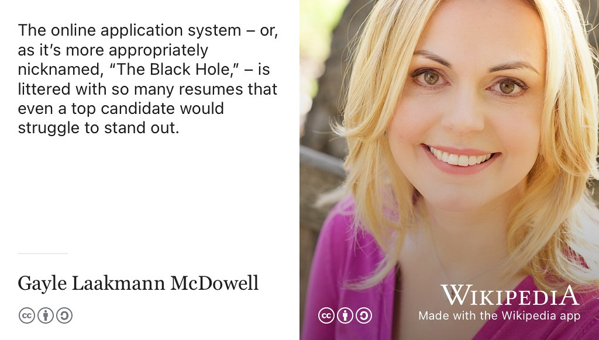
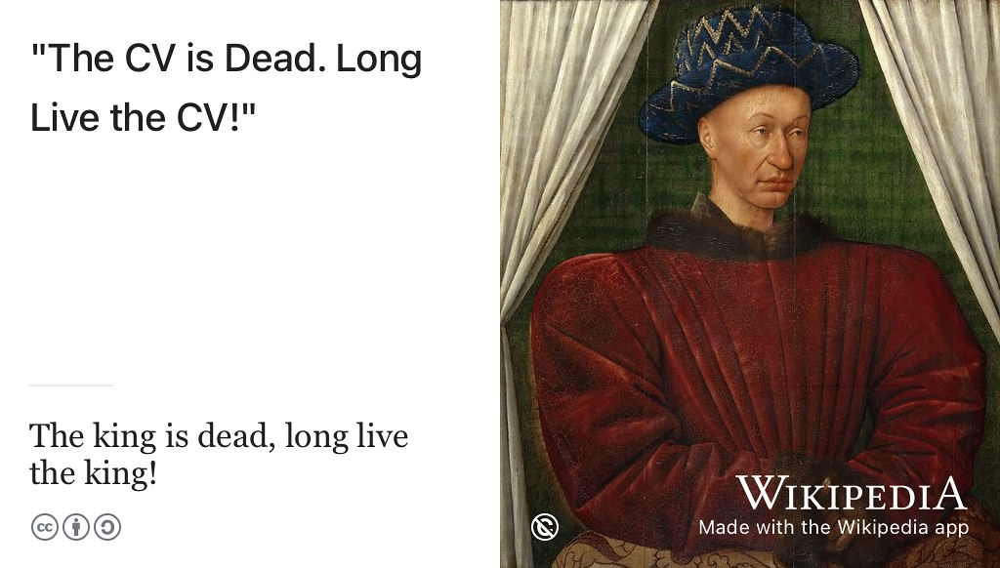
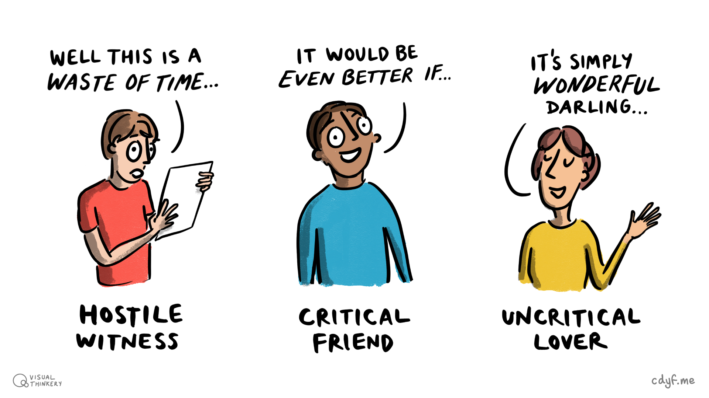

# (PART) BUILDING  {-}

# Debugging your future {#debugging}

It's all very well *designing* your future but now you need to actually engineer it by *building* and *testing*. An obvious place to start is with your CV, because that's where most people get going. How can you create a bug-free CV, résumé or completed application form? How can you support applications with a strong personal statement or covering letter? These documents are crucial part of your future so how can you debug them? 🐛


```{r bugfeature-fig, echo = FALSE, fig.align = "center", out.width = "100%", fig.cap = "(ref:captionbuggingcv)"}
knitr::include_graphics("images/Features not bugs.png")
```

(ref:captionbuggingcv) Is that a bug or a feature in your CV? To stand a chance of being invited to interview, you'll need to identify and fix any bugs in your written applications. If you don't, your application risks being sucked into a black hole and will never be seen again. Features not bugs picture by [Visual Thinkery](https://visualthinkery.com) is licensed under [CC-BY-ND](https://creativecommons.org/licenses/by-nd/4.0/)  


## What you will learn {#ilo7}  

By the end of this chapter you will be able to

* Structure and style the content of your CV and résumé appropriately
* Describe your story^[actually a collection of short stories] of your relevant experience, projects and education etc
* Identify and fix bugs in CV’s by:
    + Constructively criticising other people's CVs
    + Asking for, listening to, and acting on constructive criticism of your own CV
* Quantify and provide evidence for any claims you make you on your CV


## Beware of the black hole {#blackhole}  
Before we get started, let's consider some advice from software engineer [Gayle Laakmann McDowell](https://en.wikipedia.org/wiki/Gayle_Laakmann_McDowell). Gayle is an experienced software engineer who has worked at the [biggest technology employers in the world](https://en.wikipedia.org/wiki/Big_Tech), Apple, Microsoft and Google. She's also authored a cracking series of books on technology careers, particularly *Cracking the Coding Interview* [@cracking] which we'll discusses in chapter \@ref(speaking). Gayle refers to the employer “black hole” described in figure \@ref(fig:gayle-fig).

```{r gayle-fig, echo = FALSE, fig.show = "hold", fig.align = "center", out.width = "99%", fig.cap = "(ref:captiongayle)"}

```
(ref:captiongayle) Beware of what software engineer [Gayle Laakmaan McDowell](https://en.wikipedia.org/wiki/Gayle_Laakmann_McDowell) calls the employer “Black Hole”, especially if you're applying to large employers. “Getting through the doors, unfortunately, seems insurmountable. Hoards of candidates submit résumés each year, with only a small fraction getting an interview. The online application system – or, as it’s more appropriately nicknamed, *The Black Hole*, – is littered with so many résumés that even a top candidate would struggle to stand out.” [@blackhole; @techcareer] Laakmann portrait by Gayle Laakmaan is licensed CC BY 4.0 via Wikimedia Commons [w.wiki/wiu](https://w.wiki/wiu) adapted using the [Wikipedia app](https://apps.apple.com/us/app/wikipedia/id324715238) Thank you Gayle for permission to use your photo.

If you're applying to big employers, you'll need to create a CV that is good enough to stand out before it disappears over the [event horizon](https://en.wikipedia.org/wiki/Event_horizon) and into the employment black hole. It needs to be good enough to persuade an employer to invite you to an interview. You can start with an employer-agnostic CV but you may need to come back and revisit the issues in this chapter once you have identified some target employers, so that you can customise and tailor your CV and written applications.

## The CV is dead, long live the CV! {#dead}  
Résumés and CV's have reigned supreme in kingdom of employment and recruitment for many years but their demise has often been predicted, see figure \@ref(fig:longlive-fig).

```{r longlive-fig, echo = FALSE, fig.show = "hold", fig.align = "center", out.width = "99%", fig.cap = "(ref:captionlonglive)"}

```
(ref:captionlonglive) The seemingly contradictory phrase [the king is dead, long live the king](https://en.wikipedia.org/wiki/The_king_is_dead,_long_live_the_king!) simultaneously announces the death of the previous monarch and the accession of a new one. Likewise, the death of the CV (and résumé) has long been hailed but it keeps coming back to reign again. The CV is dead, long live the CV! The résumé is dead, long live the résumé! Public domain image of a painting of [Charles VII of France](https://en.wikipedia.org/wiki/Charles_VII_of_France) by Jean Fouquet on Wikimedia Commons [w.wiki/3e3K](https://w.wiki/3e3K) adapted using the [Wikipedia app](https://apps.apple.com/us/app/wikipedia/id324715238)

While it is true that some employers don't accept CVs or favour online application forms or digital profiles, it is still worth writing a CV because:

* Your CV provides a record for you of relevant things you've done
* Your CV enables you to get your story straight, *What's your story, coding glory?* see section \@ref(story) [@whatsthestory]
* Your CV forces you to articulate who you are and what you want, see chapter \@ref(knowing)
* Some employers will still ask you for one, see section \@ref(robotproof) and figure \@ref(fig:longlive-fig)
* Your CV helps you script and practice your “lines” for interviews, see chapter \@ref(speaking)

Even if an employer never asks you for your CV, you'll frequently want to use the *content* of your CV in applications and interviews. So this chapter looks at how you can debug your written applications, whatever the mechanism is for submitting them.

You can of course *augment* your CV with various public digital profiles such as LinkedIn, Github etc. A public digital profile can help employers find you, see section \@ref(generaljobs).

*Wherever* you're putting information about yourself for potential employers, on a CV, Résumé, LinkedIn profile the same principles apply. See the checklist in section \@ref(checklist) and for specific advice on LinkedIn see:

* [university.linkedin.com](https://university.linkedin.com/)
* [linkedin.com/learning/learning-linkedin-for-students](https://linkedin.com/learning/learning-linkedin-for-students)

## It's not bug, it's a feature! {#trope}

It's an age old trope in Computer Science that engineers use to cover their mistakes, passing off their accidental bugs as deliberate features of their work, see \@ref(fig:notabug-fig). It's not a *bug*, it's a *feature*...

```{r notabug-fig, echo = FALSE, fig.show = "hold", fig.align = "center", out.width = "99%", fig.cap = "(ref:captionnotabug)"}
knitr::include_graphics("images/notabug.jpeg")
```

(ref:captionnotabug) Do you have [software bugs](https://en.wikipedia.org/wiki/Software_bug) or [undocumented features](https://en.wikipedia.org/wiki/Undocumented_feature) on your CV or résumé? Although tolerated in software, bugs in your CV, résumé and written applications can be fatal. Picture of gold-dust weevil *[Hypomeces squamosus](https://en.wikipedia.org/wiki/Hypomeces_squamosus)* by [Basile Morin](https://commons.wikimedia.org/wiki/User:Basile_Morin) is licensed CC BY SA via Wikimedia Commons [w.wiki/3E62 ](https://w.wiki/3E62) adapted using the [Wikipedia app](https://apps.apple.com/us/app/wikipedia/id324715238)

Nobody likes buggy software, but unfortunately we routinely have to tolerate badly-designed, low quality, bug-ridden software in our everyday lives. [@badsoftware; @failware]

In contrast, buggy CVs are rarely tolerated, they will usually end up in the bin. Even a tiny defect, like an innocent typo, can be ~~fetal~~ fatal. Most employers (particularly large and well known ones) have to triage hundreds or even thousands of CV's for any given vacancy. This means they are looking for reasons to REJECT your CV, rather than ACCEPT it, because that's a sensible strategy for shortlisting from a huge pool of candidates for interview. A buggy CV, application and covering letter could ruin your chances of being invited to an interview, see chapter \@ref(speaking).

<!-- false positives and false negatives-->

<!--see e.g. https://community.rstudio.com/t/appending-a-pre-existing-pdf-to-a-new-created-by-r-markdown/45641

```{r cv-fig, fig.align="center", fig.cap="this is a caption", echo=FALSE}
knitr::include_graphics("images/rick-urshion.pdf")
```

doesn't work for some unknown reason


```{r marissa-fig, echo = FALSE, fig.align = "center", out.width = "100%", fig.cap = "this is a sample CV"}
knitr::include_graphics("images/marissa.png")
```
-->

Like writing software, the challenging part of writing a CV isn't the *creation* but in the *debugging*. Can you identify and fix the bugs before they are fatal?

<!--## Debug their CV {#bugfeature} It's difficult to be objective about your own CV.-->

::: {.rmdcaution}

(ref:codingcaution)

If you ask three people what they think of your CV, you will get three different and probably contradictory opinions. CV's are very subjective and very personal. The advice in this chapter is based on common sense, experience and ongoing conversations with employers. What makes a good CV will depend on the personal preferences and prejudices of your reader. So, this chapter just describes some general debugging guidelines, rather than rigid rules.

:::

While referring to this guide, remember that:

* The main purpose of your CV is to get an interview, not a job. Your CV should catch attention and provide talking points for an interview
* Your CV will be assessed in seconds, rather than minutes so brevity really is key
* Bullet points with verbs first (see section \@ref(verbsfirst)) will:
  + allow your reader to quickly scan your CV ([employers don't read CVs, they scan them](https://readabilityguidelines.co.uk/content-design/how-people-read/)) [@scanning]
  + highlight your key activities
  + avoid long sections of [prose](https://en.wikipedia.org/wiki/Prose) (which the reader will very probably skip anyway) you can use your beautiful prose on your covering letter, see section \@ref(we3qs)

You're not trying to tell your *whole* life story from section \@ref(story) but to distill the essentials into several short stories which can be summarised into a handful of bullets or sentences. It's a bit like the blurb or synopsis on the back of novel, can you entice the reader into wanting to find out more?

## Is it a bug or a feature? {#mycv}

Wherever criticism of your CV comes from, don't take it personally - it is probably one of the first you have written. Think of your current CV as an alpha or beta version that you continuously test, release and redeploy. There are many chances to debug and improve your CV during your study but before potential employers read it. The aim of this chapter is to help you improve your CV, whatever stage you are at. Employers often grumble that Computer Science graduates lack written communication skills. Written applications and CV's are a common example of this.

<!-- this repeats the checklist at the end and needs moving-->
1. **EDUCATION**: Is your year of graduation, degree program, University and expected (or achieved) degree classification clear? Have you mentioned things you are studying now, not just courses you have finished? See section \@ref(mycved)
1. **STYLE**: Does it look good, decent layout, appropriate use of LaTeX or Word or whatever? Are there any spelling mistakes, typos and grammar? Don't just rely on a spellchecker, some typos can only be ~~spitted~~ spotted by a human reader see section \@ref(spelling)
1. **LENGTH**: Does it fit comfortably on (ideally) one page (for a Résumé) or two pages (for a CV)? See section \@ref(length)
1. **STRUCTURE**: Is the structure sensible? Is it in reverse chronological order? Most important (usually recent) things first? Not too many sections or anything missing? See section \@ref(mycvst)
1. **VERBS FIRST**: Have you talked about what you have actually done using prominent `verbs`, rather than just what you think you know? Avoid long sections of prose, see section \@ref(verbsfirst)
1. **RESULTS**: Have you also demonstrated and *quantified* the outcomes of your actions where possible, see Context, Action, Result \& Evidence (CARE) in section \@ref(care)
1. **SEE ALSO**: This is just a quick checklist, see the longer CV checklist in section \@ref(checklist)

<!--Google Inside Look: Google students
iframe width="560" height="315" src="https://www.youtube.com/embed/dA3NX-Tpe4E" frameborder="0" allowfullscreen></iframe-->


## Structure your CV {#mycvst}

How you structure your CV will depend on who you are and what your story is. Recruiters at Google suggest four or five sections, that follow a header section. Before we look at those, lets look at some general points about CVs, watch the videos shown in Figure \@ref(fig:lopez-fig).

```{r lopez-fig, echo = FALSE, fig.align = "center", out.width = "99%", fig.cap = "(ref:captiongooglerecruiters)"}
knitr::include_graphics("images/youtube-google-recruiters.png")
```

(ref:captiongooglerecruiters) Recruiters at Google, [Jeremy Ong](https://www.linkedin.com/in/jeremy-ong/) and [Lizi Lopez](https://www.linkedin.com/in/lizilopez/) outline some tips and advice for creating your résumé. [@youtube-google-recruiters] The image in this figure is a screenshot, you can watch the eight minute résumé tips video at [youtu.be/BYUy1yvjHxE](https://youtu.be/BYUy1yvjHxE).

<!-- this doesn't really fit here in structure, is there somewhere better? -->
As Jonathan Black, director of the careers service at the University of Oxford has pointed out, [@topnotchcv] a key part of your story that you want to communicate in your CV is that you :

1. take responsibility
1. achieve things
1. are nice to have around

How can you demonstrate this? Watch the short video in Figure \@ref(fig:black-fig).

<!--Remember that no applicant meets all the criteria, so 80% means you're doing really well [@topnotchcv]-->
```{r black-fig, echo = FALSE, fig.align = "center", out.width = "99%", fig.cap = "(ref:captionjonathanblack)"}
knitr::include_graphics("images/youtube-jonathan-black.png")
```
(ref:captionjonathanblack) [Jonathan Black](https://twitter.com/jonathanpblack), head of the careers service at the University of Oxford,  explains how to create a top notch CV by replacing meaningless assertions with meaningful evidence. [@topnotchcv] The image in this figure is a screenshot, you can watch the 11 minute video on creating a top notch CV at [youtu.be/yjdvCHWVtE4](https://youtu.be/yjdvCHWVtE4).

<!-- if moving this to a new section move reference from big bad buglist to mycvst -->
Quantify and provide evidence of any claims you make. This can turn meaningless assertions described in figure \@ref(fig:black-fig) into meaningful evidence. So for example:

```md
* Achieved excellent results
```

...is a bit vague, what were the results exactly, can you measure them somehow? Or at least describe them?

```md
* Worked in a team
```

So you worked in a team? `Worked` is vague. What was your role and contribution exactly? How long did the project last? How many people were on your team?  What was the result of your action? What's the story, coding glory? [@whatsthestory]

### Your header {#mycvpd}

The first thing in your CV is the header, a simple section giving your name, email, phone number and any links shown in the CV in figure \@ref(fig:turinghead-fig) for Alan Turing. That's it!

```{r turinghead-fig, echo = FALSE, fig.align = "center", out.width = "98%", fig.cap = "(ref:captioncvheader)"}
knitr::include_graphics("images/alan-turing-header.png")
```

(ref:captioncvheader) Keep the header of your CV simple. Just your name, email, phone number and any relevant links are all you really need. Any additional information risks wasting valuable space and distracting your reader.

Your header doesn't need to include any more information than your name, email, phone and any links. This means your birth date, marital status, photo^[what you look like should *not* be a factor in an employers decision to interview you] and home address aren't relevant and you don't need to give multiple phone numbers or emails either, just one of each will do. If an employer wants to invite you to an interview, they'll get in touch by email, phone (or possibly LinkedIn, github etc) so other contact details are irrelevant at this point. After your header I suggest you have about five sections that cover some or all of the following:

1. 🎓 `Education`: the formal stuff, see section \@ref(mycved)
1. 💰 `Experience`: paid work, see section \@ref(mycvex)
1. 💪 `Projects`: personal, school, social, side or University projects see section \@ref(mycvpj)
1. 🏆 `Leadership and awards`: see section \@ref(prizes)
1. ❓ `Optional`: but don't call it that, see section \@ref(misc)

Let's look at each of these sections in turn:  

### Your education {#mycved}  

Unless you have significant amount of experience, the education section of your CV is likely to be the first real section, after the header. Your education section needs to strike a balance between:

* Describing in enough detail what you've studied and any projects you've completed at University as part of your formal education
* Keeping it short and sweet by avoiding getting bogged down in tedious details

You've invested a significant amount of time and money in getting your degree. At this stage, your degree justifies more description than a terse one line `BSc Computer Science`. You'll need to:

* say *more* than [Pen Tester](Penelope_Tester.pdf) and [Rick Urshion](Rick_Urshion.pdf), who haven't said enough about their University education
* say *less* than [Mike Rokernel](Mike_Rokernel.pdf), who has given *way* too much information on his degree.

You don't need to name every single module and give a mark for each. Neither do you need to give your result to FOUR or FIVE significant figures: `71.587%`^[Do you *really* think academic performance can be measured that precisely?]. Two significant figures will do just fine: `72% (first class)`. You might like to pick out relevant modules, or the ones you enjoyed most. Employers like Google encourage applicants to emphasise courses on data structures and algorithms, but you'll need to tailor your description to the role and be brief. On a one page CV, you might only have two or three lines to describe your higher education.

### Your experience {#mycvex}  

Experience is where you can talk about any paid or voluntary work experience you have. For paid work call it `EXPERIENCE` rather than `WORK EXPERIENCE` as the latter can imply work *shadowing*, see section \@ref(areuexperienced). Work shadowing is valuable, but paid work is even better so you should make it clear if your experience was paid or not. Don't discount the value of casual labour, such as working in retail or hospitality, these demonstrate your work ethic and ability to deal with customers, often under pressure. You are more than just a techie too, so anywhere you've worked in a team is experience worth mentioning, even if that team was just two people. Two people is still a team.

```{r done-fig, echo = FALSE, fig.align = "center", out.width = "100%", fig.cap = "(ref:captionwhathaveudone)"}
knitr::include_graphics("images/What have you done.png")
```

(ref:captionwhathaveudone) Are you experienced? What have you done outside of your formal academic education? Employers will want to know *much more* about you than just your `Education`. Are you `Experienced`? What `Projects` have you done? Can you demonstrate `Leadership`? Have you won any `Awards`? Experience sketch by [Visual Thinkery](https://visualthinkery.com/) is licensed under [CC-BY-ND](https://creativecommons.org/licenses/by-nd/4.0/)

If you don't have much experience, don't worry, there are plenty of opportunities to get some. For details, see chapter \@ref(experiencing) *experiencing your future*.

### Your projects {#mycvpj}

The `Projects` section of your CV is a where you can describe all other things you get up to. These might include:

* personal side projects
* social responsibility projects
* open source projects
* entrepreneurial projects
* University projects (although these *might* fit better in your `Education` section)

Your projects will most likely be unpaid because paid work fits better under the heading `experience`, see section \@ref(mycvex). Perhaps you've completed some courses outside of your education such as a massive open online course  (MOOC) or similar. Hackathons and competitions, fit well here too. [@hafb] You don't *need* to have won any prizes or awards, although be sure to mention them if you have. Participating in hackathons and competitions clearly shows the reader that you enjoy learning new things. Demonstrating an appetite for new knowledge and skills will make your application stand out. If you're looking for some inspiration for side projects, Dani Stefanovic's [build-your-own-x](https://github.com/danistefanovic/build-your-own-x) repository is a good starting point. Building and creating new things is a great way to understand them, just ask [Richard Feynman](https://en.wikipedia.org/wiki/Richard_Feynman) shown in \@ref(fig:feynman-fig). What you cannot create you do not understand. One way of doing this is with open source projects which we describe in section \@ref(opensource).


```{r feynman-fig, echo = FALSE, fig.align = "center", out.width = "100%", fig.cap = "(ref:captionfeynman)"}
knitr::include_graphics("images/what-I-cannot-create-I-do-not-understand.jpeg")
```

(ref:captionfeynman) Physicist [Richard Feynman](https://en.wikipedia.org/wiki/Richard_Feynman) once chalked “What I cannot create, I do not understand” on his blackboard at the [California Institute of Technology](https://en.wikipedia.org/wiki/California_Institute_of_Technology) while teaching the [The Feynman Lectures on Physics](https://en.wikipedia.org/wiki/The_Feynman_Lectures_on_Physics). [@Way2017] Creating software and hardware in personal side projects is a great way to build new understanding *and* help your CV stand out see [github.com/danistefanovic/build-your-own-x](https://github.com/danistefanovic/build-your-own-x). Public domain image of Richard Feyman by The Nobel Foundation on Wikimedia Commons [w.wiki/3Xoy](https://w.wiki/3Xoy) adapted using the [Wikipedia app](https://apps.apple.com/us/app/wikipedia/id324715238)

Any longer projects you've done at University are worth mentioning. Your projects are important because they differentiate you from everyone else in your year group. Try to be *more* descriptive than this:

```md
* First year team project
```
or perhaps
```md
* Second year team project
```
or even just
```md
* Final year project
```

By themselves, those project names are pretty opaque. They are OK for giving the context of your story but don't give the reader much else to go on. What was the story (the context, action, result and evidence (`CARE`) we described in section \@ref(care)) of those projects? How many people were in your team? How long did you collaborate for? What did you build? What was it called? What did it do? What roles and responsibilities did you have in the team? Was their conflict in the team? How did you resolve it? How did you motivate the free-riders in the team to contribute? This is all excellent CV [fodder](https://en.wikipedia.org/wiki/Fodder), see \@ref(fig:cvfodder-fig)


```{r cvfodder-fig, echo = FALSE, fig.align = "center", out.width = "98%", fig.cap = "(ref:captionfodder)"}
knitr::include_graphics("images/CV Fodder.png")
```
(ref:captionfodder) Have ever had a project that didn't go very well? Did it all go [pear-shaped](https://en.wikipedia.org/wiki/Pear-shaped)? Perhaps you managed to turn the project around? Maybe you learned some lessons from those painful mistakes you won't be repeating? Difficult projects can make great [CV fodder (content)](https://en.wikipedia.org/wiki/Fodder) because mistakes *can* be good, see section \@ref(estherdyson), as long as you don't repeat them. CV fodder sketch by [Visual Thinkery](https://visualthinkery.com/) is licensed under [CC-BY-ND](https://creativecommons.org/licenses/by-nd/4.0/)

It's often better to describe what YOU did before you describe what the software, hardware or project did. Your reader is likely to be more interested in the former than the latter. Let's imagine you've developed a piece of software called `WidgetWasher`. You might describe it like this:

````md
* WidgetWasher is a web service that washes widgets
* Makes use of an HTTP API and secret keys
* Tested WidgetWasher on a range of different operating systems
* Collaborated with one other contributor over two days
* Designed and implemented an API
````


Instead, you could reverse the order to change the emphasis like this:

````md
* Designed and implemented an API
* Collaborated with one other contributor over two days
* Tested WidgetWasher on a range of different operating systems
* Makes use of an HTTP API and secret keys
* WidgetWasher is a web service that washes widgets
````

The latter has all the same information, but by reversing the order, you've emphasised what *you* did, rather than what the software did.
<!-- need a section on 👑 Activities and leadership -->

### Your leadership & awards {#prizes}
If you can demonstrate leadership, you may want to dedicate a whole separate section for it. This is also a good place to add any prizes you've won. If you've been granted any interesting awards or honours be sure to mention them. You'll typically need a bit more than:

```md
* Awarded scholarship / prize
```

Congratulations, but how many people were awarded that prize? How many applicants or entrants were there and what percentage were successful? Was it a regional, national or global award? How frequently is the award given? It is unlikely that your reader will have heard of the award unless it is widely known. So if you're going to mention awards, give the context where you can.

### Your optional extras {#misc}
If you have anything else you want to highlight besides your `education`, `experience`, `projects` and `leadership and awards` you *may* still have room for one more optional extras section. Try to come up with a better name than `Miscellaneous` or `Other highlights`, which sound like dumping grounds for the leftovers. You might decide to have a dedicated `skills` section but see section \@ref(mycvsk).

You may opt to have a `hobbies and interests` or `extracurricular` section which can add a bit of colour to what can otherwise become quite a dull list of facts. However, it is debatable how many (if any) hobbies and interests you should list on your CV. For a one-pager you're usually pushed for space and looking for things to edit *out* (rather than add in), so if you're going to list hobbies, I'd stick to those that are relevant to the job or those that demonstrate particular transferrable or soft skills. Organising or participating in team sports is a good example of a relevant hobby as it demonstrates teamwork, commitment, reliability and so on. Other collaborative activities outside of sport will also provide evidence of your communication skills. [@hobbies]

The fact that you enjoy `swimming`, `reading`, `football`, `cooking` and `hiking` is a bit vague and not likely to be a factor in the decision to invite you to interview. There's nothing *wrong* with these pastimes but there's not much point mentioning them on your CV unless you have, for example:

* coached a swimming team
* trained as a mountain leader
* organised and hosted a book club or five-a-side matches

In this case, the *way* you have engaged with your hobbies demonstrates your communication and leadership skills. So in this context, your hobbies *are* worth talking about. However, if they are just hobbies that enable you to amuse yourself, you should probably leave them out as they are unlikely to be of interest to an employer.

Of course, you *might* get lucky and your interviewer could be intrigued (or even share) your esoteric passion for [Quidditch](https://en.wikipedia.org/wiki/Quidditch_(real-life_sport)) (say), but you can't rely on it. So, I reckon if you're going to mention hobbies and interests at all then ...

* pick the unusual hobbies that make you unique
* describe the interests that add some colour and personality to your CV
* highlight any `actions` you've taken, see chapter \@ref(actioning)

... or just leave them out altogether.

### Your skills?  {#mycvsk}

You may be tempted to dedicate a whole section on your CV to skills, particularly the technical ones. Maybe it makes you feel good listing them all in one place like a stamp collection. If you're going to have a `skills` section, keep it short. Why? Let's imagine, that like [Rick Urshion](Rick_Urshion.pdf), you include Python in a long list skills, with its own dedicated section. There are at least five problems with Rick's not so skilful approach:

1. ❎ **No `Context`** to give the reader an idea of where he's developed or used his Python skills. Was it during his education, as a part of his work experience or his personal projects? We don't know because he doesn't say.  
1. ❎ **No `Actions`** to demonstrate what he's *done* with his Python skills. So Rick claims he knows Python. So what? What did use them for? We don't know because he hasn't told us.
1. ❎ **No `Results`** given for what the outcome of using the skills was. Did he save his employers some money? Did he make something more efficient? Did he learn some methodology? We will never know.  
1. ❎ **No `Evidence`** to support his claims. Perhaps he DOES have Python skills, perhaps he DOESN'T. Is he telling lies and peddling fake news (see section \@ref(oversell))? It's difficult to tell.
1. ❎ **No `C.A.R.E.`**  There's no story told for that skill, see figure \@ref(fig:gallagher-fig). This makes for a very dull and boring read. Yawn. NEXT! 🥱

```{r gallagher-fig, echo = FALSE, fig.align = "center", out.width = "100%", fig.cap = "(ref:captiongallagher)"}
knitr::include_graphics("images/whats-the-story.jpeg")
```

(ref:captiongallagher) [(What's your Story) ~~Morning~~ Coding Glory?](https://en.wikipedia.org/wiki/(What%27s_the_Story)_Morning_Glory%3F) [@whatsthestory] What is the Context, the Actions, the Results and the Evidence for the stories that you are trying to tell? Show your `C.A.R.E.` in storytelling. CC BY portrait of [Noel Gallagher](https://en.wikipedia.org/wiki/Noel_Gallagher) by [alterna2.com](https://alterna2.com/) on Wikimedia Commons [w.wiki/3bimy](https://w.wiki/3bim) adapted using the [Wikipedia app](https://apps.apple.com/us/app/wikipedia/id324715238)

So, this doesn't mean Rick shouldn't mention his Python skills. Where he can, he needs to give us the context, action, result and evidence (`C.A.R.E.`) of his story described in section \@ref(care). This will make his Python story much more convincing and interesting to read. Showing a bit of C.A.R.E. will improve his chances of being invited to interview.

This applies to soft skills too, not just hard technical skills. Best to mention the context in which you've used any skills you mention on your CV. So, if you're going to have a skill section:

* keep it short (one or two lines maybe) but personally I'd avoid dedicating a whole section to it
* stick to your strongest and most relevant skills that you are comfortable to answer questions on in your interview, rather than an exhaustive encyclopædic inventory
* avoid listing mass marketed office products of Microsoft (e.g. Word etc) as a skill, they are *not* generally very interesting skill because everyone has them. They won't set you apart much from your competition, so don't waste valuable space talking about office unless you've done something interesting with them, like some advanced integration with other software. Cloud services are a slightly different matter, see section \@ref(techie).

If you're a computer scientist, you also have demonstrable `meta` skills like the ability to learn things quickly. You can also think logically and critically, reason, problem solve, analyse, generalise, decompose and abstract - often to tight deadlines. These [computational thinking](https://en.wikipedia.org/wiki/Computational_thinking) skills are future-proof and will last longer than whatever technology happens to be fashionable right now. Employers are often more interested in these `meta` capabilities and your potential than in any specific technical skills you may or may not have.

## Birds eye view
Having looked at the sections you're likely to have, we'll take a birds eye view of your whole CV. The issues in this section apply to the whole of your CV, rather than individual sections.

### Your style {#pdf}

Making your CV look good can take ages, but a well presented CV will stand out. While its worth making an effort to style carefully and consistently, you need to be be wary of the huge time sink of [typography](https://en.wikipedia.org/wiki/Typography).

```{r cvwork-fig, echo = FALSE, fig.align = "center", out.width = "100%", fig.cap = "(ref:captionworkcv)"}
knitr::include_graphics("images/CV need a little work.png")
```
(ref:captionworkcv) Does your CV need a little work? The truth is your CV is never finished, you will be continuously developing, debugging and releasing it throughout your life. It's such a crucial document because it will determine if you are interviewed, so spend time getting it right. CV work sketch by [Visual Thinkery](https://visualthinkery.com) is licensed under [CC-BY-ND](https://creativecommons.org/licenses/by-nd/4.0/)

Whatever your typographical style is, portable document format (PDF) is the safest way to deliver it. It's called portable for a reason. While Microsoft Word is fine for editing, it is difficult to ensure that a Word document doesn't get mangled by transmission via the web, email or even Microsoft products like Teams! PDF is much safer, you can be more confident that it will work well on a range of different operating systems and devices. Try opening a Word document on any smartphone or tablet and you'll see what I mean. It helps if you can give the file a descriptive name so `ada_lovelace.pdf` is a better filename than `my_cv.pdf`.

It's fine to author your CV in Microsoft Word, but you'll want to save as PDF to make it more platform independent. LaTeX and overleaf can be used to create professional PDFs and have many templates, see [Getting started with LaTeX (LaTeX4year1)](https://latex4year1.netlify.app/) if you've not used LaTeX before, or you need to refresh your memory. [@latex4year1]

### What's your story, coding glory? {#care}

One way to structure descriptions of items within each section of your CV is to use **C**ontext, **A**ction, **R**esult and **E**vidence (C.A.R.E.) to tell your stories. What's your story, coding glory? [@whatsthestory] The `C.A.R.E.` method can also be useful for structuring answers to interview questions, especially if you get nervous. So for example, rather than just listing `Python` as a skill, you could tell the reader more about the context in which you've used python, what you actually did with it and what the result was. You really need to spell it out.

* **CONTEXT**: So you've used Python, but in what context? As part of your education? For a personal project? As a volunteer? In a competition?
* **ACTION**:  What did you *do* with Python? Did you use some particular library? Did you integrate or model something? What verbs can you use to describe these actions, see chapter \@ref(actioning)
* **RESULT**: What was the result and how can you measure it? You picked up some new skills? What was the impact? Perhaps you made something that was inefficient and awkward into something better, cheaper or faster? Some things are hard to measure but you should quantify results where you can.
* **EVIDENCE**: Where evidence exists, you should highlight it. That could be a quantification, for example describing a result in numbers (see `as measured by` below) or it might be certification described in chapter \@ref(achieving). If you're talking about software, point to a copy online if you can, but beware of plagiarism if you publish university coursework on github. Nothing says “I can build software ...” quite like “ ... and here's one I made earlier”.

You don't have to stick rigidly to the order C.A.R.E. as long as they appear somewhere. For example, recruiters at Google (see figure \@ref(fig:lopez-fig)) advise candidates to describe their experience and projects using this simple pattern:

````md
* Accomplished [X], as measured by [Y], by doing [Z]
````

Where *accomplished* is `Result`, *measured by* is `Evidence` and *doing* is the `Action`. So instead of just saying:

````md
* Generated reports for end users
````

You could say:

````md
* Generated daily reconciliation report for team by automating workflow of 8 different tasks
````

The latter is better because it is more specific, captures the result (`accomplishment`), by giving evidence (`8 different tasks`) and talks about the actions (the `doing` part). Choose the verbs you use carefully, see chapter \@ref(actioning) for examples.


### Your length {#length}
How long should your CV be? Many people start with a two page CV, which is a sensible starting point shown in figure \@ref(fig:oneortwopager-fig). It is also advisable to [create a one page Résumé](https://www.cv-library.co.uk/career-advice/cv/how-long-cv-be/). [@howlong]


```{r oneortwopager-fig, echo = FALSE, fig.align = "center", out.width = "99%", fig.cap = "(ref:captiononeortwopager)"}
knitr::include_graphics("images/youtube-resume-or-cv.png")
```

(ref:captiononeortwopager) How long should your CV be? Should you write a two page European style CV or an American style résumé (one pager)? [@youtube-resume-or-cv] The image in the figure is a screenshot, you can watch the five minute video on how long your CV should at [youtu.be/0abDOKHS5T0](https://youtu.be/0abDOKHS5T0).

At this stage in your career you *should* be able to fit everything on to one page. However, it can be challenging and time consuming squeezing it all on, see figure \@ref(fig:shorterletter-fig).

```{r shorterletter-fig, echo = FALSE, fig.align = "center", out.width = "98%", fig.cap = "(ref:captionshorterletter)"}
knitr::include_graphics("images/shorterletter.jpeg")
```

(ref:captionshorterletter) I would have written a shorter ~~letter~~, ~~CV~~, Résumé but I did not have the time. This quote (or meme) is frequently attributed to Blaise Pascale's  *[Lettres provinciales](https://en.wikipedia.org/wiki/Lettres_provinciales)* [@shorterletter]. Public domain image by Gallica on Wikimedia Commons [w.wiki/3Uzn](https://w.wiki/3Uzn) adapted using the [Wikipedia app](https://apps.apple.com/us/app/wikipedia/id324715238) 🇫🇷

It takes more time to write less. Writing a one page résumé is a valuable exercise, because it forces you to distill and edit out any filler or fluff, which you sometimes find on two page undergraduate or graduate CVs. It is much better to have a strong one-page résumé than a weaker two-page CV that is padded out with filler to make up the space, as described in the video in figure \@ref(fig:oneortwopager-fig). Adding more features (pages and content) to your CV doesn't necessarily make it better. Sometimes adding more features to your CV will make it worse, as shown in figure \@ref(fig:morefeatures-fig).

```{r morefeatures-fig, echo = FALSE, fig.align = "center", out.width = "98%", fig.cap = "(ref:captionmorefeatures)"}
knitr::include_graphics("images/an-engineering-state-of-mind.png")
```

(ref:captionmorefeatures) If it ain't broke it doesn't have enough features yet. Adding more features to software doesn't necessarily make it better. Likewise, adding more pages and content to your CV or résumé won't always improve it. It's often better to be precise and concise, rather than bloated and potentially more buggy. [An engineering state of mind](https://bryanmmathers.com/an-engineering-state-of-mind/) by [Visual Thinkery](https://visualthinkery.com/) is licensed under [CC-BY-ND](https://creativecommons.org/licenses/by-nd/4.0/), with help from Dilbert cartoonist [Scott Adams](https://en.wikipedia.org/wiki/Scott_Adams)

If you're struggling to fit all the information onto a one page résumé, revisit each section and item carefully. Is there anything you can drop? Can you save a wasteful word here, or a lazy line there? Check for any spurious line breaks because every pixel counts. Don't throw your two page CV away, it is still a good store of stuff you might want to add to customised one-page résumés.

### Verbs first: lead with your actions {#verbsfirst}

A simple but effective technique for emphasising what you have done, rather than just what you know, is to start the description of it with a verb. Employers don't just want to know what you know, but what you have actually done. So, for example, instead of saying e.g.

````md
* In my second year CS29328 software engineering module I used Java, Eclipse and JUnit to test and build an open source Massively Multiplayer Online Role-Playing Game (MMORPG)
````

you could say:

````md
* Built and tested a large open-source codebase using Eclipse, Ant, JUnit and Jenkins”
````

followed by:

````md
* Added and deployed new features to a Massively Multiplayer Online Role-Playing Game (MMORPG) in Java
````


The latter examples get to the point much quicker and avoid the problem of using `I, me, my...` too much which can sound self-centred and egotistical. Although your CV is all about you so it is natural to have a few personal pronouns in there, too many can look clumsy and give the wrong impression. Choose the verbs you use carefully, see chapter \@ref(actioning) for examples.

### Your links {#links}

Augmenting your CV with web links (hyperlinks) can add important context to your story, without adding too many words or taking up valuable space. An example using LinkedIn is shown in figure \@ref(fig:lovelace-fig)

```{r lovelace-fig, echo = FALSE, fig.align = "center", out.width = "98%", fig.cap = "(ref:captionlovelace)"}
knitr::include_graphics("images/lovelace-linkedin.png")
```
(ref:captionlovelace) Adding links is a good way to augment your CV. If you're adding LinkedIn, make sure you [customise your public profile URL](https://www.linkedin.com/help/linkedin/topics/6042/6054/87), (the `.../in/handle`) to remove the default randomly generated alphanumeric string at the end, like the `038b37` example here. [@customlinkedin] You can also remove any ugly `http`, colons `::`, forward slashes  `//`, `www` and trailing `/` in URLs which are distracting noise. Just make sure links are clickable in the pdf, don't 404 if they are followed and work when printed on paper too. Neither do you need to waste valuable space telling people what the link is, like in the first example, the domain name already tells you that it is a LinkedIn profile.

Links can provide `Context`, (Action), `Result` and `Evidence` (see `C.A.R.E.` in section \@ref(care)) by quantifying and substantiating any claims that you make. They can allow your reader to *read between the lines* and make more inferences from the information you've provided them with. For example, you might says things like:

```md
* Built a thing called example.com
```

Reading between the lines: “I like building things. Look at this thing I built just for fun, its really cool”. Or you might say:

```md
* Elected as a representative for hacksoc.com
```

Reading between the lines: “I was part a bigger thing you might not have heard about but you can find out about here”. You might also say:

```md
* Competed at hack-to-the-future.com part III
```

Reading between the lines: “I really enjoy learning from other people by going to hackathons and competitions”

... and so on. So links are crucial features of your CV and an interested reader *may* even follow them. Treat links with respect and they will support your goals and help your readers. Invest some time thinking about how you word the link text, and how they would be understood out of context. Make sure that:

* your hyperlinks are [readable and descriptive](https://readabilityguidelines.co.uk/content-design/links/) [@readable]  
* your hyperlinks are clickable in the PDF. Don't expect your reader to cut and paste (or even type) URLs, they are too busy. If they are clickable, people are much more likely to follow them
* your hyperlinks are paper-proof. Some people still print CVs so the phrase [click here](https://www.w3.org/QA/Tips/noClickHere) won't work well on printed paper. See [to print or not to print — a CV, that is](https://www.bbc.com/worklife/article/20140620-to-print-or-not-to-print) [@printcv]

Besides LinkedIn you could include public profiles from [github.com](https://docs.github.com/en/free-pro-team@latest/github/setting-up-and-managing-your-github-profile/about-your-profile), [devpost.com](https://help.devpost.com/hc/en-us/articles/360021734632-Update-your-profile-and-username), [hackerrank.com](https://www.hackerrank.com/leaderboard) and [stackoverflow](https://medium.com/@rhamedy/contribution-debt-why-how-to-contribute-to-stack-overflow-a69d4bd50d0c) [@stackoverflow]. You can also link to personal projects or your blog if you have one. Obviously, you need to be careful about what you link to and what employers can find out about you online. They *will* Google you. So keep it professional and, as we discussed in a section \@ref(signposts3), be wary of social media.

::: {.rmdnote}
(ref:codingcomment)

LinkedIn is much more than a tool for publishing your CV or résumé because it also allows you to

* search and apply for jobs
* connect with professionals (social media for jobs)

Chapter \@ref(finding) looks at job searching in more detail but for now just note the similarities and differences between LinkedIn, CVs and résumés outlined in table \@ref(tab:linkedintable). Some of these differences also apply to other places online where you might augment your CV with extra information such as github, devpost and others mentioned in section \@ref(links).

:::

So, LinkedIn can be a useful tool for job hunting but it's a different beast to traditional CV's, some of these differences are shown in table \@ref(tab:linkedintable)

```{r linkedintable, echo = FALSE}
linkedin_table <- tibble::tribble(
    ~ "LinkedIn"                        , ~ "CV or résumé",     
  "Dynamic document that you can constantly update"    , "Static document, providing a snapshot that can't be updated once you've  sent it",       
  "Generally speaking, no length limit"     , "(ref:lengthcell)",
  "Public or semi-public document, more like social media"    , "Private document, should only be seen by those employers you send it to (anti-social media if you like)",      
  "Only one profile, you can't easily transfer connections if you open more than one account"    , "You might create multiple CV's that emphasise different skills and knowledge, or have different lengths such as a one page résumé and two page CV",  
  "Generic, allows employers and recruiters to target you"    , "Specific, can be targeted to a given employer or vacancy",  
)
knitr::kable(linkedin_table, caption = "Comparison of LinkedIn with conventional CV's and résumés. The two mediums have a lot in common but also provide different communication channels which can be complementary, e.g. you include your LinkedIn profile on your CV to augment it.", booktabs = TRUE)
```

<!--this is a nasty hack to get references into table cells-->
(ref:lengthcell) Limited length, typically one or two pages (for a graduate), see section \@ref(length)  


### Robot proofing your CV {#robotproof}

It's a good idea get feedback from as many different sources as you can on your CV. By *sources* I don't just mean humans, but also robots. Larger employers will use automated [Application Tracking Systems](https://en.wikipedia.org/wiki/Applicant_tracking_system) (ATS) to log and trace your application. These “résumé robots” (if you like) are unlikely to have arms and legs like the one in Figure \@ref(fig:machines-fig), but they *will* be looking for keywords and standard headings in your CV. You can get automated feedback from a range of different automated systems, though it is a good idea to remove any personal information like phone numbers and emails before using these free services. You might also want to check what the services privacy policy says about what they do with your personal data. Résumé robots include:

* [careerset.io](https://careerset.io), a free service provided by a UK based company, careerset Ltd.
* [resume.io](https://resume.io), a free service provided by a Dutch company, Imkey BV
* [jobscan.co](https://www.jobscan.co), a free service provided by an American company


```{r machines-fig, echo = FALSE, fig.align = "center", out.width = "100%", fig.cap = "(ref:captionmachines)"}
knitr::include_graphics("images/The-inevitable-rise-of-the-machines-1280x720.png")
```

(ref:captionmachines) Although they often struggle to get up the stairs, résumé robots are likely to play an important role in decisions made about if you are worth interviewing, especially if you're applying to bigger companies. Make sure your CV is résumé robot friendly by feeding it through a robot . [Machines](https://bryanmmathers.com/machines/) by [Visual Thinkery](https://visualthinkery.com/) is licensed under [CC-BY-ND](https://creativecommons.org/licenses/by-nd/4.0/)

Besides providing feedback on the content of your CV, using these systems can help address issues such as the use of tables or layout which may cause problems for some systems. For example, some systems ignore the second column of a two-column CV because they can't identify it. Some things to check with automated CV screens:

* Have you used standard headings for the sections? Non-standard sections maybe ignored or misunderstood
* Have you used appropriate verbs to describe your actions?
* Is your layout and design robot friendly? Sometimes tables and two column layouts can get horribly mangled, see [what happens to tables and columns in an applicant tracking system](https://www.jobscan.co/blog/resume-tables-columns-ats/) [@jobscan]

### Spellchecking {#spelling}
Bots, grammar and spell checkers will improve your CV but you can't rely on automated help completely. The résumé robots described in section \@ref(robotproof) will just encode the biases and prejudices of whoever wrote their algorithms. Spellcheckers can't be relied on completely either, as shown in the poem below:

```

Eye halve a spelling checker
It came with my pea sea
It plainly marques four my revue
Miss steaks eye kin knot sea

Eye strike a key and type a word
And weight for it to say
Weather eye am wrong oar write
It shows me strait a weigh

As soon as a mist ache is maid
It nose bee fore two long
And eye can put the error rite
Its rare lea ever wrong

Eye have run this poem threw it
I am shore your pleased two no
Its letter perfect awl the weigh
My chequer told me sew

---Anon
```

While automation can help improve your writing, ultimately there is no substitute for *humans* reading your CV, and the more people that read it the better. This could be potential employers, your critical friends shown in figure \@ref(fig:wonderfuldarling-fig) or just reading it **out loud** to yourself described in section \@ref(dogfooding).


### Your references {#referees}

You might be tempted to put your referees details on your résumé. Don't bother because;

* references waste valuable space. You can say much more interesting things about yourself than who you referees are
* references aren't needed in the early stages of a job application anyway. Employers typically your referees *much* later, when you've been offered or are about to be offered the job
* references disclose personal information. Do you really want to be giving personal details out to anyone that reads your CV? It could easily be misused.

It's not even worth saying `references available on request` - that just wastes space as well and is implied information on every CV anyway.

<!--
## extra-curricular / interests / leadership / awards

student groups (especially leadership positions)
Placement in coding, programming or tech related competitions 2nd out of 100 e.g.
conference presentation
university honors, awards or scholarships
publications, papers or patents
achievements or activities outside of CS

## Don't tell me, SHOW ME!

show me the money!-->

## Breakpoints {#bp7}

(ref:breakpoint)

```md
* PAUSE ⏸️
```

* How long is your CV? How long should it be?
* How long should your personal statement be your CV, like [Mike Rokernel](https://www.cdyf.me/Mike_Rokernel.pdf) has for example?
* One column or two column layout?
* Should you put education or experience first? Which is most important?
* How many of my [hobbies and personal interests should I list?](https://www.reed.co.uk/career-advice/hobbies-and-interests-should-i-include-them-in-my-cv) [@hobbies]
* How can you beat the black hole mentioned in section \@ref(blackhole)? See [Your Résumé vs. Oblivion](https://www.wsj.com/articles/SB10001424052970204624204577178941034941330) [@oblivion]
* How many employers actually read cover letters?

```md
* RESUME ▶️
```

## Checklist: Big Bad Bugs {#checklist}

Here is a quick check-list for debugging your CV before you send it off to an employer:

1. ✅ Does it fit comfortably on exactly one page (résumé) or two pages (CV)? Definitely not one-and-a-half pages or more than two? See section \@ref(length)
1. ✅ Does the style look good? Is it easy on the eye? Is there adequate whitespace, not too much (gappy) or too little (cramped)? See section \@ref(pdf) <!-- merge with previous-->
1. ✅ Is your year of graduation, degree program, University and expected (or achieved) overall degree classification clear? See section \@ref(mycved)
1. ✅ Have you eaten your own dogfood (woof), see section \@ref(dogfooding)? Is *everything* relevant? e.g. no swimming certificates from ten years ago?
1. ✅ Have you spell-checked using both automatic and manual (proof-reading) techniques? See section \@ref(spelling).
1. ✅ Have you got a second opinion from a “résumé robot”? Is it robot proof? See section \@ref(robotproof) 🤖
1. ✅ Have you added context using relevant hyperlinks that an interested reader can click on? See section \@ref(links)
1. ✅ Is it in reverse chronological order? Most recent things first. Can your timeline be easily scanned, with all dates clearly aligned for easy reading? See [Neil Pointer](https://www.cdyf.me/Neil_Pointer.pdf) as an example with a clear timeline using right-aligned dates.
1. ✅ Have you avoided using too many personal pronouns? `I, me, my ...` everywhere? See section \@ref(verbsfirst)
1. ✅ Have you made it clear what you have actually done using **prominent** `verbs`? See chapter \@ref(actioning)
1. ✅ Have you given sufficient information on your education without going into too much detail? Have you mentioned courses you are studying now (*and* next semester)? See section \@ref(mycved)
1. ✅ Have you quantified and provided evidence of claims you make where you can? See section \@ref(mycvst)
1. ✅ Is it balanced, including both technical and non-technical (softer) skills? See section \@ref(casual)
1. ✅ Does it have a good, clear structure? Not too many headings, around five sections for a one-pager see section \@ref(mycvpd)?
1. ✅ Have you clearly distinguished between paid, unpaid and voluntary `experience`? Have you done the same for your `projects`, see section \@ref(mycvpj)? Have you included *all* of the relevant experience that you can fit on including casual work, see section \@ref(casual)?
1. ✅ Has your CV been reviewed by other people? Do a CV swap with a critical friend (see figure \@ref(fig:wonderfuldarling-fig)) and score each others CV's using [this rubric](https://www.cdyf.me/CV-rubric.pdf). This is a bit like [pair programming](https://en.wikipedia.org/wiki/Pair_programming). According to [Linus's law](https://en.wikipedia.org/wiki/Linus%27s_law) “given enough eyeballs all bugs are shallow” [@Raymond1999] so the more people who give you feedback the better
1. ✅ Have you reviewed other people's CV's? This will put you in the shoes of an employer or recruiter, thereby helping you to write a better CV yourself. See the examples in chapter \@ref(hacking). Who would *you* want to interview and why?

```{r wonderfuldarling-fig, echo = FALSE, fig.align = "center", out.width = "100%", fig.cap = "(ref:captionwonderfuldarling)"}

```

(ref:captionwonderfuldarling) Showing your CV to somebody else is one of the best ways to debug it. You need to find a [critical friend](https://en.wikipedia.org/wiki/Critical_friend), somebody who won't just tear it apart (`hostile witness`) or tell you it's simply *wonderful* darling (`uncritical lover`) but tell you how to improve it, whatever state it is in (`critical friend`). Critical friend by [Visual Thinkery](https://visualthinkery.com/) is licensed under [CC-BY-ND](https://creativecommons.org/licenses/by-nd/4.0/)


## Covering letters & personal statements {#we3qs}
Applications and CV's are often accompanied by covering letters or include some kind of personal statement. Whereas a lot of your CV is essentially a bulleted list of facts and statements, a covering letter or personal statement gives you a chance to *really* demonstrate your fluent written communication skills in clear [prose](https://en.wikipedia.org/wiki/Prose). If you're going to have a `personal statement` or `profile` on your CV keep it short, unlike [Mike Rokernel](https://www.cdyf.me/mike_rokernel.pdf) who waffles on for ages without providing any evidence. Usually this kind of information is better in your covering letter.

Let's say you're applying for a widget engineering position at `Widget.com`. There are three things you need to cover in this order:

1. **Why them?** Why are you applying to `Widget.com`
1. **Why that role?**  `Widget.com` employees have many roles and responsibilities but what is it about widget engineering that attracts you?
1. **Why you?** Why should they employ you? What skills and experience make you stand out from all the other widget engineering candidates? What is your Unique Selling Point (USP) or points? Say why *you* would be good for *them* (**not** why they would be good for you and your career).

You can see some examples of answers to these questions at:

* [prospects.ac.uk/careers-advice/cvs-and-cover-letters/cover-letters/sample-cover-letter](https://www.prospects.ac.uk/careers-advice/cvs-and-cover-letters/cover-letters/sample-cover-letter)
* [targetjobs.co.uk/cv-and-cover-letter-templates](https://targetjobs.co.uk/cv-and-cover-letter-templates)
*  [www.careers.manchester.ac.uk/applicationsinterviews/cl](https://www.careers.manchester.ac.uk/applicationsinterviews/cl/)


### Does anyone actually READ covering letters? {#elevatorpitch}
Some employers will read your covering letter very carefully, others less so. It is not always clear which employers will bother and which won't.

Even if *nobody* reads your covering letter, it is still worth writing one because formulating answers to the three basic questions in section \@ref(we3qs) will force you to rehearse standard interview questions.

Think of your covering letter as practicing some of the lines of your [elevator pitch](https://en.wikipedia.org/wiki/Elevator_pitch).

## Debugging summary {#tldr7}
(ref:tldr)

In this chapter we have looked at how to debug your CV. If you fix the bugs we've described here, before an employer sees your CV, you'll stand a much better chance of getting an interview. The checklist above in section \@ref(checklist) is a good place to start.


<!-- nine hallmarks of a powerful resume

1. short and sweet
2. accomplishment oriented (highlight what you did)
3. quanitifiable results (STAR)
4. well targeted (to product, job description or values)
5. universally meaningful (no jargon)
6. professional (no typos)
7. well formatted
8. list projects
9. be different-->

<!--
1. socialite / socialist
1. definitely / defiantly
1. causal / casual
1. heroin / heroine
1. public / pubic -->
