# (PART) TESTING YOUR FUTURE {-}

# Debugging Your Future {#debugging}

It's all very well *designing* your future but now you need to actually *engineer* your future by building something. An obvious place to start is with your CV or résumé, because that's where people often start testing their designs. Just like with code, the hardest part isn't *writing* it but *debugging* and *rewriting* it, REPEATEDLY in a permanently^[not quite permanent. Unless you've figured out immortality, the loop of your life has well documented exit conditions ☠️] running loop or periodically scheduled [cron job](https://en.wikipedia.org/wiki/Cron). How can you create a bug-free CV, résumé or completed application form? How can you support applications with a strong personal statement or covering letter? These documents are a crucial part of your future so how can you debug them? 🕷

```{r bugfeature-fig, echo = FALSE, fig.align = "center", out.width = "100%", fig.cap = "(ref:captionbuggingcv)"}
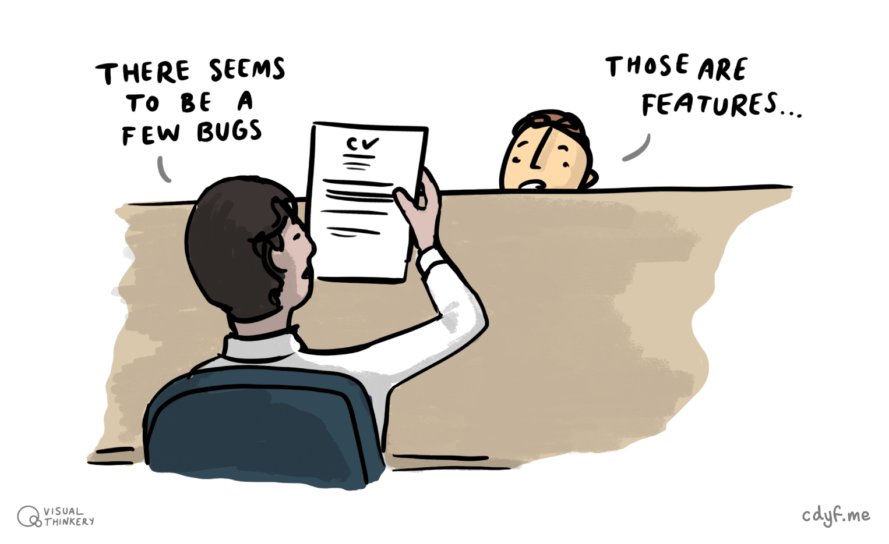
```

(ref:captionbuggingcv) Is that a [bug](https://en.wikipedia.org/wiki/Software_bug) or a [feature](https://en.wikipedia.org/wiki/Software_feature) in your CV? To stand a chance of being invited to interview, you'll need to identify and fix any bugs in your written applications. If you don't, your application risks being sucked into a black hole and will never be seen again. Features not bugs picture by [Visual Thinkery](https://visualthinkery.com) is licensed under [CC-BY-ND](https://creativecommons.org/licenses/by-nd/4.0/)

Your future is bright, your future needs debugging, so let's start debugging your future. 

## What You Will Learn {#ilo7}  

By the end of this chapter you will be able to

1. Structure and style the content of your two page CV and one page résumé appropriately^[I use the terms *résumé* and *CV* interchangebly, with the only difference being their length, see section \@ref(length)]
1. Articulate your story^[actually a collection of short stories] by providing convincing evidence of your `experience`, `projects` and `education` etc
1. Identify and fix bugs in CV’s by:
    + Their `content` (what you've done and who you are) and `presentation` (how you style your CV)
    + Constructively criticising other people's CVs
    + Asking for, listening to, and acting on constructive criticism of your own CV
1. Quantify and provide convincing evidence for any claims you make you on your CV
1. Identify gaps (mostly `content` bugs) in your own CV and how you might begin to fill them


## Beware of the Black Hole {#blackhole}  
Before we get started, let's consider some advice from software engineer [Gayle Laakmann McDowell](https://en.wikipedia.org/wiki/Gayle_Laakmann_McDowell). Gayle is an experienced software engineer who has worked at some of the [biggest technology companies in the world](https://en.wikipedia.org/wiki/Big_Tech): Apple, Microsoft and Google. She has also authored a cracking series of books on technology careers, particularly (Beyond) *[Cracking the Coding Interview](https://en.wikipedia.org/wiki/Cracking_the_Coding_Interview)* [@beyondctci;@cracking] which we'll discuss in chapter \@ref(speaking). Gayle refers to the employer “black hole” described in figure \@ref(fig:gayle-fig).

```{r gayle-fig, echo = FALSE, fig.show = "hold", fig.align = "center", out.width = "99%", fig.cap = "(ref:captiongayle)"}
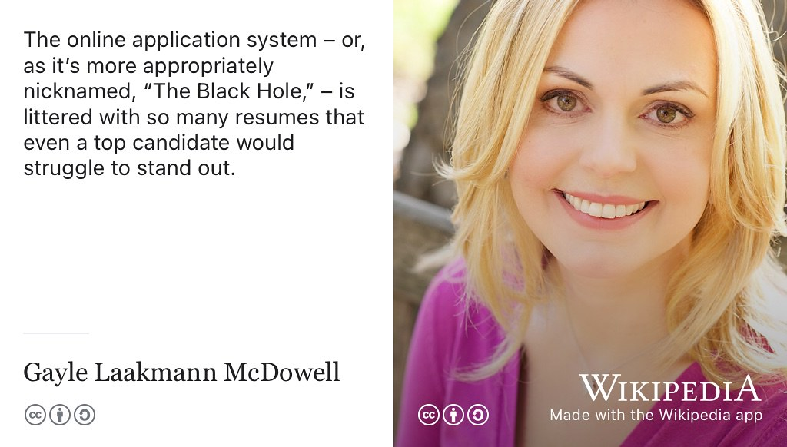
```
(ref:captiongayle) Beware of what software engineer [Gayle Laakmaan McDowell](https://en.wikipedia.org/wiki/Gayle_Laakmann_McDowell) calls the employer “Black Hole”, especially if you're applying to large employers. “Getting through the doors, unfortunately, seems insurmountable. Hoards of candidates submit résumés each year, with only a small fraction getting an interview. The online application system – or, as it’s more appropriately nicknamed, *The Black Hole*, – is littered with so many résumés that even a top candidate would struggle to stand out.” [@blackhole; @techcareer] Laakmann portrait by Gayle Laakmaan is licensed CC BY 4.0 via Wikimedia Commons [w.wiki/wiu](https://w.wiki/wiu) adapted using the [Wikipedia app](https://apps.apple.com/us/app/wikipedia/id324715238) Thank you Gayle for permission to use your photo. 👩‍💻

If you're applying to big employers, you'll need to create a CV that is good enough to stand out before it disappears over the [event horizon](https://en.wikipedia.org/wiki/Event_horizon) and into an employers black hole. We discuss some strategies for managing the black hole in section \@ref(rejection). Employer practices vary, but according to some estimates the person reading your CV will typically:

* Spend around **7 seconds** (or less!) deciding if your CV is interesting enough to shortlist and read in a bit more depth. This is a pessimistic view, see the discussion by Andrew Fennell for a more complete story [@fennell]
* Shortlist about **20%** of the all CVs they get sent [@fennell]
* Interview about **2%** of the candidates on their shortlist [@fennell]

So, the *first* thing your CV or résumé needs to do is:

* catch attention so it ends up in the *lets read that a bit more pile*. 

Having passed the 7 second test, the second thing your CV or résumé needs to do is:

* *persuade an employer to invite you to an interview*. 

You can start with an employer-agnostic CV but you may need to come back and revisit the issues in this chapter once you have identified some target employers, so that you can customise and tailor your CV and written applications.

## The CV is Dead, Long Live the CV! {#dead}  
Résumés and CV's have reigned supreme in the kingdom of employment and recruitment for many years but their demise has often been predicted, see figure \@ref(fig:longlive-fig).

```{r longlive-fig, echo = FALSE, fig.show = "hold", fig.align = "center", out.width = "99%", fig.cap = "(ref:captionlonglive)"}
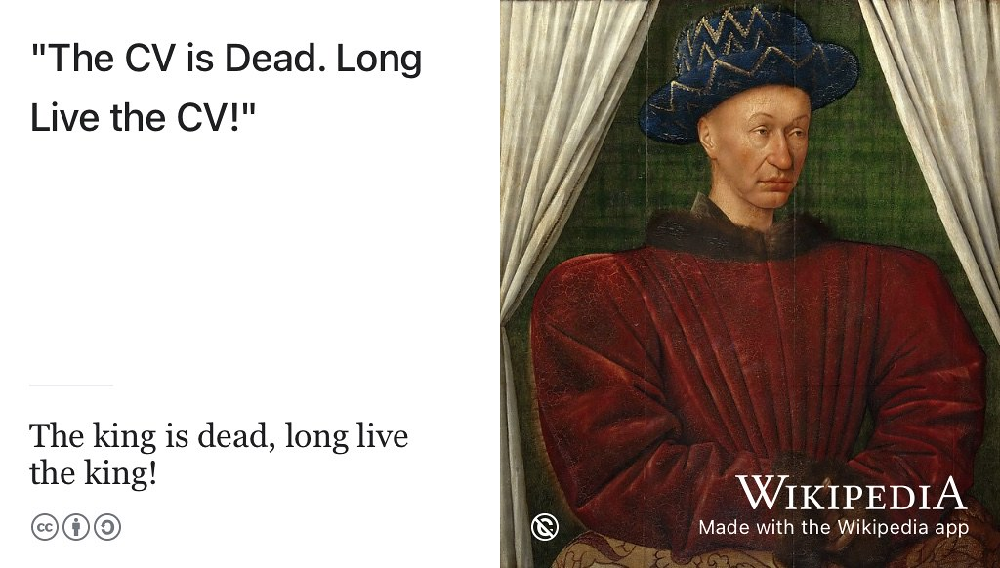
```
(ref:captionlonglive) The seemingly contradictory phrase [the king is dead, long live the king](https://en.wikipedia.org/wiki/The_king_is_dead,_long_live_the_king!) simultaneously announces the death of the previous monarch and the accession of a new one. Likewise, the death of the [CV](https://en.wikipedia.org/wiki/Curriculum_vitae) (and [résumé](https://en.wikipedia.org/wiki/R%C3%A9sum%C3%A9)) has long been hailed but it keeps coming back to reign again. The CV is dead, long live the CV! The résumé is dead, long live the résumé! Public domain image of a painting of [Charles VII of France](https://en.wikipedia.org/wiki/Charles_VII_of_France) by Jean Fouquet on Wikimedia Commons [w.wiki/3e3K](https://w.wiki/3e3K) adapted using the [Wikipedia app](https://apps.apple.com/us/app/wikipedia/id324715238) 👑

While it is true that some employers don't accept CVs or favour online application forms or digital profiles, it is still worth writing a CV because:

* Your CV provides a record for you of relevant things you've done
* Your CV enables you to get your story straight, *What's your story, coding glory?* see section \@ref(story) [@whatsthestory]
* Your CV forces you to articulate who you are and what you want, see chapter \@ref(exploring)
* Many employers will still ask you for one, see section \@ref(robotproof) and figure \@ref(fig:longlive-fig)
* Your CV and covering letter (see section \@ref(covering-letters)) helps you script and practice your “lines” for interviews, see chapter \@ref(speaking)

Even if an employer never asks you for your CV, you'll frequently want to use the *content* of your CV in applications and interviews. So this chapter looks at how you can debug your written applications, whatever the mechanism is for submitting them.

You can of course *augment* your CV with various public digital profiles such as LinkedIn, Github or [pages.github.com](https://pages.github.com/). A public digital profile or portfolio can help employers find you, see section \@ref(portfolio).

*Wherever* you're putting information about yourself for potential employers, on a CV, Résumé, LinkedIn profile the same principles apply. See the checklist in section \@ref(checklist) and for specific advice on LinkedIn see:

* [linkedin.com/learning/learning-linkedin-for-students](https://linkedin.com/learning/learning-linkedin-for-students)
* [students.linkedin.com](https://students.linkedin.com)

## It's not a Bug, it's a Feature! {#trope}

An age old trope in Computer Science that engineers use to pass off their mistakes as deliberate features is the bug/feature distinction, see figure \@ref(fig:notabug-fig).

```{r notabug-fig, echo = FALSE, fig.show = "hold", fig.align = "center", out.width = "99%", fig.cap = "(ref:captionnotabug)"}
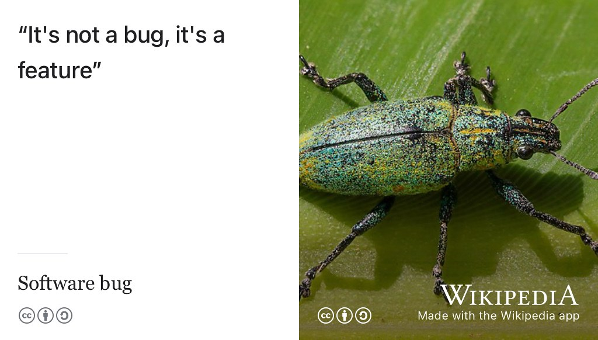
```

(ref:captionnotabug)  “It's not a *bug*, it's a *feature*...” (according to A. Hacker). Do you have [software bugs](https://en.wikipedia.org/wiki/Software_bug) or [undocumented features](https://en.wikipedia.org/wiki/Undocumented_feature) on your CV or résumé? Although tolerated in software, bugs in your CV, résumé and written applications can be fatal. Picture of gold-dust weevil *[Hypomeces pulviger](https://en.wikipedia.org/wiki/Hypomeces_pulviger)* by [Basile Morin](https://commons.wikimedia.org/wiki/User:Basile_Morin) is licensed CC BY SA via Wikimedia Commons [w.wiki/3E62](https://w.wiki/3E62) adapted using the [Wikipedia app](https://apps.apple.com/us/app/wikipedia/id324715238)

Nobody likes buggy software, but unfortunately we routinely have to tolerate badly-designed, low quality, bug-ridden software in our everyday lives. [@badsoftware; @failware] 

In contrast, buggy CVs are rarely tolerated, they will usually end up in the bin. Even a tiny defect, like an innocent typo, can be ~~fetal~~ fatal. [@typos] Most employers (particularly large and well known ones) have to triage hundreds or even thousands of CV's for any given vacancy. This means the person reading your CV is as likely to be looking for reasons to `REJECT` your CV, than `ACCEPT` it, because that's a sensible strategy for shortlisting from a huge pool of candidates. A buggy CV, application and covering letter could ruin your chances of being invited to an interview, see chapter \@ref(speaking).

<!-- false positives and false negatives-->

<!--see e.g. https://community.rstudio.com/t/appending-a-pre-existing-pdf-to-a-new-created-by-r-markdown/45641

```{r cv-fig, fig.align="center", fig.cap="this is a caption", echo=FALSE}
knitr::include_graphics("images/rick-urshion.pdf")
```

doesn't work for some unknown reason


```{r marissa-fig, echo = FALSE, fig.align = "center", out.width = "100%", fig.cap = "this is a sample CV"}
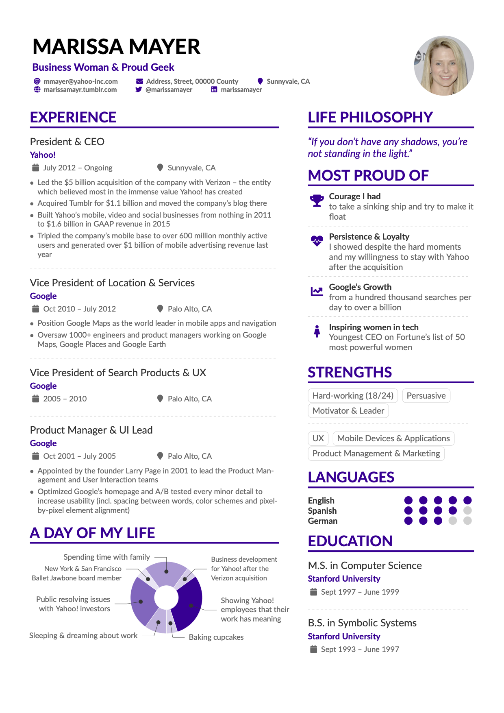
```
-->

Like writing software, the challenging part of writing a CV isn't the *creation* but in the *debugging* and subsequent re-writing. Can you identify and fix the bugs before they are fatal?

<!--## Debug their CV {#bugfeature} It's difficult to be objective about your own CV.-->

::: {.rmdcaution}

(ref:codingcaution)

If you ask three people what they think of your CV, you will get three different and probably contradictory opinions. CV's are very subjective and very personal. The advice in this chapter is based on common sense, experience and ongoing conversations with employers. What makes a good CV will depend on the personal preferences and prejudices of your readers. So, this chapter just describes some general debugging guidelines, rather than rigid rules.

It is good practice to *triangulate* responses from your readers. For example, if three different people point out the same bug in your CV you can be confident that it is a bug that needs fixing. The more *friendly critics* (see figure \@ref(fig:wonderfuldarling-fig)) who can give you constructive feedback on your CV before you send it to employers, the better it will get.

:::

While referring to this guide, remember that:

* The main purpose of your CV is to get an interview, not a job. Your CV should catch attention and provide talking points for an interview
* Your CV will be assessed in seconds, rather than minutes so brevity really is key
* Bullet points with verbs first (see section \@ref(verbsfirst)) will:
  + allow your reader to *quickly* skim, scan and scroll through your CV because [employers don't actually read CVs](https://readabilityguidelines.co.uk/content-design/how-people-read/) [@scanning], see figure \@ref(fig:f-shaped-fig)
  + highlight your key activities
  + avoid long sections of [flowery prose](https://en.wikipedia.org/wiki/Prose) which the reader will very probably skip anyway. Instead, you can use your beautiful prose to demonstrate your excellent written communication skills on your covering letters or personal statements instead, see section \@ref(covering-letters)

You're not trying to tell your *whole* life story from section \@ref(story) but to distill the essentials into several short stories which can be summarised into a handful of bullets or sentences. Your CV should be punchy like the [blurb](https://en.wikipedia.org/wiki/Blurb) or synopsis on the back of a novel, can you entice the reader into wanting to find out more (by inviting you to an interview)?

```{r f-shaped-fig, echo = FALSE, fig.show = "hold", fig.align = "center", out.width = "99%", fig.cap = "(ref:captionfshaped)"}
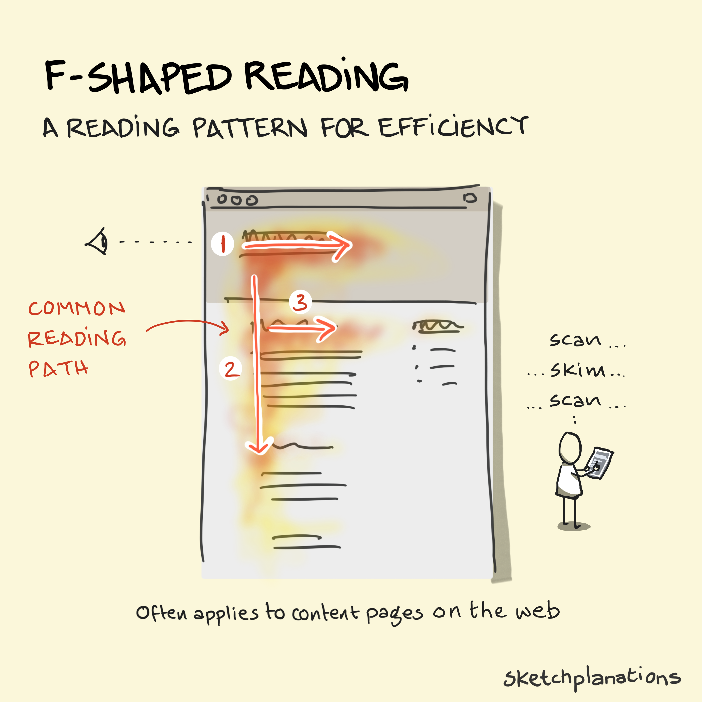
```

(ref:captionfshaped) Employers are unlikely to actually *read* your CV in much depth, especially during a first glance. They are much more likely to be quickly *scanning* it in a hurry. A common pattern for scanning is F-shaped reading. [@fshapedkara] Putting the most important information first and leading with verbs (see chapter \@ref(verbalising)) will increase the chances that you'll get your key points across to your readers. [CC BY-NC](https://creativecommons.org/licenses/by-nc/4.0/) image by Jono Hey at [sketchplanations.com](https://sketchplanations.com) [@fshaped]


## Write Something, Anything! {#mycv}

Just as you can't edit a blank page, you can't debug an unwritten CV either, see figure \@ref(fig:jodi-picoult-fig). Debugging and editing your CV can be time consuming but wherever criticism of your CV or résumé comes from, don't take it personally - it is probably one of the first you have written.

```{r jodi-picoult-fig, echo = FALSE, fig.show = "hold", fig.align = "center", out.width = "99%", fig.cap = "(ref:captiongarbage)"}
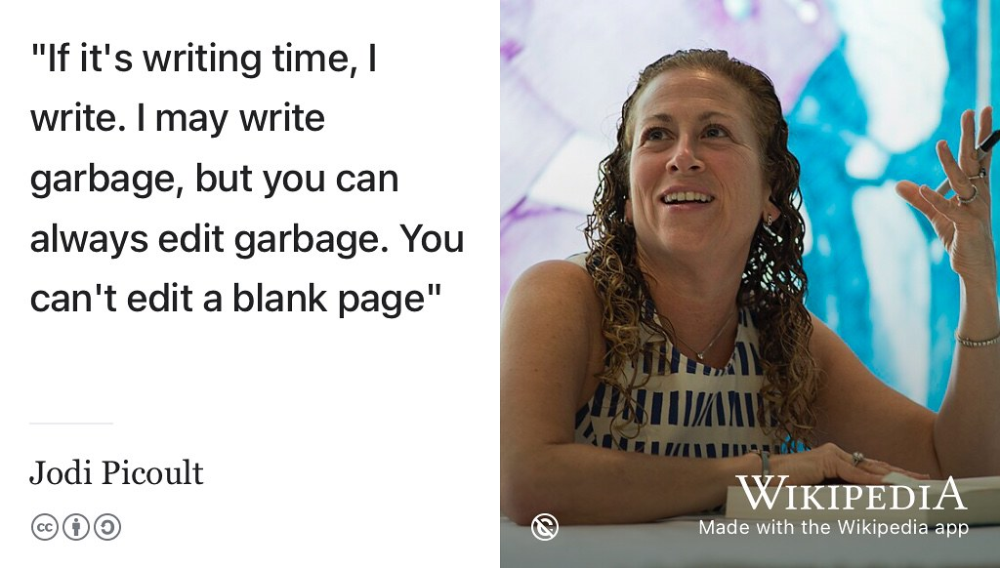
```

(ref:captiongarbage)  “*If it's writing time, I write. I may write garbage, but you can always edit garbage. You can't edit a blank page*” --Jodi Picoult [@picoult] I often speak to students who tell me their CV isn't ready yet. Just as you can't edit a blank page, you can't debug an unwritten (or unseen) CV either. So write something, *anything*. Even if you *think* its garbage you won't be able to improve it until you've written it. You can't start a fire without a spark. [@springsteen1; @springsteen2] Likewise, if you're doing a CV swap (see figure \@ref(fig:cvswap-fig)) - go easy when giving feedback to its author, you'll often be treading on delicate and personal ground. Public domain portrait of novelist [Jodi Picoult](https://en.wikipedia.org/wiki/Jodi_Picoult) by Lauren Gerson via the U.S. National Archives on Wikimedia Commons [w.wiki/6i4E](https://w.wiki/6i4E) adapted using the [Wikipedia app](https://apps.apple.com/us/app/wikipedia/id324715238)


It might help to think of first version of your CV as an [alpha or beta version](https://en.wikipedia.org/wiki/Software_release_life_cycle) that you continuously test, release and redeploy. If it was an iPhone, its a [first generation iPhone](https://en.wikipedia.org/wiki/IPhone_(1st_generation)) - with many future iterations to come! There are many chances to debug and improve your CV during your study but before potential employers read it. The aim of this chapter is to help you improve your CV, whatever stage you are at. Employers often grumble about Computer Science graduates lacking good written communication skills. Written applications and CV's are a common example of this, so let's look at some common bugs.

## CV Checklist (A): Quick Seven Point Check {#quick}
Here are seven kinds of bugs to pay attention to on the initial drafts of your CV.

```{r seven-fig, echo = FALSE, fig.show = "hold", out.width = "14%"}
knitr::include_graphics(rep("images/seven.png", 7))
```

Are they bugs or are they features? 

<!-- this repeats the checklist at the end and needs moving-->
1. **EDUCATION**: Is your year of graduation, start date, degree program, University and expected (or achieved) degree classification clear? Is it in reverse chronological order with your `EDUCATION` first? Have you *summarised* what you are studying in both semesters of the academic year, not just courses you have finished?^[avoid long lists of course modules] See section \@ref(education)
1. **STRUCTURE**: Is the structure sensible? Is it in reverse chronological order? Are the most important (usually most recent) things first? Recruiters at Google and TikTok suggest you have around five headings, see section \@ref(body)
1. **NUMBERS**: Have you *quantified* the context, action, results and evidence of the short stories on your CV where possible? How convincing is your evidence? Are your assertions vague & meaningless or are they backed up with convincingly quantified details (section \@ref(quantification))? Look for numbers and percentages on your CV, instead of vague statements like large, big, small, etc see figure \@ref(fig:black-vid) and (`C.A.R.E.`) in section \@ref(care)
1. **VERBS FIRST**: Have you talked about what you have actually done using  carefully chosen but prominent `verbs`, see chapter \@ref(verbalising)? Try to avoid long sections of [flowery prose](https://en.wikipedia.org/wiki/Prose), see section \@ref(verbsfirst)
1. **STYLE**: Does it look good, have you used a good template see section \@ref(style). Is it easy on the eye with a decent layout and appropriate use of [LaTeX](https://latex4year1.netlify.app/) or Word or whatever? [@latex4year1] Are there any spelling mistakes, typos and grammar? Don't just rely on a spellchecker, some errors will only be ~~spitted~~ spotted by a human reader see section \@ref(spelling)
1. **LENGTH**: Does it fit comfortably on (ideally) one page (for a Résumé) or two pages (for a CV)? See section \@ref(length)
1. **SEE ALSO**: This is a quick checklist to get you started, see the longer CV self-debugging checklist (B) in section \@ref(checklist)

<!--Google Inside Look: Google students
iframe width="560" height="315" src="https://www.youtube.com/embed/dA3NX-Tpe4E" frameborder="0" allowfullscreen></iframe-->


## Structure Your CV and Résumé {#structure}

How you structure your CV and Résumé will depend on who you are and what your story is. It can be tricky deciding what the headings should be and what you put in each section. Recruiters at Google suggest you have just four or five sections, that follow a header section. Before we zoom in on those, let's look at some broader points about CVs and Résumés. Start by watching the short videos shown in figure \@ref(fig:lopez-vid) (*Résumé Tips*) and figure \@ref(fig:black-vid) (*How to write a top-notch CV*).

```{r lopez-vid, echo = FALSE, fig.align = "center", out.width = "99%", fig.cap = "(ref:captiongooglerecruiters)"}
knitr::include_url('https://www.youtube.com/embed/BYUy1yvjHxE')
```

(ref:captiongooglerecruiters) Recruiters at Google, [Jeremy Ong](https://www.linkedin.com/in/jeremy-ong/) and [Lizi Lopez](https://www.linkedin.com/in/lizilopez/) (now at TikTok) outline some tips and advice for creating your résumé. You can also watch the 8 minute video embedded in this figure at [youtu.be/BYUy1yvjHxE](https://youtu.be/BYUy1yvjHxE). [@youtube-google-recruiters]

<!-- not sure this really fits here in structure, is there somewhere better? -->
Besides being structured well, as described in figure \@ref(fig:lopez-vid) and later in section \@ref(body), your CV also needs to persuade the reader that you have some fundamental attributes. [Jonathan Black](https://www.linkedin.com/in/jonathanblack/), director of the careers service at the University of Oxford (and working life columnist at [ft.com/dear-jonathan](https://www.ft.com/dear-jonathan)) points out in figure \@ref(fig:black-vid), there are three key things you want to demonstrate in your CV:

1. that you can take responsibility
1. that you achieve things
1. that you are good company or at least a valued team member^[not all valued team members are good company 😉]

How will you demonstrate you have each of these traits? Quantifying and evidencing your claims will make them much more convincing, see figure \@ref(fig:black-vid).

<!--Remember that no applicant meets all the criteria, so 80% means you're doing really well [@topnotchcv]-->
```{r black-vid, echo = FALSE, fig.align = "center", out.width = "99%", fig.cap = "(ref:captionjonathanblack)"}
knitr::include_url('https://www.youtube.com/embed/yjdvCHWVtE4')
```

(ref:captionjonathanblack) [Jonathan Black](https://www.linkedin.com/in/jonathanblack/), head of the careers service at the University of Oxford, explains how to create a top notch CV by replacing meaningless assertions with meaningful evidence. You can also watch the 11 minute video embedded in this figure at [youtu.be/yjdvCHWVtE4](https://youtu.be/yjdvCHWVtE4). [@topnotchcv]

One of the best ways of demonstrating and convincing your reader that you have the skills and attributes mentioned in figure \@ref(fig:black-vid) is by explicitly and deliberately **QUANTIFYING** them where you can. Quantifying and providing evidence for any claims you make will make your CV a much more convincing read. Doing the math and showing the numbers is a simple way to transform meaningless assertions described in figure \@ref(fig:black-vid) into meaningful evidence. So for example:

```md
* Achieved excellent results
```

...is a bit vague, what were the results exactly, can you measure them somehow? Or at least describe them?

```md
* Worked in a team
```

So you worked in a team? `Worked` is vague. What was your role and contribution exactly? How long did the project last? How many people were on your team?  What were the results of your actions? 

```md
* Worked in a team of six people for four months to deliver a music app ... 
```

or just drop the boring `worked` altogether and pick a more interesting verb like:

```md
* Prototyped a music application in a team of six people for four months ... 
```

Don't just TELL your reader, SHOW them. The numbers (`six` people, `four` months etc) and other evidence are a key part of your **story** that you want to tell potential employers, see figure \@ref(fig:storytime-fig).

```{r storytime-fig, echo = FALSE, fig.align = "center", out.width = "100%", fig.cap = "(ref:captionstorytime)"}
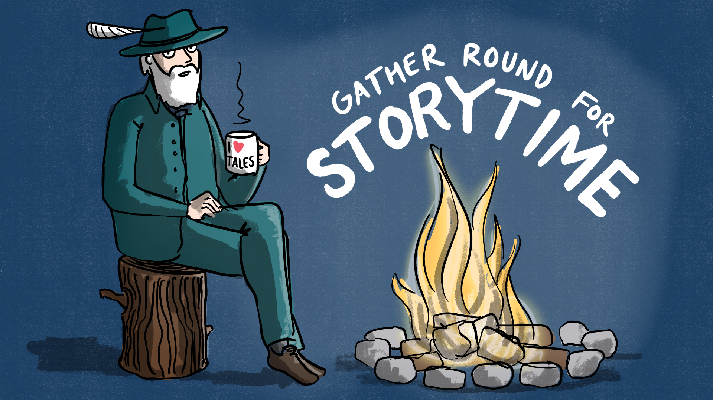
```

(ref:captionstorytime) Do you ❤️ tales? Of course you do and your readers love stories too! On a short CV, you don't have time to gather around the camp fire and tell them the whole tale, but you *do* need to give them the bare bones of your most important stories so the reader wants to find out more. Using numbers is a key part of that, alongside giving the `C`ontext, `A`ctions, `R`esults and `E`vidence (`C.A.R.E.`) we discuss in section \@ref(care). Storytime sketch by [Visual Thinkery](https://visualthinkery.com/) is licensed under [CC-BY-ND](https://creativecommons.org/licenses/by-nd/4.0/) 🔥

So what's your story, coding glory? [@whatsthestory]

### Your Header {#header}

The first thing in your CV is the header, a simple section giving your name, email, phone number and any links, as shown in Alan Turing's CV in figure \@ref(fig:turinghead-fig).

```{r turinghead-fig, echo = FALSE, fig.align = "center", out.width = "100%", fig.cap = "(ref:captioncvheader)"}
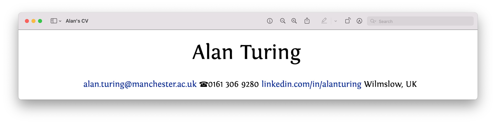
```

(ref:captioncvheader) Keep the header of your CV simple like Alan's example here. Just your name, email, phone number and any relevant links are all you really need. You could include general location information like `Wilmslow` here but your full mailing address isn't usually needed. If you choose to have some kind of public digital profile like [linkedin.com/in/alanturing](https://www.linkedin.com/in/alanturing) or [github.com/alanturing](https://github.com/alanturing)^[Yes, those handles have been taken!], your header is a good place to link to it, see section \@ref(portfolio). You might also include a timestamp like `last updated 1954-06-07` in the footer. Any additional information risks wasting valuable space and distracting your reader from much more important things you need to tell them. [Less is more](https://en.wikipedia.org/wiki/Less_(Unix)).

Your header doesn't need to include any more information than your name, email, phone and any links. This means your date of birth, nationality, marital status^[and other protected characteristics see section \@ref(protected)], gender, portrait^[different countries have different conventions when it comes to passport-style photos on a CV. In the UK what you look like should *not* be a factor in an employers decision to interview you, so leave it out] and a full mailing address (like [43 Adlington Road, Wilmslow, SK9 2BJ](https://openplaques.org/plaques/3276)) aren't required. [@noaddress] You don't need to give multiple phone numbers or emails either, just one of each will do. If an employer wants to invite you to an interview, they'll get in touch by email, phone (or possibly LinkedIn, github etc) so other contact details such as your full postal address are an irrelevant distraction at this point. After your header I suggest you have around five sections in the body as follows:

### Your Body {#body}
Technical recruiters at Google and TikTok (see figure \@ref(fig:lopez-vid)) suggest you have just five sections in the body of your CV. Headings use lots of space so should be used carefully and precisely, especially on a one page résumé. Your sections should cover some or all of the following:

1. 🎓 `EDUCATION`: the formal and compulsory stuff you were *required* to do get your qualifications, see section \@ref(education)
1. 💰 `EXPERIENCE`: any paid and voluntary work, see section \@ref(experience)
1. 💪 `PROJECTS`: the extra-curricular, optional, personal, coursework or side projects, see section \@ref(projects)
1. 🏆 `LEADERSHIP & AWARDS`: your trophy cabinet, see section \@ref(prizes)
1. ❓ `OPTIONAL`: but don't call it that, see section \@ref(misc)

Let's look at each of these sections in turn:  

### Your Education Goes First {#education}

Unless you have a *significant* amount of `EXPERIENCE`, as a student or graduate the `EDUCATION` section of your CV should be the first titled section, after the header. Since CV's are usually in reverse chronological order, the logical place to start is what you're doing now. Don't bury your education down the bottom or try to hide the fact that you're a student, there's nothing to be ashamed of and it will be counterproductive to pretend you're not currently studying. You should be proud of your education because its a fundamental part of who you are, see figure \@ref(fig:blair-fig). Having said that, your description needs to *summarise* by striking a good balance between:

* Describing in enough detail what you've studied and any `PROJECTS`^[If you put these in a `PROJECTS` section all of their own (see section \@ref(projects)), make sure you clearly distinguish between extra-curricular projects you've done outside of your formal education vs compulsory projects you've *had* to do as part of your degree] you've completed at University as part of your *formal* (compulsory) education
* Keeping it short and sweet by avoiding getting bogged down in tedious and irrelevant educational details that will be of little interest to most of your readers

```{r blair-fig, echo = FALSE, fig.align = "center", out.width = "100%", fig.cap = "(ref:captionblair)"}
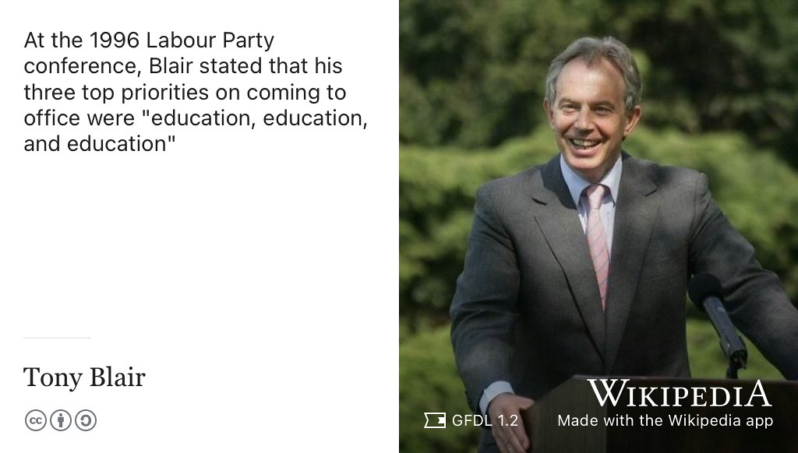
```

(ref:captionblair) [Tony Blair](https://en.wikipedia.org/wiki/Tony_Blair)'s top three priorities as a new Prime Minister of the United Kingdom were `education, education, education`. [@tonyblair; @blair] Likewise, at this stage of your career, your education should be a top priority on your CV. Education should go first, unless you've got a *significant* amount of `EXPERIENCE`. As a graduate (or undergraduate) your education is the most recent, relevant and important thing about you so it should have top billing, see the discussion in figure \@ref(fig:lopez-vid). This [GNU Free Documentation Licensed](https://en.wikipedia.org/wiki/GNU_Free_Documentation_License) (GFDL) portrait of Tony Blair in 2007 by the Polish Presidency on Wikimedia Commons [w.wiki/64Kd](https://w.wiki/64Kd) has been adapted using the [Wikipedia app](https://apps.apple.com/us/app/wikipedia/id324715238) 🇵🇱

You've invested a significant amount of time and money in getting your degree. At this stage, your degree justifies a longer description than a rather terse one line `BSc (Hons) Computer Science`. You'll need to:

* say *more* than [Pen Tester](Penelope_Tester.pdf) and [Rick Urshion](Rick_Urshion.pdf), who haven't said enough about their University education
* say *less* than [Mike Rokernel](Mike_Rokernel.pdf), who has given *way* too much information on his degree.

You don't need to name every single module, course code with a mark for each. Neither do you need to give your result to FOUR or FIVE significant figures: `71.587%`^[Do you *really* think academic performance can be measured that precisely?]. Two significant figures will do just fine: `72% (first class)`. You might like to pick out relevant modules, or the ones you enjoyed most. Employers like Google encourage applicants to emphasise courses on data structures and algorithms, but you'll need to tailor your description to the role and be brief. On a one page Résumé, you'll probably only have two or three lines to summarise some of the modules you've studied at University. 🎓

You should include details of your high school education, *after* University so that it is in reverse chronological order. Start with last set of exams you sat before University, bearing in mind that *some* employers screen job candidates by UCAS Tariff points. [@ucas;@pwcscraps] How far you go back will depend on how much space you have available, especially on a one pager. It is debatable how far back you should go, exams that you sat aged ~16 (like GCSE's) aren't always relevant now that you're older. [@gcses]

### Your Experience {#experience}  
Experience is where you can talk about any paid or voluntary work experience you have. For paid work call it `EXPERIENCE` rather than `WORK EXPERIENCE` as the latter can imply work *shadowing*, see section \@ref(areuexperienced). Work shadowing is valuable, but paid work is even better so you should make it clear if your experience was paid or not. Don't discount the value of casual labour, such as working in retail or hospitality, these demonstrate your work ethic and ability to deal with customers^[sometimes difficult ones], often under pressure. You are more than just a techie too, so anywhere you've worked in a team is experience worth mentioning, even if that team was just two people. Two people is still a team.

```{r done-fig, echo = FALSE, fig.align = "center", out.width = "100%", fig.cap = "(ref:captionwhathaveudone)"}
knitr::include_graphics("images/What have you done.png")
```

(ref:captionwhathaveudone) Are you experienced? What have you done outside of your formal academic education? Employers will want to know *much more* about you than just your `EDUCATION`. Are you `EXPERIENCE`d? What `PROJECTS` have you done? Can you demonstrate `LEADERSHIP`? Have you won any `AWARDS`? Experience sketch by [Visual Thinkery](https://visualthinkery.com/) is licensed under [CC-BY-ND](https://creativecommons.org/licenses/by-nd/4.0/) With apologies to [Jimi Hendrix](https://en.wikipedia.org/wiki/Jimi_Hendrix). [@hendrix]

If you don't have much experience, don't worry, there are plenty of opportunities to get some more  . For details, see chapter \@ref(experiencing) *experiencing your future*.

Are you experienced? Whatever it is, make sure you add it to your `EXPERIENCE` section. 💰

### Your Projects {#projects}

The `PROJECTS` section of your CV is where you can describe all your other activities, including any personal, voluntary, hackathon, freelance, professional or coursework projects.

```{r feynman-fig, echo = FALSE, fig.align = "center", out.width = "100%", fig.cap = "(ref:captionfeynman)"}
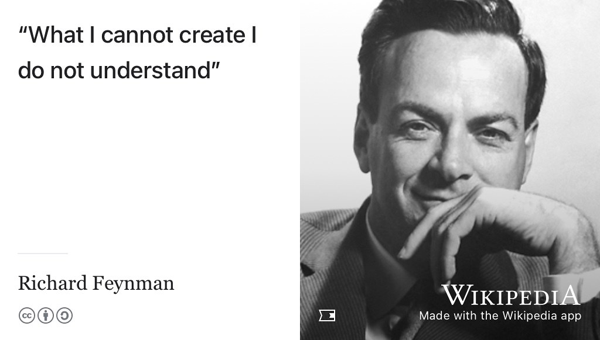
```

(ref:captionfeynman) Physicist [Richard Feynman](https://en.wikipedia.org/wiki/Richard_Feynman) once chalked *“[What I cannot create, I do not understand](https://calisphere.org/item/b3e8d3cb9b8adc01314dba1b1f1fcf84/)”* on his blackboard at the [California Institute of Technology](https://en.wikipedia.org/wiki/California_Institute_of_Technology) (CalTech) where he taught [The Feynman Lectures on Physics](https://en.wikipedia.org/wiki/The_Feynman_Lectures_on_Physics). [@feynmanblackboard] Creating software and hardware in personal side projects is a great way to build new understanding *and* help your CV stand out see [github.com/codecrafters-io/build-your-own-x](https://github.com/codecrafters-io/build-your-own-x). Public domain image of Richard Feyman by The Nobel Foundation on Wikimedia Commons [w.wiki/3Xoy](https://w.wiki/3Xoy) adapted using the [Wikipedia app](https://apps.apple.com/us/app/wikipedia/id324715238)

Your projects might include activities that you haven't already described in your `EDUCATION` or your paid `EXPERIENCE` section such as:

* personal side projects, see section \@ref(tinkering)
* social responsibility projects, not neccesarily technical, see section \@ref(volunteering)
* open source projects, see section \@ref(opensource)
* freelance and entrepreneurial projects, your “[side hustles](https://en.wikipedia.org/wiki/Side_job)” (if you have any)
* hackathons, olympiads and other competitive or collaborative events, see section \@ref(tinkering)
* University projects:
    + these sometimes fit better in your `EDUCATION` section, depending on how many non-Uni projects you have
    + If you are publishing a group project, you will need permission from *all* of your team to make the code public 
    + Be *careful* publishing coursework. If someone copies your coursework, you will **BOTH** be guilty of [academic malpractice](https://www.studentsupport.manchester.ac.uk/study-support/academic-support/assessments-and-exams/avoiding-academic-malpractice/) because you have colluded in plagiarism.
    + ... but final year (“[capstone](https://en.wikipedia.org/wiki/Capstone_course)”) projects are great as these will tend to be unique, distinguishing you from everybody else in your year group

Your projects will most likely be unpaid because paid work tends to fit better under the heading `experience`, see section \@ref(experience). Perhaps you've completed some courses outside of your education such as a massive open online course  (MOOC) or similar. Hackathons and competitions, fit well here too. [@hafb] You don't *need* to have won any prizes or awards, although be sure to mention them if you have. Participating in hackathons and competitions clearly shows the reader that you enjoy learning new things. Demonstrating an appetite for new knowledge and skills will make your application stand out. If you're looking for some inspiration for side projects, the [codecrafters-io/build-your-own-x](https://github.com/codecrafters-io/build-your-own-x) repository is a good starting point alongside [free-for.dev](https://free-for.dev/) which lists  software that has free tiers for developers to play with. Building and creating new things is a great way to understand them, just ask [Richard Feynman](https://en.wikipedia.org/wiki/Richard_Feynman) shown in figure \@ref(fig:feynman-fig). What you cannot create you do not understand. Another great way to learn is to get involved with open source projects which we describe in section \@ref(opensource).

Any longer projects you've done at University are worth mentioning. Capstone projects are important because they differentiate you from everyone else in your year group. Try to be *more* descriptive than this:

```md
* First year team project
```
or perhaps
```md
* Second year team project
```
or even just
```md
* Final year project
```

By themselves, those project names are pretty opaque. They are OK for giving the *context* of your story but don't tell the reader anything about what *you* did or what the *software/hardware/project* did. What was the story (the context, action, result and evidence (`CARE`) we described in section \@ref(care)) of those projects? 

* How many people were in your team? 
* How long did you collaborate for?
* What did you build? 
* What was it called? What did it do? 
* What roles and responsibilities did you have in the team? 
* Was there conflict in the team (there usually is)? How did you resolve it? 
* How did you motivate the free-riders in the team to contribute? 

This is all excellent CV [fodder](https://en.wikipedia.org/wiki/Fodder), see \@ref(fig:cvfodder-fig)


```{r cvfodder-fig, echo = FALSE, fig.align = "center", out.width = "98%", fig.cap = "(ref:captionfodder)"}
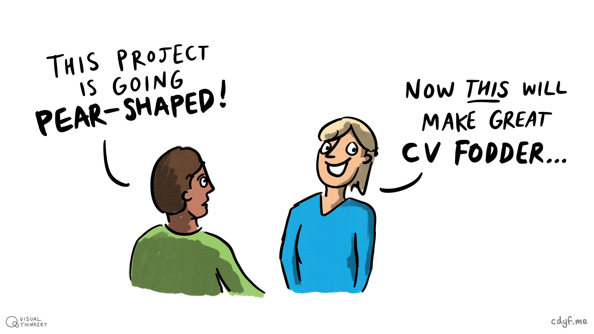
```
(ref:captionfodder) Have you ever had a project that didn't go very well? Did it all go [pear-shaped](https://en.wikipedia.org/wiki/Pear-shaped)? [@piriform] Perhaps you managed to turn the project around? Maybe you learned some lessons from those painful mistakes you won't be repeating? Difficult projects can make great stories (aka CV [fodder](https://en.wikipedia.org/wiki/Fodder)) because mistakes *can* be good, see section \@ref(estherdyson), as long as you don't repeat them. CV fodder sketch by [Visual Thinkery](https://visualthinkery.com/) is licensed under [CC-BY-ND](https://creativecommons.org/licenses/by-nd/4.0/) 🍐

It's often better to describe what YOU did before you describe what the software, hardware or project did. Your reader is much more likely to be interested in the former than the latter. Let's imagine you've developed a piece of software called `WidgetWasher`. You might describe it like this:

````md
* WidgetWasher is a web service that washes widgets
* It uses an HTTP API and secret keys
* Tested WidgetWasher on a range of different operating systems
* Collaborated with one other contributor over two days
* Designed and implemented an API
````


Instead, you could reverse ↑↓ the order to change the emphasis like this:

````md
* Designed and implemented an API ↑
* Collaborated with one other contributor over two days ↑
* Tested WidgetWasher on a range of different operating systems
* Utilised an HTTP API and secret keys ↓
* Created a web service that washes widgets called WidgetWasher ↓
````

The latter has all the same information, but by reversing the order, you've emphasised what *you* did, rather than what the software did. Much more interesting. 💪
<!-- need a section on 👑 Activities and leadership -->

### Your Leadership & Awards {#prizes}
If you can demonstrate leadership, you may want to dedicate a whole separate section to it. Experience of tutoring or mentoring other students, can serve as a good example through peer-assisted study schemes (like [PASS](https://www.peersupport.manchester.ac.uk/what-is-peer-support/what-is-pass/)) for example. Teaching is a different kind of leadership to running a small business or captaining a sports team, but it is leadership nonetheless. A `leadership` and/or `awards` section is also a good place to add any prizes you've won, see figure \@ref(fig:trophy-fig). If you've done any extra courses and been awarded some certification, an awards section is a good place to put it as it distinguishes it from the qualifications in your formal `EDUCATION`, see section \@ref(otherbadges)

```{r trophy-fig, echo = FALSE, fig.align = "center", out.width = "100%", fig.cap = "(ref:captiontrophy)"}
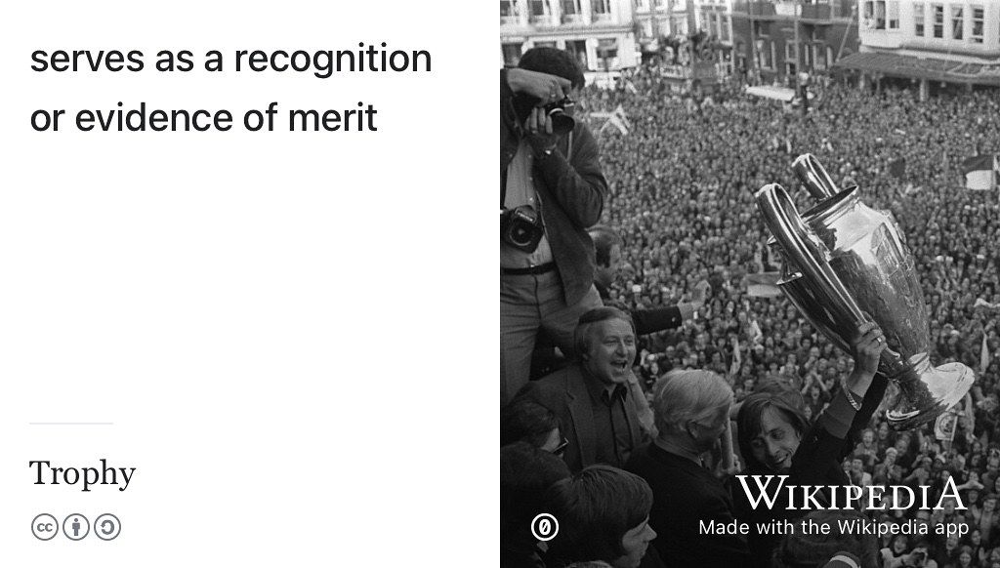
```

(ref:captiontrophy) Have you won any prizes or trophies? If you have, make sure you describe *what* your prizes were awarded for and any ranking associated with them, as discussed in the text below. You're not just blowing your own trumpet, but clearly demonstrating to your reader that  *somebody else* (besides yourself) recognised and rewarded your achievements. [CC0 public domain](https://creativecommons.org/publicdomain/zero/1.0/deed.en) picture of [Johan Cruyff](https://en.wikipedia.org/wiki/Johan_Cruyff) holding the [European Champion Clubs' Cup](https://en.wikipedia.org/wiki/European_Champion_Clubs%27_Cup) in 1972 from the [Nationaal Archief](https://en.wikipedia.org/wiki/Nationaal_Archief) on Wikimedia Commons [w.wiki/6h5t](https://w.wiki/6h5t) adapted using the [Wikipedia App](https://apps.apple.com/us/app/wikipedia/id324715238) ⚽️


If you've won any interesting awards or honours be sure to mention them, because they provide evidence to the reader that a third party has endorsed you. *Other* people think you are good at something, and this says much more than *you* thinking you're good at something. You'll typically need a bit more than this:

```md
* Awarded the Poppleton University scholarship for excellence
```

Congratulations, but how many people were awarded that prize? How many applicants or entrants were there and what percentage were successful? Was it a regional, national or global award? How frequently is the award given? It is unlikely that your reader will have heard of the award unless it is widely known. You might talk about your ranking e.g.

```md
* Won third prize in the flibbertigibbet competition
```

Again, congratulations, but `third prize` out of how many?

* `3/3`? Not so impressive
* `3/30`?
* `3/300`?
* `3/3000`? More impressive

 Numbers can speak louder than words, so if you're going to mention awards, quantify^[an approximation will do if you don't have exact figures] where you can so the reader can understand what the prize was for. *YOU* may well be intimately acquainted with the [international flibbertigibbet competition](https://en.wikipedia.org/wiki/Flibbertigibbet) but your reader probably won't of heard of it, so give some context. 
 
 Finally, your `awards` section might also include any courses you've done *outside* of the formal (compulsory) and university courses described in your `Education` section^[External courses demonstrate your learning interests beyond just ticking the boxes of what your University requires of you for your formal education]. Extra skills and knowledge you've picked up from [Massive Open Online Courses](https://en.wikipedia.org/wiki/Massive_open_online_course) (MOOCs) or any other credentials you've collected such as those described in sections \@ref(mooc) and \@ref(otherbadges), are worth mentioning. 🏆

### Your Optional Extras: Skills? Hobbies? Misc? {#misc}
If you have anything else you want to highlight besides your `Education`, `Experience`, `Projects`, `Leadership and Awards` you *may* still have room for one more optional section. Try to come up with better titles for this section than vague headings like: 

* `MISCELLANEOUS` or `OTHER...`: Yawn, if you don't really care what this section is about, why will your reader? 🥱
* `EXTRACURRICULAR`: Something like `PROJECTS` or `EXPERIENCE` might sound more interesting? 
* `RELEVANT...` & `NOTABLE`: If it wasn't *relevant* or **notable**, why would it even be on your CV in the first place?
* `HOBBIES` &  `INTERESTS`: See figure \@ref(fig:quidditch-fig) 
* `ADDITIONAL INFO`: Reading between the lines: *“Dear reader: I'm not really sure what to call this section, you figure out what it is all about because I can't be bothered”*

```{r quidditch-fig, echo = FALSE, fig.align = "center", out.width = "98%", fig.cap = "(ref:captionquidditch)"}
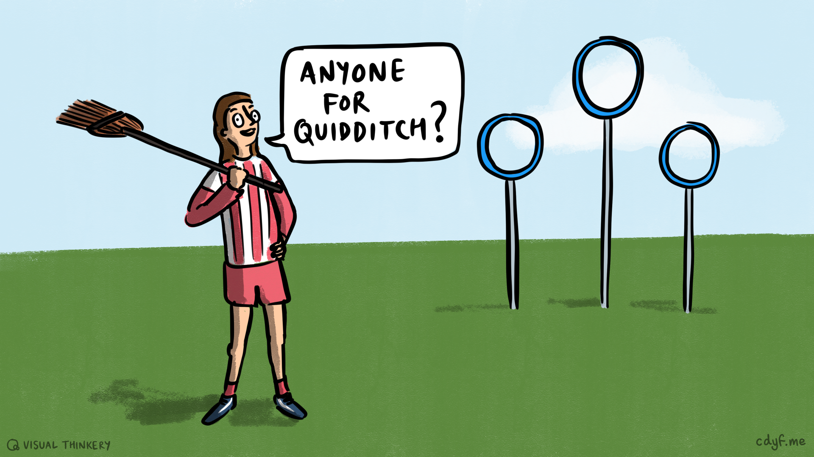
```
(ref:captionquidditch) It is debatable which, if any, of your hobbies should go on your CV. You might get lucky and your interviewer(s) will share your esoteric passion for [Quidditch](https://en.wikipedia.org/wiki/Quidditch_(real-life_sport)) (say). [@quidditch] However, such coincidences are unlikely so if you *do* list your hobbies and interests, think carefully about *WHY* you are mentioning them and *WHAT* skills, knowledge or experience you are trying to demonstrate to potential employers. [Anyone for Quidditch](https://en.wikipedia.org/wiki/Anyone_for_tennis%3F) sketch by [Visual Thinkery](https://visualthinkery.com/) is licensed under [CC-BY-ND](https://creativecommons.org/licenses/by-nd/4.0/)

Vague titles like `MISCELLANEOUS` sound like dumping grounds for your leftovers, added as an afterthought. If they are worth mentioning, they deserve a more interesting title. If you're thinking of having a section dedicated to:

* `SKILLS`: Keep it short, see section \@ref(care)
* `PROFILE`, `SUMMARY` or `PERSONAL STATEMENT`: These often fit better in a covering letter, where you tailor them to the job rather than writing a generic one-size-fits-all marketing spiel. See sections \@ref(covering-letters) and \@ref(bullshit)
* `LANGUAGES`: might not deserve their own section, but if you are multilingual, you could potentially fit the natural languages you speak in a `SKILLS` section and indicate your level of fluency with the [Common European Framework of Reference for Languages](https://en.wikipedia.org/wiki/Common_European_Framework_of_Reference_for_Languages) (CEFR), see section \@ref(care)

Adding a `HOBBIES AND INTERESTS` section could add a bit more colour and personality to what can otherwise be a dry list of facts. However, it is debatable how many (if any) hobbies and interests you should list on your CV. For a one-pager you're usually pushed for space and looking for things to edit *out* (rather than add in), so if you're going to list hobbies, I'd stick to those that are relevant to the job or those that demonstrate particular transferrable or soft skills. Organising or participating in team sports is a good example of a relevant hobby as it provides evidence of your teamwork, commitment, reliability etc, see figure \@ref(fig:quidditch-fig). Other collaborative activities outside of sport will also demonstrate your communication skills. [@hobbies]

The fact that you enjoy `swimming`, `reading`, `football`, `cooking`, `music`, `travel` and `hiking` is vague and pretty boring, making it unlikely to be a factor in the decision to invite you to interview. There's nothing *wrong* with these pastimes, but they are very common so there's not much point mentioning them on your CV *unless* you give more detail, for example:

* coached a swimming team
* trained as a mountain leader
* gained certification in a musical instrument
* organised, hosted and participated in a book club
* won some awards for your hobby, like a [black belt](https://en.wikipedia.org/wiki/Black_belt_(martial_arts)) or chess championship for example
* regularly participated in or organised competitive sports matches (for example)

In this case, the *way* you have engaged with your hobbies might demonstrate some of your softer, communication and leadership skills. So in this context, your hobbies *are* worth talking about if you have any space left. However, if they are just hobbies that enable you to amuse yourself, you should probably leave them out as they are unlikely to be a factor in the decision to invite you to interview. Sure, they add colour to your CV, but you've probably got more interesting and important things to say about who you are.

Of course, you *might* get lucky and your interviewer(s) could be intrigued by (or even share) your esoteric passion for [Quidditch](https://en.wikipedia.org/wiki/Quidditch_(real-life_sport)) (say), but you can't rely on it. So, I reckon if you're going to mention hobbies and interests at all then ...

* pick the unusual hobbies that make you unique
* describe the interests that add some colour and personality to your CV that could spark conversations in interviews
* be specific, e.g. `reading japanese novels from 20th century` sounds more interesting and convincing than just `reading` 
* highlight any `actions` you've taken, see chapter \@ref(verbalising)

... or just leave them out altogether. That option is up to you.❓

### Show Your C.A.R.E: Spell it out or Leave it out {#care}

You may be tempted to dedicate a whole section on your CV to `SKILLS`, particularly the technical ones. Maybe it makes you feel good listing them all in one place like a stamp collection. If you're going to have a `SKILLS` section, keep it short. Why? Let's imagine, that like [Rick Urshion](Rick_Urshion.pdf), you include Python in a long list of skills, with its own dedicated section. There are at least five problems with Rick's not so skilful approach:

1. ❎ **No `Context`** to give the reader an idea of where he's developed or used his Python skills. Was it during his education, as a part of his work experience or his personal projects? We don't know because he doesn't say.  
1. ❎ **No `Actions`** to demonstrate what he's *done* with his Python skills. So Rick claims he knows Python. So what? What did he use them for? We don't know because he hasn't told us.
1. ❎ **No `Results`** given for what the outcome of using the skills was. Did he save his employers some money? Did he make something more efficient? Did he learn some methodology? We will never know.  
1. ❎ **No `Evidence`** to support his claims. Perhaps he DOES have Python skills, perhaps he DOESN'T. Is he telling lies and peddling fake news (see section \@ref(oversell))? It's difficult to tell.
1. ❎ **No `C.A.R.E.`**  There's no story told for that skill, see figure \@ref(fig:gallagher-fig). This makes for a very dull and boring read. Yawn. NEXT! 🥱

```{r gallagher-fig, echo = FALSE, fig.align = "center", out.width = "100%", fig.cap = "(ref:captiongallagher)"}
knitr::include_graphics("images/whats-the-story.jpeg")
```

(ref:captiongallagher) So *[(What's your Story) ~~Morning~~ Coding Glory?](https://en.wikipedia.org/wiki/(What%27s_the_Story)_Morning_Glory%3F)* [@whatsthestory] What is the `Context`, the `Actions`, the `Results` and the `Evidence` for the stories that you are trying to tell? Show your `C.A.R.E.` in storytelling. CC BY portrait of [Noel Gallagher](https://en.wikipedia.org/wiki/Noel_Gallagher) by [alterna2.com](https://alterna2.com/) on Wikimedia Commons [w.wiki/3bimy](https://w.wiki/3bim) adapted using the [Wikipedia app](https://apps.apple.com/us/app/wikipedia/id324715238) 🎸

So, this doesn't mean Rick shouldn't mention his Python skills. Where he can, he needs to give us the `C`ontext, `A`ction, `R`esult and `E`vidence (`C.A.R.E.`) of his story described in section \@ref(care). This will make his Python story much more convincing and interesting to read. Showing a bit of `C.A.R.E.` will improve his chances of being invited to interview. Really spell it out for your reader. 

This applies to soft skills too, not just hard technical skills. It is often better to mention the context in which you've used the skills you mention on your CV. So, if you're going to have a skills section:

* keep it short, no more than two or three lines on a one-page CV
* stick to your strongest and most relevant skills that you are comfortable to answer questions on in your interview, rather than an exhaustive encyclopædic inventory
* avoid vague metrics of skill like `beginner`, `intermediate` and `advanced` as these are very subjective and won't help the reader much. You might under-estimate or over-estimate your skill level anyway. Some people choose to quantify coding skills with `years of experience` or the `lines of code` (LoC), but these metrics are flawed. [@linesofcode] 
* avoid listing mass marketed products like [Microsoft Office](https://en.wikipedia.org/wiki/Microsoft_Office) (e.g. Word, Excel etc) as a skill. They are *not* generally very interesting skills because almost *everyone* has them. They won't set you apart much from your competition, so don't waste valuable space talking about office applications unless you've done something interesting with them, like some advanced integration with other software. Saying your can use `Office` is a bit like saying you can `read` and `write`. They are fundmental skills that employers will expect. Cloud services can be a slightly different matter, see section \@ref(techie).

If you're a computer scientist, you also have demonstrable `meta` skills like the ability to learn things quickly. You can also think logically and critically, reason, problem solve, analyse, generalise, decompose and abstract - often to tight deadlines. These [computational thinking](https://en.wikipedia.org/wiki/Computational_thinking) skills are future-proof and will last longer than whatever technology happens to be fashionable right now. Employers are often more interested in these `meta` capabilities and your potential than in any specific technical skills you may or may not have.

## Bird's Eye View
Having zoomed in on the details of sections you're likely to have, we'll zoom back out to take a [bird's eye view](https://en.wikipedia.org/wiki/Bird%27s-eye_view) of your whole CV. The issues in this section apply to the whole of your CV, rather than individual sections.

### Your Style {#style}

Making your CV look good can take ages, but a well presented CV will stand out from a pile of genericaly formatted Word documents. It is worth making an effort to style carefully and consistently. The [typography](https://en.wikipedia.org/wiki/Typography) of your CV matters because it helps conserve your readers attention, a finite resouce that you don't want to waste. A poorly presented CV is the equivalent of turning up to an interview in a swim suit and flip flops. First impressions count, you've a few seconds to grab your readers limited precious attention. [@whytypographymatters]

```{r cvwork-fig, echo = FALSE, fig.align = "center", out.width = "100%", fig.cap = "(ref:captionworkcv)"}
knitr::include_graphics("images/CV need a little work.png")
```
(ref:captionworkcv) Does your CV need a little work? The truth is your CV is never finished, you will be continuously developing, debugging and releasing it throughout your life. It's such a crucial document because it will determine if you are invited to interview. Any time you spend improving it is a good investment. CV work sketch by [Visual Thinkery](https://visualthinkery.com) is licensed under [CC-BY-ND](https://creativecommons.org/licenses/by-nd/4.0/)

Seemingly trivial typographical details can make a big difference to the overall look and feel of your document. The [devil is in the details](https://en.wikipedia.org/wiki/The_devil_is_in_the_details), for example the repeated text [the quick brown fox jumps over the lazy dog](https://en.wikipedia.org/wiki/The_quick_brown_fox_jumps_over_the_lazy_dog) in a bulleted list doesn't use a proper indent...

• `The quick brown fox jumps over the lazy dog. The quick brown fox jumps over the lazy dog. The quick brown fox jumps over the lazy dog. The quick brown fox jumps over the lazy dog. The quick brown fox jumps over the lazy dog. The quick brown fox jumps over the lazy dog.  The quick brown fox jumps over the lazy dog`

... whereas the same text below *does* use a proper indented bullet. The latter is easier to read, especially when you have multiple bullet points:

* `The quick brown fox jumps over the lazy dog. The quick brown fox jumps over the lazy dog. The quick brown fox jumps over the lazy dog. The quick brown fox jumps over the lazy dog. The quick brown fox jumps over the lazy dog. The quick brown fox jumps over the lazy dog.  The quick brown fox jumps over the lazy dog`

You should avoid using underline because it is ugly and makes your CV harder to read, not easier. Underline was designed for typewriters, not computers or web browsers, see figure \@ref(fig:underline-fig)

```{r underline-fig, echo = FALSE, fig.align = "center", out.width = "100%", fig.cap = "(ref:captionunderline)"}
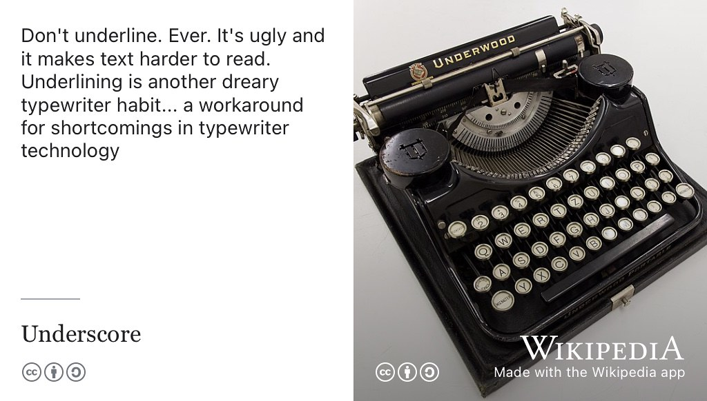
```

(ref:captionunderline) Avoid using [underline or underscore](https://en.wikipedia.org/wiki/Underscore) on a CV. It's ugly and makes your text harder to read. Underlining is a dreary typewriter habit... a workaround for shortcomings in typewriter technology. The only exception to this rule is [hyperlinks](https://en.wikipedia.org/wiki/Hyperlink) which are sometimes underlined to distinguish them from ordinary text. [@underlineno] Creative Commons [BY SA](https://creativecommons.org/licenses/by-sa/4.0/deed.en) picture of a typewriter by GodeNehler on Wikimedia Commons [w.wiki/Ak6w](https://w.wiki/Ak6w) adapted using the Wikipedia app.  

These *seemingly* trivial typographical details like fonts and formatting all add up to make your CV look more professional. Neglect these details at your peril. Having a poorly formatted CV is like turning up to a job interview a swimsuit. Presentation matters. You'll want more of a business suit than a swim suit and a [good template can take care of some of this stuff for you](https://latex4year1.netlify.app/cv). [@latex4year1]

### Porting Your Future {#pdf}

Whatever your typographical style is, portable document format (`*.pdf`) is the safest way to deliver it. It's called *portable* for a reason. While Microsoft Word is fine for editing, it is difficult to ensure that a Word document doesn't get mangled by transmission via the web, email or even Microsoft's own products like Teams! PDF is much safer, you can be more confident that it will work well on a range of different operating systems and devices. Try opening a Word document on a range of different smartphones and tablets and you'll see what I mean. It can sometimes help your reader if you give your CV file a descriptive name, especially if it is being read by a human and not a robot. 🤖

* ❌ `cv.pdf` (not a very descriptive filename)
* ✅ `ada_lovelace.pdf`(a descriptive filname)
* ❌ `cv-version1-final-FINAL-version-USE-THIS-ONE.pdf` (reveals more about you than you might want to!)
* ✅ `alan_turing.pdf`(a descriptive filname)
* ❌ `one-page-version.pdf` (unhelpful)


It's fine to author your CV in Microsoft Word, but you'll want to save it as (or print to) PDF to make it more platform independent. LaTeX and [overleaf.com](https://www.overleaf.com) can be used to create professional PDFs and there are plenty of good templates at [overleaf.com/gallery/tagged/cv](https://www.overleaf.com/gallery/tagged/cv). See [Getting started with LaTeX (LaTeX4year1)](https://latex4year1.netlify.app/) if you've not used LaTeX before, or you need to refresh your memory. [@latex4year1]

### What's Your Story, Coding Glory? {#storycare}

One way to structure descriptions of items within each section of your CV is to use **C**ontext, **A**ction, **R**esult and **E**vidence (C.A.R.E.) to tell your stories. What's your story, coding glory? [@whatsthestory] The `C.A.R.E.` method can also be useful for structuring answers to interview questions, especially if you get nervous. So for example, rather than just listing `Python` as a skill, you could tell the reader more about the context in which you've used python, what you actually did with it and what the result was. You really need to spell it out.

* **CONTEXT**: So you've used `Python`, but in what context? As part of your education? For a personal project? As a volunteer? In a competition? All of the above?
* **ACTION**:  What did you *do* with `Python`? Did you use some particular library? Did you integrate or model something? What verbs can you use to describe these actions, see chapter \@ref(verbalising)
* **RESULT**: What was the result and how can you measure it? You picked up some new skills? What was the impact? Perhaps you made something that was inefficient and awkward into something better, cheaper or faster? Some things are hard to measure but you should quantify results where you can.
* **EVIDENCE**: Where evidence exists, you should highlight it. That could be a quantification, for example describing a result in numbers (see `as measured by` below) or it might be badges or certification described in chapter \@ref(achieving). If you're talking about software, point to a copy online if you can, see section \@ref(portfolio). Nothing says “I can build software ...” quite like “ ... and here's one I made earlier”.

You don't have to stick rigidly to the order C.A.R.E. as long as they appear somewhere. For example, recruiters at Google (see figure \@ref(fig:lopez-vid)) advise candidates to describe their experience and projects using this simple pattern:

````md
* Accomplished [X], as measured by [Y], by doing [Z]
````

Where *accomplished* is `Result`, *measured by* is `Evidence` and *doing* is the `Action`. So instead of just saying:

````md
* Generated reports for end users
````

You could say:

````md
* Generated daily reconciliation report for team by automating workflow of 8 different tasks
````

The latter is better because it is more specific, captures the result (`accomplishment`), by giving evidence (`8 different tasks`) and talks about the actions (the `doing` part). Choose the verbs you use carefully, see chapter \@ref(verbalising) for examples.

### Your Numbers {#quantification}
Carefully chosen verbs and other words are a crucial part of how you communicate with the readers of your CV. Your words will be even more convincing if you back them up with numbers by _quantifying_ any claims that you make. 

```{r numbers-fig, echo = FALSE, fig.align = "center", out.width = "98%", fig.cap = "(ref:captionnumbers)"}
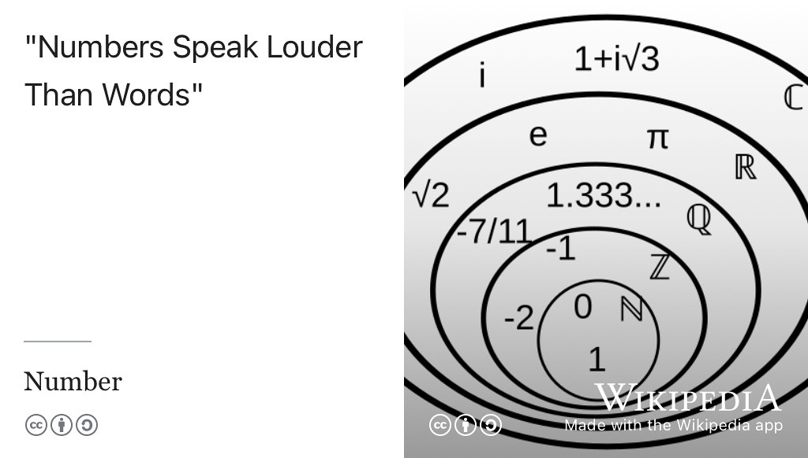
```

(ref:captionnumbers) [Numbers](https://en.wikipedia.org/wiki/Number) speak louder than words. Some integers and percentges will go a long way to quantifying and evidencing any claims you make on your CV. You don't need complex numbers, and you usually don't need to give more than two significant figures for your degree result (for example). [CC-BY SA](https://creativecommons.org/licenses/by-sa/4.0/deed.en) image of complex, real, natural and rational numbers by HB on Wikimedia Commons [w.wiki/Dkm6](https://w.wiki/Dkm6)


For example:

````md
* Helped younger students learn mathematics
````

...is a good start but vague, and `helped` is a weaker verb that could be strengthened like this

````md
* Facilitated the learning of three mathematical concepts: differential calculus, trigonometry and statistical distributions
* Communicated weekly in face to face meetings with a group of 8 students over one year to improve their grades by 5 percentage points in mock exams
````

Sometimes numbers speak louder than words, so make sure you quantify any claims you make on your CV wherever you can.

### Your Length {#length}
How long should your CV be? Many people start with a two page CV, which is a sensible starting point shown in figure \@ref(fig:oneortwopager-vid). Your two pager might serve as a repository of *everything you've ever done*, but it's also advisable to [also create a one page Résumé](https://www.cv-library.co.uk/career-advice/cv/how-long-cv-be/). [@howlong;@armtips] You could tihnk of your one pager as the customised *espresso* version, describing the most important and relevant stuff for that whichever job your aiming it at.


```{r oneortwopager-vid, echo = FALSE, fig.align = "center", out.width = "99%", fig.cap = "(ref:captiononeortwopager)"}
knitr::include_url('https://www.youtube.com/embed/0abDOKHS5T0')
```

(ref:captiononeortwopager) How long should your CV be? Should you write a two page European style CV or an American style résumé (one pager)? You can also watch the  5 minute video embedded in this figure at [youtu.be/0abDOKHS5T0](https://youtu.be/0abDOKHS5T0). [@youtube-resume-or-cv] 🇺🇸🇪🇺

At this stage in your career you *should* be able to fit everything on to one page. However, it can be challenging and time consuming squeezing it all on, see figure \@ref(fig:shorterletter-fig).

```{r shorterletter-fig, echo = FALSE, fig.align = "center", out.width = "98%", fig.cap = "(ref:captionshorterletter)"}
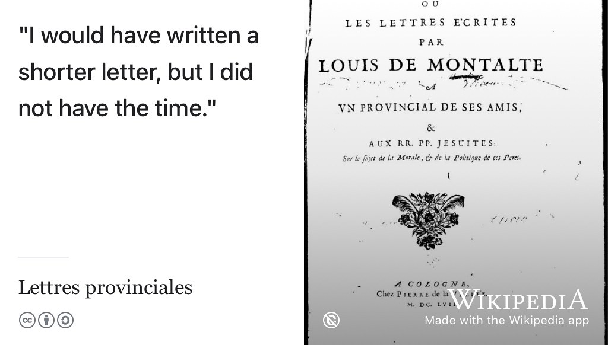
```

(ref:captionshorterletter) I would have written a shorter ~~letter~~, ~~CV~~, Résumé but I did not have the time. This quote (or meme) is frequently attributed to Blaise Pascale's  *[Lettres provinciales](https://en.wikipedia.org/wiki/Lettres_provinciales)* [@shorterletter]. Public domain image by Gallica on Wikimedia Commons [w.wiki/3Uzn](https://w.wiki/3Uzn) adapted using the [Wikipedia app](https://apps.apple.com/us/app/wikipedia/id324715238) 🇫🇷

It takes more time to write less. Writing a one page résumé is a valuable exercise, because it forces you to distill and edit out any filler or fluff, which you sometimes find on two page undergraduate or graduate CVs. It is much better to have a strong one-page résumé than a weaker two-page CV that is padded out with filler to make up the space, as described in the video in figure \@ref(fig:oneortwopager-vid). Adding more features (pages and content) to your CV doesn't necessarily make it better. Sometimes adding more features to your CV will make it worse, as shown in figure \@ref(fig:morefeatures-fig).

```{r morefeatures-fig, echo = FALSE, fig.align = "center", out.width = "98%", fig.cap = "(ref:captionmorefeatures)"}
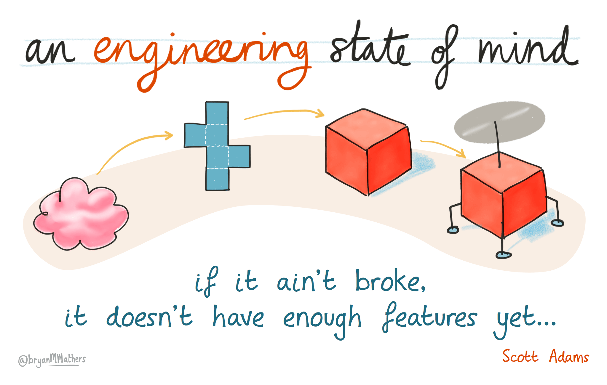
```

(ref:captionmorefeatures) If it ain't broke it doesn't have enough features yet. Adding more features to software doesn't necessarily make it better. Likewise, adding more pages and content to your CV or résumé won't always improve it. It's often better to be precise and concise, rather than bloated and potentially more buggy. [An engineering state of mind](https://bryanmmathers.com/an-engineering-state-of-mind/) by [Visual Thinkery](https://visualthinkery.com/) is licensed under [CC-BY-ND](https://creativecommons.org/licenses/by-nd/4.0/), with help from Dilbert cartoonist [Scott Adams](https://en.wikipedia.org/wiki/Scott_Adams)

If you're struggling to fit all the information onto a one page résumé, revisit each section and item carefully: 

* Is there anything you can cut? 
* Can you save a wasteful word here or a lazy line there? 
* Check for any spurious line breaks, like a line with just one or two words on it, because every pixel counts.

Your two page CV is still a good store of stuff you might want to add to customised one-page résumés. If you find yourself cutting important stuff, you could list it somewhere else (like LinkedIn etc, see section \@ref(portfolio)) and link to it from your CV. 

### Verbs First: Lead With Your Actions {#verbsfirst}

A simple but effective technique for emphasising what you have done, rather than just what you know, is to start the description of it with a verb. Employers don't just want to know what you know, but what you have actually done. So, for example, instead of saying e.g.

````md
* In my second year CS29328 software engineering module I used Java, Eclipse and JUnit to test and build an open source Massively Multiplayer Online Role-Playing Game (MMORPG)
````

you could say:

````md
* Built and tested a large open-source codebase using Eclipse, Ant, JUnit and Jenkins”
````

followed by:

````md
* Added and deployed new features to a Massively Multiplayer Online Role-Playing Game (MMORPG) in Java
````


The latter examples get to the point much quicker and avoid the problem of using `I, me, my...` too much which can sound self-centred and egotistical. Although your CV is all about you and it is natural to have a few personal pronouns in there, too many can look clumsy and give the wrong impression. Choose the verbs you use carefully, see chapter \@ref(verbalising) for examples.

### Your Links and LinkedIn {#links}

Adding web links (hyperlinks) to your CV can add important Context, Action, Results and Evidence  (`C.A.R.E.`) to your stories, see \@ref(care). Links can strengthen your CV by clarifying assertions you make without using up lots of valuable space or adding too many words. An example using [LinkedIn.com](https://www.linkedin.com/) is shown in figure \@ref(fig:lovelace-fig).

```{r lovelace-fig, echo = FALSE, fig.align = "center", out.width = "98%", fig.cap = "(ref:captionlovelace)"}
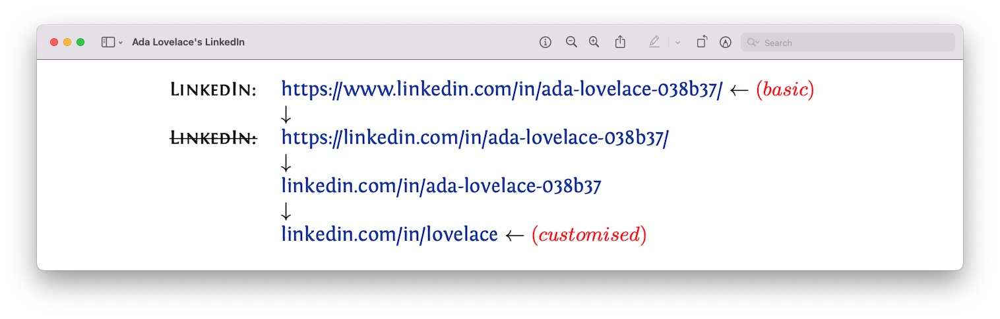
```
(ref:captionlovelace) Adding clickable hyperlinks is a simple way to provide context and add evidence to some of the stories on your CV, like [Ada Lovelace](https://en.wikipedia.org/wiki/Ada_Lovelace) has done on her CV here. If you're adding your LinkedIn handle, make sure you [change your default public profile URL](https://www.linkedin.com/help/linkedin/topics/6042/6054/87), (the basic `.../in/handle`) to remove the randomly generated alphanumeric string at the end, like the `038b37` example here. [@customlinkedin;@claimcustomurl] You can also remove any ugly `http`, colons `::`, forward slashes  `//`, `www` and trailing `/` in URLs which are distracting noise. Just make sure links are clickable in your `ada-lovelace.pdf` and don't [404](https://en.wikipedia.org/wiki/HTTP_404) if anyone clicks on them. If you spell the link out explicitly including the domain name, it will be clearer to the reader *exactly* what you are linking to and those links will still work when printed on paper too.^[Yes, some dinosaurs still print things out] So a customised `linkedin.com/in/lovelace` is clearer than a more cryptic `My Linked In` or the basic ugly default of `https://www.linkedin.com/in/ada-lovelace-038b37`. 

Links can provide `Context`, `Action`, `Result` and `Evidence` (see `C.A.R.E.` in section \@ref(care)) by quantifying and substantiating any claims that you make. Links demonstrate what you've done and which communities you've been a part of. For example, you might says things like:

```md
* Built a thing called example.com
```

This shows that the thing you built was substantial enough to have its own domain. It also says “I like building things. Look at this thing I built just for fun, its really cool”. Or you might say:

```md
* Elected as a representative for hacksoc.com
```

The link shows you were part of a community: “I was part a bigger thing... ” you might not have heard about but you can find out about here. You might also say:

```md
* Competed at hack-to-the-future.com part III
```

Reading between the lines: “I really enjoy learning from other people by going to hackathons and competitions”

... and so on. So links are crucial features of your CV and an interested reader *may* even follow them. Treat links with respect and they will support your goals and help your readers. Invest some time thinking about how you word the link text, and how they would be understood out of context. Make sure that:

* your hyperlinks are [readable and descriptive](https://readabilityguidelines.co.uk/content-design/links/) [@readable]  
* your hyperlinks are clickable in the PDF. Don't expect your reader to cut and paste (or even type) URLs, they are too busy. If they are clickable, people are much more likely to follow them
* your hyperlinks are explicit and paper-proof: links with opaque titles like  “[My LinkedIn](linkedin.com/in/duncanhull)”, “[click here](https://www.w3.org/QA/Tips/noClickHere.html)”, and “[My Projects on Github](https://github.com/dullhunk)”  won't work well when printed on paper unless you explicitly spell the URL out like this: 
    + [linkedin.com/in/duncanhull](https://uk.linkedin.com/in/duncanhull) 
    + [github.com/dullhunk](https://github.com/dullhunk)

Some people still print CV's out so it is worth making links work on paper as well as online, see [to print or not to print — a CV, that is](https://bbc.in/3zXv6zr) [@printcv]

Besides LinkedIn you could include public profiles from [github.com](https://docs.github.com/en/free-pro-team@latest/github/setting-up-and-managing-your-github-profile/about-your-profile), [devpost.com](https://help.devpost.com/hc/en-us/articles/360021734632-Update-your-profile-and-username), [hackerrank.com](https://www.hackerrank.com/leaderboard) and [stackoverflow](https://medium.com/@rhamedy/contribution-debt-why-how-to-contribute-to-stack-overflow-a69d4bd50d0c), see section \@ref(portfolio) [@stackoverflow]. You can also link to personal projects, any articles you've published or your blog if you have one. Obviously, you need to be careful about what you link to and what employers can find out about you online. They *will* Google you. So keep it professional and, as we discussed in a section \@ref(signposts3), if you're not already, be wary of social media.

::: {.rmdnote}
(ref:codingcomment)

LinkedIn is much more than a tool for publishing your CV or résumé because it also allows you to:

* search and apply for jobs
* create a digital portfolio that is publicly available^[Obviously, you might want to be careful about what information you put out there!]
* connect with professionals, think social media for jobs

Chapter \@ref(finding) looks at job searching in more detail but for now just note the similarities and differences between LinkedIn, CVs and résumés outlined in table \@ref(tab:linkedintable). Some of these differences also apply to other places online where you might augment your CV with extra information such as github, devpost and others mentioned in section \@ref(links) and \@ref(portfolio).

:::

So, LinkedIn can be a useful tool for job hunting but it's a different beast to traditional CV's, some of these differences are shown in table \@ref(tab:linkedintable)

```{r linkedintable, echo = FALSE}
linkedin_table <- tibble::tribble(
    ~ "LinkedIn"                        , ~ "CV or Résumé",     
  "Dynamic document that you can constantly update"    , "Static document, providing a snapshot that can't be updated once you've  sent it",       
  "Generally speaking, no length limit"     , "(ref:lengthcell)",
  "Public or semi-public document, more like social media"    , "Private document, should only be seen by those employers you send it to (anti-social media if you like)",      
  "Only one profile, you can't easily transfer connections if you open more than one account"    , "You might create multiple CV's that emphasise different skills and knowledge, or have different lengths such as a one page résumé and two page CV",  
  "Generic, allows employers and recruiters to target you"    , "Specific, can be targeted to a given employer or vacancy",  
)
knitr::kable(linkedin_table, caption = "Comparison of LinkedIn with conventional CV's and résumés. The two mediums have a lot in common but also provide different communication channels which can be complementary, e.g. you could include your LinkedIn profile on your CV to augment it.", booktabs = TRUE)
```

<!--this is a nasty hack to get references into table cells-->
(ref:lengthcell) Limited length, typically one or two pages (for a graduate), see section \@ref(length)


### AI & Robot Proofing Your CV {#robotproof}

It's a good idea get feedback from as many different sources as you can on your CV. By *sources* I don't just mean humans, but also robots and AI, see figure \@ref(fig:cvalgos-fig). Larger employers routinely use robotic [Applicant Tracking Systems](https://en.wikipedia.org/wiki/Applicant_tracking_system) (ATS) to log and trace your application and the algorithms used often struggle to identify headings correctly in two column formats.

```{r cvalgos-fig, echo = FALSE, fig.align = "center", out.width = "100%", fig.cap = "(ref:captioncvalgo)"}
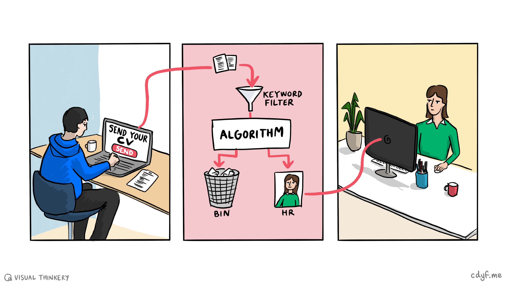
```

(ref:captioncvalgo) If you're applying to larger employers, your CV will be sorted by algorithms and AI long before a human (in [HR](https://en.wikipedia.org/wiki/Human_resources)) gets to read it. Is yours destined for the bin or an actual human making decisions about who to interview? One way to find out is by getting automated feedback from a machine, see suggestions below. This will ensure your CV is as robot proof as possible. Big CV algorithm by [Visual Thinkery](https://visualthinkery.com/) is licensed under [CC-BY-ND](https://creativecommons.org/licenses/by-nd/4.0/) 🤖


Algorithmically powered “résumé robots” are unlikely to have arms and legs like the one in figure \@ref(fig:machines-fig), but they *will* be looking for keywords and standard headings in your CV. [@airesume] You can get automated feedback from a range of different software systems, though it is a good idea to remove any personal information like phone numbers and emails before using these free services. You might also want to check what their privacy policy says about what they do with your (very) personal data. Résumé robots include:

* [careerset.com](https://careerset.com): a free service provided by a UK based company, CareerSet Ltd. If you're a University of Manchester student, you can login using your University credentials at [careerset.com/manchester](https://careerset.com/manchester)
<!--* [resume.io](https://resume.io), a free service provided by a Dutch company, Imkey BV not really CV checker-->
* [enhancecv.com](https://enhancv.com): Enhance CV resume builder claims it can help you get hired at top companies
* [jobscan.co](https://www.jobscan.co): a free service provided by an American company
* [kickresume.com](https://www.kickresume.com/): AI-powered resume builder also does cover letters
* [roastmyresu.me](https://roastmyresu.me/) How bad is your resume? Get your resume “roasted” by a sarcastic and serious AI. 🔥

Lots more tools like this can be found at:

* [google.com/search?q=resume+checker](https://www.google.com/search?q=resume+checker)
* [google.com/search?q=CV+checker](https://www.google.com/search?q=cv+checker)


```{r machines-fig, echo = FALSE, fig.align = "center", out.width = "100%", fig.cap = "(ref:captionmachines)"}
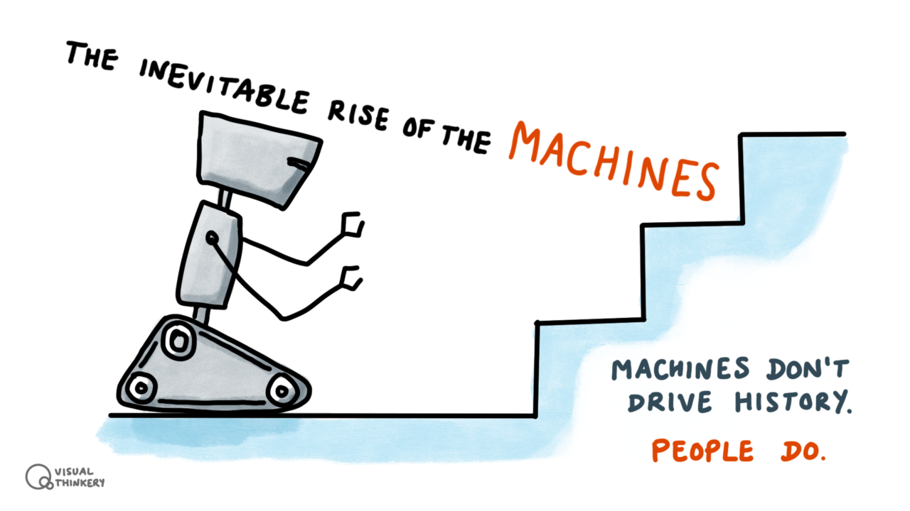
```

(ref:captionmachines) Just like the [daleks](https://en.wikipedia.org/wiki/Dalek) in [Doctor Who](https://en.wikipedia.org/wiki/Doctor_Who), résumé robots often struggle to get up the stairs. [@doctorwho] Although they typically don't have arms, legs (or even wheels) various kinds of robots and AI are likely to play an important role in decisions made about if you are worth interviewing, especially if you're applying to bigger organisations. Make sure your CV is AI & résumé robot friendly by getting feedback from a robot. [Machines](https://bryanmmathers.com/machines/) by [Visual Thinkery](https://visualthinkery.com/) is licensed under [CC-BY-ND](https://creativecommons.org/licenses/by-nd/4.0/) 🤖

Besides providing feedback on the content of your CV, using these systems can help address issues such as the use of tables, columns or layout which may cause problems for some systems. For example, some Applicant Tracking Systems (ATS) will erroneously ignore the second column of a two-column CV because they can't parse the [PostScript](https://en.wikipedia.org/wiki/PostScript) reliably to identify columns. [@twocolbad] Some things to check with automated CV screens:

* Have you used standard headings for the sections? Unusual or non-standard section headings like `most proud of` (see Penelope Tester's CV in section \@ref(pen-tester)) maybe ignored or misunderstood
* Have you used a range of stronger verbs to describe your actions, see chapter \@ref(verbalising)?
* Is your layout and design robot friendly? Sometimes tables and two column layouts can get *horribly* mangled and misinterpreted, see [what happens to tables and columns in an applicant tracking system](https://www.jobscan.co/blog/resume-tables-columns-ats/) [@jobscan]

### Spellchecking {#spelling}
Bots, grammar checkers, Artificial Intelligence (AI) and spell checkers can help improve your written applications and CV. However, you can't rely on machines and their algorithms completely. The résumé robots described in section \@ref(robotproof) will just encode the prejudices of whoever wrote their algorithms and whatever bias there was in the data it was trained on, see section \@ref(machines). Basic spellcheckers can't be relied on completely either, as shown in the poem below:

```

Eye halve a spelling checker
It came with my pea sea
It plainly marques four my revue
Miss steaks eye kin knot sea

Eye strike a key and type a word
And weight for it to say
Weather eye am wrong oar write
It shows me strait a weigh

As soon as a mist ache is maid
It nose bee fore two long
And eye can put the error rite
Its rare lea ever wrong

Eye have run this poem threw it
I am shore your pleased two no
Its letter perfect awl the weigh
My chequer told me sew

---Anon
```

While automation can help improve your writing, ultimately there is no substitute for people (you know: actual *humans*) reading your CV, and the more people that read it the better. This could be potential employers, your critical friends shown in figure \@ref(fig:wonderfuldarling-fig) or just reading it **out loud** to yourself described in section \@ref(dogfooding).

### Your References {#referees}

You might be tempted to put your referees details on your résumé. Don't bother because;

* references waste valuable space. You can say *much* more interesting things about yourself than who your referees are
* references aren't needed in the early stages of a job application anyway. Employers typically ask for your referees *much* later, when you've been offered (or are about to be offered) the job
* references disclose personal information. Do you really want to be giving personal details out to anyone that reads your CV? It could easily be abused or misused.

It's not even worth saying ~~**REFERENCES AVAILABLE ON REQUEST**~~ - that just wastes space as well and is implied information on every CV anyway. Employers *expect* you to provide them (when they ask) so there's not much point stating the obvious.

<!--
## extra-curricular / interests / leadership / awards

student groups (especially leadership positions)
Placement in coding, programming or tech related competitions 2nd out of 100 e.g.
conference presentation
university honors, awards or scholarships
publications, papers or patents
achievements or activities outside of CS

## Don't tell me, SHOW ME!

show me the money!-->

## Breakpoints {#bp7}

(ref:breakpoint)

```md
* PAUSE ⏸️
```

* How long is your CV? How long should it be?
* One column or two column layout?
* How long should your personal statement be your CV, like [Mike Rokernel](https://www.cdyf.me/Mike_Rokernel.pdf) has for example?
* Should you put education or experience first? Which is most important?
* How many of my [hobbies and personal interests should you list?](https://www.reed.co.uk/career-advice/hobbies-and-interests-should-i-include-them-in-my-cv) [@hobbies]
* How can you beat the black hole mentioned in section \@ref(blackhole)? See [Your Résumé vs. Oblivion](https://www.wsj.com/articles/SB10001424052970204624204577178941034941330) [@oblivion]
* How many employers actually read the covering letter that accompanies your CV?

```md
* RESUME ▶️
```

## CV Checklist (B): Self-debugging Known Errors {#checklist}

It can be difficult to be **both** an *author* AND an *editor* of the same document, and your CV is no exception. Following on from the quick checklist in section \@ref(quick), this longer checklist below will help you start to self-debug [known errors](https://en.wikipedia.org/wiki/Known_error) that you may have overlooked as an author. For the *unknown* errors, you'll need help from someone (or something) else who can play the role of editor, see figure \@ref(fig:unknown-error-fig).

```{r unknown-error-fig, echo = FALSE, fig.align = "center", out.width = "98%", fig.cap = "(ref:captionunknownerrors)"}
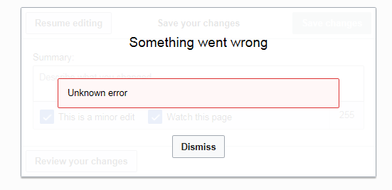
```
(ref:captionunknownerrors) Did something go wrong with your CV? Was it an unknown or a [known error](https://en.wikipedia.org/wiki/Known_error)? This self-debugging checklist below will help you identify *known errors* in your CV. To debug the more challenging *unknown errors*, see section \@ref(cvswap) below. [CC BY-SA](https://creativecommons.org/licenses/by-sa/4.0/deed.en) screenshot of *something went wrong* by Revansx on Wikimedia Commons [w.wiki/9hZD](https://w.wiki/9hZD)

Like [Atul Gawande](https://en.wikipedia.org/wiki/Atul_Gawande), I'm a believer in the power of simple checklists. [@checklist] Use this quick self-assessment checklist to squash known bugs before anyone else sees them.

1. 🔲 Does it fit comfortably on exactly one page (résumé) or two pages (CV)? Definitely not one-and-a-half pages or more than two? See section \@ref(length) Does the style look good? Is it easy on the eye? Is there adequate whitespace, not too much (g a p p y) or too little (cramped)? See section \@ref(pdf)
1. 🔲 Is your year of graduation, degree program, University and expected (and/or achieved) overall degree classification clear with GPA as a percentage? See section \@ref(education)
1. 🔲 Have you “[eaten your own dogfood](https://en.wikipedia.org/wiki/Eating_your_own_dog_food)” by reading it out loud, see section \@ref(dogfooding)? Is *everything* relevant? e.g. no swimming certificates from ten years ago?
1. 🔲 Have you spell-checked using both automatic and manual (proof-reading) techniques? See section \@ref(spelling).
1. 🔲 Have you shown you `C.A.R.E`? Are the `Contexts`, `Actions`, `Results` and `Evidence` described in section \@ref(care) clear? Have you added `context` using relevant hyperlinks that an interested reader can click on? See section \@ref(links)
1. 🔲 Is it in reverse chronological order with the most recent things **first**? Can your timeline be easily followed, with all dates clearly aligned for easy reading? See [Neil Pointer](https://www.cdyf.me/Neil_Pointer.pdf) as an example with a clear timeline using right-aligned dates.
1. 🔲 Have you avoided using too many personal pronouns? `I, me, my ...` everywhere? See section \@ref(verbsfirst)
1. 🔲 Have you made it clear what you have actually done using **prominent** `verbs`? Which kinds of verbs are missing? See chapter \@ref(verbalising)
1. 🔲 Have you given sufficient information on your education without going into too much detail? Have you mentioned courses you are studying now (*and* next semester)? See section \@ref(education)
1. 🔲 Have you **quantified** and evidenced the claims you have made where you can? See section \@ref(structure) and \@ref(quantification)
1. 🔲 Is it balanced, including both technical and non-technical (softer) skills? See section \@ref(casual)
1. 🔲 Does it have a good, clear structure? Not too many headings, around five sections for a one-pager see section \@ref(body)?
1. 🔲 Have you clearly distinguished between paid, unpaid and voluntary `EXPERIENCE`? Have you done the same for your `PROJECTS`, see section \@ref(projects)? Have you included *all* of the relevant experience that you can fit on including casual work, see section \@ref(casual)?
1. 🔲 Have you expanded the more obscure acronyms or bombarded your reader with a barrage of obscure [TLA](https://en.wikipedia.org/wiki/Three-letter_acronym)'s that they are probably not familiar with? 
1. 🔲 Have you used past tense consistently throughout e.g. `developed` not `develop`, `collaborated` not `collaborate`,`facilitated` not `facilitate`  etc? Although some of your projects and experience may be ongoing, mixing tenses doesn't look good. So try to stick to past tense consistently.
1. 🔲 Is the style consistent, with no random changes of font or formatting half-way through? Are your dates always in the same place or do they force they eyes of your reader to slalom all over the page like a downhill skiier? Have you avoided [ugly underlining](https://practicaltypography.com/underlining.html), see section \@ref(style). Have you avoided [goofy fonts](https://practicaltypography.com/goofy-fonts.html)? [@goofyfonts] 
1. 🔲 On your two page CV, does the page break fall in a sensible place or is it awkwardly splitting a section in two? On your one page Résumé, have you wasted any space by having one word taking up a whole line? Can you rephrase the sentence so it fits on one line rather than taking up two? Can you merge sections to save valuable space? See section \@ref(body)
1. 🔲 How does your CV compare with the examples in chapter \@ref(hacking). What is stronger or weaker about your CV than the examples given? How could yours be improved?
1. 🔲 Have you tailored your CV to the job description? While the basic facts about you won't change much, you could emphasise (or de-emphasise) some of your `PROJECTS` and `EXPERIENCE` to fit the roles you are applying for, rather than having a generic *one-size-fits-all* (but might fit nobody) CV. 

For the next debug step, you'll need some help from a third party.

## CV Checklist (C): Peer-Debugging Unknown Errors {#cvswap}

Now that you've [self-assessed](https://en.wikipedia.org/wiki/Self-assessment) your CV and fixed the known errors, swap it with somebody you trust and check each others work, see figure \@ref(fig:cvswap-fig).

```{r cvswap-fig, echo = FALSE, fig.align = "center", out.width = "100%", fig.cap = "(ref:captioncvswap)"}
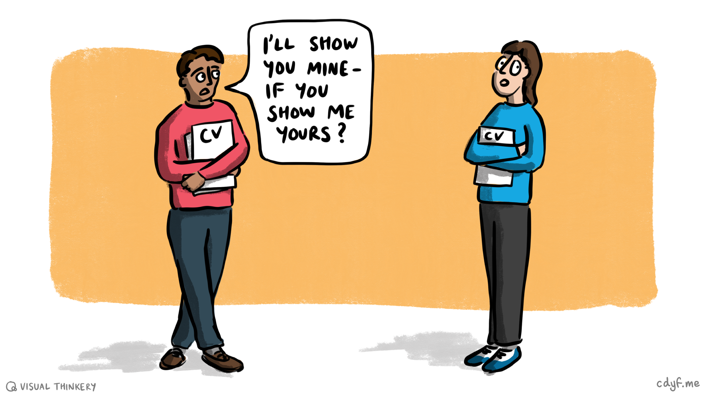
```

(ref:captioncvswap) It can be a bit embarassing showing your CV to other people, it is a *very* personal document after all. If you feel like it isn't finished yet remember that *everyones* CV is a work in progress. If you can find somebody you trust to do a CV swap with, you'll both benefit from debugging each others CVs. The more people that can give you feedback on how to improve it, the better. *I'll show you mine if you show me yours* sketch by [Visual Thinkery](https://visualthinkery.com) is licensed under [CC-BY-ND](https://creativecommons.org/licenses/by-nd/4.0/)

Swapping your CV is a form of [peer assessment](https://en.wikipedia.org/wiki/Peer_assessment) and a two-way process to help you [pair program](https://en.wikipedia.org/wiki/Pair_programming) your CV. Make sure you're both a giver and receiver of feedback, by playing both *driver* and *navigator* roles in your pair. Playing both roles will help you write a better CV. Giving and receiving feedback will help you start debugging the trickier unknown errors: 

1. 🔲 Have you got a second opinion from a “résumé robot”? How robot proof is it? See section \@ref(robotproof) 🤖
1. 🔲 Have you reviewed other people's CV's by doing a CV swap and critically reading those in chapter \@ref(hacking)? Reading lots of CVs will give you a stronger sense of what works and what doesn't. This will put you in the shoes of an employer or recruiter, thereby helping you to write a better CV yourself, see figure \@ref(fig:cvswap-fig).
1. 🔲 Has your CV been reviewed by other people? Do a CV swap with a critical friend (see figure \@ref(fig:wonderfuldarling-fig)) and score each others CV's using [this rubric](https://www.cdyf.me/CV-rubric.pdf). This is a bit like [pair programming](https://en.wikipedia.org/wiki/Pair_programming). According to [Linus's law](https://en.wikipedia.org/wiki/Linus%27s_law) “given enough eyeballs all bugs are shallow” [@Raymond1999] so the more people who give you feedback the better

Having sought feedback on your CV from a diverse range of sources, you'll need to *triangulate* the responses because they'll probably contradict each other. We'll  look at that in the next section.

## CV Checklist (D): Triangulation {#triangulation}

You should seek a wide variety of feedback on your CV from as many people as you are comfortable showing it too, this will help you “triangulate” all the different feedback, a bit like the trigonometry shown in figure \@ref(fig:triangulation-fig).

```{r triangulation-fig, echo = FALSE, fig.align = "center", out.width = "100%", fig.cap = "(ref:captiontriangulation)"}
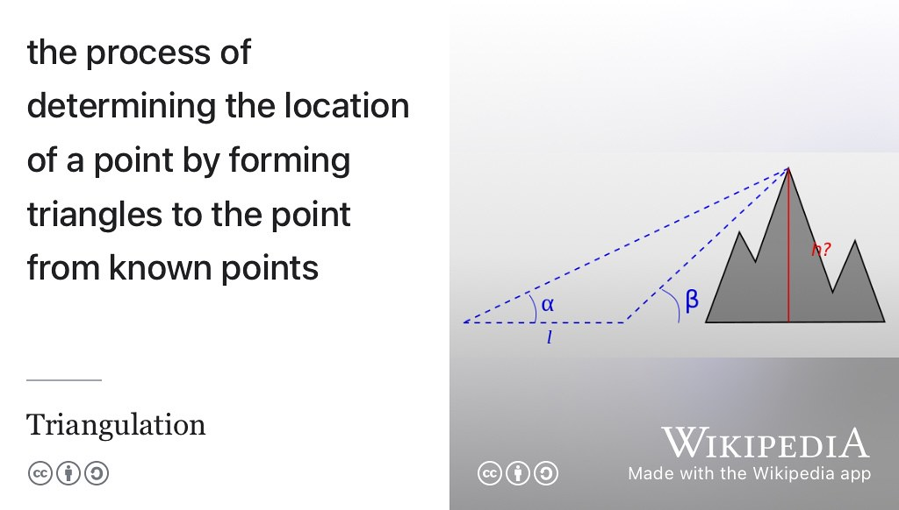
```

(ref:captiontriangulation) Getting feedback on your CV from known points at different angles, shown as $α$ and $β$ here, will help you [triangulate](https://en.wikipedia.org/wiki/Triangulation) people's suggestions for improvements. Each angle and has its own limitations described in table \@ref(tab:triangtable), but their combination will help you calibrate. Public domain image of mountain height by triangulation by Régis Lachaume on Wikimedia Commons [w.wiki/9fmd](https://w.wiki/9fmd) and adapted using the [Wikipedia app](https://apps.apple.com/gb/app/wikipedia/id324715238) 📐

Different readers of your CV will probably disagree and contradict each other, but you will be able to [triangulate](https://en.wikipedia.org/wiki/Triangulation) their feedback and draw your own conclusions. As a start, I'd suggest a *minimum* of three different sources. Despite what people might tell you, nobody has all the answers, including me! Some of the pros and cons of different viewpoints are shown in table \@ref(tab:triangtable)

```{r triangtable, echo = FALSE}
triang_table <- tibble::tribble(
    ~ "Viewpoint", ~ "Strengths",  ~ "Weaknesses",     
  "Friends & family", "(ref:wartsandall)",   "(ref:notcritical)", 
  "Robots", "(ref:twentyfourseven)",   "Only as good as the data they have been trained on, the algorithms they use and the biases of the engineers that made them ", 
  "Academics", "(ref:academentia)",   "May have limited first hand experience of employment outside academia, might be used to reading and writing much longer academic CVs, e.g. ten pages instead of one or two [@academiccv]", 
  "Careers service staff", "Typically lots of experience reading student & graduate CVs",   "May have a limited understanding of the degree you've studied or any first hand experience of the profession you are entering [@samfranklin]", 
  "Recruiters, HR & employers", "Will have read lots of CVs, conducted interviews, hired and fired personnel, managed staff etc",   "Might not know you that well personally, may be biased towards a particular sector or employer", 
  "Peers", "Your fellow students know you, your University and course pretty well",   "Probably never had to hire or manage anyone (yet), so limited knowledge of recruitment and employment", 
  "You", "(ref:knowthyself)",   "(ref:worstcritic)",)
knitr::kable(triang_table, caption = "Some of the strengths and weakness of difference sources (angles) of feedback on your CV. You'll need to triangulate between different and probably contradictory opinions but doing so will improve your CV.", booktabs = TRUE)
```

(ref:wartsandall) They know you pretty well, “[warts and all](https://en.wiktionary.org/wiki/warts_and_all)”, see figure \@ref(fig:honest-fig)

(ref:twentyfourseven) Available online 24-7, see section \@ref(robotproof)

(ref:notcritical) Might not be honest enough or critical enough, see figure \@ref(fig:wonderfuldarling-fig). It can be difficult to give and receive negative feedback [@negativefeedback]

(ref:academentia) Good subject knowledge and good source of advice on further study, see chapter \@ref(researching)

(ref:knowthyself) You know yourself (hopefully) see chapter \@ref(exploring)

(ref:worstcritic) It can be difficult to see your own faults, and you might be over-estimating your abilities, both on paper and in person, see the [Dunning–Kruger effect](https://en.wikipedia.org/wiki/Dunning%E2%80%93Kruger_effect) and section \@ref(checklist). On the other hand, there is a good chance you might be your own worst critic too. [@worstcritic]


```{r honest-fig, echo = FALSE, fig.align = "center", out.width = "100%", fig.cap = "(ref:captionhonest)"}
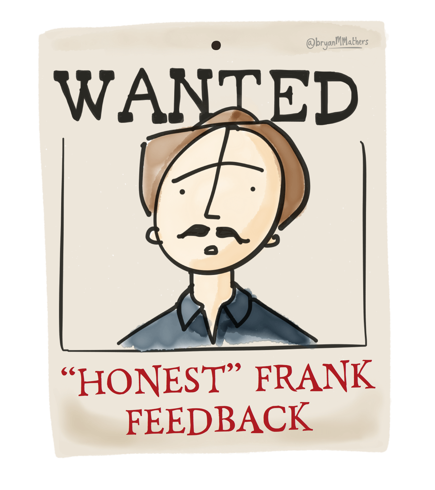
```

(ref:captionhonest) **WANTED (DEAD OR ALIVE) HONEST FRANK FEEDBACK** To improve your CV you want honest frank feedback on it. When they read your CV, Frank Feedback (and his sister Francesca Feedback) aren't judging you, they are judging your CV. Honest feedback will see beyond good or bad and will tell you where you can improve, not just in what you've presented but also what's missing and what you need to focus on in the future to [continue your professional development](https://en.wikipedia.org/wiki/Institute_of_Continuing_Professional_Development) (CPD). So, who are the people you could ask for honest feedback, who do you trust to be able to give you negative (but constructive) feedback? Can you return their favour and give them some feedback on theirs? [WANTED: Honest Frank Feedback](https://bryanmmathers.com/honest-frank-feedback/) artwork by [Visual Thinkery](https://visualthinkery.com/) is licensed under [CC-BY-ND](https://creativecommons.org/licenses/by-nd/4.0/) 


So, review the feedback you've got from your peers, academics, friends, family, recruiters, robots and the staff in your University careers service. They all have strengths and weaknesses, each with their own flaws, biases and prejudices. With all those different viewpoints from different angles, you should be able to find the point that you judge to be best for you. 

## CV Checklist (E): Write, Sleep, Read, Repeat... {#iterate}
Self assessing and peer assessing your CV empowers you to be more independent from your teachers, careers advisors and potential employers for feedback. Don't rely on feedback from just one person, like the fledgling in the nest waiting for its parent to return with a juicy worm, shown in figure \@ref(fig:fledgling-fig). Learn to self assess, while giving and receiving feedback from your peers. That means both *your* CV and *theirs* too.

```{r fledgling-fig, echo = FALSE, fig.align = "center", out.width = "100%", fig.cap = "(ref:captionfledgling)"}
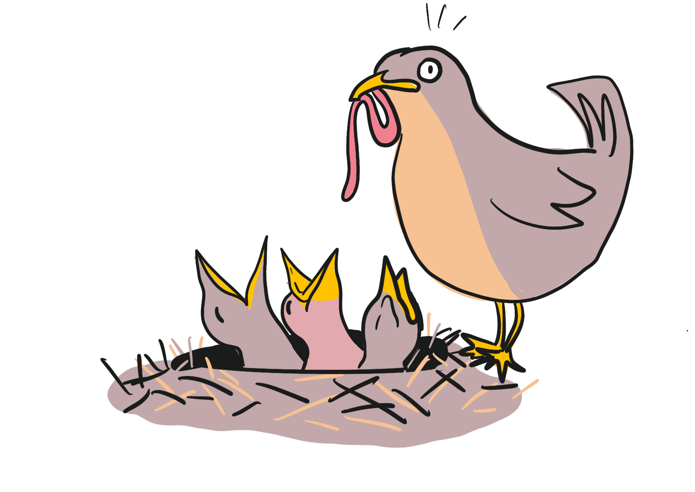
```

(ref:captionfledgling) The mistaken belief that the most important feedback is comments you are fed from a teacher, employer or careers advisor disempowers you. Self assessing and peer assessing CVs empowers you to improve independently of feedback from authority figures, symbolised by the parent bird in the picture. Learn to feed yourself with feedback from peer and self-assessment of your CV. Image re-used with permission, drawn by Katrina Swanton at [swantonsketches.co.uk](https://www.swantonsketches.co.uk/) and designed by [Jennifer Rose](https://research.manchester.ac.uk/en/persons/jennifer.rose) via the ITL conference [@itl2024]

Here are seven suggestions to carry on assessing and debugging your two page CV and one page Résumé:

1. Self-debugging, as described in section \@ref(checklist)
1. Peer-debugging, PASS on what you have learned about of the art of writing a CV to your peers. Learn from their successes & failures, to develop a better sense of what works (and what doesn't) as described in section \@ref(cvswap)
1. Show it to your friends, enemies, family, tutors, employers, careers service [bit.ly/CS-pathways](https://bit.ly/CS-pathways) & bots such as [careerset.com/manchester](https://careerset.com/manchester)
1. Triangulate all their feedback, as described in section \@ref(triangulation)
1. Identify any gaps in your `EXPERIENCE` or `PROJECTS` and think about how you might start to fill them in the future, section \@ref(areuexperienced)
1. Audit and build your `SKILLS` to improve your self-awareness. What are you good at and where do you need to improve in the future, as described in section \@ref(personality)? What courses are available to help you develop your skills, particularly the weaker ones see [bit.ly/linkedin-learning-manchester](https://bit.ly/linkedin-learning-manchester)
1. Repeat the above because it's not an iteration if you only do it once, see figure \@ref(fig:iteration-fig)

```{r iteration-fig, echo = FALSE, fig.align = "center", out.width = "100%", fig.cap = "(ref:captioniteration)"}
knitr::include_graphics("images/iteration.png")
```

(ref:captioniteration) It's not an iteration if you only do it once. Your CV is never really finished, you'll need to keep reading, writing, re-reading and re-writing repeatedly after getting feedback from as many different sources as possible. Iteration artwork by [Visual Thinkery](https://visualthinkery.com/) is licensed under [CC-BY-ND](https://creativecommons.org/licenses/by-nd/4.0/) 

The fourth step (triangulation) is important, so read your CV and re-read it. Write it and re-write it. Get as much feedback as you can. Most of your time writing is actually spent *re-writing*, see chapter \@ref(writing). 

[Write, Sleep, Read, Repeat](https://en.wikipedia.org/wiki/Eat,_Sleep,_Rave,_Repeat)... [@eatsleepraverepeat]

## Covering Letters & Personal Statements {#covering-letters}
Applications and CV's are often accompanied by covering letters or include some kind of personal statement or summary. They are your [elevator pitch](https://en.wikipedia.org/wiki/Elevator_pitch) shown in figure \@ref(fig:elevator-fig). Whereas a lot of your CV is essentially a bulleted list of facts, numbers and evidence, a covering letter or personal statement gives you a chance to *really* demonstrate your fluent written communication skills in clear [prose](https://en.wikipedia.org/wiki/Prose). If you're going to include a `personal statement` or `profile` on your CV keep it short, unlike [Mike Rokernel](https://www.cdyf.me/mike_rokernel.pdf) who waffles on for *ages* (yawn) without actually providing any evidence for his assertions. This kind of information usually fits better in your covering letter anyway, because there isn't much space for it on a CV.

```{r elevator-fig, echo = FALSE, fig.align = "center", out.width = "100%", fig.cap = "(ref:captionelevator)"}
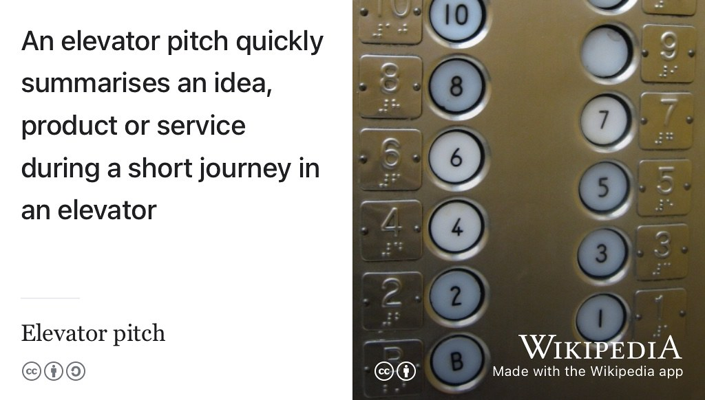
```

(ref:captionelevator) Covering letters and personal statements are your [elevator pitch](https://en.wikipedia.org/wiki/Elevator_pitch). Whatever floor you're destined for, your pitch should summarise why you're applying and what you have to offer, in a way that persuades the reader (or listener) that they should invite you to interview, before they get out of your metaphorical elevator. Elevator image by Downtowngal is licensed CC BY via Wikimedia Commons [w.wiki/5wGF](https://w.wiki/5wGF) adapted using the [Wikipedia app](https://apps.apple.com/us/app/wikipedia/id324715238) 🛗

Let's say you're applying for a widget engineering position at the world famous [widget](https://en.wikipedia.org/wiki/Widget) manufacturer: `widget.com`. There are three things you need to convey in the following order:

1. **Why them?** Why are you applying to `widget.com`, look at the employers values, how do they align with your own? See section \@ref(soul)
1. **Why that role?**  Employees of `widget.com` have many different roles and responsibilities but what is it about being a junior `widget engineer` or trainee `widget scientist` (say) that attracts you?
1. **Why you?** Why should `widget.com` employ you? What skills and experience make you stand out from all the other *wannabe widgeteers*? What are your [Unique Selling Points](https://en.wikipedia.org/wiki/Unique_selling_proposition) (USPs)? Say why *you* would be good for *them* (**not** why widget.com would be good for you and your career).

Like your CV, its good to personalise and tailor it. Find the name of a hiring manager, HR person, recruiter or talent director on LinkedIn and address it to them by name rather than the impersonal `Dear Sir/Madam`. You can see some examples of answers to the three questions above at:

* [prospects.ac.uk/careers-advice/cvs-and-cover-letters/cover-letters/sample-cover-letter](https://www.prospects.ac.uk/careers-advice/cvs-and-cover-letters/cover-letters/sample-cover-letter)
*  [www.careers.manchester.ac.uk/applicationsinterviews/cl](https://www.careers.manchester.ac.uk/applicationsinterviews/cl/)


### Does Anyone Actually READ Covering Letters? {#elevatorpitch}
Some employers will read your covering letter very carefully, others less so. It is not always clear which employers will bother and which won't.

Even if *nobody* reads your covering letter, it is still worth writing one because formulating answers to the three basic questions in section \@ref(covering-letters) will force you to rehearse standard interview questions.

You can think of your covering letter as writing and rehearsing some of the lines of your elevator pitch shown in figure \@ref(fig:elevator-fig).

### Embedding a Personal Statement {#bullshit}
You might be tempted to embed a short `summary` or `personal statement` section at the top of your CV after your header. If you're thinking about doing this, keep it short or just leave it out altogether. Why? Here's an example of how *not* to do it from the (fictional) **Sir Don Malaka** [FRS](https://en.wikipedia.org/wiki/Fellow_of_the_Royal_Society) who is the Banterian Professor of Rhetoric at the University of Oxford:

::: {.rmdnote}

`I have a proven track record of delivering excellent teaching and outstanding learning experiences for all of my students, whatever their background. I am also a committed and diligent leader who can deliver large and ambitious projects on time and to budget. I am also capable of leading cross-disclipinary teams of colleagues towards excellent and innovative results that align closely with strategic educational objectives.`

:::

Are you persuaded by Professor [Malaka's](https://en.wikipedia.org/wiki/Malakas) personal statement? I *hope* you are not convinced because it [smells of bullshit](https://en.wikipedia.org/wiki/On_Bullshit), see figure \@ref(fig:bullshit-fig). One of the reasons the statement smells dodgy is because it makes lots of assertions without providing any actual evidence. Is Professor Hotair trying to persuade us to disregard the truth? Without evidence, it is hard to tell which of their assertions are true or false, so the whole statement risks being ignored as bullshit or lies. [@onbullshit]

```{r bullshit-fig, echo = FALSE, fig.align = "center", out.width = "100%", fig.cap = "(ref:captionbullshit)"}
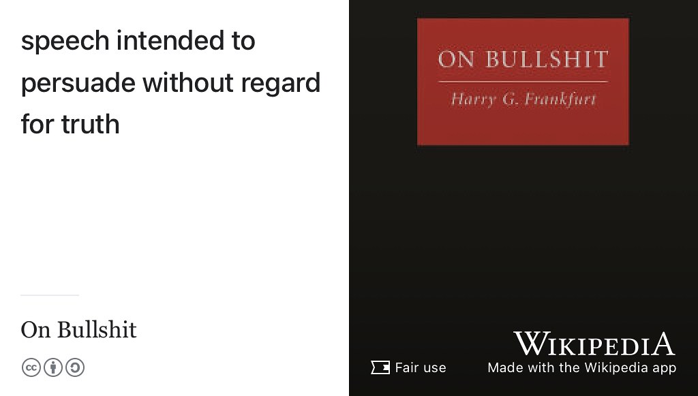
```

(ref:captionbullshit) Bullshit is language, spoken or written, that is intended to persuade without regard for the truth. Yes, your CV is trying to persuade the reader to invite you to an interview. However, being persuasive doesn't mean you have to try and [bullshit](https://en.wikipedia.org/wiki/Bullshit) your reader by exaggerating your achievements or telling lies. People who have to read your CV will probably be trawling through *hundreds* of others too. This means your readers will have *highly trained and sensitive* bullshit detectors, so you should avoid wasting their valuable time by shovelling even more bullshit onto their overloaded plates. Fair use image of the cover of [Harry G. Frankfurt](https://en.wikipedia.org/wiki/Harry_Frankfurt)'s best selling little book *[On Bullshit](https://en.wikipedia.org/wiki/On_Bullshit)* [@onbullshit] via Wikimedia Commons [w.wiki/6Bnu](https://w.wiki/6Bnu) adapted using the [Wikipedia app](https://apps.apple.com/us/app/wikipedia/id324715238)

On a one page CV, you rarely have space to include any of this kind of hot air anyway. High level statements usually fit better on a covering letter see section \@ref(covering-letters). A shorter, less *bullshitty* personal statement from a student is shown below:

::: {.rmdnote}

`Hello, my name is Mike Rokernel. I am a second year student in Computer Science at the University of Poppleton looking for an industrial placement in software engineering`

:::

Is this better? Personally, I think you should only include a personal statement on your CV if you've got space to do so because you'll often just repeat facts from your CV anyway, like Mike's example above. 

Save your beautiful persuasive rhetorical prose for your covering letters and make reference to key facts on your CV. There are usually much more interesting and appetising things you can say about yourself on your CV. 💩

## Summarising Your Future {#tldr7}
(ref:tldr)

Your future is bright, your future needs debugging. Debugging your future will help you test future. Testing your future will help you to start coding your future. One of the best ways to debug your own CV is to fix bugs in *other peoples* CVs and to get feedback from critical friends on yours, see figure \@ref(fig:wonderfuldarling-fig)

```{r wonderfuldarling-fig, echo = FALSE, fig.align = "center", out.width = "100%", fig.cap = "(ref:captionwonderfuldarling)"}
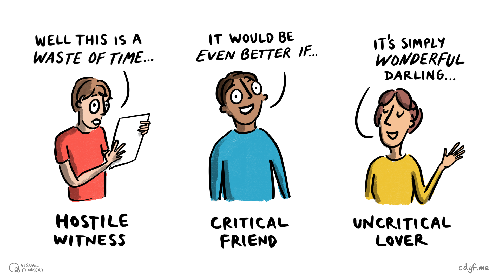
```

(ref:captionwonderfuldarling) Showing your CV to somebody else is one of the best ways to debug it. You need to find a [critical friend](https://en.wikipedia.org/wiki/Critical_friend), somebody who won't just tear it apart (`hostile witness`) or tell you it's simply *wonderful* darling (`uncritical lover`) but tell you how to improve it, whatever state it is in (`critical friend`). Critical friend by [Visual Thinkery](https://visualthinkery.com/) is licensed under [CC-BY-ND](https://creativecommons.org/licenses/by-nd/4.0/)


In this chapter we have looked at how to debug your future, with a particular focus on your CV^[...Or *Résumé* if you prefer 🇺🇸] and any supporting written communication. If you fix the bugs we've described here, before an employer sees your CV, you'll stand a *much* better chance of getting an interview. The checklist in section \@ref(checklist) is a good place to start debugging your CV. 

<!--https://twitter.com/b0rk/status/1570060516839641092-->

*Some* of the strategies you apply to debugging your *actual* code, can also be applied to debugging your future:

* Inspect, don't squash bugs, take time to reflect (see section \@ref(reflecting)) and *understand* any bugs you find in your future [@pocketdebugging]
* Being stuck is temporary, see section \@ref(nevergiveup)
* Check your assumptions, especially if debugging the `content` bugs described in section \@ref(ilo7) makes you anxious or depressed, see chapter \@ref(nurturing)
* Don't go it alone, grow your network, see section \@ref(weakties)
* Build your debugging toolkit by identifying your strengths and weaknesses, see chapter \@ref(exploring)

<!-- except there isn't always a reason!-->

Debugging your future can be an enjoyable adventure! Debugging your future is Coding your future. 

In the next part, chapter \@ref(hacking): *Hacking your Future* you'll improve your CV writing skills by going beyond debugging your own CV and debugging other people's instead.

<!-- nine hallmarks of a powerful resume

1. short and sweet
2. accomplishment oriented (highlight what you did)
3. quanitifiable results (STAR)
4. well targeted (to product, job description or values)
5. universally meaningful (no jargon)
6. professional (no typos)
7. well formatted
8. list projects
9. be different-->

<!--
1. socialite / socialist
1. definitely / defiantly
1. causal / casual
1. heroin / heroine
1. public / pubic -->
