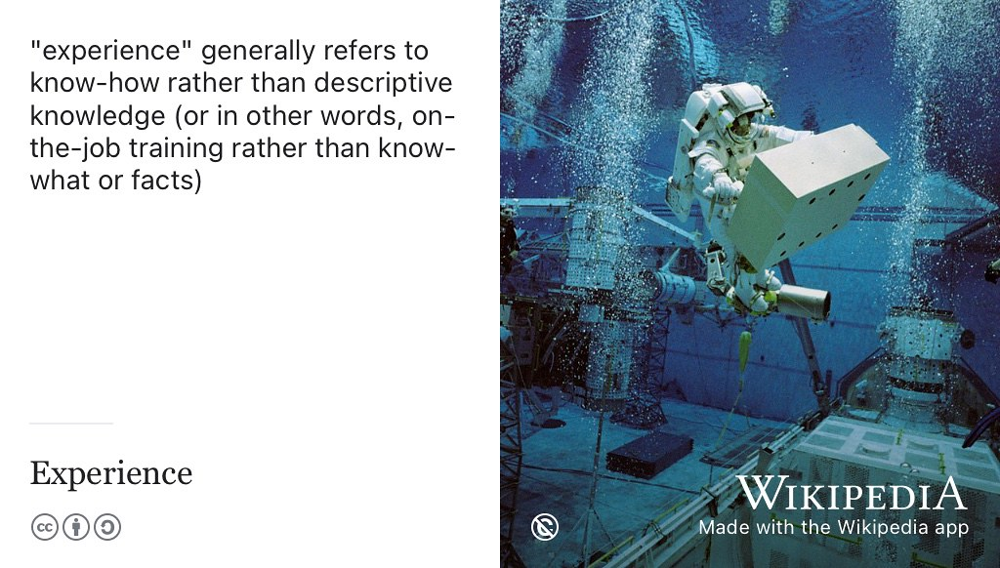
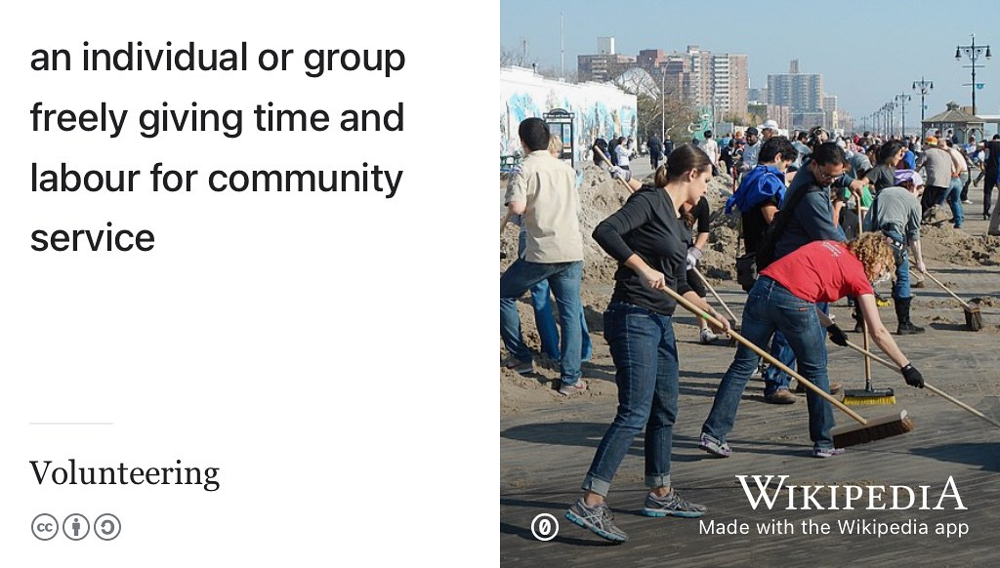
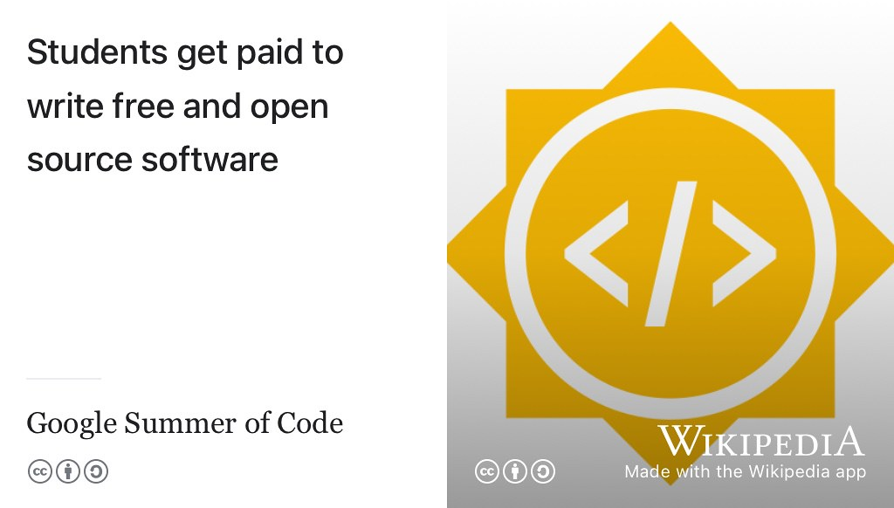
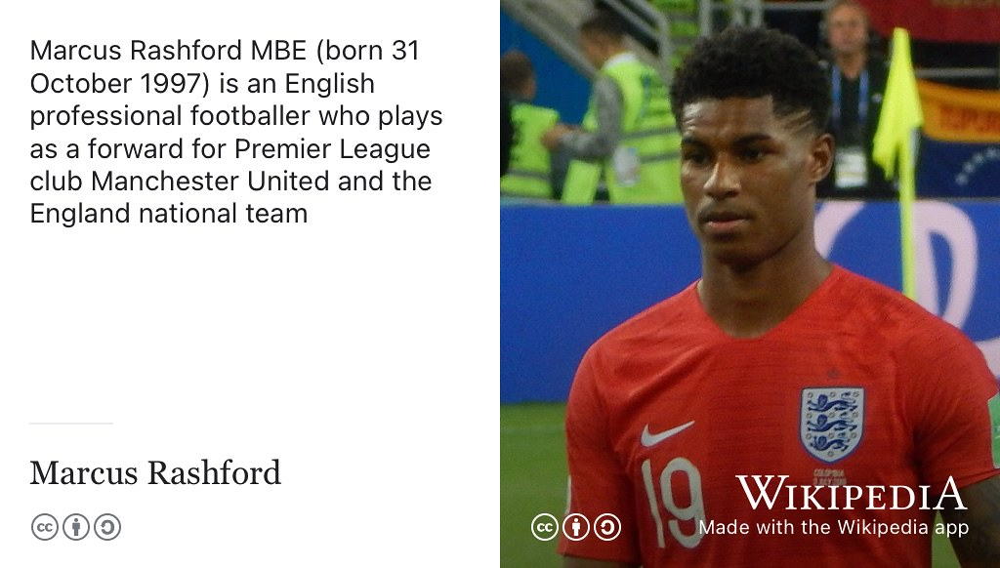
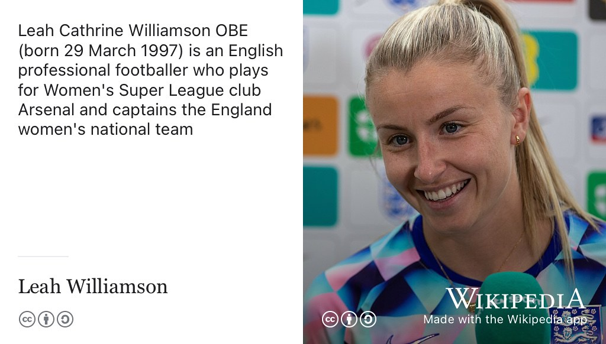
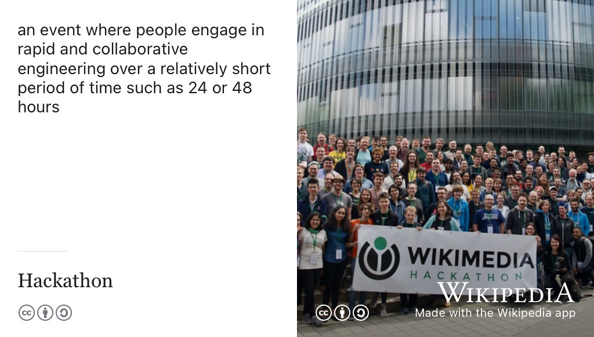

# Experiencing your future {#experiencing}

So, tell me, are you experienced? Why is experience valuable and what kind of experience are employers looking for anyway? How can you get some more experience? 🤔

```{r 404-fig, echo = FALSE, fig.align = "center", out.width = "100%", fig.cap = "(ref:caption404)"}
knitr::include_graphics("images/404.png")
```

(ref:caption404) Do you respond with a sheepish `experience not found` when people ask about your experience? Is your experience like the [classic page not found](https://en.wikipedia.org/wiki/HTTP_404) error message `HTTP 404`? The client sent you a valid request for your experience, but your server couldn't find it. Awkward. Embarrassing silence? 😳 Don't worry, there are some simple and easy ways to build your experience so that instead of negative 404's, you can respond with a cheerfully positive `200 (OK)`, as described in this [list of HTTP status codes](https://en.wikipedia.org/wiki/List_of_HTTP_status_codes). We'll look at some of them in this chapter. Experience not found sketch by [Visual Thinkery](https://visualthinkery.com/) is licensed under [CC-BY-ND](https://creativecommons.org/licenses/by-nd/4.0/)

Your future is bright, your future needs experiencing, so let's start experiencing your future.

## What you will learn {#ilo5}

By the end of this chapter you will be able to

1. Describe why having experience can improve your chances of getting interviews
1. Identify what counts as experience and why it's valuable
1. Recognise opportunities to get more experience before you graduate

<!-- for quizzes see the learnr package
https://rstudio.github.io/learnr/
quiz
 -->

<!--
## internships and placements: Pros  

1. Extended interview
1. Eliminate

## Debug your experience

## internships and placements: Cons  

1. Difficult to get back into study
1. Takes longer to get your degree-->


```{r relevance-fig, echo = FALSE, fig.align = "center", out.width = "100%", fig.cap = "(ref:captionrelevantexp)"}
knitr::include_graphics("images/What's relevant.png")
```

(ref:captionrelevantexp) You might be surprised by what kinds of experience are relevant on your CV. There are lots of experiences beyond paid work such as projects and extra-curricular activities you've been involved in that tell a story about who you are and what you are capable of. What's relevant sketch by [Visual Thinkery](https://visualthinkery.com/) is licensed under [CC-BY-ND](https://creativecommons.org/licenses/by-nd/4.0/)

## Why is experience so valuable?

You are *much more* than your grades, because your education is only a part of who you are. You are the sum total of your experiences, this is one of the reasons that experience is so valuable, see figure \@ref(fig:experience-fig). It's common for students to be focused on their grades, whether those grades are low, middling or or high. At the extremes, if you have got lower grades than you'd like, you might be anxious or unhappy about them. If you've got higher grades, you're probably focussed on keeping them high. While its important to focus on getting the best grades you can, employers are interested in the whole you rather than narrowly focusing on your academic education. Alongside your academic achievements, there is also your:

* 💰 `Experience` paid work, see section \@ref(mycvex)
* 💪 `Projects` of all kinds, see section \@ref(mycvpj)
* 🏆 `Leadership and awards` if you have or can demonstrate any \@ref(prizes)

```{r experience-fig, echo = FALSE, fig.align = "center", out.width = "100%", fig.cap = "(ref:captionexperience)"}

```

(ref:captionexperience) [Experience](https://en.wikipedia.org/wiki/Experience) is one of the best ways to develop *know-how*. While your formal education and academic study can help you develop *know-what*, you need to complement this knowledge with a range of experiences and on-the-job learning. This astronaut is training to work in microgravity by completing tasks underwater in a space suit. Like the astronaut, your education needs to combine academic study, with practical experience on-the-job. Public domain image of [Christer Fuglesang](https://en.wikipedia.org/wiki/Christer_Fuglesang) training in the Neutral Buoyancy Laboratory (NBL) by NASA on Wikimedia Commons [w.wiki/3WBf](https://w.wiki/3WBf) adapted using the [Wikipedia App](https://apps.apple.com/us/app/wikipedia/id324715238).

Your experience tells a story about who you are, what you're capable of and what you have learned. Experience is a crucial part of *how* you learn and allows you to demonstrate *what* you have learned. Experience makes you more *employable* which means:

1. experience tests and validates what you have already learned, see Sneha's story in chapter \@ref(sneha)
1. experience motivates you to learn more by helping you decide what to learn next
1. experience improves your confidence [@jackiecarter]
1. experience broadens and deepens your skills and knowledge, see figure \@ref(fig:goal-fig)
1. experience improves your chances of being invited to interview
1. experience improves your chances of being offered a job after an interview
1. experience builds your professional network of contacts, both the stronger and the  weaker ties described in section \@ref(weakties)


Paul Redmond at the University of Liverpool describes experience as a key part of employability [@paulredmond] as expressed in his graduate jobs formula shown in equation \@ref(eq:redmond).

::: {.rmdnote}

\begin{equation}
  E = Q + WE + S \times C
  (\#eq:redmond)
\end{equation}

:::

According to Redmond, your employability ($E$) is the sum of your qualifications ($Q$), your work experience ($WE$) and your strategies ($S$) multiplied by your contacts ($C$). It is difficult to quantify employability so precisely but Redmond's equation \@ref(eq:redmond) is a good starting point for discussion. We will look at some strategies

* For qualifcations ($Q$), see section \@ref(mycved) on your `Education`
* For strategies ($S$) and contacts ($C$) see chapter \@ref(finding) on *Finding your Future*
* For experience ($WE$) read on, this chapter is all about your `experience`

## Are you experienced? {#areuexperienced}

So what counts as `experience`? I'm going to use experience to mean applying what you've learnt in your formal education *outside* of school or University, this includes but is not limited to, paid employment. Employers use terms to describe jobs and experience for undergraduates and graduates inconsistently. So I've defined and outlined terms for relevant kinds of experience shown in table \@ref(tab:jobterms) and we'll use these definitions throughout this guidebook.

```{r jobterms, echo = FALSE}
jobterm_table <- tibble::tribble(
  ~ "Experience", ~ "Description",
  "Casual", "Casual work, for example in hospitality or retail and so on, sometimes (misleadingly) referred to as “low-skilled”. If you're dealing with customers, casual work provides solid evidence of your softer people skills on your CV",
  "Part-time", "If you can balance study and paid work, getting skilled part-time work (for example as software developer) is a great way to get experience",
  "Voluntary", "Unpaid, both in technical and non-technical roles for charity or nonprofit organisation, for example in Manchester see [find-volunteering.manchester.ac.uk](https://find-volunteering.manchester.ac.uk/)",
  "Virtual", "Since the pandemic, more employers are offering online and remote [virtual work experience](https://www.prospects.ac.uk/jobs-and-work-experience/work-experience-and-internships/virtual-work-experience)",
  "Social", "Unpaid, participating in a club or society e.g. students union, sport etc, for example in Manchester see [manchesterstudentsunion.com](https://manchesterstudentsunion.com/)",
  "Entrepreneurial", "Self-employment, freelancing, contracting, “moonlighting” in a [side job](https://en.wikipedia.org/wiki/Side_job) or starting as a [sole-trader](https://en.wikipedia.org/wiki/Sole_proprietorship) or small business",  
  "Insight", "Usually no contract of employment. One to three weeks, sometimes known as work experience, [work shadowing](https://www.prospects.ac.uk/jobs-and-work-experience/work-experience-and-internships/work-shadowing), spring weeks, vacation schemes or even [externships](https://en.wikipedia.org/wiki/Externship). Sometimes unpaid, but often expensed. See [ratemyplacement.co.uk/insights](https://www.ratemyplacement.co.uk/insights) for some examples",
  "Internship", "Fixed term contract of employment, typically 3 months full-time over summer, but anywhere between 1 and 6 months. Sometimes part-time, *may* be an assessed part of an undergraduate or postgraduate degree. Usually prior to graduation, but some employers offer *graduate internships* such as the [Silicon Valley Internship Program](https://siliconvalleyinternship.com/) (SVIP). These kinds of internships should *really* be called fixed-term graduate jobs (or schemes) instead of internships",
  "Placement", "Fixed term contract of employment, typically 12 months long and an assessed part of a degree. In Europe they are sometimes known as a “sandwich” or “industrial experience” years because they typically take place in the *penultimate* (last but one) year of a degree. In America, placements are usually [known as co-ops](https://career.vt.edu/experience/ceip/ceip-internship-coop.html) [@coops]",
  "Graduate job", "Full-time permanent contract typically working in one department of an organisation",
  "Graduate scheme", "Full-time permanent contract. Fast-track or high-flier managerial scheme, in your first two years, you'll probably rotate around different departments in an organisation"
)
knitr::kable(jobterm_table, caption = "Are you experienced? Terms used throughout this guidebook to describe experience, employment and their definitions", booktabs = TRUE)
```


### Summer vs. year-long experience? {#interns}

You might be wondering which length of experience is better, a short summer internship or year-long industrial placemnt (aka co-op). Table \@ref(tab:interntable) summarises some of the advantages and disadvantages of each kind of experience:

```{r interntable, echo = FALSE}
intern_table <- tibble::tribble(
    ~ "Summer internship",      ~ "Year long placement ",
 "You won't pay tuition fees to your University",        "You will have to pay tuition fees if industrial experience is a part of your degree^[See for example [https://www.studentsupport.manchester.ac.uk/finances/tuition-fees/fee-amounts/other-fees/](https://www.studentsupport.manchester.ac.uk/finances/tuition-fees/fee-amounts/other-fees/)]",
  "You can graduate sooner, after three years of study rather than four",  " You graduate later, after four years of study rather than three^[this might also be an advantage if the economy is in recession]",    
  "Some employers don't offer summer internships, and only do year long placements", "Some employers don't offer year long placements, and only have summer internships",
  "You get less time to make a good impression and pick up new skills", "You get more time to make a good impression and learn more", 
  "You will typically be working in one department for three months", "Some employers offer two sixth-month rotations, thereby giving you a wider variety of experience than a summer internship",     
  "In the UK, summer internships can be harder to find, for some employers they are too short for you to payback the employers investment of time before you leave", "In the UK, there tend to be more year-long placements available than summer internships, though it depends on the sector and location",      
  "Your visa may not need extending (but check what it says about working)", "If you hold a [student visa](https://www.gov.uk/student-visa) and [biometric residence permit](https://www.gov.uk/biometric-residence-permits) (BRP) and you need to transfer from a three year course onto a four year one in order to do a placement, you will need to extend your visa and update your BRP. This can take time and money.",
"A summer internship can fit more conveniently around your studies with minimal interruption",  "Unless are employed in the same location as where you studied, you will spend less time with the cohort of students in your year group that aren't doing a placement ",     

)
knitr::kable(intern_table, caption = "A comparison of some of the advantages and disadvantages of a short summer internship compared to a longer year-in-industry   ", booktabs = TRUE)
```

In some cases you can do *both* a year long placement AND a summer internship, for example: 

* From June of year $x$ to June of year $x + 1$: you complete a year-long placement 
* During June, July and September of year $x+1$: you complete a summer Internship

Although valuable, your experience of paid employment isn't the only kind of experience that employers value. What other kinds of experience are there?

### Other experience {#other}
<!-- to do compare and contrast summer vs year long-->

Some of the experience outlined in table \@ref(tab:jobterms) was probably what you were already thinking of as experience, however there are three important sources of experience that students often overlook:

1. **Voluntary work**: Any kind of work where you've given your time and labour to a community. That could be non-technical (working for a charity) or technical, such as contributing to open-source software, see section \@ref(opensource) and figure \@ref(fig:volunthero-fig)
1. **Casual work**: Working in hospitality or retail (etc) is often overlooked by students as an important source of relevant experience. It doesn't have to be technical to be relevant to employers, see section \@ref(casual)
1. **Tinkering**: having passion projects as a playground to help you learn new skills and knowledge, either solo or collaboratively see section \@ref(tinkering). For more competitive employers, passion projects are likely to be more important. To get into ultra-competitive industries like the [video game industry](https://en.wikipedia.org/wiki/Video_game_industry), candidates are often expected to have a portfolio of one or two games developed *outside* of University, and these will be more interesting to employers than what (or where) you've studied [@aswift]
1. **Student societies** Your students' union will have hundreds of official societies you can get involved in, and they'll be plenty of unofficial fringe communities too. As well as helping you develop new or existing interests, these societies give you an opportunity to serve a particular community of interest. Many societies seek members to take on positions of responsibility, above and beyond merely participating in their events. They provide fantastic opportunities to build new skills in a safe and supportive environment.

```{r volunthero-fig, echo = FALSE, fig.align = "center", out.width = "100%", fig.cap = "(ref:captionvolunthero)"}

```

(ref:captionvolunthero) [Volunteering](https://en.wikipedia.org/wiki/Volunteering) is a great source of experience that employers value. That could mean volunteering for charitable causes, taking responsibility in a student society or getting involved in open source projects. Picture of volunteers cleaning up after Hurricane Sandy in 2012 by Jim Henderson via Wikimedia Commons [w.wiki/3Z96](https://w.wiki/3Z96) adapted using the [Wikipedia App](https://apps.apple.com/us/app/wikipedia/id324715238).

Before we discuss these experiences, lets look at some of the more conventional places for getting experience:

<!--* Competitions: participating in competitions and hackathons will make your CV stand out-->

### Big name experience {#bignames}

It's probably easier than you might think to get a [big tech](https://en.wikipedia.org/wiki/Big_Tech) or big employer name on your CV. For example, many large employers run [insight days, vacation schemes and spring weeks ](https://www.ratemyplacement.co.uk/insights). These are often aimed at first year undergraduates, and are sometimes less competitive to get into than a longer term commitment such as a summer internship, year-long placement or even graduate job. A big name on your CV early in your degree can help it stand out later, as fluff bucket the grinning [cheshire cat](https://en.wikipedia.org/wiki/Cheshire_Cat) demonstrates on their CV shown in figure \@ref(fig:bigname-fig). 😻

```{r bigname-fig, echo = FALSE, fig.align = "center", out.width = "100%", fig.cap = "(ref:captionbigname)"}
knitr::include_graphics("images/Big Name.png")
```
(ref:captionbigname) It's easier than you  might think to get a big name on your CV, sometimes these can help your application stand out from the competition. Big name sketch by [Visual Thinkery](https://visualthinkery.com) is licensed under [CC-BY-ND](https://creativecommons.org/licenses/by-nd/4.0/)

Other ways to get a big name on your CV include joining a big name competition or event, for example:

* Amazon hosts the Alexa challenge, see [developer.amazon.com/alexaprize](https://developer.amazon.com/alexaprize/challenges/current-challenge/rules) <!--and the AWS Educate Challenge [aws.amazon.com/education/awseducate/university-challenge](https://aws.amazon.com/education/awseducate/university-challenge/)-->
* Apple hosts the Swift Student Challenge [developer.apple.com/wwdc22/swift-student-challenge/](https://developer.apple.com/wwdc22/swift-student-challenge/)
<!--* CERN publishes data at [opendata.cern.ch](https://opendata.cern.ch/)-->
* The European Space Agency (ESA) organises the CANSAT competition (satellite in a can) see [esa.int/Education/CanSat](https://www.esa.int/Education/CanSat) and [cansatcompetition.com](http://www.cansatcompetition.com/) (NASA)
* Facebook has hackathons, see [facebook.com/hackathon](https://en-gb.facebook.com/hackathon) and [developers.facebook.com](https://developers.facebook.com/)
* Google hosts several events including:
    + Code Jam, HashCode and Kick Start [codingcompetitions.withgoogle.com](https://codingcompetitions.withgoogle.com/)
    + Summer of Code [summerofcode.withgoogle.com](https://summerofcode.withgoogle.com/), see figure \@ref(fig:gsoc-fig) [@gsoc]
    + Developer Student Club Leads [developers.google.com/community/dsc/leads](https://developers.google.com/community/dsc/leads)
    + Inside Look [buildyourfuture.withgoogle.com/programs/inside-look](https://buildyourfuture.withgoogle.com/programs/inside-look/)
* [Outreachy.org](https://www.outreachy.org/) provides internships for people subject to [systemic bias](https://en.wikipedia.org/wiki/Systemic_bias) and underrepresentation in the technical industry where they are living, and is backed by big employers.
* IBM hosts the annual Call for Code [developer.ibm.com/callforcode](https://developer.ibm.com/callforcode) unlike other competitions, these have a [corporate social responsibility](https://en.wikipedia.org/wiki/Corporate_social_responsibility) (CSR) themes for the benefit of society at large
* Microsoft hosts the Imagine Cup [imaginecup.microsoft.com](https://imaginecup.microsoft.com/) and also has hands on learning paths at [learn.microsoft.com](https://learn.microsoft.com/)
* Besides these kinds of dedicated events organised by big names, there are many competitions which are sponsored by them, see section \@ref(tinkering)

```{r gsoc-fig, echo = FALSE, fig.align = "center", out.width = "100%", fig.cap = "(ref:captiongsoc)"}

```
(ref:captiongsoc) Large well known organisations like Google have a range of schemes and competitions that allow you to get their name on your CV, without working for them directly as an employee. Google Summer of Code [summerofcode.withgoogle.com](https://summerofcode.withgoogle.com/) is just one example, where students get paid to write [free and open source software](https://en.wikipedia.org/wiki/Free_and_open-source_software) (FOSS). [@gsoc]


Big names can look good on your CV, but they are not the only way to make your CV stand out.

### Smaller name experience {#smallnames}

*Any* experience will help your CV stand out. Smaller name employers have the advantage that they tend to be less picky than big household names so it is often easier to get a foot in the door. It might not be what you see yourself doing in the longer term, but the experience and opportunities you gain working in a small company can be invaluable. 

To use a footballing analogy, let's imagine you dream of playing for the world's greatest football team: [Manchester United](https://en.wikipedia.org/wiki/Manchester_United_F.C.). Unfortunately, the talent scouts at United don't return any of your calls or emails about vacancies for younger players and its incredibly hard to get a chance to speak to them in person. However, if you prove yourself at a smaller club, that would be a start. This is how most professional footballers start, such as [Marcus Rashford](https://en.wikipedia.org/wiki/Marcus_Rashford) shown in figure \@ref(fig:rashford-fig). What works in football can also work in employment too. You might even decide that big clubs are over-rated and you prefer playing for smaller clubs anyway *or* a smaller employer could be your stepping stone to bigger things. Of course, you want to be ambitious and find what is best for you but ignoring opportunities with smaller employers will severely restrict your options. At the very least, small name experience will get some evidence on your CV and start to buid your professional network.

```{r rashford-fig, echo = FALSE, fig.align = "center", out.width = "99%", fig.cap = "(ref:captionrashford)"}

```

(ref:captionrashford) When [Marcus Rashford](https://en.wikipedia.org/wiki/Marcus_Rashford) isn't playing for the [world's greatest football team](https://en.wikipedia.org/wiki/Manchester_United_F.C.), he also plays for the [England national football team](https://en.wikipedia.org/wiki/England_national_football_team) too. Although he's a superstar now, Rashford started out at a much smaller, lesser known club: [Fletcher Moss Rangers](https://en.wikipedia.org/wiki/Fletcher_Moss_Rangers_F.C.) in Didsbury. Like Rashford, the best way to kick-start your career might be with a smaller employer rather than a big famous household name. [CC BY-SA](https://creativecommons.org/licenses/by-sa/4.0/deed.en) portrait of Rashford playing football at the 2018 FIFA World Cup in Russia on Wikimedia Commons [w.wiki/6SzW](https://w.wiki/6SzW) by [Oleg Bkhambri](https://commons.wikimedia.org/wiki/User:Voltmetro) adapted using the [Wikipedia app](https://apps.apple.com/us/app/wikipedia/id324715238)

The majority of former Computer Science students I know that work in [Big Tech](https://en.wikipedia.org/wiki/Big_Tech) or [“blue chip” companies](https://en.wikipedia.org/wiki/Blue_chip_(stock_market)) did so *after* working for a much smaller employer first, see for example Raluca's story in chapter \@ref(raluca) and Leah's story in figure \@ref(fig:leah-williamson-fig).

```{r leah-williamson-fig, echo = FALSE, fig.align = "center", out.width = "99%", fig.cap = "(ref:captionleah)"}

```
(ref:captionleah) Starting a new job is a bit like joining a football team. You've probably never heard of [Rushden and Diamonds F.C.](https://en.wikipedia.org/wiki/Rushden_%26_Diamonds_F.C.) where Lioness [Leah Williamson](https://en.wikipedia.org/wiki/Leah_Williamson) started her career. Like Leah, the best place to start your career might just be for an employer (club) that none of your friends and family will have heard of. CC [BY-SA](https://creativecommons.org/licenses/by-sa/4.0/deed.en) portrait of Leah Williamson by Ryanasman1 on Wikimedia Commons [w.wiki/6aKd](https://w.wiki/6aKd) adapted using the [Wikipedia app](https://apps.apple.com/us/app/wikipedia/id324715238)

So think big, but be prepared to start with smaller name experience. 

### Open source experience {#opensource}
Open source software projects are a great way to get some really solid experience of software engineering, see for example [Why Computing Students Should Contribute to Open Source Software Projects](https://cacm.acm.org/magazines/2021/7/253459-why-computing-students-should-contribute-to-open-source-software-projects/fulltext). [@sigman18] There's two ways to get started:

1. Raise a new issue via the project's issue tracker, such as [github issues](https://guides.github.com/features/issues/) [@githubissues]
1. [Fix a bug](https://dev.to/rose/fixing-a-bug-on-my-open-source-project-from-start-to-finish-1749) by picking existing issues. [@fixabug] It might sound trivial, but fixing a bug demonstrates that you can collaborate with others, understand the architecture and toolchain being used (which might be complex) and solve problems. See [firstcontributions.github.io](https://firstcontributions.github.io/) and the `<good first issue>` tag which helps new contributors identify starting points, see [goodfirstissue.dev](https://goodfirstissue.dev/) for some aggregated examples.

There are lots of different motivations for getting involved in open source, shown in figure \@ref(fig:opensource-fig). Whatever your motivation, contributing to open source software is fun, you'll learn heaps and it will look *great* on your CV. Open source software is widely used by, so contributing is a great way to get some real world experience of software development. Many open source projects are funded by employers both large and small, and you can get paid to develop open source software through projects like Google's Summer of Code. [@gsoc]

```{r opensource-fig, echo = FALSE, fig.align = "center", out.width = "100%", fig.cap = "(ref:captionopensource)"}
knitr::include_graphics("images/OS-contribution-motivations-1200x675.png")
```
(ref:captionopensource) There are lots of good reasons for getting involved in open source software, gaining skills and experience of real software engineering in the wild is just one of them. [Open Source Motivations](https://bryanmmathers.com/open-source-motivations) by [Visual Thinkery](https://visualthinkery.com) is licensed under [CC-BY-ND](https://creativecommons.org/licenses/by-nd/4.0/)

If you're looking for a project to get stuck into, here are [Diomidis Spinellis](https://en.wikipedia.org/wiki/Diomidis_Spinellis) tips for getting started [@sigman18]:

1. Choose a project with several active contributors, so that there is a community to help you
1. Choose a relatively popular project (with some GitHub stars) so that you can avoid [abandonware](https://en.wikipedia.org/wiki/Abandonware) but...
1. ... Avoid “blockbuster”  projects like [tensorflow](https://github.com/tensorflow) or [vscode](https://github.com/microsoft/vscode) , so that your contributions will not get lost in the politics and bureaucracy of a large project
1. Verify that you can build and run the project from your own setup
1. Ensure the project regularly accepts pull requests from outsiders, so that your contributions will have a chance of being accepted
1. Contribute a trivial fix to start with to test your ability use the project's workflows

The guidelines for prospective contributors to Google's Summer of Code (GSoC) at [google.github.io/gsocguides/student](https://google.github.io/gsocguides/student/) go into more depth about how you can get involved in open source software development. Many of these general guidelines apply both inside (paid) and outside (unpaid) of GSoC. [@gsoc]

### Voluntary experience {#volunteering}

Experience as a section on your CV usually means *paid* work. However, experience in the context of this chapter means anything where you can show you've been part of a bigger team, taken responsibility for something or tried to make the world a better place somehow. These include:

* Volunteering: Doing voluntary work is a good way to pick up new skills
* Being involved in societies: e.g. taking responsibility for things in a society
* Getting involved in a community, either physical or online

### Hacking & tinkering experience {#tinkering}
Another good source of experience is [tinkering](https://en.wikipedia.org/wiki/Tinker) or [hacking](https://en.wikipedia.org/wiki/Hacker_culture). Hackers and tinkerers improve or repair things in their spare time for fun, either as passion projects or in collaboration with others. For example, why not build an experimental:

* Hackable burglar alarm?^[hackable by you, not the burglars, obvs]
* DIY smart energy meter?
* Home media centre or [network attached storage](https://en.wikipedia.org/wiki/Network-attached_storage) (NAS)?
* Plant watering system for when you go on holiday? [@plantwatering]
* See also [github.com/codecrafters-io/build-your-own-x](https://github.com/codecrafters-io/build-your-own-x), [online.coolestprojects.org](https://online.coolestprojects.org/) and section \@ref(bignames) for some starting points

Yes, these projects are amateur, but tinkering and hacking clearly demonstrates your passion for learning and engineering. Apart from being fun, weekend hacks can look *great* in the `projects` section of your CV, see section \@ref(mycvpj).

```{r hackathon-fig, echo = FALSE, fig.align = "center", out.width = "99%", fig.cap = "(ref:captionhackathon)"}

```
(ref:captionhackathon) Most [hackathons](https://en.wikipedia.org/wiki/Hackathon) are collaborative and social events where you can learn how to rapidly prototype ideas in a friendly and supportive environment. Picture of participants at a Wikimedia Hackathon in Prague by [Chris Koerner](https://en.wikipedia.org/wiki/User:Ckoerner) on Wikimedia Commons [w.wiki/5rjR](https://w.wiki/5rjR) adapted using the [Wikipedia app](https://apps.apple.com/us/app/wikipedia/id324715238).

Attending [Hackathons](https://en.wikipedia.org/wiki/Hackathon) is another way to learn and gain `experience` by tinkering, in a collaborative and social environment, see figure \@ref(fig:hackathon-fig). The word hackathon is a portmanteau of hacking (from [hacker culture](https://en.wikipedia.org/wiki/Hacker_culture) not [security hacking](https://en.wikipedia.org/wiki/Security_hacker)) and [marathon](https://en.wikipedia.org/wiki/Marathon). Hackathons tend to be short (24 to 48 hours) but intense, see for example:

* [hackathons.org.uk](https://www.hackathons.org.uk/)
    - [greatunihack.com](https://greatunihack.com/)
    - [studenthack.com](https://www.studenthack.com/)
* [codeforces.com](https://codeforces.com/)
* [devpost.com/hackathons](https://devpost.com/hackathons)
* [mlh.io](https://mlh.io/) (Major League Hacking)
* [hackerearth.com](https://www.hackerearth.com/) <!--more like hackerrank than an event?-->
* [hackzurich.com](https://hackzurich.com/)

Alongside these competitions, there are other hackathon-type events which are organised by a single employer, see section \@ref(bignames). There are also opportunities to build your technical experience by practicing coding interviews online such as hackerrank and leetcode, described in section \@ref(codinginterview).

Passion projects like these help to distinguish you from your peers, but they don't *have* to be technical, see section \@ref(casual) and \@ref(volunteering). You might feel that you are too busy to do any passion projects, but if working hard on academic study and getting top grades means that you:

* Neglect hobbies, interests and friends
* Start to suffer from anxiety or depression
* Only have `projects` that were a compulsory part of your formal education

It might be time to reflect and consider re-balancing your priorities if you can.

### Casual experience {#casual}
You may already have experience of paid employment as a casual or part-time worker. This could include jobs such as waiting tables, serving in a bar or working in other areas of hospitality or retail, for example as a Saturday job.

```{r paperboy-fig, echo = FALSE, fig.align = "center", out.width = "99%", fig.cap = "(ref:captionpaperboy)"}
knitr::include_graphics("images/Titanic-paperboy-crop.jpeg")
```
(ref:captionpaperboy) Casual and part-time work tell an important story about you on your CV. For example, from the age of 12, I was a [paperboy](https://en.wikipedia.org/wiki/Paperboy), delivering newspapers directly to the doors of paying customers. This demonstrates reliability and work ethic, because I did this in all weathers (sun, wind, rain, snow, hangovers etc) for six years. If you have casual experience like this, don't forget to include it in your CV. Public domain image of the Titanic paperboy, Ned Parfett selling newspapers in London via Wikimedia Commons at [w.wiki/35HA](https://w.wiki/35HA) adapted using the [Wikipedia app](https://apps.apple.com/us/app/wikipedia/id324715238).

It is important to recognise that these jobs have value. Many students make the mistake of overlooking their casual work experience because they discount it as non-technical and “low-skilled”. In section \@ref(mycvst) we saw that one of the stories you want to tell in your job applications is that you:

1. take responsibility
1. achieve things
1. are nice to have around

Doing casual work can demonstrate all of these things. For example, from the ages of 12 to 18 I was a [paperboy](https://en.wikipedia.org/wiki/Paperboy), except unlike the Titanic paperboy selling newspapers in the street in figure \@ref(fig:paperboy-fig), I delivered newspapers directly to the doors of paying customers every morning. This was not a particularly highly skilled job, but it *does* demonstrate:

1. [work ethic](https://en.wikipedia.org/wiki/Work_ethic): getting up early *every* morning (including Saturdays). Sometimes work is about just turning up everyday!
1. taking responsibility and being reliable
1. understanding the value of money by earning a wage

<!-- this is repetitive, see earlier in the section-->
I've often spoken to students who neglect to tell me about their paid work in retail or hospitality. “But it's not technical” they say, “it's low skilled and irrelevant”. However, serving customers demonstrates your ability to provide good customer service and work as part of a team, often under pressure, see figure \@ref(fig:budgens-fig). This is good evidence of the “nice to have around” bit that Jonathan Black refers to [@topnotchcv] and is something your formal education will not typically provide much evidence of. So, don't fall into the trap of discounting the value of casual or part-time labour.

```{r budgens-fig, echo = FALSE, fig.align = "center", out.width = "100%", fig.cap = "(ref:captionbudgens)"}
knitr::include_graphics("images/budgens.jpeg")
```
(ref:captionbudgens) Early in your career, casual work in hospitality or retail, such as a supermarket like [Budgens](https://en.wikipedia.org/wiki/Budgens) where I used to work as a teenager, is worth mentioning on your CV. If you have any experience of this kind, make sure you mention it and describe the skills you developed. Think carefully about the verbs you can use to describe casual experience, see chapter \@ref(actioning).

<!-- see https://github.com/dullhunk/cdyf/issues/49-->

## Breakpoints {#bp5}
(ref:breakpoint)

```md
* PAUSE ⏸️
```

* What experience do you have to date?
<!-- include voluntary work and casual work show in section ... -->
* What activities could you do to get some more experience?
* What are the pros and cons of summer internships vs. year long placements?
    + Which one is right for you?

```md
* RESUME ▶️
```

## Summarising your experience {#tldr5}

(ref:tldr)

Your future is bright, your future needs experiencing. Experiencing your future will help you build and test your future. Building and testing your future will help you to start coding your future. 

In this chapter, you have reflected on what your experience is to date, not just the paid experience but all your other experiences that prospective employers will care about. 

In the next part, chapter \@ref(finding): *Finding your Future* we will investigate some job search strategies and how you can apply them to find the opportunities that are right for you.

This chapter is under construction because I'm using agile book development methods, see figure \@ref(fig:deathstar2-fig).

```{r deathstar2-fig, echo = FALSE, fig.align = "center", out.width = "99%", fig.cap = "(ref:captiondeathstar)"}
knitr::include_graphics("images/DeathStar2.jpg")
```
