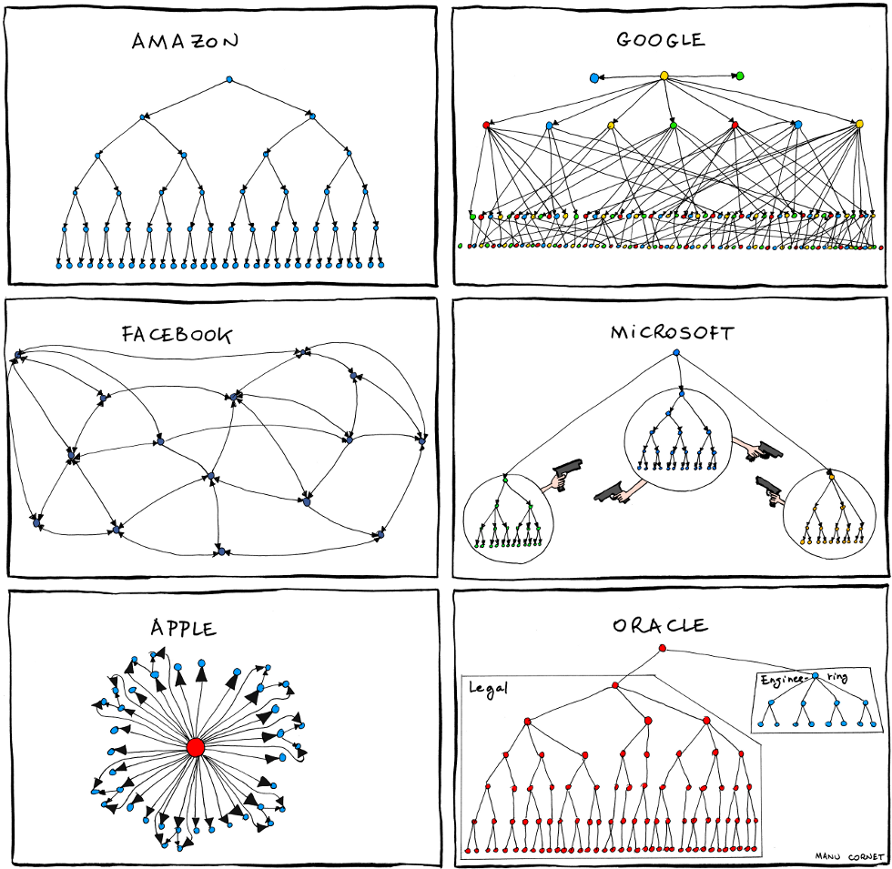

# Finding your future {#finding}

You're keen to get some experience as described in chapter \@ref(experiencing). You've successfully debugged your CV, with help from chapter \@ref(debugging). Now, how can find an interesting job? How can use your CV, covering letter and any other communication to persuade employers to invite you to an interview? What techniques exist and how can you use your networks to help you? Where can you look? This chapter will help you find your future. 🔭

```{r yesbut-fig, echo = FALSE, fig.align = "center", out.width = "90%", fig.cap = "(ref:captionyesbut)"}
knitr::include_graphics("images/Yes but how do I.png")
```
(ref:captionyesbut) Coding your future is all very well, but how do you actually get a job? This chapter looks at job searching and networking. Yes but... sketch by [Visual Thinkery](https://visualthinkery.com) is licensed under [CC-BY-ND](https://creativecommons.org/licenses/by-nd/4.0/)

## What you will learn {#ilo8}
At the end of this chapter you will be able to:

1. Formulate job search strategies:
    + by role, sector, skills, time, size, quantity, values, culture, network, salary and location
1. Apply your search strategies to advertised (and unadvertised) opportunities
    + Identify opportunities for finding work, online and face-to-face
    + Identify people in your existing networks who can help you
    + Grow your networks and use them to your advantage
1. Describe some of the problems with recruitment:
    + for employers
    + for potential employees (like you)
    + Critically evaluate what employers have on offer (beyond the financial incentives)


<!--
* Compare your values and ethics with those of employer
* Decide, plan and compete kent-->

<!--* Describe what it means to be **employable**-->

## Job search strategies {#strategies}
Before we look at where to look for jobs, we need to discuss what to look for. Let's imagine there is a handy AI-powered function in python called `find_jobs()` which knows *everything* about:

* all the jobs available, regardless of where they are advertised, incuding hidden ones
* your skills, knowledge and ambitions
* employers, their services, products and values
* people in your network, right from 1st degree through to 6th degree connections [@bacon]

Such a function doesn't really exist yet, but lets pretend that it does to illustrate some points about job searching. If you were to run the function with no arguments...

```{r, eval=knitr::is_html_output(), results='asis', echo=FALSE}
cat('<script src="https://gist.github.com/dullhunk/6f3a98ca6ae2cdcb611f8b4838fe25df.js"></script>')
```

```{r, eval=knitr::is_latex_output(), results='asis', echo=FALSE}
cat('see https://gist.github.com/dullhunk/6f3a98ca6ae2cdcb611f8b4838fe25df')
```

...you will be completely overwhelmed with the results. It can be bewildering knowing where to start your job search, because the possibilities are endless. Your *search space* is huge.

Thankfully, we can break it down, but there are many parameters and variables in your search that you need to think about. Here are some basic strategies to help you start to [decompose](https://en.wikipedia.org/wiki/Decomposition_(computer_science)) the complex problem of job hunting into smaller, more manageable problems you can start to tackle. We've already mentioned some:

1. 👨‍🔬 by role, see section \@ref(by-role)
1. 📊 by sector, see section \@ref(by-sector)
1. 💪 by skills, see section \@ref(by-skills)
1. 🏖️ by location, see section \@ref(by-location)
1. 👨‍👩‍👧‍👦 by network, see section \@ref(weakties)
1. 💰 by salary, see section \@ref(by-salary)
1. 🏋️ by size, see section \@ref(by-size)
1. ❤️ by values, see section \@ref(by-values)
1. 🕰 by timing, see section \@ref(by-time)
1. ⚖️ by quantity, see section \@ref(by-quantity)

Each strategy has is own strengths and weaknesses, and you'll probably want to combine more than one and experiment with different strategies as your search progresses over time. No doubt, you'll have some extra strategies of your own, this is not meant to be an exhaustive list, just a starting point:

### By role {#by-role}
There are many different roles that studying computing gives you access to besides software engineering. So one strategy is to research those roles, choose one you like and then apply for that kind of role. Let's say you are interested in product management. This is a strategy that will help you narrow down a huge number of jobs into something more manageable. For example:

```{r, eval=knitr::is_html_output(), results='asis', echo=FALSE}
cat('<script src="https://gist.github.com/dullhunk/c13ddb4dbd5c43220cd35caa5d1f40c7.js"></script>')
```

```{r, eval=knitr::is_latex_output(), results='asis', echo=FALSE}
cat('see https://gist.github.com/dullhunk/c13ddb4dbd5c43220cd35caa5d1f40c7')
```

The list of roles in section \@ref(otheroles) will give you a flavour of some roles to think about, beyond software engineering.

### By sector {#by-sector}
Computing is found in every sector of business and society. This means won't just find computing jobs in the technology sector, whatever that is. Although the lines between some sectors are becoming increasingly blurred, you can still narrow down the options by picking a sector you are interested in and pursuing that. For example:


```{r, eval=knitr::is_html_output(), results='asis', echo=FALSE}
cat('<script src="https://gist.github.com/dullhunk/ecc64065d98a45b54ed178f370af6abf.js"></script>')
```

```{r, eval=knitr::is_latex_output(), results='asis', echo=FALSE}
cat('see https://gist.github.com/dullhunk/ecc64065d98a45b54ed178f370af6abf')
```

Like many graduate employment guides, the Guardian 300 guide (see section \@ref(studentjobs)) has good overview of different sectors by breaking down employers by sectors such as:

* Consulting
* Public sector
* Finance

Picking a sector can help you get started, by narrowing what might otherwise be a massive search space. The sector(s) you choose will also determine the kind of salary you can expect, see section \@ref(by-salary). [@letsmakelotsofmoney]

### By skills {#by-skills}
Is there a specific skill you have that you enjoy using, or a technology you know that has promise? You could use this as a way to find jobs:

```{r, eval=knitr::is_html_output(), results='asis', echo=FALSE}
cat('<script src="https://gist.github.com/dullhunk/61bf8c20b4eb2da9a168ebb29b7026fd.js"></script>')
```

```{r, eval=knitr::is_latex_output(), results='asis', echo=FALSE}
cat('see https://gist.github.com/dullhunk/61bf8c20b4eb2da9a168ebb29b7026fd')
```

Picking a specific technology can sometimes help you narrow down the options, for example by using these keywords in your search.

### By location {#by-location}
Pick a location. London? Manchester? Paris? Geneva? New York? [Silly Valley](https://en.wikipedia.org/wiki/Silicon_Valley)? Depending on the location, this will determine the options that are available:

```{r, eval=knitr::is_html_output(), results='asis', echo=FALSE}
cat('<script src="https://gist.github.com/dullhunk/5004cbf5fc337fb8e7357e62c50d15eb.js"></script>')
```

```{r, eval=knitr::is_latex_output(), results='asis', echo=FALSE}
cat('see https://gist.github.com/dullhunk/5004cbf5fc337fb8e7357e62c50d15eb')
```
 ... and so on. So locations can help you define (and potentially reduce) your problem space. For example, if you're looking in Manchester, you can get started at [git.io/manc](https://git.io/manc). Picking a location can also help you identify networking opportunities for hidden, un-advertised vacancies and making speculative applications. You could find out about employers by attending free [meetup.com](https://www.meetup.com/) or [evenbrite.com](https://www.eventbrite.com/) events in your chosen location.

### By network {#weakties}
The people in your network can help you find work. *[It's not what you know, its who you know](https://en.wiktionary.org/wiki/it%27s_not_what_you_know_but_who_you_know)*, or so the cliché goes. The bigger your network, the more opportunities you'll know about. So a really basic strategy for finding jobs is using your networks. Remember, `find_jobs` does just know what you know, it also knows who is in your professional `network` and the employers *they* know about, so we could ask it to find opportunities in your professional and social networks:

```{r, eval=knitr::is_html_output(), results='asis', echo=FALSE}
cat('<script src="https://gist.github.com/dullhunk/c2e05b55e55c285de8525a6952731f30.js"></script>')
```

```{r, eval=knitr::is_latex_output(), results='asis', echo=FALSE}
cat('see https://gist.github.com/dullhunk/c2e05b55e55c285de8525a6952731f30')
```

Your close network probably won't change that much, the friends and family you trust and rely on. Its important to recognise the importance of more casual acquaintances, or what sociologist [Mark Granovetter](https://en.wikipedia.org/wiki/Mark_Granovetter) calls  “weak ties”. [@granovetter]

```{r bumped-fig, echo = FALSE, fig.align = "center", out.width = "99%", fig.cap = "(ref:captionbumped)"}
knitr::include_graphics("images/Bumped into.png")
```
(ref:captionbumped) It's not what you know, its who you know: Networking and personal contacts can be more useful than just knowledge and skills alone, when seeking employment. Networking is an essential part of any job search, your networks can help you now and in the future. One of the things looked at in this chapter is how to build and use your networks to help find the job you're after. The simplest networking technique is bumping into people, but you need create opportunities for that to happen. Bumped into sketch by [Visual Thinkery](https://visualthinkery.com/) is licensed under [CC-BY-ND](https://creativecommons.org/licenses/by-nd/4.0/)

 Weak ties are people you don't know as well, but are important for a range of reasons. Research has shown that [building networks of weak ties is good for your mental health and can give you an edge in job hunting](https://www.bbc.com/worklife/article/20200701-why-your-weak-tie-friendships-may-mean-more-than-you-think). [@weakties] Granovetter showed that many job opportunities came through weak ties, rather than strong ones. This is true not just of jobs early on in your career (like now) but also later too. So it is in your interests to continually foster weak connections and be open to serendipitous meetings where you bump into people, as in Figure \@ref(fig:bumped-fig). “Bumping into” here, could mean either physical or virtual.

```{r net-fig, echo = FALSE, fig.align = "center", out.width = "50%", fig.cap = "(ref:captionnetworks)"}
knitr::include_graphics("images/grow your networks.png")
```

(ref:captionnetworks) Who is in your network? Grow and use your network, both the strong ties and the weak ties. Weak ties are often the most important when it comes to job hunting. Networks sketch by [Visual Thinkery](https://visualthinkery.com/) is licensed under [CC-BY-ND](https://creativecommons.org/licenses/by-nd/4.0/)


<!-- network includes
* Fellow students
* Employers on campus
* Alumni
* Recruiters-->


<!--### Academics

Academics have careers too, and some will have extensive networks of contacts in industry and academia that might be useful to you. If you ask nicely, they might introduce you to people they know who can help, such as former students or collaborators.

```{r teachers-fig, echo = FALSE, fig.align = "center", out.width = "80%", fig.cap = "(ref:captionpurveyors)"}
knitr::include_graphics("images/teachers-purveyors-of-confidence.png")
```

(ref:captionpurveyors) Your teachers may have contacts that might be useful to you. [Teachers](https://bryanmmathers.com/teachers/) by [Visual Thinkery](https://visualthinkery.com/) is licensed under [CC-BY-ND](https://creativecommons.org/licenses/by-nd/4.0/)

## Speculative applications-->

<!--
https://www.prospects.ac.uk/careers-advice/cvs-and-cover-letters/cover-letters/speculative-cover-letter-->

<!--Search by

* sector ### Gaming grads in games-->
<!--https://www.youtube.com/watch?v=PpvdbADLJAY-->


### By salary {#by-salary}
You can also define your search space by salary:

```{r, eval=knitr::is_html_output(), results='asis', echo=FALSE}
cat('<script src="https://gist.github.com/dullhunk/28c308ee12c067b95dd724eabfc9e291.js"></script>')
```

```{r, eval=knitr::is_latex_output(), results='asis', echo=FALSE}
cat('see https://gist.github.com/dullhunk/28c308ee12c067b95dd724eabfc9e291')
```

Setting a minimum salary will include or exclude certain employers from your search. To do this realistically, you need to know how much you are worth, see section \@ref(undersell) and figure \@ref(fig:salaries-fig) for some places to start.


```{r salaries-fig, echo = FALSE, fig.align = "center", out.width = "100%", fig.cap = "(ref:captionsalaries)"}
library(ggplot2)
library(dplyr)
salaries <- tribble(
  ~year, ~salary,
  2007, 24500,
  2008, 25500,
  2009, 27000,
  2010, 29000,
  2011, 29000,
  2012, 29000,
  2013, 29000,
  2014, 29500,
  2015, 30000,
  2016, 30000,
  2017, 30000,
  2018, 30000,
  2019, 30000,
  2020, 30000,
  2021, 30000,
  2022, 32000)

ggplot(data = salaries) + geom_bar(mapping = aes(x = year, y = salary), stat = "identity")

```


(ref:captionsalaries) Average graduate starting salaries (in £) at the UK’s “top” employers 2007 to 2022, according to [highfliers.co.uk](https://www.highfliers.co.uk) [@highfliers2022] Since 2007, graduate salaries have risen from `£24,500` to `£32,000k` in 2022. Note that these are *graduate* salaries, not internship or placement salaries which tend to be lower. Also note that “top” employers is a highly subjective judgement, lots of good smaller employers don't feature in this data and they typically pay less than the large multinational organisations dominating this sample. The averages also hide significant variations by sector and location, see the salary resources in section \@ref(undersell)


### By size {#by-size}
Do you see yourself working for a large multi-national corporation or a bedroom startup? Or something in-between? There's advantages and disadvantages to each, but like all our other parameters, picking an organisation size can help you get started. In some cases, size will also define the `type` or organisation, for example:

```{r, eval=knitr::is_html_output(), results='asis', echo=FALSE}
cat('<script src="https://gist.github.com/dullhunk/5ec7d37a60637c7083dc661e74ddcaf9.js"></script>')
```

```{r, eval=knitr::is_latex_output(), results='asis', echo=FALSE}
cat('see https://gist.github.com/dullhunk/5ec7d37a60637c7083dc661e74ddcaf9')
```

Likewise, if you know you want to work for a multi-national, that gives you a list of employers you can target. Picking a size, can help you identify employers you would like to work for. Table \@ref(tab:shortcuts) summarises some of the when and where some employers typically advertise.

```{r shortcuts, echo = FALSE}
job_table <- tibble::tribble(
  ~ ""       , ~ "Large employers", ~ "SMEs",
  "Where"    , "Advertise broadly", "Less likely to advertise on big jobs boards",
  "When"     , "Vacancies open earlier in the academic year", "Vacancies *tend* to open later in the academic year",
  "How"      , "Typically multistage applications, several rounds of interviews", "Typically shorter application and interview processes",
  "Who"      , "Typically receive high volume of applications per vacancy", "Typically receive lower volume of applications per vacancy",
  "Process"  , "Unlikely to consider speculative applications", "May consider speculative or informal applications",
)
knitr::kable(job_table, caption = "The practicalities of applying for vacancies, internships, placements, graduate jobs and schemes in large multinational employers and small to medium sized enterprises (SMEs)", booktabs = TRUE)
```

### By values {#by-values}
Besides the necessary value of making a profit, which is what commercial employers need to do to survive, what are the values of the employers you are interested in? How do they match your own, the `values_match` below? Reasonably or not at all?  How much of your soul do you need to sell? All of it, or just some of it? This a difficult question to compute, see section \@ref(soul), but let's imagine we can compute it:

```{r, eval=knitr::is_html_output(), results='asis', echo=FALSE}
cat('<script src="https://gist.github.com/dullhunk/015a1182225f13c9307538468620ceb9.js"></script>')
```

```{r, eval=knitr::is_latex_output(), results='asis', echo=FALSE}
cat('see https://gist.github.com/dullhunk/015a1182225f13c9307538468620ceb9')
```

An employers `values` are often reflected in the organisations `culture`. What is the employers culture like? What sort of structure would you fit into, see figure \@ref(fig:pyramid-fig)? Would you enjoy working there and would you felt like you belonged? How can you actually find this out? Do you need to sell your soul? If you're struggling with these questions, you may need to do some more soul searching, see section \@ref(soul) and chapter \@ref(knowing). Talk to employees too, this is why networking is important, see section \@ref(weakties).

```{r pyramid-fig, echo = FALSE, fig.align = "center", out.width = "79%", fig.cap = "(ref:captionpyramid)"}

```
(ref:captionpyramid) Organisational culture and values are often reflected in an employers structure. Finding out about an employers structure will help you begin to understand their `culture` and `values`, see section \@ref(soul). Creative Commons [Attribution-ShareAlike](https://creativecommons.org/licenses/by-sa/3.0/deed.en) org charts comic by [Manu Cornet](https://en.wikipedia.org/wiki/Manu_Cornet) on Wikimedia Commons [w.wiki/5jV8](https://w.wiki/5jV8)

Our `find_jobs()` function is useful, if only as a [thought experiment](https://en.wikipedia.org/wiki/Thought_experiment), but there's still the strategic questions of *when* you use the function and *how often* so lets look at those next.

### By timing {#by-time}
For graduates and undergraduates, the time of year you are looking can determine what jobs you can look for. At the beginning of the academic year in September you might target large multinational organisations. If you're not successful, you could switch to smaller employers later in the academic year. For example “It's October, so I'm applying to large employers” or:

```{r, eval=knitr::is_html_output(), results='asis', echo=FALSE}
cat('<script src="https://gist.github.com/dullhunk/83030d66f53da3d664f6cd3ed7746a36.js"></script>')
```

```{r, eval=knitr::is_latex_output(), results='asis', echo=FALSE}
cat('see https://gist.github.com/dullhunk/83030d66f53da3d664f6cd3ed7746a36')
```

Armed with knowledge of *when* to apply you can start to target employers. Timing is important because in some cases it will sometimes determine the `type` of organisation you apply to.

### By quantity {#by-quantity}
Should you optimise the *quantity* of your applications or the  *quality*, see figure \@ref(fig:blunderbuss-fig)?

```{r blunderbuss-fig, echo = FALSE, fig.align = "center", out.width = "100%", fig.cap = "(ref:captionblunderbuss)"}
knitr::include_graphics("images/Blunderbuss.png")
```
(ref:captionblunderbuss) As you target employers, what will your strategy be? At one extreme you could optimise the *quantity* of your applications, aiming to do as many as you can. This is shown in the left of the picture by the [blunderbuss](https://en.wikipedia.org/wiki/Blunderbuss) (or scattergun) strategy. You make lots of applications but don't target or tailor them much in the hope that *some* will hit the target if you point your weapon (CV) in approximately the right general direction. At the other extreme you could optimise the *quality* of your applications by spending more time researching the employer and carefully aiming your shots more like a sniper would (in the right of the figure). Which strategy is best? Blunderbuss sketch by [Visual Thinkery](https://visualthinkery.com/) is licensed under [CC-BY-ND](https://creativecommons.org/licenses/by-nd/4.0/)

Figure \@ref(fig:blunderbuss-fig) shows two extreme approaches to job hunting, in reality you'll probably want to strike a balance between *quality* and *quantity*. Finding jobs by quantity can set a pace and rhythm to your job search:

```md
* “I will do one application per week during term time”
```

or set a time limit for what you're prepared to do:

```md
* “I'll spend two hours per week finding and applying for jobs”
```

If you find yourself:

* Making a small number of applications, you may need to consider applying more widely and spending *less time* on each application
* Making a large number of applications, you may need to consider applying less and spending  *more time* on each application


This raises the question, how big is a *small* or a *large* number of job applications, which isn't easy to answer. Doing fifty applications over a couple of months may mean the quality of each application is too low.


## Where can you for look for jobs? {#looking}
Using our fictional `find_jobs` function we've described and discussed some basic strategies to get you started. Sadly no such function exists yet, so armed with a rough idea of what you're looking for, where can you actually look?

The marketplace for job searching and job hunting advice is incredibly crowded. Employers spend huge amounts of money on recruitment and this is reflected in the enormous range of job websites, which are often accompanied by advice on job hunting. There are three kinds of places you can look for jobs:

1. 🎓 Undergraduate and graduate jobs boards, such as Gradcracker \@ref(studentjobs)
1. 👀 General jobs boards, such as Google jobs see section \@ref(generaljobs)
1. 🎨 Portfolio style, such as LinkedIn and Github etc, see \@ref(generaljobs)
1. 🏛️ The jobs portal of your University, see \@ref(studentjobs)

### For students and graduates {#studentjobs}

The following job finding resources are specifically aimed at undergraduate students and graduates in the UK:

<!-- looks obsolete now * [aws.amazon.com/education](https://aws.amazon.com/education/awseducate/aws-educate-job-board/) has a dedicated jobs board for students with (or working towards) Amazon Web Services (AWS) cloud computing qualifications-->
* [gradcracker.com](http://www.gradcracker.com/) for engineering and technology students, you can filter e.g. by [Computing/Technology jobs](https://www.gradcracker.com/search/computing-technology/jobs), from the publishers of the popular [gradcracker toolkit](http://www.gradcracker.com/career-centre/toolkit)
* [ratemyplacement.co.uk](http://www.ratemyplacement.co.uk/) is a leading UK job resource for undergraduates seeking placements and internships.
* [targetjobs.co.uk](http://www.targetjobs.co.uk/) graduate jobs, schemes and internships from the people behind [The Guardian 300 top graduate employers](https://targetjobs.co.uk/uk300)
* [milkround.com](http://www.milkround.com/), placements and graduate positions from the people behind [The Times Top 100 Graduate employers](https://digital.top100graduateemployers.com/view/979434180/)
*  [graduateland.com](https://graduateland.com/), placements and graduate positions around Europe
*  [prospects.ac.uk](https://www.prospects.ac.uk/), a jobs board accompanied by job searching advice
* [InsideCareers.co.uk](https://www.insidecareers.co.uk) is good if you're looking for jobs in the  financial sector
* [varsitycareershub.co.uk](https://www.varsitycareershub.co.uk/), targeting students from [Loxbridge](https://en.wikipedia.org/wiki/Loxbridge) but many of the employers recruit much more widely
*  [Year in Industry](https://www.etrust.org.uk/yini-vacancies) if you're looking for a year in industry
* Your University careers service. University jobs boards are good places to look for opportunities that are specifically targeted at students of the University where you are studying. So if you're studying at the University of Manchester it's [careerconnect.manchester.ac.uk](https://careerconnect.manchester.ac.uk/user/jobs.html) (UoM login required)

### For any job seekers {#generaljobs}
The following job finding tools are aimed at a wider audience (not just undergraduates and graduates) but will be useful to you nonetheless.

```{r googlejobs-fig, echo = FALSE, fig.align = "center", out.width = "90%", fig.cap = "(ref:captiongooglejobsearch)"}
knitr::include_graphics("images/google-job-search.jpeg")
```
(ref:captiongooglejobsearch) Keywords like `job` and `intern` in an ordinary google search will trigger Google's job search product, an enhanced search feature that aggregates listings from many different jobs boards. See the text below for examples. CC BY-SA picture of the [Googleplex](https://en.wikipedia.org/wiki/Googleplex) in California by The Pancake of Heaven via Wikimedia Commons [w.wiki/3X4t](https://w.wiki/3X4t) adapted using the [Wikipedia app](https://apps.apple.com/us/app/wikipedia/id324715238)

Google job search shown in figure \@ref(fig:googlejobs-fig) is a good starting point. It doesn't index *every* job listings site, see [Google's job hunting service comes to UK](https://www.bbc.co.uk/news/technology-44853472) [@noindeed], but its a pretty good place to start.

* Google job search indexes jobs advertised by many of the resources mentioned in this chapter. You can use google job search use to find internships, placements and graduate jobs anywhere in the world, as well as saving vacancies and setting up job alert notifications by email. If you haven't used it already try the searches below. Unlike other sites, Google job search works by indexing embedded [microdata](https://en.wikipedia.org/wiki/Microdata_(HTML)) structured using [schema.org/JobPosting](https://schema.org/JobPosting). Keywords like `job` and `intern` in an ordinary (vanilla) google search will trigger the job search product, as shown in the following examples:

    -[google.com/search?q=software+engineering+intern+manchester](https://www.google.com/search?q=software+engineering+intern+manchester)

    -[google.com/search?q=business+analyst+intern](https://www.google.com/search?q=business+analyst+intern)

    -[google.com/search?q=graduate+hardware+engineer](https://www.google.com/search?q=graduate+hardware+engineer)

    -[google.com/search?q=graduate+software+job+london](https://www.google.com/search?q=graduate+software+job+london)

    -[google.com/search?q=data+scientist+intern](https://www.google.com/search?q=data+scientist+intern)

    -[google.com/search?q=research+software+engineer+job](https://www.google.com/search?q=research+software+engineer+job)

    -Google job search is an impressive product, see [grow.google/job-seekers](https://grow.google/job-seekers) but it doesn't index *everything*. If you're looking for a job AT google, they have moved from [jobs.google.com](https://jobs.google.com/about/) to [careers.google.com](https://careers.google.com/), see also section \@ref(bignames)

* [LinkedIn](http://www.linkedin.com) advertises job vacancies, is [frequently visited by recruiters](https://blog.linkedin.com/2016/10/06/now-you-can-privately-signal-to-recruiters-youre-open-to-new-job) and you can often [apply for jobs directly on LinkedIn](https://www.linkedin.com/help/linkedin/answer/75815/applying-for-jobs-on-linkedin?lang=en) (although [making fast applications is not always a good thing](https://medium.com/otta-blog/job-boards-making-fast-applications-is-not-a-good-thing-5a4970887ecd)). See [linkedin.com/learning/learning-linkedin-for-students](https://www.linkedin.com/learning/learning-linkedin-for-students) and figure \@ref(fig:linkedin-fig). It allows you to do more than just search for jobs, see table \@ref(tab:linkedintable).

```{r linkedin-fig, echo = FALSE, fig.align = "center", out.width = "90%", fig.cap = "(ref:captionlinkedin)"}
knitr::include_graphics("images/linkedin.jpeg")
```
(ref:captionlinkedin) [Linkedin](https://en.wikipedia.org/wiki/LinkedIn) is a social media service which allows employers to advertise job vacancies online and candidates like you to apply for them. Social media caveats aside (see section \@ref(signposts3)), LinkedIn can be useful tool for networking with other professionals and finding a job, see table \@ref(tab:linkedintable). Image via Wikimedia Commons adapted using the [Wikipedia app](https://apps.apple.com/us/app/wikipedia/id324715238)


* [glassdoor.co.uk](http://www.glassdoor.co.uk/) is like tripadvisor for jobs. Find out what it's *really* like to work for given employers from current and former employees. A student oriented version can be found at [glassdoor.com/Students](https://www.glassdoor.com/Students), this means you can use it without writing a review of a previous employer (which is what non-student users have to do to access the content)
*  [HiPEAC jobs](https://www.hipeac.net/jobs) (High Performance and Embedded Architecture and Compilation) is good for jobs in hardware, supercomputing and related fields
*  [Indeed.co.uk](http://www.indeed.co.uk), [adzuna.co.uk](https://www.adzuna.co.uk), [cwjobs.co.uk](https://www.cwjobs.co.uk/), [fish4.co.uk](https://www.fish4.co.uk), [reed.co.uk](https://www.reed.co.uk/), [totaljobs.com](https://www.totaljobs.com), [monster.co.uk](https://www.monster.co.uk), [jobs.smartrecruiters.com](https://jobs.smartrecruiters.com), [workinstartups.com](https://workinstartups.com), [cv-library.co.uk](https://www.cv-library.co.uk), [jobs.ac.uk](https://www.jobs.ac.uk) are general jobs boards that also advertise jobs for students and graduates, alongside many other vacancies.
* [Otta.com](https://otta.com/) for people with 0-10 years experience. From engineering to sales, discover jobs & internships at London\'s most innovative companies.


### What about recruiters? {#recruiters}

Recruiters can help you find work and they operate in every industry sector. They are sometimes called “head-hunters”, and there are two basic kinds that can help you:

1. Recruiters employed directly by an employer, for example in the human resources (HR) department of a given organisation.
1. Recruiters who are self-employed or work for a recruitment agency. They typically earn money from the number of interview candidates and successful hires they provide for their clients.

Recruiters are usually not technical people, so don't expect them to have lots of knowledge about software engineering (for example) - that isn't usually their skill set. Although recruiters can help you, it is worth being wary of recruiters as shown in figure \@ref(fig:recruiter-fig), especially if they work for an agency rather than being directly employed by the organisation you are interested in.

```{r recruiter-fig, echo = FALSE, fig.align = "center", out.width = "90%", fig.cap = "(ref:captionrecruiter)"}
knitr::include_graphics("images/recruiters-are.png")
```
(ref:captionrecruiter) The autocomplete algorithm of a well known search engine gives you an idea of what *some* people think about *some* recruiters. This doesn't mean you should avoid recruiters completely, just be careful how you use them and pay attention to who they work for.

Some recruiters are very good and can help you. For example, there are some recruitment agencies that specialise in helping employers recruit graduates, these may be useful to you. However some recruiters are not very good, and don't provide a valued service for employers or potential employees like you. This is why you sometimes see `no recruiters` or `no agencies` on job adverts. So be wary of recruiters, and remember that some recruiters work primarily for their clients (employers) not you.

In most cases you shouldn't have to pay recruiters up front but job scammers will sometimes pose as recruiters so beware. Talking of job scammers, there's some things you need to be wary of when you are job hunting:

<!-- timing

When to Apply: the Recruitment Calendar
https://www.graduate-jobs.com/gco/Booklet/graduate-recruitment-calendar.jsp

-->

<!--### More general resources-->

## Buyer beware {#beware}
When you're looking for job you're acting as both a buyer *and* a seller.

1. **SELLING**: You're selling your services in a marketplace, for the best price you can get
1. **BUYING**: You're buying into the culture and values of an employer (see section \@ref(soul)), who are trying to sell themselves to you.

As a buyer and seller, you should be wary of the following:

* 🤥  Job scammers: section \@ref(scams)
* 🤣  Over-specified jobs: section \@ref(overspec)
* 😭  Unpaid internships: section \@ref(unpaid)
* 📈  Overselling: section \@ref(oversell)
* 📉  Underselling: section \@ref(undersell)
* 🤔  Compromises: section \@ref(compromises)
* ⏰  Time sink: section \@ref(timesink)
* 🤮  Rejection: section \@ref(rejection)
* 🎢  The rollercoaster: section \@ref(rollercoaster)

### Beware of the job scammers {#scams}
Most job adverts are legitimate but you are vulnerable when you are job hunting. You may become more vulnerable over time if you are getting repeated rejections (remember: repeated rejection is quite normal). Unfortunately there are some shady characters out there looking to exploit your vulnerability through various kinds of [employment fraud](https://en.wikipedia.org/wiki/Employment_fraud). [@jobscammers] You should be wary of anyone asking you for:

* Money up front - be very suspicious
* Excessive personal data such your birth date, passport number and bank details. These could be used for identity theft, fraud or other criminal activities
* Suspicious contact details and generic non-work free email addresses, e.g. gmail, outlook.com etc [@jobscammers2]
* See more examples in figure \@ref(fig:jobscams-fig) and at [google.com/search?q=job+scams](https://www.google.com/search?q=job+scams)

```{r jobscams-fig, echo = FALSE, fig.align = "center", out.width = "98%", fig.cap = "(ref:captionjobscams)"}
knitr::include_graphics("images/Job-Scams-Signs-GOVUK.png")
```
(ref:captionjobscams) Beware of the job scammers. You should be highly suspicious of illegitimate companies, poorly-written job adverts, dodgy contact details and emails, unrealistic salaries, job offers without an interview and being asked for money up front. Spotting the signs of job scammers by gov.uk is licensed under [Open Government Licence v3.0](https://www.nationalarchives.gov.uk/doc/open-government-licence/version/3/) [@jobscammers2]

Reputable employers (and jobs boards) will not try to scam you, but you should beware of job scammers if you find yourself looking for employment off the beaten track. Like [Pinocchio](https://en.wikipedia.org/wiki/Pinocchio), its quite easy to spot lies once you recognise some of their nosey signals. 🤥

### Beware of over-specified jobs {#overspec}
Employers and recruiters routinely over-specify job descriptions. A good example of this is, when the [Swift programming language](https://en.wikipedia.org/wiki/Swift_(programming_language)) was first publicly released in 2014 at the [Apple Worldwide Developers Conference](https://en.wikipedia.org/wiki/Apple_Worldwide_Developers_Conference) (WWDC) in California, job adverts instantly appeared asking for programmers with `5 years experience in Swift`! How can *anyone* have five years experience in a programming language that's only just been made public?! Aside from the people who developed the language, like [Chris Lattner](https://en.wikipedia.org/wiki/Chris_Lattner), the recruiters and employers must have had a *long* search trying to find their candidate. It must have taken them at least five years!

```{r eval=knitr::is_html_output(excludes = "epub"), iamdevloper-fig,echo=FALSE, fig.cap = "Job interview: sort binary tree. Job: manually update csv files ... We're looking for someone aged 22-26 with 30 years of experience "}
library(tweetrmd)
include_tweet("https://twitter.com/dullhunk/status/1551249500894896130")
```

The moral of this Apple story above is, if you don't meet *all* the criteria in a job specification, that shouldn't stop you applying. Most job specifications are over-specified as wishful employers dream up their ideal candidate.^[Using a relationship analogy, describe your ideal romantic partner. PAUSE. How many people are actually likely to have ALL of those attributes?] Many employers will overstate their requirements in the hope they get their dream candidate. You might look at the job description and think, *I've only got 70% of what they're asking for, so I won't bother applying*. The reality is, if you've got 60% of what they are asking for, you should probably apply. It's unlikely that *anyone* will meet 100% of the job requirements.

If you see things on job adverts you don't understand or are not sure about, go and find out about them. There's a good chance it will be similar to something you already know about, or you can self-educate yourself to fill any gaps. But beware of employers over-specifying jobs. 🤣

### Beware of unpaid internships {#unpaid}
In the UK, it is illegal to employ people without paying them a salary. However, there are exceptions which can allow employers to take on unpaid interns depending on how they classify their employment status. See for example:

* Employment rights and pay for interns [gov.uk/employment-rights-for-interns](https://www.gov.uk/employment-rights-for-interns)
* Targetjobs position on [the law on unpaid internships: know your rights ](https://targetjobs.co.uk/internships/advice/275017-the-law-on-unpaid-internships-know-your-rights)
* This article on [Why I Regret Doing an Unpaid Internship](https://www.ratemyplacement.co.uk/blog/why-i-regret-doing-an-unpaid-internship/) [@louiseregret]
* For more horror stories see [google.com/search?q=unpaid+internships](https://www.google.com/search?q=unpaid+internships)

In science, technology and engineering, unpaid internships are much less common than in other sectors as demand for skilled scientists, technologists, engineers and mathematicians ([STEM](https://en.wikipedia.org/wiki/Science,_technology,_engineering,_and_mathematics)) is generally high. Some employers, particularly startups, may offer company [equity](https://en.wikipedia.org/wiki/Equity_(finance)) (such as shares) as an alternative to a salary - again you should be wary of this. Unless you're very lucky, the chances are those shares will probably be worthless. Although many startups aspire to become [Unicorns](https://en.wikipedia.org/wiki/Unicorn_(finance)), very few do. Like many people, I don't endorse unpaid internships, and I recommend you avoid them completely. An unpaid internship might claim to be giving you:

* some “experience”
* some “exposure”
* something impressive for your CV
* opportunities to “build up your portfolio”
* improved access to paid employment in the future

Unfortunately, in the worst case, taking an unpaid internship leaves you vulnerable to exploitation by ruthless employers looking for cheap or free labour. 😭

If you can't find paid employment, doing voluntary work is a much safer bet and has mental health and social benefits too, see section \@ref(areuexperienced).

### Beware of overselling {#oversell}
When people try to sell you something, you will naturally be wary of overselling and fake news, see figure \@ref(fig:fakenews-fig).

```{r fakenews-fig, echo = FALSE, fig.align = "center", out.width = "98%", fig.cap = "(ref:captionfakenews)"}
knitr::include_graphics("images/overselling.png")
```
(ref:captionfakenews) Beware of false or misleading information in the jobs marketplace. Pool tables and free snacks are nice but are what is it *actually* like to work for a given employer? Are employers *really* as good as they say they are? Are *you* as good as you say you are? Or is it [fake news](https://en.wikipedia.org/wiki/Fake_news)? Overselling sketch by [Visual Thinkery](https://visualthinkery.com/) is licensed under [CC-BY-ND](https://creativecommons.org/licenses/by-nd/4.0/)

There's two kinds of fake news that are common in the jobs marketplace:

1. Employers overselling themselves. Recruitment can be a bit of a beauty contest, with employers trying to show you their best side. Some employers may make promises they can't deliver but a quick look on sites like [glassdoor.com](https://www.glassdoor.com) will help you evaluate employers. Even better, talk directly with actual employees of the organisation, both current and former. Is their employer really as good as they say they are?
1. You exaggerate your achievements: It can be tempting to oversell yourself in the marketplace. An experienced reader or interviewer will be able to spot your fake news and find you out, see chapter \@ref(debugging) *debugging your future*

So beware of fake news and overselling. [Don't believe the hype](https://en.wikipedia.org/wiki/Don%27t_Believe_the_Hype). [@dontbelievethehype] 📈

### Beware of underselling {#undersell}
Likewise, you should make sure you don't undersell yourself. Know your value (financial), know your values (see chapter are \@ref(knowing)) and try to understand how that fits with a given employer. What are the employers stated values? On the financial side, it is easy to find out about salaries, for example see:

* [glassdoor.co.uk](https://www.glassdoor.co.uk/) and [levels.fyi](https://www.levels.fyi/) (“Get Paid, Not Played!”) will give you a good idea for your current and future salary expectations
* [technical intern salaries in the UK](https://github.com/IgWod/interns-salaries-uk-2018) [@igwod]
* [graduate salaries in the UK](https://luminate.prospects.ac.uk/graduate-salaries-in-the-uk) [@michaelgrove]
* [The Highest Paid Internships and Placements in the UK](https://www.ratemyplacement.co.uk/blog/highest-paid-internships-placements-uk/) [@louiseintern]

Salaries in the UK for interns (and graduates) range from [minimum wage](https://www.gov.uk/national-minimum-wage) to £50k and over, with everything in between. So beware of under-selling yourself, know your value, see \@ref(by-salary). Some employers see students as a form of cheap labour that can be exploited because you're not “qualified” until you graduate. I'd think twice before working for such an employer, computing skills are in demand and there are plenty of other employers who will treat you with more respect. 📉

Knowing your value is crucial if you're going to negotiate any job offers you receive, see section \@ref(offer).

### Beware of compromises {#compromises}
Engineering usually involves compromises and trade-offs, see figure \@ref(fig:furber-fig). You will have to make some compromises in *engineering your future*. This might be in the design and implementation of your career, such as your salary, location, employer, values or something else.

```{r furber-fig, echo = FALSE, fig.align = "center", out.width = "98%", fig.cap = "(ref:captionfurber)"}

```

(ref:captionfurber) The design of a general-purpose processor, in common with most engineering endeavours, requires careful consideration of many trade-offs and compromises. [@furberarm] That's also true for your engineering your future too, what compromises and trade-offs are you happy to make? CC BY-SA portrait of microprocessor designer [Steve Furber](https://en.wikipedia.org/wiki/Steve_Furber) by Peter Howkins on Wikimedia Commons [w.wiki/544E](https://w.wiki/544E) adapted using the [Wikipedia app](https://apps.apple.com/gb/app/wikipedia/id324715238)

To work out what compromises and trade-offs you are prepared to make, you may need to revisit the issues discussed in chapter \@ref(knowing). 🤔

### Beware of the time sink {#timesink}
Finding employers that you are interested in and submitting high quality job applications takes lots of time. Many students under estimate the time needed to job hunt. It can be a very time consuming process for everyone, both employers and candidates alike, see figure \@ref(fig:timesink-fig).

```{r timesink-fig, echo = FALSE, fig.align = "center", out.width = "98%", fig.cap = "(ref:captiontimesink)"}
knitr::include_graphics("images/timesink.jpeg")
```
(ref:captiontimesink) Playing the game of job hunting can be a big drain on your time and some time wasting is unfortunately inevitable. Employers will waste some of your valuable time and you'll probably waste some of theirs too. Beware of the recruitment [time sink](https://en.wikipedia.org/wiki/Time_sink). Public domain image of a DualShock PlayStation controller by [Evan Amos](https://en.wikipedia.org/wiki/Evan_Amos) on Wikimedia Commons [w.wiki/3VFp](https://w.wiki/3VFp) adapted using the [Wikipedia app](https://apps.apple.com/gb/app/wikipedia/id324715238)

Even after you have managed to:

1. Identify and articulate your skills and knowledge, see chapter \@ref(knowing)
1. Understand what you're interested in, see chapter \@ref(knowing)
1. Update your CV, see chapter \@ref(debugging)
1. Consider all your options, see chapter \@ref(broadening)
1. Target employers or sectors of interest

.. the actual business of applying described in this chapter can be very bureaucratic. Any interviews you have will take time to prepare for (see chapter \@ref(speaking)) and you've got loads of other calls on your time like studying and having a social life.

One way to tackle this problem is to schedule some time every week when you work on applications, see chapter \@ref(scheduling). However, there's no getting away from the fact that finding a job can consume a significant amount of your time. So beware of the time sink. ⏰

### Beware of rejection {#rejection}
For most people, rejection is a normal part of applying for jobs. Rejection can take a heavy toll on your mental health described in chapter \@ref(nurturing) and it is often a struggle. Some employers won't even bother to reply to reject you. Welcome to the employer **black hole** described in section \@ref(blackhole) and shown in figure \@ref(fig:blackhole-fig).

```{r blackhole-fig, echo = FALSE, fig.align = "center", out.width = "98%", fig.cap = "(ref:captionblackhole)"}

```

(ref:captionblackhole) Rejection is a normal part of applying for jobs, some of your applications may disappear without trace into employers “[black holes](https://en.wikipedia.org/wiki/Black_hole)” we discussed in section \@ref(blackhole). This is likely to happen with larger employers who may have a strong gravitational force on job applicants like you. This *doesn't* mean you shouldn't bother applying, but that you need to think about how to make your application stand out and avoid taking it personally if/when  you don't hear back. CV black hole sketch by [Visual Thinkery](https://visualthinkery.com/) is licensed under [CC-BY-ND](https://creativecommons.org/licenses/by-nd/4.0/), based on an original image of the supermassive black hole in [Messier 87](https://en.wikipedia.org/wiki/Messier_87) created using the [CHIRP algorithm](https://en.wikipedia.org/wiki/CHIRP_(algorithm)) by the [Event Horizon Telescope](https://en.wikipedia.org/wiki/Event_Horizon_Telescope) team via Wikimedia Commons [w.wiki/3RCa](https://w.wiki/3RCa)

If you're getting too many rejections or all your applications are sucked into black holes, it might be because you need to :

* debug your CV and job applications some more (see chapter \@ref(debugging))
* develop a better job search strategy (see this chapter, chapter \@ref(finding))
* broaden your job search (see chapter \@ref(broadening))
* pay attention to your mental health, rejections can make you anxious and depressed (see chapter \@ref(nurturing))

So beware of rejection, it's a normal part of job hunting. 🤮

### Beware of the rollercoaster {#rollercoaster}
There are highs and lows in job hunting, you will ride the job search rollercoaster shown in figure \@ref(fig:rollercoaster-fig). There will be highs, you'll be invited to interviews, but there will be also be lows too, such as the inevitable rejections we discussed in the previous section \@ref(rejection). It will be a rollercoaster, which ends on the high of a job offer you accept. Fasten your seatbelt, enjoy the ride and good luck with your applications and interviews! May the road rise with you! [@rise]

```{r rollercoaster-fig, echo = FALSE, fig.align = "center", out.width = "98%", fig.cap = "(ref:captionrollercoaster)"}
knitr::include_graphics("images/Rollercoaster-ride.png")
```
(ref:captionrollercoaster) Are you ready to ride the emotional rollercoaster of job hunting?  [A tech project is like...](https://bryanmmathers.com/rollercoaster-ride) sketch by [Visual Thinkery](https://visualthinkery.com/) is licensed under [CC-BY-ND](https://creativecommons.org/licenses/by-nd/4.0/)

So beware of the rollercoaster, it has ups and downs. Fasten your seatbelt. 🎢


## Breakpoints {#bp8}
(ref:breakpoint)

```md
* PAUSE ⏸️
```

* What are your current job search strategies?
* How could they be improved or tuned?
* How many jobs should you apply for?  
* What are the strengths and weaknesses of using each of the parameters of `find_jobs` described above?
* Why is it important to build your network?
* How can recruiters help you?
* Why do recruiters have a bad reputation?
* How long does it take to apply for a job?
* Should I optimise for *quality* or *quantity* of job applications?
* How can you deal with the inevitable rejections that come during job hunting?

```md
* RESUME ▶️
```

## Summarising search {#tldr8}

[Too long, didn't read](https://en.wiktionary.org/wiki/too_long;_didn%27t_read) (TL;DR)? Here's a summary:

We've looked at search techniques that will help you find opportunities you care about. Figuring out what you want to do is tricky at times but it usually works out well in the end.


This chapter is under construction because I'm using agile book development methods, see figure \@ref(fig:deathstar5-fig).

```{r deathstar5-fig, echo = FALSE, fig.align = "center", out.width = "99%", fig.cap = "(ref:captiondeathstar)"}
knitr::include_graphics("images/DeathStar2.jpg")
```
<!--
It is no secret that, when applying for placements and graduate jobs, you are likely to submit multiple applications before being offered a role. In response to rejections, students are often encouraged to ‘be resilient’ and ‘keep trying’ – but there’s a lot more to it than that.

While it’s important to bounce back from rejection and keep applying to opportunities, churning out one application after another in the name of resilience isn’t always productive. It is more important that you are taking steps to minimise rejection and increase your chances of success. And there are several ways that you can do this.

Don’t take a scattergun approach

You are more likely to be successful sending out five targeted, tailored applications than twenty untailored applications for roles you do not meet all the requirements for. So, my first piece of advice is to create targeted applications for opportunities you have a reasonable chance of getting (i.e. you meet all the necessary criteria).

You’ll need to tailor each application to the employer and the role, detailing why you are interested in the opportunity and giving examples of what makes you the best person for the job. This will ensure that the applications you do send out are of a high quality.

Learn from feedback

If you’re unsuccessful at interview, make use of any feedback to identify areas for improvement. It’s important that you are self-critical and that you don’t take rejection personally. Acknowledge what you did well and improve on what you could have done better, so that your next application has a greater chance of success.

Create a schedule

Set yourself a reasonable target for the number of applications you are going to submit each week. It’s important that this target is realistic for you, so be sure to factor in your other responsibilities and priorities.

Designating a specific time to work on your applications should help you stay focused and motivated. It’s also likely to safeguard against burnout; in other words, it’ll stop you from overworking yourself, which doesn’t usually do much for the quality of your work.

Moreover, working to a schedule means you’ll have ongoing applications at different stages. If you receive a rejection from one application, you’re likely to have others in progress, which should help you stay motivated and remain optimistic.

Keep an open mind

Try to think laterally when choosing which opportunities to apply for. It can be tempting to apply to companies which you are already familiar with, and while there are lots of advantages of working for large, well-known organisations, there are just as many benefits to working for medium-sized companies and SMEs that you perhaps might not have heard of.

By considering the full range of companies on Gradcracker, you open yourself up to more opportunities, and more chances of success.

Equally, don’t just go for the opportunities that are directly related to your degree discipline. As a STEM student, your transferable skills make you highly sought after in a diverse range of sectors and roles, so try to keep an open mind when searching for opportunities.

Now, it’s time to try again!
I hope these steps help you to bounce back from rejection – but also to prevent rejection and increase your chances of success.-->
