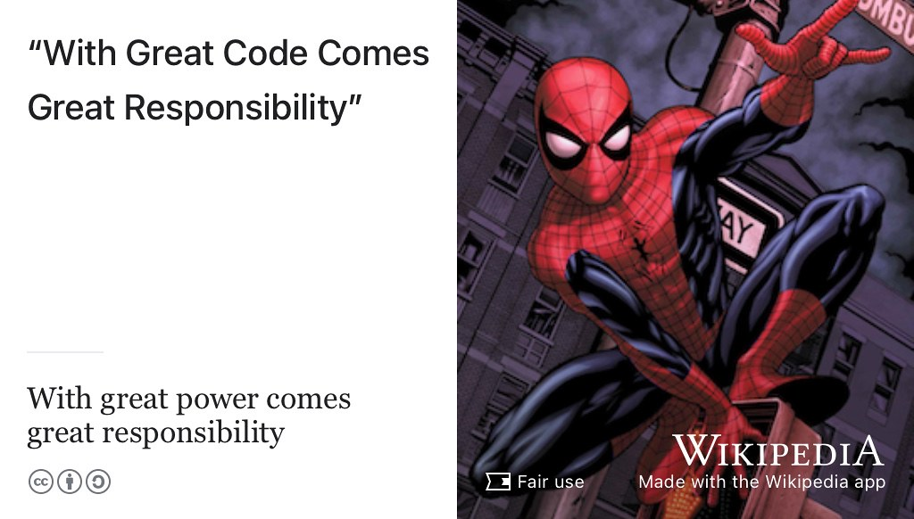

# Broadening your future {#broadening}

Do you feel like the *weird edge case* pictured in Figure \@ref(fig:default-user-fig)? Do typical graduate destinations such as large multi-national corporations, not really make you want to *[Shake Your Thang](https://en.wikipedia.org/wiki/Shake_Your_Thang)*? [@saltnpepa] Perhaps you want to:

* use your technical skills responsibly and ethically to make the world a better place?
* start your own business and make money for yourself, rather than other people?
* work in computing in roles beyond software engineering?

Broadening your initial job search described in chapter \@ref(finding) will open up more opportunities on your horizon. This chapter will broaden those horizons and get you to think about some of the less obvious options, because I *love* weird edge cases and you should too. 😻

```{r default-user-fig, echo = FALSE, fig.align = "center", out.width = "100%", fig.cap = "(ref:captiondefaultuser)"}
knitr::include_graphics("images/default-user-1280x959.png")
```

(ref:captiondefaultuser) Are you a weird edge case? By default, many graduates choose a graduate scheme with big brand, often a [blue-chip multinational](https://en.wikipedia.org/wiki/Blue_chip_(stock_market)) employer. While working for these kind of employers has many benefits, they are not the whole story. This chapter looks at some of the alternatives. [Default user](https://bryanmmathers.com/default-user/) by [Visual Thinkery](https://visualthinkery.com) is licensed under [CC-BY-ND](https://creativecommons.org/licenses/by-nd/4.0/)

Many technology jobs exist outside of technology companies, [@outsideit] because a lot of software is written to be used rather than sold. Consequently, many employers create bespoke software to fit the needs of their business. The people who build it are often employees, rather than people employed by a technology company. In the United States for example, ninety percent of IT jobs are outside the traditional tech industry. Technical jobs outside the technology sector often have the advantage of being more accessible than those within a very competitive technology sector. [@burninglass]

## What you will learn {#ilo11}
* Describe the less obvious careers that computer science can lead to, besides software engineering, including:
    + Starting a business or joining a startup
    + Working outside of the technology sector
    + Working outside of the private sector (governments, non-profits etc)
    + Roles allied to software engineering that require you to be a conversational programmer
* Recognise the social responsibility accompanying the power held by computer scientists
* Match and critically evaluate the values of an employer with your own values and ethics

## Beyond software engineering {#otheroles}
The phrase software engineering has been around since [Margaret Hamilton](https://en.wikipedia.org/wiki/Margaret_Hamilton_(software_engineer)) (figure \@ref(fig:hamilton-fig)) wrote code for NASA's Apollo program, and the practice of software engineering has been around even longer.
<!--Ada Lovelace is often credited as being the worlds first software engineer-->

```{r hamilton-fig, echo = FALSE, fig.align = "center", out.width = "100%", fig.cap = "(ref:captionhamilton)"}
knitr::include_graphics("images/margaret-hamilton.jpeg")
```

(ref:captionhamilton) The role of software engineer has been around for a long time but there are plenty of other roles for computer scientists beyond software engineering. [Margaret Hamilton](https://en.wikipedia.org/wiki/Margaret_Hamilton_(software_engineer)) in 1969 standing next to the (printed) navigation software that she and her MIT team produced for the Apollo program. Public domain image via Wikimedia Commons [w.wiki/3YJW](https://w.wiki/3YJW) adapted using the [Wikipedia app](https://apps.apple.com/us/app/wikipedia/id324715238)

Software engineers (or software developers) are one of the most popular roles for graduates (see e.g. figure \@ref(fig:nurses-fig)) but there are plenty of affiliated roles that computer scientists go into besides software engineering.

* Data scientist
* Product manager or owner  
* Project manager
* Software architect
* Business analyst
* Test engineer (QA)
* Usability engineer (HCI)
* Security engineer, penetration testing
* DevOps / sysadmin
* Consultant

What do these roles entail?

## With great code comes great responsibility {#peterparker}

Computer scientists wield tremendous power in the twenty first century.  We know that:

* With great power comes great responsibility [@spiderman]
* With great code comes great responsibility [@responsiblecs]

```{r spiderman-fig, echo = FALSE, fig.align = "center", out.width = "100%", fig.cap = "(ref:captionspiderman)"}

```

(ref:captionspiderman) The greater your code, the greater your superpower. [The greater your superpower, the greater your responsibility](https://en.wikipedia.org/wiki/With_great_power_comes_great_responsibility). What powers does computing give you and how can you use that power responsibly? [@spiderman; @responsiblecs; @Shapiro2021]

Given the growing power of computing in the twenty-first century, computer scientists have a duty to society to use that power responsibly and justly. How can they do so? Do computer scientists need to sell their soul to the highest bidder?

## Do you need to sell your soul? {#soul}
You'll sometimes hear people saying you need to sell your soul to get a job, shown in figure \@ref(fig:diabolical-fig). See for example:

* [Soul sold for less than £12](http://news.bbc.co.uk/1/hi/england/2051061.stm) [@bbcsoul]
* [google.com/search?q=selling+your+soul+to+your+employer](https://www.google.com/search?q=selling+your+soul+to+your+employer)
* [Am I Selling My Soul to Work for My Company?](https://www.thevectorimpact.com/selling-your-soul/) [@sellmysoul]

```{r diabolical-fig, echo = FALSE, fig.align = "center", out.width = "100%", fig.cap = "(ref:captiondevildeal)"}
knitr::include_graphics("images/deal-with-the-devil.jpeg")
```

(ref:captiondevildeal) In European folklore, doing a [deal with the devil](https://en.wikipedia.org/wiki/Deal_with_the_Devil) is a motif that recurs in culture. Wealth and power are just two of the items exchanged for a persons soul as part of diabolical deal. Public domain image of a painting of diabolical dealing by [Michael Pacher](https://en.wikipedia.org/wiki/Michael_Pacher) on Wikimedia Commons at [w.wiki/3VvX](https://w.wiki/3VvX) adapted using the [Wikipedia app](https://apps.apple.com/gb/app/wikipedia/id324715238)

So when you're searching for jobs and researching potential employers, one of the first things you need to find out is what the values and ethical principles of an employer are see section \@ref(beware). It's a quick way to evaluate what makes an organisation who they are. Most employers publish their values and ethics openly, here's a small selection to give you a flavour:

* Amazon [amazon.jobs/en/principles](https://www.amazon.jobs/en/principles)
* Microsoft [microsoft.com/en-us/about/corporate-values](https://www.microsoft.com/en-us/about/corporate-values)
* Apple [apple.com/compliance](https://www.apple.com/compliance/)
* Google [ai.google/principles](https://ai.google/principles/)
* Morgan Stanley [morganstanley.com/about-us/morgan-stanley-core-values](https://www.morganstanley.com/about-us/morgan-stanley-core-values)

```{r morgan-stanley-fig, echo = FALSE, fig.align = "center", out.width = "100%", fig.cap = "(ref:captionmorganstanley)"}
knitr::include_graphics("images/morgan-stanley-times-square.jpeg")
```

(ref:captionmorganstanley) [Morgan Stanley](https://en.wikipedia.org/wiki/Morgan_Stanley) is an American multinational investment bank and financial services company headquartered in New York City. The firms clients include corporations, governments, institutions and individuals. CC-BY picture of Morgan Stanley HQ in Times Square by [Ajay Suresh](https://flickr.com/photos/ajay_suresh/) on Wikimedia Commons [w.wiki/3Vnt](https://w.wiki/3Vnt) adapted using the [Wikipedia app](https://apps.apple.com/gb/app/wikipedia/id324715238)

Let's look at Morgan Stanley (figure \@ref(fig:morgan-stanley-fig)) as an example, I've chosen these values because they are brief and self-explanatory:

1. Do the right thing: act with integrity
1. Put clients first: listen to what the client is saying and needs
1. Lead with exceptional ideas: win by breaking new ground
1. Commit to Diversity and Inclusion: value individual and cultural differences
1. Give back: serve communities generously with expertise, time and money

Look at these values carefully, or choose the values of another employer you're interested in. What do they mean to you?

## Breakpoints {#bp9}
(ref:breakpoint)

```md
* PAUSE ⏸️
```

* How closely do a given employers values align with your own? You may need to revisit section \@ref(no42).
    + You might not get a 100% match but you're unlikely to enjoy working for an employer where your values don't match very well at all
* Are the stated values of an employer the whole story?
* Is there anything missing?
* Are there any unwritten rules? What an employers *says* and *does* may be contradictory. Actions speak louder than words.

```md
* RESUME ▶️
```

Once you've thought about these questions, you stand a much better chance of working out if a given employer is a good match for you. So do you have to sell your soul as shown in figure \@ref(fig:soul-fig)? It depends on what you value and if an employer shares those values with you.


```{r soul-fig, echo = FALSE, fig.align = "center", out.width = "100%", fig.cap = "(ref:captionsoul)"}
knitr::include_graphics("images/Sell your soul.png")
```

(ref:captionsoul) Here's a dilemma: Do you need to sell your soul to your employer? If so, how much can you get for it? What percentage stake of your soul will they ask for and how much are you willing to give? How do your values align with those of your employer? Soul selling dialog box sketch by [Visual Thinkery](https://visualthinkery.com/) is licensed under [CC-BY-ND](https://creativecommons.org/licenses/by-nd/4.0/)


## Summarising your alternatives {#tldr11}

[Too long, didn't read](https://en.wiktionary.org/wiki/too_long;_didn%27t_read) (TL;DR)? Here's a summary:

This chapter is under construction because I'm using agile book development methods, see figure \@ref(fig:deathstar8-fig).

```{r deathstar8-fig, echo = FALSE, fig.align = "center", out.width = "99%", fig.cap = "(ref:captiondeathstar)"}
knitr::include_graphics("images/DeathStar2.jpg")
```
