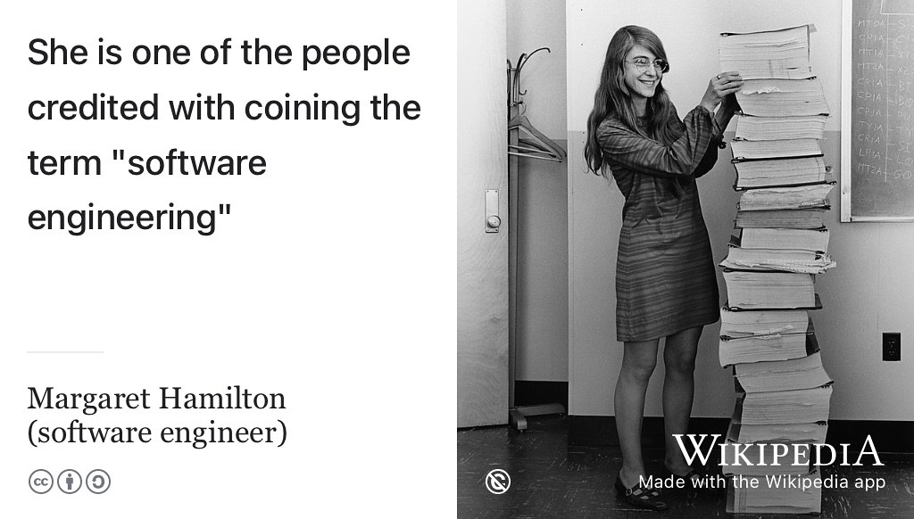
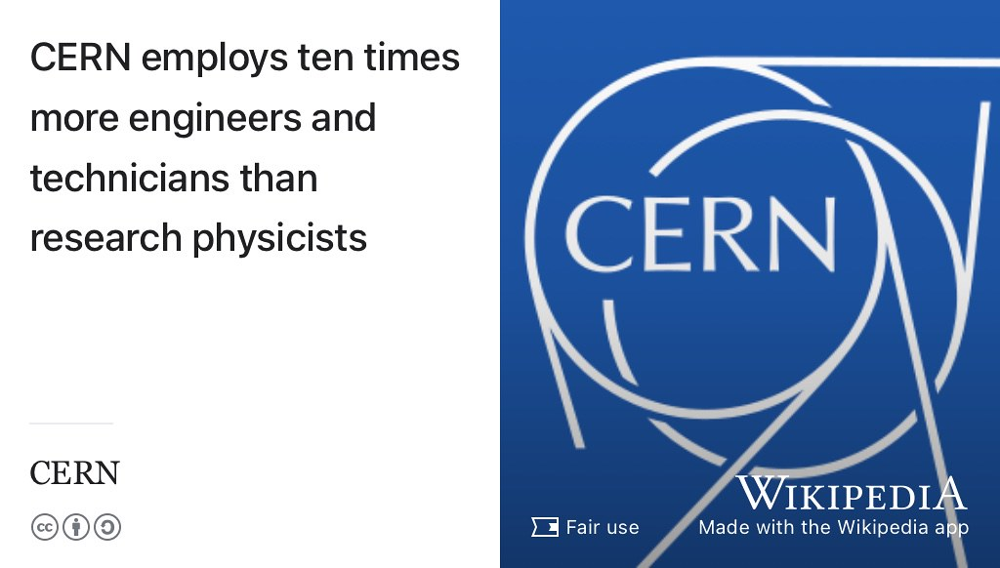
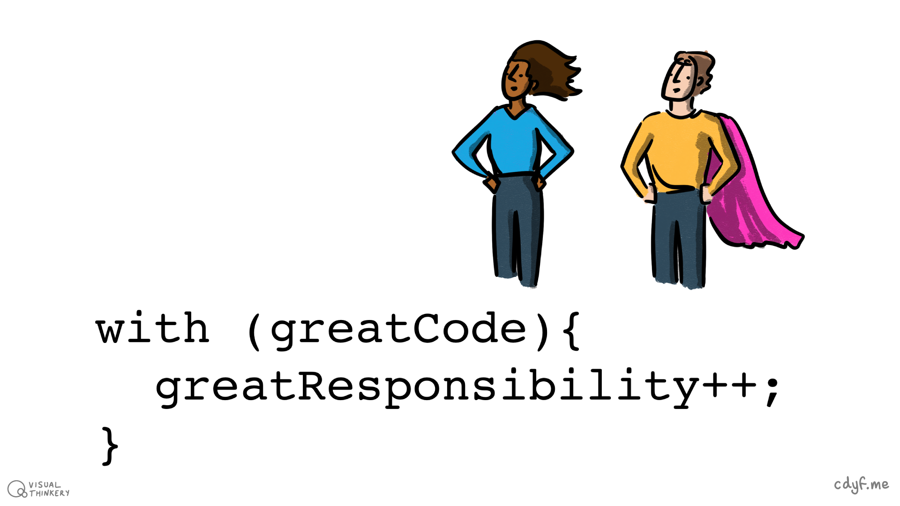
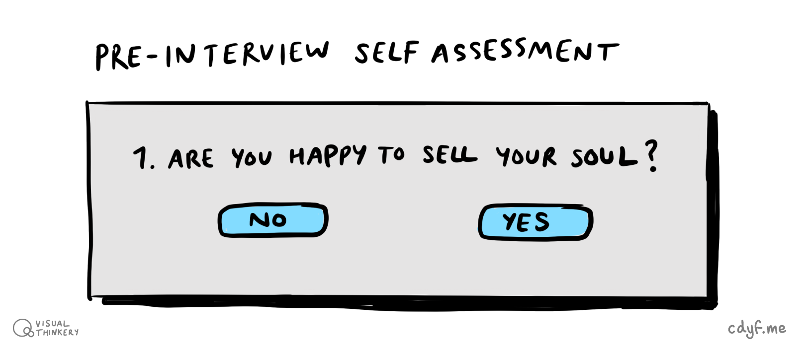

# Broadening your future {#broadening}

Do you feel like the *weird edge case* pictured in figure \@ref(fig:default-user-fig)? Do typical graduate destinations such as large multi-national corporations, not really make you want to *[Shake Your Thang](https://en.wikipedia.org/wiki/Shake_Your_Thang)*? [@saltnpepa] Perhaps you are interested in:

* using your technical skills responsibly and ethically to make the world a better place?
* starting your own business and making money for yourself, rather than other people?
* finding *hidden* or unadvertised vacancies?
* joining a startup instead of a large multinational corporation?
* venturing outside of the private sector?
* working in computing in roles beyond software engineering?

Broadening your initial job search described in chapter \@ref(finding) will open up more opportunities on your horizon. This chapter will broaden those horizons and get you to think about some of the less obvious options, because I *love* weird edge cases and you should too. 😻

```{r default-user-fig, echo = FALSE, fig.align = "center", out.width = "100%", fig.cap = "(ref:captiondefaultuser)"}
knitr::include_graphics("images/default-user-1280x959.png")
```

(ref:captiondefaultuser) Are you a weird edge case? By default, many graduates choose a graduate scheme with big brand, often a [blue-chip multinational](https://en.wikipedia.org/wiki/Blue_chip_(stock_market)) employer. While working for these kind of employers has many benefits, they are not the whole story. This chapter looks at some of the alternatives. [Default user](https://bryanmmathers.com/default-user/) by [Visual Thinkery](https://visualthinkery.com) is licensed under [CC-BY-ND](https://creativecommons.org/licenses/by-nd/4.0/)

Many technology jobs exist outside of technology companies, [@outsideit] because a lot of software is written to be used rather than sold. Consequently, many employers create bespoke software to fit the needs of their business. The people who build it are often employees, rather than people employed by a technology company. In the United States for example, ninety percent of IT jobs are outside the traditional tech industry. Technical jobs outside the technology sector often have the advantage of being more accessible than those within a very competitive technology sector. [@burninglass]

## What you will learn {#ilo11}
1. Describe the less obvious careers that computer science can lead to, besides software engineering, including:
    + Starting a business or joining a startup
    + Working outside of the technology sector
    + Working outside of the private sector (governments, non-profits etc)
    + Roles allied to software engineering that require you to be a conversational programmer
1. Recognise the social responsibility accompanying the power held by computer scientists
1. Evaluate and compare the values of an employer with your own values and ethics

## Beyond software engineering {#otheroles}
The phrase software engineering has been around since [Margaret Hamilton](https://en.wikipedia.org/wiki/Margaret_Hamilton_(software_engineer)) (figure \@ref(fig:hamilton-fig)) led the development of software for the [Apollo Guidance Computer](https://en.wikipedia.org/wiki/Apollo_Guidance_Computer) in the sixties. However, the *practice* of software engineering has been around even longer right back to [Ada Lovelace](https://en.wikipedia.org/wiki/Ada_Lovelace) in the nineteenth century.
<!--Ada Lovelace is often credited as being the worlds first software engineer-->


```{r hamilton-fig, echo = FALSE, fig.align = "center", out.width = "100%", fig.cap = "(ref:captionhamilton)"}

```

(ref:captionhamilton) The role of software engineer has been around for a long time but there are plenty of other roles for computer scientists beyond software engineering. [Margaret Hamilton](https://en.wikipedia.org/wiki/Margaret_Hamilton_(software_engineer)) in 1969 standing next to all of the printed code for the navigation software that she and her MIT team produced for the [Apollo Guidance Computer](https://en.wikipedia.org/wiki/Apollo_Guidance_Computer). Public domain image via Wikimedia Commons [w.wiki/3YJW](https://w.wiki/3YJW) adapted using the [Wikipedia app](https://apps.apple.com/us/app/wikipedia/id324715238)

Software engineers (or software developers if you prefer) are one of the most popular roles for graduates (see e.g. figure \@ref(fig:nurses-fig)) but there are plenty of affiliated roles that computer scientists go into besides software engineering.

* Data scientist, see [prospects.ac.uk/job-profiles/data-scientist](https://www.prospects.ac.uk/job-profiles/data-scientist)
* Database administrator (DBA), see [prospects.ac.uk/job-profiles/database-administrator](https://www.prospects.ac.uk/job-profiles/database-administrator)
* Product manager or owner, liaises with customers, management and engineers to define what a product does
* Project manager, see [prospects.ac.uk/job-profiles/project-manager](https://www.prospects.ac.uk/job-profiles/project-manager)
* Founder (or co-founder), starting your own business (startup)
* Freelance, becoming a self-employed contractor
* Forensic computer scientist, see [prospects.ac.uk/job-profiles/forensic-computer-analyst](https://www.prospects.ac.uk/job-profiles/forensic-computer-analyst)
* Business analyst see [prospects.ac.uk/job-profiles/business-analyst](https://www.prospects.ac.uk/job-profiles/business-analyst)
* Game developer (that's really just another name for software engineering) but see [prospects.ac.uk/job-profiles/game-developer](https://www.prospects.ac.uk/job-profiles/game-developer)
* Technical writer, see section \@ref(techwriting)
* Technical sales and marketing, see [prospects.ac.uk/job-profiles/technical-sales-engineer](https://www.prospects.ac.uk/job-profiles/technical-sales-engineer)
* Test engineer (QA) see [prospects.ac.uk/job-profiles/software-tester](https://www.prospects.ac.uk/job-profiles/software-tester)
* Research software engineer, see \@ref(rse)
* Usability engineer, often specialising in [Human–Computer Interaction](https://en.wikipedia.org/wiki/Human%E2%80%93computer_interaction) (HCI), [User Experience](https://en.wikipedia.org/wiki/User_experience) (UX) or front-end development
* Security engineer, penetration testing see [prospects.ac.uk/job-profiles/penetration-tester](https://www.prospects.ac.uk/job-profiles/penetration-tester)
* DevOps, sysadmin and [site reliability engineering](https://en.wikipedia.org/wiki/Site_reliability_engineering)
* Patent attorney, protecting and organisations technical I.P. see [prospects.ac.uk/job-profiles/patent-attorney](https://www.prospects.ac.uk/job-profiles/patent-attorney)
* Consultant, see [prospects.ac.uk/job-profiles/it-consultant](https://www.prospects.ac.uk/job-profiles/it-consultant) and [prospects.ac.uk/job-profiles/management-consultant](https://www.prospects.ac.uk/job-profiles/management-consultant)

<!--nonprofit, governmental, social -->
What do these roles entail?

## Research roles {#rse}

There are plenty of roles in computing working in research, either in computer science, or working alongside natural scientists, such as Physicists at [home.cern](https://home.cern/) or conventional scientists working at the laboratory bench. There are also lots roles in research software engineering (RSE), using software engineering to help people do better scientific research, see [society-rse.org](https://society-rse.org/). CERN employs ten times more engineers and technicians than research physicists, see figure \@ref(fig:cern-fig). For physicists to understand the data that pours off the [Large Hadron Collider](https://en.wikipedia.org/wiki/Large_Hadron_Collider) (LHC), you need armies of engineers to enable the scientists to do their work. A *lot* of those engineers are working on hardware and software.

```{r cern-fig, echo = FALSE, fig.align = "center", out.width = "100%", fig.cap = "(ref:captioncern)"}

```

(ref:captioncern) Many scientific laboratories like CERN employ lots of software and hardware engineers. Computation isn't just a fundamental part of physics, it is key to all the natural sciences. Fair use image via Wikimedia Commons [w.wiki/4qmF](https://w.wiki/4qmF) adapted using the [Wikipedia app](https://apps.apple.com/us/app/wikipedia/id324715238)

An non-exhaustive list of laboratories from the UK and Europe that employ computer scientists is shown below:

* CERN, see [careers.cern](https://careers.cern/) and [careers.cern/join-us/students](https://careers.cern/join-us/students)
* The [Francis Crick Institute](https://en.wikipedia.org/wiki/Francis_Crick_Institute) see e.g. [crick.ac.uk/careers-study/students/sandwich-students](https://www.crick.ac.uk/careers-study/students/sandwich-students)
* The [Daresbury Laboratory](https://en.wikipedia.org/wiki/Daresbury_Laboratory), see [stfccareers.co.uk/students/](https://stfccareers.co.uk/students/) under *Computing*
* The Diamond Light Source [diamond.ac.uk](https://www.diamond.ac.uk/) see [diamond.ac.uk/Careers/Students/Year-in-Industry.html](https://www.diamond.ac.uk/Careers/Students/Year-in-Industry.html)
* The European Bioinformatics Institute [ebi.ac.uk](https://www.ebi.ac.uk/) see [ebi.ac.uk/careers](https://www.ebi.ac.uk/careers)
* The Earlham Institute [earlham.ac.uk](https://www.earlham.ac.uk/) e.g. [earlham.ac.uk/year-industry](https://www.earlham.ac.uk/year-industry)
* The [ISIS Neutron and Muon source](https://en.wikipedia.org/wiki/ISIS_Neutron_and_Muon_Source) see  [isis.stfc.ac.uk/Pages/Students.aspx](https://www.isis.stfc.ac.uk/Pages/Students.aspx) and [stfccareers.co.uk/students/](https://stfccareers.co.uk/students/) under *Computing*
* The Jodrell Bank Observatory [jodrellbank.manchester.ac.uk](https://www.jodrellbank.manchester.ac.uk/)
* The [metoffice.gov.uk](https://www.metoffice.gov.uk/), see [metoffice.gov.uk/about-us/careers/apprentices-graduates-and-placements](https://www.metoffice.gov.uk/about-us/careers/apprentices-graduates-and-placements)
* The Plymouth Marine Laboratory [pml.ac.uk](https://www.pml.ac.uk/) see [pml.kallidusrecruit.com](https://pml.kallidusrecruit.com/)
* The Rutherford Appleton Laboratory ([RAL](https://en.wikipedia.org/wiki/Rutherford_Appleton_Laboratory)) see [stfccareers.co.uk/students/](https://stfccareers.co.uk/students/) under *Computing*
* The Wellcome Sanger Institute [sanger.ac.uk](https://www.sanger.ac.uk/)
* More like this at [jobs.ac.uk](https://jobs.ac.uk/)

These are mainly UK opportunities, but it is a similar story around the world. Many Universities and research institutes have summer internships for computer science students working alongside researchers. For example, at the University of Manchester, summer vacancies tend to be advertised each year around April/May. Wherever you are, speak to the head of a research lab you're interested in. Ask them if they have plans to take on summer students.

If you're thinking of doing postgraduate study, see chapter \@ref(researching). Commercial experience gained on a summer internship or placement year is valued by *all* employers (not just commercial ones) so doing an internship or placement during your undergraduate degree is valuable wherever you end up, see section \@ref(realworld).

## With great code comes great responsibility {#peterparker}

Computer scientists wield tremendous power in the twenty first century.  We know that:

* With great power comes great responsibility [@spiderman]
* With great code comes great responsibility [@responsiblecs]

```{r spiderman-fig, echo = FALSE, fig.align = "center", out.width = "100%", fig.cap = "(ref:captionspiderman)"}

```

(ref:captionspiderman) The greater your code, the greater your superpower. [The greater your superpower, the greater your responsibility](https://en.wikipedia.org/wiki/With_great_power_comes_great_responsibility). What powers does computing give you and how can you use that power responsibly? [@Shapiro2021] With great code sketch by [Visual Thinkery](https://visualthinkery.com/) is licensed under [CC-BY-ND](https://creativecommons.org/licenses/by-nd/4.0/)

Given the growing power of computing in the twenty-first century, computer scientists have a duty to society to use that power responsibly and justly. How can they do so? Do computer scientists need to sell their soul to the highest bidder? How can computer science be used to make the world a better place, not just making rich people richer? Lets look at these in turn

## Do you need to sell your soul? {#soul}
You will sometimes hear people saying you need to sell your soul to get a job, shown in figure \@ref(fig:diabolical-fig). See for example:

* [Soul sold for less than £12](http://news.bbc.co.uk/1/hi/england/2051061.stm) [@bbcsoul]
* [Am I Selling My Soul to Work for My Company?](https://www.thevectorimpact.com/selling-your-soul/) [@sellmysoul]
* [google.com/search?q=selling+your+soul+to+your+employer](https://www.google.com/search?q=selling+your+soul+to+your+employer)

```{r diabolical-fig, echo = FALSE, fig.align = "center", out.width = "100%", fig.cap = "(ref:captiondevildeal)"}

```

(ref:captiondevildeal) In European folklore, doing a [deal with the devil](https://en.wikipedia.org/wiki/Deal_with_the_Devil) is a motif that recurs in culture. Wealth, power and knowledge are some of the items that might be traded for a persons soul as part of diabolical deal. Will you need to sell your soul to the devil to get the job you want? Public domain image of an engraving by Adolf Gnauth showing [Faust](https://en.wikipedia.org/wiki/Faust) cutting a deal with [Mephistopheles](https://en.wikipedia.org/wiki/Mephistopheles) on Wikimedia Commons at [w.wiki/3zio](https://w.wiki/3zio) adapted using the [Wikipedia app](https://apps.apple.com/gb/app/wikipedia/id324715238) 😈

So when you're searching for jobs and researching potential employers, one of the first things you need to find out is what the values and ethical principles of an employer are, see section \@ref(beware). This is a quick way to evaluate what makes an organisation who they are. Most employers publish their values and ethics openly, here's a small selection to give you a flavour:

* Amazon [amazon.jobs/en/principles](https://www.amazon.jobs/en/principles)
* Microsoft [microsoft.com/en-us/about/corporate-values](https://www.microsoft.com/en-us/about/corporate-values)
* Apple [apple.com/compliance](https://www.apple.com/compliance/)
* Google [ai.google/principles](https://ai.google/principles/)
* Morgan Stanley [morganstanley.com/about-us/morgan-stanley-core-values](https://www.morganstanley.com/about-us/morgan-stanley-core-values)

```{r morgan-stanley-fig, echo = FALSE, fig.align = "center", out.width = "100%", fig.cap = "(ref:captionmorganstanley)"}

```

(ref:captionmorganstanley) [Morgan Stanley](https://en.wikipedia.org/wiki/Morgan_Stanley) is an American multinational investment bank and financial services company headquartered in New York City. The firms clients include corporations, governments, institutions and individuals. CC-BY picture of Morgan Stanley HQ in Times Square by [Ajay Suresh](https://flickr.com/photos/ajay_suresh/) on Wikimedia Commons [w.wiki/3Vnt](https://w.wiki/3Vnt) adapted using the [Wikipedia app](https://apps.apple.com/gb/app/wikipedia/id324715238)

Let's look at Morgan Stanley (figure \@ref(fig:morgan-stanley-fig)) as an example, I've chosen these values because they are brief and self-explanatory. Morgan Stanley's values are to:

1. Do the right thing: act with integrity
1. Put clients first: listen to what the client is saying and needs
1. Lead with exceptional ideas: win by breaking new ground
1. Commit to Diversity and Inclusion: value individual and cultural differences
1. Give back: serve communities generously with expertise, time and money

Look at these values carefully, or choose the values of another employer you're interested in. What do they mean to you?

Do an employers words match their actions? The words **[Don't be evil](https://en.wikipedia.org/wiki/Don%27t_be_evil)** are easy to *say* but harder to *action*. Good intentions are often easier said than done.

## Computing the future {#betterplace}
The human race faces some daunting issues in the 21st century:

* Mitigating the effects of climate change
* Tackling rising global inequalities of wealth, income and gender [@stanley]
* Providing food, water, shelter, energy, education and healthcare for a global population which is rapidly approaching [8 billion people](https://www.worldometers.info/world-population/)

How can computing be an ethical force for change that improves the lives people everywhere, not just those that are lucky enough to be on the wealthier side of the digital divide?

* How can computing make a difference?
* How can **YOU** use Computer Science to make the world a better place?

## Breakpoints {#bp9}
(ref:breakpoint)

```md
* PAUSE ⏸️
```

* How closely do a given employers values align with your own? You may need to revisit section \@ref(no42).
    + You might not get a 100% match but you're unlikely to enjoy working for an employer where your values don't match very well at all
* Are the stated values of an employer the whole story?
    + Are there any unwritten or unspoken rules?
* Is there anything missing?
* Do the employers actions match their words? What an employer *says* and *does* may be contradictory. Actions speak louder than words
* What can computing do to tackle global challenges described in section \@ref(betterplace)

```md
* RESUME ▶️
```

Once you've thought about these questions, you stand a much better chance of working out if a given employer is a good match for you. So do you have to sell your soul as shown in figure \@ref(fig:soul-fig)? It depends on what you value and if an employer shares those values with you.


```{r soul-fig, echo = FALSE, fig.align = "center", out.width = "100%", fig.cap = "(ref:captionsoul)"}

```

(ref:captionsoul) Here's a dilemma: Do you need to sell your soul to your employer? If so, how much can you get for it? What percentage stake of your soul will they ask for and how much are you willing to give? How do your values align with those of your employer? Soul selling dialog box sketch by [Visual Thinkery](https://visualthinkery.com/) is licensed under [CC-BY-ND](https://creativecommons.org/licenses/by-nd/4.0/)


## Summarising your alternatives {#tldr11}

[Too long, didn't read](https://en.wiktionary.org/wiki/too_long;_didn%27t_read) (TL;DR)? Here's a summary:

This chapter is under construction because I'm using agile book development methods, see figure \@ref(fig:deathstar8-fig).

```{r deathstar8-fig, echo = FALSE, fig.align = "center", out.width = "99%", fig.cap = "(ref:captiondeathstar)"}
knitr::include_graphics("images/DeathStar2.jpg")
```
