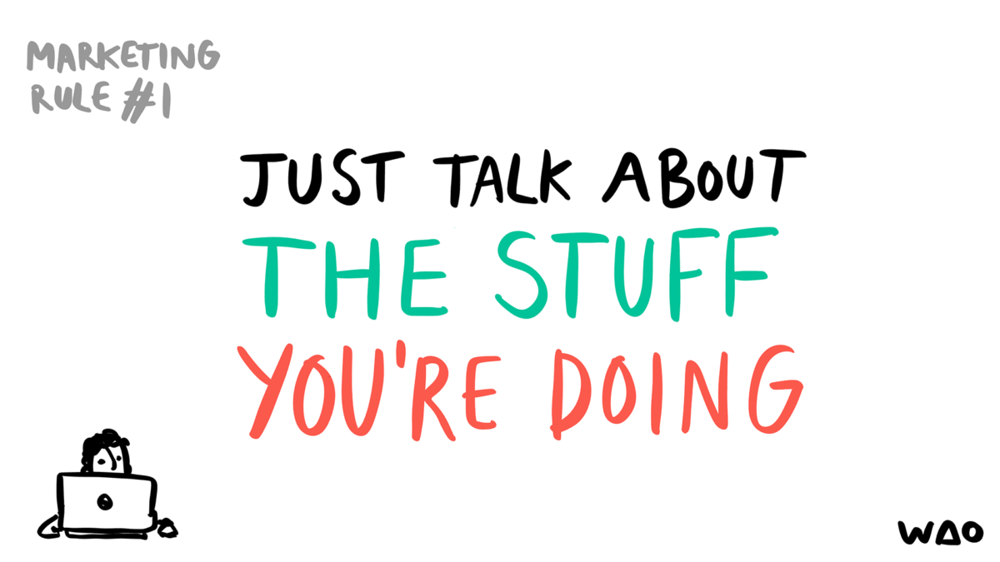
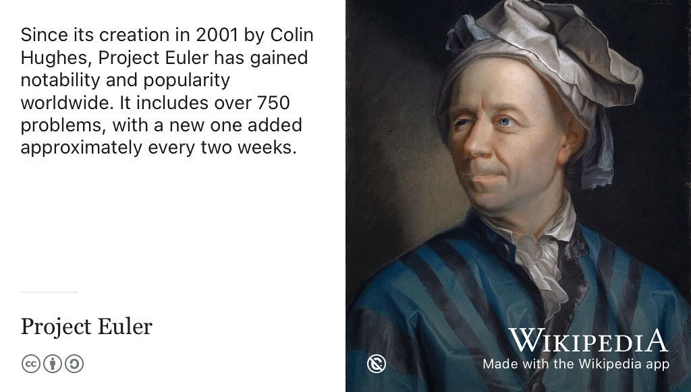
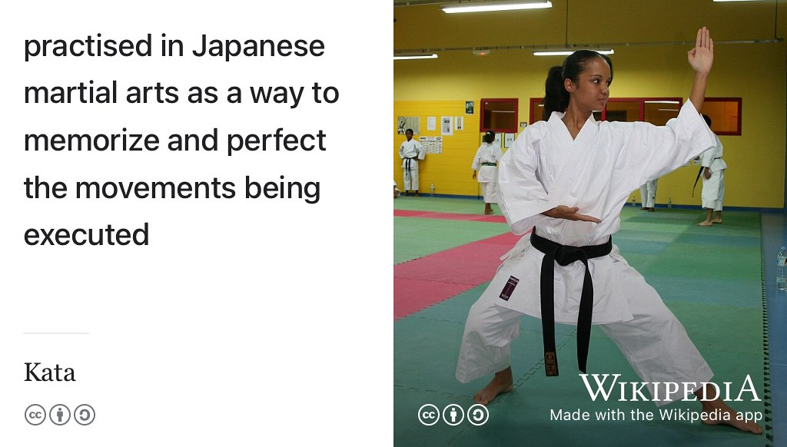
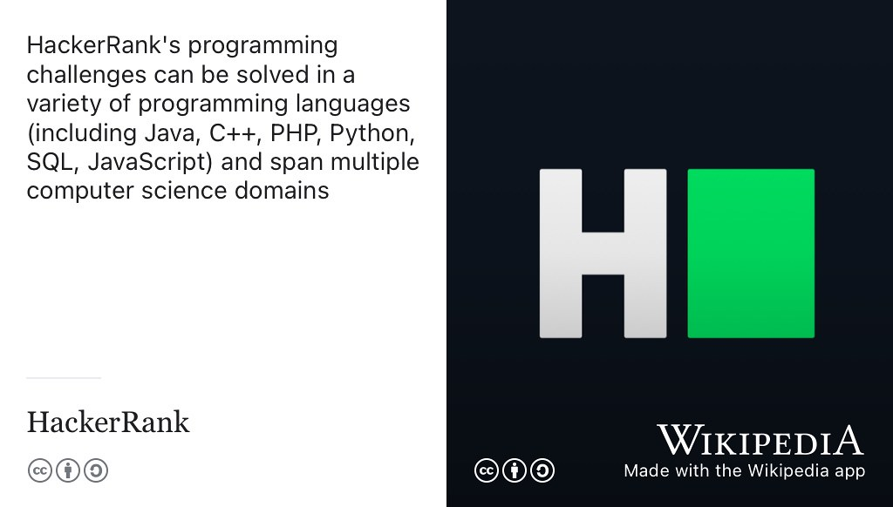
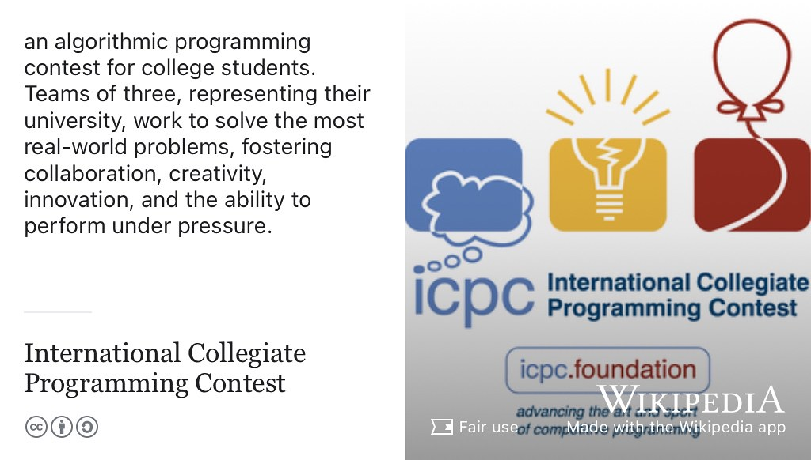
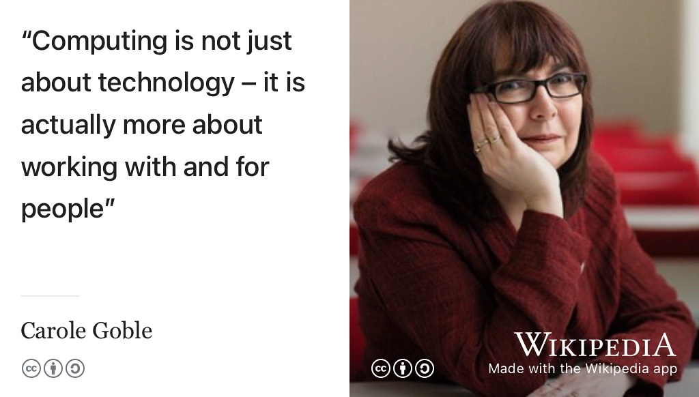

# Speaking your future {#speaking}

Congratulations, you've been invited to an interview. It might be by telephone, video link, in person or as part of an assessment centre where you'll be asked to complete several other tasks and tests. Being invited to an interview means that your written application (CV, covering letter, application form or digital portfolio) has hit the target and is bug free, see figure \@ref(fig:bugfree-fig). All that reading and writing has paid off. BULLSEYE! 🎯

```{r bugfree-fig, echo = FALSE, fig.align = "center", out.width = "100%", fig.cap = "(ref:captionbugfree)"}
knitr::include_graphics("images/My CV is bug free.png")
```
(ref:captionbugfree) If you have got an interview, then you have proved that your CV is bug free. That doesn't mean your CV is perfect, it just means that it is good enough to get you an interview with that particular employer. Congratulations! What comes next? Bug free sketch by [Visual Thinkery](https://visualthinkery.com/) is licensed under [CC-BY-ND](https://creativecommons.org/licenses/by-nd/4.0/)

Having passed the first stage of *reading and writing*, you move onto *listening and speaking* stage of interviewing. One of your goals is to convince the interviewers that you can articulate yourself clearly, and communicate well by listening carefully to their questions and answering with spoken natural language. These are fundamental communication skills discussed in section \@ref(cio) on communication I/O.

If you've got an interview, you can feel good about having a bug-free CV shown in figure \@ref(fig:bugfree-fig). Now you have a new set of problems to tackle. How can you prepare for the interview? What kinds of interviews exist and what questions might you be asked? If they offer you a job, how will you negotiate the terms, conditions and salary? Do you *really* want the job and are they the kind of people you actually want to work with everyday? If successful, you will be giving this employer:

* most of the hours of your day
* most of the days of your week
* most of the weeks of your year

This job will take a significant chunk of the next few months, year or even up to two years (and more) for a graduate scheme [@jonathanblack]. It's  the start of a much longer journey of up to [80,000 hours](https://80000hours.org/) that you'll spend in employment during your life.

So you want to ensure employers are a good match and not going to waste your time. You'll be interviewing them, as well as them interviewing you, so it will pay to have some questions prepared alongside your answers to questions you can anticipate.

## What you will learn {#ilo9}

By the end of this chapter you will be able to:

1. Identify kinds of interviews you might be invited to
1. Anticipate common interview questions, both technical and non-technical
1. Prepare questions for your interviewer by researching the employer
1. Formulate strategies for negotiating job offers
1. Calm your interview nerves

## Interviews
<!-- Add BOB YOU"RE ON MUTE!!! -->

Broadly speaking there are two basic kinds of interviews:

1. non-technical interview, sometimes called competency based interview or human resources (HR) style interview, see \@ref(hrinterview)
1. technical style or [coding interview](https://en.wikipedia.org/wiki/Coding_interview), see section \@ref(codinginterview)

These can be conducted in various modes:

### Modes of interview {#mode}

Interviews can be conducted in various modes:

```{r bobonmute-fig, echo = FALSE, fig.align = "center", out.width = "100%", fig.cap = "(ref:bobonmute)"}
knitr::include_graphics("images/bob-youre-on-mute.png")
```

(ref:bobonmute) Got a video interview? Toggle your mute button. [Bob...](https://bryanmmathers.com/bob/) by [Visual Thinkery](https://visualthinkery.com/) is licensed under [CC-BY-ND](https://creativecommons.org/licenses/by-nd/4.0/)


* telephone (no visual contact)
* pre-recorded pieces to camera, you talking to your webcam
* teleconference (zoom / teams etc) with cameras and microphones turned on
* real-time face to face


### Competency interviews {#hrinterview}

Competency interviews test some of your softer skills, find out who you are (see chapter \@ref(knowing)), how you work in a team and if you can communicate well. A good interview strategy for any interview is to talk about what you are doing (and what you have done) as shown in figure \@ref(fig:overthinking-fig). It might even help to have a checklist in your head of things you'd like to talk about such as:

* one work experience, see chapter \@ref(experiencing)
* a couple of projects, see section \@ref(mycvpj)
* some university projects, see section \@ref(mycvpj).

If you can, make sure you've mentioned everything on your checklist by the end of the interview.

```{r overthinking-fig, echo = FALSE, fig.align = "center", out.width = "99%", fig.cap = "(ref:captionoverthinking)"}


```

(ref:captionoverthinking) During an interview, you are marketing yourself to an employer while they market themselves to you. It can be easy to overthink your marketing. A simple marketing technique is to just talk about stuff you're doing, projects you've worked on (inside and outside University), your experience and any other relevant activities. [The number 1 rule of marketing](https://bryanmmathers.com/the-1-rule-of-marketing/) by [Visual Thinkery](https://visualthinkery.com/) is licensed under [CC-BY-ND](https://creativecommons.org/licenses/by-nd/4.0/)

Here are some common competency interview questions. Imagine you are going on a stage, prepare lines that answer these questions, rehearse them out loud in front of a mirror (or a critical friend).

1. What roles do you play in a team, with examples?
1. Tell me about a time when you showed integrity and professionalism
1. Can you give an example of a situation where you solved a problem in a creative way?
1. Tell me about a big decision you've made recently. How did you go about it?
1. Give an example of a time you resolved conflict
1. How do you maintain healthy working relationships with your team?
1. Describe a project where you had to use different leadership styles to reach your goal
1. Give me an example of a challenge you faced and tell me how you overcame it
1. How do you influence people in a situation with conflicting agendas?
1. Tell me about a time that you made a decision and then changed your mind.
1. Tell me about a time when you achieved success even when the odds were stacked against you.
1. Tell me about a time when you have provided an excellent service
1. Give me an example of a time when you have had multiple deadlines to meet? How did prioritise your workload?
1. What would you say is your main development area?

For more examples of non-technical questions see:

* [google.com/search?q=competency+based+interview+questions](https://www.google.com/search?q=competency+based+interview+questions)
<!--* [careers.manchester.ac.uk/applicationsinterviews/interviews](https://www.careers.manchester.ac.uk/applicationsinterviews/interviews/)-->

Since there's already tonnes of information on competency based interviews, the rest of this chapter will focus on technical interviews, also known as [coding interviews](https://en.wikipedia.org/wiki/Coding_interview).

### Coding interviews {#codinginterview}
Many employers use technical or coding interviews to assess your harder skills. Not every employer does, but they are widely used by employers. Preparing for coding interviews is a good way to become a better engineer, so even if you don't have to face a series of really tough coding interviews, it is worth knowing about them.

::: {.rmdcaution}
(ref:codingcaution)

The competitive coding and technical interviews described in this chapter test a narrow set of algorithmic skills. While it's important to prepare for technical interviews, [they have well documented limitations](https://www.quora.com/What-are-some-common-criticisms-of-Cracking-the-Coding-interview). [@murashenkov] Skills required for software engineering go beyond the purely technical ones. For example, your (soft) communication skills outlined in chapter \@ref(writing), and many other broader skills, are just as important as your (hard) technical abilities.
:::
<!-- I Cheated on My Microsoft Interview you can cheat [@cheating]


1. Using a whiteboard (or even google docs), you're unlikely to have access to a compiler or an IDE
1. Pattern matching (what interview questions are similar to this)
1. Simplify and generalise (tweak constraints, then does that approach )
1. Clarify the question, state your assumptions
1. Base case and build () start from n = 1, then build to n = 2 etc [@polya]
1. Show your working, talk out loud, mention trade-offs of your approach^[gayle video https://www.youtube.com/watch?v=BN0B4mOtwX0]


Solving different coding challenges can help you become a better problem solver, master a given programming language, prepare for job interviews and learn new algorithms. It will help you become a better engineer and can provide good evidence for the experience section of your CV.-->


There are a lots of resources to help you prepare for and practice coding interview questions, the best place to start is *Cracking the Coding Interview* by [Gayle Laakmaan McDowell](https://en.wikipedia.org/wiki/Gayle_Laakmann_McDowell). [@cracking] As well as reading Gayle's book, there are lots of online resources to help you prepare for coding interviews. Before we look at those, University of Manchester Computer Science graduate Petia Davidova explains in figure \@ref(fig:petia-fig) what she learned from failing several coding interviews at big technology companies. 😭


```{r petia-fig, echo = FALSE, fig.align = "center", out.width = "99%", fig.cap = "(ref:captionpetia)"}


```

(ref:captionpetia) Petia describes her worst software engineering interview failures. [@youtube-petia] Petia demonstrates a growth mindset (section \@ref(growthmindset)) and productive failure(s). Although she failed her interviews, she learned lots from the process and went on to get a job she wanted. The image above is a screenshot, you can watch the full 16 minute video at [youtu.be/qkeQNNjZuQk](https://youtu.be/qkeQNNjZuQk)


<!--if kipling-->

Coding interviews can be tough, but preparing for them, and doing them will make you a better engineer. So if you spectacularly wipeout in your coding interview, reflect and think how can you improve next time? Perhaps you need to

* Read up on some more data structures
* Familiarise yourself with more algorithms
* Practice thinking out loud (verbally) by doing a mock technical interview?

All of these activities will help both your general professional development and your chances of success in future technical interviews. Thankfully there are plenty of resources out there for helping you get better at coding interviews, so let's have a look at some. Some of these resources are more about problem solving for recreation, rather than interview preparation, but they will all help you become a better engineer.

<!--see https://github.com/dullhunk/cdyf/issues/206 -->


### Project Euler {#euler}
Project Euler provides a wide range of challenges in computer science and mathematics. The challenges typically involve solving a mathematical formula or equations, see [projecteuler.net](https://projecteuler.net/) and figure \@ref(fig:euler-fig)

```{r euler-fig, echo = FALSE, fig.align = "center", out.width = "99%", fig.cap = "(ref:captioneuler)"}


```

(ref:captioneuler) Since its creation in 2001 by Colin Hughes [projecteuler.net](https://projecteuler.net/) has become internationally popular, with new problems added approximately every two weeks. [@colinhughes] Public domain image of a painting of [Leonhard Euler](https://en.wikipedia.org/wiki/Leonhard_Euler) by [Jakob Emanuel Handmann](https://en.wikipedia.org/wiki/Jakob_Emanuel_Handmann) on Wikimedia Commmons [w.wiki/3WAV](https://w.wiki/3WAV) adapted using the Wikipedia app.  


### Topcoder
TopCoder is a platform for competitive programming online. You can complete on your own directly online using their code editor. Single round matches are offered a few times per month at a specific time where you compete against others to solve challenges against the clock, see [topcoder.com](https://www.topcoder.com/)


### Codewars
Codewars allows you to challenge yourself on [kata](https://en.wikipedia.org/wiki/Kata) (型), created by the community to strengthen different skills. Master your current language of choice, or expand your understanding of a new one. Find out more at [codewars.com](https://www.codewars.com) and see figure \@ref(fig:codewars-kata-fig)

```{r codewars-kata-fig, echo = FALSE, fig.align = "center", out.width = "99%", fig.cap = "(ref:captioncodewars)"}

```

(ref:captioncodewars) Just like martial arts, you can practice the computational arts with [kata](https://en.wikipedia.org/wiki/Kata) (型) on [codewars.com](https://www.codewars.com) and elsewhere. CC BY-SA Picture of world champion Emmanuelle Fumonde by Thierry Caro on Wikimedia Commmons [w.wiki/3XeE](https://w.wiki/3XeE) adapted using the [Wikipedia app](https://apps.apple.com/us/app/wikipedia/id324715238).  


### Leetcode {#leetcode}
LeetCode is a platform to help you enhance your skills, expand your knowledge and prepare for technical interview see [leetcode.com](https://leetcode.com).

### HackerRank {#hackerrank}
HackerRank allows developers to practice their coding skills, prepare for interviews and get hired. HackerRank allows users to submit applications and apply to jobs by solving company-sponsored coding challenges. Some employers use hackerrank as part of the interviewing process, so these are not just academic exercises.

Hacker Rank provide a discussion and leaderboard for every challenge, and most challenges come with an editorial that explains more about the challenge, see [hackerrank.com](https://www.hackerrank.com/) and figure \@ref(fig:hackerrank-fig)

```{r hackerrank-fig, echo = FALSE, fig.align = "center", out.width = "99%", fig.cap = "(ref:captionhackerrank)"}

```

(ref:captionhackerrank) HackerRank's programming challenges can be solved in a variety of programming languages (including Java, C++, PHP, Python, SQL, JavaScript) and span multiple computer science domains. HackerRank logo from Wikimedia Commons at [w.wiki/3WAP](https://w.wiki/3WAP) adapted using the [Wikipedia App](https://apps.apple.com/us/app/wikipedia/id324715238).


### Pramp

Pramp offers free mock technical interviewing platform for engineers. Pramp, **Pra**ctice **m**akes **p**erfect, was founded in 2015 by Rafi Zikavashvili and David Glauber. As engineers, they were frustrated by the lack of resources to help them prepare for coding interviews. Find out more at [pramp.com](https://www.pramp.com)

### ICPC

More than 50,000 students worldwide from more than 3,000 universities in 111 countries participate in over 400 on-site competitions as part of the International Collegiate Programming Contest (ICPC) see [icpc.global](https://icpc.global/) and figure \@ref(fig:icpc-fig).

```{r icpc-fig, echo = FALSE, fig.align = "center", out.width = "99%", fig.cap = "(ref:captionicpc)"}


```

(ref:captionicpc) In their own words, ICPC is “an algorithmic programming contest for college students. Teams of three, representing their university, work to solve the most real-world problems, fostering collaboration, creativity, innovation, and the ability to perform under pressure. Through training and competition, teams challenge each other to raise the bar on the possible. Quite simply, it is the oldest, largest, and most prestigious programming contest in the world.” [@icpc]

ICPC is organised by the [Association for Computing Machinery](https://en.wikipedia.org/wiki/Association_for_Computing_Machinery) (ACM), a global community which advances computing as a science and a profession.

There are subregional contests for ICPC, so in the UK there is the United Kingdom and Ireland Programming Competition (UKIEPC) which is part of the Northwestern Europe European Regional Contest (NWERC).

UKIEPC has been held annually since 2013 to help universities pick teams to travel to NWERC. Ask your University if they are involved, see [ukiepc.info](http://ukiepc.info). If they aren't involved yet, you could encourage them to join. It's not just about winning, it's also about taking part.

<!-- interviews can be counter-productively stressful [@stressyinterviews]-->


<!--### changing your mind

You may decide to change your mind about an offer you've already accepted. You need to

* Are you sure? Think it through carefully, discuss your options with friends and family.
* Read your contract of employment again: there may be clauses in your contract describing the consequences of changing your mind - make sure you understand these
* Tell the employer quickly: explain why you've changed your mind (personal circumstances, you have a better offer etc) the sooner the better
* Learn from this mistake: it's not good to accept offers you're not serious about so try to learn from this mistake so you don't repeat it in the future

  IANAL [1] but according to Professor Google:

  Can I decline a job offer after signing the contract?
  https://www.bcllegal.com/knowledge-base/from-the-team/can-decline-job-offer-signing-contract

  Rejecting job offer after signing contract
  https://forums.moneysavingexpert.com/discussion/6014883/rejecting-job-offer-after-signing-contract

  Can I decline a job offer after signing the contract?
  https://www.thestudentroom.co.uk/showthread.php?t=4702248-->


<!-- via serena

* What are your values?
* What are their values?
* Prospects for growth? * Training?
* Company culture (glassdoor, network, ask them)
* Pay
* Geography

-->

## Breakpoints {#bp10}
(ref:breakpoint)

```md
* PAUSE ⏸️
```

Let's imagine you're applying to work at an employer called `widget.com`. During you're application you need to find out:

* What the main products and services that the organisation provides?
* Who are their clients or customers?
* Who are their biggest competitors?
* What are their values, principles and ethical policies? See section \@ref(bp9)
* What sector do they principally operate in?
* Who are the market leaders in that sector?
* How is the sector changing, for example how is technology having an impact on their business?

```md
* RESUME ▶️
```

<!-- see e.g. https://www.thebalancecareers.com/how-to-turn-down-a-job-offer-you-already-accepted-2061404 -->

## Communication, communication, communication! {#comms}
Interviews are about a lot more than the answers you give to questions, they also test *how* you communicate, both verbally and non-verbally. We looked at communication skills in section \@ref(cio) and throughout chapter \@ref(writing) on *writing your future*. This chapter has discussed some spoken communication skills which complement your written communication skills.

```{r carole-goble-fig, echo = FALSE, fig.align = "center", out.width = "98%", fig.cap = "(ref:captiongoble)"}

```

(ref:captiongoble) Computing is about much more than technology. Interviews will test some of your spoken communication skills, these are fundamental in working with and for people. [@frengoble] CC BY-SA portrait of scientist and engineer [Carole Goble](https://en.wikipedia.org/wiki/Carole_Goble) by Rob Whitrow on Wikimedia Commons [w.wiki/5542](https://w.wiki/5542) adapted using the [Wikipedia app](https://apps.apple.com/gb/app/wikipedia/id324715238)

Computing is not just about technology - it is actually more about working with and for people, see figure \@ref(fig:carole-goble-fig). So as well as testing technical knowledge, an interview (coding interview or otherwise) is a test of *how* you communicate in spoken language, not just how you speak, but how you listen and converse. [@frengoble]


## Summarising interviews {#tldr9}
(ref:tldr)

We've looked at a range of platforms and competitions that can help you prepare for coding interviews. These won't just make you better at coding interviews, they'll make you a better engineer too, whatever stage you're at.

This chapter is under construction because I'm using agile book development methods, see figure \@ref(fig:deathstar6-fig).

```{r deathstar6-fig, echo = FALSE, fig.align = "center", out.width = "99%", fig.cap = "(ref:captiondeathstar)"}
knitr::include_graphics("images/DeathStar2.jpg")
```
