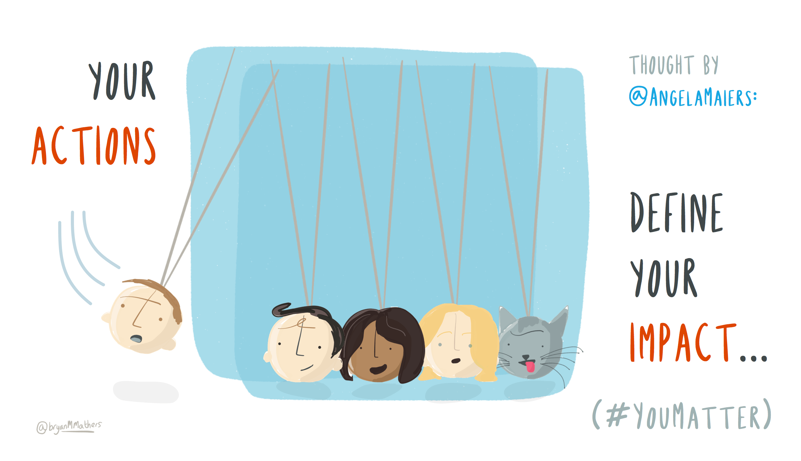
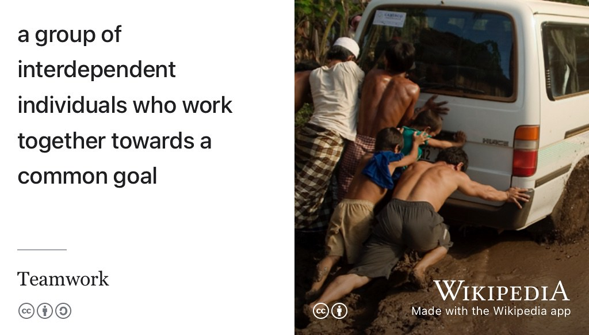
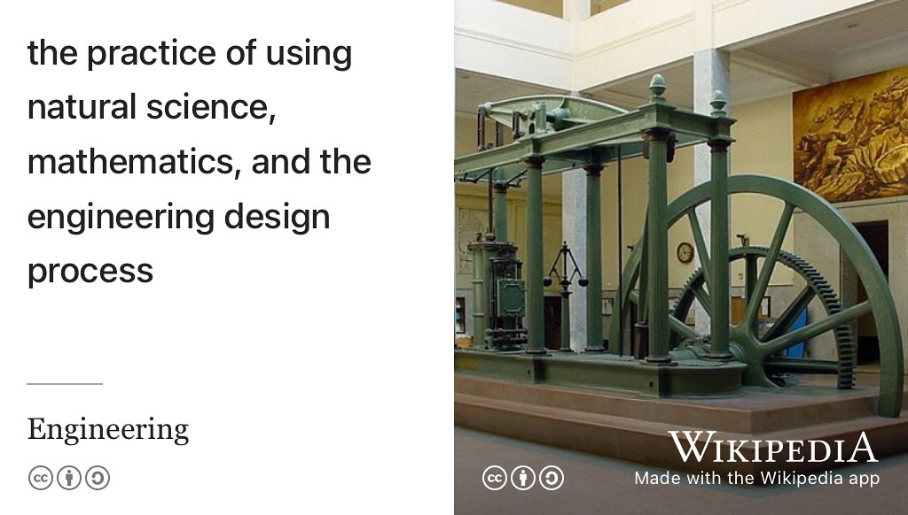
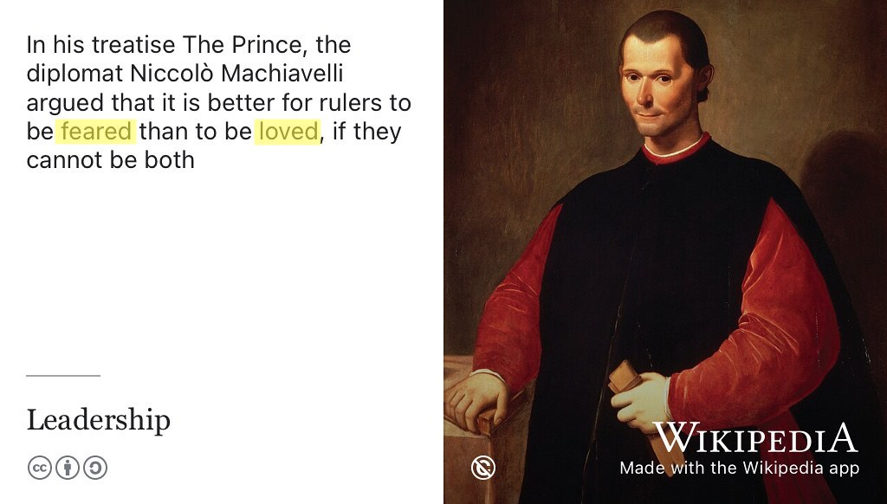
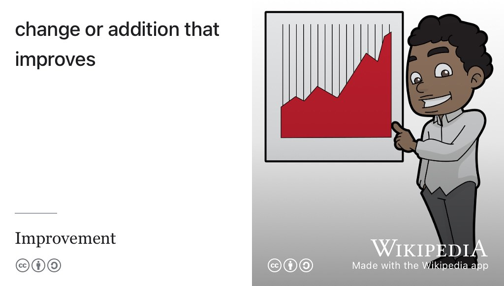
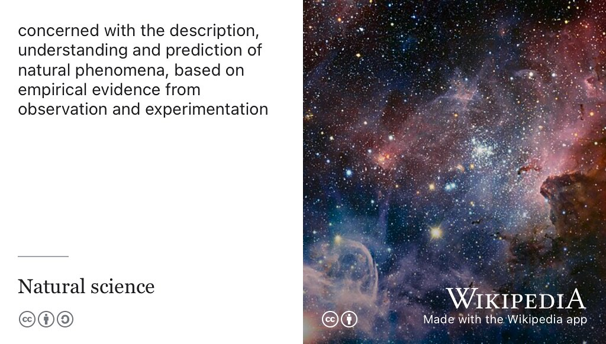
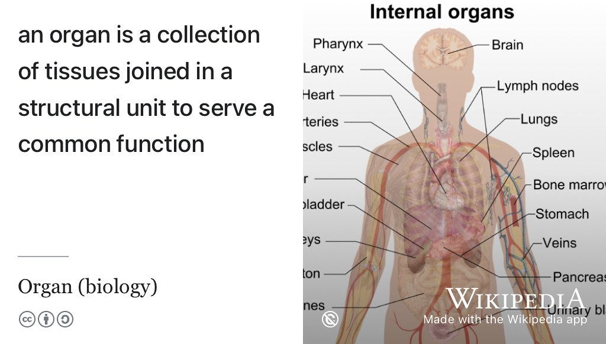
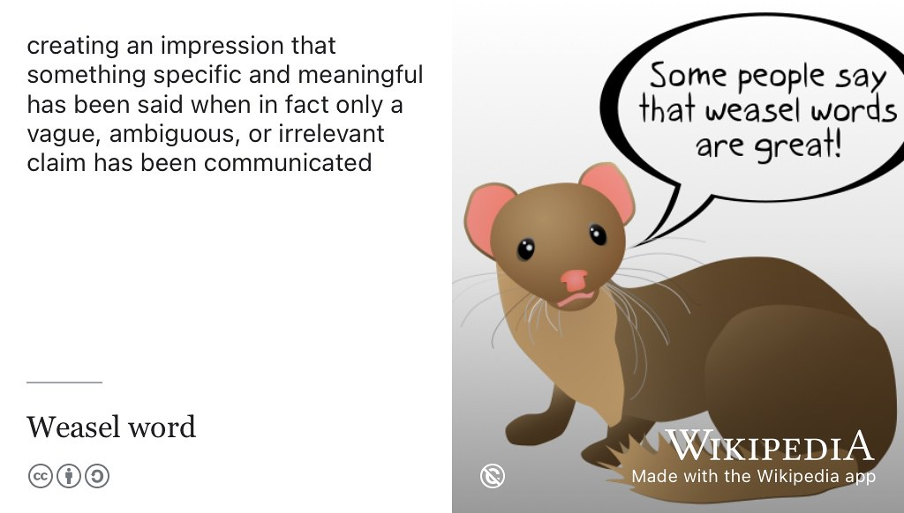
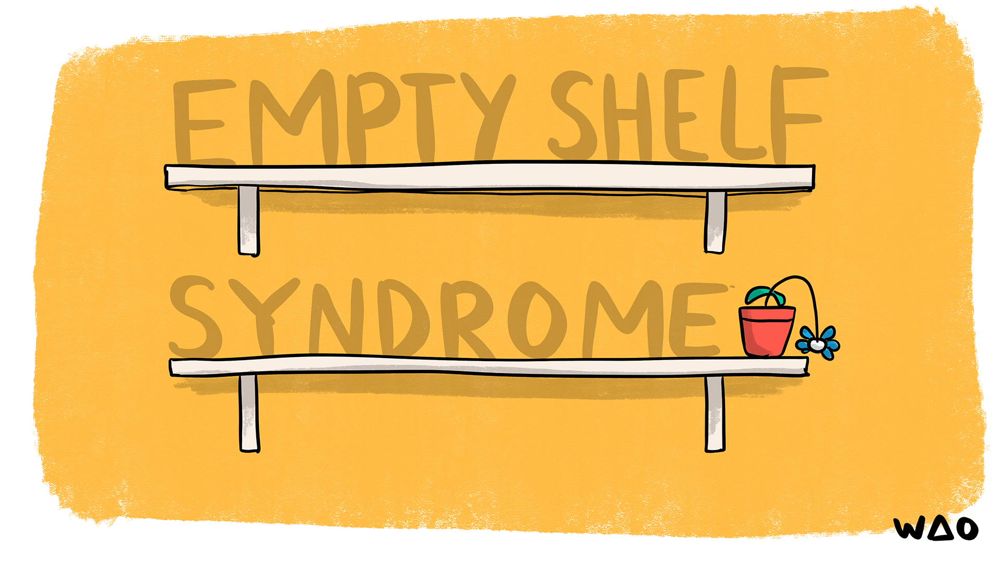
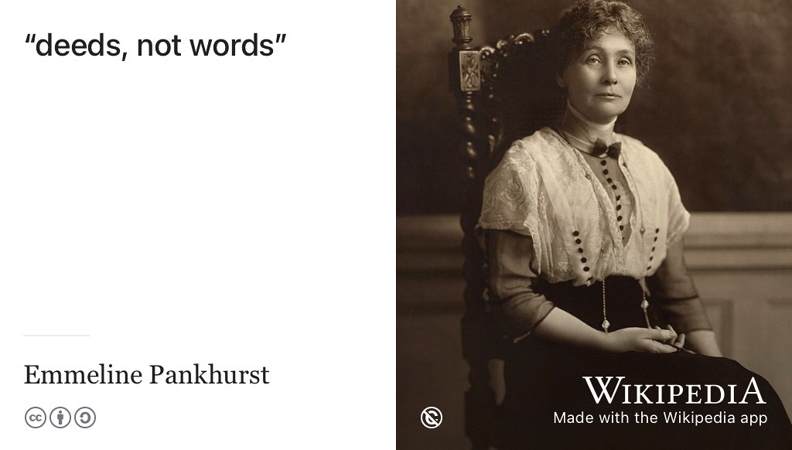

# Verbalising Your Future {#verbalising}

Employers are often more interested in what you have *done*, rather than what you just *know*. Your actions are a key part of your story we discussed in section \@ref(care). A simple technique for emphasising the action in your stories is to lead  descriptions of your `PROJECTS`, `EDUCATION` and `EXPERIENCE` with carefully chosen `verbs`, see section \@ref(verbsfirst) for examples.

## Your actions define your impact {#impact}
Your actions define your impact, see figure \@ref(fig:action-fig). What stories can you tell of your actions to date? What verbs best describe how you achieved a result or had an impact? What was the context, action, result and evidence (CARE) we discussed in section \@ref(care) of each (short) story?

```{r action-fig, echo = FALSE, fig.align = "center", out.width = "100%", fig.cap = "(ref:captionactions)"}

```
(ref:captionactions) What action have you taken and what stories can you tell about the results and your impact? What are the best verbs for highlighting your actions? [Your actions define your impact](https://bryanmmathers.com/your-actions-define-your-impact/) by [Visual Thinkery](https://visualthinkery.com/) is licensed under [CC-BY-ND](https://creativecommons.org/licenses/by-nd/4.0/) via [Angela Maiers](https://twitter.com/AngelaMaiers)

By leading with verbs you will highlight what you have *actually done* and how you did it, rather than what you know. It also helps you cut down on repetitive personal pronouns: `I`, `me`, `my` etc. See the verbs first section \@ref(verbsfirst) of chapter \@ref(debugging) *debugging your future*.

Your future is bright, your future needs verbalising, so let's start verbalising your future.

## What you will learn {#ilo17}

By the end of this chapter you will be able to:

1. Emphasise your *actions* when describing your education, projects and experience on your CV 
1. Reflect on
    + what skills you already have
    + what skills you need to develop
1. Demonstrate those skills explicitly and quickly in job applications

## Breakpoints {#bp17}
(ref:breakpoint)

```md
* PAUSE ⏸️
```

Quickly scan your CV, covering letter or application form for VERBS:

* Where are the verbs?
    + buried deep in long sections of prose? **OR**
    + prominently leading descriptions of your activities?
* Have you over-used certain verbs (like `worked` or `assisted` for example) or been repetitive (like over-using `developed` see alternatives in section \@ref(engineering))
* How can you increase the variety of verbs you have used (without exaggerating or lying)?
* Which verbs are stronger than others and why?
* Are there any categories of verbs you can't provide evidence for, such as leadership (see section \@ref(leading)) or influencing (see section \@ref(influencing))?
    + What activities or projects could you do that would help you develop these missing skills?

```md
* RESUME ▶️
```

We've classified the verbs you might use on your CV into sets below:

* 👩‍👩‍👧‍👦 Team verbs: section \@ref(joining)
* 🛠 Engineering verbs: section \@ref(engineering)
* 💡 Leadership verbs: section \@ref(leading)
* 📈 Improving verbs: section \@ref(improving)
* 🧪 Scientific verbs: section \@ref(scientific)
* 🏆 Winning verbs: section \@ref(winning)
* 📆 Organising verbs: section \@ref(planning)
* 💪 Influencing verbs: section \@ref(influencing)
* 🐹 Weasel verbs: section \@ref(weasel)
* 💩 Bullshit verbs: section \@ref(BS)
* 🤖 AI verbs: section \@ref(aiverbs)
* 😶 Missing verbs: section \@ref(missing)

## Team verbs {#joining}

Some verbs to demonstrate how you have worked and communicated with others in a team, see figure \@ref(fig:teamwork-fig)

```{r teamwork-fig, echo = FALSE, fig.align = "center", out.width = "100%", fig.cap = "(ref:captionteamwork)"}

```

(ref:captionteamwork) What kinds of teams have you been a part of? What role did you play in the team? How did your [teamwork](https://en.wikipedia.org/wiki/Teamwork) make the dream work? Employers will want to know the details, so spell it out for them explicitly using carefully chosen verbs to describe the different roles and responsibilities you've taken while working towards common goals. [CC BY](https://creativecommons.org/licenses/by/2.0/deed.en) picture of a team pushing a vehicle out the mud by Clear Path International on Wikimedia Commons [w.wiki/9f4Y](https://w.wiki/9f4Y) adapted using the [Wikipedia App](https://apps.apple.com/us/app/wikipedia/id324715238) 👩‍👩‍👧‍👦


* `administered`
* `advised`
* `advocated` if you campaigned or lobbied for something to happen
* `assisted`
* `attended` ...but show outcomes
* `briefed`
* `coached`
* `collaborated`
* `communicated`
* `consulted` either as giver or receiver
* `convened` you made a group come together
* `contributed`
* `delegated`
* `discussed`
* `encouraged`
* `explained`
* `instructed` (if you helped others)
* `interviewed`
* `organised`
* `performed` 
* `presented`
* `recommended`
* `recruited` you persuaded people to join you
* `served` e.g. customer service or serving a community
* `shadowed` e.g. work shadowing
* `suggested`
* `volunteered`


## Engineering verbs {#engineering}

There's no shortage of verbs to describe your engineering skills, see figure \@ref(fig:engineering-fig).

```{r engineering-fig, echo = FALSE, fig.align = "center", out.width = "100%", fig.cap = "(ref:captionengineering)"}

```

(ref:captionengineering) What verbs can you use to describe your application of science and mathematics in order to [engineer](https://en.wikipedia.org/wiki/Engineering) software and hardware? [CC BY-SA](https://creativecommons.org/licenses/by-sa/3.0/deed.en) Beam engine picture by Nicolás Pérez on Wikimedia Commons [w.wiki/9g4y](https://w.wiki/9g4y) adapted using the [Wikipedia app](https://apps.apple.com/us/app/wikipedia/id324715238) 🛠

Verbs you could use to demonstrate your engineering skills:


* `adapted` e.g. new features
* `added` e.g. new features
* `analysed` e.g. the requirements
* `applied` e.g. the appliance of science
* `architected`
* `assigned` e.g. bugs to team members
* `automated` e.g. builds and tests etc
* `built`
* `branched` e.g. git
* `configured`
* `designed` e.g. [greenfield software development](https://en.wikipedia.org/wiki/Greenfield_project) 
* `cloned` e.g. git
* `debugged` most software engineering is debugging your own, and other people's code
* `developed`
* `deployed`
* `documented`
* `engineered`
* `exploited` not a person but a feature
* `fixed` e.g. bugs
* `gathered` e.g. requirements
* `implemented` e.g. your favourite algorithm
* `installed`
* `integrated` e.g. different systems
* `made`
* `merged` e.g. git
* `migrated`
* `modified`
* `optmised` you improved the performance of something
* `refactored`
* `solved`
* `specified`
* `upgraded`
* `tested`

## Leadership verbs {#leading}

How can you convince your reader you are actively developing your leadership skills? Are you a manipulative [Machiavellian ruler](https://en.wikipedia.org/wiki/Machiavellianism_(psychology)) or are you capable of a more empathetic and inclusive approach, see figure \@ref(fig:machiavelli-fig)?

```{r machiavelli-fig, echo = FALSE, fig.align = "center", out.width = "100%", fig.cap = "(ref:captionmachiavelli)"}

```

(ref:captionmachiavelli) What kind of leader do you want to be? Do you want to be `loved` or `feared`? Neither or both? The diplomat [Niccolò Machiavelli](https://en.wikipedia.org/wiki/Niccol%C3%B2_Machiavelli) argued that it is best to be feared if you can't be loved. Thankfully many other kinds of leadership are available, with a wide range of verbs to describe them: `mentored`, `motivated`, `demonstrated`, `facilitated`,  and `supervised` etc. Public domain image of a portrait of Niccolò Machiavelli by [Santi di Tito](https://en.wikipedia.org/wiki/Santi_di_Tito) on Wikimedia Commons [w.wiki/5FCv](https://w.wiki/5FCv) and adapted using the [Wikipedia app](https://apps.apple.com/gb/app/wikipedia/id324715238)  💡

Verbs you could use to demonstrate your leadership:

* `accelerated` not just [hardware acceleration](https://en.wikipedia.org/wiki/Hardware_acceleration) but people too!
* `argued` e.g. persuasive reasoning, either spoken or written
* `deputised` because sometimes you have follow, you can't always be a leader 
* `demonstrated`
* `enabled`
* `established`
* `created`
* `decided` you've had the power to make (or influence) decision making
* `devised`
* `directed`
* `influenced` see section \@ref(influencing)
* `facilitated`
* `founded` or  `co-founded` you started something from scratch
* `guided`
* `hosted`
* `initiated`
* `introduced`
* `invented`
* `launched`
* `led`
* `managed`
* `mentored` if you've helped develop others by sharing your skills and knowledge
* `motivated`
* `supervised`
* `transformed` you changed something for the better


## Improving verbs {#improving}

Have you improved *something* by changing or adding something, see figure \@ref(fig:improvement-fig)? That *something* could be a service, a product, a process or even people, including yourself.

```{r improvement-fig, echo = FALSE, fig.align = "center", out.width = "100%", fig.cap = "(ref:captionimprovement)"}

```

(ref:captionimprovement) Quantifying any improvements you have made will convince your reader that you've made something better in a measureable way. [CC BY-SA](https://creativecommons.org/licenses/by-sa/4.0/deed.en) image of cartoon guy by Free Clip Art on Wikimedia Commons [w.wiki/9g5z](https://w.wiki/9g5z) adapted using the [Wikipedia app](https://apps.apple.com/gb/app/wikipedia/id324715238) 📈


Verbs that demonstrate how you have improved a situation by taking responsibility for something:

* `delivered`
* `completed` if you finished something
* `edited`
* `enhanced`
* `generated`
* `increased` make sure you quantify it, see section \@ref(care)
* `learned` describe *what* you have learned
* `refined`
* `resolved` a conflict or conflicts
* `saved` money, time, resources etc
* `validated` you proved something 


## Scientific verbs {#scientific}
We're all scientists deep down and we all use scientific skills and knowledge in our daily life, see figure \@ref(fig:natural-science-fig).

```{r natural-science-fig, echo = FALSE, fig.align = "center", out.width = "100%", fig.cap = "(ref:captionnatsci)"}

```

(ref:captionnatsci) Computer Science isn't a [natural science](https://en.wikipedia.org/wiki/Natural_science), but that doesn't mean it isn't natural to have some verbs to demonstrate your scientific skills.  CC BY-SA image of the [Carina Nebula](https://en.wikipedia.org/wiki/Carina_Nebula) by T. Preibisch and the European Southern Observatory (ESO) on Wikimedia Commons [w.wiki/9cVA](https://w.wiki/9cVA) adapted using the [Wikipedia app](https://apps.apple.com/gb/app/wikipedia/id324715238) 🧪

Some verbs you could use to describe your scientific skills and knowledge include:

* `assessed`
* `calculated`
* `discovered`
* `estimated`
* `evaluated`
* `experimented`
* `identified`
* `interpreted`
* `investigated`
* `measured`
* `modelled` in a computational or mathematical sense
* `observed`
* `predicted`
* `proved`
* `quantified` for example in benchmarking
* `researched`  
* `reviewed`
* `studied` we are all students at the [School of Hard Knocks](https://en.wikipedia.org/wiki/School_of_Hard_Knocks)
* `tested`

## Winning verbs {#winning}

Have you won any prizes, trophies or other awards? You should display them with pride and tell your reader what they were given for, see section \@ref(prizes) and figure \@ref(fig:trophy2-fig)

```{r trophy2-fig, echo = FALSE, fig.align = "center", out.width = "100%", fig.cap = "(ref:captiontrophy2)"}
knitr::include_graphics("images/trophy.jpeg")
```

(ref:captiontrophy2) There's plenty of verbs for describing awards and honours you've been granted, not just trophies like this one, but any kind of award you've gained or been given to recognise your achievements, even the smaller ones like those described in section \@ref(otherbadges). [CC0 public domain](https://creativecommons.org/publicdomain/zero/1.0/deed.en) picture of [Johan Cruyff](https://en.wikipedia.org/wiki/Johan_Cruyff) holding the [European Champion Clubs' Cup](https://en.wikipedia.org/wiki/European_Champion_Clubs%27_Cup) in 1972 from the [Nationaal Archief](https://en.wikipedia.org/wiki/Nationaal_Archief) on Wikimedia Commons [w.wiki/6h5t](https://w.wiki/6h5t) adapted using the [Wikipedia App](https://apps.apple.com/us/app/wikipedia/id324715238) 🏆

Verbs for demonstrating your achievements, progression and honours:

* `achieved`
* `attained`
* `awarded`
* `gained`
* `nominated`
* `recommended`
* `selected` you were chosen for something
* `mastered`
* `won`

## Organising verbs  {#planning}

Have you ever organised something? Organisation makes everything else possible, see figure \@ref(fig:organon-fig).

```{r organon-fig, echo = FALSE, fig.align = "center", out.width = "100%", fig.cap = "(ref:captionorganon)"}

```


(ref:captionorganon) The cells in your body are `organised` into collections of tissues called [organs](https://en.wikipedia.org/wiki/Organ_(biology)) which serve a common function. What have you organ-ised? Public domain image of internal human organs by [Mikael Häggström](https://en.wikipedia.org/wiki/User:Mikael_H%C3%A4ggstr%C3%B6m) on Wikimedia Commons [w.wiki/9V6x](https://w.wiki/9V6x) adapted using the [Wikipedia app](https://apps.apple.com/gb/app/wikipedia/id324715238)


Here some sample verbs you could use to demonstrate your organ-isational skills:

* `arranged`
* `classified`
* `prepared`
* `scheduled`
* `organised`
* `planned`
* `prioritised` a demanding workload, how did you prioritise?
* `produced` making things, not just software
* `revised`

## Influential verbs  {#influencing}

How can you demonstrate any influence you've had, see figure \@ref(fig:influence-fig)?

```{r influence-fig, echo = FALSE, fig.align = "center", out.width = "100%", fig.cap = "(ref:captionferragni)"}

```

(ref:captionferragni) Are you an influencer? Not just the regular [influencer marketing](https://en.wikipedia.org/wiki/Influencer_marketing) found on social media, but are there any other kinds of influence you can demonstrate? [CC BY-SA](https://creativecommons.org/licenses/by-sa/2.0/deed.en) portrait of fashion influencer [Chiara Ferragni](https://en.wikipedia.org/wiki/Chiara_Ferragni) by Giorgio Montersino on Wikimedia Commons [w.wiki/9bDs](https://w.wiki/9bDs) adapted using the [Wikipedia App](https://apps.apple.com/us/app/wikipedia/id324715238) 😎

Verbs that demonstrate how you have influenced other people:

* `authored` (or `co-authored`)
* `bought` if you've had purchasing power
* `campaigned`
* `converted`
* `convinced`
* `illustrated` if you have graphical skills for example
* `influenced` this could include social media influencing
* `liaised`
* `negotiated`
* `marketed`
* `mediated`
* `persuaded`
* `promoted`
* `presented`
* `publicised`
* `sold` an idea, product or service
* `visualised` e.g. data
* `written`

## Weasel verbs {#weasel}

Some people say [weasel words](https://en.wikipedia.org/wiki/Weasel_word) are too vague and ambiguous, see figure \@ref(fig:weasel-fig). You might think those weasely verbs tell your reader something important, but they often fail to deliver on closer inspection.

```{r weasel-fig, echo = FALSE, fig.align = "center", out.width = "100%", fig.cap = "(ref:captionweasel)"}

```
(ref:captionweasel) Popular in political parlance, [weasel words](https://en.wikipedia.org/wiki/Weasel_word) create an impression that something specific and meaningful has been said when in fact only a vague, ambiguous or irrelevant claim has been communicated.  Public domain weasel by Tkgd2007 on Wikimedia Commons [w.wiki/8P2u](https://w.wiki/8P2u) and adapted using the [Wikipedia app](https://apps.apple.com/gb/app/wikipedia/id324715238) 🐹

The following verbs are that *some* people say are too vague and ambiguous:

* `involved` What was your role exactly?
* `joined` So you became a `member` of something? What did your `membership` actually entail? Did you eagerly sign up at the freshers fair with good intentions never to return, or did you play a more active role?
* `participated` be specific if you can
* `worked` Most people work, can you be more specific? 

So avoid using weasel words, or at least clarify what you mean with some quantication or evidence. You don't want to risk triggering your readers sensitive detector described in section \@ref(BS).


## Bullshit verbs {#BS}

We discussed the dangers of bullshit in section \@ref(bullshit). You might think you can bullshit your readers, but you'll probably just trigger their *bullshit detector*, see figure \@ref(fig:bullshitter-fig) 

```{r bullshitter-fig, echo = FALSE, fig.align = "center", out.width = "100%", fig.cap = "(ref:captionbullshitter)"}
knitr::include_graphics("images/on-bullshit.jpeg")
```

(ref:captionbullshitter) Are you a bullshitter? Do you have any bullshitty verbs on your CV? Fair use image of the cover of [Harry G. Frankfurt](https://en.wikipedia.org/wiki/Harry_Frankfurt)'s best selling little book *[On Bullshit](https://en.wikipedia.org/wiki/On_Bullshit)* [@onbullshit] via Wikimedia Commons [w.wiki/6Bnu](https://w.wiki/6Bnu) adapted using the [Wikipedia app](https://apps.apple.com/us/app/wikipedia/id324715238) 

Examples of potentially bullshitty verbs include:

* `delighted` 
* `delved` some people have argued this verb is evidence that text is AI-generated. [@delved] You'd be better of saying something like `investigated` anyway...
* `fascinated` 
* `honed` saying you `improved` something and then **quantifying** by *how much* you improved it would be much more convincing
* `imagineered` Yes, imagination is a crucial part of engineering. But software imagineering? Really? C'mon! 
* `leveraged` not sure about this one, smells a bit dodgy? Perhaps I'm just getting old and cynical... 
* `relished` save your relish for the condiments
* `revolutionised` is a bold claim, if you're going to use it, back it up with specific evidence 
* `spearheaded` Really? Are you some kind of [hunter-gatherer](https://en.wikipedia.org/wiki/Hunter-gatherer)? Howabout `led`, `managed`, `co-ordinated` or `organised`? See section \@ref(leading). 
* `streamlined` Something smells a bit fishy, it's the kind of thing a politician would say

* `thrilled`

It's best to leave *emotive* verbs and *bullshitty* language out of your CV. You may well have been `fascinated, thrilled and delighted to hone your leadership skills while spearheading an innovative project that streamlined business processes`, but there are more professional (and less bullshitty) ways to describe your experience. 💩

While emotions are an important part of professional and personal reflection (see section \@ref(reflecting)), emotive verbs like `fascinated`, `thrilled` and `delighted` don't really belong on your professional CV.

## AI verbs {#aiverbs} 
While we're on the subject of *bullshit*, we need to talk about bots and AI. Employers routintely use various kinds of software and AI to automatically screen your job application, see section \@ref(robotproof). So it seems only fair for you to use ChatGPT or similar technology to help you write your applications. However, while AI can *help* you get started (see figure \@ref(fig:chatgptagain-fig) and section \@ref(machines)), it won't help you finish. 

```{r chatgptagain-fig, echo = FALSE, fig.align = "center", out.width = "100%", fig.cap = "(ref:captionchatgptagain)"}
knitr::include_graphics("images/chatgpt.jpg")
```

(ref:captionchatgptagain) Is your CV human or robotic? While AI tools like ChatGPT can help you get started, they are of limited value when it comes to finishing and polishing your CV and other written job applications. OpenAI logo from Wikimedia Commons [w.wiki/6Lat](https://w.wiki/6Lat) adapted using the [Wikipedia App](https://apps.apple.com/us/app/wikipedia/id324715238) 🤖


So make sure you *personalise* and *humanise* your writing, because it's easy for a human reader to spot dehumanised and depersonalised CVs and covering letters that have been generated by AI. [@aiverbs;@aiverbsagain]

## Which verbs are missing? {#missing} 

Highlight all the verbs in your CV. Arrange them into groups of related verbs, you could either use the classification of verbs in this chapter or make your own. If you put each group of verbs on it's own virtual “shelf”, which shelves are empty, see figure \@ref(fig:emptyshelf-fig)? Which verbs are missing?

```{r emptyshelf-fig, echo = FALSE, fig.align = "center", out.width = "100%", fig.cap = "(ref:captionemptyshelf)"}

```

(ref:captionemptyshelf) You've shelved all the verbs on your CV into related groups. Which of your shelves are empty? [Empty Shelf Syndrome](https://bryanmmathers.com/empty-shelf-syndrome/) by [Visual Thinkery](https://visualthinkery.com/) is licensed under CC-BY-ND 😶

Identifying the “empty shelves” on your CV can help you work out what skills you need to develop in the future, see the skills audit in section \@ref(personality). At this stage in your career, nobody should expect your shelves to be fully stacked. As well reflecting on the `verbs`, think about which sections need improving in the future:

* If your `EXPERIENCE` shelf is looking a bit bare, see chapter \@ref(experiencing)
* If your `PROJECTS` shelf is looking a bit bare, see section \@ref(projects)
* If your `LEADERSHIP & AWARDS` shelf is looking a bit bare, see section \@ref(prizes)

## Summarising Your Future {#tldr18}
(ref:tldr)

Your future is bright, your future needs verbalising. Highlighting the actions you've taken will help you verbalise and debug your CV. Verbalising and debugging your future will help you to start coding your future.

Actions speak louder than words, or as suffragette and political activist [Emmeline Pankhurst](https://en.wikipedia.org/wiki/Emmeline_Pankhurst) frequently said “Deeds not Words”, see figure \@ref(fig:pankhurst-fig). Your CV needs to emphasise your deeds and actions using words. Those words are `verbs`.

```{r pankhurst-fig, echo = FALSE, fig.align = "center", out.width = "100%", fig.cap = "(ref:captionpankhurst)"}

```
(ref:captionpankhurst) “Deeds not words” was the rallying cry of suffragette [Emmeline Pankhurst](https://en.wikipedia.org/wiki/Emmeline_Pankhurst).  Emphasise the deeds (actions) on your CV by leading your stories with carefully chosen `verbs`. Public domain image of Emmeline Pankhurst by Richard Gordon Matzene restored by Adam Cuerden on Wikimedia Commons [w.wiki/3bPa](https://w.wiki/3bPa) and adapted using the [Wikipedia app](https://apps.apple.com/gb/app/wikipedia/id324715238) (If you get the chance, you should visit the [pankhurstmuseum.com](https://www.pankhurstmuseum.com/) on the Oxford Road in Manchester)

On your CV, leading descriptions of your `projects`, `experience`, `leadership and awards` with `verbs` is a simple but powerful technique that enables you to provide evidence (rather than assertion) for the skills, knowledge, competencies and capabilities you have. Choose your `verbs` carefully. Which verbs are missing from your CV? These verbs can help you identify gaps in your professional and personal development.

In the next part, chapter \@ref(finding): *Finding your Future* we will investigate some job search strategies so that you can work out who and where to send your debugged CV to.
