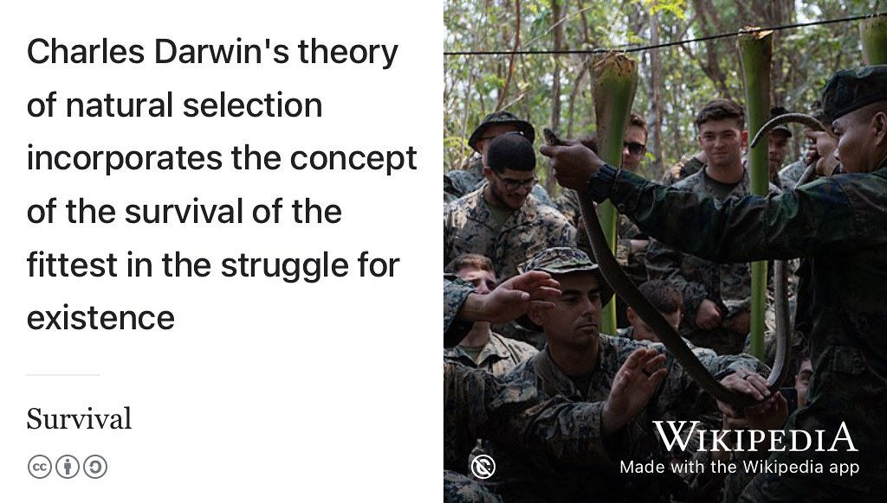

# Surviving your future {#surviving}

Congratulations, you've just accepted an offer of employment. You nailed that interview (or interviews) and you're just about to embark on the exciting journey from the world of study to the jungle of employment. This *might* be your first SERIOUS job, so what do you need to survive and become a professional? What survival skills will you need, see figure \@ref(fig:survival-fig). Even better, how can you thrive in your new role and take on the challenges that are coming your way? How will you optimise your trajectory to reach new heights? 🚀

```{r survival-fig, echo = FALSE, fig.align = "center", out.width = "100%", fig.cap = "(ref:captionsurvival)"}

```
(ref:captionsurvival) The world of employment can be a bit of a jungle where you struggle for existence. What survival skills will you need and how can you go beyond merely surviving to positively thriving as a professional? Public domain image of jungle survival lessons by United States Army on Wikimedia Commons [w.wiki/3WBj](https://w.wiki/3WBj) adapted using the Wikipedia app.

## What you will learn {#ilo10}

<!--If you want to get ahead get a hat-->
At the end of this chapter you will be able to

* Manage your manager so that you can:
    + Survive the workplace
    + Thrive in the workplace
    + Avoid diving in a workplace environment
* Collect evidence of new workplace skills and knowledge that you develop <!--WWW-->
* Reflect on new workplace skills and knowledge that you need to develop <!--EBI-->

<!--Unconcious mistakes people make that sabotage their careers [@nicegirls]

help I have manager [@helpihaveamanager]

saying yes, saying no [@cleancoder]

be yourself at work [@batmaneffect]-->

## Survive, thrive or dive? {#scenarios}
Starting a new job is a bit like starting a new relationship, except that it is professional rather than romantic. You've searched for and found a partner. You've been through the courtship of recruitment, this might have been quick or may have had many rounds of first and second “dates” (interviews). Once you start employment, you are both committed to each other in a serious relationship. Simply put, there are three scenarios for you as a new employee. You'll survive, thrive or dive.

### Survive {#survive}
It will go OK, you'll meet the expectations of your employer and become and valued employee. If your employer has a probationary period, you'll pass your probationary review without any problems. Most employees probably fit in to this category. 🆗

### Thrive  {#thrive}
It will go brilliantly, you'll exceed the expectations of your employer. If you're on a fixed term contract, such as a summer internship or year long placement, they'll make you a job offer during or soon after your contract of employment expires. If you're on a more permanent contract, such as a graduate job or graduate scheme you'll be promoted and given more responsibility. 💪

You're doing really well if you can impress your manager. Some lucky people make it into this category.

### Dive {#dive}

It will go badly, you will struggle to fit in and won't meet the expectations of your employer. Once you were like [star-crossed lovers](https://en.wikipedia.org/wiki/Star-crossed), (see figure \@ref(fig:romeo-fig)) but the relationship has turned sour could take a dive into tragedy. [@romeo; @goblewroe]

```{r romeo-fig, echo = FALSE, fig.align = "center", out.width = "100%", fig.cap = "(ref:captionromeo)"}
knitr::include_graphics("images/star-crossed-lovers.jpeg")
```

(ref:captionromeo) Your relationship with your employer is a professional one rather than a romantic one, but that doesn't mean it can't end in tragedy like Shakespeare's [star-crossed lovers](https://en.wikipedia.org/wiki/Star-crossed) Romeo and Juliet. [@romeo] What can you do to keep your relationship with your employer healthy and happy? Public domain image of a painting of Romeo and Juliet by Frank Dicksee via Wikimedia Commons [w.wiki/3DfJ](https://w.wiki/3DfJ) adapted using the [Wikipedia app](https://apps.apple.com/gb/app/wikipedia/id324715238)

There are several relationship problems that could lead to you breaking up with (or being dumped by) your newly estranged lover. 💔

* **Relationship problems**: Your relationship with your manager(s) is not going well. You've tried solving problems informally by talking to your manager but you’re not satisfied with the response and want to [raise a formal grievance complaint in writing](https://www.gov.uk/raise-grievance-at-work). [@grievance]
* **It's not you, it's me**: You might ultimately decide to you want to [hand in your notice](https://www.gov.uk/handing-in-your-notice) to terminate your contract of employment and leave. [@iquit]
* **It's not me, it's you**: If things get really bad, your employer may [take disciplinary action against you](https://www.gov.uk/disciplinary-procedures-and-action-at-work) [@dive] and in the worst case scenario, you'll be [fired (dismissed)](https://www.gov.uk/dismissal). [@yourefired]

Dismissal is rare, but it **does** happen, even to interns and placement students. In this scenario in the UK, the employer has a duty to do everything they reasonably can to prevent this from happening. It's not in your employers interests to fire you because they've invested a lot of time and money in you by this point. If they have sensible recruitment procedures, those procedures will root out unsuitable candidates long before they make it to the workplace where they can cause real and lasting damage to the organisation once in post.

All employers have procedures for making sure that you can agree on work that suits both of your needs. Better employers will have better procedures to ensure this happens. Employers don't want their employees to "dive" and will try prevent this from happening wherever possible.

## Managing your manager {#manager}
Building a good relationship with your manager(s) will be key to determining which of the *dive, survive or thrive* scenarios above plays out. At University, you didn't have a manager. Yes you had deadlines, but you didn't have a boss. That changes when you're an employee so it's in your interests to understand what your boss expects of you.

Software engineer Julia Evans has authored a series of programming [zines](https://en.wikipedia.org/wiki/Zine), there's one called [HELP! I have manager!](https://wizardzines.com/zines/manager/) [@helpihaveamanager] you might find useful. It will help you understand your managers job better so that you can work together more effectively. It will help you survive and thrive, not dive because it covers:

* understanding your manager's job
* setting clear expectations
* talking about problems early
* reviewing performance and getting promoted
* asking for specific feedback

```{r tweet-from-julia,echo=FALSE}
library(tweetrmd)
include_tweet("https://twitter.com/b0rk/status/1043277965394681856")
```

The zine has the benefit of being aimed aimed at engineers just like you. Thoroughly recommended! You might also enjoy Julia's other more technical zines such as [HTTP: learn your browser's language](https://wizardzines.com/zines/http/) [@browserslanguage] and [Oh Shit, Git!](https://wizardzines.com/zines/oh-shit-git/) [@ohshitgit]

## Stay in school {#neverstoplearning}
As you develop new skills and knowledge at work, it is a good idea to collect evidence of what you've done. Whatever your career path, you'll need to keep your CV updated. One way to think of the evidence is as *badges*, digital or otherwise. Your employer may already have training schemes that recognise and reward your accomplishments.  These badges may be generic or specific to the particular sector you are working in. See chapter \@ref(achieving) on *Achieving your future* for more details.

### Technical badges {#techie}
Some examples of technical badges include:

* Microsoft Certifications [docs.microsoft.com/en-us/learn/certifications](https://docs.microsoft.com/en-us/learn/certifications/)
* Amazon Web Services Certification [aws.amazon.com/certification](https://aws.amazon.com/certification/)
* Google Cloud Certification [cloud.google.com/certification](https://cloud.google.com/certification)

Just three examples, there are many others covering both technical and non-technical skills. In many cases, your employer will encourage and possibly pay for you to get these certifications.

### Non-technical badges {#techieplusplus}
You are more than just a techie, so make sure you develop your non-technical skills as well. We introduced softer skills in chapter \@ref(writing), but there's plenty of other skills to think about:

* Building resilience
* Negotiating and managing conflict
* Leadership, influence and change
* Having difficult conversations
* Emotional intelligence
* Public speaking
* Active listening

### Online learning {#mooc}
There are many online platforms for building your skills and knowledge, some examples include:

1. [coursera.org](https://www.coursera.org)
1. [edx.org](https://www.edx.org)
1. [egghead.io](https://egghead.io/)
1. [futurelearn.com](https://www.futurelearn.com/)
1. [khanacademy.org](https://www.khanacademy.org/)
1. [linkedin.com/learning](https://www.linkedin.com/learning)
1. [open.edu/openlearn](https://www.open.edu/openlearn/)
1. [pluralsight.com](https://www.pluralsight.com)
1. [skillshare.com](https://www.skillshare.com/)
1. [udemy.com](https://www.udemy.com)
1. [youtube.com](https://www.youtube.com/)

The choice of online learning can be bewildering. Some platforms provide free resources, others do not, but your employer may already pay for some services making them free to you while you are an employee. If that's the case, make good use of the services while you can. There's a [useful comparison of four different online learning platforms here](https://www.businessinsider.com/online-learning-platform-comparison-udemy-skillshare-lynda-coursera). [@udemy]

### Other training courses {#othertrain}
Your employer may provide other courses you can go on. Again, you should make the most of these if and when they are available.

Whatever job you're doing, stay in school. Take advantage of any training on offer or go and find courses that help you develop professionally and personally. Remember that **you** are the person who cares most about your career, see section \@ref(responsibility).

## Reflective practice {#visits}
Besides collecting evidence and managing your manager, you need to manage yourself too. A proven way to do this is to periodically reflect on your work. Your employer may have procedures to help you do this, such as performance reviews or one-to-ones with your manager on a regular basis. Whatever the setup, you will benefit from taking time to reflect on:
<!--During your placement you will be visited by an academic member of staff who will meet with you and your manager at the same time. If you want to meet with your academic tutor without your manager being around, please let your tutor know] The visit is a good opportunity to reflect on what progress you have made during the year alongside areas you need to improve. You will probably already have had similar meetings with your manager or managers, for examples as part of your personal development review (or whatever your employer calls performance reviews). There are three basic questions your tutor will ask you:-->


1. What have you been doing?
1. WWW: What Went Well?
1. EBI: Even Better If?

### What have you been doing?
Briefly describe your roles and responsibilities. What projects have you worked on? What were the main technologies that you used? As well as describing this to colleagues, you should aim to communicate this with non-specialists, people outside your field. How would you describe your job to your friends and family and terms they would understand?

### WWW: What went well?
Are there any projects you are particularly proud of? What new knowledge or skills have you learned or improved? Remember to include both non-technical as well as technical aspects of your job. Non-technical skills include organisation, time-management, confidence, communication etc.

### EBI: Even Better If?
What areas have you identified for improvement in the future? Again, this includes non-technical as well as technical skills.

### Your managers view
If you asked your manager the same questions, would they come up with the same answers? Are there any differences between your view and your managers view of your work? If so, why do they differ?
<!--
### Placement report
Both your tutor and you need to fill in the placement report, no more than two pages. See the [industrial placement report template on overleaf](https://www.overleaf.com/latex/templates/industrial-placement-report/vcjymrgmcpzh)-->

<!-- the marriage relationship analogy-->


<!--## Badges
Professional qualifications, such as [Microsoft certifications(https://docs.microsoft.com/en-us/learn/certifications/). Your employer will often pay for these. Then there are the MOOCs, these are great for plugging . Which courses are worth doing will depend on the particular sector you are working in.-->

<!--## Administrivia
https://www.gov.uk/income-tax

https://www.gov.uk/national-insurance


working in your final year, see self employment-->


<!--

>“You will move in the direction of the people that you associate with. So it’s
> important to associate with people that are better than yourself. The friends you have > will form you as you go through life. Make some good friends, keep them for the rest
> of your life, but have them be people that you admire as well as like.” Warren Buffet https://www.gatesnotes.com/About-Bill-Gates/Happy-90th-Warren -->


## Summarising survival {#tldr10}
(ref:tldr)

This chapter is under construction because I'm using agile book development methods, see figure \@ref(fig:deathstar7-fig).

```{r deathstar7-fig, echo = FALSE, fig.align = "center", out.width = "99%", fig.cap = "(ref:captiondeathstar)"}
knitr::include_graphics("images/DeathStar2.jpg")
```
