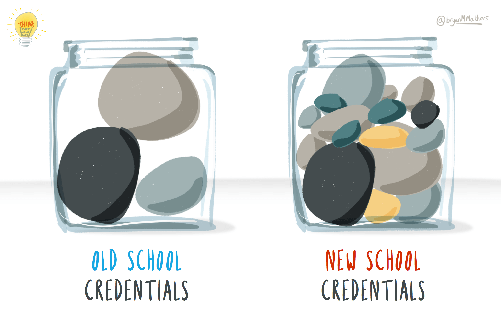

# Badging your future {#badging}

Learning is a life-long process, a [`while` loop](https://en.wikipedia.org/wiki/While_loop) in which you continuously develop new skills and knowledge. As you loop the loop, you can collect evidence of your personal and professional development. Some of this evidence can be “badged” in various ways and collected to form part of your professional identity, the jar called `ME` in figure \@ref(fig:while-learning-fig).

```{r while-learning-fig, echo = FALSE, fig.align = "center", out.width = "100%", fig.cap = "(ref:captionunibadges)"}
knitr::include_graphics("images/earning-a-badge-hd.png")
```
(ref:captionunibadges) Lifelong learning is a loop where you constantly acquire knowledge and skills during your career. You'll collect evidence of your learning and will earn badges of various kinds during and after University.  [Computing Badges](https://bryanmmathers.com/computing-badges/) by [Visual Thinkery](https://visualthinkery.com/) is licenced under [CC-BY-ND](https://creativecommons.org/licenses/by-nd/4.0/)

Evidence is a key part of your “Context, Action, Result and Evidence” (CARE) story described in section \@ref(care). So what evidence can you collect and how you can badge it? 📛

## What you will learn {#ilob}
After reading this chapter you will be able to:

<!--* Identify and decide which parts of this book you are going to read-, this fits in introducting you future -->
* Describe some the evidence you can collect and badge to show your development:
    + during University
    + after University and through your professional career
* Identify gaps in your personal and professional development
* Plan activities and set goals that will help you to continue grow professionally

## Academic badges {#academentia}
One kind of badge you get when you finish University is your degree certificate like the one shown in figure \@ref(fig:degree-cert-fig). A certificate is an offline physical badge, but an important one that marks a milestone in your career. It tells people that you were a member of a particular University community and that you mastered your chosen discipline to some level, Bachelors, Masters or PhD.

```{r degree-cert-fig, echo = FALSE, fig.align = "center", out.width = "100%", fig.cap = "(ref:captiondegreecert)"}
knitr::include_graphics("images/a-certificate-is-just-a-badge.png")
```
(ref:captiondegreecert) A degree certificate is an offline paper badge that provides evidence of your academic skills and learning while at University. [A certificate is just an offline badge](https://bryanmmathers.com/a-certificate-is-just-an-offline-badge/) by [Visual Thinkery](https://visualthinkery.com/) is licenced under [CC-BY-ND](https://creativecommons.org/licenses/by-nd/4.0/)

Degree certificates are an important badge, but they don't give very many details of the story of your professional and personal development at University. You could give more details by providing:

* your overall degree classification: first, second third etc
* your individual module grades, for example in an academic transcript or listed on a CV, see section \@ref(mycved)
* your projects, see section \@ref(mycvpj)
* your portfolio of work, if you have one

These details give a bit more detail that a degree certificate does not but they are limited to academic achievements. You are *much* more than your grades, because there's a lot about your character that is difficult or impossible to measure, see figure \@ref(fig:more-than-grades-fig).

```{r more-than-grades-fig, echo = FALSE, fig.align = "center", out.width = "100%", fig.cap = "(ref:captionmoregrades)"}
knitr::include_graphics("images/i-am-more-than-just-my-grades.png")
```

(ref:captionmoregrades) Your grades give more detail than a degree certificate but they still don't say much about you. [I am more than just my grades](https://bryanmmathers.com/i-am-more-than-just-my-grades/) sketch by [Visual Thinkery](https://visualthinkery.com/) is licensed under [CC-BY-ND](https://creativecommons.org/licenses/by-nd/4.0/)

Employers will often want to see more detailed evidence of your character and your softer skills than those provided by degree certificates and grades. While academic achievements paint some broad brushstrokes of your professional identity shown in figure \@ref(fig:fine-grained-fig), they don't help employers see the finer details or evidence.

```{r fine-grained-fig, echo = FALSE, fig.align = "center", out.width = "100%", fig.cap = "(ref:captionfinegrain)"}
knitr::include_graphics("images/broad-brushstrokes.png")
```
(ref:captionfinegrain) [Open Badges paint a better picture…](https://bryanmmathers.com/open-badges-paint-a-better-picture/)  by [Visual Thinkery](https://visualthinkery.com/) is licenced under [CC-BY-ND](https://creativecommons.org/licenses/by-nd/4.0/)

<!--
```{r old-school-fig, echo = FALSE, fig.align = "center", out.width = "100%", fig.cap = "(ref:captionoldschool)"}

```
(ref:captionoldschool) old school repetition-->

## Digital badges {#digibadge}

Digital badges provide a solution to this problem, just like your degree certificate is a verified indicator of your accomplishment, a digital badge does the same but in a more detailed way. Rather than being physical, a digital badge is virtual and transferable. It's just a `*.png` graphic file which has been digitally signed and contains metadata. This means it can be displayed on your CV, on social media or “stacked” into a digital portfolio collection as shown in figure \@ref(fig:badge-properties-fig).

The Mozilla Foundation have defined an open standard for digital badges [@openbadges] so they can be issued and hosted by different organisations. [@belshaw]


```{r badge-properties-fig, echo = FALSE, fig.align = "center", out.width = "100%", fig.cap = "(ref:captionbadgeproperties)"}
knitr::include_graphics("images/Properties-of-Open-Badges.png")
```
(ref:captionbadgeproperties) Digital badges have certified evidence inside, can be transferred between education and employment and can be stacked into collections or portfolios.  [Properties of Open Badges](https://bryanmmathers.com/properties-open-badges/) by [Visual Thinkery](https://visualthinkery.com/) is licenced under [CC-BY-ND](https://creativecommons.org/licenses/by-nd/4.0/) for the [City and Guilds of London Institute](https://en.wikipedia.org/wiki/City_and_Guilds_of_London_Institute)


A digital badge has data (shown in figure \@ref(fig:data-inside-fig)) locked inside which certify metadata about the achievement it has been awarded for including:

* `recipient` that's you!
* `issuer` the organisation awarding the badge, e.g. The University of Poppleton
* `badge name` e.g. PASS leader badge (see figure \@ref(fig:pass-leader-fig))
* `badge image` e.g. a digital logo
* `evidence URL` a link to evidence
<!--* `badge URL` a link to the badge e.g. https://badges.cs.manchester.ac.uk/media/uploads/badges/595f24cbab4bd9507882e88f535c4e76.png-->

All this information is coded so that only the awardee/recipient can access and manipulate it, for example: put the badge on public show.


```{r data-inside-fig, echo = FALSE, fig.align = "center", out.width = "100%", fig.cap = "(ref:captiondatainside)"}
knitr::include_graphics("images/peeled-badge.png")
```
(ref:captiondatainside) what are badges [There's data inside open badges](https://bryanmmathers.com/open-badges-data-inside/) by [Visual Thinkery](https://visualthinkery.com/) is licenced under [CC-BY-ND](https://creativecommons.org/licenses/by-nd/4.0/) for the [City and Guilds of London Institute](https://en.wikipedia.org/wiki/City_and_Guilds_of_London_Institute)

Your University or employer can issue badges, so for example, the University of Manchester issues badges for leaders of its Peer Assisted Study Scheme (PASS) [www.peersupport.manchester.ac.uk](http://www.peersupport.manchester.ac.uk/). As example of a PASS leader badge is shown in

```{r pass-leader-fig, echo = FALSE, fig.align = "center", out.width = "80%", fig.cap = "(ref:captionpassleader)"}
knitr::include_graphics("images/pass-leader-badge.png")
```
(ref:captionpassleader) An example of a digital badge awarded to Peer Assisted Study Scheme (PASS) leaders at the University of Manchester who have mentored and helped others students during their academic study. If you're a University of Manchester student, you can see other badges available at [wiki.cs.manchester.ac.uk/index.php/Badges](https://wiki.cs.manchester.ac.uk/index.php/Badges) (UoM login required)

Badges can be used for a range of different shown in figure \@ref(fig:badgetype-fig).

1. **Membership** being a member of an organisation or group
1. **Participation** participating in communities
1. **Capability** demonstrating capability with some skill
1. **Mastery** mastering a set of skills


```{r badgetype-fig, echo = FALSE, fig.align = "center", out.width = "99%", fig.cap = "(ref:captionbadgetype)"}
knitr::include_graphics("images/badge-taxonomy-v2.png")
```
(ref:captionbadgetype) There are many different activities which badges can be awarded for including membership, participation, capability and mastery. [Badge taxonomy](https://bryanmmathers.com/badge-taxonomy-v0-2/) by [Visual Thinkery](https://visualthinkery.com/) is licensed under [CC-BY-ND](https://creativecommons.org/licenses/by-nd/4.0/)

<!--
* What are badges
* What are we doing with them: badging things they are doing already (e.g. PASS leader)
* What next? Open source, portfolios, more consultation with students, more consultation with employers

-->

## Other digital badges {#otherbadges}
There are other digital badges besides the open ones described in this chapter which also provide certifiable evidence of professional development, see figure \@ref(fig:amazon-badge-fig) and section \@ref(techie) for more examples:

* Amazon Web Services badges [credly.com/organizations/amazon-web-services/badges](https://www.credly.com/organizations/amazon-web-services/badges)
* CS50 certificates from EdX [cs50.harvard.edu/x/2020/certificate](https://cs50.harvard.edu/x/2020/certificate/)
* RedHat certification [redhat.com/en/services/certifications](https://www.redhat.com/en/services/certifications)

```{r amazon-badge-fig, echo = FALSE, fig.align = "center", out.width = "66%", fig.cap = "(ref:captionamazonbadge)"}

```

(ref:captionamazonbadge) An example of an Amazon badge provided by [credly.com](https://info.credly.com/) for an [AWS certified developer](https://www.credly.com/org/amazon-web-services/badge/aws-certified-developer-associate).


We've focussed on technical badges here, but there are non-technical badges too.

## Summarising your badges {#tldrb}

[Too long, didn't read](https://en.wiktionary.org/wiki/too_long;_didn%27t_read) (TL;DR)? Here's a summary:

Open digital badges let you take your credentials from the many places you learn, and combine them into a portable portfolio that tells a digital story about your learning. The data inside a badge is shown in figure \@ref(fig:skills-bills-fig) and gives an employer a more detailed view of your professional development that traditional physical badges like degree certificates.

```{r skills-bills-fig, echo = FALSE, fig.align = "center", out.width = "100%", fig.cap = "(ref:captionskillsbills)"}
knitr::include_graphics("images/skills-to-pay-the-bills.png")
```
(ref:captionskillsbills) skills ...  by [Visual Thinkery](https://visualthinkery.com/) is licenced under [CC-BY-ND](https://creativecommons.org/licenses/by-nd/4.0/) for the [City and Guilds of London Institute](https://en.wikipedia.org/wiki/City_and_Guilds_of_London_Institute)
