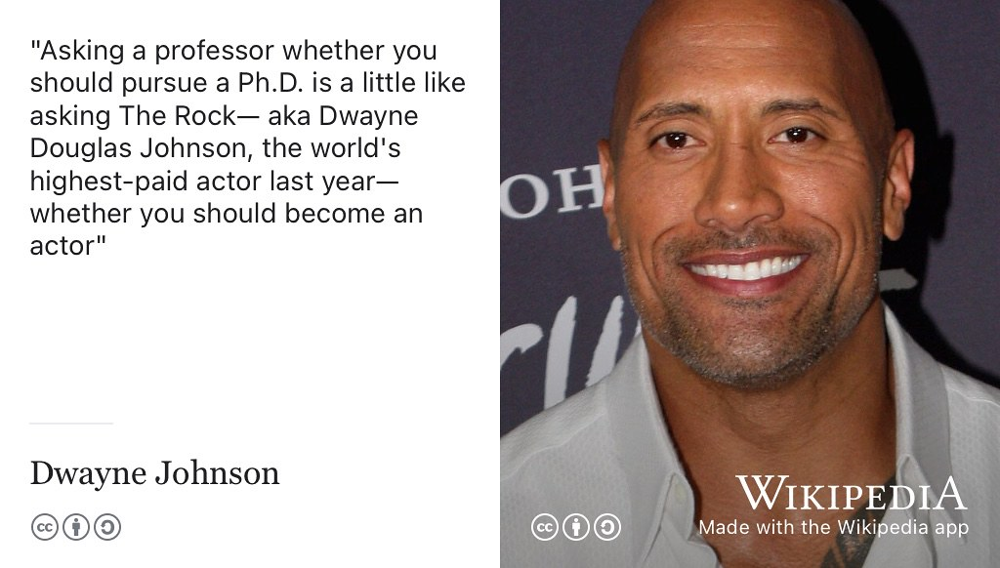

# Researching your future {#researching}

So you want some more, eh? Your undergraduate degree has whetted your appetite. What are the options for postgraduate study and research? Where can they take you and will further study be worth investing your time and money in? You are a curious character. You like the idea of pushing the boundaries of human knowledge a little further, maybe you even fancy yourself as a modern day [Ada Lovelace](https://en.wikipedia.org/wiki/Ada_Lovelace) or Alan Turing? 👩‍🔬👨‍🔬

```{r einstein-fig, echo = FALSE, fig.align = "center", out.width = "100%", fig.cap = "(ref:captioneinstein)"}
knitr::include_graphics("images/einstein-i-have-no-special-talents.png")
```

(ref:captioneinstein) I have no talents, I'm only passionately curious. Are you passionately curious? Is further study or research the right path for you? Are you the next Einstein or Einsteiness? This chapter looks at some of the possibilities for research and further study. [Curiosity](https://bryanmmathers.com/curiosity/) by [Visual Thinkery](https://visualthinkery.com/) is licensed under [CC-BY-ND](https://creativecommons.org/licenses/by-nd/4.0/)


## What you will learn {#ilo12}  
At the end of this chapter you will be able to:

1. Describe the costs of postgraduate study and research
1. Discuss the benefits of postgraduate study and research


## Where to start {#finda}  
A good place to start if you're looking for a masters or PhD are:

* Apply directly to Universities for postgraduate study, if there is a specific group or course you are interested in. See also:
* [findamasters.com](https://www.findamasters.com/) for postgraduate study, a directory of Masters degrees and postgraduate qualifications at universities around the world
* [findaphd.com](https://www.findaphd.com/) for postgraduate research, a large database of PhD opportunities
* [jobs.ac.uk](https://www.jobs.ac.uk/) also lists PhD opportunities, not just in the UK, see [jobs.ac.uk/phd](https://www.jobs.ac.uk/phd)

## University or the Real World? {#realworld}
When you graduate, you might think you need to choose between University or the “[real world](https://en.wikipedia.org/wiki/Real_life)”, see figure \@ref(fig:realworld-fig). That's a popular misconception and a false dichotomy. In computing it is common for people to cross back and forth several times between industry (the so-called real world) and academia (the [ivory towers](https://en.wikipedia.org/wiki/Ivory_tower)).

```{r realworld-fig, echo = FALSE, fig.align = "center", out.width = "100%", fig.cap = "(ref:captionrealworld)"}
knitr::include_graphics("images/University-or-real-world.png")
```

(ref:captionrealworld) Which path will you choose, University or the real world? Perhaps you can you have both? How many times can you [zigzag](https://en.wikipedia.org/wiki/Zigzag) between the two? Real world sketch by [Visual Thinkery](https://visualthinkery.com/) is licensed under [CC-BY-ND](https://creativecommons.org/licenses/by-nd/4.0/)

Commercial or real-world experience is valuable in academia and academic experience is valuable beyond academia. So, if you think you need to choose between the two, think again. Doing an internship or placement with a commercial company can be useful background for a career in academia, both in research and teaching. Lots of research is done in partnerships between commercial companies and Universities, some of these create [startups](https://en.wikipedia.org/wiki/Startup_company), [University spin-offs](https://en.wikipedia.org/wiki/University_spin-off) or [corporate spin-offs](https://en.wikipedia.org/wiki/Corporate_spin-off) etc.

Your learning shouldn't stop when you finish University either, so you might work for a bit, study for a bit, work a bit more and so on. Some of this learning might be formal and academic with qualifications, others might be badged in different ways. This is called [lifelong learning](https://en.wikipedia.org/wiki/Lifelong_learning), see section \@ref(lifelonglearning) and chapter \@ref(achieving).

So will you choose University **OR** real life in the longer term? With all the [squiggles and zigzags](https://www.amazingif.com/listen/), your career is likely to be a bit more complicated than that... [@squigglybook;]


<!--PhD grind
http://pgbovine.net/PhD-memoir.htm-->

## Ask beyond academia {#prof}
If you're thinking about doing a PhD and going into research, it's obviously a good idea to talk to Professors and academics about what is involved. Don't just ask Professors though, talk to PhD students, [postdocs](https://en.wikipedia.org/wiki/Postdoctoral_researcher) and especially people who did a PhD but didn't go into academia. Most people with a PhD don't go on into academia as a career. [@postdochell] A PhD gives you lots of transferable skills but ask for advice outside and inside academia, see figure \@ref(fig:dwayne-fig).  It's easy to lose sight of your transferable skills, especially if you're unsure about academia vs. industry as a post PhD route. Holly Prescott's guide: [What are my career options with a PhD?](https://intranet.birmingham.ac.uk/as/employability/careers/postgraduate/pgr/pgr-career-options) outlines some of the options. [@hollyprescott]

```{r dwayne-fig, echo = FALSE, fig.align = "center", out.width = "100%", fig.cap = "(ref:captiondwayne)"}

```

(ref:captiondwayne) Asking a Professor if you should do a PhD is a bit like asking a Hollywood film star if you should become an actor. The film star can only give you part of the story and is likely to suffer from [survivorship bias](https://en.wikipedia.org/wiki/Survivorship_bias). [@therock] CC BY-SA Portrait of [Dwayne Johnson](https://en.wikipedia.org/wiki/Dwayne_Johnson) by Eva Rinaldi via Wikimedia Commons [w.wiki/6FyW](https://w.wiki/6FyW)


<!--survivorship bias needs illustrating see https://github.com/dullhunk/cdyf/issues/218 -->


## Breakpoints {#rbreakpoints}

(ref:breakpoint)

```md
* PAUSE ⏸️
```

1. When is the best time to do a masters, straight after your undergraduate degree or after working for a while?
1. How much does a Masters degree improve career prospects?
1. How much does a PhD improve improve career prospects?
1. Is postgraduate study and research really worth all the pain and suffering?
1. What careers can a PhD lead to?

```md
* RESUME ▶️
```

## Signposts from here on research {#rsignposts}

A good place to start if you're thinking about doing a PhD (or trying to get through one) is *How to get your PhD: A Handbook for the Journey* by [Gavin Brown](https://twitter.com/profgavinbrown) shown in figure \@ref(fig:howtogetyourphd-fig). [@howtogetyourphd]


```{r howtogetyourphd-fig, echo = FALSE, fig.align = "center", out.width = "99%", fig.cap = "(ref:captiongavin)"}
knitr::include_graphics("images/things-that-will-happen.png")
```
(ref:captiongavin) If you decide to do a PhD the following things will be very likely to happen: you will feel complete joy. You will feel immensely inadequate and stupid. You will ride the rollercoaster. You will compare yourself to others. You won't know what to do with your day. You will procrastinate. You will feel like you've wasted time. You will feel guilty. You will want more meetings with your supervisor. You will want less meetings with your supervisor. You will feel overwhelmed by the literature. You will think its trivial (it isn't). You will have your work rejected. You will think about quitting. You will succeed. [@howtogetyourphd]

<!--https://twitter.com/profgavinbrown/status/1525098175710863360-->


I wish I'd had this book when I was a PhD student! I'm not just saying that because Gavin is a colleague of mine but this is a genuinely useful book which quickly tackles a wide range of issues you'll encounter during a PhD from the technical to the psychological. The second half also contains a range of short viewpoints on doing a PhD from people including [Nancy Rothwell](https://en.wikipedia.org/wiki/Nancy_Rothwell), [Victoria Burns](https://twitter.com/drvikkiburns), [Steve Furber](https://en.wikipedia.org/wiki/Steve_Furber), [Lucy Kissick](https://www.lucykissick.co.uk/), [Hiranya Peiris](https://en.wikipedia.org/wiki/Hiranya_Peiris), [Melanie Leng](https://en.wikipedia.org/wiki/Melanie_Leng), [Jeremy Wyatt](https://www.cs.bham.ac.uk/~jlw/), [David Hand](https://en.wikipedia.org/wiki/David_Hand_(statistician)), [Carolyn Virca](https://www.linkedin.com/in/carolyn-virca-3446b558/), [Shakir Mohamed](https://shakirm.com/), [Jonny Brooks-Bartlett](https://medium.com/@jonnybrooks04) and [Jennifer Polk](https://fromphdtolife.com/). If you're serious about doing a PhD, you should read Gavin's guidebook.


<!--https://twitter.com/dullhunk/status/1382625965398921216-->
## Summarising further study and research {#tldr12}
(ref:tldr)

This chapter is under construction because I'm using agile book development methods, see figure \@ref(fig:deathstar9-fig).

```{r deathstar9-fig, echo = FALSE, fig.align = "center", out.width = "99%", fig.cap = "(ref:captiondeathstar)"}
knitr::include_graphics("images/DeathStar2.jpg")
```
