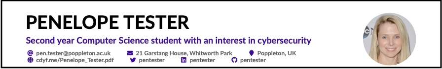
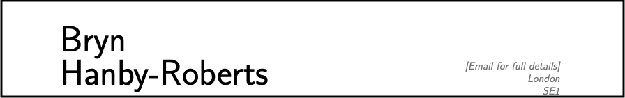

<!--# (APPENDIX) Appendix {-}-->

# Hacking your future {#hacking}

It's very easy to overlook mistakes in your own writing. That's true of any written communication such as a covering letter, personal statement, email or any message that you write. Mistakes are particularly common in CVs (or résumés) because you can spend *hours* carefully polishing the words and the formatting but not see a fatal error at the top of page one. Hacking^[The term [hacking](https://en.wikipedia.org/wiki/Hacker_(disambiguation)) is a horribly overloaded word with many different meanings, but I'm using it here to mean an “ingenious temporary solution to a problem”] other people's CV's will help you improve your own. You may need to use ingenious hacks like the one on the bridge in figure \@ref(fig:kludge-fig). Returning to the bridge analogy from section \@ref(parti), fixing other peoples bridges will help you improve your own bridge. You'll build better bridges to more interesting and ambitious destinations.

```{r kludge-fig, echo = FALSE, fig.align = "center", out.width = "100%", fig.cap = "(ref:captionkludge)"}

```
(ref:captionkludge) Your CV is a bridge which enables you to cross from where you are now to where you'd like to be in the future. Like the bridge in this picture, the CV's in this chapter are all faulty in some way, can you fix them? You may need to use ingenious hacks and [kludges](https://en.wikipedia.org/wiki/Kludge) like the one shown here on the [Million Dollar Bridge](https://en.wikipedia.org/wiki/Miles_Glacier_Bridge) in Alaska . Public domain image of kludgy repairs adapted from an original by [Jet Lowe](https://en.wikipedia.org/wiki/Jet_Lowe) on Wikimedia Commons [w.wiki/3Uvn](https://w.wiki/3Uvn)

<!-- CVs todo

* miscellaneous section
* too much colour e.g. https://www.overleaf.com/latex/templates/infographics-cv/hdgkztmhztph
* marge conflict
* polina morphism
-->


## Hack their CVs

A useful hacking technique is to take somebody elses stuff and fix or improve it. That works for written communication as well as actual `code`. The dogfooding technique described in section \@ref(dogfooding) is a useful hack which you can use by:

1. Eating your *own* dogfood by reading your own written work ALOUD <!--self assess using the rubric-->
1. Eating *somebody elses* dogfood by:
    - Hacking a friends or peers CV by swapping with them and giving them constructive feedback
    - Hacking the fictitious CVs below by ranking them against a job advert. Who would you want to interview and why?
1. Eating your own dogfood again, re-reading and re-editing repeatedly
1. Persuade someone else to eat your dogfood - get feedback from as many people (and bots see section \@ref(robotproof)) as you can

So, here are some fictitious CVs for you to hack, from students of Computer Science. They are based on CVs I've seen, warts and all, with personal information removed and anonymised. Can you spot their triumphs and tragedies? Can fix their CVs and work out which candidate is best for the sample job description at CoolTech in section \@ref(cooltech)? Can you hack their future?

Special thanks to [Toby Howard](https://en.wikipedia.org/wiki/Toby_Howard) and [Sean Bechhofer](https://personalpages.manchester.ac.uk/staff/sean.bechhofer/) for coming up with some of these silly names for fictional students in computing. Please direct any complaints about the terrible geeky puns to Toby and Sean! Thanks also Ben Carter and Penny Gordon Lanes in the careers service at the University of Manchester, some of these CVs are based on examples they have collected and anonymised. 🙏

## Breakpoints
(ref:breakpoint)

```md
* PAUSE ⏸️
```

When you read these CVs make a note of:

1. **What Went Well?** (`WWW`) What do you like about any given CV, what have they done well?
1. **Even Better If?** (`EBI`) What could be fixed or improved, can you hack it?
1. **Their Rank order** (`1,2,3...`) Who is top of your list to interview? Who is going in the bin and why?

```md
* RESUME ▶️
```
<!-- also use the CV rubric and CV checklist-->

Imagine the person is real, what would you tell them about their CV if they'd given it to you for advice without hurting their feelings? How could you be a critical friend by giving them actionable feedback?

## Sample CVs

Hacking other people's CVs will help you improve your own because you're putting yourself in the shoes of your reader. Here are some samples:

### Penelope Tester {#pen-tester}

Penny Tester, or Pen as her friends call her, loves cybersecurity and [reverse engineering](https://en.wikipedia.org/wiki/Reverse_engineering). She has a real passion for finding vulnerabilities in software and hardware. Just don't call her a hacker she hates that word, see \@ref(fig:pentester-fig).

```{r pentester-fig, echo = FALSE, fig.align = "center", out.width = "100%", fig.cap = "(ref:captionpentester)"}

```
(ref:captionpentester) Penny Tester's full CV can be viewed at [cdyf.me/Penelope_Tester.pdf](https://www.cdyf.me/Penelope_Tester.pdf)  

### Rick Urshion {#rick-urshion}

Rick is a big fan of functional programming and loves expressing himself using languages like Lisp, Haskell, Clojure, Erlang and Scala. He really hates side-effects but tries to avoid getting into a state about it. His critics say he can be inefficient but Rick insists he's just lazy, see figure \@ref(fig:rickurshion-fig).

```{r rickurshion-fig, echo = FALSE, fig.align = "center", out.width = "100%", fig.cap = "(ref:captionrick)"}

```
(ref:captionrick) Rick Urshion's full CV can be viewed at [cdyf.me/Rick_Urshion.pdf](https://www.cdyf.me/Rick_Urshion.pdf)

### Marge Conflict {#marge-conflict}

Marge loves version control and her superpower is resolving people's differences.

*(Marge is currently updating her CV)*

### Michael Rokernel {#mike-rokernel}

Mike loves operating systems, but not if they get too bloated, see figure \@ref(fig:mikrokernel-fig).

```{r mikrokernel-fig, echo = FALSE, fig.align = "center", out.width = "100%", fig.cap = "(ref:captionmike)"}

```

(ref:captionmike) Mike Rokernel's full CV can be viewed at [cdyf.me/Mike_Rokernel.pdf](https://www.cdyf.me/Mike_Rokernel.pdf)

### Florence Ting-Point {#flo-ting-point}

Flo loves maths and is a particularly big fan of [floating-point arithmetic](https://en.wikipedia.org/wiki/Floating-point_arithmetic), see figure \@ref(fig:floatingpoint-fig).

```{r floatingpoint-fig, echo = FALSE, fig.align = "center", out.width = "100%", fig.cap = "(ref:captionflo)"}

```
(ref:captionflo) Flo Ting-Point's full CV can be viewed at [cdyf.me/Flo_Ting-Point.pdf](https://www.cdyf.me/Flo_Ting-Point.pdf)

### Peter Byte {#peter-byte}

Peter and his [twin sister Peta](https://en.wikipedia.org/wiki/Peta_(given_name)), both love big data, machine learning, statistics, data science and Artificial Intelligence (AI). They come from a big family with nine siblings, [Deca](https://en.wikipedia.org/wiki/Deca-), [Hector](https://en.wikipedia.org/wiki/Hecto-), [Kilo](https://en.wikipedia.org/wiki/Kilo-), [Megan](https://en.wikipedia.org/wiki/Mega-), [Giga](https://en.wikipedia.org/wiki/Giga-), [Terry](https://en.wikipedia.org/wiki/Tera-), [Exa](https://en.wikipedia.org/wiki/Exa-), [Zita](https://en.wikipedia.org/wiki/Zetta-) and [Yotta](https://en.wikipedia.org/wiki/Yotta-). They are wildly ambitious, but critics say the Byte family have been terribly over-hyped, see figure \@ref(fig:peterbyte-fig).

```{r peterbyte-fig, echo = FALSE, fig.align = "center", out.width = "100%", fig.cap = "(ref:captionpeter)"}

```

(ref:captionpeter) Peter Byte's full CV can be viewed at [cdyf.me/Peter_Byte.pdf](https://www.cdyf.me/Peter_Byte.pdf)

### Polina Morphism {#polly-morphism}

Polly loves object-oriented programming. She has lots of siblings, and a cousin called, Isa.

*(Polina is currently working on her CV)*

### Neil Pointer {#neil-pointer}

Neil is a mature student who loves the C programming language, see figure \@ref(fig:neilpointer-fig). The [Pointer family](https://en.wikipedia.org/wiki/The_Pointer_Sisters) are sometimes misunderstood, but Neil compensates for this with his excellent memory management skills and efficiency. He has a younger half-brother, Neil Pointer-Exception, from his fathers second marriage. Neil Pointer-Exception prefers Java .

```{r neilpointer-fig, echo = FALSE, fig.align = "center", out.width = "100%", fig.cap = "(ref:captionneil)"}

```
(ref:captionneil) Neil Pointer's full CV can be viewed at [cdyf.me/Neil_Pointer.pdf](https://www.cdyf.me/Neil_Pointer.pdf)

### Bryn Hanby-Roberts {#bryn}

The last CV is a real one. Bryn kindly gave his permission to share it with you, see figure \@ref(fig:bryn-fig). Bryn graduated in 2016, his CV is longer as he has five years of experience under his belt but it provides a useful counterpoint to the examples above. Thanks Bryn. 🙏

```{r bryn-fig, echo = FALSE, fig.align = "center", out.width = "100%", fig.cap = "(ref:captionbryn)"}

```
(ref:captionbryn) Bryn Hanby-Roberts full CV can be viewed at [cdyf.me/bryn.pdf](https://www.cdyf.me/bryn.pdf) a snapshot taken in 2021 from [bryn.co.uk](http://bryn.co.uk)


## Sample CoolTech Job advert {#cooltech}

We’re looking for bright and geeky graduates to join our software engineering team. No experience is required, and many of our successful applicants have never programmed before. If you think logically and enjoy problem solving, then you have the potential to become a great developer.

A career at CoolTech will challenge you every day. In your first few weeks you will be solving real-world problems as you help to develop software used by professionals across the world.

You’ll be part of an agile development team, working on one of the largest real-time databases in the world. You’ll work on a wide variety of projects, ranging from Artificial Intelligence assisting clinicians with early diagnosis of cancer to an iOS app helping patients manage their diabetes.

Developers at CoolTech are involved in the full software cycle, and work closely with all teams across the company to scope out new projects as they design, develop and deploy our products.


<!-- suggestions from toby

Alex Hacker

Bobby Tables

Justine Time

Gemma Over (friends call her Gem Over)

Dick Claration

Ian Tejer

Ceaser Craplanguage-->
