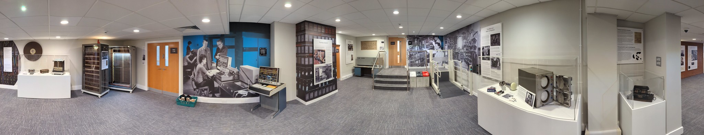

# Enjoying your future {#enjoying}
Music is deeply connected to your mental health and your sense of wellbeing that we discussed in chapter \@ref(nurturing). Music has the ability to comfort and connect you to others and yourself by providing motivation, gratification and empathy. There's plenty of scientific evidence that listening to music can enhance your mood. [@zatorre; @dopamine]

```{r enjoying-fig, echo = FALSE, fig.align = "center", out.width = "100%", fig.cap = "(ref:captionenjoying)"}
knitr::include_graphics("images/Enjoying-your-future.png")
```
(ref:captionenjoying) Enjoying your future sketch by [Visual Thinkery](https://visualthinkery.com/) is licensed under [CC-BY-ND](https://creativecommons.org/licenses/by-nd/4.0/)

Besides entertaining you and lifting your spirits, there's also lot of wisdom captured in the lyrics of many songs too, offering sound advice on how you can live your life. If that wasn't enough to convince you that music is important for your future, there's no shortage of links between mathematics and music too. [@behindthemusic; @musicnmaths]

This chapter explores the musical references scattered throughout in this guidebook in a series of playlists which are accompanied with some explanation and context to help you enjoy them. 

Your future is bright, your future needs enjoying, so let's start enjoying your future.

## The Coder’s playlist {#coders}
In *Hearing your Future* (chapter \@ref(hearing)) we ask our guests (coders) to recommend a tune that is important to them. These are gathered together in *The Coder’s Playlist* and incremented by one with every new episode of the podcast. In the words of [Arthur O'Shaughnessy](https://en.wikipedia.org/wiki/Arthur_O%27Shaughnessy), figure \@ref(fig:music-makers-fig): *We are the music makers and we are the dreamers of dreams. Wandering by lone sea-breakers, and sitting by desolate streams; World-losers and world-forsakers, On whom the pale moon gleams: Yet we are the movers and shakers of the world for ever, it seems.* [@ode]

```{r music-makers-fig, echo = FALSE, fig.show = "hold", out.width = "99%", fig.cap = "(ref:captionmusicmakers)"}
knitr::include_graphics("images/we-are-the-music-makers.jpeg")
```

(ref:captionmusicmakers) “We are the music makers and we are the dreamers of dreams” is a much quoted and sampled lyric from [Ode](https://en.wikipedia.org/wiki/Ode_(poem)), a poem written in the 19th Century [@ode]. The poem is often credited with being the origin of the now widely used phrase “[movers and shakers](https://en.wikipedia.org/wiki/Movers_and_Shakers)”. *Ode* was first re-used in music by [Edward Elgar](https://en.wikipedia.org/wiki/Edward_Elgar) in *[The Music Makers](https://en.wikipedia.org/wiki/The_Music_Makers_(Elgar))* [@themusicmakers], and subsequently quoted by the character [Willy Wonka](https://en.wikipedia.org/wiki/Willy_Wonka) in a film adaptation [@wonka] of the children's novel *Charlie and the Chocolate Factory*. [@dahl] The Willy Wonka sample voiced by [Gene Wilder](https://en.wikipedia.org/wiki/Gene_Wilder) has subsequently appeared in many recordings by artists such as [808 State](https://en.wikipedia.org/wiki/808_State) [@nephatiti] and [Aphex Twin](https://en.wikipedia.org/wiki/Aphex_Twin) [@aphextwin]. Public domain picture of an ocean wave by unknown author on Wikimedia Commons [w.wiki/5QW5](https://w.wiki/5QW5) adapted using the [Wikipedia App](https://apps.apple.com/gb/app/wikipedia/id324715238)

::: {.rmdcaution}
* **Do say:** It's `Music++`
* **Don't say:** Music isn't important to me. You don't really care for music do ya? [@hallelujah]
* **Listen** at [youtube.com/playlist?list=PLyxEvjuBJhvDi4guctovrW3ncSgqoVik_](https://youtube.com/playlist?list=PLyxEvjuBJhvDi4guctovrW3ncSgqoVik_)
* **Browse** the playlist notes in section \@ref(codersnotes)
:::

### Playlist notes {#codersnotes}

Some notes to help you enjoy music on the coder's playlist:

1. “Anything” (we chose *[No Idea](https://en.wikipedia.org/wiki/No_Idea_(song))*) by rapper [Don Toliver](https://en.wikipedia.org/wiki/Don_Toliver) was chosen by Jason, see chapter \@ref(jason). [@noidea]
1. *LOUD* by singer [Sofia Carson](https://en.wikipedia.org/wiki/Sofia_Carson) was chosen by Carmen, see chapter \@ref(carmen). [@loud]
1. *[November Rain](https://en.wikipedia.org/wiki/November_Rain)* by rockers [Guns N' Roses](https://en.wikipedia.org/wiki/Guns_N%27_Roses) was chosen by Sneha, see chapter \@ref(sneha). [@novemberrain]
1. *[Uptown Funk](https://en.wikipedia.org/wiki/Uptown_Funk)* by [Mark Ronson](https://en.wikipedia.org/wiki/Mark_Ronson)  is in this playlist because Aidan Blowers use of this music in his teaching has inspired me, see section \@ref(st-laurence) Thanks Aidan 🙏 [@uptownfunk; @blowers]
1. *[Iguana](https://en.wikipedia.org/wiki/Iguana_(song))* by singer [Inna](https://en.wikipedia.org/wiki/Inna) was chosen by Alice, see chapter \@ref(alice). [@iguana]
1. *[As It Was](https://en.wikipedia.org/wiki/As_It_Was)* by [Harry Styles](https://en.wikipedia.org/wiki/Harry_Styles) was chosen by Alice, who managed to sneak two songs onto the playlist, see chapter \@ref(alice). [@asitwas]


## Turing's electro-playlist {#electronica}
This playlist celebrates [electronica](https://en.wikipedia.org/wiki/Electronica) and other computationally influenced music. In 1951, engineers of the [Ferranti Mark 1 computer](https://en.wikipedia.org/wiki/Ferranti_Mark_1), implemented a `hoot()` function that was used to sound a prompt when input or action was required. [@turingmanual] Alan Turing realised that this could be reprogrammed to make different notes and created a routine that played a note of a specified pitch. [@hooturing]

```{r draughts-fig, echo = FALSE, fig.show = "hold", out.width = "33%", fig.cap = "(ref:captiondraughts)"}
knitr::include_graphics(rep("images/draughts.png", 3))
```

(ref:captiondraughts) Is this the worlds first [video game](https://en.wikipedia.org/wiki/Video_game)? Christopher Strachey's draughts game displayed on a cathode ray tube in 1952. When the game finished, the [Ferranti Mark 1](https://en.wikipedia.org/wiki/Ferranti_Mark_1) computer which ran the game, played a tune. Public domain image from Wikimedia Commons at [w.wiki/5UJs](https://w.wiki/5UJs)

Using Turing's code the computer scientist [Christopher Strachey](https://en.wikipedia.org/wiki/Christopher_Strachey) wrote programs to play music. Strachey's first success was a version of the UK's national anthem *God Save the King* [@godsavethequeen] which was played at the end of what is very probably the first video ever game created, [draughts](https://en.wikipedia.org/wiki/Checkers) shown in figure \@ref(fig:draughts-fig). [@programmingenter] The earliest existing recording of computer-generated music was made in 1951 by the BBC shown in figure \@ref(fig:soundcloud-fig).


```{r soundcloud-fig, echo = FALSE, fig.show = "hold", out.width = "99%", fig.cap = "(ref:soundcloud)"}
knitr::include_url('https://w.soundcloud.com/player/?url=https%3A//api.soundcloud.com/tracks/286040117&amp;color=ff5500&amp;auto_play=false&amp;hide_related=false&amp;show_comments=true&amp;show_user=true&amp;show_reposts=false',  height = "166px")
```

(ref:soundcloud) The first known recording of computer music made in 1951, available from the British Library and restored by [Jack Copeland](https://en.wikipedia.org/wiki/Jack_Copeland) and Jason Long in 2016. [@restoringmusic; @hooturing] (if the clip doesn't load properly, try refreshing this page)

In the recording you can hear the [Ferranti Mark 1](https://en.wikipedia.org/wiki/Ferranti_Mark_1) computer playing three songs:

1. *[God Save the King](https://en.wikipedia.org/wiki/God_Save_the_King)* [@godsavethequeen]
1. *[Baa, Baa, Black Sheep](https://en.wikipedia.org/wiki/Baa,_Baa,_Black_Sheep)* [@baabaablacksheep]
1. *[In the Mood](https://en.wikipedia.org/wiki/In_the_Mood)* [@inthemood]

You can listen this music which was restored by [Jack Copeland](https://en.wikipedia.org/wiki/Jack_Copeland) and Jason Long in 2016. [@restoringmusic]

Computers have been changing the way we create, distribute and listen to music ever since. Sing like no one is listening, love like you never been hurt and dance like no one is watching:


::: {.rmdcaution}
* **Do say:** Turn it up DJ!
* **Don't say:** Why can't they play *real* musical instruments, you know, analogue ones?
* **Listen** at [youtube.com/playlist?list=PLyxEvjuBJhvCC2vbFMosi5l-IXPPSKwck](https://youtube.com/playlist?list=PLyxEvjuBJhvCC2vbFMosi5l-IXPPSKwck)
:::

## The Lancashire playlist {#lancashire}
This playlist starts and ends with one of the best known bands on the planet: [The Beatles](https://en.wikipedia.org/wiki/The_Beatles) shown in figure \@ref(fig:the-beatles-fig). You will find plenty of other Lancashire lads, [lasses](https://en.wikipedia.org/wiki/Lass) and even [Lucifer](https://en.wikipedia.org/wiki/Lucifer) in here too. [@luciferoverlancs]

Which cities are actually *in* [Lancashire](https://en.wikipedia.org/wiki/Lancashire), I hear you say? Don't let bureaucrats trick you into believing that:

* Manchester is in a region known as “*[Greater Manchester](https://en.wikipedia.org/wiki/Greater_Manchester)*”
* Liverpool is in a regional known as “*[Merseyside](https://en.wikipedia.org/wiki/Merseyside)*”

These are *meaningless* bureaucratic abstractions, not **real places** that people identify with! Liverpool and Manchester have always been, and will always be, in Lancashire. Aye! [@northerners]

```{r the-beatles-fig, echo = FALSE, fig.show = "hold", out.width = "33%", fig.cap = "(ref:captionbeatles)"}
knitr::include_graphics(rep("images/the-beatles.jpeg", 3))
```

(ref:captionbeatles) [John](https://en.wikipedia.org/wiki/John_Lennon), [Paul](https://en.wikipedia.org/wiki/Paul_McCartney), [Ringo](https://en.wikipedia.org/wiki/Ringo_Starr) and [George](https://en.wikipedia.org/wiki/George_Harrison) (aka The Beatles) are from Liverpool in Lancashire. Public domain image of The Beatles in New York City in 1964 via Wikimedia Commons at [w.wiki/5UJy](https://w.wiki/5UJy)

Bursting with Lancastrian Red Roses (see figure \@ref(fig:roses-fig)) this playlist will educate and entertain you in equal measure, [while my keyboard gently weeps](https://en.wikipedia.org/wiki/While_My_Guitar_Gently_Weeps) [@weeps]. To paraphrase [Robbie Williams](https://en.wikipedia.org/wiki/Robbie_Williams) shown in figure \@ref(fig:robbie-williams-fig), [Let Me ~~Entertain~~ Educate You](https://en.wikipedia.org/wiki/Let_Me_Entertain_You_(Robbie_Williams_song))... 

```{r robbie-williams-fig, echo = FALSE, fig.show = "hold", out.width = "99%", fig.cap = "(ref:captionrobbie)"}
knitr::include_graphics("images/let-me-entertain-you-let-me-educate-you.jpeg")
```

(ref:captionrobbie) Robbie Williams and [Guy Chambers](https://en.wikipedia.org/wiki/Guy_Chambers) were inspired to write *[Let Me Entertain You](https://en.wikipedia.org/wiki/Let_Me_Entertain_You_(Robbie_Williams_song))* after watching *[The Rolling Stones Rock and Roll Circus](https://en.wikipedia.org/wiki/The_Rolling_Stones_Rock_and_Roll_Circus)*. [@circus] “Come on, let me entertain you! Come on, let me educate you!” [@entertainyou]


::: {.rmdcaution}
* **Do say:** Chippy tea, chippy tea, I wants a chippy tea! [@chippytea; @chippywhat]
* **Don't say:** But Liverpool and Manchester aren't even *in* Lancashire are they? [@mancashire]
* **Do say:** This land's the place I love and here I'll stay [@ferrycrossthemersey]
* **Listen** at [youtube.com/playlist?list=PLyxEvjuBJhvDvG0TRu63n3i12kR89niFJ](https://youtube.com/playlist?list=PLyxEvjuBJhvDvG0TRu63n3i12kR89niFJ)
:::

```{r roses-fig, echo = FALSE, fig.show = "hold", out.width = "20%", fig.cap = "(ref:captionredrose)"}
knitr::include_graphics(rep("images/Red-Rose-of-Lancaster.png", 5))
```

(ref:captionredrose) The [Red Rose of Lancaster](https://en.wikipedia.org/wiki/Red_Rose_of_Lancaster) is a symbol of the county of [Lancashire](https://en.wikipedia.org/wiki/Lancashire), first adopted by the [House of Lancaster](https://en.wikipedia.org/wiki/House_of_Lancaster) in the 14th century. There's no 14th century music in the Lancashire playlist, but there's plenty of red roses. CC BY-SA image of a red rose by [Sodacan](https://commons.wikimedia.org/wiki/User:Sodacan) on Wikimedia Commons [w.wiki/5Y4Z](https://w.wiki/5Y4Z)🌹


## The Dad-rock playlist {#dadrock}
Using the medium of rock, this playlist grumpily reminds you that “*when I was your age*” music was much better and it's all gone downhill since the good old days. Nostalgia isn't what it used to be but these classics were made by *true* artists using *proper* musical instruments, see figure \@ref(fig:jimi-hendrix-fig). None of this social media powered digital nonsense thank you very much! [@lanier]

```{r jimi-hendrix-fig, echo = FALSE, fig.show = "hold", out.width = "99%", fig.cap = "(ref:captionhendrix)"}
knitr::include_graphics("images/jimi-hendrix.jpeg")
```

(ref:captionhendrix) Are you experienced in Dad-rock? [@hendrix] Definitions vary, but there's plenty of men who believe this playlist includes some of the best music ever made. By real musicians. With real musical instruments. Public domain image of [Jimi Hendrix](https://en.wikipedia.org/wiki/Jimi_Hendrix) performing on the *[Hoepla](https://en.wikipedia.org/wiki/Hoepla)* show in 1967 by A. Vente via Wikimedia Commons [w.wiki/5WHj](https://w.wiki/5WHj) adapted using the [Wikipedia App](https://apps.apple.com/gb/app/wikipedia/id324715238)

Cherished by men of a certain age, the Dad-rock playlist thrives on past glories but is a shadow of its former self. Proponents of Dad-rock can't understand why more people don't enjoy these seminal tunes of yesteryear [@dadrock; @dadrock2]:

::: {.rmdcaution}
* **Do say:** Expiry date: What expiry date? Classic music like this is timeless!
* **Don't say:** Oh no, not this again!
* **Listen** at [youtube.com/playlist?list=PLyxEvjuBJhvDUyr9hPvUP3IeriN8aaTW0](https://www.youtube.com/playlist?list=PLyxEvjuBJhvDUyr9hPvUP3IeriN8aaTW0)
* **Note**: we've broadened the definition of Dad-rock to include *any* music that your Dad (or Grandad) might have listened to *“when he was your age”* ...
:::

## The Indie rock playlist {#indie}
Wetter and muddier than the traditional summer downpour at the [Glastonbury Festival of Contemporary Performing Arts](https://en.wikipedia.org/wiki/Glastonbury_Festival) in Somerset (see figure \@ref(fig:glastonbury-fig)), this playlist encourages you to swing your cardigan mournfully while [shoegazing](https://en.wikipedia.org/wiki/Shoegaze) and wondering if its *ever* going to stop raining, either metaphorically or meteorologically: ☔️


```{r glastonbury-fig, echo = FALSE, fig.show = "hold", out.width = "99%", fig.cap = "(ref:captionglastonbury)"}
knitr::include_graphics("images/glastonbury-festival.jpeg")
```

(ref:captionglastonbury) “[Why does it always rain on me?](https://en.wikipedia.org/wiki/Why_Does_It_Always_Rain_on_Me%3F) Is it because ~~I lied when I was seventeen~~ *I went to [Glastonbury festival](https://en.wikipedia.org/wiki/Glastonbury_Festival)*?” [@whydoesitalwaysrainonme] If you're only happy when it rains, if you're only happy when it's complicated, then the indie rock playlist is for you. [@onlyhappy] All art is borne of suffering and this playlist helps you wallow in it. Pour your misery down on me! Picture taken from the highest point at Glastonbury festival in 2016 by Czampal on Wikimedia Commons [w.wiki/5WKn](https://w.wiki/5WKn) adapted using the [Wikipedia App](https://apps.apple.com/gb/app/wikipedia/id324715238)


::: {.rmdcaution}
* **Do say:** It's indie rock and roll for me! [@indierocknroll]
* **Don't say:** Cheer up hun, life's not *that* bad is it? [@depressingindie]
* **Listen** at [youtube.com/playlist?list=PLyxEvjuBJhvBUO8jaKvJtZLuXfnKc8iz3](https://youtube.com/playlist?list=PLyxEvjuBJhvBUO8jaKvJtZLuXfnKc8iz3)
:::


## Summarising your enjoyment {#tldr17}

(ref:tldr)

Your future is bright, your future needs enjoying. Enjoying your future is deploying your future. Deploying your future will help you to start coding your future. 

After this musical interlude, we'll return to the more serious topic of chapter \@ref(starting): *Starting your Future*, after returning from your break, how will you now survive and thrive in your new environment.


## Thanks Jim {#jimusic}
Thanks to [Jim Miles](https://en.wikipedia.org/wiki/James_John_Miles) for the descriptions of the birth of electronic music installed in the Atlas lobby and museum of the [Kilburn building](https://en.wikipedia.org/wiki/Kilburn_Building) shown in figure \@ref(fig:atlassuite-fig). Some of the text from these displays has been adapted and re-used in section \@ref(electronica). [@ieeemilestones; @reflections]

```{r atlassuite-fig, echo = FALSE, fig.align = "center", out.width = "100%", fig.cap = "(ref:captionatlas)"}

```
(ref:captionatlas) Panorama of the Atlas suite in the Kilburn building, Manchester which exhibits hardware from several [Manchester computers](https://en.wikipedia.org/wiki/Manchester_computers) such as the Atlas computer. Picture by Yours Truly.
