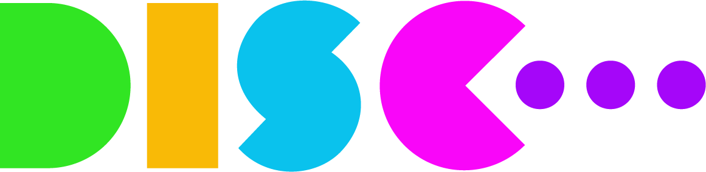

# Opportunities with DISC {#disc}

Part-time Studio Support Workers specialising in Coding & Gaming required in Manchester:

* **Location**: On-site at DISC: Digital Independent Specialist College, Manchester [disc.ac.uk](https://disc.ac.uk)
* **Time Commitment:** 1+ day per week, to be agreed
* **Employment period**: September 2025 – June 2026
* **Payment**: £15.00 per hour
* **Ideal for**: Undergraduate students in Computer Science

```{r disc-fig, echo = FALSE, fig.align = "center", out.width = "100%", fig.cap = "(ref:captiondisc)"}

```

(ref:captiondisc) DISC ([disc.ac.uk](https://disc.ac.uk)) is a specialist digital college in Manchester that supports neurodivergent young people (aged 18–25) to build digital skills and move into creative and tech careers

## About DISC

DISC is a specialist digital college that supports neurodivergent young people (aged 18–25) to build digital skills and move into creative and tech careers. We offer a relaxed, creative, and inclusive environment where learners explore coding, media, gaming, and more, all while preparing for employment in the real world.

## About the Roles

We’re looking for two part-time Studio Support Workers to join our creative team:

1. Coding Support Worker – for someone with good knowledge of software engineering (e.g. Python, JavaScript, React)
2. Gaming Support Worker – for someone with experience in game design, Unity, Unreal, or game design and development

You’ll be working closely with tutors and learners to support projects, offer technical guidance, and help our young people develop their skills and confidence.

## What You’ll Do

* Support neurodivergent learners with hands-on digital projects in coding or
gaming Help explain tricky concepts in an easy-to-understand way
* Assist with project briefs, troubleshooting, and basic technical setup
* Help keep track of learner progress and flag any issues
* Support trips to industry events like game expos or hackathons
* Provide general help in the classroom and be a positive, friendly presence

## What We’re Looking For

### Coding Support Worker

* Comfortable with front-end or back-end languages (e.g. HTML, CSS, JavaScript, Python)
*  Some experience with frameworks like React or tools like GitHub is a bonus
*  Interest in inclusive teaching or supporting others to learn

### Gaming Support Worker
* Knowledge of gaming tools (e.g. Unity, Unreal) or general gaming culture
* Confident talking about game mechanics, storytelling, or digital art
* Interest in creative learning environments

### For Both Roles

* Friendly, reliable, and great at communicating with young people
* A patient and positive attitude — especially when someone needs extra help
* Comfortable working in an inclusive environment with neurodivergent learners
* Organised and happy to pitch in with classroom support tasks
* [DBS](https://en.wikipedia.org/wiki/Disclosure_and_Barring_Service) check will be required (we can help with this if needed)

## Why Join Us?

* Real-world experience in a specialist digital education setting
* Training and mentoring from experienced tutors and creative professionals
* A chance to shape inclusive digital learning for young people
* A welcoming, diverse environment with opportunities for growth

## Interested?

Please complete our Expression of Interest form at this jotform [bit.ly/DISC-interested](https://bit.ly/DISC-interested)