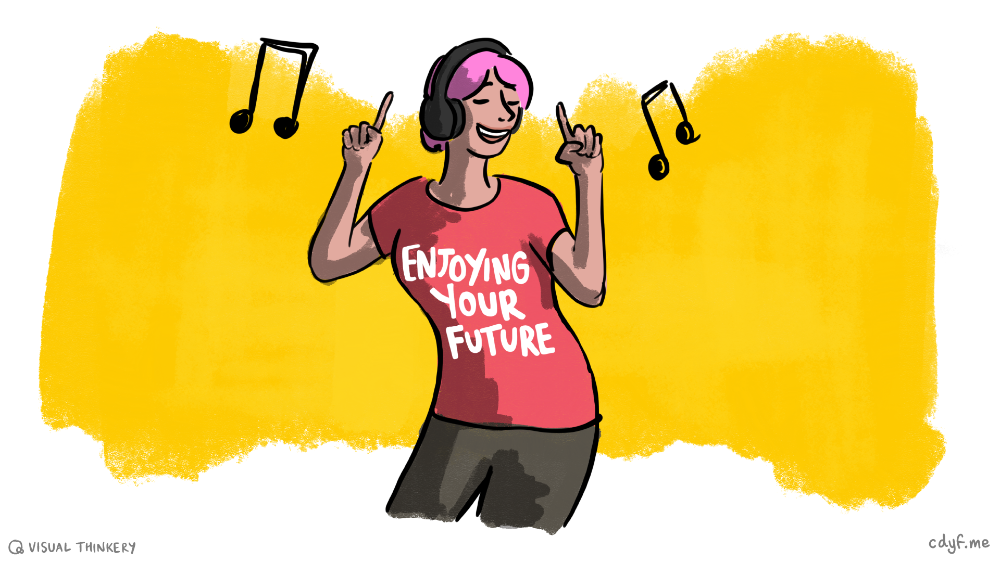
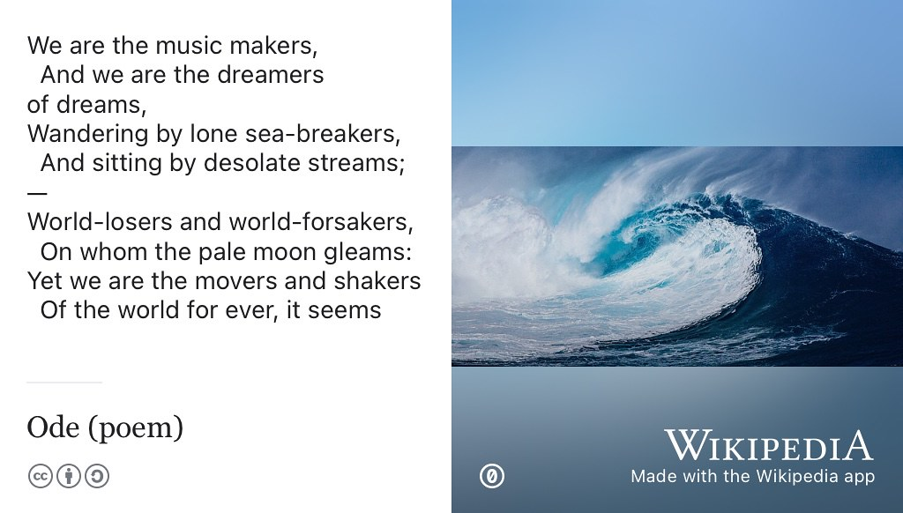
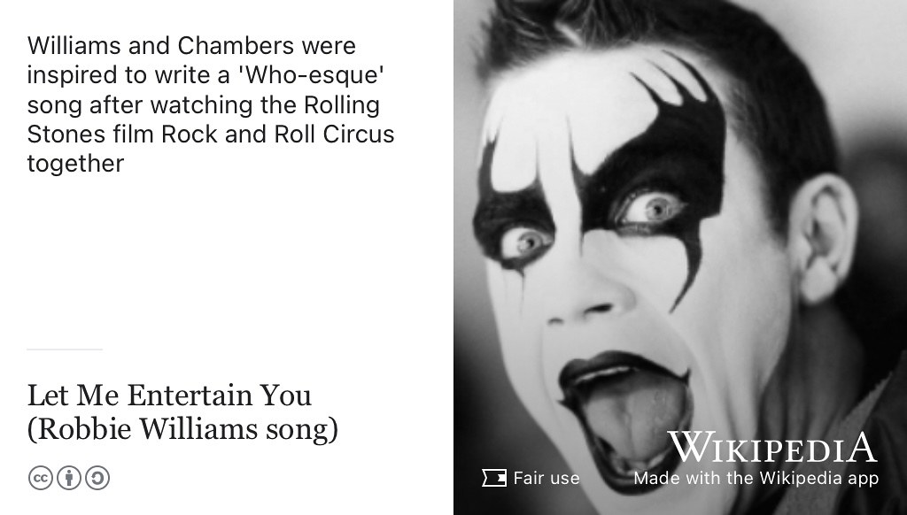
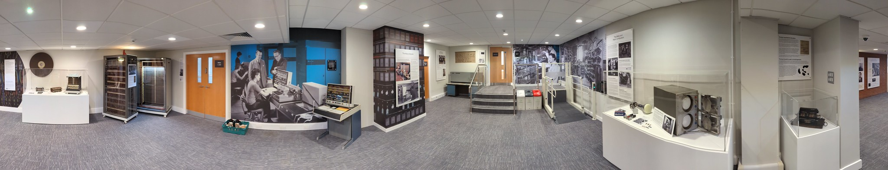

# Enjoying your future {#enjoying}
Music is deeply connected to your mental health and your sense of wellbeing that we discussed in chapter \@ref(nurturing). Music has the ability to comfort and connect you to yourself and to others by providing motivation, gratification and empathy. Besides entertaining, there's also lot of wisdom captured in the lyrics of many songs too, offering good advice on how you can live your life. If that wasn't enough convince you that music is important for your future, there's no shortage of links between mathematics and music too. [@behindthemusic; @musicnmaths]

```{r enjoying-fig, echo = FALSE, fig.align = "center", out.width = "100%", fig.cap = "(ref:captionenjoying)"}

```
(ref:captionenjoying) Enjoying your future sketch by [Visual Thinkery](https://visualthinkery.com/) is licensed under [CC-BY-ND](https://creativecommons.org/licenses/by-nd/4.0/)

This chapter explores all the musical references in this guidebook in a series of playlists which are accompanied with some explanation and context.

## The Coder’s playlist {#coders}
In *Hearing your Future* (chapter \@ref(hearing)) we ask our guests to recommend a tune that is important to them. These are gathered into *The Coder’s Playlist* and incremented by one with every new episode of the podcast. In the words of [Arthur O'Shaughnessy](https://en.wikipedia.org/wiki/Arthur_O%27Shaughnessy): We are the music makers and we are the dreamers of dreams. Wandering by lone sea-breakers, and sitting by desolate streams; World-losers and world-forsakers, On whom the pale moon gleams: Yet we are the movers and shakers of the world for ever, it seems.

```{r music-makers-fig, echo = FALSE, fig.show = "hold", out.width = "99%", fig.cap = "(ref:captionmusicmakers)"}

```

(ref:captionmusicmakers) “We are the music makers are we are the dreamers of dreams” is a much sampled lyric from [Ode](https://en.wikipedia.org/wiki/Ode_(poem)), a poem written in the 19th Century [@ode]. The poem is often credited with being the origin of the now widely used phrase “[movers and shakers](https://en.wikipedia.org/wiki/Movers_and_Shakers)”. *Ode* was first re-used in music by [Edward Elgar](https://en.wikipedia.org/wiki/Edward_Elgar) in *[The Music Makers](https://en.wikipedia.org/wiki/The_Music_Makers_(Elgar))* [@themusicmakers], and subsequently quoted by the character [Willy Wonka](https://en.wikipedia.org/wiki/Willy_Wonka) in a film adaptation [@wonka] of the children's novel *Charlie and the Chocolate Factory*. [@dahl] This sample has subsequently appeared in many recordings by artists such as [808 State](https://en.wikipedia.org/wiki/808_State) [@nephatiti] and [Aphex Twin](https://en.wikipedia.org/wiki/Aphex_Twin) [@aphextwin]. Public domain picture of an ocean wave by unknown author on Wikimedia Commons [w.wiki/5QW5](https://w.wiki/5QW5)

::: {.rmdcaution}
* **Do say:** It's `Music++`
* **Don't say:** Music isn't important to me
* **Listen** at [youtube.com/playlist?list=PLyxEvjuBJhvDi4guctovrW3ncSgqoVik_](https://youtube.com/playlist?list=PLyxEvjuBJhvDi4guctovrW3ncSgqoVik_)
* **Browse** the playlist notes in section \@ref(codersnotes)
:::

### Playlist notes {#codersnotes}

1. *Iguana* by Romanian singer [Inna](https://en.wikipedia.org/wiki/Inna) was chosen by Alice, see chapter \@ref(alice)
1. “Anything” (we chose *No Idea*) by American rapper [Don Toliver](https://en.wikipedia.org/wiki/Don_Toliver) was chosen by Jason, see chapter \@ref(jason)  
1. *LOUD* by American singer [Sofia Carson](https://en.wikipedia.org/wiki/Sofia_Carson) was chosen by Carmen, see chapter \@ref(carmen)
1. *[November Rain](https://en.wikipedia.org/wiki/November_Rain)* by American rockers [Guns N' Roses](https://en.wikipedia.org/wiki/Guns_N%27_Roses) was chosen by Sneha, see chapter \@ref(sneha)
1. *[Uptown Funk](https://en.wikipedia.org/wiki/Uptown_Funk)* by [Mark Ronson](https://en.wikipedia.org/wiki/Mark_Ronson) [@uptownfunk] is in this playlist because Aidan Blowers use of music in teaching inspired these playlists, see section \@ref(st-laurence)

## Turing's electro-playlist {#electronica}
This playlist celebrates [electronica](https://en.wikipedia.org/wiki/Electronica) and other computationally influenced music. In 1951, engineers of the [Ferranti Mark 1 computer](https://en.wikipedia.org/wiki/Ferranti_Mark_1), implemented a `hoot()` function that was used to sound a prompt when input was required. Alan Turing realised that this could be reprogrammed to make different notes and created a routine that played a note of a specified pitch. [@hooturing]

```{r draughts-fig, echo = FALSE, fig.show = "hold", out.width = "33%", fig.cap = "(ref:captiondraughts)"}
knitr::include_graphics(rep("images/draughts.png", 3))
```

(ref:captiondraughts) Is this the worlds first [video game](https://en.wikipedia.org/wiki/Video_game)? Christopher Strachey's draughts game displayed on a cathode ray tube in 1952. When the game finished, the [Ferranti Mark 1](https://en.wikipedia.org/wiki/Ferranti_Mark_1) which ran the game, played a tune. Public domain image from Wikimedia Commons at [w.wiki/5UJs](https://w.wiki/5UJs)

Using Turing's code the computer scientist [Christopher Strachey](https://en.wikipedia.org/wiki/Christopher_Strachey) wrote programs to play music. Strachey's first success was a version of the UK's national anthem *God Save the Queen* [@godsavethequeen] which was played at the end of what is probably the first video ever game created, [draughts](https://en.wikipedia.org/wiki/Checkers) shown in figure \@ref(fig:draughts-fig). [@programmingenter] The earliest existing recording of computer-generated music was made in 1951 by the BBC.

```{r, eval=knitr::is_html_output(excludes = "epub"), results='asis', echo=FALSE}
cat('<iframe frameborder="no" height="166" scrolling="no" src="https://w.soundcloud.com/player/?url=https%3A//api.soundcloud.com/tracks/286040117&amp;color=ff5500&amp;auto_play=false&amp;hide_related=false&amp;show_comments=true&amp;show_user=true&amp;show_reposts=false" width="100%"></iframe>')
```

In the recording you can hear the [Ferranti Mark 1](https://en.wikipedia.org/wiki/Ferranti_Mark_1) computer playing three songs:

1. *[God Save the Queen](https://en.wikipedia.org/wiki/God_Save_the_Queen)* [@godsavethequeen]
1. *[Baa, Baa, Black Sheep](https://en.wikipedia.org/wiki/Baa,_Baa,_Black_Sheep)* [@baabaablacksheep]
1. *[In the Mood](https://en.wikipedia.org/wiki/In_the_Mood)* [@inthemood]

You can hear this music which was restored by [Jack Copeland](https://en.wikipedia.org/wiki/Jack_Copeland) and Jason Long in 2016. [@restoringmusic]

Computers have been changing the way we create, distribute and listen to music ever since. Sing like no one is listening, love like you never been hurt and dance like no one is watching:


::: {.rmdcaution}
* **Do say:** Turn it up DJ!
* **Don't say:** Why can't they play *real* musical instruments, you know, analogue ones?
* **Listen** at [youtube.com/playlist?list=PLyxEvjuBJhvCC2vbFMosi5l-IXPPSKwck](https://youtube.com/playlist?list=PLyxEvjuBJhvCC2vbFMosi5l-IXPPSKwck)
:::

## The Lancashire boy bands playlist {#lancs}
This playlist starts and ends with one of the best known [boy bands](https://en.wikipedia.org/wiki/Boy_band) on the planet: [The Beatles](https://en.wikipedia.org/wiki/The_Beatles) shown in figure \@ref(fig:the-beatles-fig). You will find plenty of other Lancashire lads and even the occasional Lancashire [lass](https://en.wikipedia.org/wiki/Lass) in here too. But hang on a second, which cities are actually *in* Lancashire, I hear you say? Don't let bureaucrats trick you into believing that:

* Manchester is in a place called “*[Greater Manchester](https://en.wikipedia.org/wiki/Greater_Manchester)*”
* Liverpool is in a place called “*[Merseyside](https://en.wikipedia.org/wiki/Merseyside)*”

These are *meaningless* bureaucratic abstractions, not **real places** that people identify with! Liverpool and Manchester have always been, and will always be, in [Lancashire](https://en.wikipedia.org/wiki/Lancashire). Aye. [@northerners]

```{r the-beatles-fig, echo = FALSE, fig.show = "hold", out.width = "33%", fig.cap = "(ref:captionbeatles)"}
knitr::include_graphics(rep("images/the-beatles.jpeg", 3))
```

(ref:captionbeatles) [John](https://en.wikipedia.org/wiki/John_Lennon), [Paul](https://en.wikipedia.org/wiki/Paul_McCartney), [Ringo](https://en.wikipedia.org/wiki/Ringo_Starr) and [George](https://en.wikipedia.org/wiki/George_Harrison) are from Liverpool in Lancashire. Public domain image of The Beatles in New York City in 1964 via Wikimedia Commons at [w.wiki/5UJy](https://w.wiki/5UJy)

Bursting with [Red Roses of Lancaster](https://en.wikipedia.org/wiki/Red_Rose_of_Lancaster) 🌹 this playlist wants to inform and entertain you in equal measure. To paraphrase [Robbie Williams](https://en.wikipedia.org/wiki/Robbie_Williams) shown in figure \@ref(fig:robbie-williams-fig):


```{r robbie-williams-fig, echo = FALSE, fig.show = "hold", out.width = "99%", fig.cap = "(ref:captionrobbie)"}

```

(ref:captionrobbie) Robbie Williams and [Guy Chambers](https://en.wikipedia.org/wiki/Guy_Chambers) were inspired to write *[Let Me Entertain You](https://en.wikipedia.org/wiki/Let_Me_Entertain_You_(Robbie_Williams_song))* after watching *[The Rolling Stones Rock and Roll Circus](https://en.wikipedia.org/wiki/The_Rolling_Stones_Rock_and_Roll_Circus)*. “Come on, let me, ~~entertain~~ educate you!” [@entertainyou]

<!--* The Beatles
Yes, we know Robbie's not from Lancashire, but he was a member of Lancashire boy band Take That
* Gerry and the Pacemakers
* Joy Division
* Echo and the Bunnymen
* Take That
* The Stone Roses
* The Fall
* Big in Japan
* Inspiral Carpets
* Lancashire hotpots
* Frankie goes to Hollywood
* Oasis
* The La's
* James
* 808 State
* Dead or Alive
* The Farm
* The Christians
* The Happy Mondays
* The Chemical Brothers
* The Zutons
* The Lightning Seeds -->


::: {.rmdcaution}
* **Do say:** Chippy tea, chippy tea, I wants my chippy tea! [@chippytea]
* **Don't say:** But Liverpool and Manchester aren't even *in* Lancashire are they? [@mancashire]
* **Listen** at [youtube.com/playlist?list=PLyxEvjuBJhvDvG0TRu63n3i12kR89niFJ](https://youtube.com/playlist?list=PLyxEvjuBJhvDvG0TRu63n3i12kR89niFJ)
:::


## The Dad rock playlist {#dadrock}
Using the medium of rock, this playlist grumpily reminds you that “*when I was your age*” music was much better and it's all gone downhill since the good old days. Nostalgia isn't what it used to be but these classics were made by *true* artists using *proper* musical instruments. None of this social media powered digital nonsense thank you very much! [@lanier]

Cherished by men of a certain age, the Dad rock playlist thrives on past glories but is a shadow of it's former self. Proponents of Dad rock can't understand why more people don't enjoy these classic and seminal tunes of yesteryear [@dadrock; @dadrock2]:

::: {.rmdcaution}
* **Do say:** Expiry date: What expiry date? Good music like this is timeless!
* **Don't say:** Oh no, not this again!
* **Listen** at [youtube.com/playlist?list=PLyxEvjuBJhvDUyr9hPvUP3IeriN8aaTW0](https://www.youtube.com/playlist?list=PLyxEvjuBJhvDUyr9hPvUP3IeriN8aaTW0)
:::

## The Indie rock playlist {#indie}
Muddier than the traditional summer downpour at the [Glastonbury Festival of Contemporary Performing Arts](https://en.wikipedia.org/wiki/Glastonbury_Festival), this playlist encourages you to swing your cardigan mournfully while [shoegazing](https://en.wikipedia.org/wiki/Shoegaze) and wondering if its *ever* going to stop raining, either metaphorically or meteorologically: ☔️

> “[Why does it always rain on me?](https://en.wikipedia.org/wiki/Why_Does_It_Always_Rain_on_Me%3F) Is it because I lied when I was seventeen?” —[Fran Healy](https://en.wikipedia.org/wiki/Fran_Healy_(musician)) [@whydoesitalwaysrainonme]


::: {.rmdcaution}
* **Do say:** It's indie rock and roll for me! [@indierocknroll]
* **Don't say:** Cheer up hun, life's not *that* bad is it? [@depressingindie]
* **Listen** at [youtube.com/playlist?list=PLyxEvjuBJhvBUO8jaKvJtZLuXfnKc8iz3](https://youtube.com/playlist?list=PLyxEvjuBJhvBUO8jaKvJtZLuXfnKc8iz3)
:::

## Thanks Jim {#jimusic}
Thanks to [Jim Miles](https://en.wikipedia.org/wiki/James_John_Miles) for the descriptions of the birth of electronic music installed in the Kilburn building Atlas suite shown in figure \@ref(fig:atlassuite-fig). Some of the text from these displays has been adapted and re-used in section \@ref(electronica). [@ieeemilestones]

```{r atlassuite-fig, echo = FALSE, fig.align = "center", out.width = "100%", fig.cap = "(ref:captionatlas)"}

```
(ref:captionatlas) Panorama of the Atlas suite in the Kilburn building, Manchester which exhibits hardware from several [Manchester computers](https://en.wikipedia.org/wiki/Manchester_computers) such as the Atlas computer. Picture by Yours Truly.
