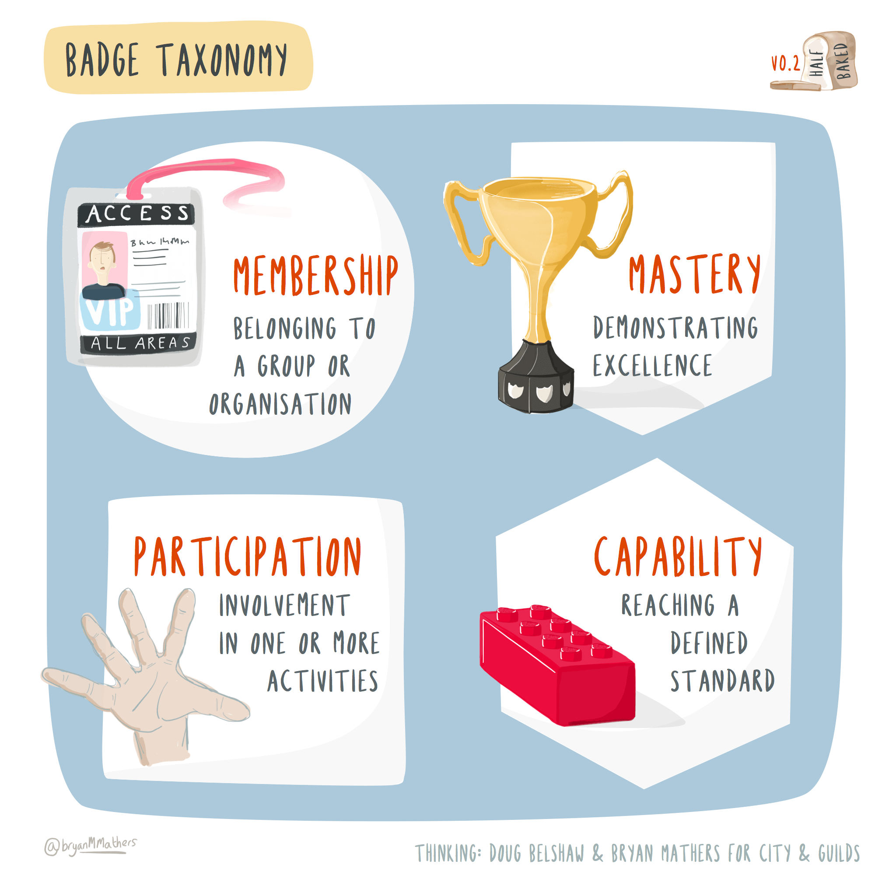

# Achieving your future {#achieving}

We are all in a lifelong learning loop. As we iterate around the [while loop](https://en.wikipedia.org/wiki/While_loop) of life, we continually gain more experience, develop new skills and knowledge. As you loop your own personal loop, you will also collect evidence of your personal and professional achievements. Some of these achievements can be certified or “badged” in various ways. This evidence can be collected as part of your professional identity and reputation, that's the jar called `ME` shown in figure \@ref(fig:while-learning-fig).

```{r while-learning-fig, echo = FALSE, fig.align = "center", out.width = "100%", fig.cap = "(ref:captionunibadges)"}
knitr::include_graphics("images/earning-a-badge-hd.png")
```
(ref:captionunibadges) Learning is a lifelong loop where you constantly acquire knowledge and skills. You can collect evidence of your development, some of which can be certified or badged during University and throughout your professional career.  [Computing Badges](https://bryanmmathers.com/computing-badges/) by [Visual Thinkery](https://visualthinkery.com/) is licenced under [CC-BY-ND](https://creativecommons.org/licenses/by-nd/4.0/)

Evidence is a key part of the “Context, Action, Result and Evidence” (`C.A.R.E.`) stories described in section \@ref(care). S  o what evidence can you collect and how you can certify or badge these credentials, sometimes known as micro-credentials? 📛  [@microc]

Your future is bright, your future needs achieving, so let's start achieving your future.

## What you will learn {#ilob}
After reading this chapter you will be able to:

1. Describe some the evidence and micro-credentials you can collect and badge to show your achievements:
    + during University
    + after University and throughout your professional career
1. Identify any gaps in your personal and professional achievements
1. Plan activities and set goals for future achievements that will help you to continue grow professionally and personally

## Academic badges {#academentia}
One kind of badge you get when you finish University is your degree certificate like the one shown in figure \@ref(fig:degree-cert-fig). A degree certificate is an important offline physical (paper) badge that marks a milestone in your career. If you like gaming, its a huge `achievement unlocked` that will take you to the next level. Your certificate also tells people that you were a member of a particular University community and that you mastered your chosen discipline to some level, Bachelors, Masters or PhD.

```{r degree-cert-fig, echo = FALSE, fig.align = "center", out.width = "100%", fig.cap = "(ref:captiondegreecert)"}
knitr::include_graphics("images/a-certificate-is-just-a-badge.png")
```
(ref:captiondegreecert) Level up, achievement unlocked! A degree certificate is a milestone that provides evidence of your academic knowledge and skills gained while at University. [A certificate is just an offline badge](https://bryanmmathers.com/a-certificate-is-just-an-offline-badge/) by [Visual Thinkery](https://visualthinkery.com/) is licensed under [CC-BY-ND](https://creativecommons.org/licenses/by-nd/4.0/) via [Doug Belshaw](https://dougbelshaw.com/)

Degree certificates are an important badge, but they don't give very many details of your professional and personal story while at University. You could give more details by providing:

* your overall degree classification: first, second, third etc
* your individual module grades, for example in an academic transcript or by listing them on your CV, see section \@ref(mycved)
* your projects, see section \@ref(mycvpj)
* your portfolio of work, if you have one

This data give a *bit* more detail that a degree certificate does not but it is limited to purely academic achievements. You are *much* more than your grades, because there's a lot about your character that is difficult or impossible to measure, see figure \@ref(fig:more-than-grades-fig).

```{r more-than-grades-fig, echo = FALSE, fig.align = "center", out.width = "100%", fig.cap = "(ref:captionmoregrades)"}
knitr::include_graphics("images/i-am-more-than-just-my-grades.png")
```

(ref:captionmoregrades) Your grades give more detail than a degree certificate but they still don't say much about you. [I am more than just my grades](https://bryanmmathers.com/i-am-more-than-just-my-grades/) sketch by [Visual Thinkery](https://visualthinkery.com/) is licensed under [CC-BY-ND](https://creativecommons.org/licenses/by-nd/4.0/)

Employers will often want to see more detailed evidence of your character and your softer skills than those provided by degree certificates and grades. While academic achievements paint some broad brushstrokes of your professional identity shown in figure \@ref(fig:fine-grained-fig), they don't help employers see the finer details or much of the evidence.

```{r fine-grained-fig, echo = FALSE, fig.align = "center", out.width = "100%", fig.cap = "(ref:captionfinegrain)"}
knitr::include_graphics("images/broad-brushstrokes.png")
```
(ref:captionfinegrain) What kind of picture would you like to paint of your professional identity? [Open Badges paint a better picture…](https://bryanmmathers.com/open-badges-paint-a-better-picture/)  by [Visual Thinkery](https://visualthinkery.com/) is licenced under [CC-BY-ND](https://creativecommons.org/licenses/by-nd/4.0/)


## Digital badges {#digibadge}
Digital badges provide a solution to this problem, just like your degree certificate is a verified badge of your achievements, a digital badge does the same but in a digital way. Rather than being physical, a digital badge is virtual and transferable. It's just a `*.png` graphic file which has been digitally signed and contains metadata. This means it can be displayed on your CV, on social media such as LinkedIn or “stacked” into a digital portfolio collection as shown in figure \@ref(fig:badge-properties-fig).

The [Mozilla Foundation](https://en.wikipedia.org/wiki/Mozilla_Foundation) have defined an open standard for digital badges [@openbadges] so that badges can be issued, hosted and certified by different organisations. [@belshaw]

```{r badge-properties-fig, echo = FALSE, fig.align = "center", out.width = "100%", fig.cap = "(ref:captionbadgeproperties)"}
knitr::include_graphics("images/Properties-of-Open-Badges.png")
```
(ref:captionbadgeproperties) Digital badges have certified evidence inside, can be transferred between education and employment and can be stacked into collections or portfolios.  [Properties of Open Badges](https://bryanmmathers.com/properties-open-badges/) by [Visual Thinkery](https://visualthinkery.com/) is licenced under [CC-BY-ND](https://creativecommons.org/licenses/by-nd/4.0/) for the [City and Guilds of London Institute](https://en.wikipedia.org/wiki/City_and_Guilds_of_London_Institute)


A digital badge has certified data locked inside (shown in figure \@ref(fig:data-inside-fig))  which details the achievement it has been awarded for including:

* `recipient` that's you!
* `issuer` the organisation awarding the badge, e.g. [Poppleton University](https://twitter.com/PoppletonUni)
* `badge name` e.g. PASS leader badge (see figure \@ref(fig:pass-leader-fig))
* `badge image` e.g. a digital logo
* `evidence URL` a link to evidence
<!--* `badge URL` a link to the badge e.g. https://badges.cs.manchester.ac.uk/media/uploads/badges/595f24cbab4bd9507882e88f535c4e76.png-->

All this information is coded so that only the recipient and issuer can manipulate it, for example by associating an email address with it.


```{r data-inside-fig, echo = FALSE, fig.align = "center", out.width = "100%", fig.cap = "(ref:captiondatainside)"}
knitr::include_graphics("images/peeled-badge.png")
```
(ref:captiondatainside) Open digital badges have data, like the `issuer` and `recipient`, locked inside them so they can be verified. [There's data inside open badges](https://bryanmmathers.com/open-badges-data-inside/) by [Visual Thinkery](https://visualthinkery.com/) is licenced under [CC-BY-ND](https://creativecommons.org/licenses/by-nd/4.0/) for the [City and Guilds of London Institute](https://en.wikipedia.org/wiki/City_and_Guilds_of_London_Institute)

Anyone such as your University or employer can issue badges, so for example, the University of Manchester issues badges for leaders of its Peer Assisted Study Scheme (PASS) [www.peersupport.manchester.ac.uk](http://www.peersupport.manchester.ac.uk/). An example of a PASS leader badge is shown in figure \@ref(fig:pass-leader-fig).

```{r pass-leader-fig, echo = FALSE, fig.align = "center", out.width = "80%", fig.cap = "(ref:captionpassleader)"}
knitr::include_graphics("images/pass-leader-badge.png")
```
(ref:captionpassleader) An example of a digital badge awarded to [Peer Assisted Study Scheme (PASS)](http://www.peersupport.manchester.ac.uk/) leaders at the University of Manchester who have mentored and helped others students during their academic study. If you're a University of Manchester student, you can see other badges available at [wiki.cs.manchester.ac.uk/index.php/Badges](https://wiki.cs.manchester.ac.uk/index.php/Badges) (UoM login required)

Badges can be used for a wide range of different kinds of achievements shown in figure \@ref(fig:badgetype-fig).

1. **Membership** being a member of an organisation or group
1. **Participation** participating in communities
1. **Capability** demonstrating capability with some skill
1. **Mastery** mastering a set of skills


```{r badgetype-fig, echo = FALSE, fig.align = "center", out.width = "99%", fig.cap = "(ref:captionbadgetype)"}

```
(ref:captionbadgetype) There are many different achievements which badges can be awarded for including membership, participation, capability and mastery. [Badge taxonomy](https://bryanmmathers.com/badge-taxonomy-v0-2/) by [Visual Thinkery](https://visualthinkery.com/) is licensed under [CC-BY-ND](https://creativecommons.org/licenses/by-nd/4.0/)


## Other digital badges {#otherbadges}
There are other digital badges for evidencing your achievements besides the open ones described in this chapter. Like open badges, they also provide certifiable evidence of professional and personal achievements, see figure \@ref(fig:amazon-badge-fig):

* Amazon Web Services badges [credly.com/organizations/amazon-web-services/badges](https://www.credly.com/organizations/amazon-web-services/badges)
* Certificates from Microsoft and Google, see section \@ref(techie)
* Certificates from edx.org [cs50.harvard.edu/x/2020/certificate](https://cs50.harvard.edu/x/2020/certificate/)
* Certificates from coursera.org [coursera.org/professional-certificates](https://www.coursera.org/professional-certificates)
* Certificates from redhat [redhat.com/en/services/certifications](https://www.redhat.com/en/services/certifications) etc

```{r amazon-badge-fig, echo = FALSE, fig.align = "center", out.width = "66%", fig.cap = "(ref:captionamazonbadge)"}
knitr::include_graphics("images/amazon-badge.png")
```

(ref:captionamazonbadge) An example of an [Amazon Web Services](https://en.wikipedia.org/wiki/Amazon_Web_Services) badge awarded by [credly.com](https://info.credly.com/) for an [AWS certified developer](https://www.credly.com/org/amazon-web-services/badge/aws-certified-developer-associate).

We have focussed on technical achievements here, but there are non-technical achievements too.

## Breakpoints {#bpach}
(ref:breakpoint)

```md
* PAUSE ⏸️
```
* Besides the badges and certifications already discussed, what others exist?
* For the skills and knowledge you already have, what evidence do you have for it?
* Where are the gaps in own skills or knowledge?
* What evidence can you collect that you are developing these skills and knowledge?
* What parts of this evidence are you able to badge and certify?

```md
* RESUME ▶️
```

## Summarising your achievements {#tldrb}

[Too long, didn't read](https://en.wiktionary.org/wiki/too_long;_didn%27t_read) (TL;DR)? Here's a summary:

Your future is bright, your future needs achieving. Achieving your future will help you build and test your future. Building and testing your future will help you to start coding your future.

Digital badges let you take your achievements from the many places you learn, and combine them into a portable portfolio that tells a digital story about your learning. The data inside a badge is shown in figure \@ref(fig:skills-bills-fig) and gives an employer a more detailed and evidenced view of your professional development than traditional physical badges like degree certificates.

```{r skills-bills-fig, echo = FALSE, fig.align = "center", out.width = "100%", fig.cap = "(ref:captionskillsbills)"}
knitr::include_graphics("images/skills-to-pay-the-bills.png")
```
(ref:captionskillsbills) Open digital badges have certifiable metadata locked inside. [What's inside an open badge?](https://bryanmmathers.com/whats-inside-an-open-badge/)  by [Visual Thinkery](https://visualthinkery.com/) is licenced under [CC-BY-ND](https://creativecommons.org/licenses/by-nd/4.0/) for the [City and Guilds of London Institute](https://en.wikipedia.org/wiki/City_and_Guilds_of_London_Institute)

In the next part, chapter \@ref(ruling): *Ruling your Future* which outlines *Ten Simple Rules* for Coding your Future, a recap of some key points we’ve covered so far.


