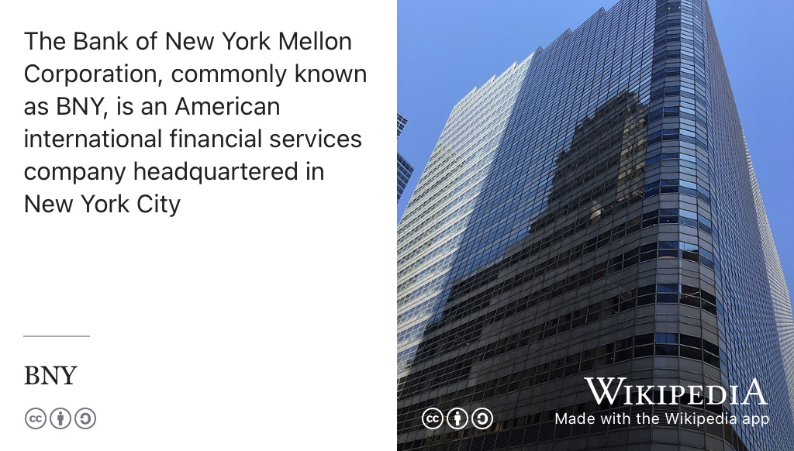

# Opportunities with BNY {#bny}

Graduating this year? Our friends at [BNY.com](https://www.bny.com) in Manchester are recruiting Data Scientists with expertise in Machine Learning, Feature Engineering and Advanced Analytics. If you have expertise in Software Engienering, Mathematics and Distributed computing, read on.

```{r bny-fig, echo = FALSE, fig.align = "center", out.width = "100%", fig.cap = "(ref:captionbny)"}

```

(ref:captionbny) BNY is an American international financial services company headquartered in New York City. Founded in 1784 by a group that included Alexander Hamilton, BNY is one of the three oldest banks in the United States. CC licensed image of BNY offices from [en.wikipedia.org/wiki/BNY](https://en.wikipedia.org/wiki/BNY)


## 2025 BNY Analyst Program – Engineering (Data Science) 
 
At BNY, our culture empowers you to grow and succeed. As a leading global financial services company at the center of the world's financial system we touch nearly 20% of the world's investible assets. Every day around the globe, our 50,000+ employees bring the power of their perspective to the table to create solutions with our clients that benefit businesses, communities and people everywhere. 

We continue to be a leader in the industry, awarded as a top home for innovators and for creating an inclusive workplace. Through our unique ideas and talents, together we help make money work for the world. This is what #LifeAtBNY is all about.
 
**We welcome you to apply**! When applying to this general program posting, our expert BNY Talent Acquisition Team may also review your resume for consideration across other open early career roles within the company. We're seeking future team members for our Engineering (data science) team with roles located in Manchester in hybrid positions.

## BNY Analyst Program {#analyst}
Our 24-month analyst program is a holistic talent development journey offering rotational experiences designed to prepare you for your future career. Through projects across the specific line of business, you will receive a panoramic view of BNY's entire global franchise, providing rare insight into the operation of one of the world's largest banks. In each of these roles, you will work on high-priority initiatives and develop a comprehensive set of analytical and interpersonal skills. As part of a highly selective program, you will gain unparalleled exposure to the senior leadership of BNY and its clients, while receiving personalized guidance and support from a peer mentor. Upon successful completion of the program, you will be considered for high impact roles in multiple functions.
 
## Engineering  Data Science {#eds}

* Apply scientific methods to find solutions to real business problems.
* Perform data analysis, feature engineering, and advanced methods to prepare and develop decisions based on data. 
* Data mining using state-of-the-art methods 
* Provide insight into observed business outcomes through analytics. 
* Perform data profiling to identify and understand anomalies in data. 
* Automate data analysis and streamline analytical processes 
* Provide recommendations based on data trends uncovered when possible 
* Stays abreast of organization and management changes and has in-depth knowledge of company practices relevant to data science products. 
* Grow and develop skills across the 3 domain specialties: Machine Learning, Feature Engineering and Advanced Analytics capabilities. Stressing expertise in the core functional areas: Computer Programming, Math & Analytic Methodology, Distributed computing, and communications of complex results. 
 
## Program Eligibility {#eligibility}

Eligbility criteria include:
 
* Enrollment in a  undergraduate degree program with a strong focus on computer science or technology-related majors preferred
* Individuals who will be graduating in December 2024 through June 2025
* Minimum cumulative 2.1 or better
* Well-rounded experience including demonstrated leadership skills
* Excellent written and oral communication skills
* Not require sponsorship for employment visa status (now or in the future) in the region where they apply.


At BNY, our culture speaks for itself. Here's a few of our awards:
 
* America's Most Innovative Companies, Fortune, 2024
* World's Most Admired Companies, Fortune 2024
* Human Rights Campaign Foundation, Corporate Equality Index, 100% score, 2023-2024
* Best Places to Work for Disability Inclusion, Disability: IN – 100% score, 2023-2024 
* “Most Just Companies”, Just Capital and CNBC, 2024
* Dow Jones Sustainability Indices, Top performing company for Sustainability, 2024
* Bloomberg's Gender Equality Index (GEI), 2023
 
 
## Our Benefits and Rewards {#benefits}
 
BNY offers highly competitive compensation, benefits, and wellbeing programs rooted in a strong culture of excellence and our pay-for-performance philosophy. We provide access to flexible global resources and tools for your life's journey. Focus on your health, foster your personal resilience, and reach your financial goals as a valued member of our team, along with generous paid leaves, including paid volunteer time, that can support you and your family through moments that matter. 

BNY is an Equal Employment Opportunity/Affirmative Action Employer - Underrepresented racial and ethnic groups/Females/Individuals with Disabilities/Protected Veterans. 


## Interested? {#sarah}

Interested, email your CV and covering letter to senior recruiter Sarah Raza in Manchester: [linkedin.com/in/sarahraza123](https://www.linkedin.com/in/sarahraza123/), email `firstname.lastname@bny.com`