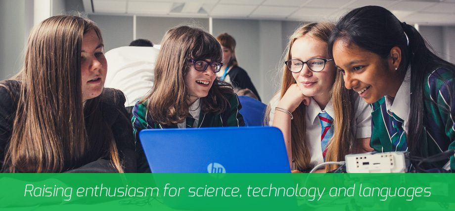

# Opportunities with young people {#mcs}

Working with young people is enjoyable and rewarding. It will also build your communication and leadership skills. MCS Projects have paid opportunities for University students to engage with young people in schools during summer 2026.


```{r mcs-fig, echo = FALSE, fig.align = "center", out.width = "100%", fig.cap = "(ref:captionmcs)"}

```

(ref:captionmcs) MCS Projects Ltd raises the aspirations of young people through their involvement in events which enrich their knowledge of science, technology and languages. Find out more at [mcsprojectsltd.co.uk](https://mcsprojectsltd.co.uk)


Would you like to teach 12-14 year olds that that are interested in Science and Technology during June and July of 2026? MCS Projects are looking for students to assist leading activities and answering questions about University. Each day is a regional competition designed to raise enthusiasm for [Science, Technology, Engineering, and Mathematics](https://en.wikipedia.org/wiki/Science%2C_technology%2C_engineering%2C_and_mathematics) (STEM) subjects and encourage more young people to consider a career in them. Events run from 8.30-3.30. A wide range of activities are on offer including:

* Electronic Facial Identification Technique (E-FIT) forensics
* LEGO robotics
* Medical diagnostics 
* Electric cars 
 
Events take place across the UK and successful applicants would be added to a mailing list to sign up to local events that they are available for. The pay is £91 plus travel expenses per event. A training session would be provided beforehand.
 
To apply send a CV to john.waterworth@mcsprojectsltd.co.uk at by Thursday 30th April.