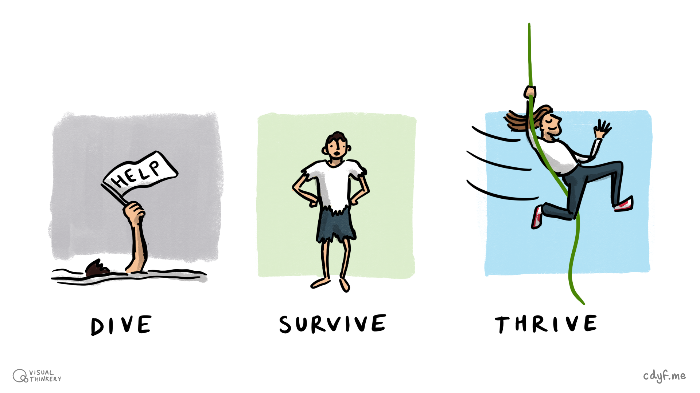
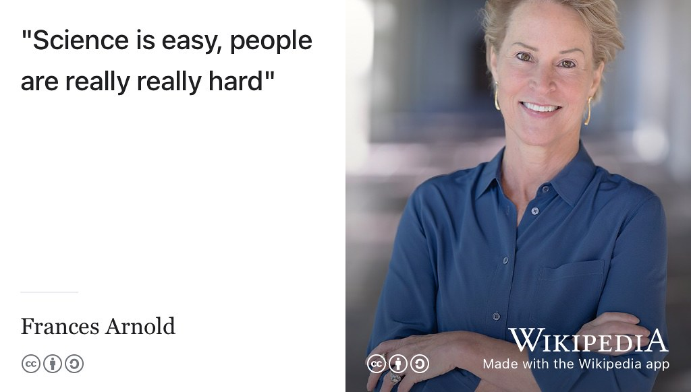

# (PART) DEPLOYING YOUR FUTURE {-}  

# Starting Your Future {#starting}

Congratulations, you've just accepted an offer of employment. You nailed that interview (or interviews) and accepted they job offer that followed. Now you're embarking on the exciting journey from the world of study to the jungle of employment. This *might* be your first SERIOUS job, so what do you have to do to start to survive becoming a professional? What survival skills will you need, see figure \@ref(fig:survival-fig). Even better, how can you thrive in your new role and take on the challenges that are coming your way? How will you avoid *diving*, ensuring you *survive* and hopefully *thrive* in your new environment? 💪

```{r survival-fig, echo = FALSE, fig.align = "center", out.width = "100%", fig.cap = "(ref:captionsurvival)"}

```
(ref:captionsurvival) Will you dive, survive or thrive in your new working environment? The world of employment can be a bit of a jungle where you struggle for existence. What survival skills will you need to avoid diving (left) and how can you move beyond merely surviving (middle) towards positively thriving as a professional (right)? Jungle survival sketch by [Visual Thinkery](https://visualthinkery.com) is licensed under [CC-BY-ND](https://creativecommons.org/licenses/by-nd/4.0/)

Your future is bright, your future needs starting, so let's start your future.

<!--More on communication needed feedback from norway

Another big difference is that in employment everyone starts from scratch all the time, in my experience. In university starting from scratch / being 'behind' is a common insecurity, which made it difficult for me to ask for help when I needed it. It took a while to learn that at work you succeed and fail as a team, not an individual, and there is nothing wrong with not understanding and asking for help.

In short, I agree with you that a lot of "survive, thrive or die" lies in your relationship with your manager and team. Hence I wish you wrote more about this than a tweet from 'Help! I have a manager!'. It is very good, but I didn't think to spend the $10 for it when I needed it the most. Especially when a lot of the "Stay in school" section could be repeated in "Achieving your future".-->

<!--Different ways for success
The example for thriving purely mentions promotion as a good. I think it could be valuable to underline that good communication and self-reflection could lead to not any promotion, but promotion to a fulfilling role!

I think the chapter outlines some of the broader challenges going from uni to employment.  Where I feel the chapter lacks is in fully diving into the best ways to avoid "diving" and maybe even getting to "thrive". A lot of the chapter is spent on furthering your career and self-development, which presumes "surviving" with capacity for more or "thriving".-->

## What you will learn {#ilo10}

<!--If you want to get ahead get a hat-->
At the end of this chapter you will be able to

1. Manage your manager so that you can:
    + Survive the workplace
    + Thrive in the workplace
    + Avoid diving in a workplace environment
1. Collect evidence of new workplace skills and knowledge that you develop <!--WWW-->
1. Reflect on new workplace skills and knowledge that have developed now ... 
    + ... and in the future

<!--Unconcious mistakes people make that sabotage their careers [@nicegirls]

help I have manager [@helpihaveamanager]

saying yes, saying no [@cleancoder]

be yourself at work [@batmaneffect]-->

## Survive, thrive or dive? {#scenarios}
Starting a new job is a bit like starting a new relationship, except that it is professional rather than romantic one. You've searched for and found a partner. If this had happened on Tinder, your employer “swiped right” on your profile because they liked the look of you. You've both been through the courtship of recruitment.  Your courting may have been quick or you may have had many rounds of first and second “dates”, known as interviews. Now that your are starting contractual employment, you are both committed to each other in a serious relationship. Simply put, there are three scenarios for you as a new employee:

1. You'll survive
1. You'll thrive 
1. You'll dive

### Survive {#survive}
Your new job will go OK, you'll meet the expectations of your employer and become and valued employee. If your employer has a probationary period, you'll pass your probationary review without any problems. Most employees probably fit in to this category. 🆗

### Thrive  {#thrive}
Your new job will go brilliantly, you'll exceed the expectations of your employer. If you're on a fixed term contract, such as a summer internship or year long placement, they'll make you a job offer during or soon after your contract of employment expires. If you're on a more permanent contract, such as a graduate job or graduate scheme you'll be promoted, given a pay rise and more responsibility. 💪

You're doing really well if you can impress your manager. Some lucky people make it into this category.

### Dive {#dive}

Your new job will go badly, you will struggle to fit in and won't meet the expectations of your employer. Once you were like [star-crossed lovers](https://en.wikipedia.org/wiki/Star-crossed), (see figure \@ref(fig:romeo-fig)) but the relationship has turned sour and could take a disastrous dive into [tragedy](https://en.wikipedia.org/wiki/Tragedy). [@romeo; @goblewroe]

```{r romeo-fig, echo = FALSE, fig.align = "center", out.width = "100%", fig.cap = "(ref:captionromeo)"}

```

(ref:captionromeo) Your relationship with your employer is obviously a professional one rather than a romantic one, but that doesn't mean it can't end in tragedy like Shakespeare's [star-crossed](https://en.wikipedia.org/wiki/Star-crossed) lovers in *Romeo and Juliet*. [@romeo] What can you do to keep your relationship with your employer healthy and happy? Public domain image of a painting of Romeo and Juliet by Frank Dicksee via Wikimedia Commons [w.wiki/3DfJ](https://w.wiki/3DfJ) adapted using the [Wikipedia app](https://apps.apple.com/gb/app/wikipedia/id324715238)

There are several relationship problems that could lead to you breaking up with (or being dumped by) your newly estranged “lover”. 💔

* **Relationship problems**: Your relationship with your manager(s) is not going well. You've tried solving problems informally by talking to your manager but you’re not satisfied with the response and want to [raise a formal grievance complaint in writing](https://www.gov.uk/raise-grievance-at-work). [@grievance]
* **It's not you, it's me**: You might ultimately decide to you want to [hand in your notice](https://www.gov.uk/handing-in-your-notice) to terminate your contract of employment and leave. [@iquit]
* **It's not me, it's you**: If things get really bad, your employer may [take disciplinary action against you](https://www.gov.uk/disciplinary-procedures-and-action-at-work) [@dive] and in the worst case scenario, you'll be [fired (dismissed)](https://www.gov.uk/dismissal). [@yourefired]
* **Becoming unhappier**: You were looking for a job and now you've found a job. [Heaven knows you're miserable now](https://en.wikipedia.org/wiki/Heaven_Knows_I%27m_Miserable_Now). [@miserablenow] Perhaps you're not being challenged enough or given too much work that you're not interested in? Perhaps the honeymoon period is over, you've experienced [hedonic adaptation](https://en.wikipedia.org/wiki/Hedonic_treadmill) and start to get disillusioned? [@lauriesantos]

In the UK, dismissal is rare, but it **does** happen, even to interns and placement students. In this scenario in the UK, the employer has a duty to do everything they reasonably can to prevent this from happening. It's not in your employers interests to fire you because they've invested a lot of time and money in you by this point. If they have sensible recruitment procedures, those procedures will root out unsuitable candidates long before they make it to the workplace where they can cause real and lasting damage to the organisation once in post.

All employers have procedures for making sure that you can agree on work that suits both of your needs. Better employers will have better procedures to ensure this happens. Employers don't want their employees to "dive" and will try prevent this from happening wherever possible. So, speak to your manager(s) and keep the communication channels open. Talking of managers ...

## Managing your manager {#manager}
Building a good relationship with your manager(s) will be key to determining which of the *dive, survive or thrive* scenarios above plays out. At University, you didn't have a manager. Yes you had deadlines, but you didn't have a boss. That changes when you're an employee so it's in your interests to understand what your boss expects of you.

Software engineer Julia Evans has authored a series of programming [zines](https://en.wikipedia.org/wiki/Zine), there's one called [HELP! I have manager!](https://wizardzines.com/zines/manager/) [@helpihaveamanager] you might find useful. It will help you understand your managers job better so that you can work together more effectively. It will help you survive and thrive, not dive because it covers:

* understanding your manager's job
* setting clear expectations
* talking about problems early
* reviewing performance and getting promoted
* asking for specific feedback


<!--https://twitter.com/b0rk/status/1043277965394681856-->

The zine has the benefit of being aimed at engineers just like you. Thoroughly recommended! You might also enjoy Julia's other more technical zines such as:

* [HTTP: learn your browser's language](https://wizardzines.com/zines/http/) [@browserslanguage]
* [Oh Shit, Git!](https://wizardzines.com/zines/oh-shit-git/) [@ohshitgit]
* [How Git Works](https://wizardzines.com/zines/git/) [@howgitworks]
* [Hell YES! CSS](https://wizardzines.com/zines/css/) [@hellyescss]
* [How DNS works](https://wizardzines.com/zines/dns/) [@howdnsworks]
* [How containers work](https://wizardzines.com/zines/containers/) [@howcontainerswork]
* [The pocket guide to debugging](https://wizardzines.com/zines/debugging-guide/) [@pocketdebugging]

## Stay in school {#neverstoplearning}
As you develop new skills and knowledge at work, it is a good idea to collect evidence of what you've done. Whatever your career path, you'll need to keep your CV updated. One way to think of the evidence is as *badges*, digital or otherwise. Your employer may already have training schemes that recognise and reward your accomplishments.  These badges may be generic or specific to the particular sector you are working in. See chapter \@ref(achieving) on *Achieving your future* for more details.

### Technical badges {#techie}
Some examples of technical badges include:

* Microsoft Certifications [docs.microsoft.com/en-us/learn/certifications](https://docs.microsoft.com/en-us/learn/certifications/)
* Amazon Web Services Certification [aws.amazon.com/certification](https://aws.amazon.com/certification/)
* Google Cloud Certification [cloud.google.com/certification](https://cloud.google.com/certification)

Just three examples, there are many others covering both technical and non-technical skills. In many cases, your employer will encourage and possibly pay for you to get these certifications.

### Non-technical badges {#techieplusplus}
You are more than just a techie, so make sure you develop your non-technical skills as well. We introduced softer skills in chapter \@ref(writing), but there's plenty of other skills to think about:

* Building resilience
* Negotiating and managing conflict
* Leadership, influence and change
* Having difficult conversations
* Emotional intelligence
* Public speaking
* Active listening

### Lifelong learning {#mooc}
There are many platforms for building your skills and knowledge during and after your formal education, some examples include:

1. [coursera.org](https://www.coursera.org)
1. [edx.org](https://www.edx.org)
1. [egghead.io](https://egghead.io)
1. [etonx.com](https://etonx.com) like the [famous college](https://en.wikipedia.org/wiki/Eton_College) it comes from, EtonX courses are not cheap but there's some good stuff here that's aimed at young people like you
1. [futurelearn.com](https://www.futurelearn.com)
1. [khanacademy.org](https://www.khanacademy.org)
1. [linkedin.com/learning](https://www.linkedin.com/learning)
1. [open.edu/openlearn](https://www.open.edu/openlearn)
1. [pluralsight.com](https://www.pluralsight.com)
1. [skillshare.com](https://www.skillshare.com)
1. [udemy.com](https://www.udemy.com)
1. [youtube.com](https://www.youtube.com) etc

The choice of lifelong learning can be bewildering. Some platforms provide free resources, others do not, but your employer may already pay for some services making them free to you while you are an employee. If that's the case, make good use of the services while you can. There's a [useful comparison of four different online learning platforms here](https://www.businessinsider.com/online-learning-platform-comparison-udemy-skillshare-lynda-coursera). [@udemy]

### Other training courses {#othertrain}
Your employer may provide other courses you can go on. Again, you should make the most of these if and when they are available.

Whatever job you're doing, stay in school. Take advantage of any training on offer or go and find courses that help you develop professionally and personally. Remember that **you** are the person who cares most about your career, see section \@ref(responsibility).

## Breakpoints {#visits}
(ref:breakpoint)

```md
* PAUSE ⏸️
```

Besides collecting evidence and managing your manager, you need to manage yourself too. A proven way to do this is to periodically reflect on your work. Your employer may have procedures to help you do this, such as performance reviews or one-to-ones with your manager on a regular basis. Whatever the setup, you will benefit from taking time to reflect on:
<!--During your placement you will be visited by an academic member of staff who will meet with you and your manager at the same time. If you want to meet with your academic tutor without your manager being around, please let your tutor know] The visit is a good opportunity to reflect on what progress you have made during the year alongside areas you need to improve. You will probably already have had similar meetings with your manager or managers, for examples as part of your personal development review (or whatever your employer calls performance reviews). There are three basic questions your tutor will ask you:-->


1. What have you been doing?
1. WWW: What Went Well?
1. EBI: Even Better If?


### What have you been doing?
Briefly describe your roles and responsibilities. What projects have you worked on? What were the main technologies that you used? As well as describing this to colleagues, you should aim to communicate this with non-specialists, people outside your field. How would you describe your job to your friends and family and terms they would understand?

### WWW: What went well?
Are there any projects you are particularly proud of? What new knowledge or skills have you learned or improved? Remember to include both non-technical as well as technical aspects of your job. Non-technical skills include organisation, time-management, confidence, communication etc. What did you *think* about these achievements and how do they make you *feel*? What have you learned?

### EBI: Even Better If?
What areas have you identified for improvement in the future? Again, this includes non-technical as well as technical skills. What do you *think* about these improvements and how do they make you *feel*? What have you learned and what will you do differently in the future?

### Your managers view
If you asked your manager the same questions, would they come up with the same answers? Are there any differences between your view and your managers view of your work? If so, why do they differ?

```md
* RESUME ▶️
```


## Reflecting your future {#reflecting}
The `WWW`/`EBI` activity in the breakpoint above is an example of reflective writing. You may have come across this already, but developing the ability to reflect is a key skill in:

* learning how to learn
* learning how to think more critically

The video in figure \@ref(fig:reflecting-vid) summarises what reflection is and why its important to your future.

```{r reflecting-vid, echo = FALSE, fig.align = "center", out.width = "99%", fig.cap = "(ref:captionreflecting)"}
knitr::include_url('https://www.youtube.com/embed/QoI67VeE3ds')
```

(ref:captionreflecting) Reflective writing puts into writing your reflective thinking in a three stage process: 1) looking back 2) analysing 3) projecting into the future. This video explains why reflection is an important *critical thinking* skill that will help you progress in the future. You can also watch the 6 minute video embedded in this figure at [youtu.be/BYUy1yvjHxE](https://youtu.be/BYUy1yvjHxE). [@youtube-reflective]

<!--
### Placement report
Both your tutor and you need to fill in the placement report, no more than two pages. See the [industrial placement report template on overleaf](https://www.overleaf.com/latex/templates/industrial-placement-report/vcjymrgmcpzh)-->

<!-- the marriage relationship analogy-->


<!--## Badges
Professional qualifications, such as [Microsoft certifications(https://docs.microsoft.com/en-us/learn/certifications/). Your employer will often pay for these. Then there are the MOOCs, these are great for plugging . Which courses are worth doing will depend on the particular sector you are working in.-->

<!--## Administrivia
https://www.gov.uk/income-tax

https://www.gov.uk/national-insurance


working in your final year, see self employment-->


<!--

>“You will move in the direction of the people that you associate with. So it’s
> important to associate with people that are better than yourself. The friends you have > will form you as you go through life. Make some good friends, keep them for the rest
> of your life, but have them be people that you admire as well as like.” Warren Buffet https://www.gatesnotes.com/About-Bill-Gates/Happy-90th-Warren -->


## Summarising Your Future {#tldr10}
(ref:tldr)

Your future is bright, your future needs starting. Starting your future is the first step of deploying your future. Deploying your future is coding your future.

Making the transition from education to employment can be a big and daunting change. To make the change as smooth as possible, you may need to readjust your expectations because being a student is very different to being an employee. Some key differences include:

* You have a manager when you are an employee, who you need to maintain a good working relationship with
* Your performance is much more dependent on other people (your colleagues), unlike in education where you can often work more independently (e.g. when completing coursework or revising for an exam)
* You get paid, which hopefully makes it all worthwhile!

Some of the keys to *surviving your future* are therefore:

* Communicating early and often with your manager(s) about any issues you have in the workplace, see section \@ref(manager)
* Regularly reflecting on your progress, with and without your manager, see section \@ref(reflecting)
* Understanding that working with people is challenging for everyone (and enjoyable for many), see figure \@ref(fig:frances-fig)
* Staying in school. Despite leaving formal education, you should never stop learning, see section \@ref(neverstoplearning)

```{r frances-fig, echo = FALSE, fig.align = "center", out.width = "100%", fig.cap = "(ref:captionfrances)"}

```
(ref:captionfrances) Compared to Science, people can be really *really* hard work! [@francesarnold] Compared to technology, engineering and mathematics, people can be really hard work too. Collaborating closely with people (your colleagues) is a key difference between your `education` and `employment`. Thankfully, people can also make your employment more enjoyable and rewarding than academic study, provided you pick your colleagues carefully, see section \@ref(by-values). CC [BY-SA](https://creativecommons.org/licenses/by-sa/4.0/deed.en) portrait of Nobel laureate [Frances Arnold](https://en.wikipedia.org/wiki/Frances_Arnold) in 2021 at Caltech by Christopher Michel via Wikimedia Commons [w.wiki/6V5K](https://w.wiki/6V5K) adapted using the [Wikipedia app](https://apps.apple.com/gb/app/wikipedia/id324715238)


In the next part, chapter \@ref(achieving): *Achieving your Future* we'll look at evidence you can collect that you've not merely survived, but thrived in your new job and that this stage is just the start of your promising career.