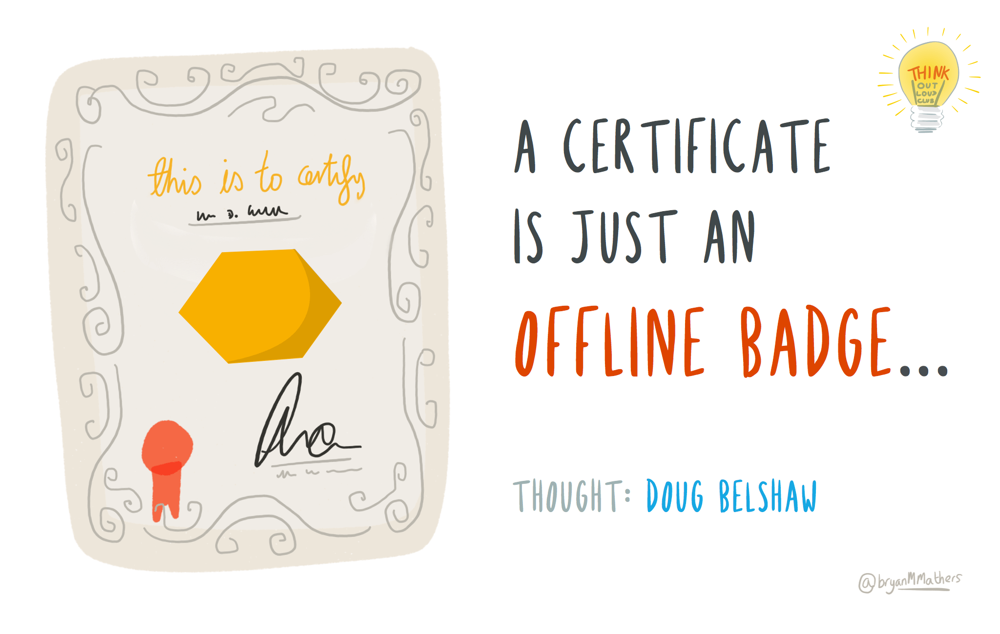
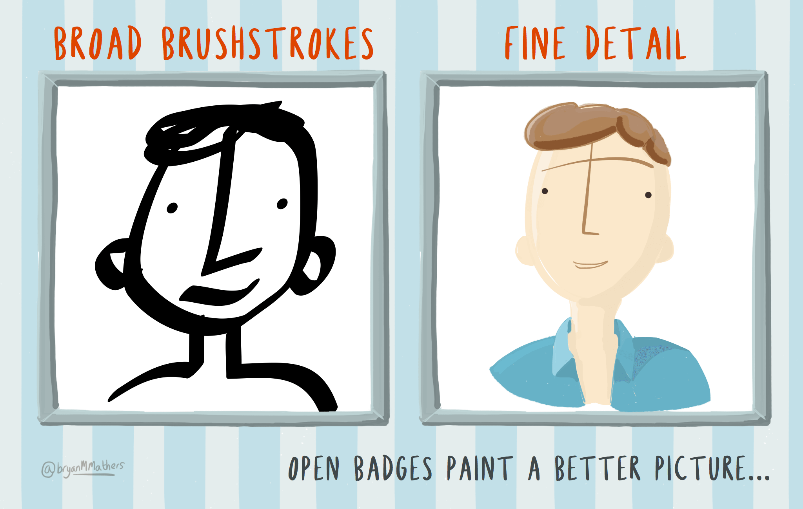
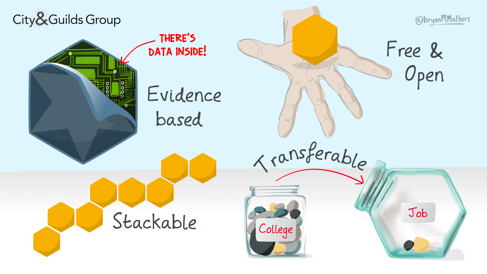
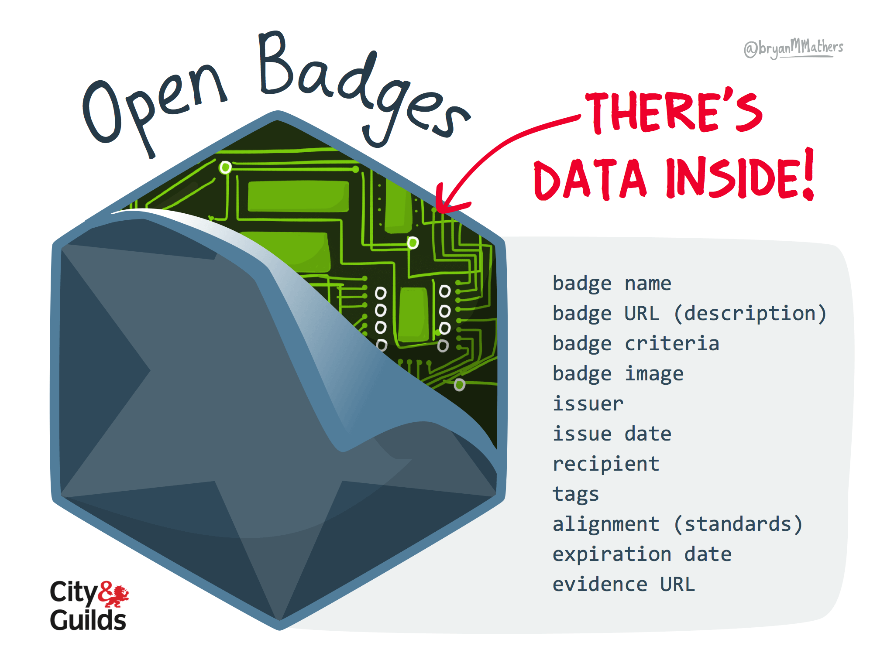
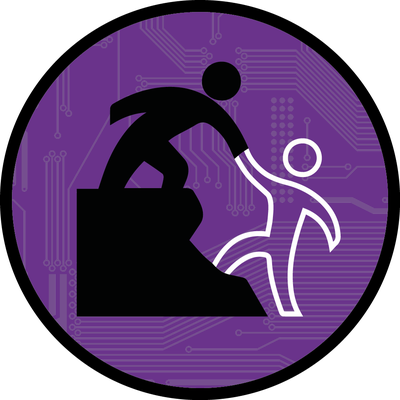
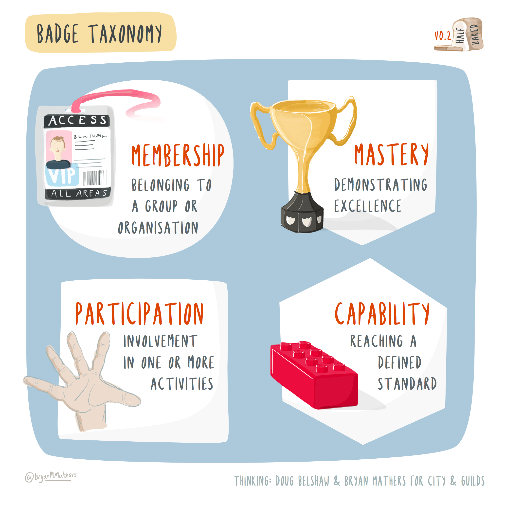
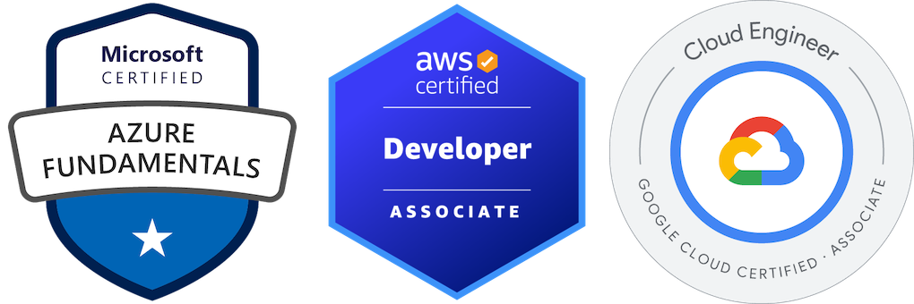
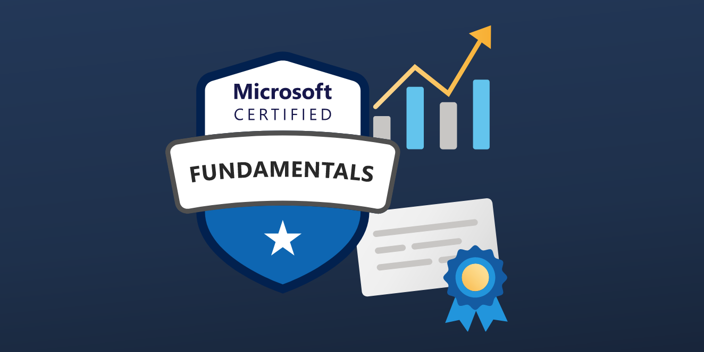
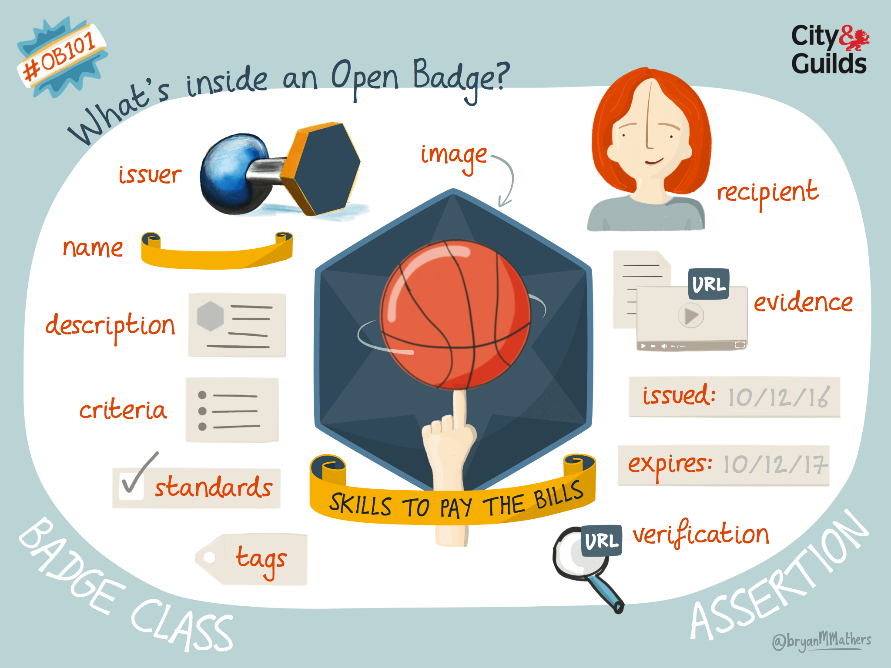

# Achieving your future {#achieving}

We are all in a lifelong learning loop. As we iterate around the [while loop](https://en.wikipedia.org/wiki/While_loop) of life, we continually gain more experience, develop new skills and knowledge. As you loop your own personal loop, you will also collect evidence of your personal and professional achievements. Some of these achievements can be certified or “badged” in various ways. This evidence can be collected as part of your professional identity and reputation, that's the jar called `ME` shown in figure \@ref(fig:while-learning-fig).

```{r while-learning-fig, echo = FALSE, fig.align = "center", out.width = "100%", fig.cap = "(ref:captionunibadges)"}
knitr::include_graphics("images/earning-a-badge-hd.png")
```
(ref:captionunibadges) Learning is a lifelong loop where you constantly acquire knowledge and skills. You can collect evidence of your development, some of which can be certified or badged during University and throughout your professional career.  [Computing Badges](https://bryanmmathers.com/computing-badges/) by [Visual Thinkery](https://visualthinkery.com/) is licenced under [CC-BY-ND](https://creativecommons.org/licenses/by-nd/4.0/)

Evidence is a key part of the “Context, Action, Result and Evidence” (`C.A.R.E.`) stories described in section \@ref(care). So what evidence can you collect and how you can certify or badge these achievements, sometimes known as micro-credentials [@microc; @sigman39] or digital credentials [@digitalcredentials]? 📛 

Your future is bright, your future needs achieving, so let's start achieving your future.

## What you will learn {#ilob}
After reading this chapter you will be able to:

1. Describe some the evidence and micro-credentials you can collect and badge to show your achievements:
    + during University
    + after University and throughout your professional career
1. Identify any gaps in your personal and professional achievements
1. Plan activities and set goals for future achievements that will help you to continue grow professionally and personally

## Academic badges {#academentia}
One kind of badge you get when you finish University is your degree certificate like the one shown in figure \@ref(fig:degree-cert-fig). A degree certificate is an important offline physical (paper) badge that marks a milestone in your career. If you like gaming, its a huge `achievement unlocked` that will take you to the next level. Your certificate also tells people that you were a member of a particular University community and that you mastered your chosen discipline to some level, Bachelors, Masters or PhD.

```{r degree-cert-fig, echo = FALSE, fig.align = "center", out.width = "100%", fig.cap = "(ref:captiondegreecert)"}

```
(ref:captiondegreecert) Level up, achievement unlocked! A degree certificate is a milestone that provides evidence of your academic knowledge and skills gained while at University. [A certificate is just an offline badge](https://bryanmmathers.com/a-certificate-is-just-an-offline-badge/) by [Visual Thinkery](https://visualthinkery.com/) is licensed under [CC-BY-ND](https://creativecommons.org/licenses/by-nd/4.0/) via [Doug Belshaw](https://dougbelshaw.com/)

Degree certificates are an important badge, but they don't give very many details of your professional and personal story while at University. You could give more details by providing:

* your overall degree classification: first, second, third etc
* your individual module grades, for example in an academic transcript or by listing them on your CV, see section \@ref(education)
* your projects, see section \@ref(projects)
* your portfolio of work, if you have one

This data give a *bit* more detail that a degree certificate does not but it is limited to purely academic achievements. You are *much* more than your grades, because there's a lot about your character that is difficult or impossible to measure, see figure \@ref(fig:more-than-grades-fig).

```{r more-than-grades-fig, echo = FALSE, fig.align = "center", out.width = "100%", fig.cap = "(ref:captionmoregrades)"}
knitr::include_graphics("images/i-am-more-than-just-my-grades.png")
```

(ref:captionmoregrades) Your grades give more detail than a degree certificate but they still don't say much about you. [I am more than just my grades](https://bryanmmathers.com/i-am-more-than-just-my-grades/) sketch by [Visual Thinkery](https://visualthinkery.com/) is licensed under [CC-BY-ND](https://creativecommons.org/licenses/by-nd/4.0/)

Employers will often want to see more detailed evidence of your character and your softer skills than those provided by degree certificates and grades. While academic achievements paint some broad brushstrokes of your professional identity shown in figure \@ref(fig:fine-grained-fig), they don't help employers see the finer details or much of the evidence.

```{r fine-grained-fig, echo = FALSE, fig.align = "center", out.width = "100%", fig.cap = "(ref:captionfinegrain)"}

```
(ref:captionfinegrain) What kind of picture would you like to paint of your professional identity? [Open Badges paint a better picture…](https://bryanmmathers.com/open-badges-paint-a-better-picture/)  by [Visual Thinkery](https://visualthinkery.com/) is licenced under [CC-BY-ND](https://creativecommons.org/licenses/by-nd/4.0/)


## Open Digital badges {#digibadge}
Digital badges provide a solution to this problem, just like your degree certificate is a verified badge of your achievements, a digital badge does the same but in a digital way. Rather than being physical, a digital badge is virtual and transferable. It's just a `*.png` graphic file which has been digitally signed and contains metadata. This means it can be displayed on your CV, on social media such as LinkedIn or “stacked” into a digital portfolio collection as shown in figure \@ref(fig:badge-properties-fig).

The [Mozilla Foundation](https://en.wikipedia.org/wiki/Mozilla_Foundation) have defined an open standard for digital badges [@openbadges] so that badges can be issued, hosted and certified by different organisations. [@belshaw]

```{r badge-properties-fig, echo = FALSE, fig.align = "center", out.width = "100%", fig.cap = "(ref:captionbadgeproperties)"}

```
(ref:captionbadgeproperties) Digital badges have certified evidence inside, can be transferred between education and employment and can be stacked into collections or portfolios.  [Properties of Open Badges](https://bryanmmathers.com/properties-open-badges/) by [Visual Thinkery](https://visualthinkery.com/) is licenced under [CC-BY-ND](https://creativecommons.org/licenses/by-nd/4.0/) for the [City and Guilds of London Institute](https://en.wikipedia.org/wiki/City_and_Guilds_of_London_Institute)


A digital badge has certified data locked inside (shown in figure \@ref(fig:data-inside-fig))  which details the achievement it has been awarded for including:

* `recipient` that's you!
* `issuer` the organisation awarding the badge, e.g. [Poppleton University](https://twitter.com/PoppletonUni)
* `badge name` e.g. PASS leader badge (see figure \@ref(fig:pass-leader-fig))
* `badge image` e.g. a digital logo
* `evidence URL` a link to evidence
<!--* `badge URL` a link to the badge e.g. https://badges.cs.manchester.ac.uk/media/uploads/badges/595f24cbab4bd9507882e88f535c4e76.png-->

All this information is coded so that only the recipient and issuer can manipulate it, for example by associating an email address with it.


```{r data-inside-fig, echo = FALSE, fig.align = "center", out.width = "100%", fig.cap = "(ref:captiondatainside)"}

```
(ref:captiondatainside) Open digital badges have data, like the `issuer` and `recipient`, locked inside them so they can be verified. [There's data inside open badges](https://bryanmmathers.com/open-badges-data-inside/) by [Visual Thinkery](https://visualthinkery.com/) is licenced under [CC-BY-ND](https://creativecommons.org/licenses/by-nd/4.0/) for the [City and Guilds of London Institute](https://en.wikipedia.org/wiki/City_and_Guilds_of_London_Institute)

Anyone such as your University or employer can issue badges, so for example, the University of Manchester issues badges for leaders of its Peer Assisted Study Scheme (PASS) [www.peersupport.manchester.ac.uk](http://www.peersupport.manchester.ac.uk/). An example of a PASS leader badge is shown in figure \@ref(fig:pass-leader-fig).

```{r pass-leader-fig, echo = FALSE, fig.align = "center", out.width = "80%", fig.cap = "(ref:captionpassleader)"}

```
(ref:captionpassleader) An example of a digital badge awarded to [Peer Assisted Study Scheme (PASS)](http://www.peersupport.manchester.ac.uk/) leaders at the University of Manchester who have mentored and helped others students during their academic study. If you're a University of Manchester student, you can see other badges available at [wiki.cs.manchester.ac.uk/index.php/Badges](https://wiki.cs.manchester.ac.uk/index.php/Badges) (UoM login required)

Badges can be used for a wide range of different kinds of achievements shown in figure \@ref(fig:badgetype-fig).

1. **Membership** being a member of an organisation or group
1. **Participation** participating in communities
1. **Capability** demonstrating capability with some skill
1. **Mastery** mastering a set of skills


```{r badgetype-fig, echo = FALSE, fig.align = "center", out.width = "99%", fig.cap = "(ref:captionbadgetype)"}

```
(ref:captionbadgetype) There are many different achievements which badges can be awarded for including membership, participation, capability and mastery. [Badge taxonomy](https://bryanmmathers.com/badge-taxonomy-v0-2/) by [Visual Thinkery](https://visualthinkery.com/) is licensed under [CC-BY-ND](https://creativecommons.org/licenses/by-nd/4.0/)


## Commercial digital badges {#otherbadges}
There are other digital badges for evidencing your achievements besides the open ones described above. Like open badges, they also provide certifiable evidence of professional and personal achievements, see figure \@ref(fig:cloud-badges-fig):

* Certificates from service providers and organisations like Amazon Web Services, Microsoft and Google, see figure \@ref(fig:cloud-badges-fig) and e.g. [redhat.com/en/services/certifications](https://www.redhat.com/en/services/certifications) etc
* Certificates from Massive Open Online Courses ([MOOCs](https://en.wikipedia.org/wiki/Massive_open_online_course)) like edX and Coursera: 
    + [cs50.harvard.edu/x/2020/certificate](https://cs50.harvard.edu/x/2020/certificate/) if you've not heard of CS50, see section \@ref(creative)
    + [coursera.org/professional-certificates](https://www.coursera.org/professional-certificates)

```{r cloud-badges-fig, echo = FALSE, fig.align = "center", out.width = "100%", fig.cap = "(ref:captioncloudbadge)"}

```

(ref:captioncloudbadge) Three examples of commercial digital badges from providers of cloud services from left to right: **(1)** Microsoft fundmentals see section \@ref(microsoft) [@msfundamentals] **(2)** [Amazon Web Services](https://en.wikipedia.org/wiki/Amazon_Web_Services) badge awarded by [credly.com](https://info.credly.com/) for an [AWS certified developer](https://www.credly.com/org/amazon-web-services/badge/aws-certified-developer-associate) [@awscert] and **(3)** Google Cloud Platform (GCP) [@gcp1] Each provider offers accreditation for pre-professionals tailored towards technical students. For Microsoft, they are called `fundamentals`, [@msfundamentals] for Amazon they are typically called `foundational` or `associate` qualifications and for Google they are usually called `associate` qualifications. [@gcp2] Your University^[University of Manchester students see section \@ref(microsoft)] and/or employer may provide support for you to achieve these certifications during your academic study, internship, placement or as a recent graduate. The exams typically cost around $100 each to take and around 20 hours of online study time.

### Microsoft Fundamentals Digital Badges {#microsoft}
The Department of Computer Science are working with the [Flexible Learning Programme](https://www.manchester.ac.uk/discover/teaching-and-learning-excellence/flexible-learning/) to pilot the introduction of Microsoft Fundamentals Certifications (MFC) for University of Manchester students. [@georgepettifer] This means you can get Microsoft certified on [Azure](https://en.wikipedia.org/wiki/Microsoft_Azure), AI, Data, Security, [CRM](https://en.wikipedia.org/wiki/Customer_relationship_management), [ERP](https://en.wikipedia.org/wiki/Enterprise_resource_planning) & [365](https://en.wikipedia.org/wiki/Microsoft_365) this summer.

```{r ms-fun-fig, echo = FALSE, fig.align = "center", out.width = "100%", fig.cap = "(ref:captionmsfun)"}

```

(ref:captionmsfun) Get hired, stay ahead, be productive and receive the recognition you deserve with Microsoft Certified: Fundamentals. These highly marketable, industry-respected certifications offer training and exams that validate your existing knowledge. Screenshot from `learn.microsoft.com`. [@msfundamentals] 📈


These certifications will enhance your CV and LinkedIn profile (see chapter \@ref(debugging)) with signed digital badges, like the ones shown in figures \@ref(fig:cloud-badges-fig) and \@ref(fig:ms-fun-fig). Gaining these certifications typically involves about ~20 hours of online study and **normally costs $99 each**, but we are offering them free to University of Manchester students as part of a pilot project. Get hired, stay ahead, be productive, and receive the recognition you deserve with Microsoft Certified: Fundamentals. These highly marketable, industry-respected certifications offer foundational training and exams that provide a practical, high-level overview of Microsoft technology and validate your existing knowledge. The University is currently offering eight different certifications for you to choose from:

1. Microsoft Azure Cloud Fundamentals: [AZ-900](https://learn.microsoft.com/en-us/credentials/certifications/azure-fundamentals/)
1. Microsoft Azure AI Fundamentals: [AI-900](https://learn.microsoft.com/en-us/credentials/certifications/azure-ai-fundamentals/)
1. Microsoft Azure Data Fundamentals: [DP-900](https://learn.microsoft.com/en-us/credentials/certifications/azure-data-fundamentals/)
1. Microsoft Security, Compliance and Identity Fundamentals: [SC-900](https://learn.microsoft.com/en-us/credentials/certifications/security-compliance-and-identity-fundamentals/)
1. Microsoft Power Platform Fundamentals: [PL-900](https://learn.microsoft.com/en-us/credentials/certifications/power-platform-fundamentals)
1. Microsoft 365 Fundamentals: [MS-900](https://learn.microsoft.com/en-us/credentials/certifications/microsoft-365-fundamentals)
1. Microsoft Dynamics 365 Fundamentals Customer Relationship Management (CRM): [MB-910](https://learn.microsoft.com/en-us/credentials/certifications/d365-fundamentals-customer-engagement-apps-crm)
1. Microsoft Dynamics 365 Fundamentals Enterprise Resource Planning (ERP): [MB-920](https://learn.microsoft.com/en-us/credentials/certifications/d365-fundamentals-finance-and-operations-apps-erp)

In addition to the free learning materials you can access via [learn.microsoft.com](https://learn.microsoft.com/en-us/credentials/certifications/fundamentals), [@msfundamentals] the University have bought access to an extra learning package to support you. This includes video training, quizzes and practice tests you can take up to 100 times. If you choose any of these certifications, we will give you access to these extra resources, see details below.

Gaining these certifications requires you to:

* Commit to ~20 hours of online study time per certification between now and July 2024
* Attend one 50 minute exam per certification 
<!--* Let me know which certifications^[You can take more than one if you like, but bear in mind each unit requires ~20 hours of study] you are interested in taking over the summer by filling in this form by **5pm on Friday 3rd May**: 
    + [forms.office.com/e/js3p9gjuAQ](https://forms.office.com/e/js3p9gjuAQ)-->

The University of Manchester, and several other institutions, offer these qualifications to students. Watch this space for details on how to enrol in these coursees, the material is already freely avaialble online if you follow the links above. If you're not a student at the University of Manchester, its worth considering taking these training courses, or something simlar such as those described in section \@ref(otherbadges). They can all help your CV stand out.

### Microsoft FAQ {#microfaq}

Some answers to the most Frequently Asked Questions (FAQs) we've received about Microsoft Fundamentals Certifications (MFC): 


1. **What is the pass grade?** You need to achieve [a scaled score of 700 to pass](https://learn.microsoft.com/en-us/credentials/certifications/exam-scoring-reports) [@micropass]
1. **Can I retake the exams?** Yes,  scroll down to `Microsoft Fundamentals` to see the [retake policy](https://certiport.pearsonvue.com/Educator-resources/Exam-policies/Retake) 
1. **Can I see the course material?** Yes, it's all online, follow the `learn.microsoft.com`  links in section \@ref(microsoft). You don't need to be enrolled or logged in to see the basic course material, although you will need to login using your University credentials to save and record your progress through the courses
1. **Can I take the exam at another time?** Yes, if none of the dates we offer in July work for you, we expect to offer more in-person examination dates during term-time for students who can't be in Manchester in July. So you can study in the summer, and take the exam at a later date 
1. **Can I take the exam online?** Unfortunately not (yet). We are not convinced that the authentication procedures for online exams are currently robust enough for us to be confident about *who* is actually sitting the exam online
1. **Can I take multiple exams?** Yes, but bear in mind that each one requires about 20 hours of study, so if you sign up to all eight, you'll have a busy summer! You'll also have to make time to sit eight seperate in-person examinations.
1. **What am I committing to?** At this point we're looking for expressions of interest, rather than a firm commitment that you'll **definintely** sit the exam(s) in July. So you can change your mind, it's called [flexible learning](https://www.manchester.ac.uk/discover/teaching-and-learning-excellence/flexible-learning/) for a reason. [@georgepettifer] Having said that, please only register if you're reasonably serious about starting the course(s) as the examinations and gmetrix licenses aren't free.
1. **Can you offer Amazon or Google exams as well?** Not yet, but we may do in the future, see section \@ref(otherbadges)
1. **Can I continue studying for these exams after the summer?** Yes, provided you are still a student at the University 
1. **How difficult are the exams?** That depends on who you are and what your background is, they are designed for `**Beginner**` level (students) but Microsoft aren't very clear about what that means in practice. If you're not sure, take a look at the free course materials online to work out if the courses are right for you
1. **When are the exams exactly?** We're finalising dates for exams in July, we'll offer multiple slots. If you can't make any of them, you'll be able to take the exams at a later date, most likely from September onwards during term-time.
1. **Can I change exams?** Yes, you can change your mind about which courses you want to do after registering, because you'll have access to all eight courses.
1. **Can I still do these exams in my final year of study?** Yes, for [as long as you have access to your `@student.manchester.ac.uk` email](http://www.graduation.manchester.ac.uk/after-youve-graduated/your-it-account-and-library-access/) address [@graduandemail]. These digital badges are portable too, if you [add a personal email address to your learn.microsoft.com account](https://learn.microsoft.com/en-us/training/support/learn-profile-manage), you can take these digital badges (and resources) with you when you graduate (and your email expires). [@persosoft]
1. **What has the University bought?** The basic course materials are freely available at `learn.microsoft.com`, the University has bought some extra services from ProdigyLearning to help you practice the exams including quizzes via [gmetrix.net](https://www.gmetrix.net) and [prodigylearning.com/certifications/microsoft/microsoft-certified-fundementals](https://www.prodigylearning.com/certifications/microsoft/microsoft-certified-fundementals/). All the exams described in section \@ref(microsoft) above have extra material in gmetrix apart from the *Dynamics* course which doesn't yet have training available yet. Practise tests are available in gmetrix so you can still take those assessments.
1. **I am a member of staff, can I take these exams?** Yes, its possible to take these exams as a member of staff, talk to your line manager in the first instance.


We have focussed on technical achievements here, but there are non-technical achievements too, see for example chapter \@ref(verbalising).

## Breakpoints {#bpach}
(ref:breakpoint)

```md
* PAUSE ⏸️
```
* Besides the badges and certifications already discussed, what others exist?
* For the skills and knowledge you already have, what evidence do you have for it?
* Where are the gaps in your own skills or knowledge?
* What evidence can you provide that you are developing these skills and knowledge?
* What parts of this evidence are you able to badge and certify?

```md
* RESUME ▶️
```

## Summarising your achievements {#tldrb}

[Too long, didn't read](https://en.wiktionary.org/wiki/too_long;_didn%27t_read) (TL;DR)? Here's a summary:

Your future is bright, your future needs achieving. Achieving your future will help you build and test your future. Building and testing your future will help you to start coding your future.

Digital badges let you take your achievements from the many places you learn, and combine them into a portable portfolio that tells a digital story about your learning. The data inside a badge is shown in figure \@ref(fig:skills-bills-fig) and gives an employer a more detailed and evidenced view of your professional development than traditional physical badges like degree certificates.

```{r skills-bills-fig, echo = FALSE, fig.align = "center", out.width = "100%", fig.cap = "(ref:captionskillsbills)"}

```
(ref:captionskillsbills) Open digital badges have certifiable metadata locked inside. [What's inside an open badge?](https://bryanmmathers.com/whats-inside-an-open-badge/)  by [Visual Thinkery](https://visualthinkery.com/) is licenced under [CC-BY-ND](https://creativecommons.org/licenses/by-nd/4.0/) for the [City and Guilds of London Institute](https://en.wikipedia.org/wiki/City_and_Guilds_of_London_Institute)

In the next part, chapter \@ref(ruling): *Ruling your Future* which outlines *Ten Simple Rules* for Coding your Future, a recap of some key points we’ve covered so far.


