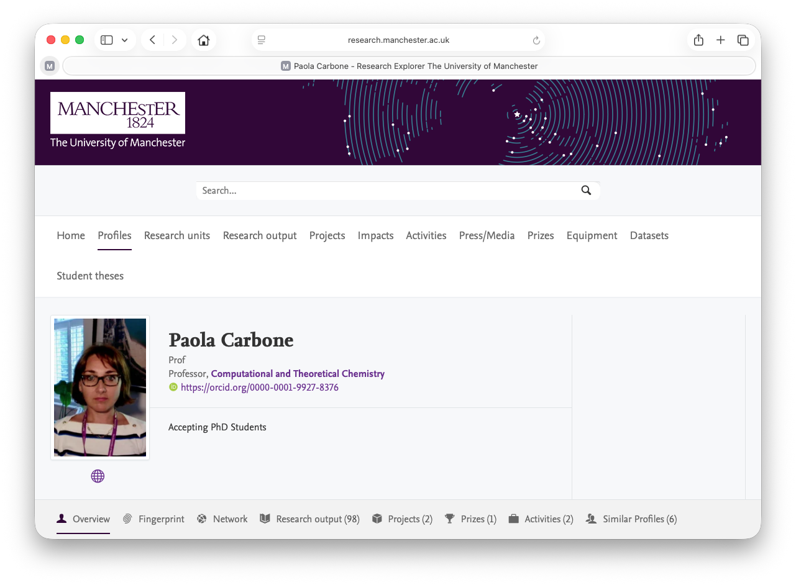

# Opportunities for NLP Research {#paola}

The Department of Chemistry has a summer research internship focusing on the construction of a high‑quality annotated text corpus to support [Natural Language Processing](https://en.wikipedia.org/wiki/Natural_language_processing) (NLP) methods for automated extraction of polymer property data from scientific literature. The project forms part of a broader effort to enable data‑driven materials discovery by improving access to structured information on polymer chemistry, processing, and performance.


```{r paola-fig, echo = FALSE, fig.align = "center", out.width = "100%", fig.cap = "(ref:captionpaola)"}

```

(ref:captionpaola) This summer research opportunity is based in [Paola Carbone's](https://research.manchester.ac.uk/en/persons/paola.carbone) research group. Paola is a Professor of Computational and Theoretical Chemistry at the University of Manchester.

## Project Overview {#praola}

The successful candidate will assist in the identification, collection, and curation of relevant scientific documents, including journal articles, reports, and technical summaries related to polymeric materials. Working under the supervision of a PhD student in Paola Carbone's group (see figure \@ref(fig:paola-fig)), the student will contribute to the design and implementation of an annotation framework for marking key entities and relationships, such as polymer types, compositional descriptors, mechanical and thermal properties, and experimental conditions.

## Research Activities {#ract}

*  Systematic collection and organisation of domain‑specific textual sources
* Development and application of annotation guidelines for entity and property labelling
* Quality control of annotated data, including inter‑annotator agreement checks
* Exposure to contemporary NLP workflows for information extraction in materials science

## Learning Outcomes {#rilos}

This summer internship provides an opportunity to gain experience in corpus development, annotation methodology, and the integration of domain knowledge with computational tools. Students will develop an understanding of how NLP techniques can be applied to accelerate research in polymer science and materials informatics.

This project is well suited to students with a pre-knowledge in data‑centric research, artificial intelligence and LLM models.


## Interested? {#rsocapp}

How to apply:

* **Email** your CV to `paola.carbone@manchester.ac.uk` highlighting any experience in NLP
* **Deadline** for applications: June but application closes once a suitable student has been found so apply asap
* **Salary**: £12.71 per hours 35 hours per week, expected project duration 6-8 weeks. 

This project is funded by the [royalsociety.org](https://royalsociety.org)