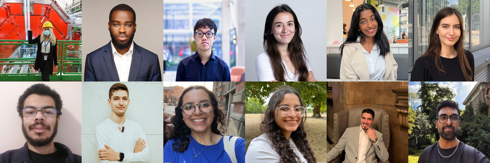
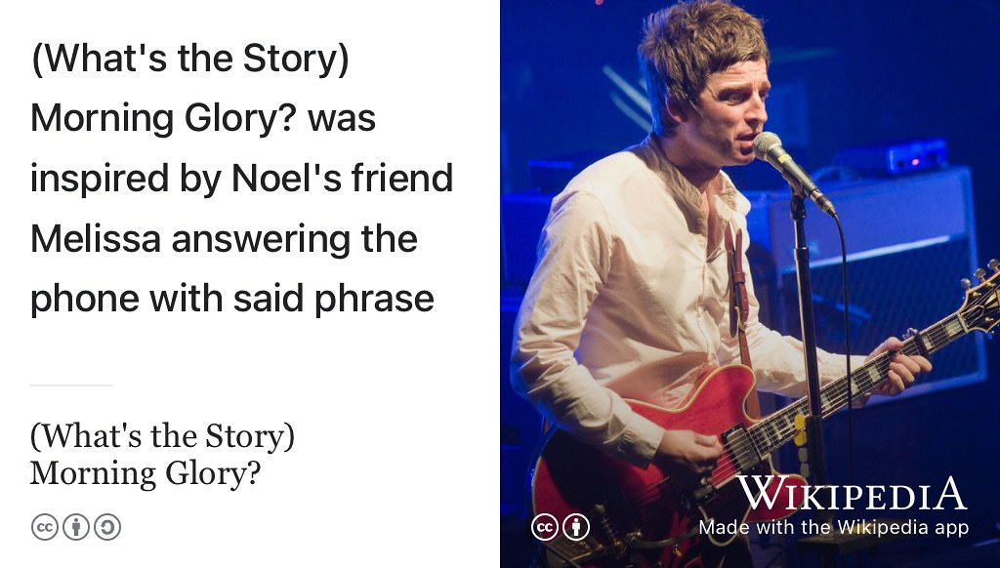
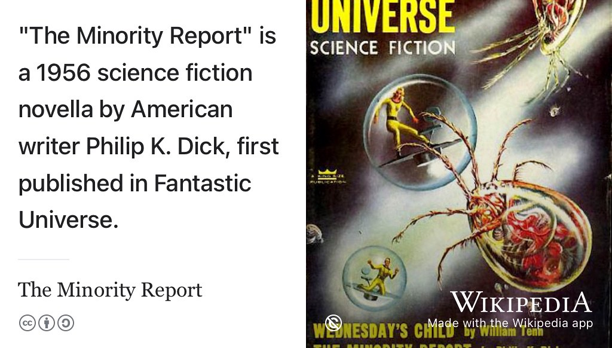
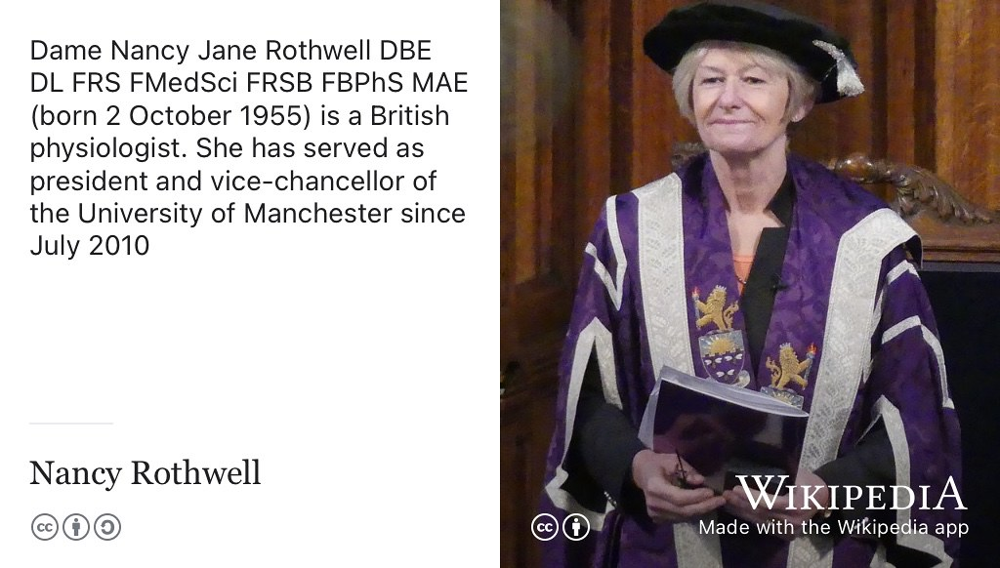
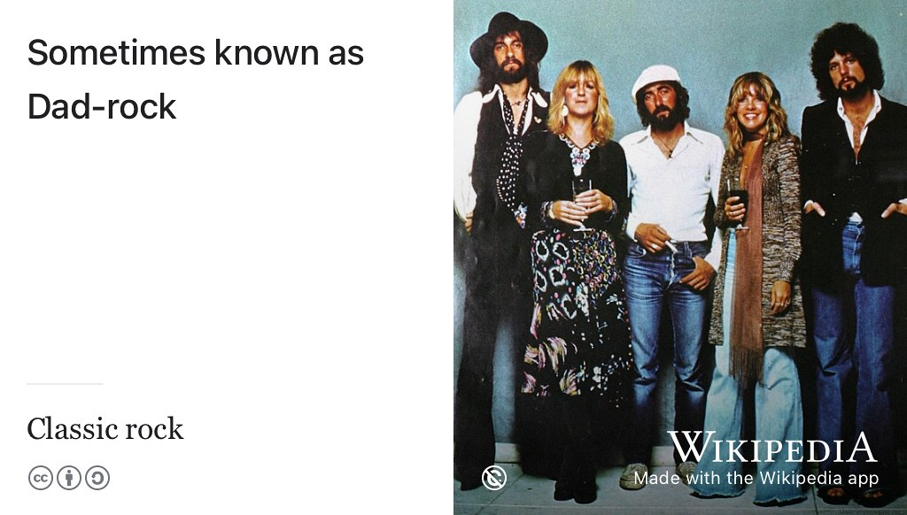
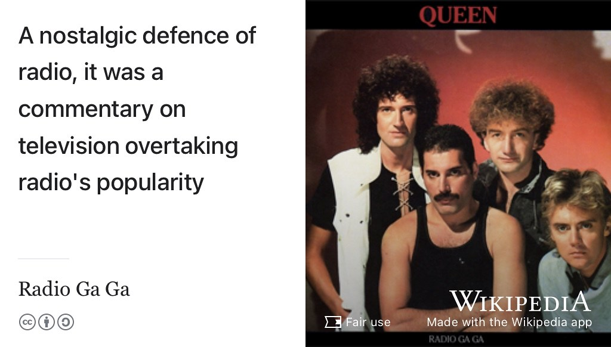

# (PART) CODING YOUR FUTURE {-}

# Hearing your future {#hearing}

*Hearing your Future* is the Coding your Future podcast which accompanies this guidebook. We talk to the [graduands](https://en.wiktionary.org/wiki/graduand) and graduates of computer science shown in figure \@ref(fig:collage-fig), to hear more about their journey from student to professional. What happens after graduation like the one shown in figure \@ref(fig:graduation-fig)? What comes next?

```{r collage-fig, echo = FALSE, fig.align = "center", out.width = "100%", fig.cap = "(ref:captioncollage)"}

```

(ref:captioncollage) Collage of Computer Scientist portraits re-used from LinkedIn and Github with permission. From left to right, top to bottom: thanks Raluca (chapter \@ref(raluca)), Jason (chapter \@ref(jason)), Brian (chapter \@ref(brian)), Carmen (chapter \@ref(carmen)), Sneha (chapter \@ref(sneha)), Alice (chapter \@ref(alice)), Jonathan (chapter \@ref(jonathan)), Ivo (chapter \@ref(ivo)), Ingy (chapter \@ref(ingy)), Nadine (chapter \@ref(nadine)), Pedro (chapter \@ref(pedro)) and Amish (chapter \@ref(amish)). 🙏

## From student to professional {#pro}

Listen in to the episodes below, or read the transcripts, to find out more about how these students are coding their future:

* What's their story?  
* How did they get to where they are?
* What obstacles have they faced and how did they overcome them?
* What advice would they offer to their former selves and fellow students?
* Where are they planning to going next?

<!-- this the trailer -->
```{r, eval=knitr::is_html_output(excludes="epub"), results='asis', echo=FALSE}
cat('<iframe title="Libsyn Player" style="border: none" src="https://html5-player.libsyn.com/embed/episode/id/23577479/height/90/theme/custom/thumbnail/yes/direction/forward/render-playlist/no/custom-color/000000/" height="90" width="100%" scrolling="no"  allowfullscreen="" webkitallowfullscreen="true" mozallowfullscreen="true" allowfullscreen="true" msallowfullscreen="true" style="border: none;"></iframe>')
```
Find out more by listening here or subscribing wherever you get your podcasts. 

Your future is bright, your future needs hearing, so let's start hearing your future.

## Subscribing to your future {#subscribing}

You can subscribe (for free!) by following one of the links below to your favourite podcast tool. Alternatively you can search for `Coding your Future` or `Hearing your Future` in your podcast application. You will see the logo shown in figure \@ref(fig:hearing-fig) when you find it.

* Spotify: [spoti.fi/3SFqaYk](https://spoti.fi/3SFqaYk)
* Apple: [apple.co/3JFV5Qe](https://apple.co/3JFV5Qe)
* Amazon Music / Audible: [amzn.to/3OOaS0G](https://amzn.to/3OOaS0G)
* Google podcasts: [podcasts.google.com/feed/aHR...](https://podcasts.google.com/feed/aHR0cHM6Ly9mZWVkcy5saWJzeW4uY29tLzI5OTE4OS9yc3M=)
* Deezer: [deezer.com/en/show/3839607](https://www.deezer.com/en/show/3839607)
* Podcast homepage: [codingyourfuture.libsyn.com](https://codingyourfuture.libsyn.com/)

If all else fails, you can cut-and-paste the raw `rss` feed URL below into the relevant settings on your podcast app:

```md
http://feeds.libsyn.com/299189/rss
```

```{r hearing-fig, echo = FALSE, fig.show = "hold", out.width = "33%", fig.cap = "(ref:captionhearing)"}
knitr::include_graphics(rep("images/Hearing-your-future.png", 3))
```

(ref:captionhearing) *Hearing your future* is the Coding your Future podcast. Subscribe and listen wherever you get your podcasts, see section \@ref(subscribing). Hearing sketch by [Visual Thinkery](https://visualthinkery.com/) is licensed under [CC-BY-ND](https://creativecommons.org/licenses/by-nd/4.0/)

If you'd like to be a guest on the show, see section \@ref(you).

## Episode 12: Amish Shah on imago, Bloomberg and Palantir {#ep12}

Interview with Amish Shah, see figure \@ref(fig:amish2-fig) and the transcript and show notes in chapter \@ref(amish).

```{r amish2-fig, echo = FALSE, fig.show = "hold", out.width = "33%", fig.cap = "(ref:captionamish)"}
knitr::include_graphics(rep("images/amish.jpeg", 3))
```

(ref:podcastblurbshort)


```{r, eval=knitr::is_html_output(excludes = "epub"), results='asis', echo=FALSE}
cat('<iframe title="Libsyn Player" style="border: none" src="https://html5-player.libsyn.com/embed/episode/id/27355713/height/90/theme/custom/thumbnail/yes/direction/forward/render-playlist/no/custom-color/000000/" height="90" width="100%" scrolling="no"  allowfullscreen="" webkitallowfullscreen="true" mozallowfullscreen="true" allowfullscreen="true" msallowfullscreen="true" style="border: none;"></iframe>')
```

## Episode 11: Pedro on startups, Nomura and Amazon Web Services {#ep11}

Interview with Pedro Sousa, see figure \@ref(fig:pedro2-fig) and the transcript and show notes in chapter \@ref(pedro).

```{r pedro2-fig, echo = FALSE, fig.show = "hold", out.width = "33%", fig.cap = "(ref:captionpedro)"}
knitr::include_graphics(rep("images/pedro.jpeg", 3))
```

(ref:podcastblurbshort)


```{r, eval=knitr::is_html_output(excludes = "epub"), results='asis', echo=FALSE}
cat('<iframe title="Libsyn Player" style="border: none" src="https://html5-player.libsyn.com/embed/episode/id/27355647/height/90/theme/custom/thumbnail/yes/direction/forward/render-playlist/no/custom-color/000000/" height="90" width="100%" scrolling="no"  allowfullscreen="" webkitallowfullscreen="true" mozallowfullscreen="true" allowfullscreen="true" msallowfullscreen="true" style="border: none;"></iframe>')
```


## Episode 10: Nadine Abdelhalim on Imago and Arm {#ep10}

Interview with Nadine Abdelhalim, see figure \@ref(fig:nadine2-fig) and the transcript and show notes in chapter \@ref(nadine).

```{r nadine2-fig, echo = FALSE, fig.show = "hold", out.width = "33%", fig.cap = "(ref:captionnadine)"}
knitr::include_graphics(rep("images/nadine.jpeg", 3))
```

(ref:podcastblurbshort)


```{r, eval=knitr::is_html_output(excludes = "epub"), results='asis', echo=FALSE}
cat('<iframe title="Libsyn Player" style="border: none" src="https://html5-player.libsyn.com/embed/episode/id/27147834/height/90/theme/custom/thumbnail/yes/direction/forward/render-playlist/no/custom-color/000000/" height="90" width="100%" scrolling="no"  allowfullscreen="" webkitallowfullscreen="true" mozallowfullscreen="true" allowfullscreen="true" msallowfullscreen="true" style="border: none;"></iframe>')
```


## Episode 9: Ingy Abdelhalim on IN3, Imago and McKinsey {#ep9}

Interview with Ingy Abdelhalim, see figure \@ref(fig:ingy2-fig) and the transcript and show notes in chapter \@ref(ingy).

```{r ingy2-fig, echo = FALSE, fig.show = "hold", out.width = "33%", fig.cap = "(ref:captioningy)"}
knitr::include_graphics(rep("images/ingy.jpeg", 3))
```

(ref:podcastblurbshort)


```{r, eval=knitr::is_html_output(excludes = "epub"), results='asis', echo=FALSE}
cat('<iframe title="Libsyn Player" style="border: none" src="https://html5-player.libsyn.com/embed/episode/id/27146787/height/90/theme/custom/thumbnail/yes/direction/forward/render-playlist/no/custom-color/000000/" height="90" width="100%" scrolling="no"  allowfullscreen="" webkitallowfullscreen="true" mozallowfullscreen="true" allowfullscreen="true" msallowfullscreen="true" style="border: none;"></iframe>')
```

## Episode 8: Ivaylo (Ivo) Iliev on Amazon Web Services {#ep8}

Interview with Ivaylo (Ivo) Iliev, see figure \@ref(fig:ivo2-fig) and the transcript and show notes in chapter \@ref(ivo).

```{r ivo2-fig, echo = FALSE, fig.show = "hold", out.width = "33%", fig.cap = "(ref:captionivo)"}
knitr::include_graphics(rep("images/ivo.jpeg", 3))
```

(ref:podcastblurbshort)

```{r, eval=knitr::is_html_output(excludes = "epub"), results='asis', echo=FALSE}
cat('<iframe title="Libsyn Player" style="border: none" src="https://html5-player.libsyn.com/embed/episode/id/27145818/height/90/theme/custom/thumbnail/yes/direction/forward/render-playlist/no/custom-color/000000/" height="90" width="100%" scrolling="no"  allowfullscreen="" webkitallowfullscreen="true" mozallowfullscreen="true" allowfullscreen="true" msallowfullscreen="true" style="border: none;"></iframe>')
```

## Episode 7: Jonathan Cowling on moneysupermarket and Infinity Works {#ep7}

Interview with Jonathan Cowling, see figure \@ref(fig:jonathan2-fig) and the transcript and show notes in chapter \@ref(jonathan).

```{r jonathan2-fig, echo = FALSE, fig.show = "hold", out.width = "33%", fig.cap = "(ref:captionjonathan)"}
knitr::include_graphics(rep("images/jonathan.jpeg", 3))
```

(ref:podcastblurbshort)

```{r, eval=knitr::is_html_output(excludes = "epub"), results='asis', echo=FALSE}
cat('<iframe title="Libsyn Player" style="border: none" src="https://html5-player.libsyn.com/embed/episode/id/27135234/height/90/theme/custom/thumbnail/yes/direction/forward/render-playlist/no/custom-color/000000/" height="90" width="100%" scrolling="no"  allowfullscreen="" webkitallowfullscreen="true" mozallowfullscreen="true" allowfullscreen="true" msallowfullscreen="true" style="border: none;"></iframe>')
```

## Episode 6: Alice Păcuraru on Barclays, THG and Publicis Sapient {#ep6}

Interview with Alexandra (Alice) Păcuraru, see figure \@ref(fig:alice2-fig) and the transcript and show notes in chapter \@ref(alice).

```{r alice2-fig, echo = FALSE, fig.show = "hold", out.width = "33%", fig.cap = "(ref:captionalice)"}
knitr::include_graphics(rep("images/alice.jpeg", 3))
```

(ref:podcastblurbshort)

```{r, eval=knitr::is_html_output(excludes = "epub"), results='asis', echo=FALSE}
cat('<iframe title="Libsyn Player" style="border: none" src="https://html5-player.libsyn.com/embed/episode/id/27118155/height/90/theme/custom/thumbnail/yes/direction/forward/render-playlist/no/custom-color/000000/" height="90" width="100%" scrolling="no"  allowfullscreen="" webkitallowfullscreen="true" mozallowfullscreen="true" allowfullscreen="true" msallowfullscreen="true" style="border: none;"></iframe>')
```

## Episode 5: Sneha Kandane on Matillion {#ep5}

Interview with Sneha Kandane, see figure \@ref(fig:sneha2-fig) and the transcript and show notes in chapter \@ref(sneha).

```{r sneha2-fig, echo = FALSE, fig.show = "hold", out.width = "33%", fig.cap = "(ref:captionsneha)"}
knitr::include_graphics(rep("images/sneha.jpeg", 3))
```

(ref:podcastblurbshort)

```{r, eval=knitr::is_html_output(excludes = "epub"), results='asis', echo=FALSE}
cat('<iframe title="Libsyn Player" style="border: none" src="https://html5-player.libsyn.com/embed/episode/id/23798123/height/90/theme/custom/thumbnail/yes/direction/forward/render-playlist/no/custom-color/000000/" height="90" width="100%" scrolling="no"  allowfullscreen="" webkitallowfullscreen="true" mozallowfullscreen="true" allowfullscreen="true" msallowfullscreen="true" style="border: none;"></iframe>')
```


## Episode 4: Carmen Faura Práxedes on Disney & McKinsey {#ep4}

Interview with Carmen Faura Práxedes, see figure \@ref(fig:carmen2-fig) and the transcript and show notes in chapter \@ref(carmen)

```{r carmen2-fig, echo = FALSE, fig.show = "hold", out.width = "33%", fig.cap = "(ref:captioncarmen)"}
knitr::include_graphics(rep("images/carmen.jpeg", 3))
```
(ref:podcastblurbshort)

```{r, eval=knitr::is_html_output(excludes = "epub"), results='asis', echo=FALSE}
cat('<iframe title="Libsyn Player" style="border: none" src="https://html5-player.libsyn.com/embed/episode/id/23797640/height/90/theme/custom/thumbnail/yes/direction/forward/render-playlist/no/custom-color/000000/" height="90" width="100%" scrolling="no"  allowfullscreen="" webkitallowfullscreen="true" mozallowfullscreen="true" allowfullscreen="true" msallowfullscreen="true" style="border: none;"></iframe>')
```

## Episode 3: Brian Yim Tam on Disney+ and Wise {#ep3}

Interview with Brian Yim Tam, see figure \@ref(fig:brian2-fig) and the transcript and show notes in chapter \@ref(brian)

```{r brian2-fig, echo = FALSE, fig.show = "hold", out.width = "33%", fig.cap = "(ref:captionbrian)"}
knitr::include_graphics(rep("images/brian.jpeg", 3))
```

(ref:podcastblurbshort)

```{r, eval=knitr::is_html_output(excludes = "epub"), results='asis', echo=FALSE}
cat('<iframe title="Libsyn Player" style="border: none" src="https://html5-player.libsyn.com/embed/episode/id/23796200/height/90/theme/custom/thumbnail/yes/direction/forward/render-playlist/no/custom-color/000000/" height="90" width="100%" scrolling="no"  allowfullscreen="" webkitallowfullscreen="true" mozallowfullscreen="true" allowfullscreen="true" msallowfullscreen="true" style="border: none;"></iframe>')
```

## Episode 2: Jason Ozuzu on Morgan Stanley, Fitbit and Google {#ep2}

Interview with Jason Ozuzu, see figure \@ref(fig:jason2-fig) and the transcript in chapter \@ref(jason).

```{r jason2-fig, echo = FALSE, fig.show = "hold", out.width = "33%", fig.cap = "(ref:captionjason)"}
knitr::include_graphics(rep("images/jason.jpeg", 3))
```

(ref:podcastblurbshort)

```{r, eval=knitr::is_html_output(excludes = "epub"), results='asis', echo=FALSE}
cat('<iframe title="Libsyn Player" style="border: none" src="https://html5-player.libsyn.com/embed/episode/id/23795996/height/90/theme/custom/thumbnail/yes/direction/forward/render-playlist/no/custom-color/000000/" height="90" width="100%" scrolling="no"  allowfullscreen="" webkitallowfullscreen="true" mozallowfullscreen="true" allowfullscreen="true" msallowfullscreen="true" style="border: none;"></iframe>')
```

## Episode 1: Raluca Cruceru on Koderly and CERN {#ep1}

Interview with Raluca Cruceru, see figure \@ref(fig:raluca2-fig) and the transcript and show notes in chapter \@ref(raluca)

```{r raluca2-fig, echo = FALSE, fig.show = "hold", out.width = "33%", fig.cap = "(ref:captionraluca)"}
knitr::include_graphics(rep("images/raluca.jpeg", 3))
```

(ref:podcastblurbshort)

```{r, eval=knitr::is_html_output(excludes = "epub"), results='asis', echo=FALSE}
cat('<iframe title="Libsyn Player" style="border: none" src="https://html5-player.libsyn.com/embed/episode/id/23794112/height/90/theme/custom/thumbnail/yes/direction/forward/render-playlist/no/custom-color/000000/" height="90" width="100%" scrolling="no"  allowfullscreen="" webkitallowfullscreen="true" mozallowfullscreen="true" allowfullscreen="true" msallowfullscreen="true" style="border: none;"></iframe>')
```

## Episode $x$: it could be YOU! {#you}
YOUR FUTURE WANTS YOU: Join your future! If you'd like to be interviewed for the show, [get in touch](https://personalpages.manchester.ac.uk/staff/duncan.hull/contact), see figure \@ref(fig:yfnu-fig). Besides interviewing current graduates, I'm interested in speaking to former graduates, especially if you:

* completed a placement or internship(s) as an undergraduate or postgraduate
* consider yourself to be part of a minority or under-represented group

I'm also interested in speaking to people who graduated a while back, not just this years graduates, but any back to 1968. 🎓 [@babygrowsup]

```{r yfnu-fig, echo = FALSE, fig.show = "hold", out.width = "33%", fig.cap = "(ref:captionyfnu)"}
knitr::include_graphics(rep("images/your-future-wants-you.jpeg", 3))
```

(ref:captionyfnu) Your ~~country~~ future wants YOU. 🫵 Join your future. If you are a former student of Computer Science who'd like to appear on the show, [get in touch](https://personalpages.manchester.ac.uk/staff/duncan.hull/contact). I'm especially interested to hear from students who did internships or placements before they graduated in Computer Science. Picture adapted from an original public domain image of the [Lord Kitchener Wants You](https://en.wikipedia.org/wiki/Lord_Kitchener_Wants_You) poster by [Alfred Leete](https://en.wikipedia.org/wiki/Alfred_Leete) on Wikimedia Commons at [w.wiki/3xvX](https://w.wiki/3xvX)

If you're coming on the show, please have a think about the following questions which we ask all our guests:

1. 🎸 What's your story, coding glory see section \@ref(your-story)
1. ✊🏽 Minority report (optional) see section \@ref(minority)
1. 👑 You are the next Vice Chancellor (optional) see section \@ref(vc)
1. 🍿 One tune, one podcast, one book, one film: see section \@ref(otopof)
1. ⏱ Time traveller, see section \@ref(your-time)


### What's your story, coding glory? {#your-story}

> “All your dreams are made, when you're chained to [the tracker](https://en.wikipedia.org/wiki/Comparison_of_issue-tracking_systems) and the software trade...
> What's your story, coding glory?”

What's your [origin story](https://en.wikipedia.org/wiki/Origin_story), see figure \@ref(fig:gallagher2-fig)? 

* What's your name and where do you come from? [@blinddate]
* Why did you choose to study computer science?
* Which organisation were you employed by, why and how did you choose them
* What were the main obstacles you faced finding employment and how did you overcome them?
* Tell us about your roles and responsibilities within the organisation
* How did you find the job and what other jobs did they look for?
* What were the main things you learned on placement?
* What was the most enjoyable or rewarding part of working for your employer?
* What did you do for your final year project?
* If you graduated previously, what has been your career path to date?
* What comes next?

```{r gallagher2-fig, echo = FALSE, fig.align = "center", out.width = "100%", fig.cap = "(ref:caption2gallagher)"}

```

(ref:caption2gallagher) [(What's your Story) ~~Morning~~ Coding Glory?](https://en.wikipedia.org/wiki/(What%27s_the_Story)_Morning_Glory%3F) [@whatsthestory]. CC BY portrait of [Noel Gallagher](https://en.wikipedia.org/wiki/Noel_Gallagher) by [alterna2.com](https://alterna2.com/) on Wikimedia Commons [w.wiki/3bimy](https://w.wiki/3bim) adapted using the [Wikipedia app](https://apps.apple.com/us/app/wikipedia/id324715238)

So what's your story, coding glory? 🎸

### Minority report {#minority}
This is an optional question taken from the title of the [Philip K. Dick](https://en.wikipedia.org/wiki/Philip_K._Dick) novel *[The Minority Report](https://en.wikipedia.org/wiki/The_Minority_Report)* and subsequent film adaptation, see figure \@ref(fig:minority-fig). Minority report asks our guests:

* Do you consider yourself to be a member of an under-represented, minority or otherwise marginalised group?
* If so which one(s) are you happy to discuss, see section \@ref(protected)?
* What has your experience been of being in a minority at University and in the workplace?
* How can the teaching and learning of computer science be made more [equitable, diverse and inclusive](https://en.wikipedia.org/wiki/Diversity,_equity,_and_inclusion) for members of your minority group(s)?
* What else can universities do to make campuses more welcoming to members of your minority group(s)?
* What more can employers do to make workplaces more welcoming to members of your minority group(s)?

```{r minority-fig, echo = FALSE, fig.align = "center", out.width = "99%", fig.cap = "(ref:captionminority)"}

```
(ref:captionminority) Are you in a minority?  Inspired by the book [@theminorityreport] and its film adaptation [@minorityreport], we'll hear from some of our minorities. *The Minority Report* is short story by Philip K. Dick first published by *[Fantastic Universe](https://en.wikipedia.org/wiki/Fantastic_Universe)* magazine in 1956. What is it like being in minority and how could universities and employers be more welcoming to your minority group(s)? Public domain image of magazine cover by [Ed Emshwiller](https://en.wikipedia.org/wiki/Ed_Emshwiller) via Wikimedia Commons [w.wiki/5Swn](https://w.wiki/5Swn) adapted using the [Wikipedia app](https://apps.apple.com/us/app/wikipedia/id324715238)

If you're in a minority that you're happy to talk about, do you have anything you'd like to report? ✊🏽

### You are the next Vice Chancellor {#vc}
Congratulations, the [board of governors](https://www.manchester.ac.uk/discover/governance/structure/board-governors/) and [senate of the University of Manchester](https://www.manchester.ac.uk/discover/governance/structure/senate/) have just appointed you their next leader where you'll take over from the current Vice Chancellor (VC) [Nancy Rothwell](https://en.wikipedia.org/wiki/Nancy_Rothwell), shown in figure \@ref(fig:vc-fig). Nancy has served as VC since 2010, and will step down in 2024, the [200th anniversary](https://www.manchester.ac.uk/discover/history-heritage/history/umist/) of the foundation of the University of Manchester. [@umist] As VC, you now have responsibility for 11,000 staff, 40,000 students and access to a global network of over 500,000 alumni. You'll also take over as chair of the [russellgroup.ac.uk](https://russellgroup.ac.uk/). Since this is an optional question, you can dodge this bullet if you'd rather not attempt to answer it.

```{r vc-fig, echo = FALSE, fig.align = "center", out.width = "98%", fig.cap = "(ref:captionvc)"}

```

(ref:captionvc) Professor [Nancy Rothwell](https://en.wikipedia.org/wiki/Nancy_Rothwell) is Vice Chancellor (VC) of the University of Manchester. If *you* were VC, what would you change about how the University is run? [CC BY](https://creativecommons.org/licenses/by/2.0/deed.en) portrait of Nancy Rothwell by Manchester University Maths on Wikimedia Commons [w.wiki/6WjS](https://w.wiki/6WjS) adapted using the [Wikipedia app](https://apps.apple.com/gb/app/wikipedia/id324715238)

Now that you are the VC, what would you change about the University of Manchester to improve the [teaching and learning](https://www.manchester.ac.uk/study/undergraduate/teaching-learning/)? What would be your first task to make a difference to students like yourself? 👑

### One tune, one podcast, one book and one film {#otopof}

We love our books, music, films and podcasts. This love is expressed in gratuitous popular culture references throughout *Coding your Future*. Critics say the musical playlists in chapter \@ref(enjoying) are clogged up with:

* Lancashire boy bands, see section \@ref(lancashire)
* [BritPop](https://en.wikipedia.org/wiki/Britpop) and Dad-Rock, see section \@ref(dadrock) [@dadrock]
* Cardigan-swinging, [shoe-gazing](https://en.wikipedia.org/wiki/Shoegaze), [Glastonbury-gigging](https://en.wikipedia.org/wiki/Glastonbury_Festival), [indie music](https://en.wikipedia.org/wiki/Indie_rock), see section \@ref(indie)
* Music made with digital computers rather than analogue instruments, see section \@ref(electronica)
* other antiquities from a bygone era, see figure \@ref(fig:dadrock-fig).

```{r dadrock-fig, echo = FALSE, fig.align = "center", out.width = "98%", fig.cap = "(ref:captiondadrock)"}

```

(ref:captiondadrock) From the Beatles to the Rolling Stones, U2 to Fleetwood Mac, Oasis to Guns N' Roses and Jimi  Hendrix to Queen: the [Dad-rock](https://en.wikipedia.org/wiki/Dad-rock) playlist shamelessly revels in classic but bygone glories of yesteryear. [@dadrock; @dadrock2] Public domain portrait of Mick Fleetwood, Christine McVie, John McVie, Stevie Nicks and Lindsey Buckingham ([Fleetwood Mac](https://en.wikipedia.org/wiki/Fleetwood_Mac)) on Wikimedia Commons [w.wiki/6hxg](https://w.wiki/6hxg) adapted using the [Wikipedia app](https://apps.apple.com/gb/app/wikipedia/id324715238)

So, can you recommend a:

* **TUNE!** One tune to rejuvenate or internationlise our playlists. Why is it important to you?
    - Perhaps it makes you relax, feel happy or comforted?
    - Maybe it reminds you of special people, a special time or special place in your life?
    - We'll add it to *The Coder's Playlist* in section \@ref(coders)
* **PODCAST:** One podcast  you’ve enjoyed that you’d recommend people listen or subscribe to 🎧
* **BOOK:** One book (or audiobook) you’ve enjoyed, either fiction or non-fiction 📕
* **FILM:** One film we’ve got to go and watch right now, old or new 🍿

### Time traveller {#your-time}

Do you wish that you knew what you know now, when you were younger? Just like [Ronnie Lane](https://en.wikipedia.org/wiki/Ronnie_Lane), [Ronnie Wood](https://en.wikipedia.org/wiki/Ronnie_Wood) and [Rod Stewart](https://en.wikipedia.org/wiki/Rod_Stewart), we all probably feel that way sometimes, see figure \@ref(fig:faces2-fig). So, if you could travel back in time to meet the younger you, just starting University:

* What would you tell your former self, now that you are older and wiser?
* What would you tell current students to help them get the most of their preciously short time at University?

```{r faces2-fig, echo = FALSE, fig.align = "center", out.width = "99%", fig.cap = "(ref:captionfaces2)"}
knitr::include_graphics("images/faces.jpeg")
```
(ref:captionfaces2) Poor old grandad I laughed at all his words but I wish that I knew what I know now, when I was younger, see [Ooh La La](https://en.wikipedia.org/wiki/Ooh_La_La_(Faces_song)). [@faces] Do you wish that you knew what you know now, when you were younger? What would you tell your younger self about getting the most from University life?

What do you know now, that you wish you'd known when you were younger? ⏱

## Everything I had to know, I heard it on my radio {#radio}
Let's leave the last words on podcasting to *[The Buggles](https://en.wikipedia.org/wiki/The_Buggles)* and *[Queen](https://en.wikipedia.org/wiki/Queen_(band))*. Podcasting is an evolution and mutation of radio but did [video kill the radio star](https://en.wikipedia.org/wiki/Video_Killed_the_Radio_Star)? [@videokilled] What if everything you had to know, you could hear it on your radio, see figure \@ref(fig:gaga-fig)? Tune in to find out. 📻

```{r gaga-fig, echo = FALSE, fig.align = "center", out.width = "99%", fig.cap = "(ref:captiongaga)"}

```

(ref:captiongaga) All we hear is [Radio Ga Ga](https://en.wikipedia.org/wiki/Radio_Ga_Ga) but everything I had to know, I heard it on my radio. So don't become some background noise, a backdrop to the girls and boys, who just don't know and just don't care and just complain when you're not there. [@radiogaga]

I'd sit alone and watch your light, my only friend through teenage nights. Everything I had to know I heard it on my radio. [@radiogaga]

## Summarising your hearing {#tldr21}
(ref:tldr)

Your future is bright, your future needs listening. Listening to your future, will help you code your future. 

```{r graduation-fig, echo = FALSE, fig.align = "center", out.width = "100%", fig.cap = "(ref:captiongraduation)"}
knitr::include_graphics("images/graduation2.jpeg")
```

(ref:captiongraduation) Silly hat? ✅ Silly frock? ✅ Wearing your best outfit? ✅ It must be time for graduation! What comes next? *Hearing your future* interviews current and former students to find out more about how they got to where they are and where they are going to next. Picture of obligatory hat throwing outside the [Samuel Alexander](https://en.wikipedia.org/wiki/Samuel_Alexander) building in 2018. Photobombing by [Gavin Brown](https://profgavinbrown.github.io/) 🎓


In *Hearing your Future*, you can listen to students about how they are Coding their Future. We hope you'll be  inspired and encouraged by their stories to help you on your journey.

### Thanks Jez {#jez}
This podcast is inspired and supported by [Jez Lloyd](https://www.linkedin.com/in/jez-lloyd-84077069), host, producer, director, editor, sound engineer and mastermind of the excellent CS\@Manchester podcast, see figure \@ref(fig:jez-fig). Thanks Jez! 🙏

This podcast has also borrowed ideas from the BBC. If it were broadcast on Radio 4, it would be a cross between *Desert Island Discs* and *The Life Scientific*. [@thelifescientific] Thanks to Jim Al-Khalili, Lauren Laverne, Sue Lawley, Kirsty Young, Michael Parkinson and Roy Plumley for the inspiration. [@desertislandddiscs]

```{r jez-fig, echo = FALSE, out.width='100%', fig.cap="(ref:captionjez)", dev='png'}
knitr::include_url('https://www.podomatic.com/podcasts/cs-engagement')
```

(ref:captionjez) The CS\@Manchester podcast was produced and hosted by Jez Lloyd and ran from 2015 to 2020. This podcast, *Hearing your future*, is following in all 38 of its audible footsteps, see [podomatic.com/podcasts/cs-engagement](https://www.podomatic.com/podcasts/cs-engagement)
