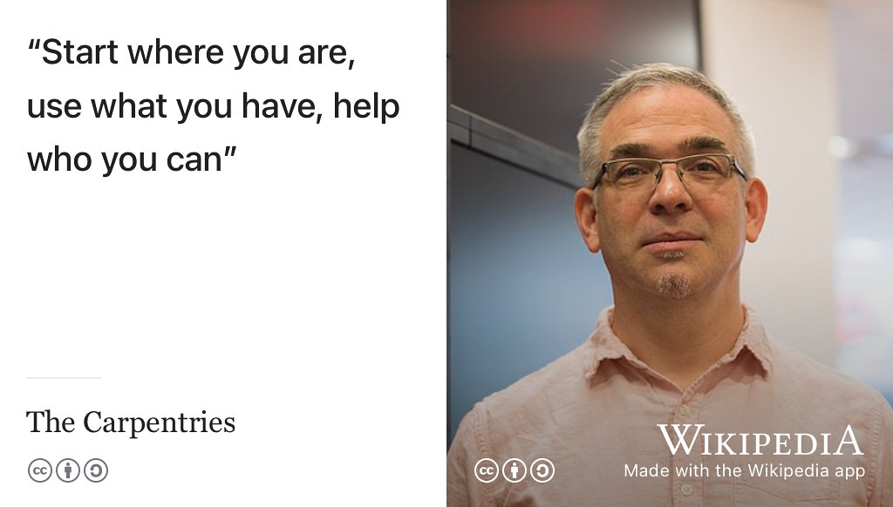
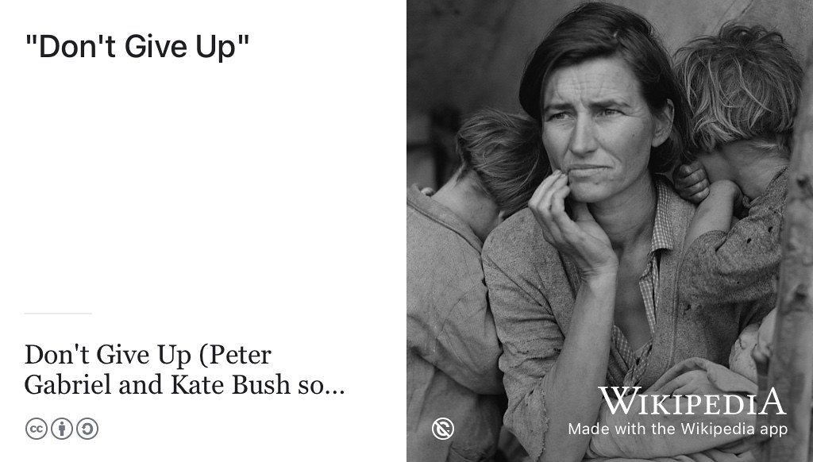

# Ruling your future {#ruling}  

In 2005, the scientist and engineer [Phil Bourne](https://en.wikipedia.org/wiki/Philip_Bourne) starting publishing a series of articles which distilled people's hard won knowledge into *[Ten Simple Rules](https://collections.plos.org/ten-simple-rules)*. [@Bourne2005] Over a decade more than 1000 rules were published in over 100 articles in the scientific journal *[PLOS Computational Biology](https://en.wikipedia.org/wiki/PLOS_Computational_Biology)*. [@Bourne2018] These articles offer a huge range of advice from making the most of a summer internship [@Aicher2017] to teaching programming [@tensimplebrown] and even winning a Nobel Prize. [@Roberts2015] Articles as lists, or “[listicles](https://en.wikipedia.org/wiki/Listicle)” as they are sometimes known, are a convenient way to summarise key points. So here are *Ten Simple Rules for Coding Your Future*: the too long, didn't read ([TL;DR](https://en.wiktionary.org/wiki/too_long;_didn%27t_read)) summary of this guidebook.

```{r ten-simple-fig, echo = FALSE, fig.align = "center", out.width = "100%", fig.cap = "(ref:captiontensimple)"}
knitr::include_graphics("images/10 Simple Rules.png")
```

(ref:captiontensimple) Ten Simple rules for coding your future. Know who you are, look after yourself, use what you have, grow your networks, always make new mistakes, help and thank, look beyond the obvious, stay in school, step outside your comfort zone and (*most importantly*) don't give up! Figure by [Visual Thinkery](https://visualthinkery.com/) is licensed under [CC-BY-ND](https://creativecommons.org/licenses/by-nd/4.0/)

Your future is bright, your future needs ruling, so let's start ruling your future.

1. 🧠 Know who you are, “know thyself”, it worked for the ancient greeks, it can work for you too see section \@ref(mybrand)
1. 🙂 Look after yourself, mentally and physically. Job hunting can make you stressed, depressed and exam obsessed, see section \@ref(onlyhuman)
1. 🛠 Use what you have, rather than focusing on the things you don't have. More time, resources, experience, projects, better grades etc see section \@ref(gregwilson)
1. 🌐 Build your networks: it's not what you know, it's who you know, see section \@ref(networking)
1. ❌ Always make NEW mistakes, mistakes *can* be a good thing, see section \@ref(estherdyson)
1. 🙏 Help and thank, simple gratitude and kindness are good for your mental health and those around you too see section \@ref(gratitude)
1. 🔎 Look beyond the obvious, if you still haven't found what you're looking for, consider broadening your search, see section \@ref(beyond)
1.  🎓 Stay in school, learning is a life-long process that continues long after you graduate see section \@ref(lifelonglearning)
1. 🛋 Step outside your comfort zone. Yes it's uncomfortable but that's often where you'll learn the most, see section \@ref(comfy)
1. 🚦 Don't give up because being stuck is temporary. Either those red lights will eventually go green or you'll find a better route, see section \@ref(nevergiveup)


## Know who you are {#mybrand}

There is a lot more to you than your degree. There is a lot more to you than your grades. Yes, you've spent (or will be spending) three or four years getting your degree. Use this time to identify your weaknesses and work out how to improve them. Exploring your future depends on knowing who you are now, see chapter \@ref(exploring) and figure \@ref(fig:knowing-fig).

```{r knowing-fig, echo = FALSE, fig.align = "center", out.width = "50%", fig.cap = "(ref:captionknowmyself)"}
knitr::include_graphics("images/Know who you are.png")
```
(ref:captionknowmyself) How well do *really* you know yourself? Know who you are sketch by [Visual Thinkery](https://visualthinkery.com) is licensed under [CC-BY-ND](https://creativecommons.org/licenses/by-nd/4.0/)

<!--understand your brand your values, another word for brand is reputation. do people like you. The better you know yourself, the better-->

Being able to articulate your self-awareness to employers will make writing a CV (chapter \@ref(debugging)) and interviewing (chapter \@ref(speaking)) a lot easier. Both rely on you be able to express yourself in written and spoken language. You should aim to strike a balance between humbly underselling yourself (see section \@ref(undersell)) and proudly overselling yourself, see section \@ref(oversell). If you have digital profiles like those described in section \@ref(portfolio), how accurate a reflection of you are they? Is your digital [alter ego](https://en.wikipedia.org/wiki/Alter_ego) at odds with reality?

<!--https://twitter.com/dullhunk/status/1594641377060687873-->


## Look after yourself {#onlyhuman}
Studying at University can be enjoyable but it can also make you stressed, anxious and depressed. If you neglect to look after yourself mentally and physically, things can start to fall apart. Choose your reference points carefully, try not to compare yourself to the person at the top of the class: see Carmen's advice in chapter \@ref(carmen). Ask yourself, am I doing better than last time? Be kind to yourself because nurturing yourself now will nurture your future, see chapter \@ref(nurturing).

```{r lookafter-again-fig, echo = FALSE, fig.align = "center", out.width = "50%", fig.cap = "(ref:captionlookafteragain)"}
knitr::include_graphics("images/Look after yourself.png")
```

(ref:captionlookafteragain) It's important not to neglect your body, mind and soul when you're working hard. Look after yourself by [Visual Thinkery](https://visualthinkery.com) is licensed under [CC-BY-ND](https://creativecommons.org/licenses/by-nd/4.0/)

At University, you are quite likely to be surrounded by people who have more experience, better knowledge, higher grades or more skills than you. That might not have been the case at high school if you were top (or near the top) of your class. While it is natural to compare yourself to the best, you should do so with caution. The important thing is that you are working to towards the best version of yourself, not necessarily the best in your class anymore.

## Use what you have {#gregwilson}

It's too easy to fall into a trap of thinking *if only I had better ...* when job hunting. Use what you already have, see figure \@ref(fig:usewhatyouhave-fig).

```{r usewhatyouhave-fig, echo = FALSE, fig.align = "center", out.width = "50%", fig.cap = "(ref:captionusewhatyouhave)"}
knitr::include_graphics("images/Use what you have.png")
```
(ref:captionusewhatyouhave) Use whatever resources you have at your disposal rather than thinking about the resources you don't have. Use what you have by [Visual Thinkery](https://visualthinkery.com) is licensed under [CC-BY-ND](https://creativecommons.org/licenses/by-nd/4.0/)

This rule is borrowed from software engineer Greg Wilson [\@gvwilson](https://github.com/gvwilson) in figure \@ref(fig:greg-wilson-fig), who probably adapted it from a quote frequently misattributed to Theodore Roosevelt [@teddy].

```{r greg-wilson-fig, echo = FALSE, fig.align = "center", out.width = "100%", fig.cap = "(ref:captiongregwilson)"}

```

(ref:captiongregwilson) “Start where you are, use what you have, help who you can.” —Greg Wilson at [third-bit.com](https://third-bit.com/) and [software-carpentry.org](https://software-carpentry.org/). CC BY Portrait of Greg Wilson at [The Carpentries](https://en.wikipedia.org/wiki/The_Carpentries) via Wikimedia Commons [w.wiki/3a6V](https://w.wiki/3a6V) adapted using the [Wikipedia App](https://apps.apple.com/gb/app/wikipedia/id324715238).

Getting a job offer is competitive and can be cut-throat. You might find yourself falling into poor habits of mind:

* “*If I had a better degree from a different university, I'd be more successful...*” see section \@ref(entitled)
* “*If I had more experience, more voluntary work, more internships, I'd stand a better chance...*” see section \@ref(areuexperienced)
* “*If I'd done more projects and extra-curricular activities...*” etc see section \@ref(projects)
* “*If I'd got better grades at school and Uni...*” see section \@ref(academentia)
* “*If only I'd worked harder...*” see \@ref(regret)
* “*If I was more confident at speaking and interviews ... *” see chapter \@ref(speaking) on *Speaking your future*
* “*If I'd been to a different school, I could be more successful...*” see the [93percent.club](https://www.93percent.club/) [@93bbc; @93guardian]

This is all the usual dialogue you can expect from your inner critic: 

* Coulda
* Woulda
* Shoulda

Acknowledge these thoughts, see section \@ref(lays), then try distance yourself from them. Start from where you are, use whatever you have and help who you can.

## Grow your networks {#networking}

Grow your networks, make use of all the contacts you have and foster new connections where you can. Improve the connections you already have by spending time talking to people and hearing what they have to say. People can help you, *especially* those you're not particularly close to, see figure \@ref(fig:yournetwork-fig)

```{r yournetwork-fig, echo = FALSE, fig.align = "center", out.width = "50%", fig.cap = "(ref:captionyournetwork)"}
knitr::include_graphics("images/Grow your networks.png")
```
(ref:captionyournetwork) Grow and use your networks, both the strong ties and the weak ties described in section \@ref(weakties). [Traversing your (personal) graph](https://en.wikipedia.org/wiki/Graph_traversal) will help you find work. Grow your network by [Visual Thinkery](https://visualthinkery.com) is licensed under [CC-BY-ND](https://creativecommons.org/licenses/by-nd/4.0/)

Remember that the weaker ties in your network (see section \@ref(weakties)) may be more important than your stronger ties, especially when it comes to finding jobs. [It's not (just) what you know, but *who* you know](https://en.wiktionary.org/wiki/it%27s_not_what_you_know_but_who_you_know).

## Always make new mistakes {#estherdyson}

You can classify your mistakes and failures into two categories:

1. Productive mistakes: those you learnt from
1. Unproductive mistakes: those you didn't learn anything from (and risk repeating)

Mistakes and failure are inevitable in life, but productive mistakes are going to help you much more that unproductive ones [@henrypetroski]. That doesn't just mean  you should “*fail fast, fail often*” [@failfast] or “*move fast and break things*”, but to consciously learn from any mistakes you make so that you don't repeat them.  One way to turn unproductive mistakes into productive ones is deliberately and consciously reflect on why you made them. This is part of the growth mindset we discussed in chapter \@ref(nurturing).

In a growth mindset, mistakes can be good, but the fear of making them is not. You are more likely to take more chances when you're unafraid to fail, and this will improve your chances of success. [@cherish] As the musician Andrew Weatherall was fond of saying: *fail me may, sail we must*, see figure \@ref(fig:weatherall-fig).


```{r weatherall-fig, echo = FALSE, fig.align = "center", out.width = "100%", fig.cap = "(ref:captionweatherall)"}

```

(ref:captionweatherall) *“Fail we may, sail we must”*. [@failwemay; @weatherall] Is it failing or sailing that you are most afraid of? Portrait of [Andrew Weatherall](https://en.wikipedia.org/wiki/Andrew_Weatherall) by Spencer Hickman on Wikimedia Commons [w.wiki/3Ag5](https://w.wiki/3Ag5) adapted using the [Wikipedia app](https://apps.apple.com/gb/app/wikipedia/id324715238) ⛵️ 

Many education systems around the world don't teach people enough about how to fail, because they put too much emphasis on success (as measured by grades and rewards) rather than progress, learning and happiness. [@failgift; @punished] So as the angel investor [Esther Dyson](https://en.wikipedia.org/wiki/Esther_Dyson) once said, “Always make new mistakes”, see figure \@ref(fig:esther-dyson-fig)

```{r esther-dyson-fig, echo = FALSE, fig.align = "center", out.width = "100%", fig.cap = "(ref:captionestherdyson)"}
knitr::include_graphics("images/esther-dyson-always-make-new-mistakes.jpeg")
```

(ref:captionestherdyson) Mistakes are inevitable in life, so there's no shame in making them especially if they are new. Making *new* mistakes can be a form of productive failure that you learn from rather than a source of unproductive failure that you repeat (old mistakes). Portrait of [Esther Dyson](https://en.wikipedia.org/wiki/Esther_Dyson) by Christopher Michel (CC BY-SA) via Wikimedia commons [w.wiki/3TEY](https://w.wiki/3TEY) adapted using the [Wikipedia App](https://apps.apple.com/gb/app/wikipedia/id324715238).

So:

* If you've got some harsh feedback on your CV, how can you make less buggy in the future?
* If you've applied to lots of companies and not even had a reply yet, how can you improve your job search strategy?
* If you've neglected to develop interests and projects outside of work, how can you rebalance?
* If you crashed and burned in an interview, how can you use the experience to do better next time?
* If you failed to get the promotion you thought you deserved, what will you do differently in the future


## Help and thank who you can {#gratitude}

There are good reasons to be grateful, showing gratitude doesn't just help other people, it helps you too see figure \@ref(fig:helpandthank-fig)

```{r helpandthank-fig, echo = FALSE, fig.align = "center", out.width = "50%", fig.cap = "(ref:captionhelp)"}

```
(ref:captionhelp) Help and thank who you can. Help by [Visual Thinkery](https://visualthinkery.com) is licensed under [CC-BY-ND](https://creativecommons.org/licenses/by-nd/4.0/)

Join a team by helping someone, be a team player, help others, thank others for their help. Connect with your peers, its a key way to learn as described in section \@ref(skynet) and a foundation for making you feel like you belong at University. [@fourfoundations]


## Look beyond the obvious {#beyond}

Be flexible in your approach. Don't just target big employers that you've heard of, there are plenty of startups and smaller organisations you've never heard of who have lots to offer, see figure \@ref(fig:binoculars-fig).

```{r binoculars-fig, echo = FALSE, fig.align = "center", out.width = "50%", fig.cap = "(ref:captionbinoculars)"}
knitr::include_graphics("images/Look beyond the obvious.png")
```
(ref:captionbinoculars) Look beyond the obvious, don't restrict your job search to employers everyone has heard of as there are many more opportunities on offer. Binoculars by [Visual Thinkery](https://visualthinkery.com) is licensed under [CC-BY-ND](https://creativecommons.org/licenses/by-nd/4.0/)

It's not just London (see chapter \@ref(moving)), and other big cities. Look beyond graduate schemes, look beyond graduate jobs. Broaden your horizons and your job search, see chapter \@ref(choosing).

You are not just a techie, either, so you don't have to be a [code monkey](https://en.wikipedia.org/wiki/Code_monkey), unless you want to be.

## Stay in school {#lifelonglearning}

Part of what you learn during your education is *how* to learn. But your learning shouldn't finish when you leave University, see figure \@ref(fig:stayinschool-fig) chapter \@ref(achieving)

```{r stayinschool-fig, echo = FALSE, fig.align = "center", out.width = "50%", fig.cap = "(ref:captionstayinschool)"}

```
(ref:captionstayinschool) Stay in school because learning is a lifelong process, a `while loop` in which you continuously develop new skills and knowledge. Stay in school sketch by [Visual Thinkery](https://visualthinkery.com) is licensed under [CC-BY-ND](https://creativecommons.org/licenses/by-nd/4.0/)

Computer science is a young and rapidly changing discipline which means you can not afford to be left behind. Don't let your mind retire. [@thewire] Never stop learning, see chapter \@ref(achieving).

## Step outside your comfort zone {#comfy}

Research has shown that we often to learn more when we are uncomfortable. You will often learn more when you step outside your comfort zone and reach for things that push your limits. Failing to do so can be costly. [@kamounzone] Sometimes when you think you are learning you aren't learning anything at all. Learning is an active process that requires you to do things rather than just being a passive observer or consumer. [@sigman23; @sigman23-extra]

Am I being insensitive asking people to step outside their comfort zone when we've all be stretched beyond breaking point during COVID-19, climate change, endless conflicts and global economic turmoil? We're all going to need to continue to step outside of our respective comfort zones in order to meet the challenges we face around the world, see figure \@ref(fig:comfortzone-fig).

```{r comfortzone-fig, echo = FALSE, fig.align = "center", out.width = "75%", fig.cap = "(ref:captioncomfortzone)"}
knitr::include_graphics("images/Step outside your comfort zone.png")
```
(ref:captioncomfortzone) You learn and grow more when you step outside your comfort zone. Comfort zone sketch by [Visual Thinkery](https://visualthinkery.com) is licensed under [CC-BY-ND](https://creativecommons.org/licenses/by-nd/4.0/)


Leaving the happy cozy comforts that you are familiar with will take courage, but that's often when you learn most, and might even lead to even greater achievements, see figure \@ref(fig:free-solo-fig).  

```{r free-solo-fig, echo = FALSE, fig.align = "center", out.width = "100%", fig.cap = "(ref:captionfreesolo)"}

```

(ref:captionfreesolo) You don't need to climb [El Capitan](https://en.wikipedia.org/wiki/El_Capitan) solo (without a rope), but you *are* likely to benefit from stepping outside your comfort zone once in a while. According to the climber Alex Honnold in [Free Solo](https://en.wikipedia.org/wiki/Free_Solo): “*The thing is, anybody can be happy and cozy ... Nobody achieves anything great because they are happy and cozy.*” [@freesolo] [CC BY-SA](https://creativecommons.org/licenses/by-sa/4.0/deed.en) portrait of [Alex Honnold](https://en.wikipedia.org/wiki/Alex_Honnold) by Cmichel67 via Wikimedia commons [w.wiki/9mAj](https://w.wiki/9mAj) adapted using the [Wikipedia App](https://apps.apple.com/gb/app/wikipedia/id324715238) 🧗‍♀️

While Alex's opinion that *“nobody”* achieves *“anything great”* because they are happy and cozy is debateable, we can't deny that stepping outside your comfort zone every now and then will help you learn, grow and (hopefully) achieve more.

<!--You need to be courageous to live a regret-free life but the alternative is to die full of regret. bronnie ware-->

## Don't give up {#nevergiveup}

<!--APPLY, bouncing back. It's tempting to shutdown and give up. Don't be tempted, reboot, regroup, reflect and keep going.-->

Job hunting can be hard. Job hunting can be stressful. Job hunting can be time consuming. Some employers will waste your valuable time, see section \@ref(timesink). Some employers will reject you but try not to take it personally, see \@ref(rejection). Job hunting may affect your mental health, see chapter \@ref(nurturing). The important thing is to not give up, see figure \@ref(fig:katebush-fig). Try to make any failure productive, rather than unproductive, see section \@ref(estherdyson).

```{r katebush-fig, echo = FALSE, fig.align = "center", out.width = "100%", fig.cap = "(ref:captionkatebush)"}

```
(ref:captionkatebush) You were taught to fight, taught to win, perhaps you never thought you could fail? Don't give up, because you have friends. Don't give up, you're not beaten yet. Don't give up, I know you can make it good. [@dontgiveup] Public domain portrait of a *[Migrant Mother](https://en.wikipedia.org/wiki/Migrant_Mother)* by [Dorothea Lange](https://en.wikipedia.org/wiki/Dorothea_Lange) via Wikimedia Commons [w.wiki/3cRg](https://w.wiki/3cRg) which inspired the song [Don't Give Up](https://en.wikipedia.org/wiki/Don't_Give_Up_(Peter_Gabriel_and_Kate_Bush_song)) by Peter Gabriel and Kate Bush. [@dontgiveup]


<!--Don't give up learning either, stay in school. Science and engineering are fast moving fields with constant change. While your degree has hopefully armed you with a range of fundamental generic skills that will last your lifetime, you will constantly need to learn new things.-->

## Ten simple summaries {#tldr13}
(ref:tldr)

In this chapter we've looked at ten simple rules for coding your future, summarised in figure \@ref(fig:tenplus-simple-fig).

Your future is bright, your future needs ruling. Ruling your future, will help you deploy your future. Deploying your future is coding your future. 

```{r tenplus-simple-fig, echo = FALSE, fig.align = "center", out.width = "100%", fig.cap = "(ref:captiontensimple)"}
knitr::include_graphics("images/10 Simple Rules.png")
```

In the next section, chapter \@ref(hearing) we'll meet some coders who are ruling (and coding) their futures. 


