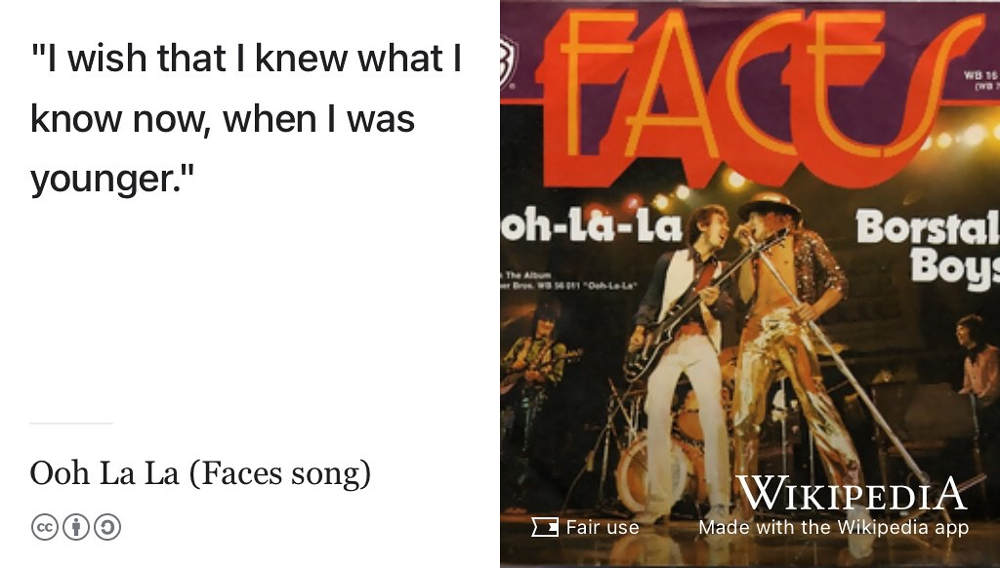

# (PART) CODING {-}

# Hearing your future {#hearing}

*Hearing your Future* is the Coding your Future podcast which accompanies this guidebook. We talk to graduands and graduates of computer science to hear more about their journey from student to professional. What happens after graduation like the one shown in figure \@ref(fig:graduation-fig)? What comes next?

```{r graduation-fig, echo = FALSE, fig.align = "center", out.width = "100%", fig.cap = "(ref:captiongraduation)"}
knitr::include_graphics("images/graduation2.jpeg")
```

(ref:captiongraduation) Silly hat? ✅ Silly frock? ✅ Wearing your best outfit? ✅ It must be time for graduation! What comes next? *Hearing your future* interviews current and former students to find out more about how they got to where they are and where they are going to next. Picture of obligatory hat throwing outside the [Samuel Alexander](https://en.wikipedia.org/wiki/Samuel_Alexander) building in 2018. Photobombing by [Gavin Brown](https://profgavinbrown.github.io/) 🎓

Listen in to the episodes below, or read the transcripts, to find out more about how these students are coding their future:

* What's their story?  
* How did they get to where they are?
* What obstacles have they faced and how did they overcome them?
* Where are they planning to going next?
* What advice would they offer to their former selves and fellow students?

```{r, eval=knitr::is_html_output(excludes = "epub"), results='asis', echo=FALSE}
cat('<iframe title="Libsyn Player" style="border: none" src="https://html5-player.libsyn.com/embed/episode/id/23577479/height/90/theme/custom/thumbnail/yes/direction/forward/render-playlist/no/custom-color/000000/" height="90" width="100%" scrolling="no"  allowfullscreen webkitallowfullscreen mozallowfullscreen oallowfullscreen msallowfullscreen></iframe>')
```

Find out more by listening here or subscribing wherever you get your podcasts...

## Subscribing to your future {#subscribing}

You can subscribe by searching for `Coding your Future` or `Hearing your Future` in your podcast application. You will see the logo shown in figure \@ref(fig:hearing-fig) when you find it, or you can just follow one of the links below to your favourite podcast tool:

* Spotify: [open.spotify.com/show/30p4f1iI8hICkJJmey1bS1](https://open.spotify.com/show/30p4f1iI8hICkJJmey1bS1)
* Apple: [podcasts.apple.com/us/podcast/coding-your-future...](https://podcasts.apple.com/us/podcast/coding-your-future/id1632252996)
* Amazon Music / Audible: [amzn.to/3OOaS0G](https://amzn.to/3OOaS0G)
* Google podcasts: [podcasts.google.com/feed/aHR...](https://podcasts.google.com/feed/aHR0cHM6Ly9mZWVkcy5saWJzeW4uY29tLzI5OTE4OS9yc3M=)
* Deezer: [deezer.com/en/show/3839607](https://www.deezer.com/en/show/3839607)
* Podcast homepage: [codingyourfuture.libsyn.com](https://codingyourfuture.libsyn.com/)

Alternatively you can cut-and-paste the raw `rss` feed URL below into your podcast app:

```md
http://feeds.libsyn.com/299189/rss
```

```{r hearing-fig, echo = FALSE, fig.show = "hold", out.width = "33%", fig.cap = "(ref:captionhearing)"}
knitr::include_graphics(rep("images/Hearing-your-future.png", 3))
```

(ref:captionhearing) *Hearing your future* is the Coding your Future podcast. Subscribe wherever you get your podcasts. Hearing sketch by [Visual Thinkery](https://visualthinkery.com/) is licensed under [CC-BY-ND](https://creativecommons.org/licenses/by-nd/4.0/)

The episodes below have been recorded and are currently in production, podcasts and transcripts will appear here on (ref:podcastlaunch) In the meantime, you can subscribe using the details above and listen to the trailer.

## Episode 5: Sneha Kandane {#ep5}

Interview with Sneha Kandane, see figure \@ref(fig:sneha2-fig) and the transcript and show notes in chapter \@ref(sneha).

```{r sneha2-fig, echo = FALSE, fig.show = "hold", out.width = "33%", fig.cap = "(ref:captionsneha)"}
knitr::include_graphics(rep("images/sneha.jpeg", 3))
```

## Episode 4: Carmen Faura Práxedes {#ep4}

Interview with Carmen Faura Práxedes, see figure \@ref(fig:carmen2-fig) and the transcript and show notes in chapter \@ref(carmen)

```{r carmen2-fig, echo = FALSE, fig.show = "hold", out.width = "33%", fig.cap = "(ref:captioncarmen)"}
knitr::include_graphics(rep("images/carmen.jpeg", 3))
```

## Episode 3: Brian Yim Tam {#ep3}

Interview with Brian Yim Tam, see figure \@ref(fig:brian2-fig) and the transcript and show notes in chapter \@ref(brian)

```{r brian2-fig, echo = FALSE, fig.show = "hold", out.width = "33%", fig.cap = "(ref:captionbrian)"}
knitr::include_graphics(rep("images/brian.jpeg", 3))
```

## Episode 2: Jason Ozuzu {#ep2}

Interview with Jason Ozuzu, see figure \@ref(fig:jason2-fig) and the transcript in chapter \@ref(jason).

```{r jason2-fig, echo = FALSE, fig.show = "hold", out.width = "33%", fig.cap = "(ref:captionjason)"}
knitr::include_graphics(rep("images/jason.jpeg", 3))
```

## Episode 1: Raluca Cruceru {#ep1}

Interview with Raluca Cruceru, see figure \@ref(fig:raluca2-fig) and the transcript and show notes in chapter \@ref(raluca)

```{r raluca2-fig, echo = FALSE, fig.show = "hold", out.width = "33%", fig.cap = "(ref:captionraluca)"}
knitr::include_graphics(rep("images/raluca.jpeg", 3))
```

## Episode $x$: it could be YOU! {#you}
YOUR FUTURE WANTS YOU: Join your future! If you'd like to be interviewed for the show, [get in touch](https://personalpages.manchester.ac.uk/staff/duncan.hull/contact), see figure \@ref(fig:yfnu-fig). Besides interviewing current graduates, I'm interested in speaking to former graduates, especially if you

* completed a placements or internship as undergraduate or postgraduate degree
* consider yourself to be part of a minority group

I'm also interested in speaking to people who graduated a while back, not just this years graduates, but any back to 1965. 🎓 [@babygrowsup]

```{r yfnu-fig, echo = FALSE, fig.show = "hold", out.width = "33%", fig.cap = "(ref:captionyfnu)"}
knitr::include_graphics(rep("images/your-future-wants-you.jpeg", 3))
```

(ref:captionyfnu) Your ~~country~~ future wants YOU. 🫵 If you are a former student of Computer Science who'd like to appear on the show, [get in touch](https://personalpages.manchester.ac.uk/staff/duncan.hull/contact). I'm especially interested to hear from students who did internships or placements before they graduated in Computer Science. Picture adapted from an original public domain image of the [Lord Kitchener Wants You](https://en.wikipedia.org/wiki/Lord_Kitchener_Wants_You) poster by [Alfred Leete](https://en.wikipedia.org/wiki/Alfred_Leete) on Wikimedia Commons at [w.wiki/3xvX](https://w.wiki/3xvX)

If you're preparing to come on the show, please have a think about the following questions:

### What's your story, coding glory? {#your-story}
> “All your dreams are made, when you're chained to [the tracker](https://en.wikipedia.org/wiki/Comparison_of_issue-tracking_systems) and the software trade. What's your story, coding glory?” (with apologies to the Gallagher brothers see figure \@ref(fig:gallagher2-fig))

Wht's your story?

* What's your name and where do you come from?
* Why did you choose to study computer science?
* Which organisation were you employed by, why and how did you choose them
* Tell us about your role in the organisation
* How did you find the job and what other jobs did they look for?
* What were the main things you learned on placement?
* What was the most enjoyable or rewarding part of working for your employer?
* What was the main obstacles you faced finding employment and how did you overcome them?
* What did you do for your final year project?
* What comes next?

```{r gallagher2-fig, echo = FALSE, fig.align = "center", out.width = "100%", fig.cap = "(ref:caption2gallagher)"}
knitr::include_graphics("images/whats-the-story.jpeg")
```

(ref:caption2gallagher) [(What's your Story) ~~Morning~~ Coding Glory?](https://en.wikipedia.org/wiki/(What%27s_the_Story)_Morning_Glory%3F) [@whatsthestory]. CC BY portrait of [Noel Gallagher](https://en.wikipedia.org/wiki/Noel_Gallagher) by [alterna2.com](https://alterna2.com/) on Wikimedia Commons [w.wiki/3bimy](https://w.wiki/3bim) adapted using the [Wikipedia app](https://apps.apple.com/us/app/wikipedia/id324715238)

### Minority report {#minority}
This is an optional question inspired by the [Philip K. Dick](https://en.wikipedia.org/wiki/Philip_K._Dick) novel *[The Minority Report](https://en.wikipedia.org/wiki/The_Minority_Report)* and subsequent film adaptation, see figure \@ref(fig:minority-fig), minority report asks our guests:

* Do you consider yourself to be a member of a minority group?
* If so which one(s), see section \@ref(protected) and \@ref(genderid)?
* What has your experience been of being in a minority at University and in the workplace?
* How can the teaching and learning of computer science be made more [equitable, diverse and inclusive](https://en.wikipedia.org/wiki/Diversity,_equity,_and_inclusion) for members of your minority group(s)?
* What else can universities do to make campuses more welcoming to members of your minority group(s)?
* What more can employers do to make workplaces more welcoming to members of your minority group(s)?

```{r minority-fig, echo = FALSE, fig.align = "center", out.width = "99%", fig.cap = "(ref:captionminority)"}
knitr::include_graphics("images/minority-report.jpeg")
```
(ref:captionminority) *The Minority Report* is short story by Philip K. Dick first published by *[Fantastic Universe](https://en.wikipedia.org/wiki/Fantastic_Universe)* magazine in 1956. Are you in a minority? Inspired by the book [@theminorityreport] and its film adaptation [@minorityreport], we hear from our minorities. What is it like being in minority and how could universities and employers be more welcoming to your minority group(s)? Public domain image of magazine cover by [Ed Emshwiller](https://en.wikipedia.org/wiki/Ed_Emshwiller) via Wikimedia Commons [w.wiki/5Swn](https://w.wiki/5Swn)

### One tune, one podcast and one film {#otopof}

We love our music, films and podcasts and make gratuitous references to them throughout *Coding your Future*. Critics say our playlist is clogged up with:

* [DadRock](https://en.wikipedia.org/wiki/Dad_rock) 🎸
* [cardigan-swinging indie shoegazing](https://en.wikipedia.org/wiki/Shoegaze)
* Lancashire boy bands, especially the Mancs *and* the Scousers [@mancashire]
* other antiquities from a bygone era [@dadrock]

So, can you recommend a:

* **TUNE!** One tune to rejuvenate and freshen up our playlist. Why is it important to you? Perhaps it makes you relax, feel happy or comforted? Maybe it reminds you of special people, a special time or special place in your life? [🤘](https://en.wikipedia.org/wiki/Sign_of_the_horns)
* **PODCAST:** One podcast you’ve enjoyed that you’d recommend our listeners subscribe to 🎧
* **FILM:** One film we’ve got to go and watch right now, old or new 🍿

### Time traveller {#your-time}

Do you wish that you knew what you know now, when you were younger? Just like [Ronnie Lane](https://en.wikipedia.org/wiki/Ronnie_Lane), [Ronnie Wood](https://en.wikipedia.org/wiki/Ronnie_Wood) and [Rod Stewart](https://en.wikipedia.org/wiki/Rod_Stewart), we all probably feel that way sometimes, see figure \@ref(fig:faces2-fig). So, if you could travel back in time to meet the younger you, just starting University:

* What would you tell your former self, now that you are older and wiser?
* What would you tell current students to help them get the most of their preciously short time at University?

```{r faces2-fig, echo = FALSE, fig.align = "center", out.width = "99%", fig.cap = "(ref:captionfaces2)"}

```
(ref:captionfaces2) Poor old grandad I laughed at all his words but I wish that I knew what I know now, when I was younger, see [Ooh La La](https://en.wikipedia.org/wiki/Ooh_La_La_(Faces_song)). [@faces] Do you wish that you knew what you know now, when you were younger? What would you tell your younger self about getting the most from University life?

## Thanks Jez {#jez}
This podcast is inspired and supported by [Jez Lloyd](https://www.linkedin.com/in/jez-lloyd-84077069), host, producer and mastermind of the excellent CS\@Manchester podcast. Thanks Jez! 🙏

```{r, include-url, echo = FALSE, out.width='100%', fig.cap="(ref:captionjez)", dev='png'}
knitr::include_url('https://www.podomatic.com/podcasts/cs-engagement')
```

(ref:captionjez) The CS\@Manchester podcast was produced and hosted by Jez Lloyd and ran from 2015 to 2020. This podcast, *Hearing your future*, is following in all 38 of its audible footsteps, see [podomatic.com/podcasts/cs-engagement](https://www.podomatic.com/podcasts/cs-engagement)
