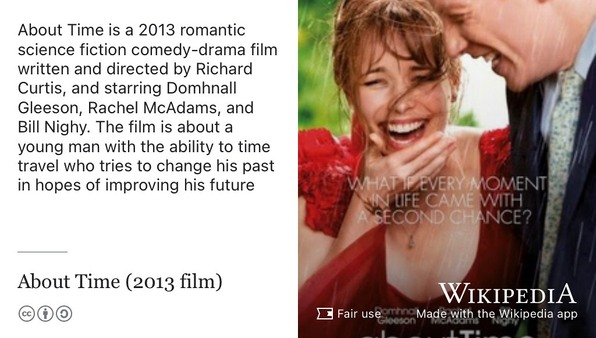
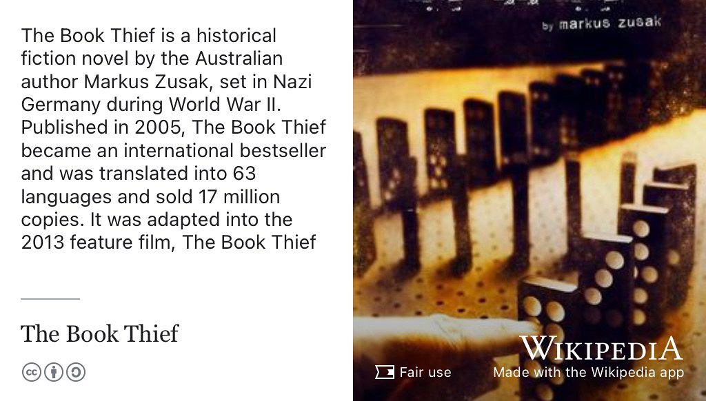
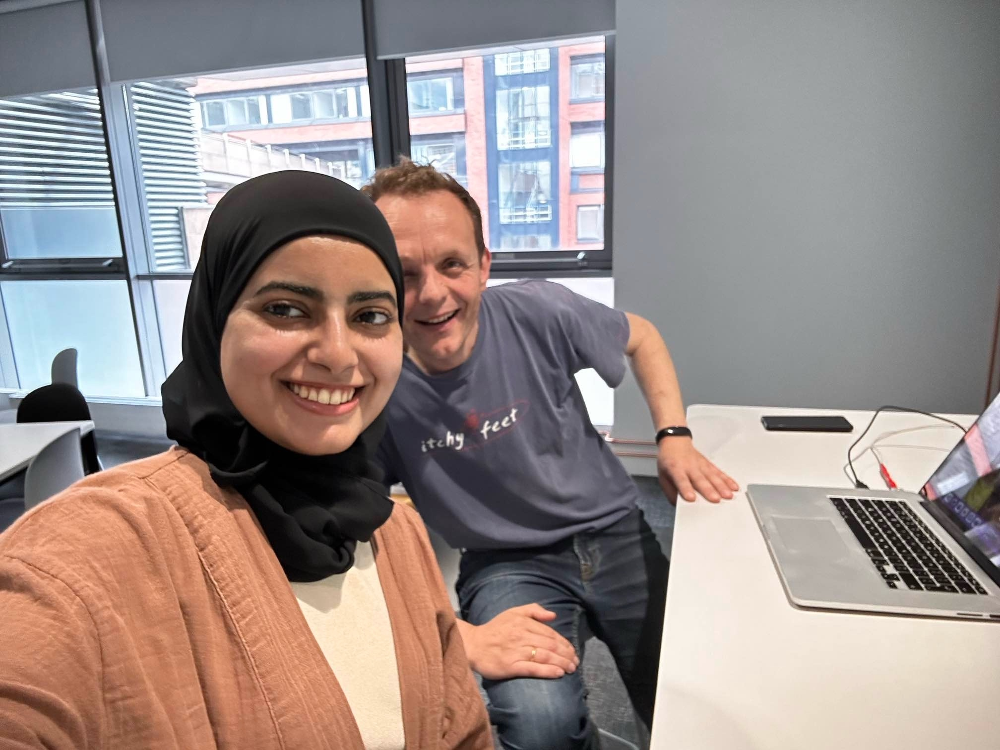

# Asma's Story {#asma}

Meet Asma Alshebli, shown in figure \@ref(fig:asma-fig). Asma graduated with a Bachelor of Science degree in Artificial Intelligence in 2024. During her study, she did an internship at [Abu Dhabi Ports Group](https://en.wikipedia.org/wiki/AD_Ports_Group) and served as Hackathon Director for UNICS: the University of Manchester Computer Science society [unicsmcr.com](https://unicsmcr.com/)

```{r asma-fig, echo = FALSE, fig.align = "center", out.width = "100%", fig.cap = "(ref:captionasma)"}
knitr::include_graphics("images/linkedinasma.jpg")
```
(ref:captionasma) Asma Alshebli [linkedin.com/in/asma-alshebli-86a13a264](https://www.linkedin.com/in/asma-alshebli-86a13a264/). Picture re-used from LinkedIn with permission, thanks Asma.

```{r, eval=knitr::is_html_output(excludes = "epub"), results='asis', echo=FALSE}
cat('<iframe title="Libsyn Player" style="border: none" src="https://html5-player.libsyn.com/embed/episode/id/32383492/height/90/theme/custom/thumbnail/yes/direction/forward/render-playlist/no/custom-color/000000/" height="90" width="100%" scrolling="no"  allowfullscreen="" webkitallowfullscreen="true" mozallowfullscreen="true" allowfullscreen="true" msallowfullscreen="true" style="border: none;"></iframe>')
```

## What's Your Story Asma? {#asma-story}

An edited podcast transcript will appear here in due course. In the meantime highlights from *One Tune, One Book, One Podcast and One Film* shown below.

## One film {#asma-film}

For her film Asma chose *About Time*, see figure \@ref(fig:wikiabouttime-fig).

```{r wikiabouttime-fig, echo = FALSE, fig.align = "center", out.width = "100%", fig.cap = "(ref:captionwikiabouttime)"}

```

(ref:captionwikiabouttime) [About Time](https://en.wikipedia.org/wiki/About_Time_(2013_film)) is a 2013 romantic science fiction comedy-drama film written and directed by Richard Curtis, and starring Domhnall Gleeson, Rachel McAdams, and Bill Nighy. The film is about a young man with the ability to time travel who tries to change his past in hopes of improving his future. ⏱

## One book {#asma-book}

For her book, Asma chose *The Book Thief*, see figure \@ref(fig:wikibookthief-fig).

```{r wikibookthief-fig, echo = FALSE, fig.align = "center", out.width = "100%", fig.cap = "(ref:captionwikibookthief)"}

```

(ref:captionwikibookthief) [The Book Thief](https://en.wikipedia.org/wiki/The_Book_Thief) is a historical fiction novel by the Australian author Markus Zusak, set in Nazi Germany during World War II. Published in 2005, The Book Thief became an international bestseller and was translated into 63 languages and sold 17 million copies. It was adapted into the 2013 feature film, *The Book Thief*. 📚

## Studio Selfie {#asma-selfie}

Asma shared this studio selfie, see figure \@ref(fig:asma-selfie-fig)

```{r asma-selfie-fig, echo = FALSE, fig.align = "center", out.width = "100%", fig.cap = "(ref:captionasmaselfie)"}

```

(ref:captionasmaselfie) A studio selfie, I'm hiding behind Asma because I have a black eye. 🤕

## Graduation {#asma-graduation}

```{r, eval=knitr::is_html_output(excludes = "pdf"), results='asis', echo=FALSE}
cat('<iframe src="https://www.linkedin.com/embed/feed/update/urn:li:share:7216531090906230785" height="857" width="504" frameborder="0" allowfullscreen="" title="Embedded post"></iframe>')
```


## Disclaimer  


::: {.rmdcaution}

(ref:codingcaution)

(ref:transcript-disclaimer)  

:::
