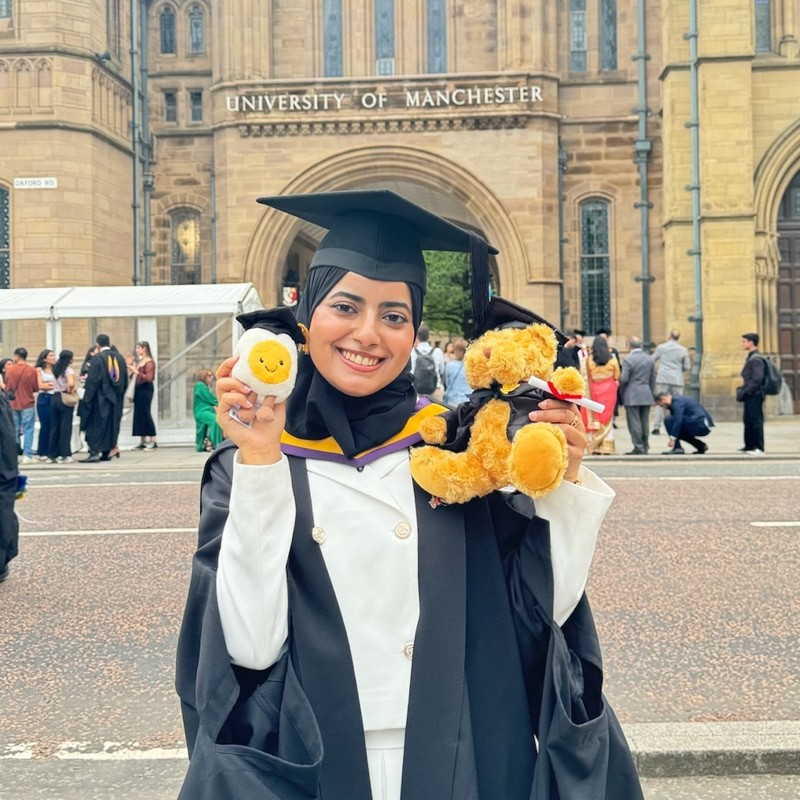

# Asma's Story {#asma}

Meet Asma Alshebli, shown in figure \@ref(fig:asma-fig). Asma graduated with a Bachelor of Science degree in Artificial Intelligence in 2024. During her study, she did an internship at [Abu Dhabi Ports Group](https://en.wikipedia.org/wiki/AD_Ports_Group) and served as Hackathon Director for UNICS: the University of Manchester Computer Science society [unicsmcr.com](https://unicsmcr.com/)

```{r asma-fig, echo = FALSE, fig.align = "center", out.width = "100%", fig.cap = "(ref:captionasma)"}

```
(ref:captionasma) Asma Alshebli [linkedin.com/in/asma-alshebli-86a13a264](https://www.linkedin.com/in/asma-alshebli-86a13a264/). Picture re-used from LinkedIn with permission, thanks Asma.

```{r, eval=knitr::is_html_output(excludes = "epub"), results='asis', echo=FALSE}
cat('<iframe title="Libsyn Player" style="border: none" src="https://html5-player.libsyn.com/embed/episode/id/32383492/height/90/theme/custom/thumbnail/yes/direction/forward/render-playlist/no/custom-color/000000/" height="90" width="100%" scrolling="no"  allowfullscreen="" webkitallowfullscreen="true" mozallowfullscreen="true" allowfullscreen="true" msallowfullscreen="true" style="border: none;"></iframe>')
```

## What's Your Story Asma? {#asma-story}

An edited podcast transcript will appear here in due course. In the meantime highlights from *One Tune, One Book, One Podcast and One Film* shown below.

```{r, eval=knitr::is_html_output(excludes = "pdf"), results='asis', echo=FALSE}
cat('<iframe src="https://www.linkedin.com/embed/feed/update/urn:li:share:7216531090906230785" height="857" width="504" frameborder="0" allowfullscreen="" title="Embedded post"></iframe>')
```


## One book {#asma-book}

For her book

## One podcast {#asma-podcast}

For her podcast 

## One film {#asma-film}

For her film 

## Disclaimer  


::: {.rmdcaution}

(ref:codingcaution)

(ref:transcript-disclaimer)  

:::
