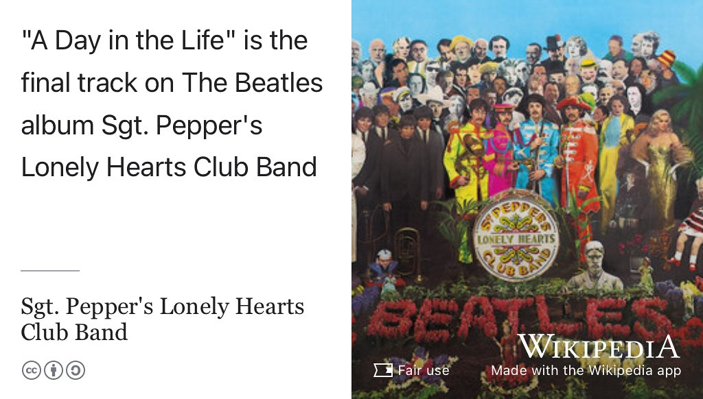

# A Day in the Life of a Software Engineer {#bet365}

Ever wondered what software engineers do all day? Come and find out with a engaging webinar overview of _A Day in the Life of a Junior Software Developer_, details below.

```{r dayinthelife-fig, echo = FALSE, fig.align = "center", out.width = "100%", fig.cap = "(ref:captiondayinthelife)"}

```
(ref:captiondayinthelife) “Woke up, fell out of bed, dragged a comb across my head, found my way downstairs and drank a cup...”  What else does a software engineer do all day? Find out in this webinar with Jonny Breeze. _A Day in the Life_ is the final track of Sgt. Pepper's Lonely Hearts Club Band. [@adayinthelife]

Jonny Breeze [linkedin.com/in/jonny-as-breeze](https://uk.linkedin.com/in/jonny-as-breeze), currently on a year in industry at [bet365.com](http://bet365.com/) from the University of Manchester will be answering questions and speaking through his time so far at bet365 including projects that he has worked on and his personal and professional development.

In addition to this we will be providing advice and guidance for graduates for our interview process and discussing current roles available at bet365 for 2025 Graduates.
 
## Webinar Information
 
Date & Time:  Wednesday 2nd April @ 14:00 on Microsoft Teams
 
The webinar will be an informative session, showcasing the unique experiences and opportunities available for Technology Graduates available at bet365. 

Find out more and register at [bit.ly/a-day-in-the-life-bet365](https://bit.ly/a-day-in-the-life-bet365) (Microsoft form, UoM login required)

