# Steve's story {#steve}

Meet Steve Furber, shown in figure \@ref(fig:steve-fig). Steve graduated with a Bachelor of Arts degree in Mathematics from the University of Cambridge in 1974, followed by a PhD in aerodynamics in 1980 and a Master of Mathematics (MMath) degree awarded 35 years late, in 2010. After ten years working at [Acorn Computers](https://en.wikipedia.org/wiki/Acorn_Computers) on the [BBC Micro](https://en.wikipedia.org/wiki/BBC_Micro) and its successor the [ARM1](https://en.wikipedia.org/wiki/ARM1), he was appointed Professor at the University of Manchester in 1990, where he led a variety of research projects over 33 years culminating in the [SpiNNaker project](https://en.wikipedia.org/wiki/SpiNNaker) which was powered by [arm processors](https://en.wikipedia.org/wiki/ARM_architecture_family). As of 2023, there were more than 250 billion arm designed chips on the planet, **30 for every person currently alive**. [@250billion] Each of these chips uses the same [Reduced Instruction Set Computer](https://en.wikipedia.org/wiki/Reduced_instruction_set_computer) (RISC) architecture pioneered in the design of the ARM1. 


```{r steve-fig, echo = FALSE, fig.align = "center", out.width = "100%", fig.cap = "(ref:captionsteve)"}
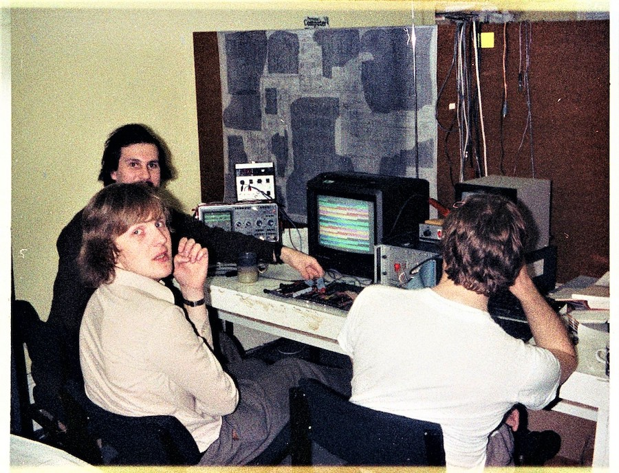
```

(ref:captionsteve) Steve Furber [linkedin.com/in/stevefurber](https://www.linkedin.com/in/stevebfurber/) (bottom left) in 1981 (with Alan Wright behind) debugging wire-wrapped prototypes of the [BBC Micro](https://en.wikipedia.org/wiki/BBC_Micro). Picture re-used with kind permission from [Chris Turner](https://www.linkedin.com/in/cbturner) [@christurner]

His work has been recognised with national and international awards including fellowships of UK's National Academy of Engineering ([FREng](https://en.wikipedia.org/wiki/Fellow_of_the_Royal_Academy_of_Engineering) in 1999) and National Academy of Science ([FRS](https://en.wikipedia.org/wiki/Fellow_of_the_Royal_Society) in 2002). He was appointed a [Commander of the British Empire](https://en.wikipedia.org/wiki/Order_of_the_British_Empire) (CBE) in the [2008 New Year Honours](https://en.wikipedia.org/wiki/2008_New_Year_Honours). [@furberswho] In 2022, he was awarded the Charles Stark Draper Prize by the National Academy of Engineering of the United States, alongside [Sophie Wilson](https://en.wikipedia.org/wiki/Sophie_Wilson), [John L. Hennessy](https://en.wikipedia.org/wiki/John_L._Hennessy) and [David Patterson](https://en.wikipedia.org/wiki/David_Patterson_(computer_scientist)).


After a long and distinguished career, Steve retired at the end of September 2023. The week after, we sat down together, and I asked him *What's your story, Steve*?

(ref:podcastblurb)

```{r, eval=knitr::is_html_output(excludes = "epub"), results='asis', echo=FALSE}
cat('<iframe title="Libsyn Player" style="border: none" src="https://html5-player.libsyn.com/embed/episode/id/29151428/height/90/theme/custom/thumbnail/yes/direction/forward/render-playlist/no/custom-color/000000/" height="90" width="100%" scrolling="no"  allowfullscreen="" webkitallowfullscreen="true" mozallowfullscreen="true" allowfullscreen="true" msallowfullscreen="true" style="border: none;"></iframe>')
```


## What's your story Steve? {#steves-story}

So, welcome Steve. Thank you for coming on the show. Could you introduce yourself and say who you are. 

> Steve: Hello, I'm Steve Furber until a few days ago I was ICL Professor of Computer Engineering, in the Department of Computer Science of the University of Manchester, but I retired a few days ago, so I'm now Professor [Emeritus](https://en.wikipedia.org/wiki/Emeritus).

We can't possibly cover the whole of your career in a short interview like this. So we're having a [FestSchrift](https://en.wikipedia.org/wiki/Festschrift) on Friday 12th of January 2024, I'm going to point people to that in the show notes at the end. [@furbyfest] Instead of talking about the whole of your career, I'd like to focus on key parts of your career. The key decisions you've made in your education early on in your career and significant challenges you faced and how you overcame them. And then to talk about two key projects, one from your early career, the [BBC Micro](https://en.wikipedia.org/wiki/BBC_Micro) [@Fitzpatrick2011] and then one from your later career: [SpiNNaker](https://en.wikipedia.org/wiki/SpiNNaker), see figure \@ref(fig:spinnaker-vid) [@Furber2013] and it's successors. 

```{r spinnaker-vid, echo = FALSE, fig.align = "center", out.width = "99%", fig.cap = "(ref:captionspinvid)"}
knitr::include_url('https://www.youtube.com/embed/V3MlOAru6Qk')
```

(ref:captionspinvid) In 2018, SpiNNaker 1 was the world's largest neuromorphic computing platform with over one million cores. This 6 minute video outlining the project, was made by Petruț Bogdan, a former PhD student supervised by Steve [@petrutphd], and can also be watched at [youtu.be/V3MlOAru6Qk](https://youtu.be/V3MlOAru6Qk). [@spinnaker-video]


## Manchester Grammar School {#mgs}

We have to go right back to the beginning. So I always ask students, as the audience is mostly computer science students, I always ask them *why* they studied computer science but you *didn't* study computer science initially, you studied mathematics as a student at [Manchester Grammar School](https://en.wikipedia.org/wiki/Manchester_Grammar_School) (MGS), just down the road here in ~~Fallowfield~~ [Rusholme](https://en.wikipedia.org/wiki/Rusholme). What was it that made you think that you want to spend three or four years of your life studying mathematics as an undergraduate? 

> Steve: I've always had an affinity for mathematics, if you go through my old school reports they generally improve as I drop other subjects and focus on the mathematics. **Maths is the only sport I've played for my country** (see figure \@ref(fig:mathsport-fig)) so I was on the British team at the [International Mathematical Olympiad](https://en.wikipedia.org/wiki/International_Mathematical_Olympiad) in Hungary in 1970. So it's very natural for me to stick with mathematics when it came to choosing a university course.

```{r mathsport-fig, echo = FALSE, fig.align = "center", out.width = "100%", fig.cap = "(ref:captionmathsport)"}
knitr::include_graphics("images/mathsport.jpeg")
```

(ref:captionmathsport) Maths is the only sport that Steve has played for his country, as a competitor in the [International Mathematical Olympiad](https://en.wikipedia.org/wiki/International_Mathematical_Olympiad) in Hungary in 1970.  CC BY-SA portrait of Steve Furber by Peter Howkins on Wikimedia Commons [w.wiki/544E](https://w.wiki/544E) adapted using the [Wikipedia app](https://apps.apple.com/us/app/wikipedia/id324715238)


I guess you must have had some good maths teachers at Manchester Grammar (see figure \@ref(fig:mgs-fig)) who encouraged and inspired you do things like go to Olympiads and the like? 

> Steve: Yes, I mean, MGS entered all the mathematicians in the National Mathematics contest which was if you like the first selection process for the British team. Obviously we had experienced teachers who were very used to teaching people who are good at maths and I appreciated my time at MGS greatly. 

```{r mgs-fig, echo = FALSE, fig.align = "center", out.width = "100%", fig.cap = "(ref:captionmgs)"}

```
(ref:captionmgs) The [Manchester Grammar School](https://en.wikipedia.org/wiki/Manchester_Grammar_School) (MGS) is the largest private day school for boys in the United Kingdom. Founded in 1515 as a free grammar school next to Manchester Parish Church, it moved in 1931 to its present site at Rusholme. Public domain image of MGS logo from Wikimedia Commons [w.wiki/8Rer](https://w.wiki/8Rer) adapted using the [Wikipedia app](https://apps.apple.com/us/app/wikipedia/id324715238)


Yeah. Okay good, and then so you graduated in what year? 

> Steve: 1974

So you graduated in 1974 from the University of Cambridge, was it a BA or an MMath? Was it a Bachelors or a Master's degree? 


> Steve: It was a BA (Bachelor of Arts).

That's obviously is an important decision point in your life, is you decided to stay on and do a PhD. What was it that made you stay to do postgraduate study? 

> Steve: In the first instance, I stayed on to do the one year [part III Maths course](https://en.wikipedia.org/wiki/Part_III_of_the_Mathematical_Tripos) which was a single postgraduate year and which at that time did not earn you any specific qualification. But 35 years later, the University of Cambridge decided, the part three maths *was* worth masters after all, and I went back in 2010 to receive my MMath ([Master of Mathematics](https://en.wikipedia.org/wiki/Master_of_Mathematics)) degree. OK, so that part three years which was 74 to 75 But in the course of that, I always lent towards the applied side of maths, and in my part three work I did a project with Sir [James Lighthill](https://en.wikipedia.org/wiki/James_Lighthill) who was well-known character, see figure \@ref(fig:lighthill-fig). His name is around the University (of Manchester). If you look at the right building, his name is on one of them. [@lighthillbuilding] And at the time he was, I think [Lucasian professor at Cambridge](https://en.wikipedia.org/wiki/Lucasian_Professor_of_Mathematics) and he got very interested in studying the application of mathematics in biology in particular in flight. And my part three project was with him on the intermittent flight of birds, which is why particularly small birds when they're flying long distances flap their wings for a bit and then fold them up and then fly as [projectiles](https://en.wikipedia.org/wiki/Projectile) before flapping them a bit more.

```{r lighthill-fig, echo = FALSE, fig.align = "center", out.width = "100%", fig.cap = "(ref:captionlighthill)"}
knitr::include_graphics("images/james-lighthill.jpeg")
```
(ref:captionlighthill) James Lighthill was a British applied mathematician, known for his pioneering work in the field of aeroacoustics and for writing the [Lighthill report](https://en.wikipedia.org/wiki/Lighthill_report) which pessimistically stated that "*In no part of the field (of AI) have the discoveries made so far produced the major impact that was then promised*". Fair use portrait of James Lighthill adapted using the [Wikipedia app](https://apps.apple.com/us/app/wikipedia/id324715238).


> Steve: And my part three projects was to try and understand the energetics of that style of flying and Why it's good thing to the birds to do. Um, so through that, I got to know a bit more about the kind of work that was going on in the more theoretical end of aerodynamics in the engineering department and I had a long interest in flying. I flew model aeroplanes as a boy and Somewhat later in life. And and so the idea of going into PhD related to to flying was very attractive. Now, my supervisor, who was Professor [John Ffowcs Williams](https://en.wikipedia.org/wiki/John_Ffowcs_Williams). He had regularly offered a course in part three maths, but he didn't actually offer that year but I knew about it from previous years. And that was clearly an area that was going to be interesting. So I went to talk to him about PhD and was accepted. 

Right. So that was in 1980 or was it 1979?

> Steve: I started the PhD in '75. So the basic PhD period was 75 to 78 and then I had a research fellowship at [Emmanuel (College, Cambridge)](https://en.wikipedia.org/wiki/Emmanuel_College,_Cambridge) which was effectively a continuation of the PhD. I was Rolls Royce research fellow at Emmanuel College. 

Kind of like a [postdoc](https://en.wikipedia.org/wiki/Postdoctoral_researcher) I guess?

>Steve: 78 to 81. Well, the [research fellowship](https://en.wikipedia.org/wiki/Research_fellow) is similar to research fellowships that you can get from [EPSRC](https://en.wikipedia.org/wiki/Engineering_and_Physical_Sciences_Research_Council) or from the [Royal Academy of Engineering](https://en.wikipedia.org/wiki/Royal_Academy_of_Engineering) but in Cambridge the colleges offer research fellowships and these are effectively postdoc research positions that are paid, they come with a salary and they also are fellowships of the college. So you sit on the governing body of the college as research fellow. 

Right? Okay. So your your PhD was on aerodynamics, the title was *[Is the Weis-Fogh principle exploitable turbo machines?](https://dx.doi.org/10.17863/CAM.11472)* [@furberphd] So when I read that initially, I thought that sounded like something purely mathematical and [fluid mechanics](https://en.wikipedia.org/wiki/Fluid_mechanics) but looking at it in a bit more depth, it looks like there was, you mentioned the biologically inspired work of looking at how birds fly and how insects fly but it looks like there was actually experimental applied stuff in that PhD. So can you tell us a little bit about that?

> Steve: Yes. So [Torkel Weis-Fogh](https://en.wikipedia.org/wiki/Torkel_Weis-Fogh) (see figure \@ref(fig:torkel-fig)) was professor of biology at Cambridge at the time and he studied in detail the way different sorts of animals fly and he'd observed that one particularly small insect had an unusual flying motion, where instead of just flapping its wings back and forth, It appeared to [clap them together](https://en.wikipedia.org/wiki/Clap_and_fling), at least at one end of the motion. And [James Lighthill](https://en.wikipedia.org/wiki/James_Lighthill) had picked up on this and done the mathematical analysis and showed that by clapping its wings together, or more, particularly by peeling them apart this generated air flow around the wings that got the wings generating lift quicker than if they just move forward in free air. So that was the Weis-Fogh principle. My PhD seeing whether one could create a similar effect in the compression stages of jet engine. In the jet engine, you have alternating rows of blades, rotors and [stators](https://en.wikipedia.org/wiki/Stator). Well, as the name suggests the rotors, rotate and the stators don't. They are fixed. And you have multiple rows of each interleaved and my PhD was looking at the interaction, if you put the rotors, very close to the stators to increase the interaction, which was traditionally thought of as a bad thing, could you exploit this Weis-Fogh principle to actually make it a good thing and and get those blades to work more efficiently in some way by making them interact rather than what was usually done, which was trying to minimise the interaction.

```{r torkel-fig, echo = FALSE, fig.align = "center", out.width = "100%", fig.cap = "(ref:captiontorkel)"}
knitr::include_graphics("images/torkel-weis-fogh.jpeg")
```


(ref:captiontorkel) [Torkel Weis-Fogh](https://en.wikipedia.org/wiki/Torkel_Weis-Fogh) was a Danish zoologist and Professor at the University of Cambridge and the University of Copenhagen. He is best known for his contributions to the understanding of insect flight, especially the [clap and fling](https://en.wikipedia.org/wiki/Clap_and_fling) mechanism used by very small insects. Fair use portrait of Weis-Fogh from Wikimedia Commons [w.wiki/8Unj](https://w.wiki/8Unj) adapated using the [Wikipedia app](https://apps.apple.com/us/app/wikipedia/id324715238)

So I suppose part of the PhD was a proof of concept to prove this would actually work in practise by actually building a model and then modelling it mathematically as well?

> Steve: Yes, the core of the PhD was a mathematical model, which was very much a development of Lighthills model of the insect interaction but it was obviously physically different and requires slightly different modelling. But that was backed up by doing some experiments at the [Whittle lab in Cambridge](https://en.wikipedia.org/wiki/Whittle_Laboratory), which is the lab setup I think with support from Rolls-Royce to research into jet engines 

Like an engineering lab with you know, proper hardware. I'm thinking, not a computational lab, not a computer?

> Steve: No, no, it's a lab full of heavy equipment and in my particular case, the first bit of equipment I used ran blades. So rows of rotors and stator blades. It's just a single row of each. But in a closed circuit water system. So it's using water as the medium rather than air and that's a way of I think of getting a more appropriate [Reynolds number](https://en.wikipedia.org/wiki/Reynolds_number) at small scale and the low cost (see figure \@ref(fig:reynolds-fig)). You want to do things in air in jet engines, its quite expensive because you have to run things at a close to the speed of sound and someone to get realistic operation. Whereas in water you can do it on a much smaller scale and much cheaper. 

```{r reynolds-fig, echo = FALSE, fig.align = "center", out.width = "100%", fig.cap = "(ref:captionreynolds)"}
knitr::include_graphics("images/reynolds-number.jpeg")
```

(ref:captionreynolds) In fluid mechanics, the [Reynolds number](https://en.wikipedia.org/wiki/Reynolds_number) is a dimensionless quantity that helps predict fluid flow patterns in different situations by measuring the ratio between inertial and viscous forces. CC BY-SA picture of the plume from a candle flame changing from laminar to turbulent flow by Gary Settles on Wikimedia Commons [w.wiki/8YWo](https://w.wiki/8YWo) adapated using the [Wikipedia app](https://apps.apple.com/us/app/wikipedia/id324715238) 🕯️


Right, Okay, so what were the main challenges you faced in your PhD and how did you overcome them? 

> Steve: I think doing the maths was, you know, relatively straightforward. That was what I did and using mathematics to analyse fluid flows is a very well developed field of research. There are very interesting analogies between the way a purist model of fluids works and a complex number theory in the complex plane, okay? Um, and this is being used a probably 100 years to compute efficient aerofoil shapes and so on. It is only an approximation because it's assuming the fluid is [inviscid](https://en.wikipedia.org/wiki/Inviscid_flow), which real fluids are not, but at least it's a good start. So the mathematics, although not trivial, was what I was comfortable with. **I think my biggest challenge doing a PhD was actually being confident that what I was doing, was at all important or relevant or would go anywhere,** right? And so I could do the mechanics of the PhD but I wasn't very good on the context and my supervisor encouraged me to attend an annual British mathematical colloquium and I think present my work there and that was quite forbidding, I didn't sort of feel like I really got my feet on the ground. I didn't really know enough about what was going on in my area research to really be able to place myself, confidently in that stage. **So, I think my biggest challenge was probably confidence.** 

As somebody who has now supervised countless PhD students, well not countless. But how many PhD students? 

> Steve: As a mathematician I cannot allow you to use the word countless in that context! It's definitely countable. It's just over 30 [Thirty PhD students, actually 36 to be precise]

Okay, so you must have seen all sorts of, supervised all sorts of PhD students and come across very similar problems. 

> Steve: Yes. Oh, yes. 

Putting their work in context, whether it's publishing a journal or going to a conference or whatever it might be.

>Steve: absolutely, I think it's probably the most common psychological challenge that PhD students face, is going from you know, effectively doing what they are told in class reproducing it in an exam as an undergraduate to basically going out and working on their own with hopefully some support and mentorship from their PhD supervisor. Having *any* idea as to whether what they're doing is worth doing, 

Yes Okay. 

> Steve: And whether they can move it forward for enough in the very limited time allowed for a UK PhD

So for you personally, how did you develop that sort of confidence or self-efficacy or I don't quite what to call it? How did you do it in your particular context? Was it just a jumping in and just doing it?


> Steve: I don't think I really did develop the confidence at that stage even with the research fellowship, I think I was still a bit unsure about my position in the world of fluid dynamics. And that was probably one of the reasons why at the end of my research fellowship, I decided to move into industry with Acorn Computers.

## Acorn Computers {#acorn}

Right? Okay. So, that gets us from maths to computing and I think that you had some exposure to computing in your PhD. I guess? So, like many people of my generation, the [BBC micro](https://en.wikipedia.org/wiki/BBC_Micro) which you and [Sophie Wilson](https://en.wikipedia.org/wiki/Sophie_Wilson) (see figure \@ref(fig:sophie-wilson-fig)) designed was my (and millions of other people's [@usborne]) introduction to computing. So what was your BBC micro equivalent? What was your first exposure to  computing that sparked an interest? 


```{r sophie-wilson-fig, echo = FALSE, fig.align = "center", out.width = "100%", fig.cap = "(ref:captionsophie)"}
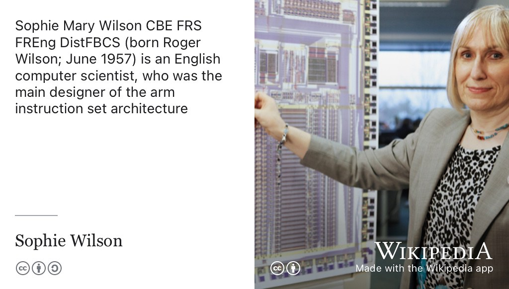
```

(ref:captionsophie) [Sophie Wilson](https://en.wikipedia.org/wiki/Sophie_Wilson) is an English computer scientist, who was the main designer of the arm [instruction set architecture](https://en.wikipedia.org/wiki/Instruction_set_architecture) (ISA). In 2022, she was awarded the [Charles Stark Draper Prize](https://en.wikipedia.org/wiki/Charles_Stark_Draper_Prize) by the United States National Academy of Engineering alongside  Steve Furber, David A. Patterson and John L. Hennessy for contributions to the invention, development and implementation of reduced instruction set computer (RISC) chips. CC-BY-SA portrait of Sophie Wilson by Chris Monk on Wikimedia Commons [w.wiki/8T6N](https://w.wiki/8T6N) adapted using the [Wikipedia app](https://apps.apple.com/us/app/wikipedia/id324715238)


> Steve: Well, interestingly, I had some exposure to computing at school. So my last year or so at [mgs.org](https://www.mgs.org/) one of the teachers took computing classes. And we learnt I think it must be [Fortran](https://en.wikipedia.org/wiki/Fortran) at the time. 

On what kind of hardware? 

> Steve: We used the computers at Imperial College in London as I recall if I'm remembering this, right, it is quite a long time ago! And the way we fed this computer it was, we had [pre-punched 80 column cards](https://en.wikipedia.org/wiki/Punched_card). Okay. Now in those days, 80 column cards were very standard ways of feeding data into computers, But we didn't even have a card punch. So we had these pre-punched cards and they only pre-punched, every other column so effectively, there were 40 columns (see figure \@ref(fig:punched-card-fig)). And you could push the little squares out of these cards with a pencil or a sharp instrument to enter your program into this card. And of course a simple program would be a few tens of these cards. All carefully manually, punched out and then they will be posted to Imperial and two weeks later, the computer line printer outputs would come back. Um, you know saying `syntax error on line three`!

```{r punched-card-fig, echo = FALSE, fig.align = "center", out.width = "100%", fig.cap = "(ref:captionpunchedcard)"}
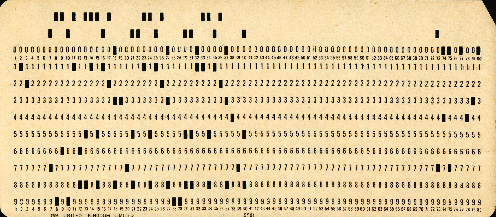
```

(ref:captionpunchedcard) A twelve-row and eighty-column IBM [punched card](https://en.wikipedia.org/wiki/Punched_card) from the mid-twentieth century, punched cards like this were Steve's introduction to Computing as a student in high school. CC BY image by Peter Birkinshaw on Wikimedia Commons [w.wiki/4icp](https://w.wiki/4icp)

Right. Yeah, yeah. 
 
> Steve: You learnt how to code carefully and the debug cycle was very long. And I don't remember anything about the programs that I wrote, but that was my introduction and then in my math course, I think in our second year, we had some exposure to computers. The Maths department had some [Modular One computers](https://www.computinghistory.org.uk/det/15946/Modular-One-User-Manual/) which probably nobody's ever heard of. I do remember these used storage [oscilloscope](https://en.wikipedia.org/wiki/Oscilloscope) tubes as their output medium, right, these respond to they would write on the screen and and that would stay visible until you needed to start again and then you'd flash erase the whole screen. There's like flash memory and there's a screen and you get output from that. But the real start of my computing came probably in 77/78. As I've said I was interested in aviation, I tried to join the [University glider club](https://www.cugc.org.uk/) in my second year but it took too much time for too little flying so I began to think about [flight simulators](https://en.wikipedia.org/wiki/Flight_simulator) and then I heard about a bunch of students who were starting a university society called the Cambridge University Processor Group and I thought okay, these people think they can build computers, maybe that's how I build a flight simulator. So I joined the processor group and started ordering microchips from California (e.g. 8-bit [Signetics 2650](https://en.wikipedia.org/wiki/Signetics_2650)), which is extremely scary in those days ordering by credit card from the far side of the world and hand building computers. [@furberqueue] 

Right? but then you were using them in your PhD for logging data or is that a separate thread? 

> Steve: No, no, the computers blended with my PhD. I used them for data logging from some of the experiments I did particularly later on but I also used the computer I hand built to write my PhD thesis (see figure \@ref(fig:furber-computer-fig)). So in those days if you wanted to write a PhD thesis on the computer, first, you have to hand-make the computer, then you had to write a suitable text editor for writing your thesis on and then you had to print it off and, and because my thesis was mathematical, I needed both Roman and Greek characters. 

```{r furber-computer-fig, echo = FALSE, fig.align = "center", out.width = "100%", fig.cap = "(ref:captionfurbercomputer)"}
knitr::include_graphics("images/furbercomputer.jpg")
```

(ref:captionfurbercomputer) Steve's home-built computer, the 2-level rack behind the keyboard, was used to log data in the [Whittle laboratory](https://en.wikipedia.org/wiki/Whittle_Laboratory) and subsequently write his thesis. It became a test-bed for some of the key concepts behind the [BBC Micro](https://en.wikipedia.org/wiki/BBC_Micro). Picture reproduced from PhD thesis with permission. [@furberphd]

Right? 

> Steve: The University had a twin track [Daisy wheel printer](https://en.wikipedia.org/wiki/Daisy_wheel_printing), see figure \@ref(fig:daisy-fig). Who remembers Daisy wheel printers? The idea was it had a thing called the Daisy wheel which had you know, a number of petals where each petal had the character on. And this wheel ran around at high speed and a solenoid banged at the right moment to print the characters on the paper and this twin Daisy wheel had two of these one with Roman alphabet and one with greek. And my PhD thesis was printed on the continuous roll of paper about 200 feet long. 

```{r daisy-fig, echo = FALSE, fig.align = "center", out.width = "100%", fig.cap = "(ref:captiondaisy)"}
knitr::include_graphics("images/Daisywheel.jpeg")
```

(ref:captiondaisy) [Daisy wheel printers](https://en.wikipedia.org/wiki/Daisy_wheel_printing) were used in electronic typewriters, word processors and computers from early seventies. The daisy wheel is so named because of its resemblance to the flower of the common daisy *[Bellis perennis](https://en.wikipedia.org/wiki/Bellis_perennis)*. CC BY-SA picture of Xerox Daisywheel by Pointillist from Wikimedia Commons [w.wiki/8Z2g](https://w.wiki/8Z2g) adapted using the [Wikipedia app](https://apps.apple.com/us/app/wikipedia/id324715238) 

All right, so it wasn't the traditional approach then might have been to write it down on paper and then give it to somebody to type up. I guess that's what other people would have done? 

> Steve: That was normal at the time yes, your thesis would be hand-written and then you'd find a secretary who would translate your handwritten writing and type it up on paper. 

But you built your own machine to print your thesis? 


> Steve: In fact I built my own machine, I entered my thesis into this text editor was a little bit fragile. It didn't have any proper detection for [buffer overruns](https://en.wikipedia.org/wiki/Buffer_overflow) so, changing too much at once, was a bad idea. But, I then transferred the text file onto a university computer, which was a [Computer Automation](https://en.wikipedia.org/wiki/Computer_Automation) LSI4 Using eight inch [floppy disks](https://en.wikipedia.org/wiki/Floppy_disk), see figure \@ref(fig:floppy-fig).

```{r floppy-fig, echo = FALSE, fig.align = "center", out.width = "100%", fig.cap = "(ref:captionfloppy)"}
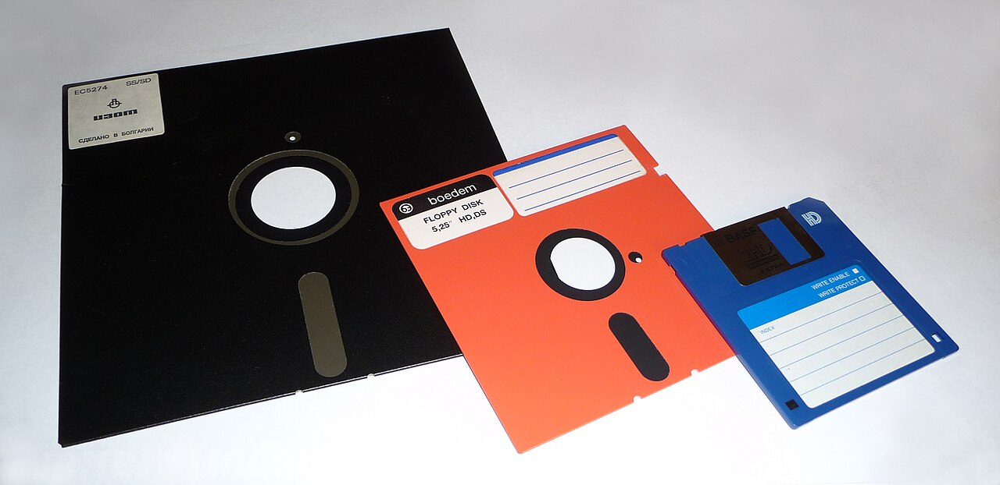
```
(ref:captionfloppy) Before the widespread adoption of the web, cloud computing and USB sticks, one of the easiest ways to move data and software around was using [floppy disks](https://en.wikipedia.org/wiki/Floppy_disk) like these 8-inch, 5¼-inch and 3½-inch disks. Public domain image of floppy disks by George Chernilevsky on Wikimedia Commons [w.wiki/8b42](https://w.wiki/8b42) 💾

right? 

> Steve: I think I still have the eight inch floppy with my thesis but on I don't think I know where I would go to read one. And then the other side, allowed me to transfer to a floppy which could then be taken along to print on this daisy wheel printer. 

Okay, good. So that's where the computing comes from then. So you mentioned Acorn, computers, something followed on from your Fellowship and last year in 2022, yourself [Sophie Wilson](https://en.wikipedia.org/wiki/Sophie_Wilson) (see figure \@ref(fig:sophie-wilson-fig)), [John Hennessy](https://en.wikipedia.org/wiki/John_L._Hennessy) (see \@ref(fig:john-hennessy-fig)), [David Patterson](https://en.wikipedia.org/wiki/David_Patterson_(computer_scientist)) (see figure \@ref(fig:david-patterson-fig)) were awarded the [Charles Stark Draper prize](https://en.wikipedia.org/wiki/Charles_Stark_Draper_Prize) from the [National Academy of Engineering](https://en.wikipedia.org/wiki/National_Academy_of_Engineering) of the United States for **Contributions to invention development and implementation of the Reduced Instruction Set Computer (RISC) chips** (see figure \@ref(fig:nae-vid)). So can you describe where and how that architecture came about, and what motivated it? We've fast forwarded a little bit to after your PhD, working at Acorn Computers. 

```{r john-hennessy-fig, echo = FALSE, fig.align = "center", out.width = "100%", fig.cap = "(ref:captionhennessy)"}
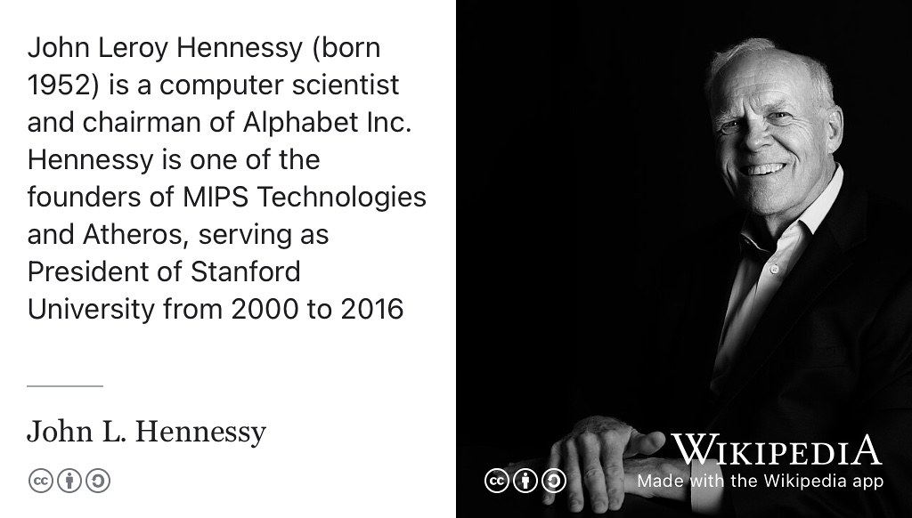
```

(ref:captionhennessy) [John Hennessy](https://en.wikipedia.org/wiki/John_L._Hennessy) is an American computer scientist who has served as chairman of Alphabet Inc, Professor and President of Stanford University and was a cofounder of [MIPS Technologies](https://en.wikipedia.org/wiki/MIPS_Technologies). In 2022, he was awarded the [Charles Stark Draper Prize](https://en.wikipedia.org/wiki/Charles_Stark_Draper_Prize) by the National Academy of Engineering of the United States alongside Steve Furber, David Patterson and Sophie Wilson for contributions to the invention, development, and implementation of Reduced Instruction Set Computer (RISC) chips. CC-BY portrait of John L. Hennessy in 2007 by Eric Chan on Wikimedia Commons [w.wiki/8TTb](https://w.wiki/8TTb) adapted using the [Wikipedia app](https://apps.apple.com/us/app/wikipedia/id324715238) 🇺🇸


> Steve: Yes. So the simplified story here is that is that RISC was created invented expounded by John Hennessy and David Patterson in the USA [@hennesseyandpatterson] and Sophie and I used that concept in the ARM processor, which turned RISC into a very big thing, at Acorn. So, this is one of these rare occasions where some academic research in the US gets commercialised in the UK rather than the other way around which is much more common. The Acorn had developed the BBC micro, which had succeeded way beyond anybody's expectations. It was beginning to think about, what it could do to follow on, to build on that success. At that time, the BBC micro used in 8-bit microprocessor of the [6502](https://en.wikipedia.org/wiki/MOS_Technology_6502). The same as the one used in the [Apple II](https://en.wikipedia.org/wiki/Apple_II) and the [Commodore PET](https://en.wikipedia.org/wiki/Commodore_PET) and a whole lot of another stuff. But the world was beginning to transition to 16 bit micro processors and if you remember the BBC Micro well enough, you know that it's had the capability of having a second processor plugged onto it. And we prototyped a whole lot of 16 bit systems with using the second processor capability. It was very easy to build a second processor with a random microprocessor on the BBC Micro and we didn't like any of them. The reason we didn't like them, there were two technical reasons and one of which was their real-time performance, their ability to [handle interrupts](https://en.wikipedia.org/wiki/Interrupt), for example, for managing disc transfers, in every case was worse than the 6502. 

```{r david-patterson-fig, echo = FALSE, fig.align = "center", out.width = "100%", fig.cap = "(ref:captionpatterson)"}
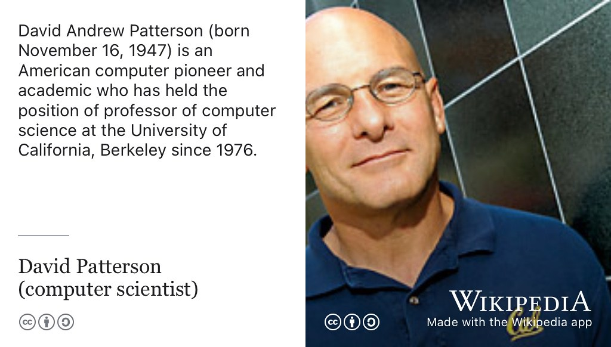
```

(ref:captionpatterson) [David Patterson](https://en.wikipedia.org/wiki/David_Patterson_(computer_scientist)) is Emeritus Professor of Computer Science at the University of California, Berkeley. In 2022, he was awarded the Charles Stark Draper Prize by the National Academy of Engineering of the United States alongside Steve Furber, Sophie Wilson and John Hennessy for contributions to the invention, development, and implementation of Reduced Instruction Set Computer (RISC) chips. CC BY-SA portrait of David Patterson in 2007 by Peg Skorpinski on Wikimedia Commons [w.wiki/8TZd](https://w.wiki/8TZd) adapted using the [Wikipedia app](https://apps.apple.com/us/app/wikipedia/id324715238) 🇺🇸

Right

> Steve: and the reason for this was because they had [complex instructions](https://en.wikipedia.org/wiki/Complex_instruction_set_computer) (CISC), which were typically not interruptible. So I remember the [National Semiconductor](https://en.wikipedia.org/wiki/National_Semiconductor) [32016](https://en.wikipedia.org/wiki/NS32000#32016) had a **memory-memory divide** instruction which took 360 clock cycles to complete, what was six megahertz, so that's 60 microseconds. Well, a single density floppy at the time produced a byte of data, every 64 microseconds, double density, every 32. So you couldn't handle double density floppies without external hardware support. So that was one thing we didn't like, the real time response, and the second thing was, we've come to the firm view that the thing that was the principle determinant to computer performance, was the processors ability to use memory bandwidth.

Alright. 

> Steve: And the memory was the most expensive component in these computers. 

On the model A BBC Micro there was 16 kilobytes.

> Steve: The model A was 16, but mainly what was sold was those which have 32 (kilo)bytes of RAM. And we work that memory very hard, in fact, the BBC micro was pushing the memory, we got the first memories in the country capable of running a 4 Mega-accesses a second. Now, the 16-bit processors I'm complaining about couldn't even keep up with their memories. So as a user, you pay for this expensive memory and then the processor wasn't using it fully.


```{r bbc-micro-cake-fig, echo = FALSE, fig.align = "center", out.width = "100%", fig.cap = "(ref:captionbbcmicrocake)"}
knitr::include_graphics("images/bbc-micro-cake.jpeg")
```
(ref:captionbbcmicrocake) Designed with education in mind, the [BBC Micro](https://en.wikipedia.org/wiki/BBC_Micro) was widely used in UK schools to teach computer literacy. CC BY-SA portrait of some of the BBC micro team (from left to right) Sophie Wilson, Chris Turner, Steve Furber, [Chris Serle](https://en.wikipedia.org/wiki/Chris_Serle), [Hermann Hauser](https://en.wikipedia.org/wiki/Hermann_Hauser) and [Chris Curry](https://en.wikipedia.org/wiki/Christopher_Curry_(businessman)), (just out of picture) celebrating the machines 30th anniversary in 2012 by Trevor Johnson on Wikimedia Commons [w.wiki/8Yth](https://w.wiki/8Yth) adapted using the [Wikipedia app](https://apps.apple.com/us/app/wikipedia/id324715238) 🇬🇧

Right

> Steve: This frustrated us because we couldn't see why it should be the case and then we heard about the RISC research particularly from [Berkeley](https://en.wikipedia.org/wiki/University_of_California,_Berkeley) but also [Stanford](https://en.wikipedia.org/wiki/Stanford_University). Some of the Berkeley work was led by David Patterson and Stanford work by John Hennessy. And they use the postgrad class to develop a novel style of processor in a year. Where, as we were talking to the big companies such is [Nat Semi](https://en.wikipedia.org/wiki/National_Semiconductor), which we're on the sort of eighth revision of the [32016](https://en.wikipedia.org/wiki/NS32000) and they still hadn't got the bugs out years later. And, and we thought, well, if this postgrad class can design a working processor, then maybe we can? And that is what kicked Sophie (Wilson) in the first instance, and I got drawn into thinking about designing a RISC architecture. So, we had a lot of experience writing the basic interpreter for the Beeb and the [Acorn Atom](https://en.wikipedia.org/wiki/Acorn_Atom). And a very good understanding of what high level language is needed and so combining that with these new RISC ideas from California, Sophie (Wilson) did the [instruction set architecture](https://en.wikipedia.org/wiki/Instruction_set_architecture) I did the [microarchitecture](https://en.wikipedia.org/wiki/Microarchitecture) and we had a team of chip designers who took the microarchitecture and mapped it on to Silicon

Right? OK. 

> Steve: And that's how the ARM **(ARM1)** emerged and it was 18 months from starting to first chip on **April the 26th 1985**. That's a date imprinted on my memory, you can tell, as the first chip worked and did everything be expected. It was 25 times faster than the BBC Micro simply because we knew what the memory bandwidth was and we could design it to have 25 times the memory bandwidth

And that was then used in successors to the BBC micro. 

> Steve: Yes in fact because the ARM was designed as one of the one chip in the four chip set. It wasn't until 1987 that the first product was launched. And that was by then we have the second ARM, the [ARM2](https://en.wikipedia.org/wiki/ARM2). So the first volume product was ARM2 based. We did sell second processor for the BBC Micro, based on ARM1 but they were really development engines rather than fully fledge products 

Right? Okay. So last Friday (29th September 2023), we had a small gathering to celebrate your retirement and you mentioned the estimate, the number of units that Acorn Computers estimated that they might sell of these BBC micros. What was their estimate? And how many did you sell?

```{r nae-vid, echo = FALSE, fig.align = "center", out.width = "99%", fig.cap = "(ref:captionnaevid)"}
knitr::include_url('https://www.youtube.com/embed/fHk7e0DBSwg')
```

(ref:captionnaevid) In 2022, Sophie Wilson, Steve Furber, David A. Patterson and John L. Hennessey were awarded the [Charles Stark Draper prize](https://en.wikipedia.org/wiki/Charles_Stark_Draper_Prize) by the [National Academy of Engineering](https://en.wikipedia.org/wiki/National_Academy_of_Engineering) (NAE) of the United States for contributions to invention development and implementation of the Reduced Instruction Set Computer (RISC) chips. This 5 minute video by the NAE, can also be watched at [youtu.be/fHk7e0DBSwg](https://youtu.be/fHk7e0DBSwg). [@naevid] 🇺🇸🇬🇧

> Steve so we're going back to the BBC Micro which predates the ARM? 

Yes. 

>Steve: The BBC was reasonably confident that on the back of the series of (TV) computer programs, they could produce the BBC micro and they call it could expect to sell 12,000 units, which for Acorn was a reasonable and attractive number. And of course that turned out to be a gross underestimate in the end. I think one and a half million BBC Micros were sold. 

So why did you think the why did you think that estimate was so far out? Was it was it was it partly tied up with the literacy project, the computer literacy project that th BBC were running was generating demand for these machines. Or was it something, that was it prior to that? 

> Steve: I don't think it was that, there's no doubt that the BBC badge helped the wider public be confident in the products, whether rightly or wrongly because it was still designed and built by Acorn but he carried the BBC logo. But I think nobody anticipated the rate at which the wider public would be interested in owning computers. Okay. It was not that many years earlier that, I think one of the chief executives as IBM had said, you know, six computers would be enough for the world forever. You know, something like that? (See e.g. [@fivecomputers])

Yeah. 


> Steve: Nobody really anticipated that when you got the right functionality and price point, that everybody would want one in their homes. That came as a big surprise and it was a very exciting time because things *really* took off. And of course, it wasn't just the BBC Micro that enjoyed this explosion in demand, I mean, The person we saw as our main competitor was [Clive Sinclair](https://en.wikipedia.org/wiki/Clive_Sinclair) just down the road in Cambridge (see figure \@ref(fig:clive-sinclair-fig)). And of course, his company also enjoyed huge success with the [ZX81](https://en.wikipedia.org/wiki/ZX81) and [spectrum computers](https://en.wikipedia.org/wiki/ZX_Spectrum). [@computersgb]

```{r clive-sinclair-fig, echo = FALSE, fig.align = "center", out.width = "100%", fig.cap = "(ref:captionclive)"}
knitr::include_graphics("images/clive-sinclair.jpeg")
```
(ref:captionclive) The entrepreneur [Clive Sinclair](https://en.wikipedia.org/wiki/Clive_Sinclair) (1940-2021) was not happy that the BBC put their branding on Acorn Computers product, the BBC Micro. In an interview with *Practical Computing* magazine he said “*It was nothing to do with Acorn-it was to do with the BBC. I was, and still am, disgusted at the way the BBC handled things. Acorn quite reasonably got the business and good luck to them. I am not complaining about that, I am complaining about the BBC's behaviour. I think they are atrociously amateurish. They are marvellous at making programmes and so on, but by God they should not be making computers, any more than they should be making BBC cars or BBC toothpaste*” [@sinclair] Public domain portrait of Clive Sinclair via Wikimedia Commons [w.wiki/8Umn](https://w.wiki/8Umn) adapted using the [Wikipedia app](https://apps.apple.com/us/app/wikipedia/id324715238) 🤓

So that RISC architecture from Acorn Computers is now widely used. So in 2021, they (arm) passed the 200 billion milestone, 200 billion ARM designed chips on the planet and now 250 billion this year, in 2023. [@250billion] So there are about **30 ARM chips** for every person currently alive on the planet (or 2.5 per person that ever lived assuming there are ~100 billion people in total). At the time you are working on it, I mean you could say, obviously there was this excitement about people buying these BBC micros for example, did you have any sense for how influential the architecture would become at that point?

> Steve: No. Yeah, they firstly when we started designing the ARM having studied the RISC papers, and thought about the problem they were trying to solve. And RISC by the way, is basically a drive for simplicity. The ethos behind RISC is the antithesis to the common thinking of that, time in the early eighties, which was went under the heading of *closing this [semantic gap](https://en.wikipedia.org/wiki/Semantic_gap)* between the instruction set architecture and a high level language. RISC was actually saying, *no, don't do that*, keep the processor as simple and efficient as possible, and use the compiler to close the semantic gap. 
So RISC was about keeping the processor simple, which is why it was possible for Acorn with no processor design experience, in fact, at the time. No full custom chip design experience really worth speaking of, to build a competitive processor. But at the time, we thought this was, if you thought about to do with, such an obvious idea, that everybody would do it. Right. And we just get trampled under four by the big players with far more resource to do it with. Yeah. And, and so I'm ultimately would probably not going anywhere, but in the process of designing it, we'd learn a lot and that would position us in the better place for choosing which of the commercial processesor to buy in. Now much to our surprise, the big companies were all stuck on, on the [Complex Instruction Set](https://en.wikipedia.org/wiki/Complex_instruction_set_computer) approach derived from the many computers of the 1970s. And they didn't buy the RISC story until very late in the 80s by which time ARM was on a bit of a roll. But of course, the turning point for ARM  was just after I left Acorn to come to Manchester, Apple came knocking on the door at Acorn and they wanted to use on in [(Apple) Newton](https://en.wikipedia.org/wiki/Apple_Newton) products, right? (See figure \@ref(fig:apple-newton-fig))

```{r apple-newton-fig, echo = FALSE, fig.align = "center", out.width = "100%", fig.cap = "(ref:captionnewton)"}
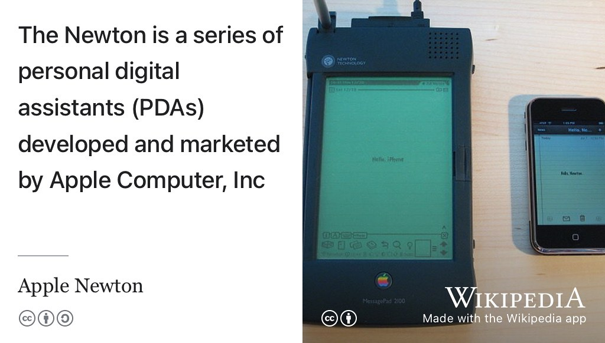
```

(ref:captionnewton) Released in the nineties, the [Apple Newton](https://en.wikipedia.org/wiki/Apple_Newton) (left) was an arm powered predecessor to the Apple iPhone, 2007 model shown on the right for comparison. CC BY licensed picture by Blake Patterson on Wikimedia Commons [w.wiki/8UsM](https://w.wiki/8UsM) adapted using the [Wikipedia app](https://apps.apple.com/us/app/wikipedia/id324715238) 📱

Again, most people have forgotten the Newton, but in those days as today, Apple was a magic brand in the computing world and getting Apple, getting the Apple badge, the stamp of approval setting up ARM as a  joint venture between Acorn and Apple with input from VLSI technology who made the chips. That really got the ARM moving and of course, some very clever management and technical work by the team under [Robin Saxby](https://en.wikipedia.org/wiki/Robin_Saxby), see figure \@ref(fig:saxby-fig). [@armhistory]

```{r saxby-fig, echo = FALSE, fig.align = "center", out.width = "100%", fig.cap = "(ref:captionsaxby)"}
knitr::include_graphics("images/robin-saxby.jpeg")
```

(ref:captionsaxby) [Robin Saxby](https://en.wikipedia.org/wiki/Robin_Saxby) served as  chief executive and then chairman of ARM Holdings. Portrait of Robin Saxby by [Debbie Rowe](https://www.debbierowe.com/) at the Royal Society via Wikimedia Commons [w.wiki/8Unn](https://w.wiki/8Unn) adapated using the [Wikipedia app](https://apps.apple.com/us/app/wikipedia/id324715238)


> Steve: (They) built this new business model that made the company work fine, actually which companies have to do right?

So rather than manufacturing the chips  (like Intel do) it was  this licensing model that came from Robin Saxby.

> Steve: That's right in my last couple of years at Acorn, I'd spent little time thinking about, you know, what would happen if we move the ARM activity out of the company? You know, and try to licence the architecture and take royalties but none of the business models worked. The reason is that royalties are not good for cash flow. Royalties come late and little. It takes a long time for them to build up and Saxby looked at this model and he added a different component to it which was effectively a join the club upfront fee. So you pay a chunk of money to get an ARM licence and then downstream when you want on your product, you pay royalties. The upfront money is, of course, excellent for cashflow and that made the company work


....and helps you fund some of that design because designing chips is time consuming and expensive and requires a lot of expertise and that's not always appreciated from the outside, is that how much work goes into designing these things.

> Steve: Designing a processor, well designing any kind of chip today is you know, a **multi-hundred man year task**. The first ARM processor was much less than that because it was very simple and because chips were smaller then in [transistor count](https://en.wikipedia.org/wiki/Transistor_count) (see figure \@ref(fig:moores-law-fig))

::: {.rmdnote}
(ref:codingcomment)

How expensive is expensive? As of 2024, the cost of designing a new chip is around $100 million. [@chipwar] Although similar in size to your fingernail, microchips are one of the most complex things that humanity has designed and built. 

:::

So moving on from Acorn then, so we should say the acronym arm stands for, is it **Advanced RISC machines** or  **Acorn RISC machines**? 

> Steve: It's been both, originally it was the acorn risc machine. That's where arm comes from.  And then, when that activity was spun out into this joint venture with Apple they changed the *acorn* bit to *advanced*, so it became *Advanced RISC machine*. And and then a few years later, they just dropped the expansion altogether and it's not, yeah, okay. So, you know, initially it was capital **A**, capital **R**, capital **M** (**ARM**) and now it's all lowercase *arm*. 

So, you spent ten years at Acorn from about 1980?

> Steve: a bit less than 10 years I suppose. I joined the staff in October 81 from my research fellowship  And although I had been working with them for a couple of years before, effectively I'd been working with them. I've been giving them designs in exchange for components to use to build computers to use in my research and so on. Okay, so I've been involved in Acorn since they were formed as CPU limited in about about 77 or 78 right? [@speciation]

## Back to Manchester {#furberchestser}

So in 1990, in you mentioned in August of 1990, you made the decision to move back to Manchester where you took the ICL chair, which you've held for 33 years. So that's an interesting decision. What made you decide to move out of doing commercial R&D and come back to academia?

> Steve: yes that's a very good question and I think the answer is that the early years at Acorn were very exciting with developments of the BBC micro and the first arm chips and the growth in the market and generally things very much on the upward trend. But then, you know, roughly when we got the first arm chips, Acorn effectively went bust and was rescued by [Olivetti](https://en.wikipedia.org/wiki/Olivetti_S.p.A.). And then, from the mid 80s onwards, it was increasingly run on a financial basis rather than on a rapid technology development slope. It became a financially managed company. And for me, that meant doing interesting things was getting harder and harder. And I couldn't see where it was going, I had no idea that a month after I left Apple would come knocking. That might have influenced my decision, but one can't go back and try again. And so, the company had become very flat and essentially, it's business was defined by however, much the government decided to spend on educational computers that yet. It was increasingly difficult to fund the kind of resource required to maintain the arm processor development within that constrained budget. So, I began to think about what my alternatives were, and I felt after my nine years at Acorn that I had become sufficiently established in the computing business that I could probably make a goal of academic research in that area. So I'd been muttering about possibly going back to academia. I wrote a book while I was at Acorn. 

Thats *VLSI: RISC architectural organisation*, see figure \@ref(fig:vlsi-fig). [@vlsibook]

> Steve: Yes, which was published at a very high price and didn't sell very many but still a milestone book, and I think it was part of my objective in writing that book was, of course, as a working in industry I didn't publish many papers so I thought, if I wrote a book that would establish some academic respectability. In doing some research for this episode, it was much easier to find out about your career post 1990 than that period, 80 to 90 because as you say there wasn't that much of it that is documented, right? Not in the same way as you can look at papers and see what when things happened to see what you see what the timeline was in acorn. 

```{r vlsi-fig, echo = FALSE, fig.align = "center", out.width = "100%", fig.cap = "(ref:captionvlsi)"}
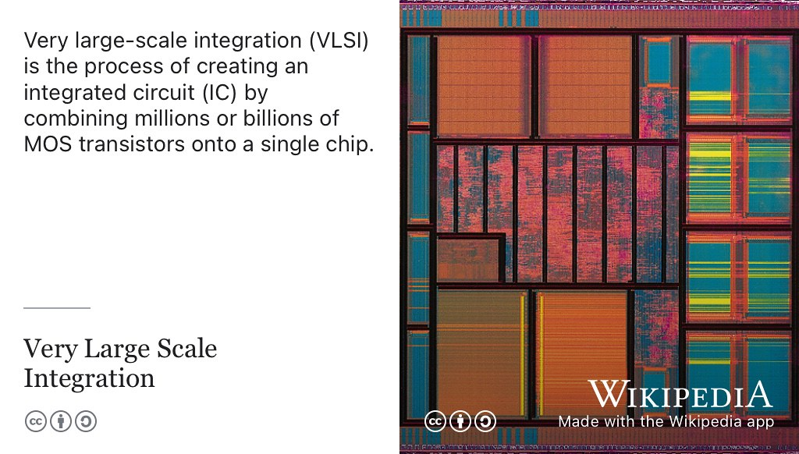
```

(ref:captionvlsi) The process of [Very Large-Scale Integration](https://en.wikipedia.org/wiki/Very_Large_Scale_Integration) (VLSI) is used to create an integrated circuit (IC) by combining millions or billions of MOS transistors onto a single chip. [@vlsibook] Picture of a VLSI integrated-circuit die via Wikimedia Commons [w.wiki/8Unw](https://w.wiki/8Unw) adapted using the [Wikipedia app](https://apps.apple.com/us/app/wikipedia/id324715238)


> Steve: Yes and partly that's because industry isn't that interested in publishing. We did publish some papers in the 80s and but not many but also of course the world wide web hadn't started. And I mean, the internet, of course, has existed since the 60s and at Acorn we were already making extensive use of email and so on internally in the 80s but there wasn't the worldwide web. And so the wasn't the online recording of almost everything that happened. In any case, companies will probably keep quite a lot of their information off the web for confidentiality reasons. Once you're in university the tendency is to do everything out in the open 

Very different culture!

> Steve: Yes. 

So in setting up your lab, your research group and your team when you're arrived in Manchester what were the main obstacles you faced as a new academic building, a research lab, what were those obstacles earlier on and how did you overcome them at the beginning?

> Steve: Well, I was fortunate in my last few years at Acorn I'd been involved in a European initiative, called the [Open Microprocessor Systems Initiative](https://cordis.europa.eu/project/id/5386). I think he was originally OMI, the Open Microprocessor Initiative, which was a European initiative to fund significant research activity in the microprocessor space. I got a projects under development at Acorn, when I moved to Manchester,  Acorn was happy for me to move a chunk of that project with me. So effectively, I brought some initial funding with me. 


And some people as well, some staff? 

> Steve: No, I didn't. I didn't bring any staff from Acorn when I was appointed to the ICL chair, I was given a lectureship to fill that was filled pretty early on by Jim Garside (see figure \@ref(fig:jim-garside-fig)).

ah right, okay. 

```{r jim-garside-fig, echo = FALSE, fig.align = "center", out.width = "100%", fig.cap = "(ref:captiongarside)"}
knitr::include_graphics("images/jim-garside.png")
```
(ref:captiongarside) Jim Garside is a Senior Lecturer (Associate Professor) in the [Advanced Processor Technologies](https://apt.cs.manchester.ac.uk/) (APT) research group at the University of Manchester. Screenshot of Jim's author profile from [ieeexplore.ieee.org/author/37313283000](https://ieeexplore.ieee.org/author/37313283000)


> Steve: Who was a great acquisition for the group, Jim is a real engineers engineer and provided the engineering underpinnings of a lot of what we've done since. So I was given a lectureship, I didn't bring people me, I brought funding with me which is for any academic often the most difficult thing to secure. 

Yeah, okay.

> Steve: So but with that, I was able to recruit a few people and I my first PhD student was Nigel Paver [linkedin.com/in/nigel-paver](https://www.linkedin.com/in/nigel-paver). [@paverphd] Nigel was an arm fellow for quite a long time at Austin in Texas and now runs a Samsung development activity in [Austin, Texas](https://en.wikipedia.org/wiki/Austin,_Texas). So he's gone on to great success in the chip design business. His career involved periods at Intel as well as ARM and now Samsung. The first thing you got to do coming into academia is decide on your research direction, OK? And I had a number of ideas in my head coming from Acorn, I presented a paper at VLSI-89, which I think was in Munich and while I was there, I heard a talk on [asynchronous design](https://en.wikipedia.org/wiki/Asynchronous_circuit) from a guy at an Australian University and that got me interested. So the first direction of research I took in Manchester was looking at implementing the arm in asynchronous technology, which means without a clock.

Yeah. 

> Steve: with all the internal activities self timed and that direction of research actually carried us through the 90s. 

## The SpiNNaker project {#SpiNNaker}

Up to the present day, a sort of follow on from the asynchronous stuff was more recently the [SpiNNaker project](https://en.wikipedia.org/wiki/SpiNNaker) which you've led part of this multi-million Euro European Union funded [Human Brain Project](https://en.wikipedia.org/wiki/Human_Brain_Project), see figure \@ref(fig:hbp-fig). SpiNNaker in some ways is a, can we call it a descendant its part of arc of your career. This is a neuromorphic ("brain-shaped") processor which passed the milestone of having a million cores in 2018. So can you tell us a little bit about SpiNNaker project that follows on from this and SpiNNaker 2 and 3? [@SpiNNaker2]

```{r hbp-fig, echo = FALSE, fig.align = "center", out.width = "100%", fig.cap = "(ref:captionhbp)"}
knitr::include_graphics("images/human-brain-project.jpeg")
```
(ref:captionhbp) The [Human Brain Project](https://en.wikipedia.org/wiki/Human_Brain_Project) (HBP) was a €1-billion European Union scientific research project that ran for ten years from 2013 to 2023. Using high-performance exascale supercomputers it built infrastructure that allowed researchers to advance knowledge in the fields of neuroscience, computing and brain-related medicine. CC BY Skull and human brain illustration by [Patrick J. Lynch](https://coastfieldguides.com/my-medical-illustrations/) on Wikimedia Commons [w.wiki/8W64](https://w.wiki/8W64) adapted using the [Wikipedia app](https://apps.apple.com/us/app/wikipedia/id324715238) 🤯 


> Steve: How long have you got!? So the origins of SpiNNaker (see figure \@ref(fig:spinnorama-fig)) are that by the end of the 90s, we'd basically shown that you could build pretty much anything you want in asynchronous logic. The last [AMULET 3](https://en.wikipedia.org/wiki/AMULET_(processor)) was effectively [System on Chip (SoC)](https://en.wikipedia.org/wiki/System_on_a_chip) although it was only half the chip. And that was developed for a commercial application, but sadly the commercial collaborator went out a business before the chip got applied. But it was clear by the end of the 1990s that processor  design was moving from sort of manual hardcore. You know, here's a physical implementation of the processor you can go and use, to synthesizeable stuff. And the synthesis tools for asynchronous logic were nowhere near as developed as those for clock logic. So we kind of had to start again and we had some work going on since this is tools in the form of Balsa, which was led by Doug Edwards in group. [@balsa]

```{r spinnorama-fig, echo = FALSE, fig.align = "center", out.width = "100%", fig.cap = "(ref:captionspinnorama)"}
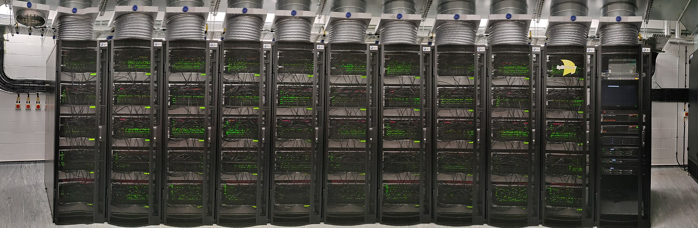
```

(ref:captionspinnorama) A panoramic shot of [SpiNNaker 1](https://en.wikipedia.org/wiki/SpiNNaker) in 2018, which has over 1 [million cores](https://en.wikipedia.org/wiki/Multi-core_processor), housed in the [Kilburn building](https://en.wikipedia.org/wiki/Kilburn_Building) in Manchester. The machine has a total of 1,036,800 cores and over 7 Terabytes of RAM, composed of 57,600 processing nodes, each with 18 [ARM968](https://en.wikipedia.org/wiki/ARM9) processors and 128 MB of mobile Double Data Rate Synchronous Dynamic Random-Access Memory ([DDR SDRAM](https://en.wikipedia.org/wiki/DDR_SDRAM)). For scale, each of the eleven server racks in this picture are around 600mm wide. [@Furber2013] Version 2.0 of SpiNNaker has 10 million cores, completed in 2022. [@spin2] CC BY-SA Panorama picture by [Petruț Bogdan](https://scholar.google.com/citations?user=B9_OSJ8AAAAJ) on Wikimedia Commons [w.wiki/8Z3J](https://w.wiki/8Z3J)

> Steve: But it was going to take a long time to compete and industry acceptance of asychronous design was very slow at the time, so I began to think it was time to for a change of direction. I'd been in the process of design business for more than 20 years, processors were thousand times faster but they still struggled to do things that humans find quite easy. And towards the end of the 90s, I got a grant from  EPSRC (The [Engineering and Physical Sciences Research Council](https://en.wikipedia.org/wiki/Engineering_and_Physical_Sciences_Research_Council)), a ROPA grant: Realising Our Potential Award [@ROPA] required you to go off in the new direction. It was based on having industrial support but you had to choose new directions. So I thought I'd always been interested in [associative memories](https://en.wikipedia.org/wiki/Content-addressable_memory), I'd used them in [processor caches](https://en.wikipedia.org/wiki/CPU_cache) and so on but they're all very brittle. You know, you give them the right input, they give you exactly the right output. You give them the slightly wrong input they give you rubbish. For this ROPA reward, we started investigating inexact associative memories. [@inexact] And I found every way we looked at that problem we were reinventing [neural networks](https://en.wikipedia.org/wiki/Artificial_neural_network), see figure \@ref(fig:neural-network-fig). So that influenced me to think well, maybe there's things the brain can do that we can't do with computers at all easily. I like associative memories bit they all seemed  to look like neural networks. So later we should look at neural networks and that that really was The thing that began pointing me in the direction of the SpiNNaker project.

```{r neural-network-fig, echo = FALSE, fig.align = "center", out.width = "100%", fig.cap = "(ref:captionneuralnetwork)"}
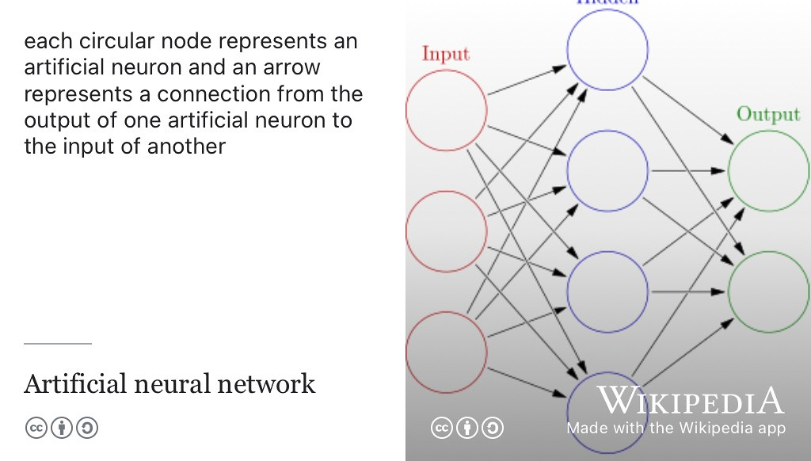
```
(ref:captionneuralnetwork) An [Artificial Neural Network](https://en.wikipedia.org/wiki/Artificial_neural_network) is a model used in machine learning based on biological neural networks. Each circular node shown here represents an artificial neuron and an arrow represents a connection from the output of one artificial neuron to the input of another. CC BY image by Glosser.ca on Wikimedia Commons [w.wiki/8ZeS](https://w.wiki/8ZeS) adapted using the [Wikipedia app](https://apps.apple.com/us/app/wikipedia/id324715238) 🧠

All right. 


> Steve: We spent several years bringing ideas together. I was head of department. If you recall

I can remember you serving as [head of department](https://en.wikipedia.org/wiki/Department_of_Computer_Science,_University_of_Manchester), I think during my PhD. [@hulldphd]

> Steve: It was 2001 for 2004, right up to the merger of the [University of Manchester](https://en.wikipedia.org/wiki/Victoria_University_of_Manchester) with [UMIST](https://en.wikipedia.org/wiki/University_of_Manchester_Institute_of_Science_and_Technology). I got the usual one-year post-headship rehabilitation-sabbatical and I spent a couple of months of that at [Sun labs in Menlo Park in California](https://en.wikipedia.org/wiki/Sun_Microsystems). And looking at some of the [Supercomputer](https://en.wikipedia.org/wiki/Supercomputer) plans that they were developing at the time and doing some asynchronous logic with the group there that was very active in async design. And while looking at these supercomputers, the concepts that I wanted to build into this neural network computer began to gel and it was at that point that I realised, there's actually a very strong argument, particularly for a research platform, for using a general purpose processor as the engine to model neurons and synapses rather than dedicated hardware, which was more commonly used.

Yeah. 

> Steve: So that's really when the concepts behind SpiNNaker came together in 2004/5. And then we got good funding for EPSRC to get this project going and that lead is into collaborations with Heidelberg, a European project. And that positioned us to join the HBP [Human Brain Project]. We actually got something to offer the HBP when that started in 2013. 

And finished this year?

> Steve: Finished ten years later in 2023, finished the day I retired. So that's not really a coincidence. I wanted to see the HBP out, which is why I carried on beyond the age of 70, which is rather old for academic retirement. 

So there's two things here because SpiNNaker is a big project (see figure \@ref(fig:heathcote-vid)) but there's two things that are interesting:

1. What has SpiNNaker done to help scientists learn about the brain because you're trying to help biologists and neuroscientists understand how the brain works by modelling some of it?
1. What have we learned from building? So there's a, there's a *scientific* challenge of trying to to help scientists and then there's the *engineering* challenge of what have we learnt from building neuromorphic computers, like SpiNNaker and it successors. 

So can we start with a brain stuff? First? How has SpiNNaker helped scientists understand how brains work? 

```{r heathcote-vid, echo = FALSE, fig.align = "center", out.width = "99%", fig.cap = "(ref:captionheathvid)"}
knitr::include_url('https://www.youtube.com/embed/mcBB2o7Bmwc')
```

(ref:captionheathvid) Wiring up the 103,680 core SpiNNaker 10⁵ Machine as a [toroidal mesh](https://en.wikipedia.org/wiki/Toroid). This 1.5 minute video by [Jonathan Heathcote](http://jhnet.co.uk/), a former PhD student supervised by Steve [@heathcotephd], can also be watched at [youtu.be/V3MlOAru6Qk](https://youtu.be/mcBB2o7Bmwc). [@heathcotevid]

> Steve: Well, it would be false to claim that SpiNNaker has transformed our understanding of the brain. It's contributions to brain sicence are thus far more modest than that. But it has provided a platform for testing hypotheses and novel learning algorithms that have come out of various other groups in the HBP have been implemented on SpiNNaker and explored to see how effective they are, how our biological plausible they are and to what extent they may, or may not be explaining things that are going on in the brain. The way the brain works as an information processor is still a mystery to science. And we know a lot about the bits from, which it  is constructed and how they operate but we still really don't know how information is represented or processed in the brain. SpiNNaker has allowed various hypotheses to be tested and models to be built. So there was a kind of friendly competition in the HBP between a supercomputer centre at [Jülich](https://en.wikipedia.org/wiki/J%C3%BClich) and SpiNNaker at Manchester and [GPU](https://en.wikipedia.org/wiki/Graphics_processing_unit) system at Sussex. [@sussex] 

Jülich is?

> Steve: Jülich is the German Supercomputer centre. Its a town in Germany and the [Forschungszentrum Jülich](https://en.wikipedia.org/wiki/Forschungszentrum_J%C3%BClich) (see figure \@ref(fig:julich-fig)). So it's the major German supercomputer centre in Northwest Germany. They developed a model of an area of cortex and they run this on their supercomputers and we've run it on SpiNNaker and it's been run on GPU systems. SpiNNaker was the first machine which achieve real time, biological real-time performance on this model. The model reproduces measured average spiking rates in layers it allows us to say well yes disappears to be,  to reproduce quite a lot of the things we can measure about cortical activity. It has a circuit we can write down, it's relatively simple to write down what the neural circuit is here. We still don't understand what is doing or how it does it. We have a model that's fairly easy to interrogate an test hypotheses on. And as I say SpiNNaker was the first to achieve biological real time despite being really quite old technology now and the [HPC](https://en.wikipedia.org/wiki/High-performance_computing) and GPU systems being much more modern technology. So it kind of suggests that the architecture that we conceived has advantages if it can enable an old technology to compete with much newer technologies.

```{r julich-fig, echo = FALSE, fig.align = "center", out.width = "100%", fig.cap = "(ref:captionjulich)"}
knitr::include_graphics("images/julich.jpeg")
```
(ref:captionjulich) [Forschungszentrum Jülich](https://en.wikipedia.org/wiki/Forschungszentrum_J%C3%BClich) is the German Supercomputer centre. As a member of the Helmholtz Association, it has roughly 6,800 employees in ten institutes and 80 subinstitutes, Jülich is one of the largest research institutions in Europe. CC BY-SA image of Haupteingang Forschungszentrum Jülich by Bodoklecksel on Wikimedia Commons [w.wiki/8ZPc](https://w.wiki/8ZPc) adapted using the [Wikipedia app](https://apps.apple.com/us/app/wikipedia/id324715238) 🇩🇪


Are there any engineering... what we learn from building these systems, you know, regardless of what they get used for, as it's a challenge just building them?

> Steve: Oh yes, I mean our original concept was to put a million ARMs cores into a machine for real time brain modelling. Okay. A million is a big number, it's about the limit of what you can sensibly, think you're going to do on an academic budget. So we had to design scalability in from the outset and that was the driving function. And building a machine that big requires you to address a whole lot of engineering issues. One of which is, of course, every component in that machine, they'll never all work at the same time. There will be failures and that for you have to design a higher degree of fourth tolerance into both the hardware and the software that runs on it. But we've done that very successfully. There are things we didn't anticipate. The million core SpiNNaker machine has around **10 square metres of active silicon area**. Okay, so when you think of microchips as being about a centimetre square (1cm²). This is, the full machine has the equivalent of about three metres by three metres (9m²) of active silcion.

Which is big. 

> Steve: So it's pretty good radiation detector. And sitting there in the concrete room and the [Kilburn building](https://en.wikipedia.org/wiki/Kilburn_Building) we can still detect what are called [single event upsets](https://en.wikipedia.org/wiki/Single-event_upset) when a radiation particle knocks over a bit of memory in the machine. (See figure \@ref(fig:singlevent-fig)).

```{r singlevent-fig, echo = FALSE, fig.align = "center", out.width = "100%", fig.cap = "(ref:captionsingleventupset)"}
knitr::include_graphics("images/single-event-upset.jpeg")
```

(ref:captionsingleventupset) A [single event upset](https://en.wikipedia.org/wiki/Single-event_upset) is a change of state caused by an ionizing particle striking a sensitive node in a live micro-electronic device, such as in a microprocessor semiconductor memory or power transistors. A single event upset in flight computers onboard this “computer with wings” was suspected to have nearly crashed this [Qantas Flight 72](https://en.wikipedia.org/wiki/Qantas_Flight_72), an Airbus A330. [GNU Free Documentation Licensed](https://en.wikipedia.org/wiki/GNU_Free_Documentation_License) (GFDL) picture of an A330 by Chris Finney on Wikimedia Commons [w.wiki/8WMJ](https://w.wiki/8WMJ) adapted using the [Wikipedia app](https://apps.apple.com/us/app/wikipedia/id324715238) ✈️


Okay. This is not something you anticipated I suppose?

> Steve: We kind of anticipated it but we anticipated it in the wrong place. And we only found in the right place because I was asked the question by a professor from Germany who was thinking about these things. We expected most of the memory on SpiNNaker is in these separate [D-RAM](https://en.wikipedia.org/wiki/Dynamic_random-access_memory) chips which are in the package but they're standard chips. We expected some memory faults in those chips but we've never seen one. What we didn't expect  was false in the on-chip memory on the SpiNNaker chip itself. We see those and we can measure them and on the full machine we get two or three an hour. So it's quite significant and the importance of that is, it was immediately fed forward into the design of SpiNNaker 2, which has fully error-correcting memory all over the chip now.

Right as a result. That so that's SpiNNaker 2, is it finished. Now is that still in under construction. [@SpiNNaker2; @spin2] 

> Steve: It has been co-developed within the Human Brain Project with [TU Dresden](https://en.wikipedia.org/wiki/TU_Dresden) who have a very effective silicon backend team. Yes, it's been designed and we now have full silicon. So we have SpiNNaker 2 chips currently, we just have individual chips. But Dresden is now putting together, the 48 node boards, which are the same kind of density is the board in the SpiNNaker 1 machine and they will be putting together a five million core SpiNNaker machine in Dresden over the next year or so. SpiNNaker 2 is very much an evolution of SpiNNaker 1, it's conceptually very similar, it incorporates quite a lot of lessons we've learned from SpiNNaker 1, such as the importance of high quality random number sources, and so it has hardware to do that and hardware to compute exponentials and logarithms. It also has high performance matrix vector multipliers for conventional artificial networks as well as support of the spiking networks. 

Are there plans for a SpiNNaker 3, is this then the same conceptually or is it a shift away from SpiNNaker one?

> SpiNNaker 3 is still at the conceptual stage. But Dresden has spun out a company called to [SpiNNcloud.com](https://spinncloud.com/) systems [GmbH](https://en.wikipedia.org/wiki/Gesellschaft_mit_beschr%C3%A4nkter_Haftung) to commercialise SpiNNaker 2 and the expectation is that in fact, commercialisation starts moving there, and they'll want a SpiNNkaer 3 to follow on, see figure \@ref(fig:tenmil-fig).

```{r tenmil-fig, echo = FALSE, fig.show = "hold", out.width = "99%", fig.cap = "(ref:tenmil)"}
knitr::include_url('https://w.soundcloud.com/player/?url=https%3A//api.soundcloud.com/tracks/1253202004&amp;color=ff5500&amp;auto_play=false&amp;hide_related=false&amp;show_comments=true&amp;show_user=true&amp;show_reposts=false',  height = "166px")
```

(ref:tenmil) Steve Furber, Christian Mayr and Geof Wheelwright discuss building a brain with 10 Million CPUs in the SpiNNaker 2 project. [@tenmillioncores] If the audio clip in this figure doesn't load properly, try refreshing this page.

## You are the next Vice Chancellor {#furbervc}

Right. Okay. Good. So I think we've covered the question about biggest challenges in SpiNNaker, I think we've covered most of that a little superficially, but I think we'll move on. There's some standard questions I ask all the students who, who come on this program. So one of them is I doubt you want to be the next vice chancellor but the University of Manchester where you've worked for 33 years, is looking for a new, vice chancellor, next year. So I ask students, you've obviously taught lots of students, undergraduates, masters students and PhD students. So, If you were to have the job of Vice Chancellor (VC) what would you do to improve the teaching and learning of computer science at specifically at Manchester but perhaps in higher education, generally as well.

::: {.rmdnote}
(ref:codingcomment)

Shortly after this podcast was published [Duncan Ivison](https://en.wikipedia.org/wiki/Duncan_Ivison) was appointed Vice Chancellor to succeed [Nancy Rothwell](https://en.wikipedia.org/wiki/Nancy_Rothwell)'s fourteen years of service in August of 2024 [@duncanivison]

:::

> Steve: Okay. My answer  to this is going to understand a little bit indirect if you're an undergraduate, it's not really directly about what they see or feel at all but in my time of the university in particularly, since the merger, there has been a tendancy to centralise resources. **So we've seen support staff move out of the department and into the school of engineering and into faculty and into the centre. And I believe this is to the detriment of everything that we do.** Yeah, so I've been arguing for some time that what you need are good support staff at the coal face, close to the academics. 

And close to the students as well? 

> Steve: Well, yes of course and I think example, clear example, is IT services, you know? Now, if we have a problem with machines in the lab, its very difficult to get the problems sorted in real time. When I came to the University, we had IT services in the department and if you had a problem with a lab you went to knocked on their door and they came down and fixed it. Now you have to submit a job a three weeks later somebody might do something. That's one example. I mean you really need good IT support in the labs. Now we still do have some very good people around in the labs but they don't cover everything. 

So, it's an organisational, the way the organisation works is really important, that has a big impact on student experience and their learning and what they get out of their time here.

> Steve: Yes, you know, I mean, the IT thing would affect students directly but the, the other services, for example the research services are much more anonymous and remote they used to be. This means that a lot more academic time goes into handling of the administration of their research and the administration of all sorts of other things that used to be the case. I'm very much in favour of decentralised services. And pushing support people. My rather crude model of university administration is that,  the good admin person is close to the academics and the students, sees it as their job to make things work. Whereas any admin remote from the academics and students, sees it as their job to stop bad things from happening. **There's one very reliable way to stop bad things from happening and thats to stop *anything* from happening**.

All right. 

> Steve: That tends to be the mode that we see operating, it has become incredibly hard to get things done, to get administrative things done that used to be straightforward, where the help used to be much closer to hand. Okay, so I think if I were Vice Chancellor, that will be where I would start, making academics lives easier so they've got more time for their teaching and their research. That would then improve, because there's no issue with with academics wanting to provide students with, you know, excellent teaching and learning experience. The problem is the time they have available to do it.

A finite resource. 

> Steve: Yeah. 

## One tune {#furbertune}


Okay, good. So one other thing. We shan't be casting you away to a *Desert Island* with your eight tracks and a book [@desertislandddiscs] but we ask our guests to recommend one piece of music to our listeners and say why that one piece of music is important to them. This is an opportunity for me to thank you, before the pandemic, you played bass guitar in our prototype band, so thank you for doing that. 🙏

::: {.rmdnote}
(ref:codingcomment)

Steve played the (funky) bass line to [Can't Stop the Feeling!](https://en.wikipedia.org/wiki/Can%27t_Stop_the_Feeling!) [@cantstopthefeeling] 

Thanks Steve for making a special guest appearance in a [COMP101 undergraduate lecture](https://www.manchester.ac.uk/study/undergraduate/courses/2024/00560/bsc-computer-science/) with the [Kilburn building](https://en.wikipedia.org/wiki/Kilburn_Building) [boy band](https://en.wikipedia.org/wiki/Boy_band) featuring [Justin Timberfake](https://en.wikipedia.org/wiki/Justin_Timberlake) and friends in September 2019.

:::

You're still playing bass guitar now I take it? See figure \@ref(fig:furbass-fig). 

```{r furbass-fig, echo = FALSE, fig.show = "hold", out.width = "33%", fig.cap = "(ref:captionfurbass)"}
knitr::include_graphics(rep("images/furbass.jpeg", 3))
```

(ref:captionfurbass) *He's all about that bass, 'bout that bass, no treble* [@allaboutthatbass] CC BY-SA Picture of Steve Furber performing as guest bassist for *The Suits* at the BBC Micro 30th anniversary in 2012 by Trevor Johnson on Wikimedia Commons [w.wiki/8YYg](https://w.wiki/8YYg) 🎸

> Steve: Yes, I play in a local church band, we've just moved house earlier this year to be closer to our grandchildren, in retirement and we've attached ourselves to a local methodist Church and been welcomed into the music group there. 

Good, so what piece of music? I'm sorry I can only give you *one* piece of music...

> Steve: Everybody knows that I'm a lifelong [Moody Blues](https://en.wikipedia.org/wiki/The_Moody_Blues) fan, see figure \@ref(fig:moodyblues-fig). I mean, I was exposed the Moody Blues by a friend in 60s, I think, before the first moon landing and have simply loved their music ever since. I've been to see them several times. As a band from the 60s, they are unusual in that they were still playing a lot of live concerts up to about five years ago. Now I think too many of the original line at the died (!) for them to function although the man who wrote (I think) quite a lot of the best of their songs [Justin Hayward](https://en.wikipedia.org/wiki/Justin_Hayward) is still going strong. The piece of music I'm going to choose is a bit obscure. Most people have come across [Nights in White Satin](https://en.wikipedia.org/wiki/Nights_in_White_Satin), [@nightsinwhitesatin] which is the most famous of The Moody Blues tunes but I'm going to choose [The Story in Your Eyes](https://en.wikipedia.org/wiki/The_Story_in_Your_Eyes). [@thestoryinyoureyes]

```{r moodyblues-fig, echo = FALSE, fig.align = "center", out.width = "100%", fig.cap = "(ref:captionmoody)"}
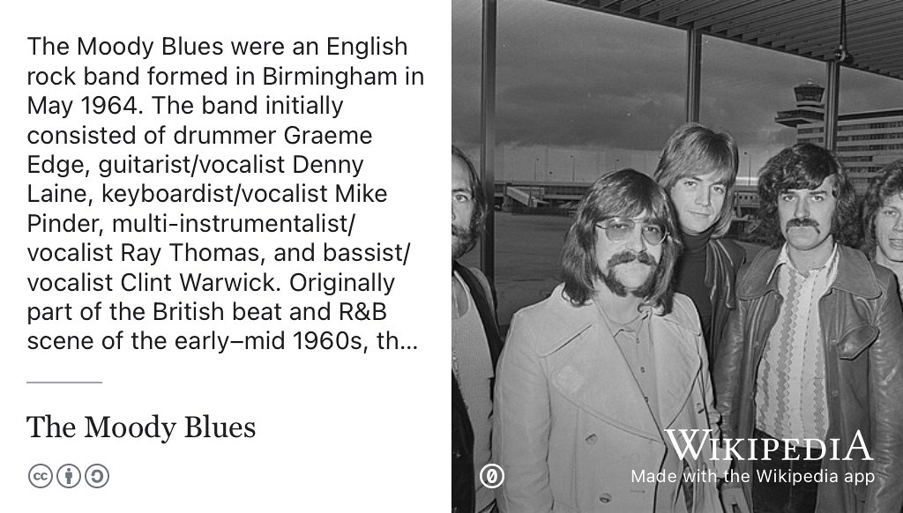
```

(ref:captionmoody) The Moody Blues were an English rock band formed in Birmingham in May 1964. There's a good chance you've heard their greatst hit [Nights in White Satin](https://en.wikipedia.org/wiki/Nights_in_White_Satin), [@nightsinwhitesatin], Steve chose [The Story in Your Eyes](https://en.wikipedia.org/wiki/The_Story_in_Your_Eyes) to add to the [Coder's Playlist](https://bit.ly/coders-playlist). [@thestoryinyoureyes] Public domain (CC0) picture of (from left to right) Mike Pinder, Graeme Edge, Justin Hayward, Ray Thomas and John Lodge arriving at Amsterdam Airport in 1970 from the [Nationaal Archief](https://en.wikipedia.org/wiki/Nationaal_Archief) on Wikimedia Commons [w.wiki/8akG](https://w.wiki/8akG) adapted using the [Wikipedia app](https://apps.apple.com/us/app/wikipedia/id324715238).

Okay, good. We'll add that to the [bit.ly/coders-playlist](https://bit.ly/coders-playlist) (redirects the YouTube playlist) and I'm going to have a listen to that. Why is that particular piece important to you?

> Steve: I like that because you know, although I play bass now I was once in my undergraduate days a lead guitarist, not a very good one, I had to admit but I kind of love guitar, and I just think the guitar on that track is particularly nice, good, strong, whatever the right word is, I'm not quite sure. If anybody can work out what the lyrics are about they better let me know. Like a lot of Moody Blues songs the lyrics are a bit on the obscure side. It's got a great guitar introduction and a couple of good guitar solos in the middle. 

## One podcast {#furbercast}

I don't know if you actually listen to podcasts much but either a podcast or a radio show that you listen to that you recommend other people listen to.
 
 > Steve: I mean, I don't listen to podcasts a lot but I do have some that download on to my phone and and I haven't travelled so much as the last few years, post-pandemic, but when I used to fly, I used to listen to podcasts on the plane quite a lot. I think the best and the most diverse podcasts are the *In Our Time* podcasts by [Melvyn Bragg](https://en.wikipedia.org/wiki/Melvyn_Bragg), see figure \@ref(fig:inourtime-fig). Now I'm not going to point to a specific one, just the series. It's so wide ranging and covers stuff I have a direct interest in and stuff I've never heard anything about. [@inourtime]

```{r inourtime-fig, echo = FALSE, fig.align = "center", out.width = "100%", fig.cap = "(ref:captioninourtime)"}
knitr::include_graphics("images/melvyn-bragg.jpeg")
```

(ref:captioninourtime) You can't learn everything at school. You can't learn everything at University either. You *can* learn whatever your teachers and professors judge to be the *fundamentals*, but that's just the starter. Never stop learning with more than 1000 episodes of *In Our Time*, a BBC radio discussion series and podcast, to help you explore a wide variety of historical, scientific and philosophical topics. [@inourtime; @inourtime750; @inourtime1000] CC BY portrait of [Melvyn Bragg](https://en.wikipedia.org/wiki/Melvyn_Bragg) by [Chris McAndrew](https://en.wikipedia.org/wiki/Chris_McAndrew) via Wikimedia Commons [w.wiki/8agv](https://w.wiki/8agv) adapted using the [Wikipedia app](https://apps.apple.com/us/app/wikipedia/id324715238) 

From physics through to well, everything, history ...

> Steve: Physics through to ancient civilisation. I think Melvyn Bragg does draw out good thoughts and insights from his guests in that. So that'll be my choice.

## One film {#furberfilm}
Good. Okay and one film? You're not allowed to say BBC [Micro Men](https://en.wikipedia.org/wiki/Micro_Men)? [@micromen]

> Steve: No, I don't think I would choose that anyway, I mean it's a lovely little drama, and largely almost true. I was choosing here, so, I think my second choice, it's a film that I haven't seen around recently but I loved it at the time, which was [Those Magnificent Men in Their Flying Machines](https://en.wikipedia.org/wiki/Those_Magnificent_Men_in_Their_Flying_Machines). [@magnificentmen]

Right.

> Steve: But again, I like aircraft and that's got some great old aircraft. I think, including a genuine [1912 blackburn monoplane](https://en.wikipedia.org/wiki/Blackburn_Type_D) flying in that which is an original plane. Yeah. But see that's not my first choice. My first choice is [2001: A Space Odyssey](https://en.wikipedia.org/wiki/2001:_A_Space_Odyssey), see figure \@ref(fig:spaceodyssey-fig). [@spaceodyssey]

```{r spaceodyssey-fig, echo = FALSE, fig.show = "hold", out.width = "33%", fig.cap = "(ref:captionspaceodyssey)"}
knitr::include_graphics(rep("images/2001ASO.png", 3))
```

(ref:captionspaceodyssey) [2001: A Space Odyssey](https://en.wikipedia.org/wiki/2001:_A_Space_Odyssey) is a 1968 epic dram of adventure and exporation produced and directed by Stanley Kubrick. [@spaceodyssey] The film follows astronauts, scientists and a sentient supercomputer called [HAL 9000](https://en.wikipedia.org/wiki/HAL_9000) on their voyage to Jupiter to investigate an alien monolith. Fair use image from Wikimedia Commons. 

You, I would have seen that in the cinema for the first time in, when did that form come out? 

> Steve: It was sometime in the 1960s

The combination of the music and the cinematography at the time was quite groundbreaking, wasn't it? We take it for granted now... 

> Steve: It was absolutely staggering. I mean, of course, it's way before the time of [CGI](https://en.wikipedia.org/wiki/Computer-generated_imagery) So it was all done with models, but it was done right. You know, I like [Star Wars](https://en.wikipedia.org/wiki/Star_Wars) movies, right? But the little spacecraft, they fly like second world war planes. Right. Which you can only do in air, It's completely unrealistic as a dynamics of a space of vehicle. Whereas *2001*, they got everything right including the sequence where the flight docks with the space station which takes the whole of [The Blue Danube](https://en.wikipedia.org/wiki/The_Blue_Danube). [@bluedanube] Now I know in reality you would take less time, rather than tens of minutes but at least they give it a decent time.  And of course *The Blue Danube* isn't bad accompaniment. So, I just think the way they handle that, an, of course the the opening sequence is  historic, rightly. The apes having a battle and then the bone going up in the air and turning into a space station.

And still topical today with all the AI references in there as well, or AI themes in the film. 

> Steve: Oh well of course yes I mean [HAL](https://en.wikipedia.org/wiki/HAL_9000) has not been superceded as an illustration of the ultimate threat. That's great, the stuff at the end gets a bit weird.

## Time traveller {#furbertime}

So talking of science fiction, given a time machine, a colleague of ours in the [physics department](https://en.wikipedia.org/wiki/Department_of_Physics_and_Astronomy,_University_of_Manchester) has invented a time machine that they assure me works and if you could travel back in time, to when you were a student at university in the seventies, what advice would you offer your former self and fellow students and students studying computer science now, about making the most of their short time at university. 


> Steve: So I have a slightly tangential response to this. I mean, when I was at university studying maths, I was reasonably diligent as a student. The maths course was not that demanding in terms of time as long as you concentrated and did the examples and so on, but one thing I did at Cambridge was I joined a university society, which was the [20th century Christian music group](https://archivesearch.lib.cam.ac.uk/repositories/2/archival_objects/25649) and it's relates to my playing in church groups these days. A lot of my leisure time as it were, my non-work time at university was spent with 20th century practising and playing not very well in concerts and so on. But most importantly, through that group I met my wife

Right? 

> Steve: Um, and You know, if they always send a 20th century, our It wasn't very good music group, but it's a great marriage Bureau.

I think when a lot of people look back on their university, it's those things that you remember, you'll forget the sweat of some of the study, but actually, it's the social stuff, the relationships that last a lifetime, the thing that most people remember long after they've forgotten whatever it was they were studying at University, the actual specific details.

> Steve: I think, you know, my advice. Well, I have some basic advice which hope, which I give to anybody who's asking me if their trying to take a decision. And that's the algorithm for choosing what you do, my algorithm is if you don't know what you want to do, then make the decision, which maximises the number of doors that stay open.

Yeah, yeah. 

> Steve: And for that reason, you know, I would never advise against reading maths. You need an affnity for maths to make sense, but maths opens lots of doors as would physics. A computer science is a bit narrower but there's still a lot of opportunities in emerging from computer science these days and computers are everywhere, 

right? Yeah. Yeah. 

> Steve: All of these things, and obviously, you choose between them based on your interests and your motivation. 

1. So keep his many doors opened you can
1. Don't neglect your studies, keep on top of your studies is the second piece of advice 
1. And the third advice is make something of the social opportunities. So don't spend a hundred percent of your time on your studies. 

Yes. That's quite a difficult message to get across to students who are chasing very high marks and he sort of the sometimes, those high marks come at the expense of all the other stuff you're talking about there, which seems like a missed opportunity, 

> Steve:  I think so. I think people change a lot between the beginning and end of university. Probably the maximum rate of change time in your life, right? It's your first, typically your first time away from your parents home. You're in a new environment, you can be something different from what you were before. You can find things that interest you. It's good if at least one of those is outside your main study focus. 

## A farewell to arm? {#farewell}

Okay, so to close off then, Acorn Risc Machines became Advanced Risc Machines in 1990, and [arm.com](https://www.arm.com/) went public on the London Stock Exchange in 1998. It was bought by [SoftBank](https://en.wikipedia.org/wiki/SoftBank_Group) in 2016 and then refloated again on the New York Stock Exchange last month. So it's it's arguably the most globally influential british technology company that I can think of and many other people have made the same arguments. So what's your take on where arm is now? How do you feel about arm listing, there was a bit of commentary on why did arm list in New York rather than London. [@farewelltoarm; @armnyse] So it doesn't feel like a very British company anymore. What's your take on this as somebody who's been involved in it right from the very beginning? [@farewelltoarm]

> Steve: Well, of course, yes, Acorn didn't *become* arm it *begat* arm. It was a joint venture with [Apple](https://en.wikipedia.org/wiki/Apple_Inc.) and [VLSI technology](https://en.wikipedia.org/wiki/VLSI_Technology). That happened just after I'd come to Manchester, so I've always observed arm from the outside effectively. I felt, although I know the rationale behind the sale to SoftBank, I don't think it was a good move. Arms business is very much based on their independence, they are the kind of Switzerland of the technology world. So being owned by a company with interests, such a SoftBank, even though SoftBank is not directly competing with arm's other customers, struck me as a bad idea and it's been pretty clear since the sale to SoftBank, that SoftBank don't really know what to do with them. 

Yeah. 

> Steve: They promised the British government, that they would expand a lot, in the direction of [IoT](https://en.wikipedia.org/wiki/Internet_of_things) and that didn't work out very well. And then, of course, SoftBank tried to sell them to [Nvidia](https://en.wikipedia.org/wiki/Nvidia) [@armnvidia] which would have been an even worse idea. Right because Nvidia is a direct competitor to arms other customers. So that struck me as a very bad idea. I'm not sure it really matters which stock exchange they floated on. It's still clear that on centre of gravity is in the UK if you look at there five or six thousand employees, a bit more than half of them are UK based. 

Yeah. Yeah. 

> Steve: Although the management appears to have slipped over to the states. 

[Rene Haas](https://en.wikipedia.org/wiki/Rene_Haas), see figure \@ref(fig:rene-haas-fig)?

```{r rene-haas-fig, echo = FALSE, fig.align = "center", out.width = "100%", fig.cap = "(ref:captionrenehaas)"}
knitr::include_graphics("images/rene-haas.jpeg")
```

(ref:captionrenehaas) [Rene Haas](https://en.wikipedia.org/wiki/Rene_Haas) has served as chief executive officer (CEO) of Arm Ltd. since February 2022. He leads Arm from offices in California while the company headquarters remains in Cambridge, UK. CC BY portrait of Rene Haas by Web Summit on Wikimedia Commons [w.wiki/8ah4](https://w.wiki/8ah4) adapted using the [Wikipedia app](https://apps.apple.com/us/app/wikipedia/id324715238)


> Steve: Rene Haas. Of course, the last CEO before that [Simon Segars](https://en.wikipedia.org/wiki/Simon_Segars) who is a Manchester alumni here, see figure \@ref(fig:simon-segars-fig)

```{r simon-segars-fig, echo = FALSE, fig.align = "center", out.width = "100%", fig.cap = "(ref:captionsegars)"}
knitr::include_graphics("images/simon-segars.jpeg")
```

(ref:captionsegars) [Simon Segars](https://en.wikipedia.org/wiki/Simon_Segars) is a board director and technology executive who served as Chief Executive Officer (CEO) of ARM Holdings plc from 2013 to 2022. He studied electronic engineering at the University of Sussex before copmleting a Masters degree at the University of Manchester supervised by Steve Furber in 1996. [@segarsthesis] CC BY portrait of Simon Segars with a [silicon wafer](https://en.wikipedia.org/wiki/Wafer_(electronics)) by Web Summit on Wikimedia Commons [w.wiki/8YW5](https://w.wiki/8YW5) adapted using the [Wikipedia app](https://apps.apple.com/us/app/wikipedia/id324715238)

A former student of yours? [@segarsthesis]

> Steve: Yes, he had moved to California when arm took over the physical IP business, whose name I know perfectly well, but temporarily slipped my mind. He moved over just to kind of integrate them with arm and stayed there, as CEO he was still based in the US. In preparation for this [IPO](https://en.wikipedia.org/wiki/Initial_public_offering) they parted ways of the whole lot of experienced staff in particular, in the R&D department. Maybe they've restructured the company in ways that I don't claim to understand.  So I'm not sure I have particular insights, you know, I'm not a great business entrepreneur. I'm a technologist. I don't really know how to comment on how they make their business moves but certainly, independence is central to their existence in my vieww. 

Yeah. Okay. I think that the you've already answered my next question, which is where do students go, [Acorn Computers](https://en.wikipedia.org/wiki/Acorn_Computers) played a big role in your career, giving early opportunities for you. So where the students go to find their Acorn Computers (equivalent)? I think you've already said that algorithm of go going a direction that leaves the most doors open is a good one. But where, where do you, as somebody who advises students on their  careers, where do they look for the sorts of opportunities that you've had in the early stages of your career?

> Steve: I think it depends where their interest lie. So you know, [arm.com](https://www.arm.com/) is still recruiting if you're interested in designing silicon chips or companies such as arm are fine place to develop that line of career. There are others similarly placed and if you're more operating at the software level, then of course these days, there's a very strong emphasis on AI as an area to go into and lots of opportunities to work in AI. Again, I'm not sure I think most of the big companies are recruiting in that space. Anybody who's got any kind of skills in AI. You know, the work in the world's wide open I think as a moment. But there are also niches. You know? I mean, in the automotive industry, an ever increasing proportion of a cars sale value is electronics, right? Somebody is, well many people are in the designing all those systems and there's lots of interesting stuff to do there

More of a *computer on wheels* than a car? Modern cars feel more like a computer than they they would have felt even 10, 20 years ago 

> Steve: oh yes I mean they are computers on wheels and often they're not terribly good computers on wheels. The quality of operating system and user interface lags behind what you're used to in smartphones and tablets. 

So one last thing on chip design then, you've spent your career in chip design and R&D in that space is obviously quite hard. I think it's quite a hard thing to do and an academic setting in the same way as perhaps AI research is quite hard to do an academic setting because it's very dominated by big commercial laboratories. You know, people like arm and [NVIDIA](https://en.wikipedia.org/wiki/Nvidia) for example in chips, there's equivalents in AI as well. So, what if for students who are interested in chip design as an academic career, what would you recommend as promising avenues for students in that space, where you've spent your career? 

> Steve: Yeah, I think it is difficult doing anything close to state-of-the-art chip design because the cost of getting it made or so high. One of the challenges in the SpiNNaker project was working out at what point we switched from fabricating on a [multi-project wafer](https://en.wikipedia.org/wiki/Multi-project_wafer_service), where you share the cost of a lot of others but you can only make small quantities to a production mask, right? This was basically on SpiNNaker about £125,000  gamble, if we went straight to a [production wafer](https://en.wikipedia.org/wiki/Wafer_(electronics)) for all whether we spent that kind of money on another multi project, wait for run and unfortunately we got away with it. That's, And that's now a very old process. So, SpiNNaker 2, The cost of making a SpiNNaker 2 chips smaller than about 2 million euros, right? It's a Just to get the tooling made. Yeah. So it's getting to become very difficult and you know, you can't get the hundreds of many years of design resource and academia.

So, I think you have to find some way to finesse the problem. And you can do a lot with simulation. But then if you want to see your ideas translated on to Silicon, you have to find a company that wants what you've designed and is prepared to pay the money to implement it. You need to work more closely with industry, I think. Typically I have done in the course of my career. It's tricky. 

<!--BIGGAP needs editing out at 1.23.38-->

I mean what the one thing that is available to academics and is very useful, is is [FPGA](https://en.wikipedia.org/wiki/Field-programmable_gate_array) technology, it's what we use for teaching logic design in our labs. You can get FPGAs with formidable capabilities, so you can effectively prototype almost anything in hardware on an FPGA at relatively low cost. It's not quite the same as your custom silicon but its pretty close. 

> Steve:  Okay, good. So I feel like I've kept you A long enough. So thank you. Thank you for Thank you for coming on and answering my questions.Just.

Last question is You, you retired last week that's on Friday and we're having a A FestSchred on the 12th of January so we'll look forward to that. But how are you? I know you mentioned. You're still trying to work. This out is How you planning to spend your retirement? You mentioned spending more time for your family being closer to children and grandchildren. What else do you have planned? 

> Steve: Well, I still have a number of connections with companies that will carry on. I'm still involved in the process of trying to commercialise SpiNNaker through the University and through Dresden. That's occupied quite a lot of time but as for what my real retirement plans are, I'm not sure yet. I've still got to contend with the Human Brain Project final review in November which despite being retired I will be basically representing the University at that. And a typical day yesterday, I still got three emails from HR about research staff whose contracts are coming to an end and sets of timesheets to sign. So my university job hasn't actually gone away yet, right? 

Okay, well, I hope you enjoy your retirement and take some time to do things you're perhaps you not able to do as a (busy) Professor, now, you're an Emeritus Professor.  Thanks again for your time and we look forward to seeing you on the 12th of January (2024). I'll put a link to Gavin Brown's organising this. FurbyFest! [@furbyfest]

> Steve: I didn't realise. Oh, dear!

So we're calling this *FurbyFest*, so we look forward to seeing you at that and enjoy your retirement (see figure \@ref(fig:furbyfest-fig))

> Steve: Okay thank you Duncan.

[interview ends]

```{r furbyfest-fig, echo = FALSE, fig.align = "center", out.width = "100%", fig.cap = "(ref:captionfurbyfest)"}
knitr::include_graphics("images/furbyfest.jpg")
```

(ref:captionfurbyfest) After 33 years in the Department of Computer Science at the University of Manchester, and more than 50 years in computing, Steve's career was celebrated at a Festschrift on Friday 12th January 2024. Speakers included (from left to right): [Ian Phillips](https://www.linkedin.com/in/ianphillipsuk), [Peter Cheung](https://scholar.google.com/citations?user=vWfUi4kAAAAJ), [Sophie Wilson](https://en.wikipedia.org/wiki/Sophie_Wilson), [Jamie Urquhart](https://www.bloomberg.com/news/articles/2023-03-02/arm-co-founder-says-uk-s-tech-strategy-couldn-t-be-any-worse), [Ran Ginosar](https://scholar.google.com/citations?user=H4wTb9cAAAAJ), [Christian Mayr](https://dl.acm.org/profile/81320492271), [Doug Edwards](https://ieeexplore.ieee.org/author/37278340900), [Marly Roncken](https://ieeexplore.ieee.org/author/37298834500), [Erik Brunvand](https://scholar.google.com/citations?user=Hkw7KOoAAAAJ), [Wayne Luk](https://scholar.google.com/citations?user=2gyOP3QAAAAJ), [Piotr Dudek](https://scholar.google.com/citations?user=0keEUr4AAAAJ), [Alex Yakovlev](https://scholar.google.com/citations?user=0_TDa1kAAAAJ), [Andrew D. Brown](https://ieeexplore.ieee.org/author/37277557300) and [Ivan Sutherland](https://en.wikipedia.org/wiki/Ivan_Sutherland) (seated). Also not pictured here, [Roger Woods](https://ieeexplore.ieee.org/author/37271861100) and [Bashir Al-Hashimi](https://en.wikipedia.org/wiki/Bashir_Al-Hashimi). [@furbyfest] Picture reproduced with kind permission from by [Gavin Brown](https://profgavinbrown.github.io/) 🎸


## Epilogue: From Moore's law to chip war {#furberlogue}

The observation that the number of transistors on microchips doubles every two years, is known as [Moore's law](https://en.wikipedia.org/wiki/Moore%27s_law), named after the co-founder of Intel who first described it, [Gordon Moore](https://en.wikipedia.org/wiki/Gordon_Moore), shown in figure \@ref(fig:gordon-moore-fig). [@mooreslaw] 

```{r gordon-moore-fig, echo = FALSE, fig.align = "center", out.width = "100%", fig.cap = "(ref:captiongordonmoore)"}
knitr::include_graphics("images/gordon-moore.jpeg")
```
(ref:captiongordonmoore) [Gordon Moore](https://en.wikipedia.org/wiki/Gordon_Moore) (1929–2023) was an American businessman, engineer, co-founder and emeritus chairman of the Intel Corporation. Moore's law, which is named after him, predicts that the number of transistors in an integrated circuit (IC) doubles every two years. [@mooreslaw] CC BY-SA portrait of Gordon Moore in 1978 by Intel Free Press on Wikimedia Commons [w.wiki/8Yu9](https://w.wiki/8Yu9) adapted using the [Wikipedia app](https://apps.apple.com/us/app/wikipedia/id324715238)

The ARM1 (shown bottom left in red in figure \@ref(fig:moores-law-fig)) had **25,000** transistors, compared to the **39.5 billion** transistors in the AMD [Epyc](https://en.wikipedia.org/wiki/Epyc) (shown top right in red in figure \@ref(fig:moores-law-fig)) manufactured by the [Taiwan Semiconductor Manufacturing Company](https://en.wikipedia.org/wiki/TSMC) (TSMC).

```{r moores-law-fig, echo = FALSE, fig.align = "center", out.width = "100%", fig.cap = "(ref:captionmooreslaw)"}
knitr::include_graphics("images/moores-law.jpg")
```
(ref:captionmooreslaw) A logarithmic graph showing the timeline of how transistor counts on integrated circuits have doubled every two years from 1970 to 2020. The ARM1 is circled in red. CC-BY image by [Max Roser](https://en.wikipedia.org/wiki/Max_Roser) and [Hannah Ritchie](https://en.wikipedia.org/wiki/Hannah_Ritchie) at [ourworldindata.org](https://ourworldindata.org/) on Wikimedia Commons [w.wiki/5rat](https://w.wiki/5rat)

Wherever they are designed and whoever designs them, the manufacture of chips lies at the heart of the global economy, see \@ref(fig:silicon-supremacy-vid). The United States is bidding to regain a leading role in advanced chip manufacturing, to de-risk critical supply chains, and to combat China's rise as a technological superpower. The results of this epic *Chip War* remain to be seen. 


```{r silicon-supremacy-vid, echo = FALSE, fig.align = "center", out.width = "99%", fig.cap = "(ref:captionsiliconsupremacy)"}
knitr::include_url('https://www.youtube.com/embed/_TOCRjF9WuE')
```

(ref:captionsiliconsupremacy) Featuring Intel and Taiwan Semiconductor Manufacturing Company (TSMC). You can also watch the 8 minute video embedded in this figure at [youtu.be/_TOCRjF9WuE](https://youtu.be/_TOCRjF9WuE). [@youtube-silicon-supremacy]

In a short space of time, just fifty years, the humble chip has gone from relatively obscure electronics, to something nations wage wars over for silicon supremacy, see figure \@ref(fig:chipwar-fig). Chips are at the heart of US-China tensions for example. [@chipwar] 


```{r chipwar-fig, echo = FALSE, fig.show = "hold", out.width = "33%", fig.cap = "(ref:captionchipwar)"}
knitr::include_graphics(rep("images/chipwar.jpeg", 3))
```

(ref:captionchipwar) One, two, three, four, I declare a **CHIP WAR**! Chris Miller's book: [Chip War: The Fight for the World's Most Critical Technology](https://en.wikipedia.org/wiki/Chip_War:_The_Fight_for_the_World%27s_Most_Critical_Technology) describes the transformation of semiconductors from relatively obscure electronics to an essential component of everyday life. [@chipwar] Fair use image from Wikimedia Commons [w.wiki/8Ro9](https://w.wiki/8Ro9) 

So where's next for the microchip? As we reach the limits of Physics, it looks like Moore's law will breakdown.  [@endofmooreslaw] The latest microchips are made using a [3 nanometre process](https://en.wikipedia.org/wiki/3_nm_process), only about 12 atoms of silicon, so we're rapidly running out of space. [@johnian] What combination of neuromorphic architectures, [three-dimensional integrated circuits](https://en.wikipedia.org/wiki/Three-dimensional_integrated_circuit) and [quantum computing](https://en.wikipedia.org/wiki/Quantum_computing) will we need to satisfy our growing demand for computing?

It's likely that we're always going to want more computing power, but where is it going to come from?

## PostScript: `GOTO` 1981 {#goto}
Forty two years before this interview took place, I wrote my first bit of software on a [BBC Micro](https://en.wikipedia.org/wiki/BBC_Micro) in the [Code Club](https://codeclub.org/) at [Fitzmaurice Primary School](https://www.fitzmauriceschool.info/) in 1981. My bestie [Branwen Munn](https://www.branwen.online/) and I were encouraged by our teacher, Mr. Jackson as we typed our first instructions which looked something like this:

````
10 PRINT "HELLO WORLD"
20 GOTO 10
RUN
```` 

Variations of this [BASIC](https://en.wikipedia.org/wiki/BASIC) loop introduced millions of school children like us to computing, especially those lucky enough to have access to an exotic new machine called a **COMPUTER**, like the one which had just arrived in our school. 

So I enjoyed interviewing Steve, it felt like closing a loop that had been running for 42 years. I hope you enjoyed this extended episode too.

```{r goto-fig, echo = FALSE, fig.align = "center", out.width = "100%", fig.cap = "(ref:captiongoto)"}
knitr::include_graphics("images/GOTO.jpg")
```

(ref:captiongoto) The popular `GOTO` statement helped people like me understand what the [BBC Micro](https://en.wikipedia.org/wiki/BBC_Micro) was capable of, the [ZX Spectrum](https://en.wikipedia.org/wiki/ZX_Spectrum) even had a dedicated key for it shown here. The `GOTO` statement was [considered harmful](https://en.wikipedia.org/wiki/Considered_harmful) by [Edsger Dijkstra](https://en.wikipedia.org/wiki/Edsger_W._Dijkstra) and many others [@goto; @dreadedgoto], and was eventually dropped from many programming languges. CC BY-SA Picture of `GOTO` key by Rama on Wikimedia Commons [w.wiki/8qDv](https://w.wiki/8qDv)

While the use of [GOTO](https://en.wikipedia.org/wiki/Goto) has long gone from most programming languages (see figure \@ref(fig:goto-fig)), the experience of making software in 1981 had a big impact on me and many others like me. [@computersgb]

Thanks to Steve, [Sophie Wilson](https://en.wikipedia.org/wiki/Sophie_Wilson), Acorn Computers and many others. 🙏

## Disclaimer  


::: {.rmdcaution}

(ref:codingcaution)

(ref:transcript-disclaimer)  

:::
