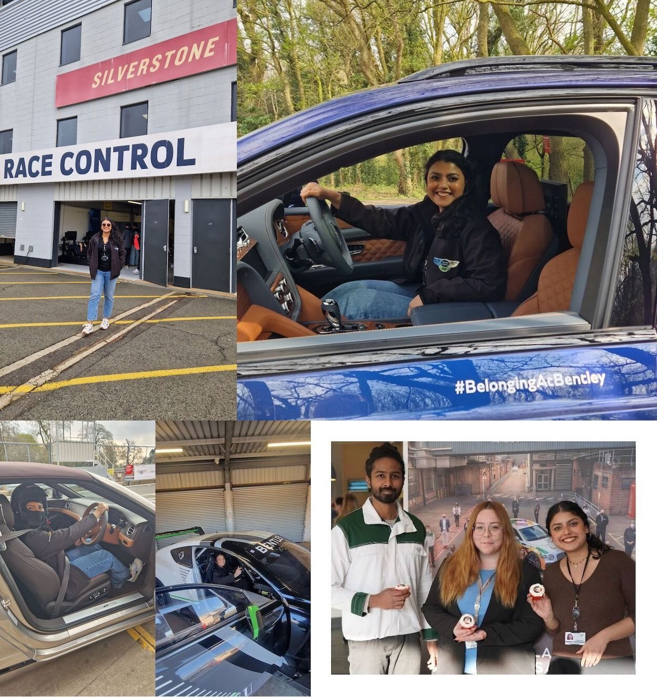
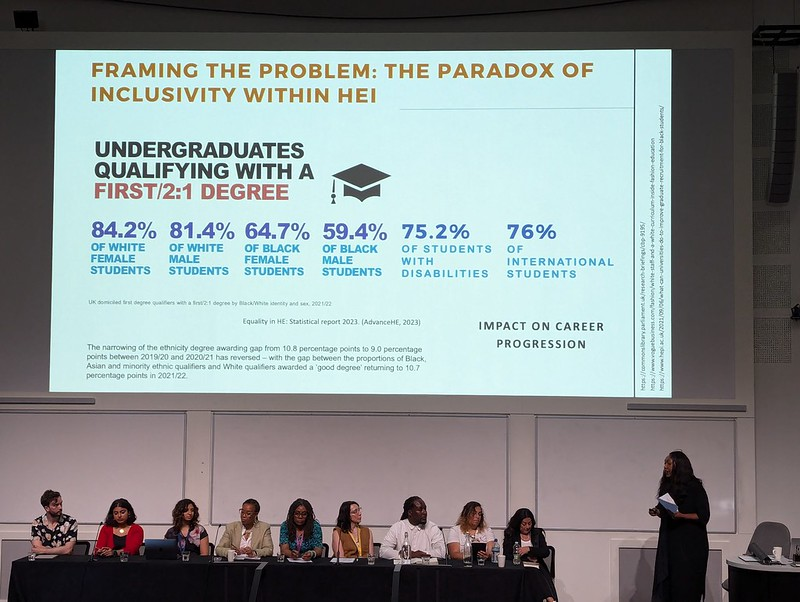

# Eman's Story {#eman}

Meet Eman Ahsan, shown in figure \@ref(fig:eman-fig). Eman graduated with a Bachelor of Science degree in Computer Science with Industrial Experience. She completed her placement year at [Bentley Motors](https://en.wikipedia.org/wiki/Bentley) in Crewe (see section \@ref(eman-bentley)) and volunteers for *Code Your Future*, an organisation that trains refugees and disadvantaged people to write code, [codeyourfuture.io](https://codeyourfuture.io/).

```{r eman-fig, echo = FALSE, fig.align = "center", out.width = "100%", fig.cap = "(ref:captioneman)"}
knitr::include_graphics("images/linkedineman.jpg")
```
(ref:captioneman) Eman Ahsan [linkedin.com/in/emanahsan](https://www.linkedin.com/in/emanahsan/). Picture re-used from LinkedIn with permission, thanks Eman.

(ref:podcastblurb)


```{r, eval=knitr::is_html_output(excludes = "epub"), results='asis', echo=FALSE}
cat('<iframe title="Libsyn Player" style="border: none" src="https://html5-player.libsyn.com/embed/episode/id/32383057/height/90/theme/custom/thumbnail/yes/direction/forward/render-playlist/no/custom-color/000000/" height="90" width="100%" scrolling="no"  allowfullscreen="" webkitallowfullscreen="true" mozallowfullscreen="true" allowfullscreen="true" msallowfullscreen="true" style="border: none;"></iframe>')
```


## What's Your Story Eman? {#eman-story}

An edited podcast transcript will appear here in due course. In the meantime highlights from *One Tune, One Book, One Podcast and One Film* shown below.

## One Tune {#eman-tune}

For her music, Eman chose *Tu Jhoom* performed by Naseebo Lal and Abida Parveen, see figure \@ref(fig:jhoom-fig). 

```{r jhoom-fig, echo = FALSE, fig.align = "center", out.width = "99%", fig.cap = "(ref:captionjhoom)"}
knitr::include_graphics("images/wikicoke.jpg")
```

(ref:captionjhoom) [Coke Studio Pakistan](https://en.wikipedia.org/wiki/Coke_Studio_Pakistan) (Urdu: کوک اِسٹوڈیو) is a television programme which features studio-recorded music performances by established and emerging artists. *Tu Jhoom* featured on series 14. [@tujhoom] If you don't speak Urdu, turn captions on to translate the lyrics into English. Fair use image from [commons.wikimedia.org](https://commons.wikimedia.org) 🇵🇰

## One Book {#eman-book}

For her book(s), Eman chose *[A Thousand Splendid Suns](https://en.wikipedia.org/wiki/A_Thousand_Splendid_Suns)* and *[The Kite Runner](https://en.wikipedia.org/wiki/The_Kite_Runner)* by Khaled Hosseini, see figure \@ref(fig:wikikhaled-fig).

```{r wikikhaled-fig, echo = FALSE, fig.align = "center", out.width = "100%", fig.cap = "(ref:captionwikikhaled)"}
knitr::include_graphics("images/wikikhaled.jpeg")
```

(ref:captionwikikhaled) [Khaled Hosseini](https://en.wikipedia.org/wiki/Khaled_Hosseini)'s debut novel *The Kite Runner* was a critical and commercial success; the book and his subsequent novels have all been at least partially set in Afghanistan and have featured an Afghan as the protagonist. Hosseini's novels have enlightened the global audience about Afghanistan's people and culture. CC BY licensed portrait of Khaled Hosseini via Wikimedia Commons [w.wiki/ApdT](https://w.wiki/ApdT) adapted using the [Wikipedia app](https://apps.apple.com/us/app/wikipedia/id324715238) 🇦🇫

## One Podcast {#eman-podcast}

For her podcast, Eman chose the True Crime Podcast [Serial Killers](https://open.spotify.com/show/4ruq7mH0jg1sFi8KQhnGb8)

## One Film {#eman-film}

For her film, Eman chose *The Terminal*, see figure \@ref(fig:wikiterminal-fig) [@theterminal]

```{r wikiterminal-fig, echo = FALSE, fig.align = "center", out.width = "100%", fig.cap = "(ref:captionwikiterminal)"}
knitr::include_graphics("images/wikiterminal.jpg")
```

(ref:captionwikiterminal) [The Terminal](https://en.wikipedia.org/wiki/The_Terminal) is a 2004 American comedy-drama film produced and directed by Steven Spielberg and starring Tom Hanks, Catherine Zeta-Jones and Stanley Tucci. The film is about an Eastern European man who is stuck in New York's John F. Kennedy Airport terminal when he is denied entry to the United States, but is unable to return to his native country. [@theterminal] Fair use image from [commons.wikimedia.org](https://commons.wikimedia.org) ✈️


## Studio Selfie {#eman-selfie}

Eman shared this studio selfie, see figure \@ref(fig:eman-selfie-fig)

```{r eman-selfie-fig, echo = FALSE, fig.align = "center", out.width = "100%", fig.cap = "(ref:captionemanselfie)"}
knitr::include_graphics("images/studioselfieeman.jpeg")
```

(ref:captionemanselfie) A selfie from the *Coding Your Future* studio 🤳


## Bentley Motors in Crewe {#eman-bentley}

Eman did a year long placement at Bentley Motors in Crewe, see figure \@ref(fig:eman-bentley-fig)

```{r eman-bentley-fig, echo = FALSE, fig.align = "center", out.width = "100%", fig.cap = "(ref:captionemanbentley)"}

```

(ref:captionemanbentley) Eman working at Bentley Motors, see [careers.bentleymotors.com](https://careers.bentleymotors.com). Collage of pictures reproduced with permission. [@emanbentley]

## Equality, Diversity & Inclusion {#eman-diversity}

During the podcast, we talked about  Equality, Diversity & Inclusion (EDI) and [Eid al-Fitr](https://en.wikipedia.org/wiki/Eid_al-Fitr). This followed on from an EDI panel that Eman served on (second left) at the Institute for Teaching & Learning conference in 2024, see figure \@ref(fig:edi-fig).

```{r edi-fig, echo = FALSE, fig.align = "center", out.width = "100%", fig.cap = "(ref:captionemanedi)"}

```

(ref:captionemanedi) The paradox of inclusivity within Higher Education Institutions (HEI), a panel at the ITL conference in 2024. [@itl2024]

## Big Sisters in STEM {#eman-stem}

Eman also talked about having role models she can identify with, such as [Zahra Montazeri](https://research.manchester.ac.uk/en/persons/zahra.montazeri) who was a guest on the *Big Sisters in STEM* podcast, shown in figure \@ref(fig:zahra-vid).

```{r zahra-vid, echo = FALSE, fig.align = "center", out.width = "100%", fig.cap = "(ref:captionzahra)"}
knitr::include_url('https://www.youtube.com/embed/aTglnAVpBxY')
```

(ref:captionzahra) Jasmine Barrow talks to [Zahra Montazeri](https://research.manchester.ac.uk/en/persons/zahra.montazeri) and Cagla Velidedeoglu about role models, unlocking creativity and shedding stereotypes on the *Big Sisters in STEM podcast*. [@bigsisters;@iranchester] The video in this figure can also be watched at [youtu.be/aTglnAVpBxY](https://youtu.be/aTglnAVpBxY)

## Disclaimer  


::: {.rmdcaution}

(ref:codingcaution)

(ref:transcript-disclaimer)  

:::
