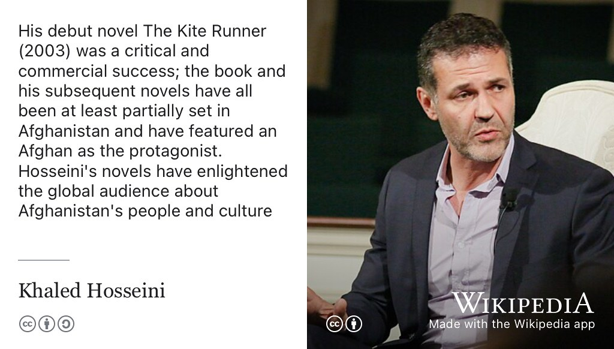
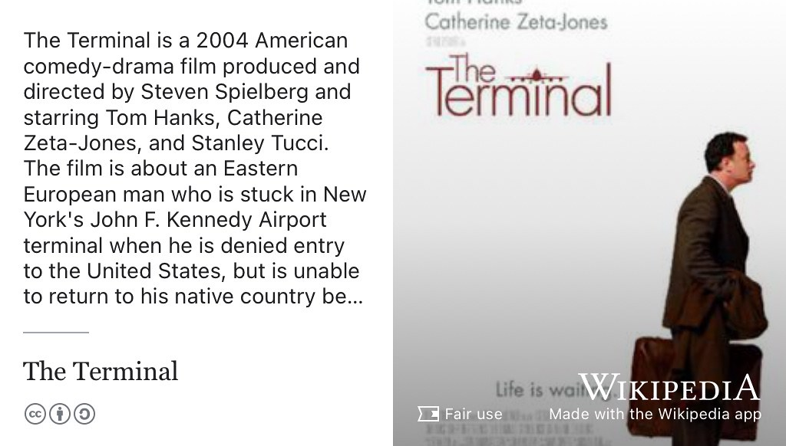
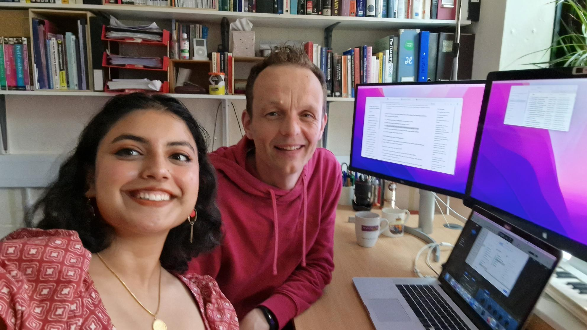

# Eman's Story {#eman}

Meet Eman Ahsan, shown in figure \@ref(fig:eman-fig). Eman graduated with a Bachelor of Science degree in Computer Science with Industrial Experience. She completed her placement year at [Bentley Motors](https://en.wikipedia.org/wiki/Bentley) in Crewe and volunteers for Code Your Future, an organisation that trains refugees and disadvantaged people to write code, [codeyourfuture.io](https://codeyourfuture.io/).

```{r eman-fig, echo = FALSE, fig.align = "center", out.width = "100%", fig.cap = "(ref:captioneman)"}

```
(ref:captioneman) Eman Ahsan [linkedin.com/in/emanahsan](https://www.linkedin.com/in/emanahsan/). Picture re-used from LinkedIn with permission, thanks Eman.

(ref:podcastblurb)


```{r, eval=knitr::is_html_output(excludes = "epub"), results='asis', echo=FALSE}
cat('<iframe title="Libsyn Player" style="border: none" src="https://html5-player.libsyn.com/embed/episode/id/32383057/height/90/theme/custom/thumbnail/yes/direction/forward/render-playlist/no/custom-color/000000/" height="90" width="100%" scrolling="no"  allowfullscreen="" webkitallowfullscreen="true" mozallowfullscreen="true" allowfullscreen="true" msallowfullscreen="true" style="border: none;"></iframe>')
```


## What's Your Story Eman? {#eman-story}

An edited podcast transcript will appear here in due course. In the meantime highlights from *One Tune, One Book, One Podcast and One Film* shown below.

## One Tune {#eman-tune}

For her music, Eman chose Jhoom by Ali Zafar, see figure \@ref(fig:jhoom-vid). 

```{r jhoom-vid, echo = FALSE, fig.align = "center", out.width = "99%", fig.cap = "(ref:captionjhoom)"}
knitr::include_url('https://www.youtube.com/embed/B4-HoKdW6j0')
```

(ref:captionjhoom) [Ali Zafar](https://en.wikipedia.org/wiki/Ali_Zafar) performs Jhoom, if you don't speak Urdu, turn captions on to translate the lyrics into English. 🇵🇰

## One Book {#eman-book}

For her book, Eman chose *[A Thousand Splendid Suns](https://en.wikipedia.org/wiki/A_Thousand_Splendid_Suns)* and *[The Kite Runner](https://en.wikipedia.org/wiki/The_Kite_Runner)* by Khaled Hosseini, see figure \@ref(fig:wikikhaled-fig).

```{r wikikhaled-fig, echo = FALSE, fig.align = "center", out.width = "100%", fig.cap = "(ref:captionwikikhaled)"}

```

(ref:captionwikikhaled) [Khaled Hosseini](https://en.wikipedia.org/wiki/Khaled_Hosseini)'s debut novel *The Kite Runner* was a critical and commercial success; the book and his subsequent novels have all been at least partially set in Afghanistan and have featured an Afghan as the protagonist. Hosseini's novels have enlightened the global audience about Afghanistan's people and culture. 🇦🇫

## One Podcast {#eman-podcast}

For her podcast, Eman chose the True Crime Podcast [Serial Killers](https://open.spotify.com/show/4ruq7mH0jg1sFi8KQhnGb8)

## One Film {#eman-film}

For her film, Eman chose *The Terminal*, see figure \@ref(fig:wikiterminal-fig)

```{r wikiterminal-fig, echo = FALSE, fig.align = "center", out.width = "100%", fig.cap = "(ref:captionwikiterminal)"}

```

(ref:captionwikiterminal) [The Terminal](https://en.wikipedia.org/wiki/The_Terminal) is a 2004 American comedy-drama film produced and directed by Steven Spielberg and starring Tom Hanks, Catherine Zeta-Jones and Stanley Tucci. The film is about an Eastern European man who is stuck in New York's John F. Kennedy Airport terminal when he is denied entry to the United States, but is unable to return to his native country.


## Studio Selfie {#eman-selfie}

Eman shared this studio selfie, see figure \@ref(fig:eman-selfie-fig)

```{r eman-selfie-fig, echo = FALSE, fig.align = "center", out.width = "100%", fig.cap = "(ref:captionemanselfie)"}

```

(ref:captionemanselfie) A selfie from the *Coding Your Future* studio 🤳

## Disclaimer  


::: {.rmdcaution}

(ref:codingcaution)

(ref:transcript-disclaimer)  

:::
