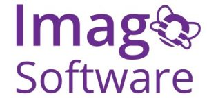

# Opportunities with Imago {#imago}

Imago Software, our Student Software Company at The University of Manchester, is now recruiting for its summer 2025 projects. We have several full-time and part-time positions for undergraduate students running throughout the summer vacation.

```{r imagogo-fig, echo = FALSE, fig.align = "center", out.width = "100%", fig.cap = "(ref:captionimagogo)"}

```

(ref:captionimagogo) Imago is our student software company at the University of Manchester: [imago.cs.manchester.ac.uk](https://imago.cs.manchester.ac.uk). The company is run by students and named after an [imago, the final stage in development of an insect](https://simple.wikipedia.org/wiki/Imago).
 
You will work as part of a team of students, supervised either by a member of staff from the Department of Computer Science, The University of Manchester or a professional software engineer from a local company.
 
The posts will give experience of working in an agile team, delivering working and valuable software for real clients. We will need a range of skills including business analysis, user experience, web and backend coding, plus testing and delivery engineering. The ability to work independently and within a team, to find creative and pragmatic solutions to problems, and a focus on delivering value for the client is also required. We are looking to create mixed teams, with a range of experience levels. First year students are encouraged to apply.

Find out more at [bit.ly/imago-summer-2025](https://bit.ly/imago-summer-2025)

```{r, eval=knitr::is_html_output(excludes = "epub"), results='asis', echo=FALSE}
cat('<iframe src="https://www.linkedin.com/embed/feed/update/urn:li:share:7295011155629002752" height="399" width="504" frameborder="0" allowfullscreen="" title="Embedded post"></iframe>')
```


 