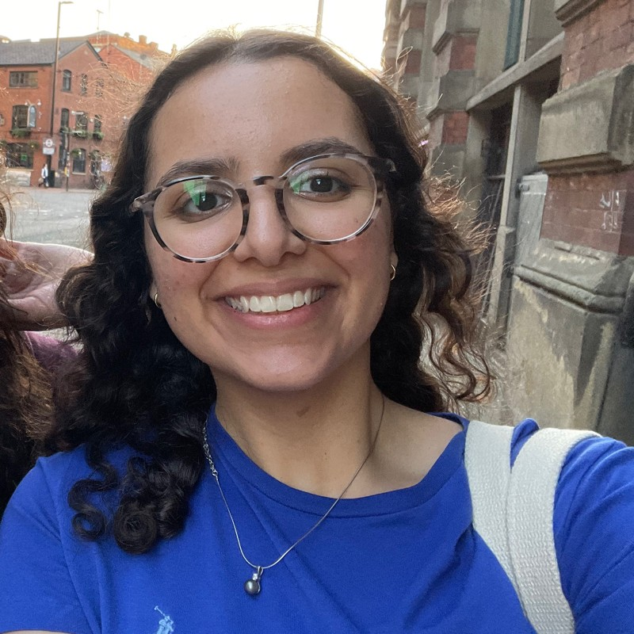

# Ingy's story {#ingy}

Meet Ingy Abdelhalim, see figure \@ref(fig:ingy-fig) she graduated with a Bachelor of Science degree in Computer Science in 2023.

```{r ingy-fig, echo = FALSE, fig.align = "center", out.width = "100%", fig.cap = "(ref:captioningy)"}

```
(ref:captioningy) Ingy Abdelhalim. Picture reused from [linkedin.com/in/ingyabdehalim](https://www.linkedin.com/in/ingyabdehalim) with permission, thanks Ingy.

## What's your story Ingy? {#ingy-story}

Podcast episode and transcript to appear here
