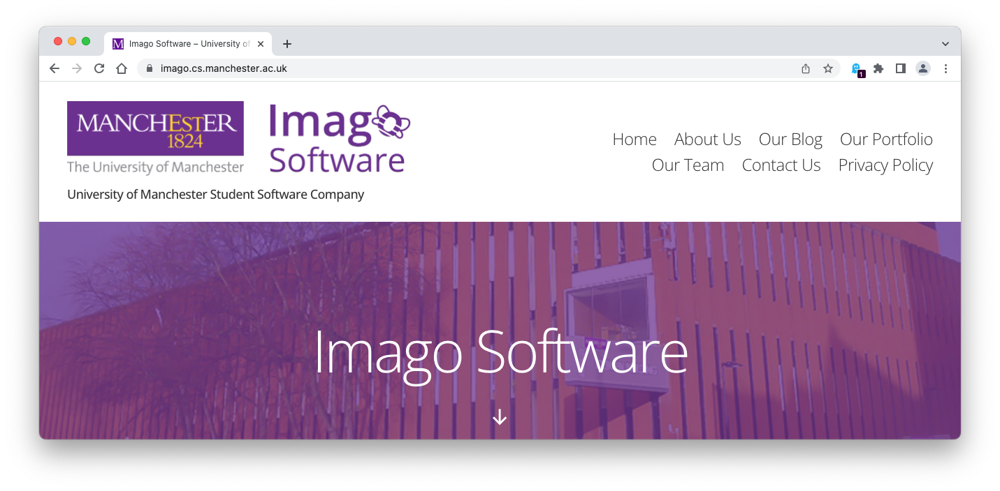

# Nadine's story {#nadine}

Meet Nadine Abdelhalim, see figure \@ref(fig:ivo-fig) she graduated with a Bachelor of Science degree in Computer Science in 2023 when this episode was first recorded. During her degree, Nadine worked at [imago.cs.manchester.ac.uk](https://imago.cs.manchester.ac.uk/) (see figure \@ref(fig:imago-fig)) and [arm.com](https://www.arm.com/).

```{r nadine-fig, echo = FALSE, fig.align = "center", out.width = "100%", fig.cap = "(ref:captionnadine)"}
knitr::include_graphics("images/nadine.jpeg")
```
(ref:captionnadine) Nadine Abdelhalim. Picture reused from [linkedin.com/in/nadineabdelhalim](https://www.linkedin.com/in/nadineabdelhalim) with permission, thanks Nadine.

(ref:podcastblurb)

```{r, eval=knitr::is_html_output(excludes = "epub"), results='asis', echo=FALSE}
cat('<iframe title="Libsyn Player" style="border: none" src="https://html5-player.libsyn.com/embed/episode/id/27147834/height/90/theme/custom/thumbnail/yes/direction/forward/render-playlist/no/custom-color/000000/" height="90" width="100%" scrolling="no"  allowfullscreen="" webkitallowfullscreen="true" mozallowfullscreen="true" allowfullscreen="true" msallowfullscreen="true" style="border: none;"></iframe>')
```

## What's your story Nadine? {#nadine-story}

An edited podcast transcript will appear here in due course. In the meantime, an un-edited, [raw machine-generated transcript can be found here](https://github.com/dullhunk/cdyf/blob/master/raw-transcript-nadine.md).


```{r imago-fig, echo = FALSE, fig.align = "center", out.width = "100%", fig.cap = "(ref:captionimago)"}

```
(ref:captionimago) Imago is the University of Manchester’s student software company. They create beautiful and useful software for paying clients, using the skills and experience students have gained during their time at University. Screenshot of the company website from [imago.cs.manchester.ac.uk](https://imago.cs.manchester.ac.uk/)


## Disclaimer  


::: {.rmdcaution}

(ref:codingcaution)

(ref:transcript-disclaimer)  

:::


