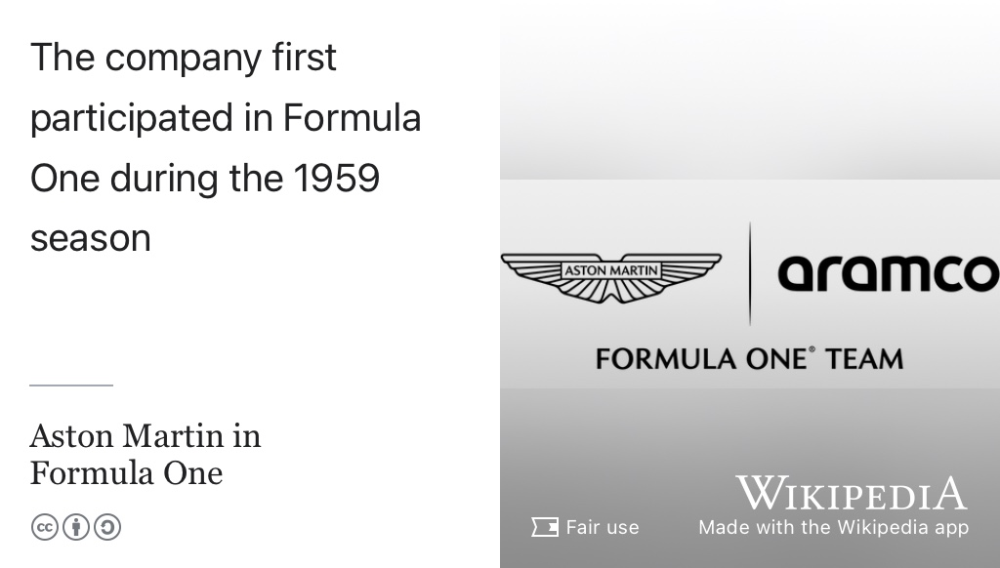
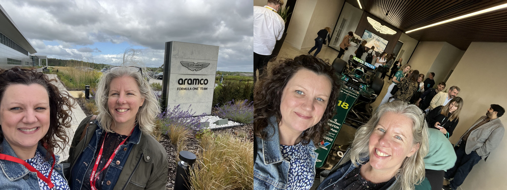

# Opportunities with Aston Martin {#amf1}

Are you a first or second year undergraduate [STEM](https://en.wikipedia.org/wiki/Science,_technology,_engineering,_and_mathematics) student at the University of Manchester? Our friends at the [Aston Martin Aramco Formula One](https://www.astonmartinf1.com)® Team are offering a limited number of places on their ‘[Make A Mark](https://www.astonmartinf1.com/en-GB/make-a-mark)’ experience day on Thursday, 3rd July 2025. If you are interested in a career in motorsport, then this is for you. High-performance motorsport requires [high-performance computing](https://en.wikipedia.org/wiki/High-performance_computing) (HPC) as part of a range of Science, Technology, Engineering, Mathematics (STEM) and Artificial Intelligence (AI) to maintain a competitive edge.

```{r amf1-fig, echo = FALSE, fig.align = "center", out.width = "100%", fig.cap = "(ref:captionamf1)"}

```
(ref:captionamf1) [Aston Martin have been competing in Formula One](https://en.wikipedia.org/wiki/Aston_Martin_in_Formula_One) since 1959 from their headquarters at the [Silverstone Circuit](https://en.wikipedia.org/wiki/Silverstone_Circuit), home of the British Grand Prix. They have a wide range of careers on offer for [STEM](https://en.wikipedia.org/wiki/Science,_technology,_engineering,_and_mathematics) students, see [astonmartinf1.com/en-GB/careers](https://www.astonmartinf1.com/en-GB/careers). Fair use image from Wikimedia Commons [w.wiki/ERXN](https://w.wiki/ERXN) adapted with the [Wikipedia App](https://apps.apple.com/us/app/wikipedia/id324715238) 🏁
 
Attendees will get a full-day experience at the heart of their Formula One operations, where you’ll get a behind-the-scenes look at life in motorsport engineering — from simulators and sustainability challenges to campus tours and a keynote on what it takes to win in F1.

## Make A Mark Experience Day {#makeamark}

The details for the day are:
 
* 📆 **Date**: Thursday 3rd July 2025
* 🕣 **Time**: 10:00–17:15, arrival from 9:30am
* 📍 **Location**: Aston Martin Racing Technology Centre (AMRTC), Silverstone, see figure \@ref(fig:amf1-fig)

The nearest mainline station is [Milton Keynes Central](https://www.nationalrail.co.uk/stations/milton-keynes-central/) (MKC). From there, travel by taxi to AMRTC. The day includes:

* Keynote Speaker: The role of teamwork in racing success
* Panel with AMF1 employees & gradudates
* Campus tour of world-class facilities
* Engineering & AI workshops with sponsors
* Simulator experience + pit crew reaction challenges
* [climatefresk.org](https://climatefresk.org) challenge with Elemis
* Lunch and refreshments will be provided

::: {.rmdcaution}

(ref:codingcaution)

Unfortunately travel costs will not be covered, so please check that you are able to cover this before expressing an interest.

:::

## Interested? {#express}
 
To express your interest, email [FSECareers@manchester.ac.uk](mailto:FSECareers@manchester.ac.uk) **by Thursday, 12th June** stating your:

* Name
* Student ID
* Degree Course
* Year of Study
* Reason for attending (no more than 100 words)

You must also confirm that you are available to attend on 3rd July and are able to cover your own travel costs. We will be in touch to let you know if we are able to confirm your place and to provide more details shortly after the above deadline. If you have any questions, please contact [FSECareers@manchester.ac.uk](mailto:FSECareers@manchester.ac.uk) see figure \@ref(fig:amanda-fig)
 
```{r amanda-fig, echo = FALSE, fig.align = "center", out.width = "100%", fig.cap = "(ref:captionamanda)"}

```
(ref:captionamanda) Amanda Conway and Helen Frost from the University of Manchester careers service [www.careers.manchester.ac.uk](https://www.careers.manchester.ac.uk) visiting Aston Martin F1 earlier this year. [@frost;@consultants]
