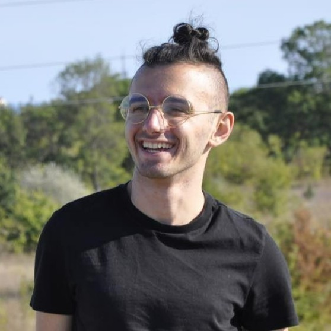
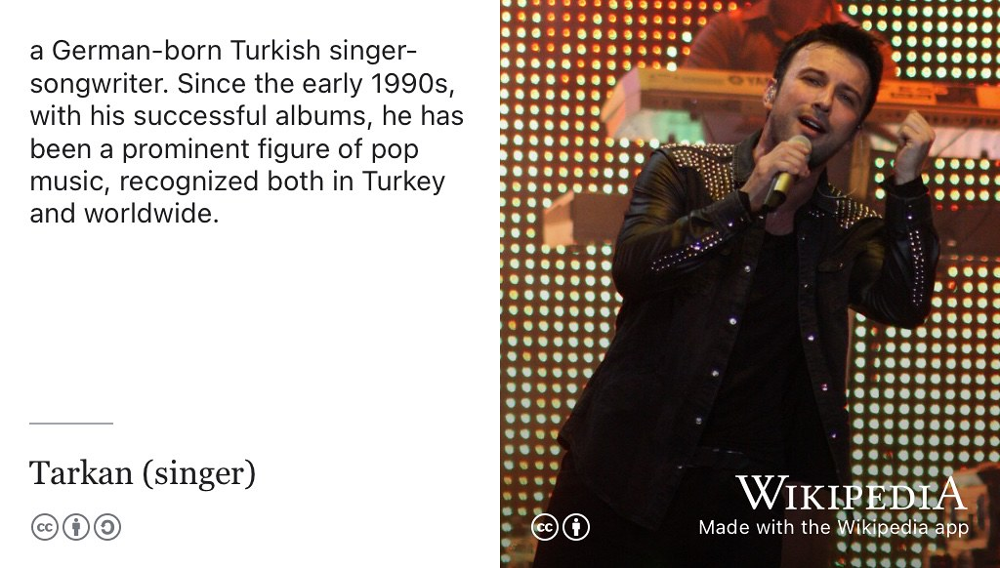
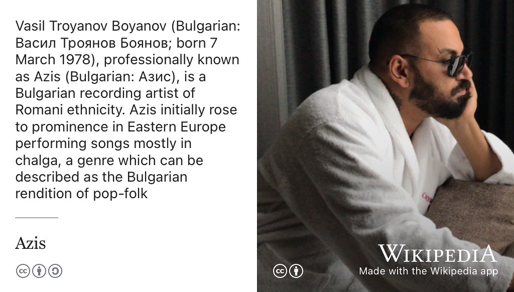
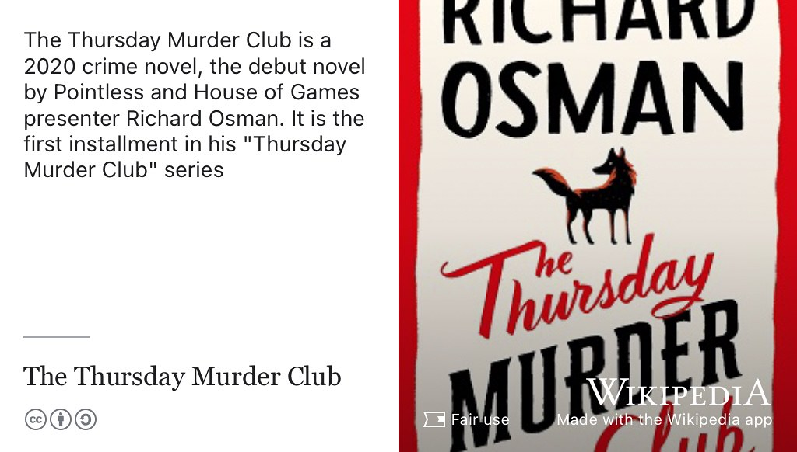
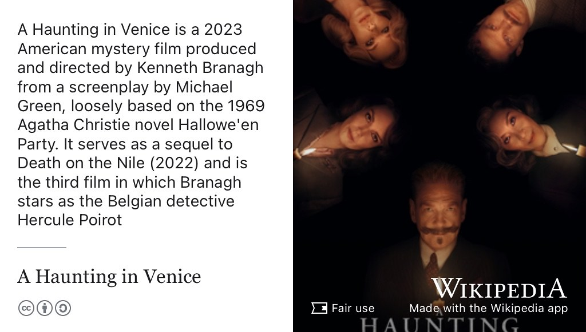

# Bozhidar's Story {#bozhidar}

Meet Bozhidar Klouchek, shown in figure \@ref(fig:boz-fig). Bozhidar graduated with a Bachelor of Science degree in Computer Science with Industrial Experience in 2024. During his degree he did internships and placements at the University of Oslo, [cantarus.com](https://www.cantarus.com/), [Imago (the student software company)](https://imago.cs.manchester.ac.uk/) before taking a graduate role at [recourseai.com](https://www.recourseai.com/) in Manchester. 

```{r boz-fig, echo = FALSE, fig.align = "center", out.width = "100%", fig.cap = "(ref:captionboz)"}

```
(ref:captionboz) Bozhidar Klouchek [linkedin.com/in/bozhidar-klouchek-56449a18b](https://www.linkedin.com/in/bozhidar-klouchek-56449a18b/). Picture re-used from LinkedIn with permission, thanks Bozhidar.

```{r, eval=knitr::is_html_output(excludes = "epub"), results='asis', echo=FALSE}
cat('<iframe title="Libsyn Player" style="border: none" src="https://html5-player.libsyn.com/embed/episode/id/32382377/height/90/theme/custom/thumbnail/yes/direction/forward/render-playlist/no/custom-color/000000/" height="90" width="100%" scrolling="no"  allowfullscreen="" webkitallowfullscreen="true" mozallowfullscreen="true" allowfullscreen="true" msallowfullscreen="true" style="border: none;"></iframe>')
```

## What's Your Story Bozhidar? {#boz-story}


An edited podcast transcript will appear here in due course. In the meantime, an [un-edited, raw machine-generated transcript can be found here](https://github.com/dullhunk/cdyf/blob/master/raw-transcript-bozhidar.md) with highlights from *One Tune, One Book, One Podcast and One Film* shown below.


## One Tune {#boz-tune}

For his music, Bozhidar chose [Öp](https://www.youtube.com/watch?v=QNoC_mVojhc) by Turkish artist Tarkan, see figure \@ref(fig:wikitarkan-fig).

```{r wikitarkan-fig, echo = FALSE, fig.align = "center", out.width = "100%", fig.cap = "(ref:captionwikitarkan)"}

```

(ref:captionwikitarkan) [Tarkan Tevetoğlu](https://en.wikipedia.org/wiki/Tarkan_(singer)) and is a German-born Turkish singer-songwriter. He has been a prominent figure of pop music, recognised both in Turkey and worldwide. 🇹🇷


We also talked about the Bulgarian music played at the 2023 Computer Science Ball which was [Sen Trope](https://www.youtube.com/watch?v=BplsGX5eLLo) by Azis, see figure \@ref(fig:wikiazis-fig).

```{r wikiazis-fig, echo = FALSE, fig.align = "center", out.width = "100%", fig.cap = "(ref:captionwikiazis)"}

```


(ref:captionwikiazis) [Azis](https://en.wikipedia.org/wiki/Azis) (Bulgarian: Азис) is a Bulgarian recording artist of Romani ethnicity. Azis initially rose to prominence in Eastern Europe performing songs mostly in [chalga](https://en.wikipedia.org/wiki/Chalga), a genre which can be described as the Bulgarian rendition of pop-folk. 🇧🇬


## One Book {#boz-book}

For his book, Bozhidar chose [The Thursday Murder Club](https://en.wikipedia.org/wiki/The_Thursday_Murder_Club) by Richard Osman, see figure \@ref(fig:wikiosman-fig)

```{r wikiosman-fig, echo = FALSE, fig.align = "center", out.width = "100%", fig.cap = "(ref:captionwikiosman)"}

```

(ref:captionwikiosman) The Thursday Murder Club is a 2020 crime novel, the debut novel by Richard Osman. It is the first installment in his *Thursday Murder Club* series.

## One Podcast {#boz-podcast}

For his podcast, Bozhidar chose [The Basement Yard podcast](https://www.youtube.com/channel/UC_a6c3KLo9reMOqn2pbvMqg)

## One Film {#boz-film}

For his film, Bozhidar chose *A Haunting in Venice*, see figure \@ref(fig:wikihaunting-fig)

```{r wikihaunting-fig, echo = FALSE, fig.align = "center", out.width = "100%", fig.cap = "(ref:captionwikihaunting)"}

```

(ref:captionwikihaunting) [A Haunting in Venice](https://en.wikipedia.org/wiki/A_Haunting_in_Venice) is a 2023 American mystery film produced and directed by Kenneth Branagh from a screenplay by Michael Green, loosely based on the 1969 Agatha Christie novel *Hallowe'en Party*. It serves as a sequel to *Death on the Nile* (2022) and is the third film in which Branagh stars as the Belgian detective Hercule Poirot. 

## Studio Selfie {#boz-selfie}

Watch this space

## Graduation {#boz-graduation}

```{r, eval=knitr::is_html_output(excludes = "pdf"), results='asis', echo=FALSE}
cat('<iframe src="https://www.linkedin.com/embed/feed/update/urn:li:share:7222190262943420416" height="1319" width="504" frameborder="0" allowfullscreen="" title="Embedded post"></iframe>')
```


## Disclaimer  


::: {.rmdcaution}

(ref:codingcaution)

(ref:transcript-disclaimer)  

:::
