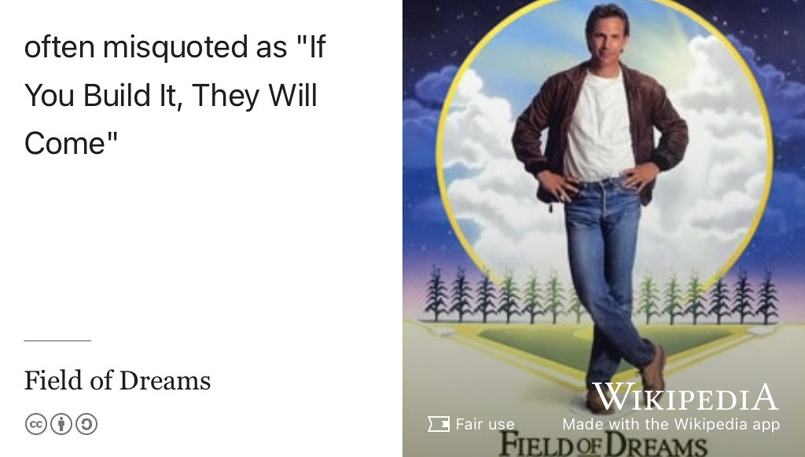
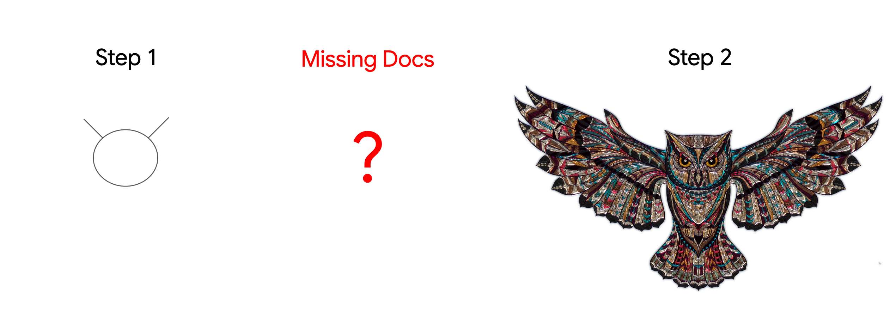
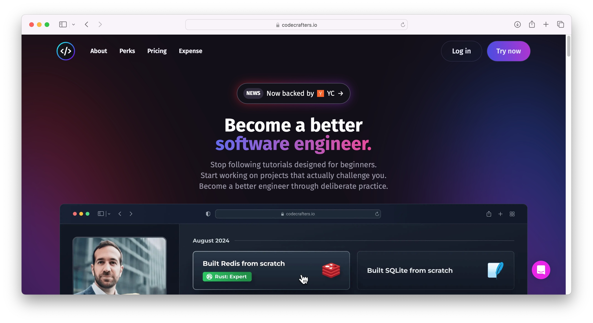
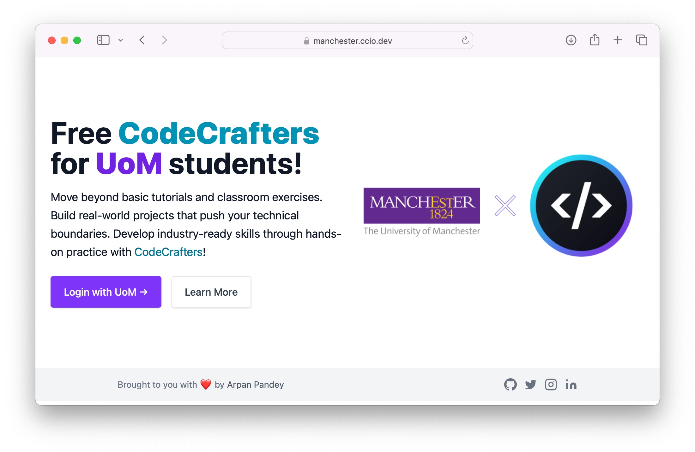

# Opportunities with CodeCrafters {#crafting}

CodeCrafters is a tool that helps you to sharpen your engineering skills, build your knowledge and improve your portfolio with a wide range of structured projects. Why? Because: 

* “_If You Build It, They Will Come_” see figure \@ref(fig:wikicome-fig).

```{r wikicome-fig, echo = FALSE, fig.align = "center", out.width = "100%", fig.cap = "(ref:captionwikicome)"}

```

(ref:captionwikicome) The phrase “_If You Build It, They Will Come_” is a quote from the film _[Field of Dreams](https://en.wikipedia.org/wiki/Field_of_Dreams)_ where the lead character, played by Kevin Costner pictured above, builds a baseball field on his farm after hearing a voice in his head telling him that “_If You Build It, He Will Come_”. [@fieldofdreams] Fair use image from Wikimedia Commons. ⚾️

If you build it, they _will_ come because:

* Building stuff will help you learn new things
* Building interesting software and hardware will help your CV stand out from those of your competitors
* Building *anything* will supercharge your skills and knowledge by _applying_ what you have learned in your formal education
* Building a project for your portfolio will give you _lots_ to talk about in your job applications and interviews
* Building stuff for curiosity can be fun! It's easy to lose sight of this fact during the hard grind required to get a degree. So, build it because you _want_ to, _[because it's there](https://en.wikipedia.org/wiki/George_Mallory)_, not just because some teacher, lecturer or professor made you do it for their course. 

These are all strong arguments for working on all kinds of `PROJECTS`: personal, solo, voluntary, hacking, collaborative, freelance, tinkering or a pet side project, as outlined in section \@ref(projects). But:

* where do you start? 
* how can you keep going? 
* when will you finish, if you finish at all?

Open source software projects are great fodder for portfolios but can be intimidating for beginners and outsiders, see section \@ref(opensource). Whether it's open or closed, building a portfolio can feel like drawing the owl shown in figure \@ref(fig:owl-fig): 

1. draw some simple lines 
1. draw the rest owl 

There's a **BIG** piece missing in the middle, the missing docs, to help you keep going and help you finish your engineering project(s). 

```{r owl-fig, echo = FALSE, fig.align = "center", out.width = "100%", fig.cap = "(ref:captionowl)"}

```

(ref:captionowl) Drawing an owl step by step should be an easy project: `Step 1` just your draw an oval and some simple lines, then `Step 2` fill in the rest of the owl. Easy? Not really, most people need more steps and help from the elusive `missing docs`. Creative Commons licensed screenshot taken from Google's Tech Writing course, see section \@ref(techwriting). 🦉

## Crafting Your Future with CodeCrafters {#codecrafters}

The `missing docs` is a problem that [codecrafters.io](https://codecrafters.io) can help you with. Their coding challenges take you through building your own $x$, step by step. You won't just build your CV, you'll become a better engineer too. Choose from a range of challenges from making your own [shell](https://en.wikipedia.org/wiki/Shell_(computing)) or [interpreter](https://en.wikipedia.org/wiki/Interpreter_(computing)) to building your own [Git](https://en.wikipedia.org/wiki/Git), [Redis](https://en.wikipedia.org/wiki/Redis), [SQLite](https://en.wikipedia.org/wiki/SQLite) or [DNS server](https://en.wikipedia.org/wiki/Name_server). There's plenty of projects to choose from in whatever language you feel comfortable with or whatever new language you'd like to start using and learn more about, see figure \@ref(fig:codecrafters-fig).

```{r codecrafters-fig, echo = FALSE, fig.align = "center", out.width = "100%", fig.cap = "(ref:captioncodecrafters)"}

```

(ref:captioncodecrafters) Become a better software engineer with CodeCrafters. Stop following tutorials designed for beginners. Start working on `PROJECTS` that actually challenge you. Become a better engineer through deliberate structured practice, screenshot from [codecrafters.io](https://codecrafters.io/)

Co-founded by [Sarup Banskota](https://www.linkedin.com/in/sarupbanskota/) and [Paul Kuruvilla](https://www.linkedin.com/in/rohitpaulk/), CodeCrafters was backed by [ycombinator.com](https://www.ycombinator.com/) in 2022. The free tier of codecrafters gives you limited content access and community features, but if you're a student at the University of Manchester, we're excited to offer you something better. 

## Free CodeCrafters for UoM students  {#freecode}

If you're a student at the University of Manchester (UoM), we are pleased to be able to offer a one year membership for professionals, which [normally costs $30 per month](https://codecrafters.io/pricing) for free (**YES free!**) via [manchester.ccio.dev](https://manchester.ccio.dev/).

```{r mancraft-fig, echo = FALSE, fig.align = "center", out.width = "100%", fig.cap = "(ref:captionarpan)"}

```

(ref:captionarpan) Move beyond basic tutorials and classroom exercises. Build real-world projects that push your technical boundaries. Develop industry-ready skills through hands-on practice with [codecrafters.io](https://codecrafters.io/). If you're a University of Manchester student, you can register using your student credentials at [manchester.ccio.dev](https://manchester.ccio.dev/)

## Summertime and the Coding is Easy {#summertime}

Unfortunately, Summertime coding^[summertime or _any_ vacation, holiday, evening, weekend or down-time] isn't always as easy as we might hope. Building a portfolio of interesting projects takes time and resilience. Codecrafters doesn't make this *easy* but it does make it _easi-er_ by giving you structured projects to work through in your own time at your own pace. Their projects will help you build your knowledge and provide a portfolio of concrete evidence of your skills that you can use in your job applications and job interviews.

Apart from any career considerations, it is fun to challenge yourself to build stuff just for the sheer enjoyment of it. _To engineer is human_, engineering can satisfy some of our most basic human impulses. [@henrypetroski]

If you build it, _they will_ come, whatever field you are dreaming in. You'll improve the chances that _they will_ invite you to interviews and you will improve the chances that _they will_ offer you the job. So get building and get experimenting with CodeCrafters. The only question is, what will you make? 

```{r ella-vid, echo = FALSE, fig.align = "center", out.width = "99%", fig.cap = "(ref:captionella)"}
knitr::include_url('https://www.youtube.com/embed/u2bigf337aU')
```


(ref:captionella) “_Summertime and the ~~coding~~ living is easy, fish are jumping and the cotton is high_”: Ella Fitzgerald performing _Summertime_ in 1968. [@ella]


## Acknowledgements {#ackcraft}

Big thanks to [Arpan Pandey](https://simple.arpanpandey.dev/) for negotiating and building CodeCrafters access for students at the University of Manchester, shown in figure \@ref(fig:mancraft-fig). 🙏

_Summertime_ is an aria composed by George Gershwin for the opera _Porgy and Bess_. [@summertime] Many versions of the song have been recorded by different artists including Ella Fitzgerald and Louis Armstrong shown in figure \@ref(fig:ella-vid). [@ella]

