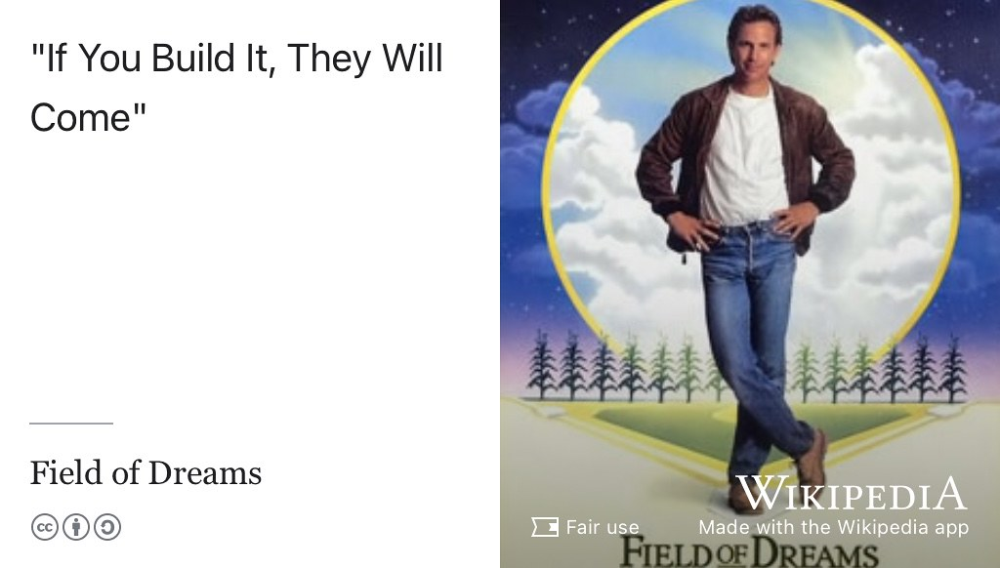

# Opportunities with CodeCrafters {#crafting}

If You Build It, They Will Come.

* Build your portfolio, _they said_. 
* Building stuff will help you learn new things, _they said_. 
* Building interesting software and hardware will help your CV stand out, _they said_. 
* Building *anything* will supercharge your skills by applying what you've learned, _they said_. 
* Building a range of projects will give you plenty to talk about in job applications and interviews, _they said_.

These are all strong arguments for working on `PROJECTS` beyond those required for whatever degree you are studying, see section \@ref(projects). But where do you start and how can you keep going? Open source projects are great but can be intimidating to beginners and outsiders, see section \@ref(opensource). Whatever kind of projects you are working on, building a portfolio can feel like drawing the owl shown in figure \@ref(fig:owl-fig): `Step 1`: draw some simple lines ...  `Step 2`: ... draw the rest owl. There's a **BIG** piece missing in the middle, the missing docs, to help you keep going and help you finish your engineering project. 

```{r owl-fig, echo = FALSE, fig.align = "center", out.width = "100%", fig.cap = "(ref:captionowl)"}
knitr::include_graphics("images/owldraw.png")
```

(ref:captionowl) Draw an owl step by step should be an easy project: 'Step 1' just your draw an oval and some simple lines, then 'Step 2' fill in the rest of the owl. Easy? Not really. Creative Commons licensed screenshot taken from Google's Tech Writing course, see section \@ref(techwriting). 🦉

## Crafting Your Future with CodeCrafters {#codecrafters}

The missing docs is a problem that [codecrafters.io](https://codecrafters.io) can help you with. Their coding challenges take you through building your own $x$, step by step. You won't just build your CV, you'll become a better engineer too. Choose from a range of challenges from making your own `shell` to building your own [Git](https://en.wikipedia.org/wiki/Git), [Redis](https://en.wikipedia.org/wiki/Redis), [SQLite](https://en.wikipedia.org/wiki/SQLite) and [Docker](https://en.wikipedia.org/wiki/Docker_(software)). There's plenty of projects to choose from in whatever language you feel comfortable with or whatever new language you'd like to learn more about and start using, see figure \@ref(fig:codecrafters-fig).

```{r codecrafters-fig, echo = FALSE, fig.align = "center", out.width = "100%", fig.cap = "(ref:captioncodecrafters)"}
knitr::include_graphics("images/screenshot-codecrafters.jpg")
```

(ref:captioncodecrafters) Become a software better engineer with CodeCrafters. Stop following tutorials designed for beginners. Start working on `PROJECTS` that actually challenge you. Become a better engineer through deliberate structured practice, screenshot from [codecrafters.io](https://codecrafters.io/)

Co-founded by [Sarup Banksota](https://www.linkedin.com/in/sarupbanskota/) and [Paul Kuruvilla](https://www.linkedin.com/in/rohitpaulk/), CodeCrafters was backed by [ycombinator.com](https://www.ycombinator.com/) in 2022. The free tier of codecrafters gives you limited content access and community features. 

## Free CodeCrafters for UoM students  {#freecode}

If you're a student at the University of Manchester (UoM), we are pleased to be able to offer more access for free via [manchester.ccio.dev](https://manchester.ccio.dev/) see figure \@ref(fig:mancraft-fig)

```{r mancraft-fig, echo = FALSE, fig.align = "center", out.width = "100%", fig.cap = "(ref:captionarpan)"}
knitr::include_graphics("images/screenshot-arpan.jpg")
```

(ref:captionarpan) Move beyond basic tutorials and classroom exercises. Build real-world projects that push your technical boundaries. Develop industry-ready skills through hands-on practice with [codecrafters.io](https://codecrafters.io/). If you're a University of Manchester student, you can register using your student credentials at [manchester.ccio.dev](https://manchester.ccio.dev/)

## Summertime and the Codin' is Easy {#summertime}

Coding in summertime (or any vacation time) isn't always easy. Building a portfolio of interesting projects takes time and perseverance. Codecrafters makes it easier by giving you structured projects to work through in your own time at your own pace. Their projects will help you build your skills, knowledge and provide a portfolio as concrete evidence you can use in your job applications and job interviews.

Apart from any career considerations, it is fun to challenge yourself to build stuff just for the sheer enjoyment of it. _To engineer is human_, it can satisfy some of our most basic impulses. [@henrypetroski]

So get building and get experimenting with CodeCrafters. The only question is, what will you make? 

If you build it, _they will_ come, see figure \@ref(fig:wikicome-fig). You'll improve the chances that _they will_ invite you to interviews and you will improve the chances that _they will_ offer you the job.

```{r wikicome-fig, echo = FALSE, fig.align = "center", out.width = "100%", fig.cap = "(ref:captionwikicome)"}

```

(ref:captionwikicome) The phrase “_If You Build It, They Will Come_” is a misquote from the film, _Field of Dreams_ where the lead character hears a voice telling him that “_If You Build It, He Will Come_”. [@fieldofdreams]

## Acknowledgements {#ackcraft}

Thanks to [Arpan Pandey](https://github.com/Arpan-206) for negotiating and building CodeCrafters access for students at the University of Manchester. 🙏

_Summertime_ (and the livin' is easy) is an aria composed by George Gershwin for the 1935 opera _Porgy and Bess_. [@summertime] Versions of the song have been recorded by many different artists including Ella Fitzgerald and Louis Armstrong shown in figure \@ref(fig:ella-vid). [@ella]

```{r ella-vid, echo = FALSE, fig.align = "center", out.width = "99%", fig.cap = "(ref:captionella)"}
knitr::include_url('https://www.youtube.com/embed/u2bigf337aU')
```


(ref:captionella) “_Summertime and the livin' is easy, fish are jumpin' and the cotton is high_” 