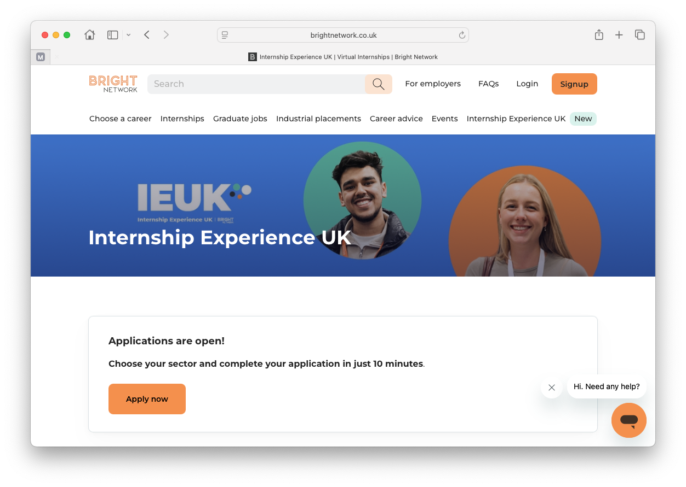

# Opportunities with the Bright Network {#bright}

The Bright Network has been supporting students and graduates since 2013. There is no specific age their members need to be, but most of the jobs on their website [brightnetwork.co.uk](https://www.brightnetwork.co.uk) are for students and graduates.

```{r, eval=knitr::is_html_output(excludes = "epub"), results='asis', echo=FALSE}
cat('<iframe src="https://www.linkedin.com/embed/feed/update/urn:li:ugcPost:7381623324247887873" height="796" width="504" frameborder="0" allowfullscreen="" title="Embedded post"></iframe>')
```


<!--## Internship Experience UK {#ieuk}-->

<!--Internship Experience UK (or `IEUK`) is one example of several opportunities provided by the Bright Network’s every summer, see figure \@ref(fig:brightnet-fig).-->

<!--```{r brightnet-fig, echo = FALSE, fig.align = "center", out.width = "100%", fig.cap = "(ref:captionbrightnet)"}

```-->

<!--(ref:captionbrightnet) IEUK is the Bright Network’s 4-day virtual internship programme taking place every summer opportunities in (1) Technology & Engienering (2) Finance, Professional Services & Consulting (3) Business, Operatings & Marketing or (4) Commercial law. Screenshot from [brightnetwork.co.uk/ieuk](https://www.brightnetwork.co.uk/ieuk/)-->

<!--In 2025 the experience is designed specifically for first, second and penultimate year undergraduates who are preparing to launch their early career.-->

<!--Over 145,000 students have completed the live version of IEUK since it began in 2020. It’s a staple part of your university experience — don’t miss out on connecting with like-minded students and 37 industry-leading employers including... -->

<!--* Google
* [sky.com](https://www.sky.com), [ey.com](https://www.ey.com), [deloitte.com](https://www.deloitte.com)
* [JLR.com](https://www.jlr.com) and [britishairways.com](https://www.britishairways.com) 
* [cisco.com](https://www.cisco.com), IBM, [lloydsbank.com](https://www.lloydsbank.com)
* [www.gchq.gov.uk](https://www.gchq.gov.uk) and [www.sis.gov.uk](https://www.sis.gov.uk)-->

<!--
.. and many others. Find out more and apply by apply by 8th of July at [brightnetwork.co.uk/ieuk](https://www.brightnetwork.co.uk/ieuk/)-->

Find out more about opportunities at [brightnetwork.co.uk](https://www.brightnetwork.co.uk)