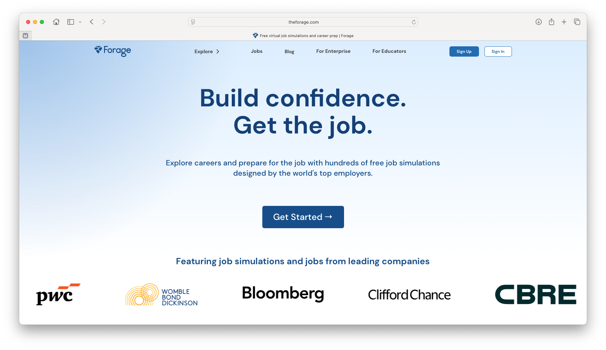

# Opportunities with Forage {#forage}

Forage let's you explore careers and prepare for jobs with hundreds of free job simulations designed by the world's top employers, see figure \@ref(fig:forage-fig). 


```{r forage-fig, echo = FALSE, fig.align = "center", out.width = "100%", fig.cap = "(ref:captionforage)"}

```

(ref:captionforage) Screenshot from [theforage.com](https://www.theforage.com/)

Job simulations at forage build real-life skills for real-life roles, offering a window into the company and a preview of their day-to-day. Job sims are 100% free, open access and self-paced.

1. Register for Forage and tell us a little about yourself
1. Enroll in a job sim and complete tasks that replicate real work
1. Compare your work with model answers and earn a certificate
1. Access curated resources and a chance to connect with recruiters


## Example simluation with HPE {#hpe}

There are lots of job simulations available, here's an example from Hewlett Packard Enterprise (HPE). 

* Design a RESTful web service using Java Spring Boot and GreenLake Cloud Platform as a back-end developer at HPE.  


## Why complete this job simulation?

A risk-free way to experience work on the job with HPE. Practice your skills with example tasks and build your confidence to ace your applications. Self-paced, 6-7 hours, No grades, No assessments, Intermediate level.

Welcome to the Hewlett Packard Enterprise Software Engineering Job Simulation. HPE is a global edge-to-cloud company built to transform businesses. We help our customers connect, protect, analyze, and act on all data and applications wherever they live to turn insights into outcomes at the speed required to thrive in today’s complex world.

Skills you'll learn and practice include: Spring Boot, HPE Green Lake, Communication, API Development, Java Programming, REST API development, JSON, HTTP, Unit Testing and Test Frameworks.

## How it works

How does it work?  

* Complete tasks guided by pre-recorded videos and example answers from our team at Hewlett Packard Enterprise . No live sessions, all self-paced.
* Earn a certificate and add it to your resume and LinkedIn as an extra curricular activity.
* Stand out in applications. Confidently answer interview questions and explain why you’re a good fit for our team.

Find out more at [bit.ly/forage-hp](https://bit.ly/forage-hp)