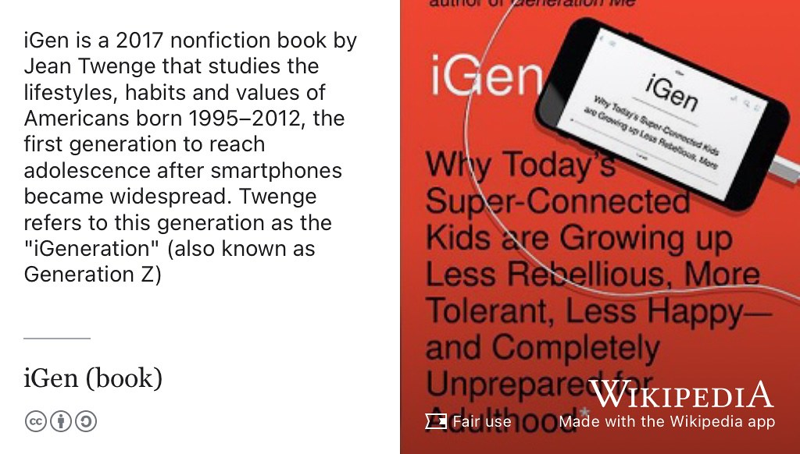

# Ivo's story {#ivo}

Meet Ivaylo Iliev, see figure \@ref(fig:ivo-fig) he graduated with a Bachelor of Science degree in Computer Science in 2023 when this episode was first recorded. Ivo spent a summer interning at [aws.amazon.com](https://aws.amazon.com/) in London.

```{r ivo-fig, echo = FALSE, fig.align = "center", out.width = "100%", fig.cap = "(ref:captionivo)"}
knitr::include_graphics("images/ivo.jpeg")
```
(ref:captionivo) Ivaylo Iliev. Picture reused from [linkedin.com/in/ivaylo-iliev3](https://www.linkedin.com/in/ivaylo-iliev3/) with permission, thanks Ivo.

(ref:podcastblurb)

```{r, eval=knitr::is_html_output(excludes = "epub"), results='asis', echo=FALSE}
cat('<iframe title="Libsyn Player" style="border: none" src="https://html5-player.libsyn.com/embed/episode/id/27145818/height/90/theme/custom/thumbnail/yes/direction/forward/render-playlist/no/custom-color/000000/" height="90" width="100%" scrolling="no"  allowfullscreen="" webkitallowfullscreen="true" mozallowfullscreen="true" allowfullscreen="true" msallowfullscreen="true" style="border: none;"></iframe>')
```

## What's your story Ivo? {#ivo-story}


An edited podcast transcript will appear here in due course. In the meantime, an un-edited, [raw machine-generated transcript can be found here](https://github.com/dullhunk/cdyf/blob/master/raw-transcript-ivo.md). Ivo gave a guest lecture, shown in figure \@ref(fig:ivotalking-fig).

```{r ivotalking-fig, echo = FALSE, fig.align = "center", out.width = "100%", fig.cap = "(ref:captionivotalking)"}
knitr::include_graphics("images/ivo-talking.jpg")
```

(ref:captionivotalking) Ivo delivering a guest lecture as part of COMP101 in the engineering building [www.mecd.manchester.ac.uk](https://www.mecd.manchester.ac.uk/) in 2023. [@ivotimes]

<!--


 
```{r circlesquare-fig, echo = FALSE, fig.align = "center", out.width = "100%", fig.cap = "(ref:captioncirclesquare)"}

```

(ref:captioncirclesquare) circle square


```{r igen-fig, echo = FALSE, fig.align = "center", out.width = "100%", fig.cap = "(ref:captionigen)"}

```
(ref:captionigen) is igen [@igen]-->

## Disclaimer  


::: {.rmdcaution}

(ref:codingcaution)

(ref:transcript-disclaimer)  

:::

